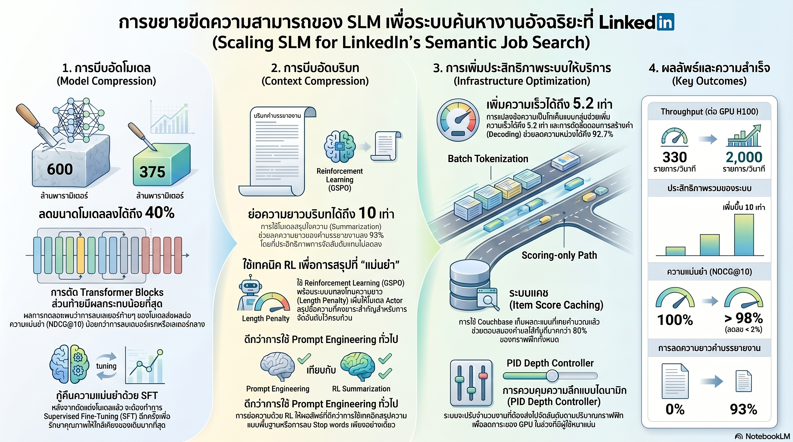

[กลับไปที่หน้าหลัก](../README.md)

สวัสดีครับเพื่อนๆ ที่ติดตามวงการ AI Engineering! วันนี้มาเรื่องที่นักวิศวกร ML ในโลกจริงต้องเจอเสมอ: "โมเดลที่ฉลาดมากแต่ช้าเกินไปสำหรับ Production" จากบทเรียนของทีมวิศวกร LinkedIn ที่ต้องสร้างระบบจัดอันดับงาน (Job Ranking) ที่ประมวลผล 3.15 ล้านรายการต่อวินาที — และเพิ่ม Throughput ขึ้นถึง 10 เท่า ด้วยการผสม 4 กลยุทธ์ที่ไม่มีกลยุทธ์ไหนใช้เทคโนโลยีใหม่เลยครับ แค่ใช้ของเดิมให้ฉลาดขึ้น

คุณเคยสังเกตไหมครับว่า ในโลก Research ทุกคนแข่งกันสร้างโมเดลที่ใหญ่ขึ้นและแม่นยำขึ้น แต่ในโลก Production ทุกคนแข่งกันทำให้โมเดลที่มีอยู่ทำงาน "ได้จริง" ในต้นทุนที่รับได้ — และสองโลกนี้ต้องการทักษะที่แทบไม่ซ้ำกันเลยครับ?

คุณรู้ไหมครับว่า ต้นทุน GPU ในการ Serve โมเดล AI ที่ใหญ่ขึ้นเพียง 10 เท่า อาจทำให้ค่าโครงสร้างพื้นฐานพุ่งขึ้นกว่า 100 เท่า เพราะ Self-attention มี Quadratic Complexity ตามความยาว Input — และนั่นคือเหตุผลที่ LinkedIn ต้องบีบอัด Job Description ลง 93% ก่อนที่จะให้โมเดลอ่านครับ?

และคุณเคยนึกไหมครับว่า Python's Garbage Collector สามารถทำให้ระบบ AI ที่ออกแบบมาแล้วดีเยี่ยมหยุดชะงักนาน 100-300ms โดยไม่คาดคิด — เพียงเพราะระบบตั้ง Memory ไว้ไม่ถูกต้อง และวิธีแก้คือแค่คำสั่ง `gc.freeze()` บรรทัดเดียวครับ?

งานวิจัยนี้กำลังบอกว่า: "โมเดลที่เหมาะสมที่สุด" สำคัญกว่า "โมเดลที่ใหญ่ที่สุด" — และเส้นทางจาก 200 items/sec ไปถึง 2,000 items/sec บน Hardware เดิม ไม่ได้มาจากการซื้อ GPU เพิ่ม แต่มาจากการเข้าใจว่าคอขวดที่แท้จริงอยู่ที่ไหนครับ

========================================

🤔 ทบทวนความเชื่อเดิมๆ: สิ่งที่เราคิดเกี่ยวกับ AI ใน Production

▪ "เพื่อให้ได้ผลลัพธ์ที่ดีที่สุดต้องใช้โมเดลที่ใหญ่ที่สุดเสมอ — ถ้าต้องประหยัด Compute ก็ต้องยอมสูญเสียคุณภาพ" → LinkedIn ลดขนาดโมเดลลง 45% (จาก 600M เหลือ 375M) แล้ว Fine-tune กลับคืน จนความแม่นยำสุดท้ายลดลงน้อยกว่า 1% ครับ — การเข้าใจว่า "เลเยอร์ไหนสำคัญ" คือกุญแจ ไม่ใช่การรักษาเลเยอร์ทั้งหมดไว้ครับ

▪ "Job Description ต้องส่งให้โมเดลเต็มๆ เพราะข้อมูลทุกส่วนอาจสำคัญ — การตัดทอนจะทำให้เสียบริบทที่จำเป็น" → LinkedIn ใช้ RL ฝึก Summarizer ที่บีบอัด JD ลง 93% โดยรักษาเฉพาะส่วนที่ Ranker ใช้จริงๆ ผลลัพธ์คือ Throughput พุ่งขึ้น 4.6 เท่า โดยคุณภาพการจัดอันดับแทบไม่เปลี่ยนครับ

▪ "ปัญหา Latency ของ AI ระบบใหญ่แก้ได้ด้วยการเพิ่ม GPU เท่านั้น — ถ้าต้องการความเร็วต้องลงทุน Hardware มากขึ้น" → Traffic Shaping เพียงอย่างเดียวเพิ่มขีดความสามารถจาก 1,600 เป็น 2,000 items/sec ต่อ H100 หนึ่งตัว โดยไม่ต้องซื้อ GPU เพิ่มแม้แต่ตัวเดียวครับ — การเกลี่ยงานให้สม่ำเสมอสำคัญกว่าการเพิ่มกำลังประมวลผลครับ

▪ "เลเยอร์ทั้งหมดในโมเดลมีความสำคัญเท่าๆ กัน — การตัดเลเยอร์ไหนออกก็ส่งผลเสียเท่ากัน" → LinkedIn วัด Layer Sensitivity แล้วพบว่าการตัดเลเยอร์แรกออกทำให้ NDCG@10 ตกถึง -0.3356 แต่การตัดเลเยอร์สุดท้ายออกส่งผลแค่ -0.0009 — ต่างกัน 373 เท่าครับ เลเยอร์ไม่ได้เท่ากันเลยครับ

ความจริงที่น่าคิดคือ: ความแตกต่างระหว่าง AI ระบบ Research กับ AI ระบบ Production ไม่ได้อยู่ที่โมเดล แต่อยู่ที่การเข้าใจว่า "ความฉลาดระดับไหนคือพอดี" สำหรับปัญหาที่มีอยู่จริงครับ

========================================

🧠 พื้นฐานที่ต้องเข้าใจก่อน: Structured Pruning, Context Compression, SGLang Optimization, Control Theory

=== บริบทปัญหา: 3.15 ล้านรายการต่อวินาที ===

ตัวเลข 3.15 ล้าน items/sec ฟังดูมหาศาล แต่เข้าใจได้ง่ายกว่าเมื่อแตกออกมาครับ: ทุกครั้งที่ผู้ใช้ LinkedIn ค้นหางาน ระบบต้องจัดอันดับงานหลายร้อยหลายพันรายการในเสี้ยววินาทีเพื่อแสดงผลที่ตรงกับโปรไฟล์ผู้ใช้มากที่สุด คูณด้วยผู้ใช้ทั่วโลกที่ค้นหาพร้อมกัน ตัวเลขจึงพุ่งสูงขนาดนั้นครับ

ทีมเริ่มจาก Teacher Model ขนาด 7B ที่ฉลาดพอสร้าง Graded Labels (ป้ายกำกับคุณภาพของงาน) แล้วทำ Knowledge Distillation ลงมาสู่ Student Model ขนาด 0.6B ก่อนครับ แต่แม้จะเล็กลง 12 เท่า ก็ยังไม่เร็วพอสำหรับ Production ที่ต้องการ Real-time Ranking

นี่คือที่มาของ 4 กลยุทธ์ที่ซ้อนทับกันครับ

=== กลยุทธ์ที่ 1: Structured Pruning ผ่าตัดโมเดลอย่างเป็นระบบ ===

ไม่ใช่การตัดแบบสุ่มครับ แต่เป็น Surgical Pruning ที่อาศัยความเข้าใจว่า "ส่วนไหนของโมเดลสำคัญจริงๆ"

MLP Layer Pruning ด้วย OSSCAR: ชั้น Feed-forward (MLP) ของ Transformer แต่ละเลเยอร์มี Hidden Neurons จำนวนมาก OSSCAR วิเคราะห์ว่า Neuron ไหนมีผลกระทบน้อยที่สุดต่อ Output แล้วตัดออก 50% ผลลัพธ์คือโมเดลเล็กลง 25% โดยสูญเสียความแม่นยำน้อยมากครับ

Layer Sensitivity Analysis — การค้นพบที่น่าทึ่งที่สุด: ทีม LinkedIn ทดสอบว่าถ้าตัดแต่ละเลเยอร์ออก จะส่งผลต่อ NDCG@10 (ตัวชี้วัดคุณภาพการจัดอันดับ) เท่าไหร่

ผลที่ได้ทำให้ทุกคนต้องคิดใหม่ครับ:
— ตัดเลเยอร์แรกออก: NDCG@10 ตก -0.3356 (หายนะ)
— ตัดเลเยอร์สุดท้ายออก: NDCG@10 ตก -0.0009 (แทบไม่รู้สึก)

ต่างกัน 373 เท่า! เหมือนการรู้ว่าในสะพาน 20 เสา เสาที่ 1 รับน้ำหนักทั้งหมด ส่วนเสาที่ 20 แทบไม่ได้แบกรับอะไรเลยครับ ถ้ารู้แบบนี้ การออกแบบใหม่ก็ต่างออกไปโดยสิ้นเชิง

สรุปผล Pruning: ตัด MLP ครึ่งหนึ่ง + ตัด 8 Transformer Blocks สุดท้ายออก → โมเดลเหลือ 375M params (ลดลง 45%) → Fine-tune ด้วย SFT เพื่อกู้ความแม่นยำคืน → ประสิทธิภาพสุดท้ายลดลงน้อยกว่า 1% และ Throughput เพิ่มขึ้น 27%

=== กลยุทธ์ที่ 2: Context Compression บีบอัด JD ด้วย RL ===

ปัญหาที่ซ่อนอยู่ใน Transformer ครับ: Self-attention มี Quadratic Complexity หมายความว่า Input ที่ยาวขึ้น 2 เท่าต้องการ Compute มากขึ้น 4 เท่า Job Description บางชิ้นยาวมาก และค่า Time-to-First-Token (TTFT) จะพุ่งขึ้นเป็นกำลังสองตามความยาว

วิธีแก้ของ LinkedIn คือฝึก Summarizer Model ด้วย Reinforcement Learning (GSPO Algorithm) เพื่อบีบอัด JD ให้สั้นที่สุดโดยรักษาเฉพาะข้อมูลที่ Ranker ใช้จริงๆ ครับ

ประเด็นที่น่าสนใจคือการเลือก Reward Function ครับ ทีมทดลองสองแบบ:

P1 (Margin-seeking Reward): ให้รางวัลเฉพาะเมื่อบีบอัดได้ต่ำกว่าเกณฑ์ที่กำหนด — ปัญหาคือ Gradient ไม่ต่อเนื่อง โมเดลเรียนรู้ได้ยากครับ เหมือนบอกนักเรียนว่า "ถ้าสอบได้เกิน 70 จะได้รางวัล" โดยไม่บอกว่าจะดีขึ้นอย่างไร

P2 (Quadratic Norm: -w·r²): ให้ค่าปรับแบบ Quadratic ตามอัตราการบีบอัด — ยิ่งบีบอัดได้มากยิ่งได้รางวัลมาก แต่ในอัตราที่เพิ่มขึ้นเรื่อยๆ ทำให้ Gradient ต่อเนื่องและ Stable ครับ เหมือนบอกนักเรียนว่า "ยิ่งทำได้ดียิ่งได้รางวัลมากขึ้น" แบบที่วัดได้ชัดเจน

LinkedIn เลือก P2 เพราะ Gradient ที่ต่อเนื่องทำให้ Training Stable มากกว่า ผลลัพธ์: บีบอัด Context ลงได้ถึง 93% — JD ที่เคยยาว 1,000 คำเหลือแค่ 70 คำ แต่ Ranker ยังตัดสินได้แม่นยำ เพราะ Summarizer เรียนรู้ว่าส่วนไหนของ JD ที่ Ranker สนใจจริงๆ ครับ

เมื่อรวม Pruning + Summarization: Throughput พุ่งขึ้นเป็น 4.6 เท่า (1,530 items/sec)

=== กลยุทธ์ที่ 3: SGLang Engine Optimization ปรับ Serving Infrastructure ===

งาน Job Ranking ต่างจาก Chatbot โดยพื้นฐานครับ Chatbot ต้อง Generate คำตอบ (Decode Phase) แต่ Ranking ต้องการแค่ Score (Logit) จาก Token สุดท้าย ซึ่งหมายความว่าสามารถตัด Decode Phase ออกได้ทั้งหมดครับ

การปรับ SGLang บน NVIDIA H100 สำหรับงาน Prefill-only:

Batch Tokenization: แทนที่จะ Tokenize ทีละ Request ระบบรวม Token ทั้ง Batch มาประมวลผลพร้อมกัน ที่ Batch Size 8 ความเร็วเพิ่มขึ้น 5.2 เท่าเพียงจากการเปลี่ยนวิธี Tokenize ครับ

Memory Synchronization Optimization: ระบบเดิมต้องคัดลอกข้อมูลระหว่าง CPU RAM และ GPU VRAM บ่อยเกินจำเป็น การลด Unnecessary Memory Copy ทำให้ p99 Latency (ความล่าช้าในกรณีแย่ที่สุด 1%) ลดลงถึง 92.7% ครับ

In-batch Prefix Caching ด้วย Log-Sum-Exp: เทคนิคที่ฉลาดมากครับ ใน Batch เดียวกัน Request หลายตัวมักมี Prefix เหมือนกัน (เช่น System Prompt และ Query ของผู้ใช้) แทนที่จะคำนวณ KV Cache ซ้ำๆ สำหรับทุก Request ระบบแชร์ KV Cache ของ Prefix ร่วมกัน แล้วใช้การ Merge Attention ผ่าน Log-Sum-Exp เพื่อรวม Dense Paged Attention (Suffix to Prefix) กับ Regular Causal Attention (Suffix to Suffix) เข้าด้วยกัน

GC Stalls Fix ด้วย `gc.freeze()`: ปัญหาที่ไม่มีใครคาดคิดครับ Python Garbage Collector ที่ทำงานอัตโนมัติจะหยุดระบบทั้งหมดเป็นเวลา 100-300ms ทุกครั้งที่ต้องสแกน Object จำนวนมากใน Memory เพื่อกู้คืนพื้นที่ ในระบบที่มี Object เป็นล้านชิ้น เวลา 300ms คือหายนะ การเรียก `gc.freeze()` บอกให้ Python ไม่ต้อง Scan Objects ที่มีอยู่แล้ว (เพราะรู้ว่ามันไม่ได้เป็น Garbage) ตัดปัญหานี้ออกได้โดยสิ้นเชิงครับ

=== กลยุทธ์ที่ 4: Control Theory จัดการ Traffic อย่างชาญฉลาด ===

แม้โมเดลจะเร็วแค่ไหน Traffic ที่ผันผวนก็ยังสร้างปัญหาได้ครับ LinkedIn นำหลักการ Control Theory จากวิศวกรรมควบคุม (ที่ปกติใช้กับระบบอุตสาหกรรม) มาใช้กับ AI Serving:

Item Score Caching บน Couchbase: ถ้าโมเดลเพิ่ง Score งานชิ้นหนึ่งให้กับ Request ล่าสุด คะแนนนั้นน่าจะยังใช้ได้กับ Request ถัดๆ มาในช่วง 15 นาที LinkedIn เก็บผลลัพธ์ไว้ใน Couchbase (Distributed Cache) ด้วย TTL 15 นาที ช่วยลดภาระงาน GPU ลงกว่า 50% ครับ เหมือนการจำคำตอบที่เพิ่งคิดมาแทนที่จะคิดซ้ำทุกครั้งครับ

Dynamic Scoring Depth ด้วย PID Controller: ในช่วง Peak Traffic ถ้าระบบยังพยายาม Score งานทุกรายการเท่าเดิม Latency จะพุ่งเกิน SLA ครับ PID Controller (Proportional-Integral-Derivative) ที่ LinkedIn ใช้ทำงานเหมือน Autopilot ของเครื่องบิน — ตรวจสอบ Latency ปัจจุบัน เปรียบเทียบกับเป้าหมาย แล้วปรับจำนวน Items ที่ต้อง Score โดยอัตโนมัติ ช่วงปกติ Score 250 รายการ ช่วง Peak ลดลงเหลือ 131 รายการ เพื่อรักษา Latency ไว้ครับ

Traffic Shaping: เทคนิคเกลี่ย Request ให้สม่ำเสมอแทนที่จะปล่อยให้มาเป็นกระแสผันผวน ช่วยลดทั้งช่วง GPU ว่างงาน (Underutilization) และช่วงงานล้น (Overload) เทคนิคนี้เพียงอย่างเดียวเพิ่มขีดความสามารถจาก 1,600 เป็น 2,000 items/sec ต่อ H100 ครับ

========================================

📊 ผลลัพธ์สุดท้าย: 10 เท่าจากสี่กลยุทธ์ที่ซ้อนกัน

Baseline: ~200 items/sec
หลัง Pruning: +27% (ประมาณ 254 items/sec)
หลัง Pruning + Summarization: 1,530 items/sec (4.6x จาก Baseline)
หลัง Traffic Shaping: 2,000 items/sec ต่อ H100 (10x จาก Baseline)

สิ่งที่น่าสนใจคือ ไม่มีกลยุทธ์ไหนที่ใช้เทคโนโลยีที่ประดิษฐ์ขึ้นมาใหม่เลยครับ ทุกอย่างเป็นการ "ใช้ของเดิมให้ฉลาดขึ้น" — OSSCAR, GSPO, SGLang, PID Controller ล้วนมีอยู่แล้ว แต่ทีม LinkedIn รู้ว่าจะนำมาผสมกันอย่างไรให้ได้ผลสูงสุดครับ

========================================

🎯 ประเด็นที่ควรคิดต่อ

บทเรียนจาก LinkedIn สะท้อนความจริงที่วงการ AI มักมองข้ามครับ:

— "Efficiency-first" ไม่ใช่แค่เรื่องของต้นทุน แต่คือการเข้าถึง: โมเดลที่เร็วขึ้น 10 เท่าหมายถึงการที่คนอีกหลายล้านคนได้รับประสบการณ์ที่ดีขึ้น บน Hardware ที่มีอยู่แล้ว ความ Efficiency ในโลก Production คือรูปแบบหนึ่งของการ Democratize AI ครับ

— Layer Sensitivity คือ Knowledge ที่มีค่ามากในโลก Production: การรู้ว่าเลเยอร์ไหนสำคัญกว่าในโมเดลเฉพาะทางของตัวเองนั้น ไม่มีในตำราครับ มันต้องมาจากการวัดจริงในบริบทงานนั้นๆ และมันคือข้อได้เปรียบที่คนอื่นลอกไปไม่ได้ง่ายๆ

— คำถามสำคัญสำหรับวิศวกร AI ในยุคนี้: เมื่อโมเดลที่ Efficient ทำได้ดีเท่ากับโมเดลที่ใหญ่กว่าในงาน Production จริงๆ คำถามที่ต้องถามไม่ใช่ "จะใช้โมเดลใหญ่ขนาดไหน" แต่คือ "คอขวดที่แท้จริงของระบบเราอยู่ที่ไหน — โมเดล, Context, Infrastructure, หรือ Traffic Pattern?" และถ้าหาคอขวดเจอก่อน การแก้ปัญหาอาจถูกกว่าและได้ผลดีกว่าการซื้อ GPU เพิ่มมากครับ

#LinkedIn #MLEngineering #ModelPruning #ContextCompression #SGLang #ControlTheory #AIInfrastructure #SmallLanguageModels #Throughput #Efficiency #ProductionML #AIOptimization
