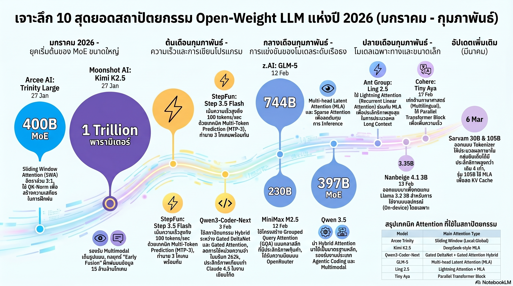

[กลับไปที่หน้าหลัก](../README.md)

สวัสดีครับเพื่อนๆ ที่ติดตามวงการ AI! วันนี้มาเรื่องที่สะท้อนว่าโลก AI กำลังเปลี่ยนด้วยความเร็วที่เกินกว่าจะตามทัน: "ฤดูใบไม้ผลิแห่ง Open-Weight" ต้นปี 2026 ที่โมเดล Open-Source ไม่ได้แค่ไล่ตาม Proprietary Model อีกต่อไป แต่เริ่มเขียนกติกาใหม่ทั้งเกมครับ

คุณเคยสงสัยไหมครับว่า กลไก Attention ที่เป็นหัวใจของ Transformer ตั้งแต่ปี 2017 กำลังถูกแทนที่ด้วยสถาปัตยกรรม Hybrid ที่ผสม Recurrent และ Attention เข้าด้วยกัน และที่ทำให้น่าตกใจคือทีม Qwen เลือกใช้มันเป็นแกนหลักในสายการผลิต ไม่ใช่แค่ทดลอง?

คุณรู้ไหมครับว่า Step 3.5 Flash ที่มีขนาดแค่ 196B ทำความเร็ว 100 tokens/sec ใน Context 128k ซึ่งเร็วกว่า DeepSeek V3.2 ที่ใหญ่กว่า 3 เท่าถึง 3 เท่า และความลับอยู่ที่การใช้ Multi-Token Prediction ทั้งในการเทรนและ Inference ซึ่งโมเดลส่วนใหญ่ไม่กล้าทำในขั้นตอนหลังครับ?

และคุณเคยนึกไหมครับว่า โมเดล Open-Weight สำหรับเขียนโค้ดในปี 2026 ทำคะแนนใกล้เคียง Claude Sonnet 4.5 บน SWE-Bench จนถึงขนาดที่นักพัฒนาสามารถรัน "เครื่องมือช่วยเขียนโค้ดระดับโลก" บนเครื่องตัวเองได้แบบไม่ต้องพึ่งบริษัทใดทั้งนั้นครับ?

รายงาน Open-Weight Spring 2026 ของ Sebastian Raschka กำลังบอกเราว่า: การแข่งขัน AI ในปี 2026 ไม่ได้วัดกันที่ "ใครใช้พารามิเตอร์มากที่สุด" แต่วัดกันที่ "ใครออกแบบสถาปัตยกรรมและเทคนิคที่ฉลาดที่สุดต่อทรัพยากรที่มี" ครับ

========================================

🤔 ทบทวนความเชื่อเดิมๆ: สิ่งที่เราคิดเกี่ยวกับ Open-Source AI และสถาปัตยกรรมของโมเดล

▪ "Standard Transformer Attention คือสถาปัตยกรรมที่ดีที่สุดและจะอยู่ไปอีกนาน ไม่มีอะไรที่ดีกว่าในทางปฏิบัติ" → Qwen3.5 ใช้ Gated DeltaNet + Gated Attention ในอัตราส่วน 3:1 และ Ling 2.5 ใช้ Lightning Attention แทน Standard Attention แสดงว่าทั้งสองทีมได้พิสูจน์ในระดับ Production แล้วว่า Hybrid Architecture ดีกว่าในมิติที่สำคัญครับ

▪ "โมเดลขนาดเล็กยังด้อยกว่าโมเดลใหญ่เสมอ ถ้าต้องการผลงานระดับ State-of-the-art ต้องใช้โมเดลขนาดใหญ่เท่านั้น" → Nanbeige 4.1 3B ทำคะแนน Benchmark ทิ้งห่าง Llama 3.2 3B อย่างมีนัยสำคัญ และ Tiny Aya 3.35B ด้วย Parallel Transformer Block พิสูจน์ว่าการออกแบบ Architecture ที่ดีสามารถดึงประสิทธิภาพออกมาจากโมเดลเล็กได้เกินที่คาดครับ

▪ "Multi-Token Prediction เป็นแค่เทคนิคเร่งการเทรน ไม่ควรใช้ใน Inference จริงเพราะจะทำให้คุณภาพลดลง" → Step 3.5 Flash เป็นข้อยกเว้นที่หายากที่ใช้ MTP-3 ทั้งในการเทรนและ Inference จริง และทำความเร็ว 100 tokens/sec บน Context 128k เร็วกว่า DeepSeek V3.2 ที่ใหญ่กว่าถึง 3 เท่าครับ

▪ "งานเขียนโค้ดระดับสูงยังต้องพึ่ง Proprietary Model เสมอ เพราะต้องการความเข้าใจเชิงลึกที่โมเดล Open-Source ยังตามไม่ทัน" → Qwen3-Coder-Next ทำคะแนนใกล้เคียง Claude Sonnet 4.5 อย่างน่าตกใจ และ MiniMax M2.5 กลายเป็น "Bang for the buck" บน OpenRouter สำหรับนักพัฒนาที่ต้องการโมเดล Coding คุณภาพสูงในราคาที่คุ้มครับ

ความจริงที่น่าคิดคือ: ในปี 2026 การเลือก AI ไม่ใช่แค่ "Open vs Closed" แต่คือการเลือกว่า "สถาปัตยกรรมแบบไหน เทคนิคแบบไหน และ Trade-off แบบไหนที่เหมาะกับงานของคุณที่สุด" ครับ

========================================

🧠 พื้นฐานที่ต้องเข้าใจก่อน: Quadratic Cost, Hybrid Attention, MTP, และ Open-Weight

=== Quadratic Cost ของ Standard Attention คืออะไร? ===

Standard Attention = เมื่อข้อมูล Input ยาวขึ้น 2 เท่า ต้นทุนการคำนวณเพิ่มขึ้น 4 เท่า (ยาวขึ้น 10 เท่า = แพงขึ้น 100 เท่า)

ทำไมถึงเป็นปัญหา: สำหรับ Context Window ที่ยาวมาก (128k+ tokens) ต้นทุนนี้กลายเป็นอุปสรรคทั้งด้านความเร็วและค่าใช้จ่าย

เปรียบเทียบ: เหมือนการจัดงานเลี้ยงที่กฎคือ "ทุกคนต้องคุยกับทุกคน" ถ้าเชิญ 10 คนมีการคุย 100 คู่ ถ้าเชิญ 100 คนมีการคุย 10,000 คู่ — ไม่มีงบประมาณไหนรับได้ครับ

=== Hybrid Attention แก้ปัญหาอย่างไร? ===

แทนที่จะให้ทุก Layer ใช้ Standard Attention ระบบ Hybrid ผสมกัน:

[Standard Attention Layers (ส่วนน้อย)]
▸ ดีที่: จำและเชื่อมโยงข้อมูลจากตำแหน่งต่างๆ ได้ยืดหยุ่น
▸ แพงที่: ต้นทุน Quadratic ตามความยาว Input ครับ

[Linear/Recurrent Layers (ส่วนใหญ่)]
▸ ดีที่: ต้นทุนเพิ่มแบบ Linear ตามความยาว ไม่ใช่ Quadratic
▸ จำกัดที่: เชื่อมโยงข้อมูลระยะไกลได้น้อยกว่า Standard Attention ครับ

ผลลัพธ์ของ Hybrid: ได้ทั้งคุณภาพจาก Attention และความเร็ว/ประหยัดจาก Linear โดยยอม Trade-off น้อยมากครับ

=== Multi-Token Prediction (MTP) คืออะไร? ===

โมเดลทั่วไป: ทำนายโทเค็นถัดไปทีละตัว (t+1)
MTP-3: ทำนาย t+1, t+2 และ t+3 พร้อมกันในขั้นตอนเดียว

ประโยชน์ในการเทรน: โมเดลเรียนรู้ "โครงสร้างระยะกลาง" ได้ดีขึ้น ไม่ใช่แค่คำถัดไปคำเดียว
ประโยชน์ใน Inference: ถ้า Speculative Decoding ทำงานได้ดี สามารถข้ามหลาย Token ต่อขั้นตอน = เร็วขึ้นโดยตรงครับ

=== Open-Weight vs Open-Source vs Closed Source ===

Open-Source = โค้ดและน้ำหนักโมเดลเผยแพร่ทั้งหมด
Open-Weight = เผยแพร่เฉพาะน้ำหนักโมเดล แต่โค้ดและข้อมูลเทรนอาจไม่ครบ
Closed Source = ไม่เผยแพร่อะไรเลย เข้าถึงได้ผ่าน API เท่านั้น

ความสำคัญ: Open-Weight ให้นักพัฒนารันบนเครื่องตัวเอง ปรับแต่งได้ และไม่ต้องจ่ายค่า API ซึ่งเป็นความเปลี่ยนแปลงเชิงอำนาจที่ใหญ่มากครับ

========================================

1️⃣ Hybrid Attention Is the New King: เมื่อ Transformer คลาสสิกเริ่มถูกแทนที่

=== จุดเปลี่ยนที่ Qwen ส่งสัญญาณ ===

สิ่งที่ทำให้ Qwen3.5 น่าสนใจไม่ใช่คะแนน Benchmark แต่คือ "สิ่งที่ทีมเลือกใช้เป็นแกนหลักในสายการผลิต" ครับ

[Qwen3.5: Gated DeltaNet + Gated Attention ในอัตราส่วน 3:1]
▸ 3 ใน 4 ของ Layers ใช้ Gated DeltaNet (Linear/Recurrent)
▸ 1 ใน 4 ของ Layers ใช้ Gated Attention (Standard)
▸ สัญญาณ: ทีม Qwen ทดสอบแล้วและเชื่อมั่นพอที่จะใช้กับ Production Model ครับ

[Gated DeltaNet คืออะไร?]
▸ ทางเลือกใหม่แทน Mamba (ซึ่งเป็น State Space Model ที่ฮือฮาในปี 2023-2024)
▸ ใช้กฎการอัปเดตแบบ Delta Rule ซึ่งปรับน้ำหนักตาม "ความแตกต่าง" ไม่ใช่ค่าสมบูรณ์
▸ Gate ควบคุมว่าข้อมูลไหนควรผ่านและไม่ผ่านในแต่ละก้าว ช่วยให้ยืดหยุ่นกว่า Mamba ครับ

[Ling 2.5 ของ Ant Group: Lightning Attention]
▸ Recurrent Linear Attention ที่เรียบง่ายแต่ออกแบบมาเพื่อประสิทธิภาพสูงสุด
▸ ตัดความซับซ้อนที่ไม่จำเป็นออกและเน้น Throughput ในทางปฏิบัติครับ

=== นัยสำคัญ: ยุคที่ Architecture ไม่หยุดนิ่ง ===

ในอดีต Transformer ดูเหมือน "คำตอบสุดท้าย" แต่ปี 2026 แสดงให้เห็นว่าแม้ทีมที่มีทรัพยากรมากที่สุดในโลกยังไม่หยุดทดลองสถาปัตยกรรมใหม่ และเมื่อผลลัพธ์ดีกว่าในทางปฏิบัติ พวกเขาก็เปลี่ยนโดยไม่ลังเลครับ

เปรียบเทียบ: เหมือนวงการสถาปัตยกรรมอาคารที่เปลี่ยนจากคอนกรีตล้วนมาเป็น Composite Materials ที่ผสมวัสดุหลายประเภทตามหน้าที่ของแต่ละส่วน แทนที่จะใช้วัสดุเดียวตลอดทั้งหลังครับ

========================================

2️⃣ Tiny Aya และ Nanbeige: โมเดลจิ๋วที่ไม่ยอมเป็นรองอีกต่อไป

=== เมื่อ 3B Parameters ทำสิ่งที่ 70B เคยทำได้ ===

ความเชื่อดั้งเดิมคือ "ประสิทธิภาพสูงต้องการพารามิเตอร์มาก" ปี 2026 ท้าทายความเชื่อนั้นอย่างตรงไปตรงมาครับ

[Tiny Aya 3.35B จาก Cohere]

▸ จุดเด่น: Multilingual ระดับโลก รองรับภาษาท้องถิ่นทั่วโลก ตั้งแต่เอเชียใต้ถึงแอฟริกา
▸ สถาปัตยกรรมพิเศษ: Parallel Transformer Block

[Parallel Transformer Block คืออะไร?]
▸ โมเดลทั่วไป: คำนวณ Attention ก่อน แล้วค่อยคำนวณ MLP (Feed-forward)
▸ Parallel Block: คำนวณ Attention และ MLP พร้อมกันในขั้นตอนเดียว
▸ ผลลัพธ์: ลดการพึ่งพาลำดับขั้นตอนภายใน Layer → เร็วขึ้นโดยไม่เสียคุณภาพครับ

[การยอมแลก QK-Norm เพื่อ Long Context]
▸ QK-Norm = RMSNorm ที่ใช้กับ Keys และ Queries เพื่อสร้างเสถียรภาพในการเทรน
▸ ทีม Cohere พบว่า QK-Norm รบกวนประสิทธิภาพเมื่อ Input ยาวมาก
▸ ตัดสินใจทิ้ง QK-Norm → เสถียรภาพลดลงเล็กน้อย แต่ Long Context Performance ดีขึ้นมากกว่าที่สูญเสียไปครับ

[Nanbeige 4.1 3B]
▸ ท้าชน Llama 3.2 3B บน Benchmark อย่างมีนัยสำคัญ
▸ พิสูจน์ว่า Base Architecture ของ Llama ไม่ใช่เพดานสูงสุดของโมเดลขนาด 3B ครับ

=== ความหมายสำหรับนักพัฒนาและ Edge Deployment ===

โมเดลขนาด 3-4B ที่ทำงานได้ดีในระดับนี้หมายความว่า:
▸ สามารถรันบนสมาร์ทโฟนหรือ Laptop ธรรมดาได้อย่างลื่นไหล
▸ ต้นทุน Inference ลดลงอย่างมีนัยสำคัญสำหรับ Production System
▸ AI ที่ "รันได้เอง" กลายเป็นความจริงที่ใกล้ขึ้นทุกเดือนครับ

เปรียบเทียบ: เหมือนกล้องดิจิทัลราคาพันบาทในปี 2020 ที่ถ่ายภาพได้คุณภาพเท่ากล้อง DSLR ราคาหมื่นบาทในปี 2010 การออกแบบที่ดีขึ้นชดเชยข้อจำกัดด้านทรัพยากรได้ครับ

========================================

3️⃣ MTP-3 ใน Step 3.5 Flash: ความเร็ว 3 เท่าจากหลักการที่เรียบง่ายแต่กล้าใช้จริง

=== สูตรลับที่คนอื่นรู้แต่ไม่กล้าทำ ===

Multi-Token Prediction ไม่ใช่ไอเดียใหม่ แต่ Step 3.5 Flash ทำสิ่งที่โมเดลส่วนใหญ่ไม่กล้า: เอา MTP มาใช้ใน Inference จริงๆ ไม่ใช่แค่ตอนเทรนครับ

[ตัวเลขที่น่าทึ่ง]
▸ Step 3.5 Flash: 196B Parameters
▸ DeepSeek V3.2: 671B Parameters (ใหญ่กว่า 3+ เท่า)
▸ ความเร็วของ Step 3.5 Flash: 100 tokens/sec บน Context 128k
▸ เร็วกว่า DeepSeek V3.2: 3 เท่า ด้วยโมเดลที่เล็กกว่า 3 เท่าครับ

[MTP-3 ทำงานอย่างไรใน Inference?]
▸ ขณะสร้าง Output แต่ละก้าว แทนที่จะทำนายแค่ t+1
▸ ทำนาย t+1, t+2, และ t+3 พร้อมกัน
▸ ถ้าการทำนาย t+2 และ t+3 ถูก ก็ข้ามก้าวเหล่านั้นได้
▸ ผลลัพธ์: Throughput สูงขึ้นโดยไม่ต้องเพิ่มขนาดโมเดลครับ

[ทำไมโมเดลส่วนใหญ่ไม่ใช้ MTP ใน Inference?]
▸ ความเสี่ยง: ถ้าการทำนาย t+2 ผิด จะส่งผล Cascade ไปที่ t+3 ด้วย
▸ ต้องการการออกแบบ Sampling Strategy พิเศษที่รองรับการยกเลิกและแก้ไข
▸ Step 3.5 Flash แก้ปัญหานี้ได้และยืนยันด้วย Production Performance ครับ

เปรียบเทียบ: เหมือนพนักงานพิมพ์ดีดที่แทนที่จะพิมพ์ทีละตัวอักษร เขาอ่านประโยคล่วงหน้า 3 คำแล้วพิมพ์ทั้งสามคำด้วยการกดครั้งเดียว ถ้าเขาอ่านถูก ได้งาน 3 เท่า ถ้าผิดก็แค่ล้มลงแก้ 3 ตัวครับ

========================================

4️⃣ Open-Weight Coding Models ท้าชน Claude Sonnet 4.5: เมื่อ SWE-Bench เริ่มไม่พอ

=== การรุกคืบที่ Proprietary Model ต้องเหลียวมอง ===

ในอดีตงานเขียนโค้ดระดับสูงเป็นพื้นที่ที่ Proprietary Model ครองอำนาจอย่างชัดเจน แต่ปี 2026 เส้นแบ่งนั้นเริ่มเลือนลางครับ

[ผู้เล่นหลัก]
▸ Qwen3-Coder-Next: ทำคะแนน SWE-Bench ไล่เลี่ยกับ Claude Sonnet 4.5 อย่างน่าตกใจ
▸ MiniMax M2.5 (230B): "Bang for the buck" บน OpenRouter สำหรับนักพัฒนาที่ต้องการคุณภาพในราคาคุ้ม

=== ปัญหา SWE-Bench Saturation: เมื่อไม้บรรทัดสั้นเกินไป ===

[SWE-Bench Verified กำลังถึงจุดอิ่มตัว]
▸ ปัญหาเรื่องโจทย์ที่แก้ไม่ได้ (Unsolvable Issues) ปนอยู่ในชุดทดสอบ
▸ โมเดลดีๆ ทำคะแนนใกล้เคียงกันหมดจนแยกความแตกต่างไม่ออก
▸ เหมือนการแข่งวิ่งที่ทุกคนเข้าเส้นชัยพร้อมกันเพราะระยะทางสั้นเกินไป

[ทางแก้: SWE-Bench Pro]
▸ โจทย์ที่ยากและซับซ้อนกว่า ออกแบบมาเพื่อแยกความสามารถที่แท้จริงออกจากกัน
▸ MiniMax M2.5 แสดงผลงานน่าทึ่งใน SWE-Bench Pro ยืนยันว่าคะแนนไม่ใช่แค่ Overfitting ครับ

[ความหมายสำหรับนักพัฒนา]
▸ "เครื่องมือช่วยเขียนโค้ดระดับโลก" ที่รันบนเครื่องตัวเองไม่ใช่ความฝันอีกต่อไป
▸ ลดการพึ่งพา API ของบริษัทใหญ่สำหรับงาน Coding ใน Local Environment
▸ Privacy สำหรับ Codebase ที่เป็น IP ของบริษัทกลายเป็นเรื่องที่เป็นไปได้จริงครับ

เปรียบเทียบ: เหมือนวันที่ Software ที่เคยต้องซื้อ License ราคาแพงจากบริษัทใหญ่กลายเป็น Open-Source ที่ทุกคนใช้ได้ฟรี ประสิทธิภาพอาจยังไม่เท่า แต่ความแตกต่างกำลังหดแคบลงทุกเดือนครับ

========================================

5️⃣ Sarvam และ Global Spring: เมื่อ "ฤดูใบไม้ผลิ" ไม่ได้บานแค่ Silicon Valley

=== เมื่อ AI ไม่ได้เป็นของ Silicon Valley หรือจีนเท่านั้น ===

หนึ่งในสัญญาณที่สำคัญที่สุดของปี 2026 คือการเติบโตของ AI จากภูมิภาคอื่นนอกจาก Silicon Valley และจีน Sarvam จากอินเดียคือกรณีศึกษาที่ชัดเจนที่สุดครับ

[Sarvam และการปฏิวัติ Tokenizer]
▸ เน้นความเก่งกาจในภาษาท้องถิ่นของอินเดีย (India Regional Languages)
▸ Tokenizer ที่ออกแบบมาเฉพาะสำหรับภาษาท้องถิ่นมีประสิทธิภาพสูงกว่า General Tokenizer ถึง 4 เท่า

[ทำไม Tokenizer จึงสำคัญ?]
▸ Tokenizer ที่ไม่ได้ออกแบบสำหรับภาษาหนึ่งๆ จะใช้ Token มากกว่าในการแทนข้อความเดียวกัน
▸ ผลกระทบ: ต้นทุนสูงกว่า, ความยาว Context ที่ใช้ได้จริงสั้นกว่า, ประสิทธิภาพต่ำกว่า
▸ Tokenizer ที่เฉพาะทาง 4 เท่า = ประหยัดต้นทุน 4 เท่าและ Context ยาวขึ้น 4 เท่าในภาษานั้นๆ ครับ

[นัยสำหรับ Global AI]
▸ ภาษาที่มีผู้ใช้มากแต่ถูกละเลยใน General Model เช่น ภาษาไทย ภาษาอินเดีย ภาษาแอฟริกัน กำลังได้รับความสนใจมากขึ้น
▸ การสร้าง AI ที่เก่งจริงในภาษาท้องถิ่นไม่ต้องรอให้ Silicon Valley มาทำให้ ทีมท้องถิ่นทำได้ดีกว่าครับ

[ภาพรวม: ทิศทางของ AI Architecture ปี 2026]
▸ Heterogeneous Architecture: ผสมหลาย Component ตามหน้าที่ ไม่ใช่ One-size-fits-all
▸ Efficiency-first: คุณภาพต่อทรัพยากรที่ใช้ ไม่ใช่แค่คุณภาพสูงสุดโดยไม่คำนึงต้นทุน
▸ Task-specific Optimization: ออกแบบมาเพื่องานเฉพาะ (Coding, Multilingual, Long Context)
▸ Open-Weight Parity: ระยะห่างจาก Proprietary Model กำลังลดลงทุกไตรมาสครับ

เปรียบเทียบ: เหมือนวงการสมาร์ทโฟนที่ Samsung และ Apple เคยครองตลาดด้วยระยะห่างมหาศาล แต่ตอนี้แบรนด์จากจีน อินเดีย และที่อื่นๆ ทำสมาร์ทโฟนคุณภาพสูงในราคาที่ทุกคนเข้าถึงได้ และนวัตกรรมไม่ได้มาจากจุดเดียวอีกต่อไปครับ

========================================

🎯 สรุป: เมื่อนิยามของ AI ถูกเขียนขึ้นใหม่ทุกสัปดาห์

Open-Weight Spring 2026 สรุปด้วย 5 การเปลี่ยนแปลงหลัก: Hybrid Attention (Gated DeltaNet + Standard Attention 3:1 ใน Qwen3.5, Lightning Attention ใน Ling 2.5) กำลังแทนที่ Standard Attention ใน Production, Small Models (Tiny Aya 3.35B, Nanbeige 4.1 3B) พิสูจน์ว่า Architecture ที่ดีชนะ Parameter Count, MTP-3 ใน Step 3.5 Flash ทำ 100 tokens/sec เร็วกว่า DeepSeek V3.2 ที่ใหญ่กว่า 3 เท่า, Open-Weight Coding Models ไล่ทัน Claude Sonnet 4.5 จนต้องย้าย Benchmark ไป SWE-Bench Pro, และ Global Players อย่าง Sarvam พิสูจน์ว่า Tokenizer ที่เฉพาะทางให้ Efficiency สูงกว่าถึง 4 เท่าครับ

สิ่งที่รายงานนี้บอกเราไม่ใช่แค่ว่า "โมเดลใหม่ออกมาเยอะ" แต่คือ "กติกาของการแข่งขัน AI กำลังเปลี่ยน" จากการแข่งด้วยขนาดและทรัพยากร ไปสู่การแข่งด้วยสถาปัตยกรรมที่ชาญฉลาด ประสิทธิภาพที่แท้จริง และการเข้าถึงที่เปิดกว้างครับ

========================================

💬 คำถามท้ายทาย: ลองคิดดูนะครับ

▪ Qwen3.5 เลือกใช้ Gated DeltaNet + Gated Attention ในอัตราส่วน 3:1 สำหรับ Production Model ถ้าทีมที่มีทรัพยากรมากที่สุดในโลกยังเลือก Hybrid Architecture แสดงว่า Standard Transformer Attention "ถึงจุดสิ้นสุด" แล้วหรือยัง หรือแค่กำลังวิวัฒนาการอยู่ครับ?

▪ Step 3.5 Flash ทำความเร็ว 3 เท่าของ DeepSeek V3.2 ด้วยโมเดลที่เล็กกว่า 3 เท่า ถ้าหลักการ MTP-3 ในทั้ง Training และ Inference ได้ผลจริง ทำไมโมเดลอื่นๆ ถึงยังไม่ทำ และอะไรคืออุปสรรคที่ทำให้มันยังไม่กลายเป็น Standard ครับ?

▪ Open-Weight Coding Models กำลังไล่ทัน Claude Sonnet 4.5 และ SWE-Bench กำลังถึงจุดอิ่มตัว ถ้าในอีก 1-2 ปีโมเดลที่รันบนเครื่องตัวเองทำงาน Coding ได้เท่ากับ Frontier API Model แน่นอน Business Model ของบริษัท AI ที่พึ่งพา API Revenue จะต้องปรับตัวอย่างไรครับ?

▪ Sarvam พิสูจน์ว่า Tokenizer เฉพาะทางให้ Efficiency สูงกว่า 4 เท่าสำหรับภาษาท้องถิ่น ถ้าประเทศไทยหรือทีมไทยสร้าง Thai-specific Model ด้วย Tokenizer ที่ออกแบบมาสำหรับภาษาไทยโดยเฉพาะ มันจะมีศักยภาพแค่ไหน และมีอุปสรรคอะไรที่ทำให้ยังไม่เกิดขึ้นครับ?

========================================

References:
- Sebastian Raschka's Open-Weight Spring 2026 Report
- Qwen3.5: Hybrid Architecture (Gated DeltaNet + Gated Attention, 3:1 ratio)
- Ling 2.5 (Ant Group): Lightning Attention (Recurrent Linear Attention)
- Tiny Aya 3.35B (Cohere): Parallel Transformer Block, Multilingual, QK-Norm removal
- Nanbeige 4.1 3B: vs Llama 3.2 3B benchmark comparison
- Step 3.5 Flash (196B): MTP-3, 100 tokens/sec @ 128k context, 3x faster than DeepSeek V3.2 (671B)
- Qwen3-Coder-Next: near Claude Sonnet 4.5 on SWE-Bench
- MiniMax M2.5 (230B): SWE-Bench Pro, "Bang for the buck" on OpenRouter
- SWE-Bench Verified saturation → SWE-Bench Pro
- Sarvam (India): 4x Tokenizer efficiency for regional languages
- Architecture trend: Heterogeneous, Efficiency-first, Task-specific Optimization

ถ้าความเร็วในการปล่อยโมเดลใหม่ไม่ได้วัดกันเป็นรายปีแต่เป็นรายสัปดาห์แล้ว บางทีคำถามที่สำคัญกว่า "โมเดลไหนดีที่สุดตอนนี้" คือ "ฉันจะสร้างระบบที่ยืดหยุ่นพอที่จะอัปเกรดได้ง่ายเมื่อโมเดลใหม่ออกมาอย่างไร" ครับ

#AI #OpenSource #OpenWeight #LLM #Transformer #HybridAttention #Qwen #MultiTokenPrediction #SWEBench #CodingAI #SmallLLM #TinyAya #Nanbeige #StepAI #Sarvam #AIArchitecture #AISpring2026
