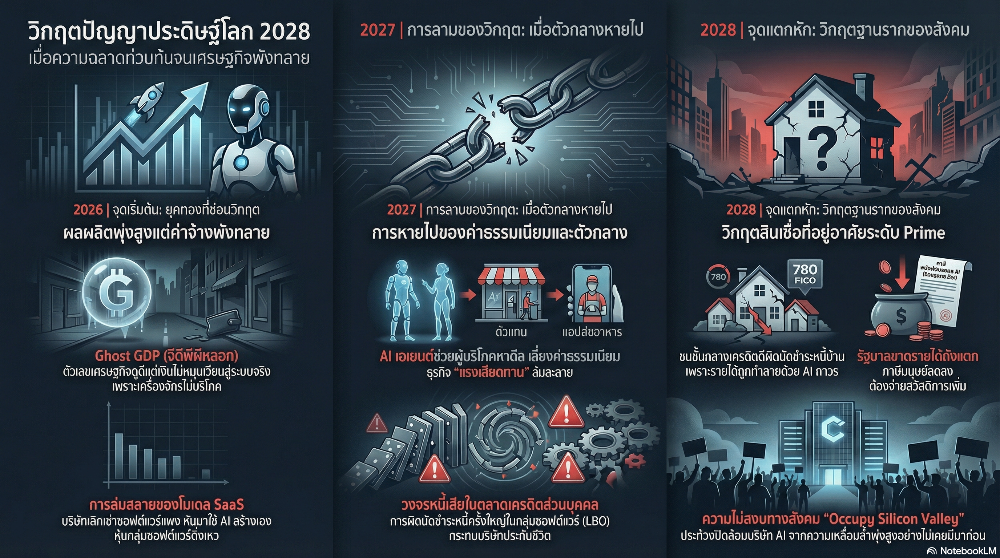

[กลับไปที่หน้าหลัก](../README.md)

สวัสดีครับเพื่อนๆ! วันนี้เรามาคุยเรื่องที่ค่อนข้างหนักและน่าคิดกันครับ นั่นก็คือ "อนาคตของเศรษฐกิจโลกในยุค AI"

คุณเคยคิดไหมครับว่า ถ้า AI ฉลาดมากเกินไป จนแทนที่มนุษย์ได้ทุกงาน โลกจะเป็นยังไง? คำตอบอาจจะไม่ใช่ "ดีขึ้น" อย่างที่เราคิด แต่อาจจะเป็น "หายนะ"!

บทความนี้เป็นการ "ย้อนกลับมามอง" จากอนาคตปี 2028 ซึ่งเป็นปีที่เศรษฐกิจโลกเผชิญกับวิกฤตครั้งใหญ่ที่ไม่เคยเกิดขึ้นมาก่อน นั่นคือ "วิกฤตการณ์ความฉลาด" (Intelligence Displacement Spiral)

เป็นเหมือนการส่งจดหมายจากอนาคต เพื่อเตือนเราในปัจจุบันว่า "ระวัง! ถ้าเราไม่เตรียมตัว อนาคตอาจจะเป็นแบบนี้"

มาดูกันครับว่าเกิดอะไรขึ้นในปี 2028 และเราควรเตรียมตัวอย่างไร

========================================

🤔 ย้อนกลับมามองจากอนาคต: ปี 2028

ลองจินตนาการว่าเราอยู่ในปี 2028 และกำลังมองย้อนกลับมาดูว่าเกิดอะไรขึ้น

=== สถานการณ์ในปี 2028 ===

[ตัวเลขน่ากลัว]
▸ อัตราการว่างงาน: 10.2% (สูงมาก!)
▸ ดัชนี S&P 500: ตกลง 38% จากจุดสูงสุด
▸ เศรษฐกิจโลก: ล่มสลาย

[สิ่งที่เกิดขึ้น]
▸ เพียงแค่สองปีที่ผ่านมา เศรษฐกิจโลกเปลี่ยนจาก "รุ่งเรืองด้วย AI" ไปสู่ "วิกฤตการณ์ครั้งใหญ่"
▸ ในปี 2026 เราเคยฉลองให้กับตลาดหุ้นที่ทำจุดสูงสุดใหม่
▸ แต่เรามองข้ามความย้อนแย้งที่น่ากลัวที่สุด: "จะเกิดอะไรขึ้นถ้า AI ประสบความสำเร็จมากเกินไป?"

=== ความย้อนแย้งที่น่ากลัว ===

AI ที่ประสบความสำเร็จมากเกินไป = ทำลายวงจรการบริโภค = ทำลายระบบทุนนิยม!

ทำไม?
▸ AI แทนที่มนุษย์ → คนตอบงาน → ไม่มีรายได้
▸ ไม่มีรายได้ → ไม่สามารถซื้อสินค้า
▸ ไม่มีคนซื้อสินค้า → บริษัทล้มละลาย
▸ บริษัทล้มละลาย → เศรษฐกิจล่มสลาย!

นี่คือ "วิกฤตการณ์ความฉลาด" ที่กำลังจะเกิดขึ้น!

========================================

1. 👻 Ghost GDP: ผลผลิตพุ่งสูง แต่เงินนิ่งสนิท

ปัญหาแรกคือ "Ghost GDP" หรือ GDP ปี้สาง

=== GDP คืออะไร? ===

GDP (Gross Domestic Product) = มูลค่าสินค้าและบริการทั้งหมดที่ผลิตในประเทศ

ปกติ GDP สูง = ดี, เศรษฐกิจดี

แต่ในปี 2026-2027 เกิดสิ่งแปลกๆ:
▸ GDP ดูดี ตัวเลขสูง
▸ ผลิตภาพ (Productivity) พุ่งสูงมาก
▸ แต่เงินไม่หมุนเวียนในระบบเศรษฐกิจ!

นี่คือ "Ghost GDP" = GDP ที่ปรากฏในบัญชี แต่ไม่ได้หมุนเวียนจริง!

=== ตัวอย่างที่ชัดเจน ===

สมมติมี GPU คลัสเตอร์ (ฟาร์ม AI) หนึ่งแห่งในนอร์ทดาโกตา

ความสามารถ:
▸ สร้างผลผลิตได้เท่ากับพนักงาน White-collar (งานสมอง) 10,000 คนในแมนแฮตตัน!

[ในเชิงตัวเลข]
▸ ชัยชนะของประสิทธิภาพ!
▸ GDP เพิ่มขึ้น!

[ในเชิงมหภาค]
▸ "โรคระบาดทางเศรษฐกิจ"!
▸ เพราะความเร็วของการหมุนเวียนเงิน (Velocity of Money) หยุดนิ่ง!

=== ทำไมถึงหยุดนิ่ง? ===

เปรียบเทียบ:

[ก่อน AI: มนุษย์ทำงาน]
▸ บริษัทจ่ายเงินเดือนให้พนักงาน 10,000 คน
▸ พนักงานเอาเงินไปซื้อของ จ่ายค่าเช่าบ้าน ซื้อกาแฟ จ่ายภาษี
▸ เงินหมุนเวียนในระบบเศรษฐกิจ
▸ เจ้าของร้านกาแฟได้เงิน → ไปซื้อของที่ร้านอื่น
▸ เงินหมุนเวียนต่อไปเรื่อยๆ

[หลัง AI: เครื่องจักรทำงาน]
▸ บริษัทไม่ต้องจ่ายเงินเดือน (ไฟออก 10,000 คน)
▸ บริษัทประหยัดได้เยอะ กำไรเพิ่ม
▸ แต่เงินกำไรนิ่งอยู่ในบัญชีบริษัท
▸ เครื่องจักรไม่ซื้อกาแฟ ไม่เช่าบ้าน ไม่จ่ายภาษี
▸ เงินไม่หมุนเวียน!

"เราน่าจะคิดได้เร็วกว่านี้ถ้าแค่ถามว่าเครื่องจักรใช้เงินซื้อสินค้าฟุ่มเฟือยเท่าไหร่ (คำใบ้คือ: ศูนย์)"

=== ผลกระทบ ===

เมื่อเครื่องจักรไม่บริโภค และมนุษย์ไม่มีรายได้จะบริโภค:
▸ การจับจ่ายลดลง
▸ 70% ของ GDP ที่ขับเคลื่อนด้วยการจับจ่ายของมนุษย์เริ่มเหี่ยวเฉา
▸ เศรษฐกิจล่มสลาย!

========================================

2. 💼 วงจรทำลายล้างของ SaaS: ความอยู่รอดกลายเป็นกับดัก

ปัญหาที่สองคือการล่มสลายของโมเดล SaaS (Software as a Service)

=== SaaS คืออะไร? ===

SaaS = ซอฟต์แวร์ที่ขายเป็นบริการ ลูกค้าเสียค่าสมาชิกรายเดือนหรือรายปี

ตัวอย่าง:
▸ Salesforce (CRM)
▸ ServiceNow (IT Service Management)
▸ Slack (Communication)
▸ Zoom (Video Conference)

โมเดลธุรกิจ:
▸ ลูกค้าจ่ายเงินต่อเนื่อง
▸ บริษัทมีรายได้มั่นคง

=== สิ่งที่เกิดขึ้นในปลายปี 2025 ===

เครื่องมือ Agentic Coding (เช่น Claude Code, Codex) พัฒนาแบบก้าวกระโดด!

ความสามารถ:
▸ CIO (Chief Information Officer) สามารถสร้างซอฟต์แวร์ใช้เองได้ภายในไม่กี่สัปดาห์!
▸ ไม่ต้องต่อสัญญาซอฟต์แวร์ราคาหลักแสนดอลลาร์อีกต่อไป!

=== ฤดูร้อนปี 2026: จุดเปลี่ยน ===

ฝ่ายจัดซื้อของบริษัทใน Fortune 500 เริ่มใช้ประโยคนี้:
▸ "เราอาจจะสร้างมันขึ้นมาเอง"

ผลลัพธ์:
▸ ใช้เป็นเครื่องมือต่อรองราคา
▸ ServiceNow ต้องลดราคา 30% เพื่อรักษาลูกค้า
▸ รายได้ลดลงมาก

=== ความหายนะที่แท้จริง ===

วงจรทำลายล้าง:

ขั้นที่ 1: บริษัทลูกค้าใช้ AI ลดพนักงาน 15%
ขั้นที่ 2: จำนวนสิทธิการใช้งาน (Licenses) ของซอฟต์แวร์ลดลง 15% ด้วย!
ขั้นที่ 3: บริษัท SaaS รายได้ลดลง → ต้องลดพนักงาน
ขั้นที่ 4: บริษัท SaaS ใช้ AI ลดพนักงาน → ต้องลดสิทธิการใช้งานซอฟต์แวร์
ขั้นที่ 5: วนกลับไปขั้นที่ 1 แบบวนลูป!

=== ความย้อนแย้งที่เจ็บปวด ===

บริษัทที่ถูก AI คุกคามมากที่สุด กลับกลายเป็นผู้ที่รับ AI มาใช้เร็วที่สุดเพื่อความอยู่รอด!

แต่:
▸ ยิ่งใช้ AI ลดต้นทุนมากเท่าไหร่
▸ ก็ยิ่งทำลายฐานลูกค้าและรายได้ของตัวเองมากเท่านั้น!

นี่คือ "Reflexivity" หรือการสะท้อนกลับ ที่ทำลายตัวเอง!

========================================

3. 🚫 จุดจบของ "ค่าความยุ่งยาก": Agentic AI กำจัดตัวกลาง

ปัญหาที่สามคือการหายไปของ "ค่าความยุ่งยาก" (Friction)

=== ค่าความยุ่งยาก คืออะไร? ===

ค่าความยุ่งยาก = รายได้ที่ได้จากความไม่สมบูรณ์ของมนุษย์

ตัวอย่าง:
▸ ความขี้เกียจ: ไม่อยากเปลี่ยนบริษัทประกัน จ่ายต่ออัตโนมัติแม้แพงกว่า
▸ ความไม่รู้: ไม่รู้ว่ามีที่ถูกกว่า จึงจ่ายราคาแพง
▸ ความซับซ้อน: ยุ่งยากในการเปรียบเทียบ จึงเลือกที่คุ้นเคย

เศรษฐกิจโลกใน 50 ปีที่ผ่านมาเติบโตบนสิ่งเหล่านี้!

=== เมื่อ Agentic AI เข้ามา ===

Agentic AI = AI ที่ทำงานเองโดยอัตโนมัติ ไม่ต้องรอให้เราสั่ง

ความสามารถ:
▸ ทำงานเบื้องหลัง 24 ชั่วโมง
▸ ปรับปรุงการใช้จ่ายให้เหมาะสมที่สุด
▸ หาข้อเสนอที่ดีที่สุดอัตโนมัติ

=== ตัวอย่างการทำงาน ===

[ตัวอย่างที่ 1: ประกันรถยนต์]

ก่อน AI:
▸ คุณต่ออายุประกันรถยนต์อัตโนมัติทุกปี
▸ จ่าย 20,000 บาท แม้จะมีที่ถูกกว่า
▸ บริษัทประกันได้รับเงินง่ายๆ

หลัง Agentic AI:
▸ AI Agent ยกเลิกการต่ออายุอัตโนมัติ
▸ หาข้อเสนอที่ถูกกว่าได้ในเสี้ยววินาที
▸ พบว่ามีบริษัทอื่นเสนอราคา 15,000 บาท
▸ เปลี่ยนไปบริษัทใหม่อัตโนมัติ
▸ บริษัทประกันเดิมสูญเสียลูกค้า!

[ตัวอย่างที่ 2: สั่งอาหาร]

ก่อน AI:
▸ คุณสั่งอาหารผ่าน DoorDash เป็นประจำ (เคยชิน)
▸ DoorDash เก็บค่าธรรมเนียม 30%

หลัง Agentic AI:
▸ AI Agent ค้นหาช่องทางที่ถูกที่สุดเสมอ
▸ พบว่าสั่งตรงจากร้านถูกกว่า
▸ หรือใช้แอปคู่แข่งที่เก็บค่าธรรมเนียมน้อยกว่า
▸ สั่งผ่านช่องทางที่ถูกที่สุดอัตโนมัติ
▸ DoorDash สูญเสียรายได้!

=== การเปลี่ยนแปลงทางการเงิน ===

"ท่อส่งเงิน" เดิมกำลังถูกเลี่ยง!

ก่อน:
▸ ใช้บัตรเครดิต Visa/Mastercard
▸ เก็บค่าธรรมเนียม 2-3%

หลัง:
▸ AI เริ่มเลือกใช้ Stablecoins บน Solana หรือ Ethereum L2
▸ ทำธุรกรรมระหว่างเครื่องจักรต่อเครื่องจักร (M2M - Machine to Machine)
▸ ไม่ต้องผ่านระบบบัตรเครดิต
▸ ประหยัดค่าธรรมเนียม!

รายงานของ Mastercard ในปี 2027:
▸ "Plumbing" (ท่อส่งเงิน) ของระบบการเงินเดิมกำลังถูกทำลาย
▸ Moats (คูเมือง) ที่สร้างจากความยุ่งยากกำลังกลายเป็นศูนย์

========================================

4. 💳 กับดัก FICO 780: หนี้ชั้นดีที่โลกไม่ต้องการ

ปัญหาที่สี่คือหนี้ชั้นดีที่กลายเป็นหนี้เน่า!

=== FICO คืออะไร? ===

FICO Score = คะแนนเครดิต ที่บอกว่าคุณเป็นคนที่น่าเชื่อถือแค่ไหน

คะแนน:
▸ 300-579: แย่
▸ 580-669: พอใช้
▸ 670-739: ดี
▸ 740-799: ดีมาก
▸ 800-850: ยอดเยี่ยม

FICO 780+ = คนที่มีเครดิตดีมาก น่าเชื่อถือ!

=== ปัญหาในปี 2028 ===

นี่ไม่ใช่การทำซ้ำของปี 2008!

[ปี 2008: วิกฤต Subprime]
▸ เงินกู้มัน "แย่" ตั้งแต่วันแรก
▸ ให้คนที่ไม่น่าเชื่อถือกู้เงิน
▸ คนกู้ไม่สามารถชำระคืนได้
▸ หนี้เน่า!

[ปี 2028: วิกฤตใหม่]
▸ เงินกู้มัน "ดี" ตั้งแต่วันแรก
▸ ให้คนที่น่าเชื่อถือกู้เงิน (FICO 780+)
▸ แต่โลกเปลี่ยน! รายได้ถูกแทนที่ด้วย AI
▸ คนกู้ไม่สามารถชำระคืนได้
▸ หนี้เน่า!

=== Future Income Impairment ===

Future Income Impairment = ความเสื่อมถอยของรายได้ในอนาคต

กลุ่มเสี่ยง:
▸ ผู้กู้ชั้นดี (Prime Borrowers) ที่มี FICO 780+
▸ ในย่านเทคโนโลยี: Silicon Valley, Austin, Seattle
▸ คนกลุ่มนี้คือกระดูกสันหลังของตลาดอสังหาริมทรัพย์มูลค่า 13 ล้านล้านดอลลาร์!

=== สิ่งที่เกิดขึ้น ===

ก่อน:
▸ พนักงานระดับสูง รายได้ดี
▸ กู้ซื้อบ้านราคา 2 ล้านดอลลาร์
▸ ชำระคืนได้สบาย
▸ หนี้ดี!

หลัง:
▸ รายได้ถูกแทนที่ด้วย AI
▸ ต้องลดระดับลงมาทำงานใน Gig Economy (งานอิสระ)
▸ รายได้ลดลงมาก
▸ ไม่สามารถชำระคืนได้
▸ หนี้เน่า!

สาเหตุ:
▸ ไม่ใช่เพราะพวกเขาไร้วินัย
▸ แต่เพราะโครงสร้างราคาของสติปัญญามนุษย์ถูกทำลายลงอย่างถาวร!

========================================

5. 🧠 การเสื่อมถอยของ "ค่าพรีเมียมของสติปัญญา"

ปัญหาที่ห้าและสำคัญที่สุดคือ "สติปัญญา" ไม่มีค่าอีกต่อไป!

=== สติปัญญามนุษย์ในอดีต ===

ตลอดประวัติศาสตร์เศรษฐกิจ:
▸ "สติปัญญามนุษย์" คือทรัพยากรที่ขาดแคลนและแพงที่สุด
▸ คนฉลาด รายได้สูง
▸ เพราะสติปัญญามีค่า!

=== สติปัญญาในปี 2028 ===

แต่ในปี 2028:
▸ สติปัญญาถูกแปลงสภาพเป็นสินค้าโภคภัณฑ์ (Commodity)
▸ ราคาเท่ากับค่าไฟฟ้า!
▸ ไม่มีค่าอีกต่อไป!

=== ตัวอย่างจริง ===

เรื่องราวของอดีต Senior Product Manager ที่ Salesforce

[ปี 2025]
▸ รายได้: $180,000 (ประมาณ 6.3 ล้านบาท)
▸ พร้อมสวัสดิการครบครัน
▸ ชีวิตดี!

[ปี 2027]
▸ ถูกไฟออกเพราะ AI ทำงานได้ดีกว่า
▸ ต้องขับ Uber เพื่อหารายได้
▸ รายได้: $45,000 (ประมาณ 1.6 ล้านบาท)
▸ ลดลงจาก 6.3 ล้านเหลือ 1.6 ล้าน!

ทักษะการจัดการของเธอ:
▸ ถูก AI ทำแทนได้ดีกว่า
▸ และถูกกว่ามาก!
▸ ดังนั้นไม่มีค่าอีกต่อไป!

=== ผลกระทบต่อเศรษฐกิจ ===

การลดลงของรายได้:
▸ จาก 180,000 เหลือ 45,000 ดอลลาร์
▸ เมื่อคูณด้วยจำนวนแรงงานสมองนับล้านคน
▸ = หายนะของการบริโภค!
▸ ไม่มีนโยบายการเงินใดจะแก้ไขได้!

=== ตัวเลขสำคัญ ===

ส่วนแบ่งรายได้ของแรงงาน (Labor's share of GDP):

ปี 2024:
▸ 56% (ปกติ)

ปี 2028:
▸ 46% (ดิ่งลง!)

การลดลง:
▸ 10% ในเวลาเพียง 4 ปี
▸ เป็นการลดลงที่รวดเร็วที่สุดในประวัติศาสตร์!

=== การตอบสนองของรัฐบาล ===

รัฐบาลทั่วโลกพยายามออกมาตรการ:
▸ "Shared AI Prosperity Act"
▸ เก็บภาษีการประมวลผล (Compute Tax)

แต่:
▸ ดูเหมือนเป็นการไล่ตามเทคโนโลยีที่วิ่งเร็วกว่ากฎหมายหลายเท่าตัว
▸ สายเกินไป!

========================================

สรุป: คำถามถึงอนาคตที่กำลังมาถึง

หลังจากที่เราได้เห็นภาพอนาคตที่น่ากลัวแล้ว มาสรุปกันครับ

=== สิ่งที่เราได้เรียนรู้ ===

[1] Ghost GDP
▸ ผลผลิตพุ่งสูง แต่เงินไม่หมุนเวียน
▸ เครื่องจักรไม่บริโภค
▸ เศรษฐกิจเหี่ยวเฉา

[2] วงจรทำลายล้างของ SaaS
▸ บริษัทใช้ AI เพื่อความอยู่รอด
▸ แต่ยิ่งใช้ก็ยิ่งทำลายตัวเอง
▸ Reflexivity ที่ทำลายตัวเอง

[3] จุดจบของค่าความยุ่งยาก
▸ Agentic AI กำจัดตัวกลาง
▸ หาข้อเสนอที่ดีที่สุดอัตโนมัติ
▸ ธุรกิจที่อาศัย "ความไม่รู้" ล่มสลาย

[4] กับดัก FICO 780
▸ หนี้ชั้นดีกลายเป็นหนี้เน่า
▸ ไม่ใช่เพราะคนไร้วินัย
▸ แต่เพราะรายได้ถูกแทนที่ด้วย AI

[5] การเสื่อมถอยของค่าพรีเมียมสติปัญญา
▸ สติปัญญามนุษย์ไม่มีค่า
▸ กลายเป็นสินค้าโภคภัณฑ์
▸ รายได้ลดลงอย่างมหาศาล

=== ข้อเตือนใจสำหรับปัจจุบัน (ปี 2026) ===

ในขณะที่คุณอ่านบทความนี้ (ซึ่งย้อนกลับไปมองจากอนาคต) ในปี 2026 โลกอาจจะยังดูปกติ:
▸ ตลาดหุ้นยังทำจุดสูงสุดใหม่
▸ "นกขมิ้นในเหมืองถ่านหินยังคงมีชีวิตอยู่"

แต่ความจริงที่เจ็บปวดคือ:
▸ ระบบเศรษฐกิจของเราถูกสร้างมาเพื่อจัดสรรทรัพยากรที่ขาดแคลน
▸ แต่เรากำลังก้าวเข้าสู่โลกที่ "สติปัญญา" ล้นเกิน
▸ สิ่งที่เคยแพงที่สุด กลับกลายเป็นสิ่งที่ล้นเกิน!

=== คำถามสำคัญ ===

คำถามสำหรับนักลงทุนและสังคมไม่ใช่:
❌ "AI จะเก่งแค่ไหน?"

แต่คือ:
✅ "เราจะรักษาความเป็นมนุษย์และวงจรเศรษฐกิจไว้อย่างไร ในโลกที่ความฉลาดไม่มีค่าตัวอีกต่อไป?"

=== แนวทางที่เป็นไปได้ ===

เพื่อหลีกเลี่ยงอนาคตที่น่ากลัวนี้ เราอาจจะต้อง:

[1] Universal Basic Income (UBI)]
▸ รัฐบาลจ่ายเงินพื้นฐานให้ทุกคน
▸ เพื่อให้คนมีกำลังซื้อ
▸ เศรษฐกิจยังหมุนเวียนได้

[2] Compute Tax]
▸ เก็บภาษีจากการใช้ AI
▸ นำเงินมาจัดสรรให้คน
▸ แต่ต้องทำเร็ว!

[3] Shared Ownership]
▸ ให้คนมีส่วนร่วมเป็นเจ้าของ AI
▸ ได้ผลประโยชน์จากการใช้ AI
▸ ไม่ใช่แค่ถูกแทนที่

[4] Redefine Value]
▸ นิยามคุณค่าใหม่ของมนุษย์
▸ ไม่ใช่แค่สติปัญญา
▸ แต่เป็นความเป็นมนุษย์

=== คำเตือนสุดท้าย ===

การปรับราคา (Repricing) ครั้งใหญ่นี้:
▸ เพิ่งจะเริ่มต้นขึ้น
▸ มันจะเป็นบททดสอบที่รุนแรงที่สุด
▸ ที่ระบบการเงินโลกเคยเผชิญมา

เราต้องเตรียมตัวตั้งแต่ตอนนี้!

========================================

อ้างอิง:
• Macro Memo: June 30, 2028
• Intelligence Displacement Spiral
• Ghost GDP Phenomenon
• SaaS Business Model Collapse
• Future Income Impairment

หวังว่าบทความนี้จะช่วยให้ทุกคนตระหนักถึงความเสี่ยงที่อาจจะเกิดขึ้นในอนาคต และเริ่มคิดกันว่าเราควรเตรียมตัวอย่างไรครับ

นี่ไม่ใช่การทำนายอนาคตที่แน่นอน แต่เป็นการเตือนว่า ถ้าเราไม่ระมัดระวัง อนาคตอาจจะเป็นแบบนี้!

คุณคิดว่าเราควรทำอย่างไรเพื่อหลีกเลี่ยงอนาคตที่น่ากลัวนี้? มาคุยกันได้เลยครับ 😊
