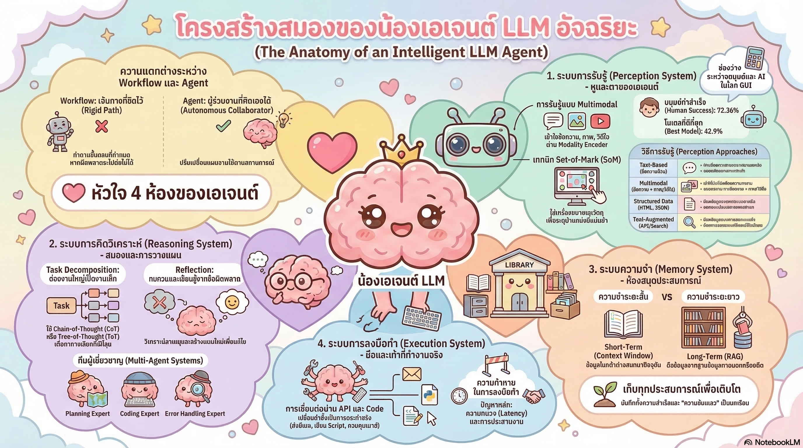

[กลับไปที่หน้าหลัก](../README.md)

สวัสดีครับเพื่อนๆ ที่สนใจ 𝐀𝐈! วันนี้เรามาคุยเรื่องที่กำลังร้อนแรงมากๆ ในวงการเทคโนโลยีกันครับ นั่นคือ "𝐀𝐈 𝐀𝐠𝐞𝐧𝐭" หรือ 𝐀𝐈 ที่ไม่ใช่แค่แชทบอท แต่ "คิด" และ "ทำ" ได้จริงเหมือนมนุษย์!

คุณเคยรู้สึกไหมครับว่า 𝐂𝐡𝐚𝐭𝐆𝐏𝐓 หรือ 𝐂𝐥𝐚𝐮𝐝𝐞 เก่งมาก แต่พอสั่งให้ทำงานอัตโนมัติจริงๆ เช่น จัดการอีเมล จองตั๋ว หรือเขียนโค้ดทั้งโปรเจกต์ มันกลับทำได้ไม่ถึงครึ่งที่คาดหวัง?

นั่นไม่ใช่ความผิดของ 𝐀𝐈 ครับ แต่เป็นเพราะเราใช้มันแบบผิดสถาปัตยกรรม!

สถิติที่น่าตกใจจาก 𝐎𝐒𝐖𝐨𝐫𝐥𝐝 บอกว่า:
▸ มนุษย์ทำงานผ่านหน้าจอสำเร็จ: 𝟕𝟐.𝟑𝟔%
▸ 𝐀𝐈 รุ่นดีที่สุดในปัจจุบันทำได้: เพียง 𝟒𝟐.𝟗%

แต่ช่องว่างนี้กำลังจะปิดลงด้วย 𝟓 บทเรียนสำคัญที่เราจะมาดูกันวันนี้ครับ

========================================

🤔 ทบทวนความเชื่อเดิมๆ: 𝐀𝐈 ในสายตาเดิมของเรา

▪ "𝐀𝐈 ที่เก่งคือ 𝐀𝐈 ที่ตอบคำถามได้ดี" → นั่นคือแชทบอท ไม่ใช่ 𝐀𝐠𝐞𝐧𝐭!
▪ "ถ้าสร้าง 𝐖𝐨𝐫𝐤𝐟𝐥𝐨𝐰 อัตโนมัติได้ ก็คือสร้าง 𝐀𝐠𝐞𝐧𝐭 แล้ว" → ยังไม่ใช่! 𝐖𝐨𝐫𝐤𝐟𝐥𝐨𝐰 กับ 𝐀𝐠𝐞𝐧𝐭 ต่างกันอย่างสิ้นเชิง
▪ "𝐀𝐈 ยิ่งใหญ่ยิ่งทำงานอัตโนมัติได้ดี" → ไม่จริงเสมอไป ขึ้นอยู่กับสถาปัตยกรรม ไม่ใช่ขนาด
▪ "สร้าง 𝐀𝐈 เดียวให้เก่งทุกอย่างดีที่สุด" → ผิด! ทีมผู้เชี่ยวชาญเฉพาะทางดีกว่ามาก

ความจริงคือ: การสร้าง 𝐀𝐠𝐞𝐧𝐭 ที่ใช้งานได้จริงต้องเข้าใจ "กายวิภาค" (𝐀𝐧𝐚𝐭𝐨𝐦𝐲) ของมันก่อนครับ!

========================================

🧠 พื้นฐาน: 𝐀𝐧𝐚𝐭𝐨𝐦𝐲 𝐨𝐟 𝐀𝐈 𝐀𝐠𝐞𝐧𝐭 คืออะไร?

ก่อนที่เราจะไปดู 𝟓 บทเรียน มาทำความเข้าใจโครงสร้างภายในของ 𝐀𝐈 𝐀𝐠𝐞𝐧𝐭 กันก่อนนะครับ

เหมือนร่างกายมนุษย์ที่มีระบบต่างๆ ทำงานร่วมกัน 𝐀𝐈 𝐀𝐠𝐞𝐧𝐭 ก็มี 𝟓 ระบบหลักเช่นกัน!

=== ระบบที่ 𝟏: 𝐏𝐞𝐫𝐜𝐞𝐩𝐭𝐢𝐨𝐧 𝐒𝐲𝐬𝐭𝐞𝐦 (ระบบรับรู้) 👁️ ===

𝐏𝐞𝐫𝐜𝐞𝐩𝐭𝐢𝐨𝐧 = การรับรู้ข้อมูลจากโลกภายนอก

[มนุษย์]
▸ ใช้ตา หู จมูก ผิวหนัง รับข้อมูลจากสภาพแวดล้อม

[𝐀𝐈 𝐀𝐠𝐞𝐧𝐭]
▸ รับรู้ผ่านภาพหน้าจอ (𝐒𝐜𝐫𝐞𝐞𝐧𝐬𝐡𝐨𝐭)
▸ อ่านข้อความจากหน้าเว็บหรือเอกสาร
▸ รับ 𝐀𝐏𝐈 𝐑𝐞𝐬𝐩𝐨𝐧𝐬𝐞 จากระบบอื่น
▸ เห็น 𝐄𝐫𝐫𝐨𝐫 𝐌𝐞𝐬𝐬𝐚𝐠𝐞𝐬 และ 𝐒𝐲𝐬𝐭𝐞𝐦 𝐋𝐨𝐠𝐬

ปัญหาที่พบบ่อย:
▸ 𝐀𝐈 เห็น "ภาพ" แต่ไม่รู้ว่าปุ่มอยู่ที่พิกัดไหน → เดาสุ่ม!
▸ นั่นคือต้นตอของ 𝐆𝐔𝐈 𝐆𝐫𝐨𝐮𝐧𝐝𝐢𝐧𝐠 𝐏𝐫𝐨𝐛𝐥𝐞𝐦 ที่จะพูดถึงในบทเรียนที่ 𝟐

=== ระบบที่ 𝟐: 𝐑𝐞𝐚𝐬𝐨𝐧𝐢𝐧𝐠 𝐒𝐲𝐬𝐭𝐞𝐦 (ระบบคิด) 🧩 ===

𝐑𝐞𝐚𝐬𝐨𝐧𝐢𝐧𝐠 = การคิดวิเคราะห์ วางแผน และตัดสินใจ

[มนุษย์]
▸ ได้รับโจทย์ → คิดวิธีแก้ → วางแผน → ปรับแผนเมื่อเจออุปสรรค

[𝐀𝐈 𝐀𝐠𝐞𝐧𝐭]
▸ รับเป้าหมาย → วิเคราะห์สถานการณ์ → สร้างแผน (𝐏𝐥𝐚𝐧𝐧𝐢𝐧𝐠)
▸ ระหว่างทำงาน: ตรวจสอบว่าแผนยังใช้ได้ไหม? (𝐑𝐞-𝐩𝐥𝐚𝐧𝐧𝐢𝐧𝐠)
▸ เจออุปสรรค: คิดทางเลือกสำรอง (𝐂𝐨𝐧𝐭𝐢𝐧𝐠𝐞𝐧𝐜𝐲 𝐏𝐥𝐚𝐧𝐧𝐢𝐧𝐠)

นี่คือหัวใจที่แยก "𝐖𝐨𝐫𝐤𝐟𝐥𝐨𝐰" ออกจาก "𝐀𝐠𝐞𝐧𝐭" ครับ!

=== ระบบที่ 𝟑: 𝐌𝐞𝐦𝐨𝐫𝐲 𝐒𝐲𝐬𝐭𝐞𝐦 (ระบบความจำ) 💾 ===

𝐌𝐞𝐦𝐨𝐫𝐲 = การจดจำและดึงข้อมูลมาใช้งาน

[มนุษย์]
▸ ความจำระยะสั้น: จำสิ่งที่เพิ่งเกิดขึ้น
▸ ความจำระยะยาว: จำประสบการณ์สะสม
▸ ความจำขั้นตอน: จำวิธีทำสิ่งต่างๆ

[𝐀𝐈 𝐀𝐠𝐞𝐧𝐭]
▸ 𝐂𝐨𝐧𝐭𝐞𝐱𝐭 𝐖𝐢𝐧𝐝𝐨𝐰: ความจำระยะสั้น มีขีดจำกัด!
▸ 𝐕𝐞𝐜𝐭𝐨𝐫 𝐃𝐚𝐭𝐚𝐛𝐚𝐬𝐞: ความจำระยะยาว เก็บข้อมูลสะสม
▸ 𝐄𝐩𝐢𝐬𝐨𝐝𝐢𝐜 𝐌𝐞𝐦𝐨𝐫𝐲: จำว่าเคยพลาดตรงไหน ไม่ทำซ้ำ

ปัญหาที่พบบ่อย:
▸ 𝐂𝐨𝐧𝐭𝐞𝐱𝐭 𝐖𝐢𝐧𝐝𝐨𝐰 ล้น → 𝐀𝐈 ลืมเป้าหมายหลัก (𝐆𝐨𝐚𝐥 𝐃𝐫𝐢𝐟𝐭)
▸ ต้องมีผู้จัดการหน่วยความจำโดยเฉพาะ!

=== ระบบที่ 𝟒: 𝐄𝐱𝐞𝐜𝐮𝐭𝐢𝐨𝐧 𝐒𝐲𝐬𝐭𝐞𝐦 (ระบบลงมือทำ) ⚡ ===

𝐄𝐱𝐞𝐜𝐮𝐭𝐢𝐨𝐧 = การแปลงแผนงานให้เป็นการกระทำจริงๆ

[มนุษย์]
▸ มือ ขา ปาก → ทำงานในโลกกายภาพ

[𝐀𝐈 𝐀𝐠𝐞𝐧𝐭]
▸ คลิกเมาส์ พิมพ์คีย์บอร์ด (𝐆𝐔𝐈 𝐈𝐧𝐭𝐞𝐫𝐚𝐜𝐭𝐢𝐨𝐧)
▸ เรียกใช้ 𝐀𝐏𝐈 และ 𝐖𝐞𝐛 𝐒𝐞𝐫𝐯𝐢𝐜𝐞𝐬
▸ รันโค้ดและ 𝐒𝐜𝐫𝐢𝐩𝐭
▸ จัดการไฟล์และฐานข้อมูล

กุญแจสำคัญ: 𝐄𝐱𝐞𝐜𝐮𝐭𝐢𝐨𝐧 ต้องแม่นยำ! คลิกผิดจุดเดียว งานทั้งหมดพัง!

=== ระบบที่ 𝟓: 𝐖𝐨𝐫𝐤𝐟𝐥𝐨𝐰 𝐯𝐬 𝐀𝐠𝐞𝐧𝐭 ===

นี่ไม่ใช่ระบบ แต่เป็นปรัชญาการออกแบบที่สำคัญที่สุดครับ!

[𝐖𝐨𝐫𝐤𝐟𝐥𝐨𝐰: ระบบที่ตายตัว]
▸ ทำตามขั้นตอน 𝟏 → 𝟐 → 𝟑 → 𝟒 ที่กำหนดไว้แล้ว
▸ เหมือนสายพานการผลิตในโรงงาน
▸ ถ้าชิ้นส่วนหนึ่งผิดรูป → ทั้งสายพานหยุด!

[𝐀𝐠𝐞𝐧𝐭: ระบบที่ยืดหยุ่น]
▸ รับเป้าหมาย → คิด → ทำ → ตรวจสอบ → ปรับ → ทำต่อ
▸ เหมือนมนุษย์ที่ทำงาน เจออุปสรรคก็หาทางอื่น
▸ สภาพแวดล้อมเปลี่ยน → แผนเปลี่ยนตาม!

ตอนนี้เราเข้าใจ 𝐀𝐧𝐚𝐭𝐨𝐦𝐲 แล้ว ไปดู 𝟓 บทเรียนสำคัญกันครับ!

========================================

𝟏. 🔀 "𝐖𝐨𝐫𝐤𝐟𝐥𝐨𝐰 ≠ 𝐀𝐠𝐞𝐧𝐭: ความยืดหยุ่นคือเส้นแบ่งความสำเร็จ"

บทเรียนแรกคือการทำความเข้าใจความแตกต่างที่สำคัญที่สุดครับ!

=== ปัญหาที่นักพัฒนามักเข้าใจผิด ===

หลายคนสร้าง 𝐖𝐨𝐫𝐤𝐟𝐥𝐨𝐰 อัตโนมัติแล้วเรียกมันว่า 𝐀𝐈 𝐀𝐠𝐞𝐧𝐭 ครับ แต่ทั้งสองต่างกันอย่างสิ้นเชิง

[𝐖𝐨𝐫𝐤𝐟𝐥𝐨𝐰: ตายตัว 𝐑𝐢𝐠𝐢𝐝]
▸ ขั้นตอนถูกเขียนไว้ล่วงหน้าทั้งหมด
▸ ทำงานเป็นเส้นตรง: ขั้นที่ 𝟏 → 𝟐 → 𝟑
▸ ถ้าสภาพแวดล้อมเปลี่ยนแม้นิดเดียว → ระบบ "พัง" ทันที!
▸ ตัวอย่าง: 𝐙𝐚𝐩𝐢𝐞𝐫, 𝐌𝐚𝐤𝐞.𝐜𝐨𝐦 ที่เชื่อม 𝐀𝐏𝐈 แบบตายตัว

[𝐀𝐠𝐞𝐧𝐭: ยืดหยุ่น 𝐃𝐲𝐧𝐚𝐦𝐢𝐜]
▸ ไม่มีขั้นตอนตายตัว แต่มีเป้าหมาย
▸ ทำงานตาม "ผลลัพธ์จากสภาพแวดล้อม" ณ ขณะนั้น
▸ เจออุปสรรค → วางแผนใหม่ทันที (𝐑𝐞-𝐩𝐥𝐚𝐧)
▸ ใช้ 𝐑𝐞𝐚𝐬𝐨𝐧𝐢𝐧𝐠 𝐒𝐲𝐬𝐭𝐞𝐦 เพื่อแก้ปัญหาเฉพาะหน้า

เปรียบเทียบ:
▸ 𝐖𝐨𝐫𝐤𝐟𝐥𝐨𝐰 เหมือน 𝐆𝐏𝐒 ที่บอกเส้นทางตายตัว
▸ ถ้าถนนปิด 𝐆𝐏𝐒 แบบเก่าจะงง แต่ 𝐀𝐠𝐞𝐧𝐭 จะหาเส้นทางใหม่เองทันที!

=== สิ่งที่ทำให้ 𝐀𝐠𝐞𝐧𝐭 แตกต่าง ===

𝐀𝐠𝐞𝐧𝐭 ต้องมีความสามารถ 𝟑 อย่างที่ 𝐖𝐨𝐫𝐤𝐟𝐥𝐨𝐰 ไม่มี:

▸ 𝐒𝐭𝐫𝐚𝐭𝐞𝐠𝐲 𝐆𝐞𝐧𝐞𝐫𝐚𝐭𝐢𝐨𝐧: สร้างกลยุทธ์ใหม่ได้เมื่อเจอสถานการณ์ที่ไม่คาดคิด
▸ 𝐄𝐧𝐯𝐢𝐫𝐨𝐧𝐦𝐞𝐧𝐭 𝐅𝐞𝐞𝐝𝐛𝐚𝐜𝐤 𝐋𝐨𝐨𝐩: รับรู้ว่าโลกเปลี่ยนไปอย่างไร แล้วปรับตัว
▸ 𝐆𝐨𝐚𝐥 𝐏𝐞𝐫𝐬𝐢𝐬𝐭𝐞𝐧𝐜𝐞: จดจำเป้าหมายหลักไว้ตลอด ไม่หลงลืมแม้จะทำงานยาวนาน

========================================

𝟐. 👁️ "𝐒𝐞𝐭-𝐨𝐟-𝐌𝐚𝐫𝐤 (𝐒𝐨𝐌): การมองเห็นที่เหนือกว่าแค่รูปภาพ"

บทเรียนที่สองเกี่ยวกับ 𝐏𝐞𝐫𝐜𝐞𝐩𝐭𝐢𝐨𝐧 𝐒𝐲𝐬𝐭𝐞𝐦 ของ 𝐀𝐈 𝐀𝐠𝐞𝐧𝐭 ครับ!

=== ปัญหา 𝐆𝐔𝐈 𝐆𝐫𝐨𝐮𝐧𝐝𝐢𝐧𝐠: เห็นแต่ไม่รู้จะคลิกที่ไหน ===

ลองนึกภาพนะครับ: 𝐀𝐈 เห็นหน้าจอคอมพิวเตอร์เหมือนเราเห็นภาพถ่าย

[ปัญหาที่เกิดขึ้น]
▸ 𝐀𝐈 เห็น "ปุ่มบันทึก" แต่ไม่รู้ว่าปุ่มอยู่ที่พิกัด 𝐗, 𝐘 ไหน
▸ 𝐀𝐈 เดาพิกัดไปเรื่อยๆ → เรียกว่า 𝐇𝐚𝐥𝐥𝐮𝐜𝐢𝐧𝐚𝐭𝐢𝐨𝐧
▸ คลิกผิดจุด → งานทั้งหมดพัง!
▸ นี่คือสาเหตุหลักที่ 𝐀𝐈 ทำงานบนหน้าจอได้ไม่ดีครับ

=== 𝐒𝐞𝐭-𝐨𝐟-𝐌𝐚𝐫𝐤 (𝐒𝐨𝐌): วิธีแก้ที่ฉลาดมาก ===

เทคนิค 𝐒𝐨𝐌 แก้ปัญหาด้วยวิธีง่ายๆ แต่ได้ผลดีมาก:

[ก่อนใช้ 𝐒𝐨𝐌]
▸ 𝐀𝐈 เห็นภาพหน้าจอ 𝟏 ภาพ
▸ ต้องเดาพิกัดปุ่มและองค์ประกอบทั้งหมด

[หลังใช้ 𝐒𝐨𝐌]
▸ ระบบใส่หมายเลขกำกับ (𝐌𝐚𝐫𝐤𝐞𝐫𝐬) บนทุกองค์ประกอบที่คลิกได้
▸ 𝐀𝐈 เห็น "ปุ่มบันทึก [𝟕]" แทนที่จะเห็นแค่ภาพปุ่ม
▸ 𝐀𝐈 สั่ง "คลิกที่ 𝟕" → ระบบรู้พิกัดที่แน่นอน!

เปรียบเทียบ:
▸ เหมือนแผนที่ที่มีตัวเลขกำกับสถานที่ต่างๆ
▸ แทนที่จะบอกว่า "ไปที่ร้านกาแฟ" ก็บอกว่า "ไปที่จุด 𝟏𝟐"
▸ แม่นยำและไม่มีการตีความผิดพลาด!

=== ผลกระทบต่อ 𝐏𝐞𝐫𝐜𝐞𝐩𝐭𝐢𝐨𝐧 𝐒𝐲𝐬𝐭𝐞𝐦 ===

𝐒𝐨𝐌 เชื่อม 𝐏𝐞𝐫𝐜𝐞𝐩𝐭𝐢𝐨𝐧 𝐒𝐲𝐬𝐭𝐞𝐦 เข้ากับ 𝐄𝐱𝐞𝐜𝐮𝐭𝐢𝐨𝐧 𝐒𝐲𝐬𝐭𝐞𝐦 ได้อย่างสมบูรณ์:

▸ 𝐏𝐞𝐫𝐜𝐞𝐩𝐭𝐢𝐨𝐧 𝐒𝐲𝐬𝐭𝐞𝐦 เห็นหน้าจอ + 𝐌𝐚𝐫𝐤𝐞𝐫𝐬
▸ 𝐑𝐞𝐚𝐬𝐨𝐧𝐢𝐧𝐠 𝐒𝐲𝐬𝐭𝐞𝐦 วิเคราะห์ว่าต้องทำอะไร
▸ 𝐄𝐱𝐞𝐜𝐮𝐭𝐢𝐨𝐧 𝐒𝐲𝐬𝐭𝐞𝐦 คลิกที่ 𝐌𝐚𝐫𝐤𝐞𝐫 ที่ถูกต้องได้ทันที!

========================================

𝟑. ⚡ "𝐃𝐏𝐏𝐌: วางแผนแบบขนาน ป้องกันความล้มเหลวแบบลูกโซ่"

บทเรียนที่สามเกี่ยวกับ 𝐑𝐞𝐚𝐬𝐨𝐧𝐢𝐧𝐠 𝐒𝐲𝐬𝐭𝐞𝐦 ระดับสูงครับ!

=== ปัญหาของการวางแผนแบบเดิม ===

[𝐒𝐞𝐪𝐮𝐞𝐧𝐭𝐢𝐚𝐥 𝐏𝐥𝐚𝐧𝐧𝐢𝐧𝐠: เรียงต่อกัน]
▸ ขั้นที่ 𝟏 → 𝟐 → 𝟑 → 𝟒 → 𝟓
▸ ขั้นตอนแต่ละอันพึ่งพาผลจากขั้นตอนก่อน
▸ ถ้าขั้นที่ 𝟏 ผิด → ข้อมูลผิดจะถูกส่งต่อไปเรื่อยๆ จนถึงขั้นที่ 𝟓
▸ ผลคือ 𝐂𝐚𝐬𝐜𝐚𝐝𝐢𝐧𝐠 𝐄𝐫𝐫𝐨𝐫𝐬 หรือ "ความผิดพลาดแบบลูกโซ่"!

เปรียบเทียบ:
▸ เหมือนเกมโทรศัพท์ที่ส่งข้อความผ่านคน 𝟏𝟎 คน
▸ ถ้าคนแรกพูดผิด ข้อความจะบิดเบือนมากขึ้นเรื่อยๆ จนคนสุดท้ายได้ยินคนละเรื่อง!

=== 𝐃𝐏𝐏𝐌: แก้ปัญหาด้วยการทำงานแบบขนาน ===

𝐃𝐏𝐏𝐌 = 𝐃𝐞𝐜𝐨𝐦𝐩𝐨𝐬𝐞, 𝐏𝐥𝐚𝐧 𝐢𝐧 𝐏𝐚𝐫𝐚𝐥𝐥𝐞𝐥, 𝐚𝐧𝐝 𝐌𝐞𝐫𝐠𝐞

[ขั้นที่ 𝟏: 𝐃𝐞𝐜𝐨𝐦𝐩𝐨𝐬𝐞 (ย่อยงาน)]
▸ แบ่งเป้าหมายใหญ่ออกเป็นงานย่อยที่เป็นอิสระต่อกัน
▸ งาน 𝐀, 𝐁, 𝐂 ไม่พึ่งพากัน แก้ไขได้แยกส่วน

[ขั้นที่ 𝟐: 𝐏𝐥𝐚𝐧 𝐢𝐧 𝐏𝐚𝐫𝐚𝐥𝐥𝐞𝐥 (วางแผนพร้อมกัน)]
▸ ส่ง 𝐀𝐠𝐞𝐧𝐭 หลายตัวไปวางแผนสำหรับงาน 𝐀, 𝐁, 𝐂 พร้อมกัน
▸ ถ้างาน 𝐀 ผิดพลาด → ไม่กระทบงาน 𝐁 และ 𝐂 เลย!
▸ "แยกส่วนความผิดพลาด" (𝐄𝐫𝐫𝐨𝐫 𝐈𝐬𝐨𝐥𝐚𝐭𝐢𝐨𝐧) ได้สมบูรณ์

[ขั้นที่ 𝟑: 𝐌𝐞𝐫𝐠𝐞 (รวมแผน)]
▸ นำแผนที่สำเร็จจากทุกส่วนมารวมเป็น 𝐆𝐥𝐨𝐛𝐚𝐥 𝐏𝐥𝐚𝐧
▸ ได้แผนรวมที่สมบูรณ์และน่าเชื่อถือ

=== ประโยชน์ที่ได้เพิ่มเติม ===

นอกจากป้องกัน 𝐂𝐚𝐬𝐜𝐚𝐝𝐢𝐧𝐠 𝐄𝐫𝐫𝐨𝐫𝐬 แล้ว 𝐃𝐏𝐏𝐌 ยังช่วย:

▸ รักษา 𝐅𝐨𝐜𝐮𝐬: 𝐀𝐠𝐞𝐧𝐭 แต่ละตัวดูแลงานย่อยของตัวเอง ไม่หลงลืมเป้าหมายหลัก (𝐆𝐨𝐚𝐥 𝐃𝐫𝐢𝐟𝐭)
▸ ประหยัดเวลา: งานหลายอย่างเกิดขึ้นพร้อมกัน ไม่ต้องรอทีละขั้น
▸ 𝐃𝐞𝐛𝐮𝐠 ง่ายขึ้น: รู้ทันทีว่าส่วนไหนที่มีปัญหา

========================================

𝟒. 🎭 "𝐃𝐞𝐯𝐢𝐥'𝐬 𝐀𝐝𝐯𝐨𝐜𝐚𝐭𝐞: พลังของการคิดทบทวนก่อนลงมือทำ"

บทเรียนที่สี่คือการยกระดับ 𝐑𝐞𝐚𝐬𝐨𝐧𝐢𝐧𝐠 𝐒𝐲𝐬𝐭𝐞𝐦 ด้วยการคิดทบทวน!

=== ปัญหาของ 𝐀𝐠𝐞𝐧𝐭 ที่ลงมือทำทันที ===

𝐀𝐠𝐞𝐧𝐭 ที่ไม่มีการคิดทบทวนมักเจอปัญหาแบบนี้:
▸ ได้รับแผน → ลงมือทำทันที
▸ ทำไปถึงขั้นที่ 𝟕 จาก 𝟏𝟎 แล้วพบว่า... แผนผิดตั้งแต่ต้น!
▸ ต้องเริ่มใหม่ เสียเวลาและทรัพยากรไปมหาศาล

=== 𝐀𝐧𝐭𝐢𝐜𝐢𝐩𝐚𝐭𝐨𝐫𝐲 𝐑𝐞𝐟𝐥𝐞𝐜𝐭𝐢𝐨𝐧: คิดทบทวนก่อนลงมือ ===

วิธีแก้คือ 𝐅𝐫𝐨𝐧𝐭-𝐥𝐨𝐚𝐝𝐞𝐝 𝐢𝐧𝐭𝐫𝐨𝐬𝐩𝐞𝐜𝐭𝐢𝐨𝐧 หรือ "คิดหนักก่อนทำ เบาหลังทำ":

[ขั้นตอนการทำงาน]
▸ ได้รับแผน → ยังไม่ลงมือ!
▸ ส่งแผนไปให้ 𝐄𝐯𝐚𝐥𝐮𝐚𝐭𝐨𝐫 𝐋𝐋𝐌 ตรวจสอบก่อน
▸ 𝐄𝐯𝐚𝐥𝐮𝐚𝐭𝐨𝐫 ถามว่า "แผนนี้จะพังตรงไหน?" และ "มีอุปสรรคที่ซ่อนอยู่หรือไม่?"
▸ รับ 𝐅𝐞𝐞𝐝𝐛𝐚𝐜𝐤 → ปรับแผน → แล้วจึงลงมือทำ!

=== 𝐃𝐞𝐯𝐢𝐥'𝐬 𝐀𝐝𝐯𝐨𝐜𝐚𝐭𝐞 𝐀𝐫𝐜𝐡𝐢𝐭𝐞𝐜𝐭𝐮𝐫𝐞 ===

[ตัวละครที่ 𝟏: 𝐀𝐜𝐭𝐨𝐫]
▸ 𝐋𝐋𝐌 ที่รับผิดชอบสร้างแผนและลงมือทำ
▸ มองโลกในแง่ดี โฟกัสที่การทำงานให้สำเร็จ

[ตัวละครที่ 𝟐: 𝐃𝐞𝐯𝐢𝐥'𝐬 𝐀𝐝𝐯𝐨𝐜𝐚𝐭𝐞 (𝐄𝐯𝐚𝐥𝐮𝐚𝐭𝐨𝐫)]
▸ 𝐋𝐋𝐌 อีกตัวที่ทำหน้าที่ "ผู้ค้าน"
▸ มองโลกในแง่ร้าย หาจุดบกพร่องในแผน
▸ จำลองสถานการณ์ว่า "ถ้าแผนนี้พัง จะพังตรงไหน?"

เปรียบเทียบ:
▸ เหมือนทีมกฎหมายที่มีทั้งอัยการและทนายจำเลย
▸ ก่อนส่งคดีขึ้นศาล ทดลองโต้แย้งข้อกล่าวหากันก่อน
▸ ผลคือข้อโต้แย้งที่แน่นหนาและไม่มีช่องโหว่!

=== 𝐏𝐫𝐞-𝐦𝐨𝐫𝐭𝐞𝐦: วิเคราะห์ความล้มเหลวก่อนเกิดขึ้น ===

𝐏𝐫𝐞-𝐦𝐨𝐫𝐭𝐞𝐦 = จำลองว่า "ถ้าโปรเจกต์นี้ล้มเหลว มันจะล้มเหลวเพราะอะไร?"

ประโยชน์:
▸ พบจุดอ่อนก่อนลงมือ แก้ได้ทันเวลา
▸ เตรียมแผนสำรองไว้ล่วงหน้า
▸ 𝐀𝐠𝐞𝐧𝐭 ทนทาน (𝐑𝐨𝐛𝐮𝐬𝐭) ต่อสถานการณ์ไม่คาดคิดมากขึ้น!

========================================

𝟓. 👥 "𝐌𝐮𝐥𝐭𝐢-𝐀𝐠𝐞𝐧𝐭 𝐄𝐱𝐩𝐞𝐫𝐭𝐬: จาก 𝐀𝐈 เดี่ยว สู่ทีมผู้เชี่ยวชาญ"

บทเรียนสุดท้ายคือการยกระดับทั้งระบบด้วยการแบ่งหน้าที่!

=== ปัญหาของ 𝐆𝐞𝐧𝐞𝐫𝐚𝐥𝐢𝐬𝐭 𝐀𝐠𝐞𝐧𝐭 ===

การสร้าง 𝐀𝐈 เดียวที่เก่งทุกอย่างฟังดูดีครับ แต่ในความเป็นจริง:

[𝐆𝐞𝐧𝐞𝐫𝐚𝐥𝐢𝐬𝐭 𝐀𝐠𝐞𝐧𝐭: ทำทุกอย่างแต่ไม่เก่งอะไรสักอย่าง]
▸ ต้องโฟกัสหลายอย่างพร้อมกัน
▸ 𝐂𝐨𝐧𝐭𝐞𝐱𝐭 𝐖𝐢𝐧𝐝𝐨𝐰 แน่นอย่างรวดเร็ว → ลืมข้อมูลสำคัญ
▸ เหมือนพนักงานคนเดียวที่ต้องวางกลยุทธ์ เขียนโค้ด ดูแลเซิร์ฟเวอร์ และรับโทรศัพท์ลูกค้าพร้อมกัน!

=== 𝐌𝐮𝐥𝐭𝐢-𝐀𝐠𝐞𝐧𝐭 𝐀𝐫𝐜𝐡𝐢𝐭𝐞𝐜𝐭𝐮𝐫𝐞: แบ่งงานตามความเชี่ยวชาญ ===

สถาปัตยกรรมระดับสูงจะแบ่งหน้าที่ให้ชัดเจน:

[𝐏𝐥𝐚𝐧𝐧𝐢𝐧𝐠 𝐄𝐱𝐩𝐞𝐫𝐭: นักวางกลยุทธ์]
▸ รับเป้าหมายจาก 𝐇𝐮𝐦𝐚𝐧
▸ ย่อยงานและจัดลำดับความสำคัญ
▸ ใช้ 𝐃𝐏𝐏𝐌 เพื่อสร้าง 𝐌𝐚𝐬𝐭𝐞𝐫 𝐏𝐥𝐚𝐧
▸ ไม่ยุ่งกับการลงมือทำโดยตรง

[𝐀𝐜𝐭𝐢𝐨𝐧 𝐄𝐱𝐩𝐞𝐫𝐭: นักปฏิบัติการ]
▸ รับแผนจาก 𝐏𝐥𝐚𝐧𝐧𝐢𝐧𝐠 𝐄𝐱𝐩𝐞𝐫𝐭
▸ แปลงแผนเป็นคำสั่งจริงๆ เช่น 𝐂𝐥𝐢𝐜𝐤, 𝐓𝐲𝐩𝐞, 𝐀𝐏𝐈 𝐂𝐚𝐥𝐥
▸ ใช้ 𝐒𝐨𝐌 เพื่อ 𝐆𝐔𝐈 𝐆𝐫𝐨𝐮𝐧𝐝𝐢𝐧𝐠 ที่แม่นยำ
▸ รายงานผลกลับไปให้ 𝐏𝐥𝐚𝐧𝐧𝐢𝐧𝐠 𝐄𝐱𝐩𝐞𝐫𝐭

[𝐌𝐞𝐦𝐨𝐫𝐲 𝐌𝐚𝐧𝐚𝐠𝐞𝐦𝐞𝐧𝐭 𝐄𝐱𝐩𝐞𝐫𝐭: ผู้จัดการความจำ]
▸ คัดกรองข้อมูลที่เข้าสู่ 𝐂𝐨𝐧𝐭𝐞𝐱𝐭 𝐖𝐢𝐧𝐝𝐨𝐰 ของ 𝐀𝐈 หลัก
▸ สรุปข้อมูลที่ยาวให้กระชับ (𝐒𝐮𝐦𝐦𝐚𝐫𝐢𝐳𝐚𝐭𝐢𝐨𝐧)
▸ ตัดทอนข้อมูลที่ไม่จำเป็นออก (𝐓𝐫𝐮𝐧𝐜𝐚𝐭𝐢𝐨𝐧)
▸ เก็บ "บทเรียน" จากความผิดพลาดในอดีต

ปัญหาที่แก้ได้:
▸ 𝐀𝐈 ไม่ลืมเป้าหมายหลักอีกต่อไป (𝐍𝐨 𝐆𝐨𝐚𝐥 𝐃𝐫𝐢𝐟𝐭!)
▸ 𝐂𝐨𝐧𝐭𝐞𝐱𝐭 𝐖𝐢𝐧𝐝𝐨𝐰 ไม่ล้น ทำงานได้นาน
▸ เหมือนมีผู้ช่วยส่วนตัวที่จัดการงานเอกสารให้ก่อนนำส่งเจ้านาย!

[𝐄𝐫𝐫𝐨𝐫 𝐇𝐚𝐧𝐝𝐥𝐢𝐧𝐠 𝐄𝐱𝐩𝐞𝐫𝐭: นักแก้ปัญหา]
▸ วิเคราะห์ 𝐋𝐨𝐠 และอาการผิดปกติตลอดเวลา
▸ เมื่อพบ 𝐄𝐫𝐫𝐨𝐫 → วิเคราะห์สาเหตุ
▸ เสนอแนวทางแก้ไขให้ 𝐏𝐥𝐚𝐧𝐧𝐢𝐧𝐠 𝐄𝐱𝐩𝐞𝐫𝐭
▸ ทำให้ระบบซ่อมตัวเองได้ (𝐒𝐞𝐥𝐟-𝐡𝐞𝐚𝐥𝐢𝐧𝐠)

=== ผลของการแบ่งหน้าที่ ===

เปรียบเทียบ:

[𝐆𝐞𝐧𝐞𝐫𝐚𝐥𝐢𝐬𝐭 𝐀𝐠𝐞𝐧𝐭]
▸ คนเดียวทำทุกอย่าง
▸ สับสน ลืมง่าย ทำงานพลาดบ่อย

[𝐌𝐮𝐥𝐭𝐢-𝐀𝐠𝐞𝐧𝐭 𝐓𝐞𝐚𝐦]
▸ ทีมผู้เชี่ยวชาญแต่ละด้าน
▸ โฟกัส ไม่สับสน ระบบขยายได้ไม่มีขีดจำกัด!

========================================

สรุป: อนาคตที่มนุษย์เป็น "ผู้วางนโยบาย" ไม่ใช่ "ผู้ปฏิบัติการ"

หลังจากที่เราได้เห็น 𝐀𝐧𝐚𝐭𝐨𝐦𝐲 และ 𝟓 บทเรียนของ 𝐀𝐈 𝐀𝐠𝐞𝐧𝐭 แล้ว มาสรุปกันครับ

=== 𝟓 ระบบใน 𝐀𝐧𝐚𝐭𝐨𝐦𝐲 𝐨𝐟 𝐀𝐈 𝐀𝐠𝐞𝐧𝐭 ===

[𝐏𝐞𝐫𝐜𝐞𝐩𝐭𝐢𝐨𝐧 𝐒𝐲𝐬𝐭𝐞𝐦]
▸ รับรู้โลกผ่านหน้าจอ, ข้อความ, 𝐀𝐏𝐈
▸ 𝐒𝐨𝐌 แก้ปัญหา 𝐆𝐔𝐈 𝐆𝐫𝐨𝐮𝐧𝐝𝐢𝐧𝐠 ได้แม่นยำ

[𝐑𝐞𝐚𝐬𝐨𝐧𝐢𝐧𝐠 𝐒𝐲𝐬𝐭𝐞𝐦]
▸ คิด วางแผน และปรับแผนเมื่อเจออุปสรรค
▸ 𝐃𝐏𝐏𝐌 ป้องกัน 𝐂𝐚𝐬𝐜𝐚𝐝𝐢𝐧𝐠 𝐄𝐫𝐫𝐨𝐫𝐬
▸ 𝐃𝐞𝐯𝐢𝐥'𝐬 𝐀𝐝𝐯𝐨𝐜𝐚𝐭𝐞 เพิ่มความทนทานของแผน

[𝐌𝐞𝐦𝐨𝐫𝐲 𝐒𝐲𝐬𝐭𝐞𝐦]
▸ จัดการข้อมูลใน 𝐂𝐨𝐧𝐭𝐞𝐱𝐭 𝐖𝐢𝐧𝐝𝐨𝐰 อย่างชาญฉลาด
▸ 𝐌𝐞𝐦𝐨𝐫𝐲 𝐌𝐚𝐧𝐚𝐠𝐞𝐦𝐞𝐧𝐭 𝐄𝐱𝐩𝐞𝐫𝐭 ป้องกัน 𝐆𝐨𝐚𝐥 𝐃𝐫𝐢𝐟𝐭

[𝐄𝐱𝐞𝐜𝐮𝐭𝐢𝐨𝐧 𝐒𝐲𝐬𝐭𝐞𝐦]
▸ แปลงแผนเป็นการกระทำจริงๆ ได้แม่นยำ
▸ 𝐀𝐜𝐭𝐢𝐨𝐧 𝐄𝐱𝐩𝐞𝐫𝐭 โฟกัสเฉพาะการลงมือทำ

[𝐖𝐨𝐫𝐤𝐟𝐥𝐨𝐰 𝐯𝐬 𝐀𝐠𝐞𝐧𝐭]
▸ 𝐖𝐨𝐫𝐤𝐟𝐥𝐨𝐰 = ตายตัว, 𝐀𝐠𝐞𝐧𝐭 = ยืดหยุ่น
▸ 𝐀𝐠𝐞𝐧𝐭 แท้จริงต้องปรับตัวได้ตามสถานการณ์

=== 𝟓 บทเรียนที่ต้องจำ ===

[𝟏] 𝐖𝐨𝐫𝐤𝐟𝐥𝐨𝐰 ≠ 𝐀𝐠𝐞𝐧𝐭 ความยืดหยุ่นคือเส้นแบ่ง
[𝟐] 𝐒𝐞𝐭-𝐨𝐟-𝐌𝐚𝐫𝐤 แก้ปัญหา 𝐆𝐔𝐈 𝐆𝐫𝐨𝐮𝐧𝐝𝐢𝐧𝐠 ได้จริง
[𝟑] 𝐃𝐏𝐏𝐌 วางแผนแบบขนาน ป้องกันความล้มเหลวลูกโซ่
[𝟒] 𝐃𝐞𝐯𝐢𝐥'𝐬 𝐀𝐝𝐯𝐨𝐜𝐚𝐭𝐞 คิดก่อนทำ ดีกว่าทำแล้วเสียใจ
[𝟓] 𝐌𝐮𝐥𝐭𝐢-𝐀𝐠𝐞𝐧𝐭 𝐓𝐞𝐚𝐦 ดีกว่า 𝐆𝐞𝐧𝐞𝐫𝐚𝐥𝐢𝐬𝐭 ตัวเดียว

=== กระบวนทัศน์ใหม่: 𝐇𝐮𝐦𝐚𝐧-𝐚𝐬-𝐀𝐬𝐬𝐢𝐬𝐭𝐚𝐧𝐭 ===

เรากำลังเดินเข้าสู่ยุคที่น่าสนใจมากครับ:

[ยุคเดิม: 𝐇𝐮𝐦𝐚𝐧-𝐚𝐬-𝐎𝐩𝐞𝐫𝐚𝐭𝐨𝐫]
▸ มนุษย์ทำงานทุกขั้นตอนด้วยตัวเอง
▸ 𝐀𝐈 ช่วยเพียงบางส่วน เช่น ตอบคำถาม
▸ มนุษย์เหนื่อยกับงานซ้ำซาก

[ยุคใหม่: 𝐇𝐮𝐦𝐚𝐧-𝐚𝐬-𝐏𝐨𝐥𝐢𝐜𝐲𝐦𝐚𝐤𝐞𝐫]
▸ 𝐀𝐠𝐞𝐧𝐭 รันงานหลักทั้งหมดโดยอัตโนมัติ
▸ มนุษย์วางนโยบาย ตัดสินใจในจุดวิกฤต
▸ สอน 𝐀𝐠𝐞𝐧𝐭 ผ่านการสาธิตเพียงครั้งเดียว (𝐋𝐞𝐚𝐫𝐧-𝐟𝐫𝐨𝐦-𝐨𝐧𝐞-𝐬𝐡𝐨𝐭)
▸ ผลิตภาพเพิ่มขึ้น 𝟏𝟎 เท่า ไม่ใช่แค่ตัวเลขทางการตลาด แต่เป็นเป้าหมายที่เป็นไปได้จริง!

=== มุมมองส่วนตัว ===

ช่องว่าง 𝟕𝟐% 𝐯𝐬 𝟒𝟑% ระหว่างมนุษย์และ 𝐀𝐈 ในการทำงานบนหน้าจอจะปิดลงเมื่อเราออกแบบระบบให้ถูกต้อง

ไม่ใช่เพราะโมเดลใหญ่ขึ้น แต่เพราะเราเข้าใจ 𝐀𝐧𝐚𝐭𝐨𝐦𝐲 ของ 𝐀𝐠𝐞𝐧𝐭 และนำ 𝟓 บทเรียนนี้ไปใช้ได้อย่างถูกต้องครับ!

========================================

อ้างอิง:
• 𝐎𝐒𝐖𝐨𝐫𝐥𝐝 𝐁𝐞𝐧𝐜𝐡𝐦𝐚𝐫𝐤 (𝐇𝐮𝐦𝐚𝐧 𝟕𝟐.𝟑𝟔% 𝐯𝐬 𝐀𝐈 𝟒𝟐.𝟗%)
• 𝐒𝐞𝐭-𝐨𝐟-𝐌𝐚𝐫𝐤 (𝐒𝐨𝐌) 𝐓𝐞𝐜𝐡𝐧𝐢𝐪𝐮𝐞 สำหรับ 𝐆𝐔𝐈 𝐆𝐫𝐨𝐮𝐧𝐝𝐢𝐧𝐠
• 𝐃𝐏𝐏𝐌 (𝐃𝐞𝐜𝐨𝐦𝐩𝐨𝐬𝐞, 𝐏𝐥𝐚𝐧 𝐢𝐧 𝐏𝐚𝐫𝐚𝐥𝐥𝐞𝐥, 𝐌𝐞𝐫𝐠𝐞)
• 𝐀𝐧𝐭𝐢𝐜𝐢𝐩𝐚𝐭𝐨𝐫𝐲 𝐑𝐞𝐟𝐥𝐞𝐜𝐭𝐢𝐨𝐧 และ 𝐃𝐞𝐯𝐢𝐥'𝐬 𝐀𝐝𝐯𝐨𝐜𝐚𝐭𝐞 𝐀𝐫𝐜𝐡𝐢𝐭𝐞𝐜𝐭𝐮𝐫𝐞
• 𝐌𝐮𝐥𝐭𝐢-𝐀𝐠𝐞𝐧𝐭 𝐄𝐱𝐩𝐞𝐫𝐭 𝐒𝐲𝐬𝐭𝐞𝐦 𝐃𝐞𝐬𝐢𝐠𝐧
• 𝐀𝐧𝐚𝐭𝐨𝐦𝐲 𝐨𝐟 𝐀𝐈 𝐀𝐠𝐞𝐧𝐭 𝐅𝐫𝐚𝐦𝐞𝐰𝐨𝐫𝐤

คำถามท้าทาย:

"เมื่อ 𝐀𝐈 𝐀𝐠𝐞𝐧𝐭 สามารถ 'คิด' ด้วย 𝐑𝐞𝐚𝐬𝐨𝐧𝐢𝐧𝐠 𝐒𝐲𝐬𝐭𝐞𝐦, 'จดจำ' ด้วย 𝐌𝐞𝐦𝐨𝐫𝐲 𝐒𝐲𝐬𝐭𝐞𝐦, 'มองเห็น' ด้วย 𝐏𝐞𝐫𝐜𝐞𝐩𝐭𝐢𝐨𝐧 𝐒𝐲𝐬𝐭𝐞𝐦 และ 'ลงมือทำ' ด้วย 𝐄𝐱𝐞𝐜𝐮𝐭𝐢𝐨𝐧 𝐒𝐲𝐬𝐭𝐞𝐦 ได้อย่างสมบูรณ์ — คุณในฐานะผู้นำองค์กรจะนำ 𝐃𝐢𝐠𝐢𝐭𝐚𝐥 𝐁𝐫𝐚𝐢𝐧 นี้ไปแก้ไขปัญหาที่ใหญ่ที่สุดในงานของคุณได้อย่างไร?"

ถ้ามีคำถามหรือความคิดเห็นเกี่ยวกับการสร้าง 𝐀𝐈 𝐀𝐠𝐞𝐧𝐭 มาคุยกันได้เลยนะครับ 😊
