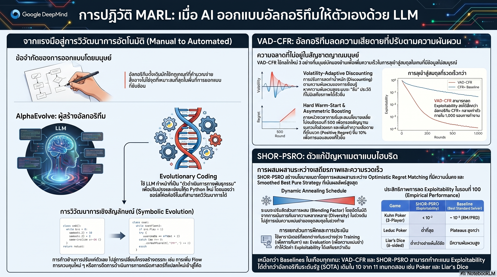

[กลับไปที่หน้าหลัก](../README.md)

เมื่อ AI ออกแบบ AI: 5 สิ่งที่น่าทึ่งจากการค้นพบอัลกอริทึมใหม่โดย Google DeepMind

ในโลกของการพัฒนาปัญญาประดิษฐ์ (AI) การสร้างอัลกอริทึมที่ชาญฉลาดมักเป็นหน้าที่ของมนุษย์ที่ต้องใช้ "สัญชาตญาณ" และการลองผิดลองถูกซ้ำแล้วซ้ำเล่า (Manual iterative refinement) เพื่อหาจุดที่ลงตัวที่สุด แต่ปัจจุบัน Google DeepMind ได้ก้าวข้ามขีดจำกัดนั้นด้วยการพัฒนา AlphaEvolve ระบบ AI ที่ทำหน้าที่เป็น "สถาปนิกผู้ออกแบบรหัสคอมพิวเตอร์" (Evolutionary coding agent) เพื่อสร้างอัลกอริทึมสำหรับการเรียนรู้ในสถานการณ์ที่มีผู้เล่นหลายคน (Multi-agent Learning) ที่ทรงประสิทธิภาพเกินกว่าที่มนุษย์จะจินตนาการได้

นี่คือ 5 บทเรียนที่พิสูจน์ว่า เมื่อ AI ได้รับอิสระในการ "วิวัฒนาการ" ตัวเอง ผลลัพธ์ที่ได้นั้นน่าทึ่งเพียงใด

--------------------------------------------------------------------------------

1. การเปลี่ยนจาก 'การปรับค่า' สู่ 'การวิวัฒนาการรหัส' (Symbolic Code Evolution)

โดยปกติแล้ว การพัฒนา AI ให้เก่งขึ้นมักจบลงที่การปรับจูนพารามิเตอร์หรือตัวเลข (Hyperparameter optimization) แต่ AlphaEvolve ก้าวไปไกลกว่านั้นด้วยสิ่งที่เรียกว่า Semantic Mutation หรือการกลายพันธุ์เชิงความหมาย

แทนที่จะเป็นเพียงการเปลี่ยนตัวเลขในสูตรเดิม AlphaEvolve ใช้อำนาจของ Large Language Models (LLMs) มาทำหน้าที่เขียนโค้ดขึ้นมาใหม่ เปลี่ยนตรรกะ (Logic) และโครงสร้างการควบคุม (Control flows) ของอัลกอริทึมโดยตรง การให้ AI เขียนอัลกอริทึมเองทำให้มันสามารถค้นพบกลไกทางคณิตศาสตร์ที่ซับซ้อน ซึ่งนักวิจัยมนุษย์มักจะมองข้ามเนื่องจากข้อจำกัดด้านความคุ้นเคยทางทฤษฎี

2. VAD-CFR กับกลไก 'ลืม' และ 'รุก' ที่ขัดกับสัญชาตญาณ

หนึ่งในผลงานชิ้นเอกที่ AlphaEvolve ค้นพบคือ VAD-CFR (Volatility-Adaptive Discounting CFR) ซึ่งนำเสนอกลไกที่มนุษย์อาจมองว่าไม่สมเหตุสมผลในตอนแรก แต่กลับให้ผลลัพธ์ที่ยอดเยี่ยม

* Volatility-Adaptive Discounting: อัลกอริทึมจะคอยตรวจวัด "ความผันผวน" ของสถานการณ์ หากสถานการณ์กำลังวุ่นวาย AI จะเลือกที่จะ "ลืม" ข้อมูลในอดีตเร็วขึ้นเพื่อไม่ให้ติดหล่มกับข้อมูลที่ล้าสมัย
* Asymmetric Instantaneous Boosting: นี่คือความลับที่น่าสนใจที่สุด โดย VAD-CFR จะเพิ่มค่าน้ำหนักให้กับ Regret (ความเสียดาย) ที่เป็นบวกทันทีถึง 1.1 เท่า เพื่อให้ AI สามารถตอบสนองและฉกฉวยโอกาสจากกลยุทธ์ที่ดีได้อย่างรวดเร็ว (Eliminating lag)

"VAD-CFR ติดตามความผันผวนผ่านค่า EWMA หากความผันผวนสูง อัลกอริทึมจะเพิ่มการ Discounting เพื่อลืมประวัติศาสตร์ที่ไม่มีเสถียรภาพ และจะกลับมาจดจำข้อมูลอย่างละเอียดอีกครั้งเมื่อสถานการณ์เริ่มเข้าสู่จุดสมดุล (Equilibrium)"

เปรียบเทียบให้เห็นภาพ: เหมือนนักลงทุนที่เก่งกาจ ซึ่งเลือกจะเมินสถิติตลาดเมื่อ 10 ปีก่อนทิ้งไปอย่างรวดเร็วในช่วงที่เกิดวิกฤตเศรษฐกิจ เพื่อทุ่มสมาธิให้กับสัญญาณล่าสุดที่กำลังบอกว่า "จังหวะนี้แหละคือโอกาสทำกำไร"

3. พลังของการ 'รอคอย' และการคัดกรองข้อมูลคุณภาพสูง

สิ่งที่น่าประหลาดใจที่สุดคือ VAD-CFR เลือกที่จะ "ไม่เก็บค่าเฉลี่ยของนโยบาย" (Policy averaging) จนกว่าจะถึงรอบการทำงานที่ 500 ซึ่งเป็นกลไกที่เรียกว่า Hard Warm-Start

ทำไมการรอคอยถึงสำคัญ?

* กำจัดเสียงรบกวน (Early-stage noise): ในช่วงเริ่มต้น การเรียนรู้มักจะสะเปะสะปะ การรอจนถึงรอบที่ 500 ช่วยให้มั่นใจได้ว่าข้อมูลที่จะนำมาสร้างเป็นกลยุทธ์หลักเป็นข้อมูลที่ผ่านการคัดกรองมาแล้ว
* Regret-Magnitude Weighting: เมื่อพ้นช่วงรอคอย อัลกอริทึมจะให้น้ำหนักกับรอบการเรียนรู้ที่มีค่า Regret สูง (High-information iterations) มากเป็นพิเศษ เพื่อสร้างจุดสมดุลที่แม่นยำที่สุด
* ประสิทธิภาพที่เหนือกว่า: ช่วยให้ผลลัพธ์สุดท้ายไม่ถูกดึงความแม่นยำลงโดยข้อมูลที่ผิดพลาดในช่วงหัดเล่นวันแรกๆ

4. SHOR-PSRO — การผสมผสานระหว่าง 'เสถียรภาพ' และ 'ความรุกราน'

AlphaEvolve ยังได้สร้างอัลกอริทึม SHOR-PSRO ที่เกิดจากการผสมตรรกะสองขั้วอย่างลงตัว: Optimistic Regret Matching (เน้นความมั่นคง) และ Smoothed Best Pure Strategy (เน้นการรุกอย่างรวดเร็ว) โดยใช้การปรับสมดุลแบบไดนามิก (Dynamic Annealing) ดังนี้:

ช่วงเวลา / ประเภท	ตัวแปรผสม (\lambda)	Diversity Bonus	เป้าหมายและกลยุทธ์
Training (ต้นช่วง)	สูง (0.30)	0.05	เน้นสร้างความหลากหลายของประชากรกลยุทธ์
Training (ปลายช่วง)	ลดเหลือ (0.05)	0.001	เปลี่ยนผ่านเข้าสู่การหาจุดสมดุลที่เข้มข้นขึ้น
Evaluation (คงที่)	0.01	0.0	เน้นการวัดผลที่แม่นยำ (Reactive estimate)

กลไกนี้ทำให้ SHOR-PSRO สามารถสลับโหมดจากการสำรวจ (Exploration) ไปสู่การฉกฉวยโอกาส (Exploitation) ได้โดยอัตโนมัติ ตามความซับซ้อนของเกมที่เพิ่มขึ้นในแต่ละรอบ

5. ผลลัพธ์ที่พิสูจน์แล้ว — เมื่อ AI ทลายสถิติที่มนุษย์สร้าง

จากการทดสอบในสมรภูมิจริง อัลกอริทึมที่วิวัฒนาการโดย AI สามารถเอาชนะอัลกอริทึมมาตรฐาน (State-of-the-art) ได้อย่างน่าทึ่ง:

* ชนะ 10 จาก 11 เกม: VAD-CFR สามารถลดค่า Exploitability (ช่องว่างให้คู่ต่อสู้เอาชนะ) ได้ต่ำกว่า DPCFR+ ในเกือบทุกการทดสอบ โดยมีข้อยกเว้นเพียงหนึ่งเดียวคือเกม 4-player Kuhn Poker
* ความโดดเด่นใน Liar's Dice: ในเกม Liar's Dice (6 ด้าน) ซึ่งมีความซับซ้อนสูง SHOR-PSRO แสดงศักยภาพที่เหนือชั้นกว่าตัวช่วย (Solvers) แบบเดิมอย่างชัดเจน โดยลู่เข้าสู่จุดสมดุลได้เร็วและมั่นคงกว่า แม้ในเกมที่มีพื้นที่การตัดสินใจมหาศาล

--------------------------------------------------------------------------------

บทสรุป: เมื่อพรมแดนระหว่างปัญญาของมนุษย์และ AI เลือนลางลง

งานวิจัยจาก Google DeepMind ครั้งนี้พิสูจน์ให้เห็นว่า เรากำลังเข้าสู่ยุคที่ AI ไม่ได้เป็นเพียงผู้ประมวลผลข้อมูลตามคำสั่งมนุษย์ แต่กำลังกลายเป็น "ผู้ร่วมออกแบบ" โครงสร้างพื้นฐานทางสติปัญญาที่ซับซ้อนยิ่งกว่าที่สมองมนุษย์จะจินตนาการถึง

การค้นพบ VAD-CFR และ SHOR-PSRO ไม่ได้หมายความว่าเราจะเลิกจ้างนักวิจัย แต่เป็นการทำงานร่วมกัน (Hybrid) ระหว่างความเฉลียวฉลาดของมนุษย์ในการวางกรอบ และพลังการวิวัฒนาการของ AI ในการค้นหาสิ่งที่ซ่อนอยู่ในพื้นที่การออกแบบที่กว้างใหญ่

คำถามสำคัญที่ทิ้งท้ายไว้คือ: "หาก AI สามารถออกแบบ 'วิธีคิด' ให้ตัวเองได้ดีกว่าที่มนุษย์ทำ อะไรคือขีดจำกัดถัดไปของความฉลาดเชิงกล?"
