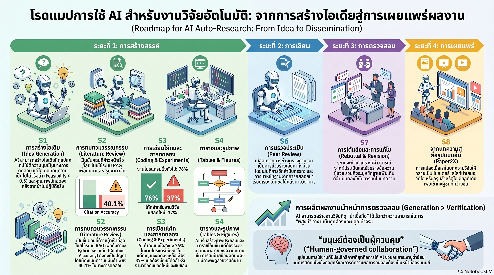

[กลับไปที่หน้าหลัก](../README.md)

สวัสดีครับเพื่อนๆ ที่ติดตามวงการ AI! Roadmap เมษายน 2026 เผยตัวเลขที่ทำให้หยุดคิดครับ ระบบ The AI Scientist ผลิตเปเปอร์งานวิจัยสมบูรณ์ได้ฉบับละ $15 (ราว 500 กว่าบาท) ครับ FARS รัน 228 ชั่วโมงต่อเนื่องผลิต 100 เปเปอร์ — เฉลี่ยทุก 2.3 ชั่วโมงครับ และ ARIS รัน 20+ การทดลองข้ามคืนจน Draft Quality พุ่งจาก 5.0 → 7.5 โดยอัตโนมัติครับ แต่ที่น่าสนใจกว่านั้นคือตัวเลขอีกฝั่ง: AI ทำงานโปรแกรมมิ่งทั่วไปได้ 76% แต่งานวิจัยที่ต้องการ Novelty จริงๆ ตกเหลือ 37-39% ครับ

คุณเคยสังเกตไหมครับว่า ความผิดพลาดที่อันตรายที่สุดของ AI Research System ไม่ใช่การที่โค้ดรันไม่ผ่านครับ แต่คือกรณีที่โค้ดรันผ่านสมบูรณ์แต่ AI เลือกใช้อัลกอริทึมผิดหลักการ (Semantic Error) ซึ่งพบสูงถึง 58.6% ของความผิดพลาดทั้งหมดครับ — ระบบที่เงียบและดูเรียบร้อยกลับเป็นระบบที่อันตรายที่สุดเพราะมนุษย์ไม่มี Error Message ให้สังเกตเห็นครับ?

คุณรู้ไหมครับว่า ในขั้นตอนสร้าง Tables และ Figures นั้น AI ทำได้ดีที่ 78.8% เมื่อความซับซ้อนต่ำ แต่เมื่อสมการคณิตศาสตร์ซับซ้อนขึ้น ความแม่นยำดิ่งลงเหลือ 15% ครับ — แต่กราฟที่ได้ยังคงดูสวยงามและดูมืออาชีพเหมือนเดิมทุกประการครับ? นั่นคือ Visual Plausibility ที่อาจทำให้วิทยาศาสตร์สั่นคลอนได้ถ้าผ่านการตรวจสอบไม่ดีพอครับ

และคุณเคยนึกไหมครับว่า ปัญหาใหญ่ของ Auto-Research ไม่ใช่ "ตรวจจับว่า AI เขียนไหม" อีกต่อไปแล้วครับ แต่คือ Verification Deficit ครับ — AI ผลิตชิ้นงานวิจัยเร็วกว่าที่มนุษย์จะตรวจสอบความถูกต้องทางวิทยาศาสตร์ได้ทันครับ? และนั่นทำให้คำถามเปลี่ยนจาก "ใครเขียน?" เป็น "ใครรับผิดชอบ?" ครับ

งานวิจัยนี้กำลังบอกว่า: "AI สามารถช่วยผลิต 'ชิ้นงาน' ได้ แต่ 'ความจริงทางวิทยาศาสตร์' และ 'ความรับผิดชอบ' ยังต้องการมนุษย์ที่เป็นเจ้าของกระบวนการคิดอยู่เสมอครับ — Verification ไม่ใช่ขั้นตอนสุดท้าย แต่คือหัวใจของ Human-governed Research ครับ"

========================================

🤔 ทบทวนความเชื่อเดิมๆ: สิ่งที่เราคิดเกี่ยวกับ AI กับงานวิจัย

▪ "AI ที่ทำวิจัยได้เร็วและถูกหมายความว่าคุณภาพงานวิจัยโดยรวมจะดีขึ้นครับ — เพราะทดลองได้มากกว่าเดิมมหาศาล" → ปริมาณไม่แปลงเป็นคุณภาพโดยอัตโนมัติครับ Novelty Gap ที่ตกจาก 76% → 37% บอกว่า AI เก่งมากในการ Explore ภายใน Pattern ที่รู้จักครับ แต่งานวิจัยที่มีคุณค่าจริงๆ อยู่ที่จุดที่ออกนอก Pattern นั้นครับ ปริมาณที่เพิ่มขึ้นมหาศาลอาจนำมาซึ่ง Noise มากกว่า Signal ถ้าไม่มี Scientific Judgment กรองครับ

▪ "ถ้าโค้ดรันผ่านและได้ผลลัพธ์ที่สมเหตุสมผล งานวิจัยนั้นก็น่าจะถูกต้องครับ — Error จะเห็นชัดจาก Output" → 58.6% ของความผิดพลาดของ AI Research คือ Semantic Error ที่โค้ดรันผ่านสมบูรณ์แต่ Algorithm ผิดหลักการครับ ไม่มี Error Message ครับ ไม่มี Stack Trace ครับ Output ดูสมเหตุสมผลครับ ความอันตรายอยู่ตรงที่ระบบที่ "ดูทำงานได้" แต่ตอบคำถามผิดครับ

▪ "AI สร้าง Figures และ Tables ได้ดีพอสำหรับงานวิจัยครับ — เพราะมันสามารถ Visualize ข้อมูลได้หลาย Format" → ความแม่นยำตกจาก 78.8% → 15% เมื่อสมการซับซ้อนขึ้นครับ แต่คุณภาพภาพนิ่งครับ กราฟที่ผิดทางคณิตศาสตร์อาจดูสวยงามและมืออาชีพเหมือนกราฟที่ถูกต้องทุกประการครับ Visual Plausibility ไม่ใช่ Scientific Validity ครับ

▪ "ปัญหาหลักของ AI-generated Research คือการตรวจจับว่า AI เขียนไหม — Detection Tool ที่ดีพอก็แก้ได้" → Verification Deficit บอกว่า Detection ไม่ใช่ปัญหาหลักอีกต่อไปแล้วครับ AI ผลิตงานเร็วกว่าที่ Peer Review จะตรวจสอบ Scientific Validity ได้ครับ คำถามจึงเปลี่ยนจาก "ใครเขียน?" เป็น "ระบบ Governance ไหนจะรับประกัน Cognitive Ownership และ Scientific Accountability?" ครับ

ความจริงที่น่าคิดคือ: "ในโลกที่ $15 ซื้อ Research Paper ได้ คุณค่าที่เหลืออยู่จริงๆ ของนักวิจัยมนุษย์คือ Scientific Judgment ที่ AI ยังทำแทนไม่ได้ครับ"

========================================

🧠 พื้นฐานที่ต้องเข้าใจก่อน: 4-Phase Lifecycle, Novelty Gap, Semantic Error, Visual Plausibility, และ Human-governed Collaboration

=== The AI Scientist, FARS, ARIS: ตัวเลขที่บอกว่าวิจัยไม่เหมือนเดิมอีกต่อไป ===

The AI Scientist เป็นระบบที่ Orchestrate ทั้งกระบวนการวิจัยตั้งแต่ต้นจนจบครับ ตั้งสมมติฐาน ค้นหาเอกสาร เขียนโค้ด รันการทดลอง และเขียน Manuscript ครับ ต้นทุนต่อเปเปอร์: $15 ครับ ซึ่งถูกกว่าค่าพิมพ์กระดาษสมัยก่อนเสียอีกครับ

FARS (Fast Autonomous Research System) แสดงความสามารถด้าน Throughput ครับ 228 ชั่วโมงต่อเนื่อง 100 เปเปอร์ครับ อัตราเฉลี่ยคือ 1 เปเปอร์ทุก 2.3 ชั่วโมงครับ นักวิจัยมนุษย์ที่ดีที่สุดต้องใช้เวลาหลายเดือนต่อ 1 เปเปอร์ครับ

ARIS (Autonomous Research Improvement System) แสดงความสามารถด้าน Quality Iteration ครับ รัน 20+ การทดลองข้ามคืน ตรวจสอบและตัดข้อสรุปที่ไม่มีหลักฐานรองรับออก และพัฒนา Draft Score จาก 5.0 → 7.5 โดยอัตโนมัติครับ มันไม่แค่เร็วครับ มันเรียนรู้จากความล้มเหลวของตัวเองในรอบเดียวกันครับ

=== 4-Phase 8-Step Lifecycle: แผนที่ของการวิจัยยุคใหม่ ===

งานวิจัยแบ่ง Research Pipeline เป็น 4 Phase ครับ ซึ่งแต่ละ Phase มีความสามารถและจุดอ่อนของ AI ต่างกันอย่างชัดเจนครับ

Phase 1 Creation ครับ S1 Idea Generation ครับ AI เก่งในการ Recombine Existing Ideas แต่ Novelty Gap ชัดเจนที่นี่ครับ ไอเดียที่ดูดีในเชิงทฤษฎีอาจพังเมื่อเจอข้อจำกัดทางเทคนิคจริงๆ ครับ S2 Literature Review ครับ AI แข็งมากครับ สรุป Paper จำนวนมากได้เร็วครับ แต่ยังมีปัญหา Hallucinated Citations ครับ S3 Coding and Experiments ครับ 76% Success Rate สำหรับงานทั่วไปครับ แต่ Semantic Error Rate สูง 58.6% ครับ S4 Tables and Figures ครับ จุดอ่อนที่อันตรายที่สุดครับ Visual Plausibility สูงแต่ Accuracy ดิ่งเมื่อซับซ้อนขึ้นครับ

Phase 2 Writing ครับ S5 Paper Writing ครับ AI เก่งมากในการ Fluency ครับ แต่ Logic ระหว่าง Section และ Scientific Narrative ยังต้องการ Human Oversight ครับ

Phase 3 Validation ครับ S6 Peer Review Simulation ครับ AI จำลองผู้ตรวจสอบได้ดี แต่ไม่สามารถ Verify Scientific Truth ได้จริงๆ ครับ เป็นได้แค่ Style Review ไม่ใช่ Fact Review ครับ S7 Rebuttal and Revision ครับ AI ตอบสนองต่อ Feedback ได้เร็วครับ แต่อาจ Revise ในทิศทางที่ทำให้งานดูดีกว่า ไม่ใช่ถูกต้องกว่าครับ

Phase 4 Dissemination ครับ S8 Paper2X ครับ AI แปลง Paper เป็น Slides, Video, Social Post, และ Interactive Paper Agent ได้ครับ นี่คือ Phase ที่ AI ให้ Value ที่ชัดที่สุดโดยไม่มี Scientific Risk สูงครับ

=== Novelty Gap: ทำไม AI ถึงตกหน้าผาตรงจุดที่สำคัญที่สุด ===

Novelty Gap คือ Pattern ที่น่ากังวลที่สุดจาก Roadmap ครับ ประสิทธิภาพสูงในงานมาตรฐาน (76%) ดิ่งลงในงานที่ต้องการความแปลกใหม่ (37-39%) ครับ

ทำไม? เพราะ LLM ทำงานด้วยหลัก Pattern Matching และ Statistical Association ครับ ยิ่ง Training Data มีงานวิจัยที่คล้ายกันมากเท่าไหร่ AI ยิ่งทำได้ดีครับ แต่งานวิจัยที่มีคุณค่าจริงๆ คืองานที่อยู่ตรงขอบของ Unknown ครับ ที่ไม่มีใครเคยทำมาก่อนครับ ที่ Training Data ไม่มีตัวอย่างให้เรียนรู้ครับ — นั่นคือจุดที่ Pattern Matching พังครับ

Scientific Judgment ที่มนุษย์มีคือความสามารถในการ Reason ในสภาวะที่ไม่มีข้อมูลเพียงพอ ตัดสินใจได้ว่า "ทางนี้น่าสนใจกว่า" แม้ยังไม่มีหลักฐานสนับสนุนครับ นั่นคือสิ่งที่ AI ณ ปัจจุบันยังทำได้ไม่ดีพอครับ

=== Semantic Error และ Visual Plausibility: ความเงียบที่อันตราย ===

Semantic Error ครับ ความผิดพลาดที่ซ่อนในความสำเร็จของ AI ครับ เมื่อโค้ดรันผ่านและได้ Output มนุษย์มักผ่อนคลายการตรวจสอบลงครับ แต่ 58.6% ของความผิดพลาดในงานวิจัยอยู่ตรงนี้ครับ Algorithm ผิดหลักการ, Metric ที่วัดไม่ตรงคำถาม, หรือ Baseline ที่เลือกมาเพื่อให้ผลดูดีครับ

Visual Plausibility ครับ เมื่อความซับซ้อนของสมการต่ำ AI ทำ Tables และ Figures ได้ดี 78.8% ครับ แต่เมื่อสมการซับซ้อนขึ้นความแม่นยำตก 15% ในขณะที่ความสวยงามของกราฟไม่ลดลงเลยครับ กราฟที่แสดงผลผิดหลักทางคณิตศาสตร์อาจดูสวยกว่ากราฟที่ถูกต้องเสียอีก เพราะ AI ถูก Train บน Aesthetic ของ Scientific Visualization มากกว่า Mathematical Rigor ครับ

=== Trajectory Data: เหตุผลที่ AI วิจัยเก่งขึ้นในทิศทางที่ถูกต้อง ===

สิ่งที่ทำให้ระบบอย่าง ARIS แตกต่างจาก LLM ทั่วไปคือ Trajectory Data ครับ แทนที่จะ Train ให้โมเดล Predict Token ถัดไปเท่านั้น ARIS เรียนรู้จาก "ร่องรอยการทำงาน" ของนักวิจัยมืออาชีพครับ ได้แก่ การที่นักวิจัยตัดสินใจเลือก Design ทางหนึ่งและทิ้งอีกทางหนึ่ง, วิธีที่นักวิจัยตอบสนองต่อ Reviewer Comment, และ Pattern ของการ Iterate จาก Draft แย่สู่ Paper ที่ดีครับ

ผลคือ AI ไม่แค่รู้ว่า Research Paper หน้าตาเป็นอย่างไรครับ แต่รู้ว่า Process ของการทำวิจัยที่ดีเป็นอย่างไรครับ นั่นคือความแตกต่างระหว่าง AI ที่เขียน Paper ได้กับ AI ที่ทำวิจัยได้ครับ

=== Human-governed Collaboration: Framework สำหรับยุคนี้ ===

Verification Deficit คือ Gap ที่ต้องออกแบบรอบๆ มันครับ ไม่ใช่ฝืนแก้ให้มันหายไปครับ Model ที่ใช้งานได้จริงคือ Human-governed Collaboration ที่แบ่งบทบาทชัดเจนครับ

Reduce Mechanical Friction ครับ ให้ AI จัดการงานที่ซ้ำซ้อน เช่น Format ตรวจคำผิด ดึงข้อมูล Background ทำ Literature Summary และ Convert Paper เป็น Format ต่างๆ ครับ งานเหล่านี้ใช้เวลามนุษย์มากแต่ไม่ต้องการ Scientific Judgment สูงครับ

Maintain Cognitive Ownership ครับ มนุษย์ยังต้องเป็นเจ้าของ Hypothesis ที่แท้จริง, ตัดสินใจว่าผล Experiment Validate หรือ Falsify Hypothesis, และรับผิดชอบต่อ Claim ที่ตีพิมพ์ทุกข้อครับ ไม่ใช่เพราะ Regulation บังคับ แต่เพราะ Scientific Truth ต้องการ Someone who can be wrong and learn from it ครับ

========================================

🎯 ประเด็นที่ควรคิดต่อ

— Novelty Gap ที่ 37% บอกว่า Frontier ของ Science ยังเป็นที่ปลอดภัยสำหรับมนุษย์ครับ แต่ไม่นานพอ: ถ้าวันนี้ AI อยู่ที่ 37% ใน Novel Research และ Trajectory Learning กำลังขยายขีดจำกัดนั้น เราอาจมีเวลาอีกไม่กี่ปีก่อนที่ Gap นั้นจะแคบลงมากครับ คำถามที่นักวิจัยทุกคนควรถามตัวเองคือ "ความสามารถที่ฉันมีซึ่ง AI ยังทำไม่ได้คืออะไร?" และ "ฉันกำลังพัฒนาความสามารถนั้นให้ลึกขึ้นหรือเปล่า?" ครับ

— Semantic Error ที่ 58.6% คือ Argument ที่แข็งแกร่งที่สุดว่าทำไม Verification Workflow ต้องเป็น Mandatory ไม่ใช่ Optional ครับ: ถ้าความผิดพลาดส่วนใหญ่ไม่มี Error Message ไม่มี Warning ไม่มีสัญญาณเตือน ระบบ Review ที่พึ่งพาการสังเกตความผิดปกติจาก Output จะพลาดความผิดพลาดเหล่านั้นไปเป็นส่วนใหญ่ครับ Scientific Verification ต้องตรวจสอบ Algorithm Logic ไม่ใช่แค่ Output Format ครับ

— Dissemination Phase (S8 Paper2X) คือจุดที่ AI ให้ Value สูงสุดโดยไม่เสี่ยง Scientific Integrity ครับ: การแปลง Paper เป็น Interactive Agent, สร้าง Video Explanation, หรือเขียน Social Post ไม่ต้องการ Novel Scientific Judgment ครับ แต่กินเวลามนุษย์มากมายครับ AI ที่ทำ Dissemination ได้ดีจะทำให้งานวิจัยที่ดีถึงมือคนที่ควรได้อ่านมันได้เร็วและกว้างขึ้นมหาศาลครับ นี่คือ ROI ที่ชัดเจนที่สุดของ Auto-Research ในวันนี้ครับ

#AutoResearch #AIScientist #FARS #ARIS #ScientificAI #NoveltyGap #SemanticError #VisualPlausibility #VerificationDeficit #ResearchAutomation #CognitiveOwnership #TrajectoryData #HumanGovernedAI #AcademicAI #LLMResearch
