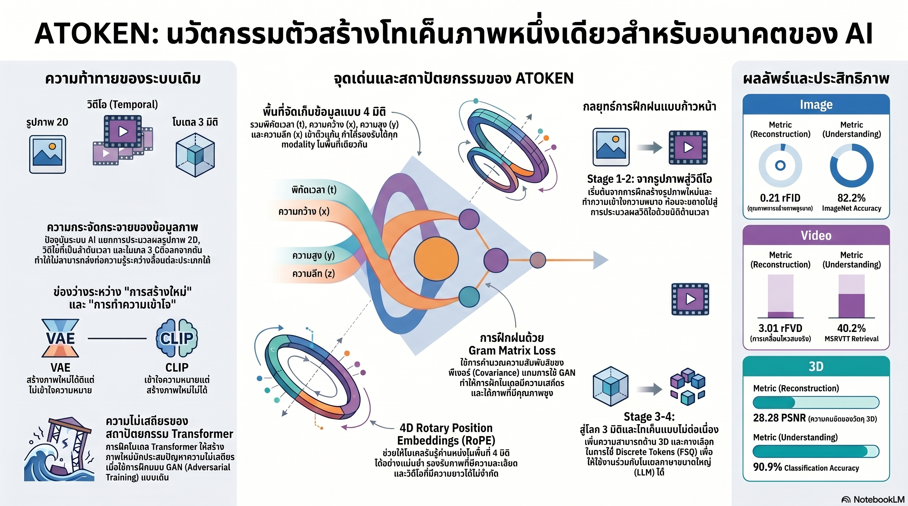

[กลับไปที่หน้าหลัก](../README.md)

สวัสดีครับเพื่อนๆ ที่ติดตามวงการ AI! วันนี้มาเรื่องที่ Apple กำลังทำสิ่งที่นักวิจัย Computer Vision พยายามทำมาตลอดแต่ยังไม่มีใครสำเร็จ นั่นคือการรวมภาพนิ่ง วิดีโอ และ 3D Object เข้าในระบบเดียวกัน พร้อมทำได้ทั้งการ "เข้าใจ" และ "สร้าง" ด้วยสถาปัตยกรรมตัวเดียวครับ

คุณเคยสังเกตไหมครับว่า โลกของ Language AI มีความก้าวหน้าเร็วกว่า Computer Vision มากทั้งที่มีข้อมูลไม่ต่างกัน สาเหตุหนึ่งคือ NLP มี "ภาษากลาง" ที่ใช้ร่วมกันได้ทุกงาน แต่ Vision ยังมีโมเดลแยกสำหรับแต่ละงาน แต่ละมิติ แต่ละประเภทอยู่เลย?

คุณเคยสงสัยไหมครับว่า ทำไม AI ที่เก่งเรื่องความหมายของภาพมักสร้างภาพคมชัดไม่ได้ และ AI ที่สร้างภาพสวยกลับไม่เข้าใจบริบทลึกๆ เหมือนมีกำแพงล่องหนกั้นระหว่างสองโลกนี้อยู่ตลอดเวลา?

และคุณรู้ไหมครับว่า Apple วิเคราะห์แหล่งของข้อผิดพลาดในการสร้างภาพ แล้วพบว่า 86.6% มาจากการเข้าใจผิดเรื่อง Texture และสไตล์ ไม่ใช่ค่าสีพิกเซล และการค้นพบนี้นำไปสู่การเลิกใช้ GAN ทั้งหมดในสถาปัตยกรรมใหม่ครับ?

งานวิจัยนี้ชื่อ ATOKEN และมันกำลังทำในสิ่งเดียวกับที่ Token ทำให้กับ Language AI นั่นคือสร้างภาษากลางสำหรับโลกของ Visual Intelligence ครับ

========================================

🤔 ทบทวนความเชื่อเดิมๆ: สิ่งที่เราคิดเกี่ยวกับ Visual AI

▪ "การเข้าใจภาพและการสร้างภาพต้องใช้สถาปัตยกรรมต่างกัน เพราะเป็นงานคนละประเภทโดยสิ้นเชิง" → ATOKEN พิสูจน์ว่า Shared 4D Latent Space ที่ใช้ Pure Transformer ตัวเดียวสามารถทำได้ทั้งสองอย่างพร้อมกัน โดยไม่ต้องเลือกระหว่าง Semantic Encoder กับ Generative Decoder ครับ

▪ "ภาพนิ่ง วิดีโอ และ 3D Object เป็นข้อมูลคนละประเภทที่ต้องการโมเดลคนละตัวจัดการ" → Temporal Zero-padding เปลี่ยนภาพนิ่งให้เป็น "วิดีโอ 1 เฟรม" โดยไม่ต้องแก้ไขตรรกะทางคณิตศาสตร์ของโมเดลเลย ทั้งสามรูปแบบกลายเป็นกรณีพิเศษของโครงสร้าง 4 มิติเดียวกันครับ

▪ "GAN คือ State-of-the-Art สำหรับการสร้างภาพคมชัด ไม่มีทางเลือกที่ดีกว่า" → ATOKEN ค้นพบว่า GAN ไม่เสถียรใน Transformer เพราะ Discriminator เก่งเร็วเกินไปจน Logits แยกออกจากกัน Gram Matrix Loss แก้ปัญหาได้โดยตรงกว่าและฝึกได้เสถียรกว่ามากครับ

▪ "การเพิ่มงานหลายประเภทในการฝึกทำให้โมเดลสับสนและประสิทธิภาพแต่ละงานลดลง" → การเรียนรู้วิดีโอและ 3D กลับทำให้การเข้าใจภาพนิ่ง 2D ดีขึ้น Cross-modal Transfer พิสูจน์ว่าความรู้จากมิติที่กว้างกว่าไหลกลับมาเสริมสร้างความเข้าใจในมิติพื้นฐานครับ

ความจริงที่น่าคิดคือ: ที่ Language AI ก้าวหน้าเร็วกว่า Visual AI ไม่ใช่เพราะข้อมูลภาษาดีกว่า แต่เพราะภาษามี Token เป็นภาษากลางที่ทุกโมเดลใช้ร่วมกันได้ ATOKEN คือความพยายามสร้าง "Token สำหรับ Vision" เพื่อให้ Visual AI ตามทันภาษาได้ในที่สุดครับ

========================================

🧠 พื้นฐานที่ต้องเข้าใจก่อน: Latent Space, 4D RoPE, GAN และ Gram Matrix

=== ทำไม Vision AI จึงติดอยู่ใน "ไซโล"? ===

ในโลกของ Vision AI มีการแบ่งแยกหลักๆ สองชั้นครับ

[ชั้นที่ 1: Understanding vs Generation]
▸ Understanding: CLIP, SigLIP ออกแบบมาเพื่อเข้าใจความหมาย แต่สร้างภาพไม่ได้
▸ Generation: VAE, Diffusion Models สร้างภาพคมชัดได้ แต่ไม่เข้าใจบริบทเชิงลึก
▸ ทั้งสองกลุ่มคุยกัน "คนละภาษา" ทำให้ระบบที่ต้องการทั้งสองอย่างซับซ้อนมากครับ

[ชั้นที่ 2: แยกตามมิติ]
▸ โมเดลภาพนิ่ง (2D) ทำงานแต่กับพิกเซล (x, y)
▸ โมเดลวิดีโอ (3D) เพิ่มมิติเวลา (x, y, t)
▸ โมเดล 3D Object ทำงานกับ Voxel (x, y, z)
▸ ไม่มีระบบใดรองรับทั้งสามพร้อมกันครับ

=== Shared 4D Latent Space คืออะไร? ===

Latent Space = พื้นที่มิติสูงที่โมเดลเก็บ "ความหมาย" ของข้อมูลในรูปแบบ Vector

Shared 4D Latent Space = พื้นที่เดียวที่รองรับข้อมูลทุกรูปแบบ โดยแต่ละมิติมีความหมาย

[x]: ตำแหน่งแนวนอน
[y]: ตำแหน่งแนวตั้ง
[z]: ความลึก/ปริมาตร
[t]: เวลา/ลำดับ

ภาพนิ่งคือจุดที่ z=0, t=0 วิดีโอคือจุดที่ z=0, t≠0 และ 3D Object คือจุดที่ t=0, z≠0 ทุกอย่างอยู่ในพื้นที่เดียวกันครับ

=== 4D RoPE คืออะไร? ===

RoPE (Rotary Position Embeddings) = วิธีบอก Transformer ว่าข้อมูลแต่ละชิ้นอยู่ที่ "ตำแหน่ง" ไหนโดยใช้การหมุน Vector แทนการบวกค่าคงที่

4D RoPE = ขยาย RoPE ให้ครอบคลุมทั้ง 4 มิติพร้อมกัน

ประโยชน์สำคัญคือรองรับ Resolution และความยาววิดีโอที่ยืดหยุ่นได้ ไม่ต้องกำหนดขนาดตายตัวตั้งแต่ตอนฝึกครับ

เปรียบเทียบ: เหมือนระบบพิกัด GPS ที่บอกว่าอยู่ที่ละติจูด ลองจิจูด ความสูง และเวลาไหน ทำให้ทุกจุดบนโลกมี "ที่อยู่" ที่ไม่ซ้ำกัน แม้โลกจะมีขนาดต่างกันในแต่ละ Context ก็ตามครับ

=== GAN คืออะไร และทำไมมันพัง? ===

GAN (Generative Adversarial Network) = ระบบที่มีสองโมเดลแข่งกัน Generator พยายามสร้างภาพหลอก Discriminator พยายามจับโกหก ทั้งคู่พัฒนาขึ้นไปพร้อมกัน

ปัญหาใน Transformer Architecture: Discriminator เรียนรู้เร็วกว่า Generator มากเกินไป ทำให้ Logits ของ Discriminator แยกออกจากกัน (Diverge) การฝึกไม่เสถียรและล้มเหลวบ่อยครับ

=== Gram Matrix Loss คืออะไร? ===

Gram Matrix = เมทริกซ์ที่จับคู่ Feature Maps กับตัวเองเพื่อวัด "ความสัมพันธ์ระหว่าง Pattern" ในภาพ ซึ่งตรงกับ Covariance ที่เป็นต้นตอของ 86.6% ของข้อผิดพลาด

แทนที่จะให้ Discriminator แข่งกับ Generator Gram Matrix Loss วัดตรงๆ ว่า Texture และสไตล์ของภาพที่สร้างคล้ายกับต้นฉบับแค่ไหนครับ

========================================

1️⃣ Space-Time Patchification: เปลี่ยนทุกอย่างให้เป็นชิ้นส่วนในพื้นที่ 4 มิติ

=== หัวใจของ Unified Architecture ===

สิ่งที่ทำให้ ATOKEN รองรับข้อมูลทุกรูปแบบได้คือ Space-Time Patchification — การตัดข้อมูลออกเป็น "Patch" ขนาดเล็กๆ โดยมองทุกอย่างเป็นชิ้นส่วนใน 4 มิติ

[ภาพนิ่ง (2D)]
▸ มี Patch บนระนาบ (x, y)
▸ ใช้ Temporal Zero-padding: กำหนด t=0 และ z=0
▸ ผลคือภาพนิ่งถูกมองว่าเป็น "วิดีโอที่มีเพียง 1 เฟรม"

[วิดีโอ (3D)]
▸ มี Patch ที่ขยายตัวบนแกน (x, y, t)
▸ ประมวลผลการเคลื่อนไหวและการเปลี่ยนแปลงตามเวลา

[3D Object (Volume)]
▸ ATOKEN นำภาพจากหลายมุมมอง (Multi-view Rendering) มาสังเคราะห์
▸ ผลคือ Voxel Grid ขนาด 64×64×64 ที่แสดงโครงสร้าง 3 มิติได้แม่นยำ

เปรียบเทียบ: เหมือนระบบจัดเก็บไฟล์ที่ใช้โครงสร้างโฟลเดอร์เดียวกันไม่ว่าจะเป็นไฟล์ .jpg, .mp4 หรือ .obj ไม่ต้องมีซอฟต์แวร์คนละตัวสำหรับแต่ละประเภท แค่ใช้ระบบ 4 มิติเดียวกัน โดยที่ไฟล์แต่ละประเภทใช้มิติต่างกันครับ

=== เทคนิคสำคัญ: Temporal Zero-padding ===

Temporal Zero-padding คือเทคนิคง่ายๆ ที่ฉลาดมากครับ แทนที่จะสร้างโค้ดพิเศษสำหรับภาพนิ่ง ระบบแค่บอกว่า "เวลา = 0 และความลึก = 0" เท่ากับว่าภาพนิ่งคือวิดีโอที่หยุดนิ่งอยู่ชั่วคราว

ผลคือ Transformer ใช้ตรรกะทางคณิตศาสตร์เดิมในการประมวลผลทุกอย่าง ไม่ต้องมี Branch พิเศษสำหรับแต่ละประเภทข้อมูลครับ

========================================

2️⃣ ลาก่อน GAN: เมื่อ Gram Matrix เข้าใจปัญหาได้ตรงกว่า

=== การค้นพบที่เปลี่ยนสถาปัตยกรรมทั้งหมด ===

ก่อนจะตัดสินใจเลิกใช้ GAN Apple วิเคราะห์ข้อผิดพลาดอย่างละเอียดโดยใช้ rFID (Reconstruction FID) เพื่อดูว่า "ข้อผิดพลาดในการสร้างภาพเกิดจากอะไรบ้าง?"

ผลที่ได้ชัดเจนมากครับ

[Mean Component — ค่าสีเฉลี่ยของพิกเซล]
▸ 13.4% ของข้อผิดพลาด
▸ โมเดลมักเข้าใจสีหลักได้ถูกต้องอยู่แล้ว

[Covariance Component — ความสัมพันธ์ระหว่าง Pattern, Texture และสไตล์]
▸ 86.6% ของข้อผิดพลาด
▸ นี่คือต้นตอที่แท้จริงของปัญหาการสร้างภาพครับ

เปรียบเทียบ: เหมือนการวิเคราะห์ว่านักเรียนสอบตกเพราะอะไร แล้วพบว่า 86% ของคะแนนที่เสียไปมาจากข้อที่ต้องวิเคราะห์ Pattern และความสัมพันธ์ ไม่ใช่ข้อท่องจำ การรู้เช่นนี้ทำให้ออกแบบวิธีสอนได้ตรงประเด็นมากกว่าครับ

=== ทำไม Gram Matrix จึงเหมาะกว่า GAN? ===

GAN แก้ปัญหา Covariance แบบอ้อมๆ ผ่านการแข่งขัน ซึ่งในสถาปัตยกรรม Transformer มักไม่เสถียรเพราะ Discriminator เก่งเกินไป

Gram Matrix วัด Covariance โดยตรง ไม่ต้องแข่งกับใคร ไม่มีความเสี่ยงที่ Logits จะ Diverge และฝึกได้เสถียรในทุก Scale

[GAN]: สร้างคู่แข่งขึ้นมา → หวังว่าการแข่งขันจะสร้างภาพที่ดี → ไม่เสถียรใน Transformer
[Gram Matrix]: วัด Pattern ที่ต้องการโดยตรง → ปรับจนตรงตามเกณฑ์ → เสถียรและ Scalable ครับ

========================================

3️⃣ Cross-modal Transfer: เรียนรู้หลายมิติทำให้ฉลาดขึ้นทุกมิติ

=== สิ่งที่ขัดกับสัญชาตญาณ ===

สามัญสำนึกบอกว่า ถ้าบอกให้ AI เรียนรู้งานหลายอย่างพร้อมกัน แต่ละงานจะได้ทรัพยากรน้อยลงและแย่ลง แต่ ATOKEN พบตรงข้ามครับ

เมื่อเพิ่มการเรียนรู้วิดีโอ (มิติเวลา) และ 3D (มิติปริมาตร) เข้าไป คะแนนการเข้าใจและสร้างภาพนิ่ง 2D กลับดีขึ้นกว่าโมเดลที่ฝึกแค่ 2D อย่างเดียว

=== ทำไม Cross-modal Transfer จึงเกิดขึ้น? ===

ภาพนิ่งคือ "ชั่วขณะหนึ่ง" ของสิ่งที่มักเป็นวัตถุ 3D ที่เคลื่อนที่ได้ในเวลา เมื่อโมเดลเรียนรู้วิดีโอ มันเข้าใจว่าวัตถุในภาพนิ่งมีความต่อเนื่องในเวลา เมื่อเรียนรู้ 3D มันเข้าใจว่าแสงเงาในภาพนิ่งสะท้อนโครงสร้างปริมาตรจริง

เปรียบเทียบ: เหมือนนักเรียนที่เรียนฟิสิกส์แล้วกลับเก่งคณิตศาสตร์มากขึ้น เพราะฟิสิกส์สอนให้เห็น "ความหมาย" เบื้องหลังสมการ ความรู้ข้ามสาขา Transfer มาเสริมความเข้าใจพื้นฐานครับ

=== Progressive Curriculum: ฝึกอย่างมีลำดับขั้น ===

ATOKEN ใช้การฝึก 4 ขั้นตอนที่สร้างบนรากฐานของกันและกัน

[ขั้นที่ 1: Image Foundation]
▸ เริ่มจาก SigLIP2 Vision Tower ซึ่งเป็น Semantic Giant
▸ สร้างฐานความเข้าใจภาพก่อนทุกอย่าง

[ขั้นที่ 2: Video Dynamics]
▸ เพิ่มมิติเวลาและการเคลื่อนไหว
▸ โมเดลเรียนรู้ว่าโลกเปลี่ยนแปลงได้ตามเวลา

[ขั้นที่ 3: 3D Geometry]
▸ เพิ่มความเข้าใจเชิงเรขาคณิตและมิติพื้นที่
▸ โมเดลเรียนรู้ว่าวัตถุมีโครงสร้างปริมาตร

[ขั้นที่ 4: Quantization]
▸ แปลงข้อมูล Continuous ให้เป็น Discrete Tokens
▸ เตรียมพร้อมสำหรับการใช้งานร่วมกับ LLM ในขั้นต่อไปครับ

เปรียบเทียบ: เหมือนหลักสูตรดนตรีที่เริ่มจากโน้ตพื้นฐาน ก่อนจะเพิ่มจังหวะ แล้วเพิ่มฮาร์โมนี แล้วค่อยประสานวงออร์เคสตรา ทุกขั้นสร้างบนสิ่งที่เรียนไปแล้ว ไม่มีขั้นใดที่กระโดดเริ่มจากศูนย์ครับ

========================================

4️⃣ จาก Grand Unified Theory สู่ Foundation Model ของ Visual AI

=== ทำไม ATOKEN จึงสำคัญกว่าแค่ Tokenizer ใหม่? ===

ใน Language AI ความก้าวหน้าระเบิดขึ้นไม่ใช่เมื่อโมเดลใหญ่ขึ้น แต่เมื่อ Tokenization กลายเป็นมาตรฐานกลางที่ทุกโมเดลใช้ร่วมกันได้ ATOKEN กำลังทำสิ่งเดียวกันกับ Vision ครับ

[ก่อน ATOKEN]
▸ โมเดล Understanding ใช้ภาษาหนึ่ง
▸ โมเดล Generation ใช้อีกภาษาหนึ่ง
▸ 2D, Video, 3D ต่างก็มีระบบของตัวเอง

[หลัง ATOKEN]
▸ ภาษากลางเดียวสำหรับทุกงานและทุกมิติ
▸ โมเดลที่ฝึกบน ATOKEN สามารถ "คุยกัน" ได้ทันที
▸ ความรู้ข้าม Domain Transfer ได้โดยธรรมชาติครับ

=== ประตูที่ ATOKEN เปิดออกสู่อนาคต ===

เมื่อ Visual AI มี Token มาตรฐานเหมือน Language AI สิ่งที่เป็นไปได้จะขยายออกไปมาก

▸ Text → Video: เขียนคำอธิบายแล้วได้วิดีโอที่เข้าใจบริบทเชิงลึก
▸ Photo → 3D Object: ภาพถ่ายเดียวสร้างโมเดล 3 มิติที่สมจริง
▸ Multimodal LLM ที่ "มองเห็น" ในระดับ 4 มิติ ไม่ใช่แค่จำแนกภาพ

เปรียบเทียบ: เหมือนการที่อินเทอร์เน็ตรวมกันได้เพราะทุกคนใช้ TCP/IP โปรโตคอลเดียวกัน ก่อนหน้านั้นแต่ละเครือข่ายใช้โปรโตคอลของตัวเองและคุยกันไม่ได้ ATOKEN คือ TCP/IP ของ Visual AI ครับ

========================================

🎯 สรุป: 4 บทเรียนจาก ATOKEN

▸ ไซโลใน Visual AI ไม่ได้เกิดจากความจำเป็นทางเทคนิค แต่เกิดจากการขาด "ภาษากลาง": Temporal Zero-padding พิสูจน์ว่าภาพนิ่ง วิดีโอ และ 3D สามารถอยู่ใน Framework เดียวกันได้ โดยการออกแบบที่ฉลาด ไม่ใช่โดยการสร้างโมเดลเพิ่ม

▸ วิเคราะห์ปัญหาก่อนออกแบบวิธีแก้: การพบว่า 86.6% ของข้อผิดพลาดมาจาก Covariance นำไปสู่การตัดสินใจที่ถูกต้องที่สุด การใช้ Gram Matrix Loss โดยตรงแทน GAN ที่ไม่เสถียร

▸ Cross-modal Transfer คือกุญแจของ Foundation Model ที่แท้จริง: โมเดลที่เรียนรู้กว้างขึ้นในหลายมิติพร้อมกันไม่ได้แย่ลง แต่กลับดีขึ้นในทุกมิติ เพราะความรู้จากมิติที่กว้างกว่าช่วยสร้างความเข้าใจที่ลึกขึ้น

▸ Tokenization มาตรฐานกลางคือตัวเร่งปฏิกิริยาของ AI Ecosystem: เหมือนที่ Token มาตรฐานทำให้ Language AI ก้าวกระโดด ATOKEN อาจกำลังสร้างรากฐานที่ทำให้ Visual AI ก้าวกระโดดแบบเดียวกันในทศวรรษหน้า

หลักการสำคัญ: "ความก้าวหน้าที่ยิ่งใหญ่ที่สุดในวิทยาศาสตร์มักไม่ได้มาจากการค้นพบใหม่ แต่มาจากการพบว่าสิ่งที่เคยคิดว่าต่างกันนั้นแท้จริงแล้วเป็นสิ่งเดียวกัน ATOKEN คือการค้นพบว่า ภาพ วิดีโอ และ 3D ล้วนเป็นการมองโลกในมิติที่ต่างกันของจักรวาลข้อมูล 4 มิติเดียวกัน" ครับ

========================================

💬 คำถามท้ายทาย

1. ATOKEN ใช้ Temporal Zero-padding ทำให้ภาพนิ่งกลายเป็น "วิดีโอ 1 เฟรม" ซึ่งฉลาดมาก แต่ถ้าโมเดลฝึกโดยมองภาพนิ่งเป็น "วิดีโอที่หยุดนิ่ง" มันจะพยายาม "เดา" ว่าเฟรมถัดไปควรเป็นอะไร แม้ตอนใช้งานจริงจะเป็นแค่ภาพนิ่ง นี่จะส่งผลดีหรือผลเสียต่อการเข้าใจภาพนิ่งอย่างไรครับ?

2. Cross-modal Transfer พิสูจน์ว่าการเรียนรู้วิดีโอทำให้เข้าใจภาพนิ่งดีขึ้น แต่ในทิศทางตรงข้าม การเรียนรู้ภาพนิ่งจำนวนมาก (เช่น ImageNet) ช่วยให้เข้าใจวิดีโอดีขึ้นด้วยไหม หรือมี "ทิศทางที่ได้กำไรมากกว่า" ในการ Transfer ระหว่างมิติครับ?

3. Gram Matrix Loss แก้ปัญหา Texture/Covariance ได้ดี แต่ 13.4% ที่เหลือซึ่งมาจาก Mean ยังต้องการวิธีอื่นอยู่ ในระบบที่เราต้องการทั้ง Texture ที่สมจริงและสีที่แม่นยำพร้อมกัน เช่น งานทางการแพทย์หรืองานวิศวกรรม การ Balance ระหว่าง Loss สองตัวนี้ควรทำอย่างไรครับ?

4. ATOKEN มุ่งสร้าง "TCP/IP ของ Visual AI" เพื่อให้ทุกโมเดลใช้ภาษากลางเดียวกัน แต่ถ้า Apple เป็นเจ้าของมาตรฐานนี้ มีความเสี่ยงที่ Ecosystem ทั้งหมดจะถูกผูกติดกับบริษัทเดียวไหม และควรออกแบบ Governance ของมาตรฐาน Visual Tokenization อย่างไรให้เป็นสาธารณประโยชน์จริงๆ ครับ?

========================================

References:
▸ ATOKEN (A Unified Tokenizer for Vision) — Apple Research, Unified Visual Tokenization สำหรับ 2D, Video และ 3D
▸ Shared 4D Latent Space — พื้นที่ Latent เดียวที่รองรับทั้ง Understanding และ Generation
▸ Space-Time Patchification — การตัด 4D Data เป็น Patch สำหรับ Transformer Processing
▸ Temporal Zero-padding — เทคนิคเปลี่ยนภาพนิ่งเป็น "วิดีโอ 1 เฟรม" โดยไม่แก้โมเดล
▸ 4D RoPE — Rotary Position Embeddings สำหรับทั้ง 4 มิติ รองรับ Resolution และความยาวที่ยืดหยุ่น
▸ Voxel Grid 64×64×64 — การ Synthesize โครงสร้าง 3D จาก Multi-view Rendering
▸ rFID Analysis: 86.6% Covariance Error — การวิเคราะห์ที่นำไปสู่การเลิกใช้ GAN
▸ Gram Matrix Loss — แทนที่ Adversarial Training สำหรับ Texture/Style Preservation
▸ Progressive Curriculum (4 ขั้น) — Image Foundation (SigLIP2) → Video Dynamics → 3D Geometry → Quantization
▸ Cross-modal Transfer — ความรู้จาก Video/3D ช่วยเสริมความสามารถด้าน 2D Image

ในวันที่ภาพนิ่ง วิดีโอ และ 3D Object พูดภาษาเดียวกันได้ในที่สุด และ AI เริ่มมองโลกในระดับ 4 มิติแทนที่จะมองแบบแบนราบ คำถามที่น่าขบคิดคือ เมื่อ AI เริ่มเห็น "มิติของเวลา" และ "มิติของปริมาตร" ในภาพถ่ายธรรมดา มันกำลังเข้าใจโลกเหมือนมนุษย์มากขึ้น หรือกำลังเข้าใจโลกในแบบที่ต่างออกไปโดยสิ้นเชิงครับ ⚡

#ATOKEN #AppleAI #UnifiedTokenization #ComputerVision #4DLatentSpace #MultimodalAI #VisualAI #GramMatrix #CrossModalTransfer #AIResearch #AIThailand #ปัญญาประดิษฐ์ #MachineLearning #FoundationModel
