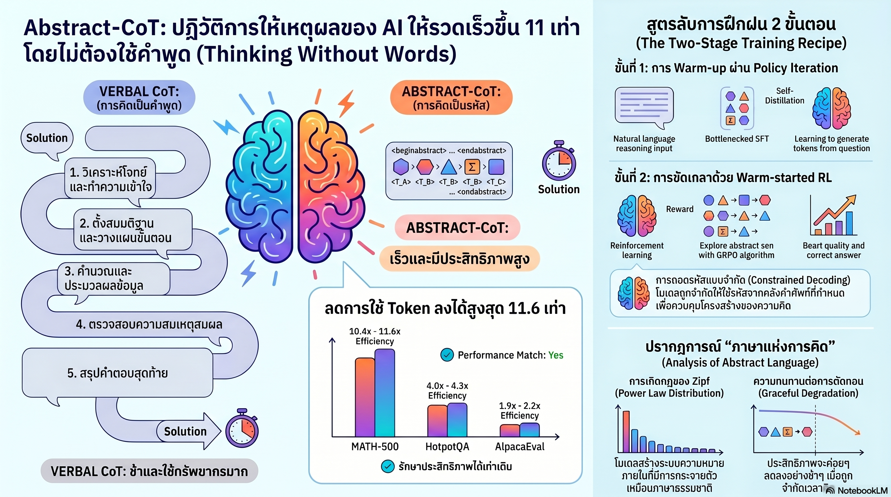

[กลับไปที่หน้าหลัก](../README.md)

สวัสดีครับเพื่อนๆ ที่ติดตามวงการ AI! วันนี้มาเรื่องที่ท้าทายสมมติฐานพื้นฐานของ Reasoning AI มาหลายปี: "AI ที่ฉลาดขึ้นต้องคิดออกมาเป็นคำพูดให้มากขึ้น" จากงานวิจัย "Thinking Without Words" ของ IBM Research ที่พิสูจน์ว่า AI สามารถ "คิดในใจ" ผ่านโทเคนนามธรรมที่ไม่มีความหมายในภาษามนุษย์ ได้ผลลัพธ์ที่ดีกว่า และใช้โทเคนน้อยกว่าถึง 11.6 เท่าครับ

คุณเคยสังเกตไหมครับว่า นักหมากรุกระดับแชมป์โลกอย่าง Magnus Carlsen ไม่ได้นั่งบรรยายทุกขั้นตอนในใจว่า "ถ้าม้าไปตรงนี้ แล้วช้างของฝ่ายตรงข้ามจะมาตรงนั้น แล้วเราจะเดินตรงนี้" — เขาแค่ "เห็น" กระดานและรู้ว่าต้องเดินตรงไหน ในขณะที่นักหมากรุกมือใหม่ต้องพึ่งการบรรยายทุกขั้นตอนเพื่อให้แน่ใจว่าไม่พลาดครับ

คุณรู้ไหมครับว่า AI อย่าง DeepSeek-R1 หรือ o1 ที่เราชื่นชมเรื่องความสามารถในการคิดเป็นลำดับขั้นตอน (Chain-of-Thought) นั้น จริงๆ แล้วใช้โทเคนจำนวนมหาศาลในการ "พูดกับตัวเอง" เป็นภาษามนุษย์ก่อนตอบ ซึ่งทุกตัวอักษรที่พิมพ์ออกมาคือเวลาและเงินที่เราต้องจ่ายครับ

และคุณเคยนึกไหมครับว่า ถ้า AI ถูกบังคับให้ "สรุปความคิดที่ยืดยาว" ลงในโทเคนลับที่ไม่มีความหมายในภาษามนุษย์ และทำซ้ำจนมันค้นพบ "ภาษาแห่งการใช้เหตุผล" ของตัวเองขึ้นมา — ภาษานั้นจะหน้าตาเป็นอย่างไร และมันจะเป็นไปตามกฎเดียวกับภาษาของมนุษย์ทุกคนบนโลกหรือเปล่าครับ?

งานวิจัยนี้กำลังบอกว่า: ความฉลาดและความเร็วไม่ได้ขัดแย้งกัน ถ้าเราออกแบบให้ AI คิดในรูปแบบที่เหมาะกับธรรมชาติของมัน แทนที่จะบังคับให้มันคิดผ่านภาษาที่ถูกออกแบบมาสำหรับมนุษย์ครับ

========================================

🤔 ทบทวนความเชื่อเดิมๆ: สิ่งที่เราคิดเกี่ยวกับ Chain-of-Thought และการคิดของ AI

▪ "Chain-of-Thought ที่ยาวกว่าหมายถึง AI คิดได้ละเอียดกว่าและแม่นยำกว่า การให้ AI พูดทีละขั้นตอนเป็นหัวใจของ Reasoning ที่ดี" → Abstract-CoT ลดโทเคน Reasoning ลง 11.6 เท่า แต่บน AlpacaEval ทำได้ 60.8 เหนือกว่า Verbal CoT ที่ทำได้ 58.4 — ยิ่งพูดมากไม่ได้หมายความว่ายิ่งคิดดีกว่าเสมอไปครับ

▪ "โทเคนนามธรรมที่ไม่มีความหมายจะไม่สามารถรองรับการคิดที่ซับซ้อนได้ เพราะมันขาดโครงสร้างเชิงความหมายของภาษาธรรมชาติ" → AI ที่ถูกฝึกด้วย Information Bottleneck และ GRPO สามารถ "บรรจุ" ตรรกะที่ซับซ้อนลงในโทเคนลับได้ และยังค้นพบโครงสร้างที่เป็นไปตามกฎ Zipf เหมือนภาษาธรรมชาติเองโดยไม่มีใครสอนครับ

▪ "เมื่อ AI หยุดคิดกลางคัน คุณภาพของคำตอบจะตกลงมาก เพราะตรรกะที่ยังไม่สมบูรณ์ไม่สามารถนำไปสู่คำตอบที่ถูกต้องได้" → Truncation Analysis พิสูจน์ว่า Abstract-CoT มีความทนทานสูงกว่ามากเมื่อถูกตัดกลางคัน เพราะตรรกะถูกบีบอัดอยู่ในโทเคนแต่ละตัวอย่างหนาแน่น ไม่ได้กระจายอยู่ในลำดับขั้นตอนที่ยาวเหมือน Verbal CoT ครับ

▪ "AI ต้องการภาษาธรรมชาติเป็นสื่อในการคิด เพราะ Training Data ส่วนใหญ่เป็นภาษามนุษย์ การให้ AI คิดนอกภาษาธรรมชาติจะทำให้ประสิทธิภาพลดลง" → Qwen3 (8B/4B) และ IBM Granite-4.0-Micro พิสูจน์ว่าโมเดลที่ถูกฝึกบนภาษาธรรมชาติสามารถ Post-train ให้คิดผ่านโทเคนนามธรรมได้อย่างมีประสิทธิภาพ โดยไม่ต้องเทรนจากศูนย์ครับ

ความจริงที่น่าคิดคือ: ภาษามนุษย์ถูกออกแบบมาเพื่อการสื่อสารระหว่างคน ไม่ใช่เพื่อการคิดที่มีประสิทธิภาพสูงสุด การบังคับให้ AI คิดผ่านภาษาธรรมชาติอาจเป็นข้อจำกัดที่เราสร้างขึ้นมาเองโดยไม่รู้ตัวครับ

========================================

🧠 พื้นฐานที่ต้องเข้าใจก่อน: Abstract-CoT, Information Bottleneck, Zipf's Law และ GRPO

=== Verbal CoT vs Abstract-CoT ต่างกันอย่างไร? ===

[Verbal Chain-of-Thought (แบบดั้งเดิม)]
▸ AI คิดเป็นภาษามนุษย์: "ก่อนอื่นเราต้องหาค่า x จากสมการ... แล้วแทนค่าลงใน..."
▸ ทุกตัวอักษรในความคิดคือโทเคนที่ต้องผลิต รอ และจ่ายเงิน
▸ ถ้าถูกตัดกลางคัน: ตรรกะขาดหาย คำตอบพังทันทีครับ

[Abstract Chain-of-Thought (DeepEyes)]
▸ AI คิดผ่านโทเคนลับ: `<TOKEN_F><TOKEN_A><TOKEN_R><TOKEN_F>...`
▸ แต่ละโทเคนนามธรรมแทนแนวคิดที่ซับซ้อนทั้งชุด
▸ ถ้าถูกตัดกลางคัน: ตรรกะส่วนใหญ่ยังอยู่ในโทเคนที่มีครับ

=== Information Bottleneck คืออะไร? ===

Information Bottleneck = เทคนิคการบังคับให้โมเดลบีบอัดข้อมูล โดยการ "ปิดทางลัด" ระหว่าง Input และ Output

ในบริบทของ Abstract-CoT: AI เห็น Verbal CoT ที่ยาว แต่ถูกบังคับให้สรุปลงในโทเคนนามธรรมก่อนที่จะตอบ ทำให้มันต้องเรียนรู้ว่าสาระสำคัญของตรรกะคืออะไร แทนที่จะแค่ "คัดลอก" ขั้นตอนครับ

=== Zipf's Law คืออะไร? และทำไมถึงสำคัญ? ===

Zipf's Law = กฎทางสถิติที่พบในภาษาธรรมชาติทุกภาษาบนโลก: คำที่ใช้บ่อยที่สุดนั้นบ่อยกว่าคำอันดับสองประมาณ 2 เท่า บ่อยกว่าคำอันดับสามประมาณ 3 เท่า และลดลงต่อเนื่องเป็นเส้นตรงในกราฟ Log-Log

สิ่งที่น่าทึ่ง: โทเคนนามธรรมของ DeepEyes เริ่มเป็นไปตามกฎ Zipf เองโดยอัตโนมัติ — `<TOKEN_F>` กลายเป็น Super-token ที่ใช้บ่อยผิดปกติ ราวกับว่า AI กำลังสร้าง "คำศัพท์ยอดนิยม" ของภาษาคิดของตัวเองครับ

========================================

1) 11.6x Token Reduction: เมื่อ "ความเงียบ" ฉลาดกว่า "ความพูดมาก"

ผลลัพธ์ที่น่าทึ่งที่สุดของ Abstract-CoT บน MATH-500 ซึ่งเป็น Benchmark คณิตศาสตร์ที่ซับซ้อน:

— Verbal CoT: ใช้โทเคน Reasoning หลายร้อยถึงหลายพันตัวต่อโจทย์
— Abstract-CoT: ลดลง 11.6 เท่า โดยคุณภาพคำตอบไม่ต่างกันอย่างมีนัยสำคัญ

เปรียบได้กับการส่ง "บันทึกการประชุม 10 หน้า" เทียบกับ "สรุปสาระสำคัญ 1 หน้า" — ถ้าทั้งสองฉบับนำไปสู่การตัดสินใจที่เท่ากัน สรุป 1 หน้านั้นดีกว่าอย่างไม่ต้องสงสัยครับ

แต่สิ่งที่น่าสนใจกว่าตัวเลขคือ บน AlpacaEval — Benchmark สำหรับ Instruction-following:
— Abstract-CoT: 60.8
— Verbal CoT: 58.4

Abstract-CoT ไม่ได้แค่ "เร็วขึ้นในระดับเดียวกัน" แต่ยัง "ดีขึ้นด้วย" ในบางมิติ ซึ่งบ่งบอกว่าการบีบอัดความคิดลงในโทเคนนามธรรมอาจช่วยให้โมเดลโฟกัสกับสาระสำคัญแทนที่จะสูญเสียพลังงานไปกับการ "อธิบายสิ่งที่ตัวเองทำ" ครับ

ในโลกของ Production: หากลดโทเคน Reasoning ได้ 11.6 เท่า หมายถึงลดต้นทุน API และลด Latency ลงในสัดส่วนใกล้เคียงกัน — ความต่างระหว่างระบบที่ใช้งานได้จริงกับระบบที่แพงเกินไปครับ

========================================

2) กำเนิดภาษาลับ: เมื่อ AI สร้างกฎ Zipf ขึ้นมาเอง

การค้นพบที่น่าทึ่งที่สุดในงานวิจัยนี้ไม่ใช่ตัวเลขประสิทธิภาพ แต่คือพฤติกรรมที่ไม่มีใครคาดไว้ล่วงหน้าครับ

เมื่อ AI ถูกให้ใช้โทเคนนามธรรม `<TOKEN_A>` ถึง `<TOKEN_Z>` ซึ่งตอนแรกล้วนว่างเปล่าและเท่าเทียมกันทุกตัว สิ่งที่เกิดขึ้นหลังการฝึกคือ:

โทเคนบางตัวถูกใช้บ่อยกว่าอย่างผิดปกติ — โดยเฉพาะ `<TOKEN_F>` ที่กลายเป็น Super-token ปรากฏในลำดับความคิดของ AI บ่อยกว่าโทเคนอื่นๆ อย่างมีนัยสำคัญ และความถี่ของโทเคนทั้งหมดเป็นไปตามกฎ Zipf (Power Law) เหมือนกับภาษาธรรมชาติทุกภาษาของมนุษย์ครับ

เปรียบได้กับการที่ลูกเล็กที่ไม่เคยเรียนภาษาไทยมาก่อน แต่เมื่อเริ่มพูดกลับใช้คำว่า "อ่า" และ "ก็" บ่อยกว่าคำอื่นๆ โดยธรรมชาติ เพราะคำเหล่านั้น "มีประโยชน์" ในการเชื่อมโครงสร้างประโยค — AI ทำสิ่งเดียวกันนี้กับโทเคนนามธรรมของมันครับ

ความหมายที่ลึกกว่านั้นคือ: Zipf's Law อาจไม่ใช่กฎของภาษามนุษย์โดยเฉพาะ แต่เป็นกฎของ "ระบบที่คิดอย่างมีประสิทธิภาพ" — ไม่ว่าจะเป็นมนุษย์หรือ AI ก็ตามครับ

========================================

3) Training Recipe: Information Bottleneck + GRPO สองขั้นตอนสู่ภาษาลับ

IBM Research ไม่ได้เทรนโมเดลใหม่ตั้งแต่ต้น แต่ใช้กระบวนการ Post-training อันชาญฉลาดที่ประกอบด้วย 2 ขั้นตอน ซึ่งแต่ละขั้นมีบทบาทที่ต่างกันโดยสิ้นเชิงครับ

ขั้นที่ 1 — Warm-up ด้วย Information Bottleneck (Policy Iteration):
เปรียบได้กับการสอนนักเรียนให้จดบันทึก แต่จำกัดว่าต้องจดในกระดาษขนาด Post-it ใบเดียวเท่านั้น นักเรียนจะบังคับให้ต้องคิดว่า "สิ่งสำคัญที่สุดในบทเรียนนี้คืออะไร" แทนที่จะคัดลอกทุกอย่างจากกระดาน

ในทางเทคนิค: AI เห็น Verbal CoT ที่ยาว แต่ถูกปิดกั้นไม่ให้ส่งต่อตรงๆ ไปยังขั้นตอนสรุปคำตอบ — มันต้องบีบอัดลงในโทเคนนามธรรมที่กำหนดให้ก่อนเท่านั้น กระบวนการนี้บังคับให้โมเดลเรียนรู้การ "ตกผลึก" ความคิดครับ

ขั้นที่ 2 — Reinforcement Learning ด้วย GRPO:
หลัง Warm-up โมเดลมี "ภาษาลับ" คร่าวๆ แล้ว แต่ยังไม่เชี่ยวชาญ GRPO (Group Relative Policy Optimization) คือการให้โมเดลลองหลายๆ วิธีในการใช้โทเคนนามธรรม แล้วเรียนรู้ว่าลำดับไหนนำไปสู่คำตอบที่แม่นยำที่สุด

เปรียบเหมือนนักกีฬาที่ผ่านการฝึกขั้นพื้นฐานมาแล้ว และตอนนี้ต้องแข่งกับตัวเองซ้ำๆ เพื่อค้นหาเทคนิคที่ดีที่สุดสำหรับตัวเองโดยเฉพาะ ไม่ใช่เทคนิคที่ดีสำหรับทุกคนครับ

ผลลัพธ์: โมเดลที่สามารถ "ตกผลึก" ตรรกะจากภาษาธรรมชาติลงในรหัสภายในได้อย่างสมบูรณ์โดยอัตโนมัติครับ

========================================

4) Truncation Robustness: ทำไม Abstract-CoT จึงเหมือน "ไฟล์ ZIP" มากกว่า "ประโยคยาว"

หนึ่งในการทดสอบที่ชัดเจนที่สุดในงานวิจัยนี้คือ Truncation Analysis — การทดสอบว่าเกิดอะไรขึ้นถ้าเราตัดการคิดกลางคันครับ

นึกภาพไฟล์ 2 ประเภท:
— ไฟล์ข้อความ .TXT ที่เก็บสูตรปรุงอาหาร 100 ขั้นตอน: ถ้าไฟล์เสียหายแค่ 20% คุณยังทำอาหารได้ แต่ถ้าเสียหาย 50% คุณอาจพลาดขั้นตอนสำคัญที่อยู่ตรงกลางครับ
— ไฟล์ .ZIP ที่บีบอัดข้อมูลไว้: แม้เสียหาย 30% ก็อาจ Decompress ได้ส่วนใหญ่ เพราะข้อมูลถูกกระจายและเชื่อมโยงกันอย่างหนาแน่นครับ

Verbal CoT เหมือนไฟล์ .TXT — ตรรกะเรียงตามลำดับ ถ้าขาดตรงไหนตรงนั้นก็หาย Abstract-CoT เหมือนไฟล์ .ZIP — ตรรกะถูกบีบอัดไว้ในโทเคนแต่ละตัวอย่างหนาแน่น ถ้าตัดบางส่วนออก ส่วนที่เหลือยังคงบรรจุข้อมูลส่วนใหญ่ไว้ครับ

ความสำคัญในโลกจริง: ในสภาพแวดล้อมที่มีข้อจำกัดด้าน Token Budget หรือ Latency เช่นการ Deploy บน Edge Device หรือแอปพลิเคชันที่ต้องการการตอบสนองทันที Abstract-CoT ยังคงให้คำตอบที่ยอมรับได้ในขณะที่ Verbal CoT พังโดยสิ้นเชิงครับ

========================================

5) ความท้าทายที่แลกมา: เมื่อ AI คิดในภาษาที่มนุษย์อ่านไม่ออก

Abstract-CoT นำมาซึ่งประโยชน์ที่ชัดเจน แต่ก็นำมาซึ่งคำถามที่ยังไม่มีคำตอบในเวลาเดียวกันครับ

ด้าน Interpretability: ถ้าความคิดของ AI อยู่ในรูปแบบ `<TOKEN_F><TOKEN_A><TOKEN_R>...` แทนที่จะเป็น "ขั้นแรกเราต้องหาค่า x..." วิศวกรจะตรวจสอบได้อย่างไรว่าโมเดลกำลัง "คิดถูกทาง" หรือ "คิดผิดทาง" ครับ?

เปรียบได้กับเครื่องคิดเลขที่ให้คำตอบถูกต้องเสมอ แต่ไม่มีหน้าจอแสดงขั้นตอนการคำนวณ: ในสถานการณ์ทั่วไปไม่มีปัญหา แต่ถ้าวันไหนให้คำตอบที่ผิด คุณจะหาจุดพังไม่เจอครับ

ด้าน Trust: ในงานที่ต้องการ Audit Trail ชัดเจน เช่น การตัดสินใจทางการแพทย์ กฎหมาย หรือการเงิน การที่ความคิดของ AI อยู่ใน "กล่องดำ" ยิ่งกว่าเดิมเป็นความท้าทายที่ต้องแก้ก่อนที่จะ Deploy ในบริบทเหล่านั้นครับ

สิ่งที่น่าจับตาคือ: งานวิจัย Mechanistic Interpretability ที่พยายามเข้าใจภายในของ AI กำลังพัฒนาในทิศทางเดียวกัน คำถามคือจะก้าวทันกันหรือเปล่าครับ

========================================

🎯 สรุป: Abstract-CoT ไม่ใช่แค่การประหยัดโทเคน แต่คือหลักฐานว่า AI กำลังสร้างภาษาของตัวเอง

Abstract-CoT ("Thinking Without Words" — IBM Research) พิสูจน์สิ่งสำคัญ 5 ประการครับ:

หนึ่ง — 11.6x Token Reduction บน MATH-500 โดยไม่สูญเสียคุณภาพ และยังเหนือกว่า Verbal CoT บน AlpacaEval (60.8 vs 58.4) ยืนยันว่าความฉลาดไม่ได้วัดจากจำนวนคำที่พูดออกมา

สอง — โทเคนนามธรรมที่เริ่มต้นว่างเปล่าทุกตัวเริ่มเป็นไปตามกฎ Zipf (Power Law) เองหลังการฝึก กับ Super-token อย่าง `<TOKEN_F>` ที่ถูกใช้บ่อยกว่าอย่างมีนัยสำคัญ — AI กำลังสร้าง "ภาษาแห่งการคิด" ของตัวเองครับ

สาม — Training Recipe 2 ขั้น (Information Bottleneck Warm-up → GRPO Reinforcement Learning) ทำให้โมเดลที่มีอยู่แล้วอย่าง Qwen3 และ IBM Granite-4.0-Micro สามารถเรียนรู้การคิดผ่านโทเคนนามธรรมได้โดยไม่ต้องเทรนใหม่ตั้งแต่ต้น

สี่ — Truncation Robustness: Abstract-CoT มีความทนทานต่อการถูกตัดกลางคันสูงกว่า Verbal CoT อย่างมีนัยสำคัญ เหมาะสำหรับสภาพแวดล้อมที่มี Token Budget หรือ Latency จำกัดครับ

ห้า — ความท้าทายด้าน Interpretability: เมื่อ AI คิดในภาษาที่มนุษย์อ่านไม่ออก การตรวจสอบและ Audit กระบวนการคิดกลายเป็นโจทย์ใหม่ที่ต้องแก้ควบคู่กันไปครับ

ก้าวต่อไปที่น่าจับตาคือการทำความเข้าใจว่า Super-token อย่าง `<TOKEN_F>` แทนแนวคิดอะไรในโลกภายในของ AI — และถ้าเราเข้าใจมันได้ เราอาจเข้าใจธรรมชาติของการใช้เหตุผลในแบบที่ไม่เคยมีมาก่อนครับ

========================================

💬 คำถามชวนคิด:

ถ้า Abstract-CoT พิสูจน์ว่า AI สามารถค้นพบกฎ Zipf ขึ้นมาเองได้โดยธรรมชาติ คุณคิดว่านี่บ่งบอกอะไรเกี่ยวกับความสัมพันธ์ระหว่าง "โครงสร้างของการคิด" กับ "โครงสร้างของภาษา" ครับ? Zipf's Law เป็นกฎของภาษามนุษย์ หรือเป็นกฎของ "สิ่งที่คิดอย่างมีประสิทธิภาพ" ทุกรูปแบบกันแน่?

และถ้าในอนาคต AI ที่ "คิดในใจ" ผ่านโทเคนนามธรรมนี้ให้คำตอบที่แม่นยำกว่า แต่เราไม่สามารถตรวจสอบกระบวนการคิดได้ เราจะวางกรอบ "ความไว้วางใจ" ในระบบ AI แบบใหม่นี้อย่างไรครับ? และมีงานประเภทไหนบ้างที่ความเร็วและความแม่นยำสำคัญกว่าการอธิบายได้?

========================================

References:
- "Thinking Without Words: Abstract Chain-of-Thought Reasoning" — IBM Research (2025)
- โมเดลที่ทดสอบ: Qwen3-8B, Qwen3-4B, IBM Granite-4.0-Micro
- MATH-500: 11.6x Token Reduction (Abstract-CoT vs Verbal CoT)
- AlpacaEval: Abstract-CoT 60.8 vs Verbal CoT 58.4
- โทเคนนามธรรม: <TOKEN_A> ถึง <TOKEN_Z> — Super-token: <TOKEN_F>
- กฎ Zipf (Power Law) ที่เกิดขึ้นเองในโทเคนนามธรรม
- Training Recipe: Information Bottleneck Warm-up → GRPO Reinforcement Learning
- Truncation Analysis: Abstract-CoT > Verbal CoT ในสภาวะที่ถูกตัดกลางคัน

========================================

เมื่อ AI เริ่มสร้างภาษาของตัวเองที่เป็นไปตามกฎเดียวกับภาษามนุษย์ บางทีคำถามที่น่าถามที่สุดไม่ใช่ "AI คิดแบบมนุษย์ไหม" แต่คือ "ความคิดทุกรูปแบบ ไม่ว่าจะของใคร อาจมีโครงสร้างลึกๆ เดียวกัน" ครับ 🧠

#AbstractCoT #ThinkingWithoutWords #IBMResearch #ChainOfThought #ZipfLaw #ReasoningAI #TokenReduction #GRPO #InformationBottleneck #LLM #Qwen3 #Granite #AIResearch #Interpretability #LatentSpace #DeepLearning #AIThailand
