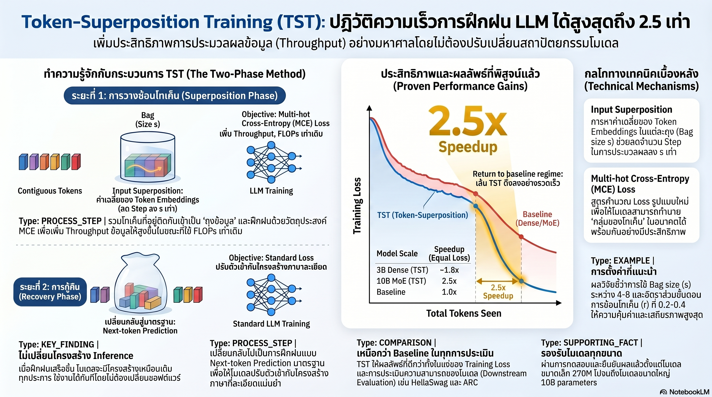

[กลับไปที่หน้าหลัก](../README.md)

สวัสดีครับเพื่อนๆ ที่ติดตามวงการ AI! วันนี้มาเรื่องที่น่าสนใจสำหรับทุกคนที่เคยร้องไห้กับค่า GPU Bill: "TST (Token Superposition Training) จาก Nous Research เทคนิคเทรนโมเดลใหม่ที่เร็วขึ้น 2.5 เท่าในเวลาเท่าเดิม โดยไม่ต้องแตะโครงสร้างโมเดลแม้แต่บรรทัดเดียว" ครับ

คุณเคยสังเกตไหมครับว่า ในการเทรน LLM ขนาดใหญ่ ทรัพยากรส่วนมากถูกใช้ไปกับการ "เรียนรู้สิ่งเดิมซ้ำๆ" ในช่วงต้น — โมเดลต้องผ่านข้อมูลทีละ Token เพื่อค่อยๆ สร้างความเข้าใจภาพรวม ทั้งที่ภาพรวมนั้นสามารถสอนได้เร็วกว่ามากถ้าเราไม่ยึดติดกับการทำนาย "ทีละคำ" ตั้งแต่วันแรกครับ?

คุณรู้ไหมครับว่า การที่ TST สามารถเพิ่ม Throughput ได้ 2.5 เท่าโดยใช้ FLOPs เท่าเดิม ไม่ได้มาจาก Algorithm ใหม่ที่ซับซ้อน แต่มาจากแนวคิดง่ายๆ ว่า "รวม Token หลายตัวเป็น Bag เดียวก่อน แล้วค่อยสอนให้แม่นยำทีหลัง" — เหมือนการสอนคนให้อ่านโดยจับความหมายของย่อหน้าก่อน แทนที่จะบังคับให้สะกดทีละตัวอักษรตลอดครับ?

และคุณเคยนึกไหมครับว่า ถ้าสลับ Layer ผิดช่วงเปลี่ยนเฟส ประสิทธิภาพทั้งหมดของ TST จะหายวับในทันที — Final Loss พุ่งจาก 2.676 ไปถึง 2.938 และแย่กว่า Baseline ที่เทรนปกติด้วยซ้ำ บอกเราว่า "Representation Continuity" ที่ดูเป็นรายละเอียดเล็กน้อยคือกุญแจทั้งหมดของเทคนิคนี้ครับ?

งานวิจัยนี้กำลังบอกว่า: บางครั้งการก้าวกระโดดในด้านประสิทธิภาพไม่ต้องการ Architecture ใหม่หรือ Hardware ที่แพงกว่า แต่ต้องการการคิดใหม่เกี่ยวกับ "ลำดับการสอน" ที่ถูกต้องครับ

========================================

🤔 ทบทวนความเชื่อเดิมๆ: สิ่งที่เราคิดเกี่ยวกับ Pre-training Efficiency

▪ "เพื่อเทรนได้เร็วขึ้น 2.5 เท่า ต้องใช้ Hardware ที่แรงขึ้น 2.5 เท่า หรือเปลี่ยน Architecture ใหม่ทั้งหมด" → TST ทำได้บน Hardware เดิม ด้วย Architecture เดิม โดยเพิ่มแค่กลยุทธ์การจัดกลุ่ม Token ก่อนเทรนครับ ไม่ต้องแก้ Parallelism, Optimizer, Tokenizer หรือ Data Pipeline แม้แต่จุดเดียว

▪ "Next-token Prediction คือ Objective ที่ดีที่สุดตั้งแต่วันแรกของการเทรน — การเปลี่ยน Loss Function จะทำให้โมเดลเสียความสามารถ" → TST พิสูจน์ว่า Multi-hot Cross-entropy (MCE) ในช่วง Superposition Phase ช่วยให้โมเดลเรียนรู้ Statistical Structure ของภาษาได้เร็วกว่ามาก โดยไม่เสียความสามารถ เพราะมี Recovery Phase ที่ขัดเกลากลับมาครับ

▪ "เทคนิคการบีบอัดหรือ Compressive Training ต้องการการปรับแต่ง Pipeline ที่ซับซ้อนและมีความเสี่ยงสูง" → TST เป็น Drop-in Method ครับ ใส่เข้าไปใน Pipeline เดิมได้ทันที ไม่มี Experimental Contamination เพราะไม่ได้เปลี่ยนอะไรที่มีอยู่แล้ว

▪ "LM Head และ Input Embedding เป็นแค่ส่วนเริ่มต้นและส่วนจบของโมเดล ไม่ใช่ส่วนที่สำคัญที่สุด — Re-initialize ได้ถ้าต้องการ" → นี่คือ Representation Alignment ที่ TST พิสูจน์ว่าผิดอย่างรุนแรงครับ การ Re-initialize layers เหล่านี้ระหว่างสองเฟสทำให้ Final Loss กระโดดจาก 2.676 เป็น 2.938 และแย่กว่า Baseline ธรรมดา — บอกว่า Continuity ของ Representation ข้ามเฟสคือสิ่งที่ขาดไม่ได้ครับ

ความจริงที่น่าคิดคือ: "ลำดับการสอน" สำคัญพอๆ กับ "สิ่งที่สอน" ในการเทรน AI — และ TST เป็นหลักฐานว่ายังมีพื้นที่สำหรับนวัตกรรมใน Pre-training ที่เราคิดว่าเข้าใจดีแล้วครับ

========================================

🧠 พื้นฐานที่ต้องเข้าใจก่อน: Token Superposition, Two-phase Strategy, Equal-FLOPs, Representation Alignment

=== ทำไม Pre-training แบบเดิมถึงไม่มีประสิทธิภาพสูงสุดตั้งแต่ต้น? ===

ในการเทรน LLM แบบ Standard Next-token Prediction โมเดลจะเรียนรู้โดยการทำนาย Token ถัดไปทีละตัวตลอด Sequence ครับ

ปัญหาคือในช่วงต้นของการเทรน โมเดลยังไม่มีความเข้าใจภาษาเพียงพอ ทุก Token ที่ทำนายผิดให้สัญญาณการเรียนรู้ที่เบาและกระจัดกระจาย ต้องใช้ข้อมูลจำนวนมากมากก่อนที่ Pattern ระดับสูงจะเริ่มชัดเจน เหมือนนักเรียนใหม่ที่ถูกให้สะกดคำทีละตัวตั้งแต่วันแรก ทั้งที่การเข้าใจความหมายของประโยคก่อนน่าจะช่วยให้จำคำสะกดได้ดีกว่าครับ

TST แก้ปัญหานี้ด้วยการจัดลำดับการเรียนรู้ใหม่ทั้งหมดครับ

=== Two-phase Strategy: จากภาพรวมสู่รายละเอียด ===

Superposition Phase — สอนภาพรวมก่อน:

TST รวมกลุ่ม Token ที่อยู่ติดกัน s ตัวเข้าเป็น "Bag" เดียวครับ ถ้า s=4 หมายความว่าทุก 4 Token จะถูกมองเป็นหน่วยเดียว ทำให้ Sequence ที่มี L Token กลายเป็น L/s "Bag" ครับ

การเทรนใช้ Multi-hot Cross-entropy (MCE) ซึ่งแทนที่จะทำนาย Token ถัดไปตัวเดียว โมเดลทำนาย "ชุดของ Token ที่อาจเกิดขึ้น" ใน Bag ถัดไปครับ เหมือนแทนที่จะบอกว่า "คำถัดไปคือ 'the'" ก็บอกว่า "Bag ถัดไปประกอบด้วยคำจากชุดนี้: {the, a, an, this}" แทนครับ

ผลลัพธ์ที่ได้: FLOPs ต่อ Step เท่าเดิม แต่โมเดลเห็นข้อมูลในระดับ L token ต่อ Step แทนที่จะเห็น L/s token — Throughput จริงๆ เพิ่มขึ้นตามขนาด s โดยตรงครับ

Recovery Phase — ขัดเกลาความแม่นยำ:

เมื่อโมเดลซึมซับ Statistical Structure ของภาษาไปแล้วในระดับหนึ่ง ระบบจะสลับกลับมาเทรนด้วย Standard Next-token Prediction ครับ ซึ่งขัดเกลาความสามารถในการทำนายคำทีละคำให้พร้อมใช้งานจริง

สัดส่วนระหว่างสองเฟสเป็นตัวแปรสำคัญครับ ถ้า Superposition Phase ยาวเกินไปโมเดลอาจต้องใช้เวลาในการ Recover มาก ถ้าสั้นเกินไปก็ไม่ได้ประโยชน์สูงสุดจาก Efficiency ที่ TST ให้

=== Equal-FLOPs Guarantee: ทำไมถึงเป็นนวัตกรรมจริงๆ ไม่ใช่แค่ลัดขั้นตอน ===

จุดที่ทำให้ TST แตกต่างจากเทคนิคการ "เร่งการเทรน" อื่นๆ คือการ Guarantee ว่าทุก Step ใช้ FLOPs เท่ากับ Baseline ครับ

ไม่ใช่การสุ่มตัดข้อมูลออกครับ ไม่ใช่การลด Quality ของ Batch แต่เป็นการจัดใหม่ว่าข้อมูล L Token จะถูกมองในระดับ Bag s Token แทนที่จะเป็น Token ละตัวครับ Compute ไม่ได้ลดลง แต่ข้อมูลที่ผ่านการประมวลผลต่อหน่วย FLOPs เพิ่มขึ้นครับ

เปรียบง่ายๆ ครับ: เหมือนครูที่ใช้เวลาสอนเท่าเดิม แต่เปลี่ยนจากสอนทีละคนเป็นสอนทีละกลุ่มก่อนในช่วงต้น แล้วค่อยแยกทำข้อสอบเดี่ยวทีหลัง ผลลัพธ์การเรียนรู้ดีขึ้น โดยที่เวลาทั้งหมดไม่ได้เพิ่มขึ้นครับ

=== Representation Alignment: รายละเอียดเล็กๆ ที่เป็นกุญแจทั้งหมด ===

นี่คือการค้นพบที่สำคัญที่สุดในงานวิจัยนี้ครับ ทีม Nous Research พบโดยบังเอิญว่า ถ้าแค่เปลี่ยน Embedding Layer และ LM Head ก่อนเข้า Recovery Phase ทุกอย่างพังหมดครับ

ผลการทดลอง Table 2 ครับ:
— TST ปกติ (ไม่ Re-initialize): Final Loss = 2.676
— TST ที่ Re-initialize Embeddings: Final Loss = 2.938
— Standard Baseline (ไม่ใช้ TST เลย): ค่าที่ TST แย่กว่า

เพียงแค่การสุ่มค่าใหม่ใน Layer สองชั้นจากทั้งหมด ทำให้โมเดลที่เทรนด้วย TST กลายเป็นแย่กว่าการเทรนปกติครับ นั่นบอกว่าอะไรครับ?

บอกว่า Superposition Phase ไม่ใช่แค่การ "เร่งสอน" แต่คือการสร้าง Representation Space ที่มีโครงสร้างเฉพาะตัว และ Recovery Phase ต้องเรียนรู้โดยอิง Representation Space นั้นครับ ถ้า Reset ทิ้ง ก็เท่ากับโยนสิ่งที่เรียนมาทั้งหมดในเฟสแรกทิ้งไปด้วยครับ

เหมือนการที่นักเรียนเรียนวางรากฐานความเข้าใจมาหลายเดือน แล้วก่อนสอบก็บังคับให้ลืมทุกอย่างที่เรียนมาแล้วเริ่มท่องจำใหม่จากศูนย์ — ผลลัพธ์ย่อมแย่กว่าคนที่ไม่เคยเรียนพื้นฐานมาเลยครับ

=== Drop-in Method: ทำไมถึงสำคัญสำหรับโลกจริง ===

เทคนิคที่ดีในงานวิจัยแต่ใช้งานจริงยากนั้นมีมากมายครับ สิ่งที่ทำให้ TST มีค่าในเชิงปฏิบัติคือ:

ไม่ต้องแก้ Parallelism: ทีมที่ใช้ Tensor Parallel, Pipeline Parallel หรือ Data Parallel ไม่ต้องปรับอะไรเลยครับ

ไม่ต้องเปลี่ยน Optimizer: AdamW, Muon, SOAP หรือ Optimizer อะไรก็ใช้ได้เหมือนเดิมครับ

Data-agnostic: ไม่ต้องจัด Dataset ใหม่ ไม่ต้อง Pre-process ข้อมูลพิเศษ ใช้ Dataset เดิมที่มีอยู่ได้เลยครับ

MCE กับ Optimized Kernels: Multi-hot Cross-entropy นั้น Compatible กับ Cross-entropy Kernels ที่ถูก Optimize และ Compile ไว้แล้วใน Library มาตรฐาน (เช่น FlashAttention ecosystem) ทำให้ไม่มี Memory Overhead พิเศษครับ

สำหรับองค์กรที่กำลังเทรนโมเดลอยู่แล้ว การ Plug-in TST เข้าไปหมายถึงการลดค่า B200-Hours ลงมากกว่าครึ่ง โดยไม่ต้องเสียเวลา Re-engineer Infrastructure ใดๆ ครับ

========================================

🎯 ประเด็นที่ควรคิดต่อ

TST สะท้อนนัยยะที่กว้างกว่าแค่เทคนิคการเทรนครับ:

— "ลำดับการสอน" คือมิติที่ยังมีโอกาสสูงในงานวิจัย: วงการ AI ลงทุนมหาศาลใน Architecture, Data Quality, Compute Scale แต่ "วิธีจัดลำดับการเรียนรู้" ยังมีพื้นที่สำรวจอีกมากครับ TST เป็นตัวอย่างว่า Curriculum Design ระดับ Objective Function สามารถให้ผลกระโดดขนาดนี้ได้

— 2.5x Efficiency เปลี่ยน Access ได้จริง: ถ้าเทรนโมเดลระดับ 10B ที่เคยต้องการงบ X ตอนนี้ต้องการแค่ 0.4X ทีมขนาดเล็กที่ไม่มี Compute Budget ระดับ Big Lab สามารถสร้างโมเดลที่เคยทำได้แค่ในองค์กรยักษ์ใหญ่ได้แล้วครับ ซึ่งเปลี่ยน Landscape ของการแข่งขันในวงการครับ

— คำถามที่สำคัญที่สุด: ถ้า TST ทำงานได้เพราะ LLM "เรียนรู้ภาพรวมได้เร็วกว่าการทำนายทีละ Token" ในช่วงต้น — นั่นหมายความว่า Standard Pre-training ที่เราใช้กันมาตลอดนั้นมีความไม่มีประสิทธิภาพซ่อนอยู่อีกเท่าไหร่? และเทคนิคอื่นๆ ที่คิดจาก "ลำดับการสอนที่ต่างออกไป" ยังรอการค้นพบอยู่อีกมากแค่ไหนครับ?

#TST #TokenSuperposition #PreTraining #LLMEfficiency #NousResearch #AIResearch #MultihotCrossEntropy #RepresentationLearning #ComputeEfficiency #MachineLearning #LargeLanguageModels #AITraining
