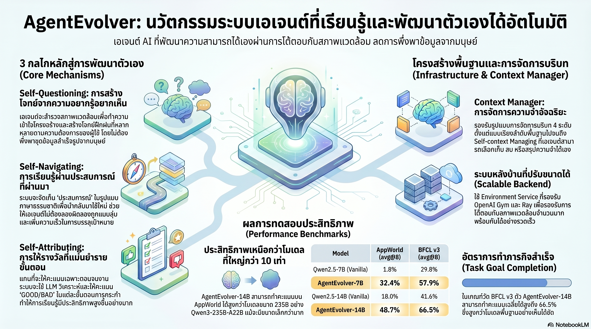

[กลับไปที่หน้าหลัก](../README.md)

สวัสดีครับเพื่อนๆ ที่ติดตามวงการ AI! วันนี้มาเรื่องที่ท้าทายข้อสรุปที่เราเคยเชื่อกันมานานว่า "AI จะเก่งขึ้นได้ต้องมีมนุษย์สอน" จากงานวิจัย AgentEvolver ของ Tongyi Lab (Alibaba) — ระบบ Agent ที่สร้างโจทย์เองได้, เรียนรู้จากประสบการณ์ตัวเองได้, และประเมินว่าก้าวไหนในการทำงานดีหรือแย่ได้โดยอัตโนมัติ — จนโมเดล 14B สามารถเอาชนะ Qwen3-235B-A22B ที่ใหญ่กว่า 16 เท่าบน Benchmark ระดับโลกครับ

คุณเคยสังเกตไหมครับว่า ปัญหาที่แท้จริงของการพัฒนา AI Agent ในปัจจุบันไม่ใช่ "โมเดลไม่ฉลาดพอ" แต่คือ "การสร้างข้อมูลฝึกสอนต้องใช้แรงงานคนจำนวนมหาศาล" — ทุกโจทย์ที่ AI ต้องฝึก มนุษย์ต้องเขียนก่อน ทุก Trajectory ที่จะเอาไปสอน มนุษย์ต้องตรวจก่อน คอขวดนี้เรียกว่า Manual Curation Bottleneck และมันกำลังจำกัดความเร็วของการพัฒนาทั้งวงการอยู่ครับ?

คุณรู้ไหมครับว่า ปัญหาใหญ่ที่สุดของ Reinforcement Learning แบบเดิมในงาน Long-horizon Tasks ไม่ใช่อัลกอริทึม แต่คือการที่ AI ได้รับรางวัลก็ต่อเมื่อทำงานสำเร็จเท่านั้น — ถ้างานมี 100 ขั้นตอน และสำเร็จแค่ครั้งเดียวใน 1,000 ครั้ง AI ก็ไม่รู้ว่าใน 100 ก้าวนั้น ก้าวไหนคือจุดเปลี่ยนที่ทำให้สำเร็จ เหมือนครูที่ให้คะแนนแค่ว่าสอบผ่านหรือไม่ผ่าน โดยไม่บอกว่าข้อไหนทำถูกและข้อไหนทำผิดครับ?

และคุณเคยนึกไหมครับว่า ถ้า AI สามารถ "อยากรู้อยากเห็น" ได้อย่างมีทิศทาง — สำรวจแบบกว้างก่อนเพื่อหาขอบเขตของสภาพแวดล้อม แล้วลงลึกในส่วนที่น่าสนใจ — มันก็จะสร้างโจทย์ที่เหมาะสมกับระดับตัวเองได้เอง ไม่ต้องรอให้มนุษย์มาเขียนโจทย์ให้อีกต่อไปครับ?

งานวิจัยนี้กำลังบอกว่า: ขีดจำกัดของ AI ไม่ได้อยู่ที่จำนวนพารามิเตอร์ แต่อยู่ที่คุณภาพของกระบวนการเรียนรู้ — และเมื่อโมเดลมีกลไกวิวัฒนาการที่ถูกต้อง ขนาด 14B ก็สามารถ "คิดดีกว่า" ขนาด 235B ได้จริงครับ

========================================

🤔 ทบทวนความเชื่อเดิมๆ: สิ่งที่เราคิดเกี่ยวกับการพัฒนา AI Agent

▪ "AI จะเก่งขึ้นได้ต้องมีมนุษย์สร้างข้อมูลฝึกสอนที่ดีพอ — คุณภาพของ AI ถูกจำกัดด้วยคุณภาพข้อมูลที่มนุษย์สร้าง" → AgentEvolver ใช้ Curiosity-driven Exploration ให้โมเดลสร้างโจทย์เองจากการสำรวจสภาพแวดล้อม โดยไม่ต้องมีมนุษย์เขียนโจทย์แม้แต่ข้อเดียวครับ — ขีดจำกัดจึงไม่ใช่ "มนุษย์เขียนโจทย์ได้กี่ข้อ" อีกต่อไปแล้ว

▪ "RL คือวิธีที่ดีที่สุดในการสอน AI ให้ทำงานซับซ้อน แค่ต้องใช้ Compute มากขึ้นเพื่อ Explore ให้พอ" → Brute-force Exploration ใน Long-horizon Tasks มี Sample Efficiency แย่มากครับ เพราะ AI ต้องบังเอิญสำเร็จงานก่อนจึงจะเรียนรู้ได้ AgentEvolver แก้ด้วย Self-navigating ที่ดึงประสบการณ์เก่าขึ้นมาเป็นแผนที่นำทาง ไม่ใช่การสุ่มครับ

▪ "โมเดลขนาดใหญ่ย่อมทำงาน Agentic ได้ดีกว่าเสมอ — 235B ย่อมดีกว่า 14B" → AgentEvolver-14B เอาชนะ Qwen3-235B-A22B บน AppWorld และ BFCL v3 ครับ และ 7B ยังเอาชนะ 32B ในหลาย Benchmark — วิธีเรียนรู้สำคัญกว่าจำนวนพารามิเตอร์ในงาน Agentic

▪ "ถ้าเก็บประสบการณ์ไว้ใน Memory แล้วให้ AI ดึงมาใช้ มันก็จะแค่ 'ท่องจำ Prompt' แทนที่จะเรียนรู้จริงๆ" → Experience Stripping แก้ปัญหานี้โดยตรงครับ ก่อนนำ Experience ไป Optimize โมเดล ระบบจะ "ลอก" ข้อความประสบการณ์ออก เหลือแต่ตรรกะ — ทำให้โมเดลเรียนรู้วิธีคิด ไม่ใช่ท่องจำคำตอบครับ

ความจริงที่น่าคิดคือ: ยุค "มนุษย์สอน AI" กำลังถูกแทนที่โดย "AI ที่ออกแบบวิธีเรียนรู้ของตัวเองได้" — และนั่นเปลี่ยนบทบาทของนักวิจัยจาก "ครู" ไปสู่ "ผู้วางกฎเกณฑ์" ครับ

========================================

🧠 พื้นฐานที่ต้องเข้าใจก่อน: Curiosity-driven Exploration, Self-navigating, Self-attributing

=== Manual Curation Bottleneck: ปัญหาที่ AgentEvolver แก้ ===

สถานการณ์ปัจจุบันของ AI Agent Development เป็นแบบนี้ครับ:

วิธีที่ 1 — Handcrafted Datasets: ผู้เชี่ยวชาญนั่งเขียนโจทย์และ Trajectory ที่ดีด้วยตัวเอง คุณภาพดีมาก แต่ขยายได้ยากมาก เพราะจำกัดด้วยเวลาและต้นทุนของมนุษย์

วิธีที่ 2 — RL แบบดั้งเดิม: ให้ AI สุ่มลองทำงาน รับรางวัลเมื่อสำเร็จ ปัญหาคือในงานที่มี 100 ขั้นตอน โอกาสบังเอิญสำเร็จตั้งแต่ต้นน้อยมาก ทำให้ต้องใช้ Sample จำนวนมหาศาลก่อนจะเรียนรู้อะไรได้จริงๆ

AgentEvolver แก้ทั้งสองปัญหาด้วยการให้ AI "วางแผนการเรียนรู้ของตัวเอง" ผ่านสามกลไกที่ซ้อนทับกันครับ

=== กลไกที่ 1: Curiosity-driven Exploration โดยมีทิศทาง ===

ความแตกต่างระหว่าง "การสุ่มสำรวจ" กับ "ความอยากรู้อยากเห็นที่มีทิศทาง" คือจุดที่ AgentEvolver ต่างจาก RL แบบเดิมครับ

ระบบเริ่มด้วยการสร้าง Environment Profile — สรุปว่าสภาพแวดล้อมนั้นมี Entity อะไรบ้าง และมี Operation ที่ทำได้อะไรบ้าง เช่น ถ้าเป็น API ของระบบ E-commerce: Entity = สินค้า, ออร์เดอร์, ลูกค้า, Operations = ค้นหา, เพิ่มรายการ, ชำระเงิน Profile นี้ทำหน้าที่เป็น Action Prior หรือแผนที่คร่าวๆ ก่อนออกสำรวจครับ

จากนั้น Two-Phase Strategy จะเริ่มทำงาน:

Phase 1 Breadth-first Exploration: ใช้ LLM ที่ตั้งค่า Temperature สูงเพื่อสุ่มสำรวจแบบกว้าง — ลองทำงานหลายประเภทอย่างหลากหลาย เพื่อสร้างความเข้าใจพื้นฐานว่าสภาพแวดล้อมนี้ทำอะไรได้บ้างครับ Temperature สูงคือการตั้งใจให้ AI "ลองนอกกรอบ" มากกว่าปกติ เหมือนนักเดินทางที่ไปถึงเมืองใหม่แล้วเดินสำรวจทุกซอกทุกมุมก่อน ไม่ใช่แค่เดินตามเส้นทางที่วางไว้ครับ

Phase 2 Depth-first Exploration: เมื่อพบงานที่น่าสนใจหรือพบขอบเขตความสามารถใหม่ ระบบจะเปลี่ยนมาสำรวจเชิงลึก สร้างโจทย์ที่ยากขึ้นในทิศทางนั้นๆ เพื่อทดสอบ Functional Boundaries ของสภาพแวดล้อมครับ

ผลลัพธ์คือ AI สามารถสร้าง Task Synthesis — สร้างชุดโจทย์ที่หลากหลาย ครบถ้วน และ Calibrate ตามระดับความสามารถของตัวเองได้เองครับ ไม่ต้องรอให้มนุษย์มาเขียนให้

=== กลไกที่ 2: Self-navigating ประสบการณ์เป็นแผนที่ ===

Long-horizon Tasks (งานที่มีหลายสิบถึงหลายร้อยขั้นตอน) คือฝันร้ายของ RL แบบเดิมครับ เพราะ Reward Signal เกิดขึ้นแค่ตอนจบ ทำให้ AI ไม่รู้ว่าขั้นตอนไหนนำไปสู่ความสำเร็จ

Self-navigating แก้ปัญหานี้ด้วยการจัดเก็บ Natural Language Experience ลงใน Vector Database ครับ เมื่อ AI เจองานคล้ายกับที่เคยทำในอดีต ระบบจะดึง Experience ที่ Semantically ใกล้เคียงขึ้นมาเป็นเข็มทิศนำทาง ไม่ต้อง "ลืมหมด" แล้วเริ่มสุ่มใหม่ทุกครั้งครับ

แต่การมี Experience ก็สร้างปัญหาใหม่: ถ้าโมเดลเห็น Experience แล้วเรียนรู้แค่การ "ท่องจำ Pattern" แทนที่จะเข้าใจตรรกะจริงๆ มันจะ Overfit กับ Experience เก่า ไม่สามารถ Generalize ไปงานใหม่ได้ครับ

สามเทคนิคที่แก้ปัญหานี้:

Experience Stripping: ก่อนนำ Trajectory ไป Optimize โมเดล ระบบจะ "ลอก" ข้อความ Experience ออกจาก Input ทิ้ง แต่เก็บ Label ของผลลัพธ์ไว้ ทำให้โมเดลต้องเรียนรู้ว่า "ในสถานการณ์แบบนี้ต้องทำอะไร" โดยไม่มีคำใบ้ — เหมือนการฝึกให้นักเรียนทำข้อสอบโดยไม่เปิดหนังสือ แทนที่จะให้ Copy คำตอบครับ

Experience-mixed Rollout: ผสมระหว่าง Rollout แบบ Vanilla (ไม่มี Experience นำทาง) กับ Guided (มี Experience) ในสัดส่วนที่สมดุล เพื่อรักษาทั้ง Exploration (ค้นพบสิ่งใหม่) และ Exploitation (ใช้ความรู้เดิม) ครับ ถ้าใช้แต่ Guided จะ Exploit มากเกินไป ถ้าใช้แต่ Vanilla จะสูญเสียประโยชน์จาก Memory ทั้งหมดครับ

Selective Boosting: ในขั้น Policy Update ระบบใช้ค่า Clipping ที่สูงขึ้น (Higher ε) สำหรับตัวอย่างที่ Advantage เป็นบวก นั่นคือเร่งการเรียนรู้จากก้าวที่ "ถูกทาง" โดยเฉพาะ เพราะ Sample เหล่านี้มีค่ามากกว่าสำหรับ Long-horizon Tasks ที่ Positive Signal หายากมากครับ

=== กลไกที่ 3: Self-attributing รางวัลระดับก้าวเดิน ===

ปัญหา Credit Assignment เป็นหนึ่งในปัญหาที่ยากที่สุดใน RL ครับ ถ้าหุ่นยนต์ทำงาน 100 ขั้นตอนแล้วสำเร็จ ก้าวไหนคือจุดเปลี่ยนสำคัญ? ถ้าล้มเหลว ก้าวไหนคือจุดที่พลาด?

Self-attributing ใช้ LLM อีกตัวเป็น "กรรมการ" (LLM-as-Judge) ที่ดูแต่ละ Step แล้วตัดสินว่า "GOOD" หรือ "BAD" ให้ความละเอียดของสัญญาณ Reward ระดับ Step-wise แทนที่จะรอแค่ผลลัพธ์ตอนจบครับ

แต่การมีกรรมการตัดสินแต่ละก้าวก็สร้างปัญหาใหม่ได้ครับ: Trajectory ที่ยาวกว่าจะมี Reward Variance สูงกว่าเพียงเพราะมีขั้นตอนมากกว่า ไม่ใช่เพราะมีคุณภาพต่างกัน

Trajectory-level Standardization แก้ปัญหานี้ด้วยการ Normalize รางวัลของแต่ละก้าวโดยคำนวณจาก "ค่าเฉลี่ยของทั้งเส้นทาง Trajectory" ไม่ใช่ค่า Global Baseline ทำให้โมเดลสามารถเรียนรู้ได้อย่างเป็นธรรมไม่ว่างานจะสั้นหรือยาวครับ

Alpha Weight (α) ช่วยสร้างสมดุลระหว่างสองสัญญาณ:
— กระบวนการถูกต้อง (Step-wise Attribution): ทำก้าวเดิมนี้ถูกทางไหม
— ผลลัพธ์สุดท้าย (Outcome): งานสำเร็จในที่สุดไหม

เหมือนครูที่ให้คะแนนทั้ง "วิธีทำ" และ "คำตอบ" ในสัดส่วนที่เหมาะสม แทนที่จะดูแค่ว่าได้คำตอบถูกหรือเปล่าครับ ผลลัพธ์คือ Sample Efficiency ที่สูงขึ้นอย่างก้าวกระโดด เพราะทุก Step มีสัญญาณการเรียนรู้ ไม่ใช่แค่ Step สุดท้ายครับ

=== Context Manager: โครงสร้างพื้นฐานที่รองรับทุกกลไก ===

เบื้องหลังทั้งสามกลไกคือ Context Manager ที่ประกอบด้วยสองส่วนครับ:

Live Context Timeline (LCT): โครงสร้างข้อมูลที่ปรับเปลี่ยนได้ระหว่าง Inference — ใช้สำหรับการโต้ตอบแบบ Dynamic ที่ต้องการความยืดหยุ่นครับ

Timeline Snapshot Recorder (TSR): โครงสร้างที่ Immutable — บันทึก Trajectory อย่างเที่ยงตรงเพื่อใช้คำนวณ Gradient ในการฝึกโดยไม่บิดเบือนครับ

ระบบรองรับ 4 Template สำหรับงานที่ต่างกัน:
— Basic Causal: สำหรับงานที่ต้องการ Sequential Stability
— Reasoning-Augmented: บังคับให้เกิด Think Tokens ก่อนตัดสินใจ — ฝัง CoT ลงในทุก Action
— Sliding Context Window: บีบอัด Context เก่าสำหรับงานที่ยาวนับพันขั้นตอน
— Self-context Managing: ให้ AI ตัดสินใจเองว่าข้อมูลไหนควรเก็บและข้อมูลไหนควรทิ้ง

========================================

📊 ผลลัพธ์: เมื่อ 14B เอาชนะ 235B

บน AppWorld (Agentic Tasks ในระบบ App จริงๆ) และ BFCL v3 (Function Calling Benchmark):
— AgentEvolver-14B เอาชนะ Qwen3-235B-A22B (ใหญ่กว่า 16 เท่า)
— AgentEvolver-7B เอาชนะโมเดลขนาด 32B ในหลาย Benchmark

ตัวเลขเหล่านี้ไม่ได้บอกว่า "โมเดลเล็กดีกว่าโมเดลใหญ่เสมอ" ครับ แต่บอกว่า "โมเดลที่เรียนรู้ถูกวิธีสามารถเก่งกว่าโมเดลที่ใหญ่กว่าแต่เรียนรู้ผิดวิธี" ซึ่งนัยยะสำคัญกว่านั้นครับ

========================================

🎯 ประเด็นที่ควรคิดต่อ

AgentEvolver ผลักดีเบทที่สำคัญที่สุดในวงการ AI ในตอนนี้ครับ:

— "High-level Governance" คือทักษะใหม่ที่นักวิจัยต้องการ: เมื่อ AI วางแผนการเรียนรู้ตัวเองได้ บทบาทของมนุษย์เปลี่ยนจาก "สร้างโจทย์" เป็น "ออกแบบกฎว่า AI ควรเรียนรู้อะไร ในขอบเขตไหน และมีค่านิยมอะไร" — ซึ่งต้องการทักษะที่ต่างออกไปโดยสิ้นเชิงครับ

— Curiosity ที่มีทิศทางคือความแตกต่างที่สำคัญ: Two-Phase Strategy ของ AgentEvolver ไม่ได้แค่ "ให้ AI สุ่มเล่น" แต่คือการออกแบบให้ Curiosity มีโครงสร้างและมีขอบเขตครับ การ "อยากรู้อยากเห็นแบบไร้ทิศทาง" กับ "อยากรู้อยากเห็นแบบมีกรอบ" ให้ผลต่างกันมาก

— คำถามที่สำคัญที่สุด: ถ้า AI สร้างโจทย์ของตัวเอง เรียนรู้จากประสบการณ์ตัวเอง และประเมินตัวเองได้ — มนุษย์จะรู้ได้อย่างไรว่า "สิ่งที่ AI กำลังเรียนรู้อยู่" ยังคงสอดคล้องกับสิ่งที่เราต้องการให้มันเรียนอยู่? และเมื่อวงจรการวิวัฒนาการปิดตัวเองได้สมบูรณ์ — "ประตู" ที่จะหยุดหรือปรับทิศทางยังอยู่ที่ไหนครับ?

#AgentEvolver #SelfEvolvingAI #ReinforcementLearning #AgenticAI #SampleEfficiency #CreditAssignment #AIResearch #Alibaba #TongyiLab #LongHorizonTasks #AIAgent #SelfImprovement
