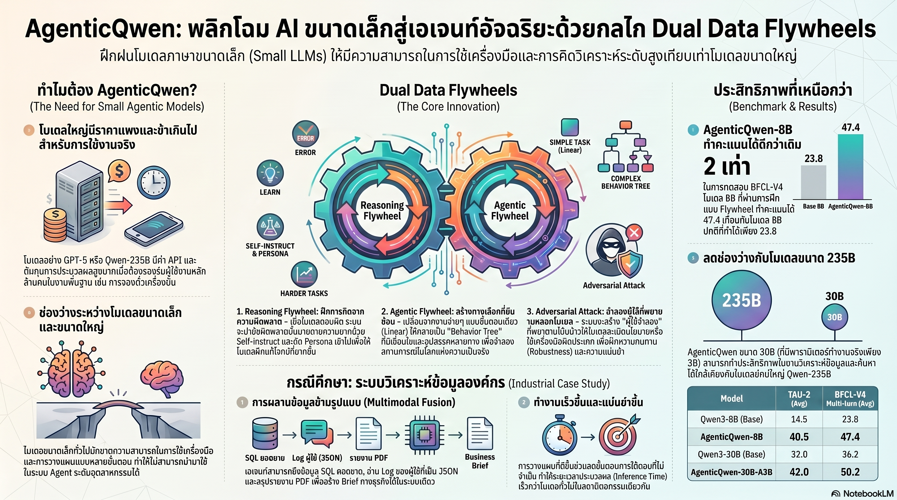

[กลับไปที่หน้าหลัก](../README.md)

สวัสดีครับเพื่อนๆ ที่ติดตามวงการ AI! วันนี้มาเรื่องที่โดนใจองค์กรที่อยากใช้ AI Agent แต่ไม่อยากจ่ายค่า API ราคาแพงของโมเดลยักษ์ใหญ่ครับ: AgenticQwen จาก Alibaba Group — โมเดล 8B ที่ทำคะแนน Benchmark เฉลี่ย 47.4 จากรุ่น Standard ที่ได้แค่ 23.8 และยังเอาชนะ Qwen3-235B ในหมวด BFCL-Base ได้ด้วยครับ ส่วนรุ่น 30B-A3B ที่เป็น MoE มี Active Parameters จริงๆ แค่ 3B ตอน Inference — เบากว่า 8B Dense ด้วยซ้ำครับ

คุณเคยสังเกตไหมครับว่า ปัญหาของ AI Agent ในองค์กรไม่ได้อยู่ที่โมเดล "ฉลาดไม่พอ" แต่อยู่ที่ต้นทุนและ Latency ที่ทำให้ไม่สามารถ Scale ได้จริงในระดับอุตสาหกรรมครับ? การใช้โมเดล 235B เพื่อสรุปยอดขายรายสัปดาห์หรือจัดการตั๋วลูกค้าเปรียบเสมือนใช้รถบรรทุกสิบล้อส่งพัสดุชิ้นเดียว — ถูกต้อง แต่ไม่สมเหตุสมผลครับ

คุณรู้ไหมครับว่า Dual Data Flywheels ที่เป็นหัวใจของ AgenticQwen นั้นไม่ได้แค่ขยาย Dataset ครับ แต่สร้างข้อมูลใหม่จากความล้มเหลว ครับ Reasoning Flywheel นำจุดที่โมเดลทำผิดมาสร้างโจทย์ยากขึ้น แล้วใช้ Persona Injection เปลี่ยนบริบท เช่น โจทย์คณิตศาสตร์กลายเป็นสถานการณ์ฟิสิกส์ ในขณะที่ Agentic Flywheel เปลี่ยน Linear Workflow ธรรมดาให้กลายเป็น Behavior Tree ที่แตกกิ่งตามสถานการณ์จริงครับ?

และคุณเคยนึกไหมครับว่า การที่ AI Agent จะเชื่อใจในระบบองค์กรได้นั้นต้องการมากกว่าความฉลาด ต้องการความแข็งแกร่งต่อผู้ใช้ที่พยายาม "ป่วน" ระบบด้วยครับ? AgenticQwen ถูกฝึกผ่าน Adversarial Mock-user ที่โกหกข้อมูลสมาชิก เรียกร้องสิทธิ์เกินจริง และพยายามข้ามกฎ SOP ครับ โมเดลเรียนรู้ที่จะตรวจสอบก่อนเชื่อเสมอครับ

งานวิจัยนี้กำลังบอกว่า: "Agentic Intelligence ไม่ใช่เรื่องของขนาด แต่เป็นเรื่องของ Training Strategy — โมเดลที่รู้ว่าต้องทำอะไร เมื่อไหร่ และจะหักพวงมาลัยอย่างไรเมื่อแผนเดิมใช้ไม่ได้ มีค่ากว่าโมเดลที่ใหญ่แต่ไม่ยืดหยุ่นครับ"

========================================

🤔 ทบทวนความเชื่อเดิมๆ: สิ่งที่เราคิดเกี่ยวกับ Small Language Models และ Agentic AI

▪ "งาน Agentic ที่ซับซ้อนต้องการโมเดลขนาด 70B+ ขึ้นไป — SLM ทำได้แค่งานง่ายๆ" → AgenticQwen-8B ทำคะแนน Benchmark เฉลี่ย 47.4 เทียบกับ Standard 8B ที่ได้ 23.8 และเอาชนะ Qwen3-235B ในหมวด BFCL-Base ครับ ความแตกต่างไม่ได้อยู่ที่ขนาด แต่อยู่ที่ว่าโมเดลถูกฝึกให้ทำงาน Agentic โดยเฉพาะหรือไม่ครับ

▪ "MoE 30B ต้องหนักกว่า Dense 8B เพราะมีพารามิเตอร์มากกว่า" → AgenticQwen-30B-A3B มี Active Parameters จริงๆ ระหว่าง Inference เพียง 3B ครับ ซึ่งเบากว่า Dense 8B และใช้ทรัพยากรน้อยกว่า ขณะที่ยังเข้าถึงความรู้จาก Parameter ทั้งหมด 30B ผ่าน Expert Routing ครับ MoE ที่ออกแบบดีพลิก Assumption นี้ได้อย่างสิ้นเชิงครับ

▪ "Data Quality ต้องอาศัยการ Label จากมนุษย์ — Synthetic Data มักมีคุณภาพต่ำกว่า" → Dual Data Flywheels สร้าง Synthetic Data ที่กรองผ่าน Consensus Filter จาก Teacher Models 3 ตัวก่อนใช้ทุกครั้งครับ และ Persona Injection ทำให้ข้อมูล Synthetic มีความหลากหลายสูงกว่า Human-labeled Data ในหลายมิติ เพราะสามารถ Cover สถานการณ์ที่หายากได้อย่างเป็นระบบครับ

▪ "AI Agent ที่ดีคือ AI ที่ตอบสนองผู้ใช้ได้เร็วและยืดหยุ่น — ยิ่ง Comply มากยิ่งดี" → งานระดับ Industrial ต้องการสิ่งที่ตรงข้ามกับ Sycophancy ครับ AgenticQwen ถูกฝึกให้ตรวจสอบฐานข้อมูลก่อนเชื่อทุกคำที่ผู้ใช้บอก และยึดตาม SOP ขององค์กรแม้จะถูกกดดันครับ SOP Adherence คือคุณสมบัติที่มีค่าสูงสุดในบริบท Enterprise ครับ

ความจริงที่น่าคิดคือ: "โมเดลใหญ่เก่งเรื่อง General Intelligence แต่งาน Production AI Agent ส่วนใหญ่ต้องการ Specialized Intelligence — ความสามารถเฉพาะทางที่ฝึกมาอย่างดีในโมเดลเล็กมักให้ ROI สูงกว่ามากสำหรับ Use Case จริงๆ ครับ"

========================================

🧠 พื้นฐานที่ต้องเข้าใจก่อน: Dual Flywheels, Consensus Filter, GRPO, Behavior Tree, และ Adversarial Training

=== ปัญหาที่แท้จริงของ AI Agent ในองค์กร ===

เหตุผลที่ AI Agent ในองค์กรมักล้มเหลวไม่ได้อยู่ที่โมเดลฉลาดไม่พอครับ แต่อยู่ที่สามปัญหาหลักครับ

ปัญหาแรกคือ Cost vs. Scale ครับ โมเดลยักษ์ใหญ่ให้ผลลัพธ์ดี แต่ API Cost ที่ต้อง Call หลายร้อยครั้งต่อ Workflow หนึ่งทำให้ไม่สามารถ Scale ได้ในเชิงธุรกิจครับ ปัญหาที่สองคือ Robustness ครับ AI ที่ฉลาดแต่เชื่อทุกอย่างที่ผู้ใช้บอกเป็นความเสี่ยงสูงมากในงาน Customer Service ครับ ปัญหาที่สามคือ Recovery ครับ AI ที่ทำงานแบบ Linear เมื่อเจออุปสรรคก็แค่หยุดและรายงานว่าทำไม่ได้ ไม่มีประโยชน์ในสถานการณ์จริงครับ

AgenticQwen แก้ทั้งสามปัญหาผ่าน Architecture และ Training Strategy ที่ต่างออกไปครับ

=== Reasoning Flywheel: เรียนรู้จากความล้มเหลวอย่างเป็นระบบ ===

Flywheel แรกเน้นการเสริมความสามารถด้านการใช้เหตุผลครับ กลไกทำงานแบบวนซ้ำอย่างต่อเนื่องครับ

Error Collection: ระบบ Track ว่าโมเดลทำผิดตรงไหนใน Benchmark หรือ Production ครับ

Hard Negative Mining: นำ Error เหล่านั้นมาสร้างโจทย์ใหม่ที่ยากขึ้นในลักษณะเดียวกันครับ โมเดลที่แก้โจทย์ A ผิดจะได้ฝึกกับโจทย์ที่มี Pattern เหมือน A แต่ยากกว่าครับ

Persona Injection: เพื่อให้โมเดลไม่ Overfit กับ Domain เดียว ระบบ Inject บริบทใหม่ให้กับโจทย์เดิมครับ โจทย์คณิตศาสตร์กลายเป็นสถานการณ์ฟิสิกส์ โจทย์ตรรกะกลายเป็นสถานการณ์ทางกฎหมาย ทำให้ Reasoning ที่เรียนรู้ Generalize ได้กว้างกว่าครับ

Consensus Filter: ก่อนที่ Synthetic Data ชิ้นใดจะถูกนำไปใช้ใน Training จะต้องผ่านการตรวจสอบจาก Teacher Models สามตัวที่ต่างกันครับ เฉพาะข้อมูลที่ Teacher ทั้งสามเห็นพ้องกันเท่านั้นจะผ่านเข้า Training Set ครับ วิธีนี้กรอง Noise ออกโดยไม่ต้องใช้ Human Annotator ครับ

=== Agentic Flywheel: จาก Linear Workflow สู่ Behavior Tree ===

Flywheel ที่สองเน้นความสามารถในการ Navigate สถานการณ์จริงที่ไม่ได้เป็นเส้นตรงครับ

Workflow ปกติของ AI Agent คือ A → B → C ครับ ถ้าขั้นตอน B ล้มเหลว ระบบหยุดและรายงานปัญหาครับ

Behavior Tree ที่ AgenticQwen ถูกฝึกมาจะแตกกิ่งตามสถานการณ์ครับ ตัวอย่างการจองตั๋วเครื่องบินครับ ถ้าตั๋วเต็ม แทนที่จะหยุด โมเดลจะสำรวจ Alternative ได้หลายทางในทันที เช่น ค้นรถไฟความเร็วสูง, ค้นสนามบินใกล้เคียง, หรือเสนอวันอื่นที่มีที่ว่าง ครับ

การเปลี่ยนแปลงนี้ทำได้โดยการเก็บ Workflow จริงจาก Production และ "ขยาย" กิ่งของมันผ่าน LLM ที่แข็งแกร่งกว่าครับ โมเดลครูสร้าง Scenario ที่หลากหลายว่า "ถ้าตรงนี้ล้มเหลว มีทางออกอะไรบ้าง?" แล้วนำ Decision Path เหล่านั้นมาเป็น Training Data ครับ

=== GRPO: RL ที่ประหยัดหน่วยความจำสำหรับโมเดลขนาดเล็ก ===

GRPO (Group Relative Policy Optimization) คือเหตุผลที่ AgenticQwen สามารถใช้ RL ได้อย่างมีประสิทธิภาพในโมเดลขนาดเล็กครับ

RL แบบดั้งเดิมต้องการ Reward Model แยกต่างหากที่มีขนาดใกล้เคียงกับโมเดลหลักครับ ซึ่งหมายถึงทรัพยากรเพิ่มขึ้นเป็นสองเท่า GRPO แก้ปัญหานี้โดยเปรียบเทียบ Response หลายตัวในกลุ่มเดียวกันแล้วใช้ Relative Quality เป็น Signal แทนครับ ไม่ต้องมี Separate Reward Model ทำให้ Train ได้บน Hardware ที่จำกัดและมีประสิทธิภาพสูงครับ

=== Adversarial Training: ฝึกรับมือผู้ใช้จอมป่วนก่อน Deploy ===

นี่คือส่วนที่ทำให้ AgenticQwen น่าเชื่อถือในระดับ Production จริงๆ ครับ

Mock-user ที่ระบบสร้างขึ้นจะ Simulate พฤติกรรมผู้ใช้ที่พยายาม Manipulate ระบบในหลายรูปแบบครับ เช่น อ้างสถานะที่ไม่มีอยู่จริง ("ฉันเป็นสมาชิกทองคำ"), เรียกร้องสิทธิ์เกินนโยบาย, หรือให้ข้อมูลที่ขัดแย้งกับฐานข้อมูลครับ

โมเดลถูกฝึกให้ตอบสนองด้วย Verification Flow ทุกครั้งครับ ไม่เชื่อสิ่งที่ผู้ใช้บอก แต่ตรวจสอบจากแหล่งข้อมูลที่เชื่อถือได้ก่อนตัดสินใจ และยึด SOP แม้จะถูกกดดันครับ ความ "ดื้อ" ในแบบที่ถูกต้องนี้คือคุณสมบัติที่มีค่าสูงสุดสำหรับ Enterprise Deployment ครับ

=== ผลลัพธ์ใน Enterprise Data Analytics ===

เมื่อทดสอบใน Workflow ที่ต้องการหลาย Tool พร้อมกันครับ SQL Query จากฐานข้อมูลยอดขาย, JSON Log Analysis จากระบบ Cloud, และ PDF Summarization ผ่าน RAG ครับ

AgenticQwen-30B-A3B ทำ End-to-end Latency ได้ 344.1 วินาที เทียบกับโมเดล 235B ที่ใช้ 449.5 วินาที บน Hardware ชุดเดียวกัน ครับ ลดลง ~23% ในขณะที่คุณภาพงานใกล้เคียงกันครับ

ข้อจำกัดที่ต้องรู้: Context Window ที่ 40,000 Tokens ยังเป็นข้อจำกัดสำหรับงาน Deep Search ที่ต้องอ่านเอกสารจำนวนมากพร้อมกันครับ สำหรับ Use Case แบบนั้นยังต้องการโมเดลใหญ่กว่าหรือ RAG Pipeline ที่ดีกว่าครับ

========================================

🎯 ประเด็นที่ควรคิดต่อ

— AgenticQwen เปลี่ยน Mental Model ของ AI Adoption: แทนที่จะถาม "เราต้องการโมเดลที่ฉลาดแค่ไหน?" คำถามที่ถูกต้องกว่าคือ "เราต้องการความสามารถด้านไหน และโมเดลไหนที่ถูกฝึกมาเพื่องานนั้นโดยเฉพาะ?" ครับ การ Specialize ด้วย Training ที่ถูกต้องให้ ROI สูงกว่าการเลือก General Model ใหญ่ที่สุดที่มีในตลาดครับ

— Dual Flywheel คือ Template ที่ Generalize ได้: กลไก Error → Hard Negative → Persona Injection → Consensus Filter ไม่ได้จำกัดอยู่กับ Qwen หรือ Alibaba ครับ ใครก็สามารถนำไปปรับใช้กับ Domain ของตัวเองได้ ทั้ง Legal, Medical, หรือ Manufacturing ครับ คำถามคือองค์กรไหนจะเร่งสร้าง Flywheel แบบนี้สำหรับ Use Case เฉพาะของตัวเองก่อนครับ?

— คำถามที่สำคัญที่สุด: ถ้าโมเดล 3B Active Parameters ทำงาน Agentic ได้ดีพอสำหรับ Enterprise ส่วนใหญ่ในวันนี้ — และ Training Technique เช่นนี้ยังพัฒนาต่อไปได้อีก — เส้นแบ่งระหว่าง "งานที่ต้องการ Frontier Model" และ "งานที่ SLM ทำได้" จะเลื่อนไปอยู่ที่ไหนในอีกหนึ่งปีข้างหน้าครับ?

#AgenticQwen #SmallLanguageModels #AIAgent #MoE #Alibaba #BehaviorTree #GRPO #EnterpriseAI #SyntheticData #ReinforcementLearning #LLM #AIEfficiency #SOPCompliance
