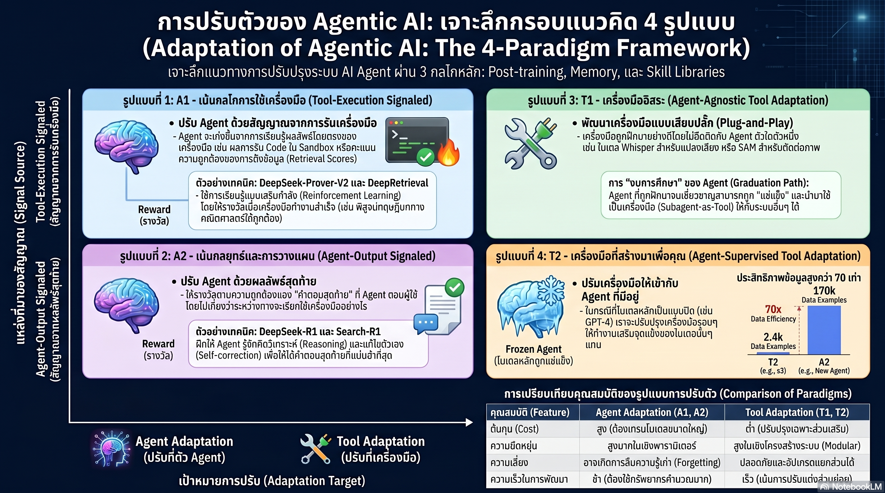

[กลับไปที่หน้าหลัก](../README.md)

สวัสดีครับเพื่อนๆ ที่ติดตามวงการ AI! วันนี้มาเรื่องที่เปลี่ยนคำถามจาก "เราจะฝึกโมเดลให้ฉลาดขึ้นอย่างไร?" เป็น "เราจะออกแบบระบบการเรียนรู้รอบโมเดลอย่างไร?" ซึ่งเป็นการสังเคราะห์งานวิจัยจาก UIUC, Stanford, Princeton และ Harvard เกี่ยวกับแนวคิด Adaptation ที่กำลังเปลี่ยนแนวทางการสร้าง AI Agent ทั้งหมดครับ

คุณเคยสังเกตไหมครับว่า เวลาฝึกพนักงานใหม่ บางทีการฝึกเฉพาะขั้นตอนเล็กๆ ที่พนักงานต้องทำให้ถูกต้องก่อน ให้ผลดีกว่าการบอกแค่ว่า "ทำให้ลูกค้าพอใจ" โดยไม่บอกวิธี ทั้งที่เป้าหมายสุดท้ายเหมือนกัน?

คุณเคยสงสัยไหมครับว่า ถ้าเราสามารถแยก "ส่วนที่ต้องคิด" ออกจาก "ส่วนที่ต้องปฏิบัติ" ในระบบ AI แล้วฝึกแต่ละส่วนแยกกัน เราจะประหยัดทรัพยากรได้แค่ไหน และผลลัพธ์จะดีขึ้นหรือแย่ลงครับ?

และคุณรู้ไหมครับว่า มีงานวิจัยพิสูจน์ว่าการฝึก Subagent เล็กๆ ให้ทำงานเฉพาะทางแทนที่จะฝึก LLM ตัวใหญ่ใหม่ทั้งหมด ให้ผลลัพธ์เทียบเท่ากันโดยใช้ข้อมูลฝึกน้อยกว่าถึง 70 เท่าครับ?

แนวคิดนี้ชื่อ Adaptation Framework และมันกำลังกำหนดทิศทางว่า AI Agent ในอนาคตจะ "วิวัฒน์" ได้เองอย่างไร ไม่ใช่แค่ทำงานตามคำสั่งครับ

========================================

🤔 ทบทวนความเชื่อเดิมๆ: สิ่งที่เราคิดเกี่ยวกับการสร้าง AI Agent ที่ดีขึ้น

▪ "ถ้าอยากให้ AI Agent ฉลาดขึ้น ต้องฝึกโมเดลหลักใหม่ทั้งหมด โมเดลใหญ่ขึ้นเสมอ" → T2 Paradigm พิสูจน์ว่าการ Freeze โมเดลหลักแล้วฝึก Subagent เล็กๆ เฉพาะทางให้ผลเทียบเท่าโดยใช้ข้อมูลน้อยกว่า 70 เท่า เพราะ Subagent ไม่ต้องเรียนรู้ความรู้รอบตัวทั้งหมดใหม่ครับ

▪ "การให้รางวัลเมื่อ AI ตอบถูกคือวิธีที่ดีที่สุดในการฝึก เพราะนั่นคือเป้าหมายสุดท้าย" → A1 (Tool-Execution-Signaled) พิสูจน์ว่าการให้รางวัลที่ขั้นตอนการรันเครื่องมือ (ไม่ใช่แค่คำตอบปลายทาง) ลด Hallucination ได้มากกว่า เพราะ AI ได้รับสัญญาณชัดเจนว่า "ขั้นตอนนี้ถูกต้อง" ไม่ใช่แค่ "ผลลัพธ์นี้ถูกต้อง" ครับ

▪ "ทักษะของ AI ต้องอยู่ใน Weights ของโมเดล ย้ายไปมาได้ยาก" → Skill Library ในรูปแบบ Python Functions หรือ MCP Protocol ทำให้ทักษะที่เรียนรู้แล้วกลายเป็น "โค้ดที่รันได้" ที่แชร์ระหว่าง Agent ได้ทันที เหมือน Library ที่เขียนครั้งเดียวใช้ได้นับพันครั้งครับ

▪ "AI Agent ที่เรียนรู้ใหม่แต่ละครั้งต้องเริ่มจากศูนย์ ประสบการณ์ไม่ถูกส่งต่อ" → Graduation Lifecycle (Train → Freeze → Deploy) เปลี่ยน Agent ที่ฝึกเสร็จแล้วให้กลายเป็น "เครื่องมือสำเร็จรูป" ที่ Agent ตัวอื่นเรียกใช้ต่อได้ทันที ความเชี่ยวชาญที่สะสมไม่สูญหายครับ

ความจริงที่น่าคิดคือ: ปัญหาของ AI Agent ในปัจจุบันไม่ใช่ว่าโมเดลไม่ฉลาดพอ แต่คือระบบรอบโมเดลยังไม่ฉลาดพอที่จะแยกงานที่ต้องการความคิดออกจากงานที่ต้องการการปฏิบัติได้อย่างมีประสิทธิภาพครับ

========================================

🧠 พื้นฐานที่ต้องเข้าใจก่อน: RLVR, Credit Assignment, Subagent และ Memory Types

=== RLVR คืออะไร? ===

RLVR (Reinforcement Learning with Verifiable Reward) = การฝึก AI ด้วยการให้รางวัลที่ "ตรวจสอบได้" โดยตรง ต่างจาก RLHF ที่ใช้ความเห็นของมนุษย์

Verifiable = วัดได้เป็นรูปธรรม เช่น โค้ดรันผ่านหรือไม่, API ตอบกลับถูกต้องหรือไม่, Recall ของระบบค้นหาสูงหรือต่ำ ครับ

=== Credit Assignment คืออะไร? ===

Credit Assignment = ปัญหาในการระบุว่า ในกระบวนการที่มีหลายขั้นตอน ขั้นตอนไหนคือสาเหตุที่ทำให้ผลลัพธ์ดีหรือแย่

เปรียบเทียบ: เหมือนทีมฟุตบอลที่ยิงประตูได้ แต่ใครเป็นคนที่ช่วยให้ได้ประตูจริงๆ ผู้ที่ยิง? ผู้ที่ส่งบอล? หรือผู้ที่ยึดพื้นที่ไว้? ถ้ารู้ไม่ได้ การฝึกทีมก็ทำได้ยากครับ

=== A1 vs A2 Paradigm ===

สองแนวทางหลักในการฝึก AI Agent

[A1: Tool-Execution-Signaled]
▸ ให้รางวัลที่ "ขั้นตอนการรันเครื่องมือ" ถูกต้อง
▸ AI รู้ทันทีว่าแต่ละขั้นตอนได้ผลหรือไม่
▸ Credit Assignment ชัดเจน ลด Hallucination ได้ดีครับ

[A2: Agent-Output-Signaled]
▸ ให้รางวัลเมื่อ "คำตอบสุดท้าย" ถูกต้องเท่านั้น
▸ AI ต้องเดาเองว่าขั้นตอนไหนมีส่วนทำให้สำเร็จ
▸ Credit Assignment ยากกว่า แต่ฝึกให้คิดเชิงกลยุทธ์ได้ดีกว่าครับ

=== T1 vs T2 Paradigm ===

สองแนวทางในการปรับปรุงระบบ

[T1: ใช้ Agent ที่ฝึกมาแล้วเป็นเครื่องมือ]
▸ Agent ที่ผ่านการ Graduate แล้วถูก Deploy เป็น Tool
▸ Agent ตัวอื่นเรียกใช้เหมือนเรียก API ครับ

[T2: ฝึกเครื่องมือให้รับใช้ Agent หลักดีขึ้น]
▸ Freeze โมเดลหลักไว้
▸ ฝึก Subagent เล็กๆ เฉพาะทางให้ทำหน้าที่เสริมแทนครับ

========================================

1️⃣ A1 vs A2: เลือกสัญญาณรางวัลให้ถูกจุดเพื่อให้ AI เรียนรู้ถูกวิธี

=== ทำไมตำแหน่งของ Reward จึงสำคัญ? ===

เมื่อเราฝึก AI Agent ให้ทำงานที่มีหลายขั้นตอน เราต้องตัดสินใจว่า "จะให้รางวัล ณ จุดไหน?"

[กรณีของ DeepRetrieval (A1)]
▸ Task: สร้าง Query เพื่อค้นหาข้อมูล
▸ Reward ให้เมื่อ: Query ที่สร้างออกมาได้ Recall สูงจากระบบค้นหาจริง
▸ ผล: AI รู้ทันทีว่า Query แบบไหนดี ไม่ต้องรอดูว่าคำตอบสุดท้ายจะถูกหรือผิดครับ

[กรณีของ Search-R1 (A2)]
▸ Task: ตอบคำถามโดยใช้การค้นหา
▸ Reward ให้เมื่อ: "คำตอบสุดท้าย" ถูกต้องเท่านั้น
▸ ผล: AI ต้องเรียนรู้เองว่าขั้นตอนค้นหาไหนมีส่วนช่วย Credit Assignment ยากขึ้นครับ

=== เมื่อไหรควรใช้อะไร? ===

[A1 เหมาะกับ]
▸ งานที่แต่ละขั้นตอนวัดผลได้เป็นรูปธรรม
▸ ต้องการลด Hallucination ก่อน
▸ ต้องการ Debug ได้ว่าพลาดตรงขั้นตอนไหน

[A2 เหมาะกับ]
▸ งานที่ต้องการให้ AI คิดเชิงกลยุทธ์
▸ ยอมรับ Credit Assignment ที่ซับซ้อนกว่าได้
▸ ต้องการ Emergent Reasoning ที่ยืดหยุ่นกว่า

เปรียบเทียบ: เหมือนครูสองสไตล์ที่สอนทำอาหาร คนแรกตรวจทุกขั้นตอน (A1) "หั่นผักหนา 0.5 ซม. ถูก ได้คะแนน" คนที่สองดูแค่ว่าลูกค้าพอใจไหม (A2) "รสชาติดี ได้คะแนน" ทั้งสองสอนทักษะต่างกัน ไม่มีอันไหนดีกว่าเสมอครับ

========================================

2️⃣ T2 Paradigm: เมื่อฝึกเครื่องมือถูกกว่าและดีกว่าการฝึกโมเดลใหม่

=== ไอเดียที่ขัดกับสัญชาตญาณ ===

สมมติว่า AI Agent ที่เราใช้อยู่ค้นหาข้อมูลได้ไม่ดีพอ สัญชาตญาณแรกคือ "ฝึกโมเดลหลักใหม่ให้ค้นหาเก่งขึ้น" แต่ T2 Paradigm เสนอว่า

"อย่าแตะโมเดลหลัก แต่สร้าง Subagent เล็กๆ ที่ทำหน้าที่ค้นหาให้โมเดลหลักแทน"

เหตุผลที่ทำให้ประหยัดกว่ามากคือ Subagent เฉพาะทางไม่จำเป็นต้องเรียนรู้ความรู้รอบตัวทั้งหมดที่ LLM ต้องมี มันแค่ต้องเรียนรู้ "ทักษะเชิงขั้นตอน" (Procedural Skill) เฉพาะของงานที่รับผิดชอบเท่านั้นครับ

=== หลักฐาน: 70 เท่าที่ต่างกัน ===

[เปรียบเทียบตรง: s3 (T2) vs Search-R1 (A2)]
▸ s3: ฝึก Subagent ค้นหาเฉพาะทาง โดย Freeze โมเดลหลัก
▸ Search-R1: ฝึกโมเดลหลักทั้งหมดให้ค้นหาเก่งขึ้น
▸ ผลลัพธ์: ใกล้เคียงกัน
▸ ข้อมูลฝึก: s3 ใช้น้อยกว่า 70 เท่าครับ

เหตุผลที่ชัดเจนคือ Search-R1 ต้องฝึกโมเดลขนาดใหญ่ที่มีความรู้ทุกอย่างอยู่แล้ว ให้เพิ่มทักษะใหม่เข้าไปโดยไม่ลืมความรู้เดิม (Catastrophic Forgetting) ซึ่งยากและแพง ส่วน s3 แค่สร้าง Subagent ที่รู้แค่เรื่องการค้นหาและไม่ต้องกังวลอะไรอื่นครับ

เปรียบเทียบ: เหมือนความต่างระหว่างการส่งหัวหน้าแพทย์ไปเรียนวิธีใช้เครื่อง MRI ใหม่ทั้งหมด กับการจ้างช่างเทคนิค MRI เฉพาะทางมาดูแลเครื่องและเตรียมผลให้แพทย์อ่าน หัวหน้าแพทย์ใช้เวลาหมอกับผู้ป่วยได้เต็มที่ครับ

========================================

3️⃣ Graduation Lifecycle: เมื่อ "ประสบการณ์" ไม่หายไปกับการสนทนาที่จบลง

=== ปัญหาที่ Graduation แก้ ===

ปัญหาหลักของ AI Systems ปัจจุบันคือ "ความเชี่ยวชาญไม่สะสม" Agent ที่ฝึกมาแล้วเมื่อใช้งานเสร็จก็ถูกทิ้ง และครั้งต่อไปต้องเริ่มใหม่ ความเชี่ยวชาญที่สะสมมาไม่ถูกส่งต่อครับ

=== สามขั้นตอนของ Graduation ===

[ขั้นที่ 1: Train]
▸ ฝึก Agent ผ่านวิธี A1 หรือ A2 จนเชี่ยวชาญเฉพาะด้าน
▸ Agent เรียนรู้ว่าควรทำอะไรในสถานการณ์ต่างๆ

[ขั้นที่ 2: Freeze]
▸ เมื่อเชี่ยวชาญพอแล้ว "แช่แข็ง" พารามิเตอร์ไว้
▸ ป้องกันการ Drift จากการ Fine-tune เพิ่มเติม
▸ รับประกันพฤติกรรมที่คาดเดาได้ (Predictable Behavior)

[ขั้นที่ 3: Deploy (T1)]
▸ Agent ที่ Freeze แล้วกลายเป็น "Tool" (T1)
▸ Agent ตัวอื่นเรียกใช้เหมือนเรียก Function หรือ API
▸ ความเชี่ยวชาญถูกเก็บรักษาไว้ในรูปแบบที่ใช้ซ้ำได้

=== "ระบบเศรษฐกิจหมุนเวียน" ของ AI ===

เมื่อ Agent สามารถ Graduate และกลายเป็น Tool ที่คนอื่นใช้ได้ เกิดผลที่น่าสนใจครับ

▸ ไม่ต้องสร้างทุกอย่างจากศูนย์ทุกครั้ง
▸ ความเชี่ยวชาญสะสมและเพิ่มพูนข้ามโปรเจกต์
▸ Agent ใหม่ยืนอยู่บนไหล่ของ Agent เก่า

เปรียบเทียบ: เหมือน Open Source Library ที่โปรแกรมเมอร์คนหนึ่งสร้างฟังก์ชันที่ดี แล้วทุกคนในโลกใช้ต่อได้โดยไม่ต้องเขียนซ้ำ ความเชี่ยวชาญ "อัพโหลด" เข้า Ecosystem ได้ครับ

========================================

4️⃣ Skill Library และ Memory: จากประสบการณ์ครั้งเดียวสู่ทรัพย์สินที่ใช้ซ้ำได้

=== สามชั้นของความจำใน AI Agent ===

[Episodic Memory — ความทรงจำเชิงเหตุการณ์]
▸ บันทึกประสบการณ์ที่ "เคยทำสำเร็จ" มาก่อน
▸ ใช้เป็น Case-based Template สำหรับสถานการณ์คล้ายกัน
▸ "ครั้งที่แล้วเจอปัญหาแบบนี้ ทำแบบนี้แล้วสำเร็จ"

[Semantic Memory — ความรู้เชิงข้อเท็จจริง]
▸ คลังข้อเท็จจริงและกฎเกณฑ์ที่สรุปไว้แล้ว
▸ "กฎของโดเมนนี้คืออะไร มีข้อจำกัดอะไร"

[Procedural Knowledge — Skill Library]
▸ ทักษะที่เก็บเป็น "โค้ดที่รันได้จริง"
▸ ไม่ใช่แค่รู้ว่าต้องทำอะไร แต่ "มีโค้ดพร้อมรันเสมอ"
▸ Python Functions หรือ MCP Protocol Standards ครับ

=== Voyager และ OS-Copilot: ตัวอย่างจริง ===

[Voyager — AI ใน Minecraft]
▸ เมื่อ AI เรียนรู้วิธีสร้างเครื่องมือในเกม
▸ มันเขียน Python Function สำหรับทักษะนั้น และเก็บไว้ใน Skill Library
▸ ครั้งต่อไปต้องทำสิ่งเดิม แค่เรียก Function ที่มีอยู่แล้วครับ

[OS-Copilot — AI ช่วยจัดการ Computer]
▸ ทำงานซ้ำๆ อย่างการจัดการไฟล์หรือตั้งค่าระบบ
▸ แต่ละทักษะใหม่ถูกบันทึกเป็นโค้ดใน Skill Library
▸ AI ไม่ต้อง "คิดใหม่" สำหรับงานที่เคยทำแล้วครับ

=== ทำไม Skill Library จึงดีกว่าการจำไว้ใน Weights? ===

▸ Weights จำได้แบบ "เลือน" (Fuzzy) ทักษะใน Skill Library ทำงานได้ "แม่นยำ 100%" เสมอ
▸ Skill Library แชร์ได้ข้าม Agent โดยไม่ต้อง Fine-tune
▸ Skill ใน Library อัพเดตและ Debug ได้โดยตรง ไม่ต้องฝึกโมเดลใหม่
▸ MCP Protocol ทำให้ Skill เป็น Standard ที่ระบบต่างๆ เรียกใช้ร่วมกันได้ครับ

เปรียบเทียบ: เหมือนความต่างระหว่างช่างที่ "รู้ว่าต้องทำอะไร" กับช่างที่ "มีเครื่องมือพร้อมและ SOP เขียนไว้แล้ว" คนแรกต้องนึกขึ้นมาใหม่ทุกครั้ง คนที่สองแค่เปิดตู้เครื่องมือและทำตาม SOPครับ

========================================

🎯 สรุป: 4 บทเรียนจาก Adaptation Framework

▸ ตำแหน่งของ Reward สำคัญพอๆ กับขนาดของ Reward: A1 กับ A2 ไม่ใช่ว่าอันไหนดีกว่า แต่เหมาะกับงานต่างกัน งานที่ต้องการ Verifiable Steps ใช้ A1 ได้ผลดีกว่า งานที่ต้องการ Strategic Thinking ใช้ A2 ได้ผลดีกว่า การเลือกผิดทำให้ประสิทธิภาพการเรียนรู้ตก

▸ Unbundle แล้วฝึกแยกส่วน ประหยัดกว่าฝึกทั้งระบบ: T2 Paradigm พิสูจน์ว่าการ Freeze โมเดลหลักแล้วฝึก Subagent เฉพาะทางให้ผลเทียบเท่าด้วยทรัพยากรน้อยกว่า 70 เท่า ความสำเร็จไม่ต้องการการ Overhaul ทั้งระบบเสมอไป

▸ Graduation เปลี่ยนการเรียนรู้จาก "ค่าใช้จ่าย" เป็น "การลงทุน": ทุกครั้งที่ Agent เรียนรู้และ Graduate เป็น Tool มันสร้างมูลค่าให้กับ Ecosystem แทนที่จะหายไปเมื่อเซสชันจบ ระบบเศรษฐกิจหมุนเวียนของ AI เกิดขึ้นได้จากการออกแบบนี้

▸ Skill Library คือรูปแบบที่ดีที่สุดของการถ่ายทอดทักษะ: โค้ดที่รันได้แม่นยำ 100% แชร์ข้าม Agent ได้ทันที Debug และอัพเดตได้โดยตรง ดีกว่าการฝังทักษะใน Weights ที่เลือนและแชร์ยากครับ

หลักการสำคัญ: "ความก้าวหน้าของ AI ในทศวรรษหน้าจะไม่ได้วัดกันที่โมเดลใหญ่ที่สุดหรือฉลาดที่สุด แต่วัดกันที่ระบบไหนสะสมและส่งต่อความเชี่ยวชาญได้ดีที่สุด เหมือนที่อารยธรรมมนุษย์ก้าวหน้าไม่ใช่เพราะคนรุ่นใหม่ฉลาดกว่ารุ่นก่อน แต่เพราะมีระบบถ่ายทอดความรู้ที่ดีกว่า" ครับ

========================================

💬 คำถามท้ายทาย

1. T2 Paradigm พิสูจน์ว่าการฝึก Subagent เฉพาะทางประหยัดกว่าการฝึกโมเดลหลัก 70 เท่า แต่ถ้าต้องสร้าง Subagent หลายสิบตัวสำหรับแต่ละทักษะ ค่าใช้จ่ายรวมของการดูแล Subagent ทั้งหมด (Maintenance, Updates, Compatibility) จะสูงกว่าการมีโมเดลหลักตัวเดียวที่ทำได้ทุกอย่างไหมครับ?

2. Graduation Lifecycle เปลี่ยน Agent ที่เรียนรู้แล้วให้กลายเป็น Tool ที่ Freeze ไว้ แต่โลกเปลี่ยน วิธีการทำงานก็เปลี่ยน ถ้า Tool ที่ Freeze ไว้มี Bias หรือข้อผิดพลาดที่ค้นพบทีหลัง การอัพเดต Tool ที่ถูก Agents หลายร้อยตัวพึ่งพาอยู่จะสร้าง Cascading Failure ได้อย่างไรครับ?

3. Skill Library เก็บทักษะเป็นโค้ดที่รันได้ ต่างจากทักษะใน Weights ที่เลือนและยืดหยุ่นกว่า แต่ถ้าสถานการณ์ใหม่ต้องการ "ดัดแปลง" ทักษะที่มีอยู่เล็กน้อย (ไม่ใช่แค่เรียกใช้ตรงๆ) AI ที่พึ่งพา Skill Library มากเกินไปจะสูญเสียความยืดหยุ่นในการ Improvise ไหมครับ?

4. ในโลกที่ AI Agent สามารถสร้าง Skill ใหม่และ Graduate เป็น Tool ได้เอง ระบบเศรษฐกิจของ AI Skill Marketplace จะเกิดขึ้นจริงไหม ใครควรเป็นเจ้าของ "ทักษะ" ที่ AI เรียนรู้และสร้างขึ้นมา นักพัฒนา บริษัท หรือตัว AI เองครับ?

========================================

References:
▸ Adaptation Framework — การสังเคราะห์งานวิจัยจาก UIUC, Stanford, Princeton, Harvard (ต้นปี 2026)
▸ A1 (Tool-Execution-Signaled) — RLVR ให้รางวัลที่ขั้นตอนการรันเครื่องมือ ตัวอย่าง: DeepRetrieval
▸ A2 (Agent-Output-Signaled) — ให้รางวัลเมื่อคำตอบสุดท้ายถูกต้อง ตัวอย่าง: Search-R1
▸ T2 Paradigm — Agent-Supervised Tool Adaptation, Freeze โมเดลหลักแล้วฝึก Subagent แทน
▸ s3 vs Search-R1 — ผลเทียบเท่ากันด้วยข้อมูลฝึกน้อยกว่า 70 เท่า
▸ Graduation Lifecycle — Train → Freeze → Deploy (T1) สร้าง "Subagent-as-tool"
▸ Episodic Memory — Case-based Experience สำหรับใช้เป็นแม่แบบ
▸ Semantic Memory — คลังข้อเท็จจริงและกฎเกณฑ์
▸ Procedural Skill Library — Python Functions / MCP Protocol สำหรับทักษะที่รันได้จริง
▸ Voyager (Minecraft) + OS-Copilot — ตัวอย่างระบบ Skill Library จริง

ในวันที่ AI Agent ไม่แค่ทำงานตามคำสั่งแต่สะสมประสบการณ์และส่งต่อให้กันได้ คำถามที่สำคัญที่สุดไม่ใช่ "AI ฉลาดแค่ไหน" แต่คือ "ระบบที่ล้อมรอบ AI ออกแบบมาเพื่อให้ความรู้สะสมและเพิ่มพูนได้อย่างไร" เพราะในที่สุดแล้ว ความฉลาดที่สะสมได้คือความฉลาดที่ทรงพลังที่สุดครับ ⚡

#Adaptation #AIAgent #RLVR #SubagentTool #SkillLibrary #GraduationLifecycle #AgenticAI #MCP #AIResearch #AIThailand #ปัญญาประดิษฐ์ #MachineLearning #CoAdaptation #FoundationModel
