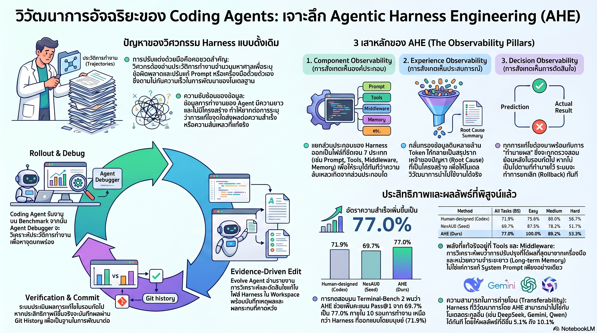

[กลับไปที่หน้าหลัก](../README.md)

สวัสดีครับเพื่อนๆ ที่ติดตามวงการ AI! วันนี้มาเรื่องที่เปลี่ยนมุมมองการพัฒนา AI Agent ไปอย่างสิ้นเชิงครับ: Agentic Harness Engineering (AHE) — งานวิจัยที่พิสูจน์ว่าการปรับแต่ง "สภาพแวดล้อมรอบโมเดล" (Harness) ให้ผลดีกว่าการขัดเกลา Prompt อย่างเทียบไม่ติด ดัน Terminal-Bench 2 จาก 69.7% เป็น 77.0% แซงหน้า Codex-CLI ที่มนุษย์ออกแบบด้วยมือ (71.9%) และที่ชัดเจนที่สุดคือ การปรับ System Prompt อย่างเดียว ทำให้ประสิทธิภาพลดลง -2.3 pp ครับ

คุณเคยสังเกตไหมครับว่า เวลาเราพยายามทำให้ AI Coding Agent ฉลาดขึ้น สิ่งแรกที่เราทำมักจะเป็นการขัดเกลา Prompt — เขียนใหม่ ปรับ Wording แก้ Instruction ซ้ำไปซ้ำมา — ราวกับว่าถ้าพูดให้ถูกต้องพอ โมเดลจะทำงานได้ดีขึ้นเองครับ? แต่งานวิจัยนี้บอกว่าเราอาจกำลังซ่อมสิ่งผิดอยู่ตลอดเวลาครับ

คุณรู้ไหมครับว่า Harness ที่ถูกพัฒนาโดย GPT-5.4 ไม่ได้ Overfit กับโมเดลตัวเดียว แต่เมื่อนำไปสวมให้โมเดลอื่นทันที DeepSeek-v4-flash ดีขึ้น +10.1 pp, Qwen-3.6-plus ดีขึ้น +6.3 pp และ Gemini-3.1-flash-lite ดีขึ้น +5.1 pp ครับ? หมายความว่า Harness ที่ดีคือ "สภาพแวดล้อมที่ดีสำหรับทุกโมเดล" ไม่ใช่การปรับจูนรายโมเดลครับ

และคุณเคยนึกไหมครับว่า Regression Blindness ที่งานวิจัยค้นพบคือ AI สามารถทำนายว่า "จะซ่อมตรงไหน" ได้ดีกว่าการสุ่มถึง 5 เท่า แต่กลับทำนายไม่ได้เลยว่า "การซ่อมตรงนั้นจะทำให้อะไรพังใหม่" ครับ? นั่นคือ Precision สูงแต่ Foresight ต่ำมาก ซึ่งเป็นปัญหาที่แก้ได้ยากกว่าการหา Bug ครับ

งานวิจัยนี้กำลังบอกว่า: "ถ้า LLM คือสมอง Harness คือระบบประสาทและอวัยวะที่เชื่อมต่อสมองกับโลกจริง — และการเปลี่ยนระบบประสาทให้ดีขึ้นมีผลมากกว่าการ Prompt สมองให้คิดแบบอื่นครับ"

========================================

🤔 ทบทวนความเชื่อเดิมๆ: สิ่งที่เราคิดเกี่ยวกับ AI Coding Agent และ Prompt Engineering

▪ "Prompt ที่ดีขึ้น = ผลลัพธ์ที่ดีขึ้น — หัวใจของ AI Agent คือการขัดเกลาคำสั่ง" → Ablation Study พิสูจน์ตรงข้ามครับ การเพิ่ม Prose-level Strategy ใน System Prompt อย่างเดียวทำให้ Terminal-Bench 2 ลดลง -2.3 pp ครับ ในขณะที่ Long-term Memory +5.6 pp, Tools +3.3 pp, Middleware +2.2 pp และใช้ Token น้อยลง 12% บน SWE-bench ด้วยครับ Structure ชนะ Prose ครับ

▪ "Harness ที่ดีต้องออกแบบให้เหมาะกับโมเดลเฉพาะตัว — มันไม่ Transfer ข้ามโมเดลได้" → Cross-model Transfer พิสูจน์ว่า Harness ที่พัฒนาบน GPT-5.4 ให้ผลดีทันทีกับ DeepSeek (+10.1 pp), Qwen (+6.3 pp), และ Gemini (+5.1 pp) ครับ สิ่งที่ Transfer คือ "Engineering Experience" ไม่ใช่ Model-specific Optimization ครับ

▪ "AI Agent ที่ดีคือ AI ที่แก้ Bug ได้เก่ง — Precision ในการ Identify ปัญหาคือทักษะหลัก" → Regression Blindness บอกว่า AI มี Precision ในการหาจุดซ่อมได้สูงกว่าการสุ่มถึง 5 เท่า แต่ Foresight ในการทำนายผลกระทบข้างเคียงแย่มากครับ การแก้ถูกต้องในมิติเดียวแต่ทำให้พังในมิติอื่นคือปัญหาที่ใหญ่กว่าการหา Bug ไม่เจอครับ

▪ "Monolithic Harness ที่ทำงานได้ครบในไฟล์เดียวคือ Design ที่เรียบง่ายและดีที่สุด" → NexAU Substrate พิสูจน์ว่า Decoupled Architecture ที่แยก Component ชัดเจน 7 ประเภทให้ Component Observability ที่ทำให้ AI แก้ไข Tools โดยไม่พัง Middleware ได้ครับ ความซับซ้อนที่มีโครงสร้างให้ผลดีกว่าความเรียบง่ายที่ไม่แยกส่วนครับ

ความจริงที่น่าคิดคือ: "วิศวกรที่ดีที่สุดใน Software Engineering รู้ว่า System Design สำคัญกว่า Clever Code — AHE กำลังบอกว่าหลักการเดียวกันนี้ Apply กับ AI Engineering ด้วยครับ"

========================================

🧠 พื้นฐานที่ต้องเข้าใจก่อน: NexAU Substrate, Observability Pillars, Cross-model Transfer, และ Regression Blindness

=== AHE คืออะไร และทำไมจึงต่างจาก Prompt Engineering ===

Prompt Engineering มองโมเดลเป็น Function ที่รับ Input แล้วให้ Output ครับ งานของวิศวกรคือขัดเกลา Input ให้ได้ Output ที่ต้องการครับ

AHE มองระบบต่างออกไปครับ โมเดลคือ Agent ที่อาศัยอยู่ใน Environment ครับ และ Environment ที่ดีหรือแย่มีผลต่อ Agent มากกว่าการพูดกับมันให้ดีขึ้นครับ Harness ในที่นี้หมายถึงทุกอย่างที่ล้อมรอบโมเดล ตั้งแต่ Tools ที่มันใช้ได้, Memory ที่มันเข้าถึงได้, Middleware ที่กรอง Input/Output, ไปจนถึง System Prompt ครับ

=== NexAU Substrate: Decoupled Architecture ที่แยก 7 ประเภท ===

NexAU เป็น Framework ที่แยก Harness Component ออกเป็น 7 ประเภทชัดเจน ครับ แต่ละประเภทอยู่ในไฟล์และ Module ของตัวเองครับ ซึ่งต่างจาก Monolithic Harness ที่ทุกอย่างอยู่ด้วยกันครับ

ประโยชน์สำคัญของ Decoupling ครับ: เมื่อ AI ต้องการแก้ไข Tool เพื่อปรับปรุงประสิทธิภาพ มันรู้ว่าต้องแก้ที่ไฟล์ไหน และการแก้นั้นจะไม่กระทบ Memory Logic หรือ Middleware ครับ ถ้าแก้แล้วไม่ดีขึ้น Rollback ทำได้ง่ายโดยไม่ต้องเดาว่าอะไรเปลี่ยนไปบ้างครับ

Component Isolation นี้เองที่ทำให้ AHE สามารถทำ Iterative Self-improvement ได้อย่างเป็นระบบ ไม่ใช่การลองผิดลองถูกแบบสุ่มครับ

=== Ablation Study: ทำไม Prose ถึงแพ้ Structure ===

ผลลัพธ์ที่น่าประหลาดใจที่สุดในงานวิจัยนี้มาจาก Ablation Study บน Terminal-Bench 2 ครับ

เมื่อเพิ่มเฉพาะ System Prompt Strategy (Prose-level): -2.3 pp ครับ ผลเป็นลบครับ

เมื่อเพิ่ม Long-term Memory Component: +5.6 pp ครับ ทำไม? เพราะโมเดลสามารถ Retrieve Engineering Lessons จากรอบก่อนหน้าได้ ไม่ต้อง Rediscover ปัญหาเดิมซ้ำครับ

เมื่อปรับปรุง Tools: +3.3 pp ครับ Tools ที่ Precise กว่าทำให้โมเดลใช้เวลาน้อยลงในการ Interpret ผลลัพธ์ครับ

เมื่อเพิ่ม Middleware: +2.2 pp ครับ Middleware กรอง Noise ออกก่อนที่จะถึงโมเดล ทำให้ Context ที่โมเดลเห็นมีสัญญาณที่ชัดกว่าครับ

และทั้งหมดนี้ใช้ Token น้อยลง 12% บน SWE-bench เพราะโมเดลไม่ต้องอ่านข้อมูลซ้ำซ้อนที่ Middleware กรองไปแล้วครับ

=== Three Observability Pillars: เปลี่ยนการเดาสุ่มให้เป็น Falsifiable Contract ===

AHE แก้ปัญหา Trial-and-error แบบสุ่มด้วยระบบสังเกตการณ์สามระดับครับ

Component Observability: ทุก Component ของ Harness มี Boundary ชัดเจนครับ AI รู้ว่าความผิดพลาดประเภทนี้เกิดจาก Component ไหน และการแก้ไข Component นั้นจะไม่ลุกลามไปส่วนอื่นครับ เหมือนระบบ Circuit Breaker ที่แยก Fault Domain ออกจากกันครับ

Experience Observability: Log การทำงานของ AI Agent สามารถยาวหลายแสนหรือล้าน Token ครับ AHE แปลง Log เหล่านั้นให้เป็น "Layered Evidence Corpus" ที่สรุป Root Cause ออกมาในรูปแบบที่ Consumable ครับ ไม่ใช่ให้โมเดลอ่านดิบทั้งหมดครับ เหมือนการสรุปรายงานการประชุมแทนการส่ง Transcript ทั้งหมดครับ

Decision Observability: ก่อนที่ AI จะแก้ไข Harness ทุกครั้ง ระบบบังคับให้เขียน "Change Manifest" ครับ ซึ่งระบุว่าการแก้ไขนี้คาดว่าจะช่วย Task ไหน และเสี่ยงจะทำ Task ไหนพัง ครับ ในรอบถัดไป ระบบ Verify ว่าคำทำนายนั้นถูกหรือผิดครับ

ผลลัพธ์คือทุก Iteration มี Signal ที่ชัดเจนว่าโมเดลเข้าใจผลกระทบของการแก้ไขตัวเองแค่ไหนครับ ไม่ใช่แค่วัดผลลัพธ์สุดท้ายครับ

=== Cross-model Transfer: Engineering Experience ไม่ใช่ Model-specific Knowledge ===

Harness ที่ AHE พัฒนาขึ้นมาจาก GPT-5.4 มีคุณสมบัติที่น่าทึ่งครับ มันไม่ได้สอน "วิธีพูดกับ GPT-5.4 ให้ได้ผล" แต่สร้าง "Environment ที่ดีสำหรับการทำ Coding Task" ครับ

เมื่อ Swap โมเดลโดยไม่เปลี่ยน Harness ครับ:

DeepSeek-v4-flash ดีขึ้น +10.1 pp ครับ ซึ่งเป็นตัวเลขสูงมาก บอกว่า Harness ที่ดีช่วยโมเดลที่ "อยู่ใน Environment แย่" ได้มากที่สุดครับ

Qwen-3.6-plus ดีขึ้น +6.3 pp และ Gemini-3.1-flash-lite ดีขึ้น +5.1 pp ครับ

Pattern นี้ชี้ให้เห็นว่า Harness คือ "Infrastructure ที่ดี" ซึ่งทำให้ทุก Tenant ทำงานได้ดีขึ้น ไม่ใช่ Custom Tuning สำหรับ Tenant เฉพาะรายครับ

=== Regression Blindness: ขีดจำกัดที่ซื่อสัตย์ ===

งานวิจัยนี้รายงานข้อจำกัดอย่างตรงไปตรงมาครับ ซึ่งน่าเคารพมากครับ

AI Agent ที่ใช้ AHE มี Precision ในการทำนายว่า "Task ไหนจะดีขึ้นหลังแก้ไข" สูงกว่าการสุ่มถึง 5 เท่าครับ นั่นคือมันรู้ว่าจะซ่อมตรงไหนได้ดีมากครับ

แต่ Foresight ในการทำนายว่า "Task ที่เคยทำได้อยู่แล้วจะพังหรือไม่" แย่มากครับ โมเดลสามารถแก้ไขสิ่งหนึ่งให้ดีขึ้น แล้วทำให้อีกสิ่งที่เคยทำงานได้ถูกต้องพังลงโดยไม่รู้ตัวครับ

ปัญหานี้เรียกว่า Regression Blindness ครับ และงานวิจัยระบุว่ามันคือทิศทางหลักสำหรับการพัฒนา Self-evolution Loop รุ่นถัดไปครับ เพราะ AI ที่ไม่รู้ว่ากำลังทำลายสิ่งที่ดีอยู่แล้วนั้น อาจก้าวหน้าในบางมิติพร้อมกับถดถอยในมิติอื่นโดยไม่ตั้งใจครับ

========================================

🎯 ประเด็นที่ควรคิดต่อ

— บทบาทของวิศวกร AI กำลังเปลี่ยน: AHE ชี้ให้เห็นว่าทักษะที่มีค่าขึ้นไม่ใช่ "เขียน Prompt ให้สวย" แต่คือ "ออกแบบ System ที่มี Observability ที่ดี" ครับ ทักษะ Software Architecture, Fault Isolation, และ Feedback Loop Design กำลังกลายเป็นทักษะ AI Engineering ที่สำคัญกว่าที่เคยครับ

— Cross-model Transfer Harness คือ Asset ที่มีมูลค่าสูง: ถ้า Harness ที่ดีสามารถยก Capability ของโมเดลใดก็ได้ขึ้น 5-10 pp ทันที — Harness นั้นคือ Intellectual Property ที่มีค่าในเชิงธุรกิจอย่างมากครับ ไม่แพ้ Data หรือ Fine-tuned Model ครับ องค์กรที่สะสม Engineering Experience แบบนี้ไว้จะมี Moat ที่ยั่งยืนกว่าการใช้โมเดลที่ใหญ่กว่าครับ

— คำถามที่สำคัญที่สุด: Regression Blindness บอกว่า AI ยังขาด "ความเข้าใจระบบในภาพรวม" ครับ มันเก่งในการ Optimize จุดเดียว แต่ไม่เห็น Side Effect ที่ไกลออกไปครับ ถ้านี่คือขีดจำกัดที่แก้ไม่ได้ด้วย Harness Engineering อย่างเดียว สิ่งที่ต้องเปลี่ยนคืออะไร — Architecture ของโมเดล, Training Data, หรือวิธีที่เราวัด Success ของ Agent ครับ?

#AHE #AgenticHarness #AIAgent #CodingAgent #PromptEngineering #SWEBench #TerminalBench #LLM #SoftwareEngineering #AIResearch #CrossModelTransfer #RegressionBlindness #Observability
