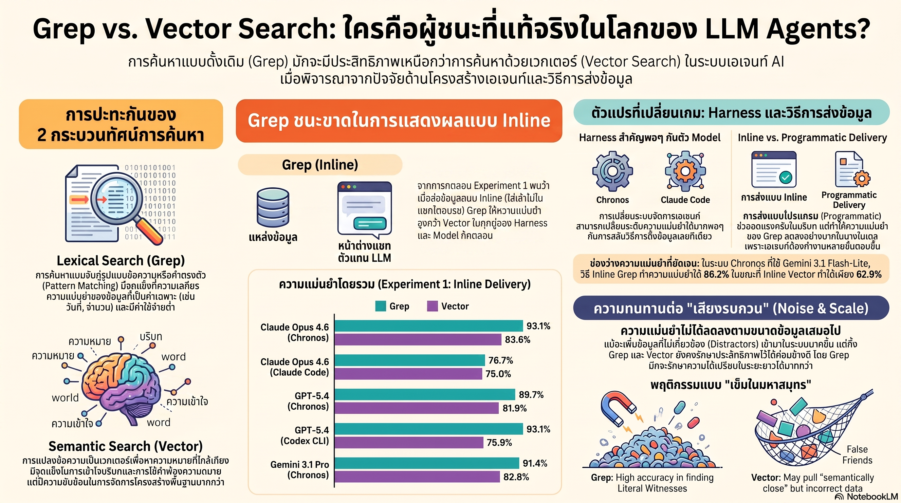

[กลับไปที่หน้าหลัก](../README.md)

สวัสดีครับเพื่อนๆ ที่ติดตามวงการ AI! ถ้าถามนักพัฒนาว่า "เทคโนโลยีไหนดีที่สุดสำหรับ RAG?" คำตอบที่ได้เกือบ 100% คือ Vector Search ครับ — เพราะมัน "ฉลาดกว่า" และค้นหาเชิงความหมายได้ครับ แต่งานวิจัย "Is Grep All You Need?" พิสูจน์ว่าใน Agentic Loop จริงๆ Grep ที่จับคู่กับ Chronos Preprocessing อาจให้ความแม่นยำสูงกว่าได้ครับ และที่น่าตกใจกว่าคือ Claude Opus 4.6 โมเดลเดียวกัน ใน Harness ต่างกัน ให้ผลต่างกัน 16.4pp (93.1% vs 76.7%) ครับ

คุณเคยสังเกตไหมครับว่า Vector Search เก่งมากในการหาสิ่งที่ "ความหมายใกล้เคียงกัน" แต่พอถามถึงวันที่เฉพาะเจาะจง ตัวเลขสถิติ หรือชื่อที่ห้ามตีความผิดครับ มันกลับดึง "Topical False Friends" ขึ้นมาแทน — ข้อมูลที่หัวข้อคล้ายกันแต่ไม่ใช่สิ่งที่ต้องการเลยครับ? และปัญหานี้แย่ลงเรื่อยๆ เมื่อมีข้อมูลขยะมากขึ้นครับ?

คุณรู้ไหมครับว่า Context Rot คืออาการที่เกิดขึ้นเมื่อผลลัพธ์การค้นหาถูกยัดเข้า Context Window โดยตรงมากเกินไปจนเบียด System Prompt ออกไปครับ — ผลคือโมเดลเริ่มสับสน ลืม Instruction เดิม และประสิทธิภาพร่วงลงครับ? และวิธีแก้ด้วย File-based Delivery ที่ดูสมเหตุสมผล กลับทำให้ GPT-5.4 บน Codex ตกจาก 93.1% เหลือ 55.2% เพราะต้องวนลูป "หา-เปิด-อ่าน-สรุป" เองครับ?

และคุณเคยนึกไหมครับว่า โมเดลเดียวกัน Data เดียวกัน Task เดียวกัน แต่เปลี่ยนแค่ Harness ที่จัดการ Tool-calling ได้ผลต่างกันถึง 16.4 pp ครับ — นั่นหมายความว่าวิศวกรที่ทุ่มเวลา Fine-tune โมเดลอาจพลาดจุดที่สำคัญกว่าไปครับ?

งานวิจัยนี้กำลังบอกว่า: "ประสิทธิภาพของ AI Agent ไม่ใช่เรื่องของว่าโมเดลฉลาดแค่ไหน แต่คือเรื่องของระบบนิเวศทั้งหมดครับ — เครื่องมือค้นหา วิธีส่งข้อมูล และ Harness ที่จัดการ Workflow ล้วนสำคัญพอๆ กับตัวโมเดลครับ"

========================================

🤔 ทบทวนความเชื่อเดิมๆ: สิ่งที่เราคิดเกี่ยวกับระบบค้นหาสำหรับ AI Agent

▪ "Vector Search ชนะ Lexical Search ในทุกกรณีของ RAG — เพราะค้นหาเชิงความหมายฉลาดกว่าการจับคำตรงตัว" → ใน Task ที่ต้องการ Literal Span Recovery เช่น วันที่เฉพาะเจาะจง ตัวเลขสถิติ หรือชื่อที่ห้ามตีความผิด Grep + Chronos Preprocessing ให้ความแม่นยำสูงกว่าครับ Vector Search ดึง Topical False Friends ขึ้นมาด้วยเสมอครับ เพราะมันถูกออกแบบมาเพื่อหา "ที่ใกล้เคียง" ไม่ใช่ "ที่ใช่" ครับ

▪ "ยิ่งโมเดลใหญ่ยิ่งดีครับ — ถ้าใช้ Claude Opus หรือ GPT-5 ระบบ RAG จะทำงานได้ดีโดยอัตโนมัติ" → Claude Opus 4.6 โมเดลเดียวกัน ใน Chronos Harness ได้ 93.1% แต่ใน Claude Code (Native CLI) ได้ 76.7% ครับ ส่วนต่าง 16.4pp มาจาก Harness ไม่ใช่โมเดลครับ การลงทุนใน Harness Engineering ให้ผลตอบแทนสูงกว่าการอัปเกรดโมเดลในหลาย Scenario ครับ

▪ "การส่งผลลัพธ์ค้นหาให้ AI อ่านจากไฟล์จะดีกว่า Inline เสมอ — เพราะหลีกเลี่ยง Context Overflow ได้" → GPT-5.4 บน Codex ที่ต้องอ่านผลลัพธ์จากไฟล์เองตกจาก 93.1% เหลือ 55.2% เพราะ Read-integrate-retry Cycle ที่ซับซ้อนครับ File-based Delivery แก้ปัญหา Context Pressure แต่สร้างปัญหา Workflow Complexity ใหม่ขึ้นมาแทนครับ ต้องเลือกตาม Capability ของโมเดลครับ

▪ "เมื่อ Dataset ใหญ่ขึ้นมีข้อมูลขยะมากขึ้น Vector Search จะค้นหาได้ดีกว่า Grep เสมอ — เพราะ Semantic Similarity ทนต่อ Noise ได้มากกว่า" → Grep มี Non-monotone Noise Tolerance ที่น่าสนใจครับ Claude Opus บน Chronos มีความแม่นยำเพิ่มจาก 89.3% เป็น 90.5% เมื่อขยายจาก 5 เป็น 20 Sessions ครับ เพราะ Grep จะทำงานก็ต่อเมื่อเจอ Pattern ที่ตรงจริงๆ ทำให้ Precision ยืนหยัดได้ดีกว่าในสภาพแวดล้อมที่มี Topical Noise สูงครับ

ความจริงที่น่าคิดคือ: "ซับซ้อนกว่าไม่ได้หมายความว่าดีกว่าครับ — ถ้าจัดการโครงสร้างข้อมูลให้ดี เครื่องมือที่เรียบง่ายที่สุดอาจชนะได้ครับ"

========================================

🧠 พื้นฐานที่ต้องเข้าใจก่อน: Chronos Pipeline, Harness Gap, Context Rot, และ Non-monotone Tolerance

=== Grep vs. Vector Search: ต่างกันที่ไหนและเมื่อไหรจึงสำคัญ ===

Vector Search แปลงข้อความเป็น Dense Embedding แล้วค้นหาด้วย Cosine Similarity ครับ จุดแข็งคือ Conceptual Blending ครับ — หา "สิ่งที่ความหมายใกล้เคียงกัน" ได้ดีแม้ใช้คำต่างกันครับ

Grep ค้นหาด้วย Pattern Matching ตามตัวอักษรครับ จุดแข็งคือ Literal Span Recovery ครับ — "2024-03-15", "THB 47,832", หรือ "นายสมชาย สุขใจ" จะถูกค้นพบได้แม่นยำ 100% ถ้า String ตรงกันครับ

จุดเด่นของ Vector พังในสถานการณ์ที่ Precision สำคัญกว่า Recall ครับ เพราะมันถูกสร้างมาให้ "กว้างขวาง" ทำให้ดึงข้อมูลที่หัวข้อคล้ายกันแต่ไม่ใช่คำตอบขึ้นมาด้วยเสมอครับ ใน Agentic Loop ที่ AI ต้องประมวลผลผลลัพธ์ต่อ ข้อมูลที่ผิดหน่วยเดียวอาจ Cascade ออกไปทำให้งานทั้งหมดพังครับ

=== Chronos Preprocessing Pipeline: เหตุผลที่ Grep ฉลาดขึ้นได้ ===

ข้อจำกัดเดิมของ Grep คือ Vocabulary Mismatch ครับ ถ้าผู้ใช้พิมพ์ "เดือนมีนา" แต่ข้อมูลเก็บว่า "มีนาคม 2024" Grep ก็ค้นไม่เจอครับ

Chronos แก้ปัญหานี้ด้วยการ Preprocess ข้อมูลก่อนเก็บครับ โดยสกัด Structured Temporal Events ออกจากข้อความดิบครับ วันที่, ช่วงเวลา, และ Event ที่เชื่อมโยงกันถูกแปลงเป็น Canonical Format ที่มีโครงสร้างแน่นอนครับ ทำให้ Query ที่ Agent ส่งมาสามารถ Map กลับไปหา Format นั้นได้แม่นยำระดับตัวอักษรครับ

ผลคือ Grep + Chronos กลายเป็น Precision Tool ที่ดีกว่า Vector Search ใน Literal Retrieval Task ครับ โดยไม่เสีย Embedding Cost เลยครับ

=== The Harness Gap: 16.4pp ที่มาจากการเปลี่ยน Wrapper ครับ ===

นี่คือ Finding ที่สำคัญที่สุดสำหรับวิศวกรครับ Claude Opus 4.6 โมเดลเดียวกัน ข้อมูลเดียวกัน Task เดียวกันครับ

บน Chronos Harness ที่ออกแบบมาเพื่อจัดการ Long-term Memory และ Tool-calling อย่างเหมาะสม: ความแม่นยำ 93.1% ครับ

บน Claude Code ซึ่งเป็น Native CLI ที่ออกแบบมาสำหรับ General Coding Task: ความแม่นยำ 76.7% ครับ

ส่วนต่าง 16.4pp ไม่ได้มาจากโมเดลครับ มันมาจากวิธีที่ Harness จัดการ Tool-calling Sequence, Context Management, และการส่ง Result กลับไปให้โมเดลประมวลผลต่อครับ Harness ที่ดีลด Cognitive Load ของโมเดล ทำให้โมเดลใช้ Capacity ที่มีไปกับ Reasoning แทนที่จะต้องจัดการ Workflow ครับ

=== Context Rot และ Data Delivery Trade-off ===

เมื่อผลลัพธ์จากการค้นหาถูกส่งเข้า Context Window โดยตรง (Standard Inline) สิ่งที่เกิดขึ้นในระยะยาวคือ Context Rot ครับ

ลองนึกภาพ Context Window เหมือนโต๊ะทำงานครับ System Prompt คือคู่มือที่ต้องวางไว้ข้างหน้าตลอดเวลาครับ แต่เมื่อผลลัพธ์การค้นหาจำนวนมากถูกวางลงบนโต๊ะเดียวกันซ้ำๆ คู่มือก็ถูกเบียดไปอยู่ใต้กองเอกสารครับ โมเดลเริ่มลืม Instruction เดิม สับสนระหว่างบริบทเก่าและใหม่ และ Precision ตกลงเรื่อยๆ โดยไม่มีสัญญาณเตือนครับ

วิธีแก้ด้วย File-based Delivery คือให้ AI ไปอ่านผลลัพธ์จากไฟล์เองครับ ลด Context Pressure ได้จริงครับ แต่สร้าง Read-integrate-retry Cycle ที่ซับซ้อนขึ้นครับ โมเดลที่ไม่ได้ถูก Optimize สำหรับ Multi-step File Management เช่น GPT-5.4 บน Codex ตกจาก 93.1% เหลือ 55.2% ทันทีครับ

ทางออกที่ดีที่สุดคือการเลือก Delivery Method ตาม Agentic Capability ของโมเดล ไม่ใช่เลือกตาม "ที่ควรจะดีกว่าในทฤษฎี" ครับ

=== Non-monotone Noise Tolerance: ทำไม Grep ถึงไม่แย่ลงเชิงเส้น ===

ความเชื่อเดิมคือ เพิ่ม Distractor (ข้อมูลขยะ) → Performance ของ Grep ตกลงเชิงเส้นตรงครับ แต่ผลทดลองแสดง Pattern ที่ต่างออกไปครับ

Claude Opus บน Chronos เพิ่มความแม่นยำจาก 89.3% → 90.5% เมื่อขยายจาก 5 เป็น 20 Sessions ก่อนจะลดลงเล็กน้อยครับ Non-monotone Pattern นี้เกิดเพราะ Grep ทำงานด้วยหลัก Exact Match ครับ ถ้า Pattern ไม่ตรง ก็ไม่ดึงขึ้นมาครับ ในขณะที่ Vector Search ดึง "สิ่งที่ใกล้เคียงที่สุด" ขึ้นมาเสมอครับ — แม้ว่าไม่มีสิ่งที่เกี่ยวข้องเหลืออยู่เลย

ผลคือในสภาพแวดล้อมที่ Topical Noise สูง (ข้อมูลที่หัวข้อใกล้เคียงแต่ไม่ใช่คำตอบ) Grep รักษา Precision ได้ดีกว่า เพราะมันไม่ถูก "ล่อ" โดย Semantic Similarity ครับ

=== เมื่อไหรควรใช้อะไร: Framework สำหรับการตัดสินใจ ===

Grep เหมาะกับ Task ที่ต้องการ Literal Span Recovery ครับ ข้อมูลที่มีโครงสร้างชัดเจน (วันที่, ตัวเลข, ชื่อเฉพาะ) ครับ งบประมาณที่จำกัดเพราะไม่ต้องใช้ Embedding Model ครับ และ Dataset ที่มี Topical Noise สูงครับ

Vector Search เหมาะกับ Task ที่ต้องการ Conceptual Blending ครับ ผู้ใช้อาจใช้คำต่างกันจาก Data ที่เก็บครับ และ Query ที่ไม่มี Exact String ให้ Match ได้ครับ

Hybrid ที่ดีที่สุดสำหรับงานจริงคือใช้ Grep + Chronos สำหรับ Structured/Temporal Retrieval และ Vector สำหรับ Open-ended Semantic Search ครับ แทนที่จะเลือกแบบ All-or-nothing ครับ

========================================

🎯 ประเด็นที่ควรคิดต่อ

— Harness Gap 16.4pp บอกว่าวงการ AI กำลังลงทุนผิดจุดครับ: ถ้าการเปลี่ยน Harness ให้ผลต่าง 16.4pp โดยที่โมเดลไม่เปลี่ยน เหตุใดงบวิจัยและวิศวกรส่วนใหญ่จึงยังทุ่มไปกับการ Fine-tune และ Scale โมเดลครับ? Harness Engineering และ Evaluation Framework ที่วัด Harness Performance แยกจากโมเดลน่าจะเป็น Discipline ที่ได้รับความสนใจมากกว่าที่เป็นอยู่ครับ

— Context Rot คือ Silent Killer ที่ Production System มองข้ามครับ: ใน Benchmark ที่รันทีละ Query มักไม่เจอ Context Rot ครับ แต่ใน Production ที่ Agent ทำงานต่อเนื่องหลาย Turn ความเสื่อมของ Performance จะสะสมแบบที่ยากตรวจจับครับ Monitoring ที่ดีของ Agentic System ควรวัด Context Composition ในแต่ละ Turn ไม่ใช่แค่ Accuracy ของ Output สุดท้ายครับ

— "Is Grep All You Need?" คือคำถามที่ถูกต้องแต่คำตอบที่สำคัญกว่าคือ "When?" ครับ: งานวิจัยนี้ไม่ได้บอกว่า Grep ชนะทุกอย่างครับ แต่บอกว่า Task Decomposition ก่อนเลือก Tool สำคัญมากครับ องค์กรที่สร้าง Routing Layer ที่วิเคราะห์ Query แล้วส่งไปหา Grep หรือ Vector ตาม Nature ของ Query โดยอัตโนมัติ จะได้ทั้ง Precision ของ Grep และ Flexibility ของ Vector ในระบบเดียวกันครับ — และนั่นอาจเป็นทิศทางที่น่าสนใจที่สุดของ Agentic Search Design ครับ

#Grep #VectorSearch #RAG #AgentHarness #ContextRot #LexicalSearch #SemanticSearch #AIAgent #Chronos #InformationRetrieval #LLM #ProductionAI #HarnessEngineering #AIResearch #AgenticSearch
