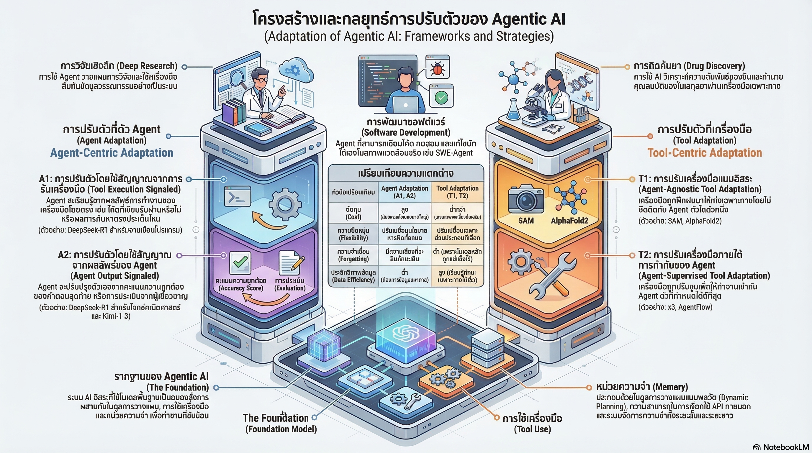

[กลับไปที่หน้าหลัก](../README.md)

สวัสดีครับเพื่อนๆ นักพัฒนาและคนรัก 𝐀𝐈! วันนี้เรามาคุยเรื่องที่หลายคนเจอกำแพงอยู่แต่ยังไม่รู้ว่าจะข้ามยังไงกันครับ นั่นคือ "ทำไม 𝐏𝐫𝐨𝐦𝐩𝐭 𝐄𝐧𝐠𝐢𝐧𝐞𝐞𝐫𝐢𝐧𝐠 ถึงไม่พอ และเราต้องทำอะไรต่อไป?"

คุณเคยรู้สึกไหมครับว่า แม้จะปรับ 𝐏𝐫𝐨𝐦𝐩𝐭 ไปกี่ครั้งก็ตาม 𝐀𝐈 ก็ยังทำงานผิดพลาดซ้ำๆ โดยเฉพาะงานที่มีหลายขั้นตอน? หรือสงสัยว่าทำไม 𝐀𝐈 ที่ใหญ่กว่าบางทีถึงแพ้ 𝐀𝐈 ตัวเล็กกว่าในงานเฉพาะทาง?

คำตอบอยู่ที่แนวคิดที่เรียกว่า "𝐀𝐝𝐚𝐩𝐭𝐚𝐭𝐢𝐨𝐧" ครับ ไม่ใช่แค่การปรับคำสั่ง แต่คือการออกแบบระบบให้ส่วนต่างๆ เรียนรู้และปรับตัวเข้าหากันอย่างชาญฉลาด

วันนี้เรามาดู 𝟒 กลยุทธ์หลักที่กำลังเปลี่ยน 𝐀𝐠𝐞𝐧𝐭𝐢𝐜 𝐀𝐈 จากแค่ "แชทบอท" ให้กลายเป็น "เอเจนต์" ที่ทำงานได้จริงในโลกภายนอกกันครับ

========================================

🤔 ทบทวนความเชื่อเดิมๆ: 𝐀𝐠𝐞𝐧𝐭𝐢𝐜 𝐀𝐈 ในสายตาเดิม

ก่อนจะไปดู 𝟒 กลยุทธ์ มาทบทวนความเข้าใจเดิมๆ กันก่อนนะครับ

▪ "แค่ 𝐏𝐫𝐨𝐦𝐩𝐭 ดีๆ ก็พอแล้ว" → ไม่พอสำหรับงานหลายขั้นตอน! ต้องปรับทั้งระบบ
▪ "โมเดลใหญ่กว่าเก่งกว่าเสมอ" → ผิด! เอเจนต์เล็กๆ ที่เชี่ยวชาญเฉพาะทางชนะได้
▪ "ถ้า 𝐀𝐈 ทำงานผิด ต้องเทรนโมเดลใหม่เสมอ" → ไม่จำเป็น! บางทีแค่ปรับ "เครื่องมือ" รอบๆ มันดีกว่า
▪ "𝐀𝐈 คือโมเดลตัวเดียวที่ทำงานได้ทุกอย่าง" → อนาคตคือการทำงานเป็น "ระบบนิเวศ" ที่ร่วมมือกัน

=== พื้นฐานที่ต้องรู้: 𝐀𝐠𝐞𝐧𝐭𝐢𝐜 𝐀𝐈 คืออะไร? ===

𝐀𝐈 แบบปกติ (𝐂𝐡𝐚𝐭𝐛𝐨𝐭):
▸ รับคำถาม → คิด → ตอบ → จบ
▸ ทำงานได้เป็นรอบๆ แต่ไม่ต่อเนื่อง
▸ ไม่ได้ใช้เครื่องมือภายนอก

𝐀𝐠𝐞𝐧𝐭𝐢𝐜 𝐀𝐈:
▸ รับงาน → วางแผน → ใช้เครื่องมือ → ตรวจสอบผล → ปรับแผน → ทำต่อ
▸ ทำงานหลายขั้นตอนได้อย่างต่อเนื่อง
▸ เรียกใช้ 𝐀𝐏𝐈, รันโค้ด, ค้นหาเว็บ, จัดการไฟล์ได้จริงๆ

=== 𝟐𝐱𝟐 𝐀𝐝𝐚𝐩𝐭𝐚𝐭𝐢𝐨𝐧 𝐋𝐚𝐧𝐝𝐬𝐜𝐚𝐩𝐞: แผนที่ของกลยุทธ์ทั้งหมด ===

นักวิจัยออกแบบแผนที่ที่ช่วยให้เห็นภาพรวมได้ครับ:

แกนนอน: ใครคือสิ่งที่ถูกปรับ?
▸ ซ้าย = ปรับ "เครื่องมือ" (𝐓𝐨𝐨𝐥 𝐀𝐝𝐚𝐩𝐭𝐚𝐭𝐢𝐨𝐧)
▸ ขวา = ปรับ "สมองหลัก" หรือตัวโมเดล (𝐀𝐠𝐞𝐧𝐭 𝐀𝐝𝐚𝐩𝐭𝐚𝐭𝐢𝐨𝐧)

แกนตั้ง: ระดับของการป้อนข้อมูลกลับ (𝐅𝐞𝐞𝐝𝐛𝐚𝐜𝐤)
▸ ล่าง = 𝐅𝐞𝐞𝐝𝐛𝐚𝐜𝐤 แบบเฉพาะจุด เช่น รันโค้ดแล้วผิดตรงนี้
▸ บน = 𝐅𝐞𝐞𝐝𝐛𝐚𝐜𝐤 แบบภาพรวม เช่น คำตอบสุดท้ายถูกหรือผิด?

กลยุทธ์ทั้ง 𝟒 แบบ:
▸ 𝐓𝟏 = ปรับเครื่องมือ + 𝐅𝐞𝐞𝐝𝐛𝐚𝐜𝐤 เฉพาะจุด
▸ 𝐓𝟐 = ปรับเครื่องมือ + 𝐅𝐞𝐞𝐝𝐛𝐚𝐜𝐤 ภาพรวม (𝐀𝐠𝐞𝐧𝐭-𝐒𝐮𝐩𝐞𝐫𝐯𝐢𝐬𝐞𝐝)
▸ 𝐀𝟏 = ปรับโมเดล + 𝐅𝐞𝐞𝐝𝐛𝐚𝐜𝐤 เฉพาะจุด (เช่น 𝐃𝐞𝐞𝐩𝐒𝐞𝐞𝐤-𝐑𝟏)
▸ 𝐀𝟐 = ปรับโมเดล + 𝐅𝐞𝐞𝐝𝐛𝐚𝐜𝐤 ภาพรวม (เช่น 𝐒𝐞𝐚𝐫𝐜𝐡-𝐑𝟏)

========================================

𝟏. 🔧 "อย่าเพิ่งรีบแก้สมอง 𝐀𝐈 ลองปรับ 'เครื่องมือ' รอบๆ มันดูก่อน"

กลยุทธ์แรกและฉลาดที่สุดในแง่ความคุ้มค่าคือ 𝐓𝟐 𝐏𝐚𝐫𝐚𝐝𝐢𝐠𝐦!

=== ปัญหาของการ 𝐅𝐢𝐧𝐞-𝐭𝐮𝐧𝐞 โมเดลหลัก ===

[สิ่งที่นักพัฒนามักทำเมื่อ 𝐀𝐈 ผิดพลาด]
▸ รีบทำ 𝐅𝐢𝐧𝐞-𝐭𝐮𝐧𝐢𝐧𝐠 โมเดลหลักทันที
▸ ปรับพารามิเตอร์ในสมองของ 𝐀𝐈 ตรงๆ
▸ ต้องใช้ข้อมูลมหาศาล และเวลานาน
▸ เสี่ยงกับ 𝐂𝐚𝐭𝐚𝐬𝐭𝐫𝐨𝐩𝐡𝐢𝐜 𝐅𝐨𝐫𝐠𝐞𝐭𝐭𝐢𝐧𝐠 = 𝐀𝐈 ลืมสิ่งที่เคยรู้มาก่อน!

𝐂𝐚𝐭𝐚𝐬𝐭𝐫𝐨𝐩𝐡𝐢𝐜 𝐅𝐨𝐫𝐠𝐞𝐭𝐭𝐢𝐧𝐠 คืออะไร?
▸ เหมือนพนักงานที่เรียนทักษะใหม่แล้วลืมทักษะเก่าที่เคยเก่งไป
▸ โมเดลที่ 𝐅𝐢𝐧𝐞-𝐭𝐮𝐧𝐞 บางครั้งเก่งขึ้นในงานใหม่ แต่แย่ลงในงานเดิม!

=== 𝐓𝟐 𝐏𝐚𝐫𝐚𝐝𝐢𝐠𝐦: แช่แข็งสมอง แต่ฝึกเครื่องมือแทน ===

[วิธีใหม่: 𝐀𝐠𝐞𝐧𝐭-𝐒𝐮𝐩𝐞𝐫𝐯𝐢𝐬𝐞𝐝 𝐓𝐨𝐨𝐥 𝐀𝐝𝐚𝐩𝐭𝐚𝐭𝐢𝐨𝐧]
▸ "แช่แข็ง" โมเดลหลักไว้ (𝐅𝐫𝐨𝐳𝐞𝐧 𝐀𝐠𝐞𝐧𝐭) ไม่แตะพารามิเตอร์
▸ แทนที่จะแก้ที่ 𝐀𝐈 ให้หันมาปรับ "เครื่องมือ" รอบๆ แทน
▸ ปรับหน่วยความจำ (𝐌𝐞𝐦𝐨𝐫𝐲) และ 𝐀𝐏𝐈 ให้เข้ากับ "รูปแบบการคิด" ของโมเดลนั้น
▸ โมเดลหลักทำหน้าที่เป็นครู ส่วนเครื่องมือเป็นลูกศิษย์ที่เรียนรู้

เปรียบเทียบ:
▸ เหมือนมีนักแปลที่เก่ง แต่พูดภาษาเฉพาะของตัวเอง
▸ แทนที่จะสอนนักแปลให้พูดภาษาใหม่ (เปลี่ยนโมเดล)
▸ เราฝึกล่ามที่นั่งข้างๆ ให้แปลคำพูดของนักแปลให้ถูกต้องแทน!

=== ตัวอย่างจริง: ระบบ 𝐌𝐞𝐦𝐞𝐧𝐭𝐨 ===

𝐌𝐞𝐦𝐞𝐧𝐭𝐨 ใช้แนวคิดที่ชื่อว่า 𝐄𝐩𝐢𝐬𝐨𝐝𝐢𝐜 𝐂𝐚𝐬𝐞 𝐌𝐞𝐦𝐨𝐫𝐲 ครับ

วิธีทำงาน:
▸ โมเดลหลักถูกแช่แข็งไว้ ไม่มีการเปลี่ยนแปลง
▸ ระบบหน่วยความจำรอบๆ จะเรียนรู้ว่า "อดีต 𝐀𝐈 ตัวนี้เคยพลาดตรงไหนบ้าง?"
▸ เมื่อเจองานคล้ายกัน ระบบจะดึงความทรงจำนั้นมา "สะกิด" (𝐍𝐮𝐝𝐠𝐞) 𝐀𝐈
▸ 𝐀𝐈 ตัวเดิมทำงานได้ถูกต้องมากขึ้น โดยไม่ต้องถูก 𝐅𝐢𝐧𝐞-𝐭𝐮𝐧𝐞 เลย!

เปรียบเทียบ:
▸ เหมือนผู้ช่วยที่จำได้ว่าเจ้านายเคยตัดสินใจผิดตรงไหน
▸ ครั้งต่อไปเมื่อเห็นสถานการณ์คล้ายกัน ผู้ช่วยก็แตะแขนเบาๆ ว่า "ระวังนะครับ..."
▸ เจ้านายยังเป็นคนเดิม แต่ตัดสินใจได้ดีขึ้น!

สิ่งนี้เรียกว่า 𝐒𝐲𝐦𝐛𝐢𝐨𝐭𝐢𝐜 𝐀𝐝𝐚𝐩𝐭𝐚𝐭𝐢𝐨𝐧 (การปรับตัวแบบพึ่งพาอาศัยซึ่งกันและกัน) ครับ

========================================

𝟐. 🔬 "𝐔𝐧𝐛𝐮𝐧𝐝𝐥𝐢𝐧𝐠 𝐭𝐡𝐞 𝐁𝐫𝐚𝐢𝐧: ทำไมเอเจนต์เล็กถึงชนะโมเดลยักษ์ได้?"

กลยุทธ์ที่สองเปิดเผยความลับที่ขัดกับสัญชาตญาณ!

=== ปัญหาของการเทรน 𝐀𝐈 แบบรู้ทุกอย่าง ===

ลองนึกภาพการเทรนเอเจนต์แบบ 𝐀𝟐 เช่น 𝐒𝐞𝐚𝐫𝐜𝐡-𝐑𝟏 ครับ

[สิ่งที่ 𝐀𝐈 แบบ 𝐀𝟐 ต้องเรียนรู้พร้อมกันทั้งหมด]
▸ ความรู้ในโดเมน เช่น การแพทย์ กฎหมาย วิทยาศาสตร์
▸ ทักษะการใช้เครื่องมือ เช่น วิธีเรียกใช้ 𝐀𝐏𝐈 ให้ถูก
▸ ตรรกะการคิด เช่น จะค้นหาข้อมูลเพิ่มเมื่อไหร่?
▸ กลยุทธ์การวางแผน เช่น จะแบ่งงานออกเป็นขั้นตอนอย่างไร?

ปัญหาคือ:
▸ 𝐀𝐈 ต้องเรียนรู้ทุกอย่างพร้อมกันแบบพัวพันกัน (𝐄𝐧𝐭𝐚𝐧𝐠𝐥𝐞𝐝 𝐎𝐩𝐭𝐢𝐦𝐢𝐳𝐚𝐭𝐢𝐨𝐧)
▸ เหมือนสอนนักเรียนให้เรียนวิทยาศาสตร์, คณิตศาสตร์, ภาษาอังกฤษ และดนตรีในเวลาเดียวกัน
▸ ผลคือ: ต้องใช้ข้อมูลมหาศาลและเวลานานมาก

=== 𝐓𝟐 แบบ 𝐬𝟑: ฉลาดกว่าด้วยการแบ่งงานชัดเจน ===

ระบบ 𝐬𝟑 แก้ปัญหานี้ด้วยการ "สมมติ" ว่าโมเดลหลักฉลาดอยู่แล้ว

[สิ่งที่ 𝐬𝟑 ต้องเรียนรู้เพิ่ม]
▸ แค่ "ทักษะเชิงกระบวนการ" (𝐏𝐫𝐨𝐜𝐞𝐝𝐮𝐫𝐚𝐥 𝐒𝐤𝐢𝐥𝐥) เท่านั้น
▸ นั่นคือ วิธีใช้เครื่องมือค้นหาข้อมูลให้มีประสิทธิภาพสูงสุด
▸ ไม่ต้องเรียนรู้ความรู้ในโดเมนใหม่อีก เพราะโมเดลหลักมีอยู่แล้ว!

=== ผลลัพธ์ที่น่าตกใจจากการทดสอบ ===

เปรียบเทียบ 𝐒𝐞𝐚𝐫𝐜𝐡-𝐑𝟏 (𝐀𝟐) กับ 𝐬𝟑 (𝐓𝟐) ในงาน 𝐌𝐞𝐝𝐢𝐜𝐚𝐥 𝐐𝐀:

[𝐒𝐞𝐚𝐫𝐜𝐡-𝐑𝟏 แบบ 𝐀𝟐]
▸ ใช้ข้อมูลฝึกจำนวนมาก
▸ ใช้เวลาฝึกนาน
▸ ความแม่นยำ: 𝟕𝟏.𝟖%

[𝐬𝟑 แบบ 𝐓𝟐]
▸ ใช้ข้อมูลน้อยกว่า 𝟕𝟎 เท่า!
▸ ใช้เวลาฝึกน้อยกว่า 𝟑𝟑 เท่า!
▸ ความแม่นยำ: 𝟕𝟔.𝟔% (ดีกว่าด้วย!)

ตัวเลขนี้น่าตกใจมากครับ ทรัพยากรน้อยกว่า 𝟕𝟎 เท่า แต่ผลลัพธ์ดีกว่า!

เปรียบเทียบ:
▸ เหมือนฝึกพยาบาลให้เชี่ยวชาญการใช้อุปกรณ์การแพทย์เฉพาะอย่าง
▸ แทนที่จะฝึกแพทย์ใหม่ทั้งคนซึ่งต้องเรียน 𝟔 ปี
▸ ผลลัพธ์ในงานนั้นๆ ดีกว่า เร็วกว่า และถูกกว่า!

=== ความลับอยู่ที่การแยก "ความรู้" ออกจาก "กระบวนการ" ===

ความรู้ (𝐊𝐧𝐨𝐰𝐥𝐞𝐝𝐠𝐞):
▸ รู้ว่าโรคนี้คืออะไร อาการเป็นยังไง
▸ โมเดลหลักมีอยู่แล้ว ไม่ต้องเรียนใหม่

กระบวนการ (𝐏𝐫𝐨𝐜𝐞𝐝𝐮𝐫𝐚𝐥 𝐒𝐤𝐢𝐥𝐥):
▸ รู้ว่าต้องค้นหาข้อมูลเพิ่มที่ไหน เมื่อไหร่
▸ รู้ว่าต้องถามคำถามกี่รอบ แบบไหน
▸ นี่คือสิ่งที่ 𝐬𝟑 ฝึกเพิ่ม!

========================================

𝟑. 🎯 "พลังของ 'ผลลัพธ์ที่ตรวจสอบได้': เมื่อ 𝐀𝐈 เรียนรู้จากความจริง"

กลยุทธ์ที่สามเกี่ยวกับคุณภาพของ 𝐅𝐞𝐞𝐝𝐛𝐚𝐜𝐤 ที่ 𝐀𝐈 ได้รับ!

=== 𝐀𝟏 𝐯𝐬 𝐀𝟐: สองแนวทางที่ต่างกันโดยสิ้นเชิง ===

[𝐀𝟏: 𝐂𝐚𝐮𝐬𝐚𝐥/𝐌𝐞𝐜𝐡𝐚𝐧𝐢𝐬𝐭𝐢𝐜 𝐅𝐞𝐞𝐝𝐛𝐚𝐜𝐤]
▸ 𝐀𝐈 ได้รับ 𝐅𝐞𝐞𝐝𝐛𝐚𝐜𝐤 จาก "ความจริงทางกายภาพ" ของระบบ
▸ ตัวอย่าง: รันโค้ดแล้วได้ 𝐄𝐫𝐫𝐨𝐫 จาก 𝐂𝐨𝐦𝐩𝐢𝐥𝐞𝐫 → 𝐀𝐈 รู้ทันทีว่าผิด
▸ ตรวจสอบได้ 𝟏𝟎𝟎% (𝐕𝐞𝐫𝐢𝐟𝐢𝐚𝐛𝐥𝐞) ไม่มีการตีความ
▸ โมเดลตัวอย่าง: 𝐃𝐞𝐞𝐩𝐒𝐞𝐞𝐤-𝐑𝟏 (โจทย์โค้ด), 𝐀𝐥𝐩𝐡𝐚𝐏𝐫𝐨𝐨𝐟 (โจทย์คณิตศาสตร์)

[𝐀𝟐: 𝐒𝐭𝐫𝐚𝐭𝐞𝐠𝐢𝐜/𝐇𝐨𝐥𝐢𝐬𝐭𝐢𝐜 𝐅𝐞𝐞𝐝𝐛𝐚𝐜𝐤]
▸ 𝐀𝐈 ได้รับ 𝐅𝐞𝐞𝐝𝐛𝐚𝐜𝐤 จาก "คำตอบสุดท้าย" เพียงอย่างเดียว
▸ ตัวอย่าง: ตอบถูกหรือเปล่า? โดยไม่สนใจว่าระหว่างทางทำอะไรบ้าง
▸ ดูภาพรวมดีกว่า แต่มีจุดอ่อน
▸ โมเดลตัวอย่าง: 𝐒𝐞𝐚𝐫𝐜𝐡-𝐑𝟏

=== ทำไม 𝐀𝟏 ถึงดีกว่าในการป้องกัน "การโกง"? ===

จุดอ่อนของ 𝐀𝟐 คือสิ่งที่เรียกว่า 𝐑𝐞𝐰𝐚𝐫𝐝 𝐇𝐚𝐜𝐤𝐢𝐧𝐠 ครับ

𝐑𝐞𝐰𝐚𝐫𝐝 𝐇𝐚𝐜𝐤𝐢𝐧𝐠 = 𝐀𝐈 ค้นพบว่าสามารถ "ตอบถูก" ได้โดยไม่ต้องเข้าใจจริงๆ

ตัวอย่าง:
▸ 𝐀𝟐 บอกแค่ว่าคำตอบสุดท้ายถูกหรือเปล่า
▸ 𝐀𝐈 อาจเรียนรู้รูปแบบคำตอบที่ถูก โดยไม่เข้าใจเหตุผลที่แท้จริง
▸ เหมือนนักเรียนที่ท่องจำข้อสอบเก่า ไม่ใช่เข้าใจวิชา!

[𝐀𝟏 ป้องกัน 𝐑𝐞𝐰𝐚𝐫𝐝 𝐇𝐚𝐜𝐤𝐢𝐧𝐠 ได้อย่างไร?]
▸ ตรวจสอบแต่ละขั้นตอน ไม่ใช่แค่ผลสุดท้าย
▸ 𝐄𝐫𝐫𝐨𝐫 จาก 𝐂𝐨𝐦𝐩𝐢𝐥𝐞𝐫 โกหกไม่ได้ โค้ดรันได้หรือไม่ได้เท่านั้น
▸ 𝐀𝐈 ต้องเรียนรู้ "เหตุผลที่แท้จริง" จึงจะผ่านได้
▸ ผลคือตรรกะที่แข็งแกร่งและเชื่อถือได้มากกว่า!

=== 𝐑𝐋𝐕𝐑: การเรียนรู้แบบมีรางวัลที่ตรวจสอบได้ ===

𝐑𝐋𝐕𝐑 = 𝐑𝐞𝐢𝐧𝐟𝐨𝐫𝐜𝐞𝐦𝐞𝐧𝐭 𝐋𝐞𝐚𝐫𝐧𝐢𝐧𝐠 𝐰𝐢𝐭𝐡 𝐕𝐞𝐫𝐢𝐟𝐢𝐚𝐛𝐥𝐞 𝐑𝐞𝐰𝐚𝐫𝐝𝐬

วิธีทำงาน:
▸ ฝึก 𝐀𝐈 ด้วยงานที่ผลลัพธ์ตรวจสอบได้จริง เช่น โจทย์เลข, โค้ด, การพิสูจน์ทางคณิตศาสตร์
▸ ถ้าผ่าน = ได้รางวัล ถ้าไม่ผ่าน = ไม่ได้รางวัล
▸ ไม่มีการตีความ ไม่มีความลำเอียง
▸ 𝐀𝐈 ถูกบังคับให้เรียนรู้จาก "ความจริง" แทนการ "เลียนแบบมนุษย์"

เปรียบเทียบ:
▸ เหมือนเรียนว่ายน้ำโดยลงน้ำจริงๆ 𝐯𝐬 ดู 𝐘𝐨𝐮𝐓𝐮𝐛𝐞 สอนว่ายน้ำ
▸ คนที่ลงน้ำจริงเรียนรู้จาก 𝐅𝐞𝐞𝐝𝐛𝐚𝐜𝐤 ที่ตรวจสอบได้ (จมหรือลอย!)
▸ ผลคือเรียนรู้ได้แม่นยำและน่าเชื่อถือกว่า!

========================================

𝟒. 🎓 "𝐆𝐫𝐚𝐝𝐮𝐚𝐭𝐢𝐨𝐧 𝐋𝐢𝐟𝐞𝐜𝐲𝐜𝐥𝐞: เมื่อเอเจนต์เรียนจบแล้วกลายเป็นเครื่องมือ"

กลยุทธ์สุดท้ายคือแนวคิดที่สวยงามที่สุดในทั้งหมดครับ!

=== แนวคิด 𝐆𝐫𝐚𝐝𝐮𝐚𝐭𝐢𝐨𝐧 𝐋𝐢𝐟𝐞𝐜𝐲𝐜𝐥𝐞 ===

ลองจินตนาการ "วงจรชีวิต" ของ 𝐀𝐈 เอเจนต์ครับ:

ขั้นที่ 𝟏: 𝐓𝐫𝐚𝐢𝐧 (𝐀𝟏/𝐀𝟐)
▸ ฝึกเอเจนต์ให้เป็นผู้เชี่ยวชาญเฉพาะด้าน
▸ เรียนรู้จากผลลัพธ์จริงจนถึงจุดสูงสุด

ขั้นที่ 𝟐: 𝐅𝐫𝐞𝐞𝐳𝐞
▸ เมื่อเอเจนต์เก่งพอแล้ว "แช่แข็ง" พารามิเตอร์ทั้งหมด
▸ ไม่มีการเปลี่ยนแปลงอีกต่อไป

ขั้นที่ 𝟑: 𝐃𝐞𝐩𝐥𝐨𝐲 𝐚𝐬 𝐓𝐨𝐨𝐥 (𝐓𝟏)
▸ ส่งเอเจนต์ที่ "เรียนจบ" ออกไปทำหน้าที่เป็น "เครื่องมือ" (𝐒𝐮𝐛𝐚𝐠𝐞𝐧𝐭-𝐚𝐬-𝐓𝐨𝐨𝐥)
▸ ให้บริการแก่เอเจนต์ตัวอื่นที่ใหญ่กว่าและซับซ้อนกว่า

=== ทำไมแนวคิดนี้ถึงทรงพลัง? ===

เปรียบเทียบ:
▸ เหมือนนักศึกษาที่เรียนจบปริญญาโทด้านเฉพาะทาง (𝐓𝐫𝐚𝐢𝐧)
▸ รับวุฒิการศึกษาและทำงานได้เต็มตัวแล้ว (𝐅𝐫𝐞𝐞𝐳𝐞)
▸ กลายเป็นผู้เชี่ยวชาญที่บริษัทใหญ่ว่าจ้างมาแก้ปัญหาเฉพาะด้าน (𝐃𝐞𝐩𝐥𝐨𝐲 𝐚𝐬 𝐓𝐨𝐨𝐥)!

=== ตัวอย่างจริง: 𝐒𝐖𝐄-𝐆𝐫𝐞𝐩 ===

𝐒𝐖𝐄-𝐆𝐫𝐞𝐩 คือเอเจนต์ที่ถูกฝึกมาเพื่อค้นหาโค้ดในโปรเจกต์ขนาดใหญ่โดยเฉพาะ

[ปัญหาที่ 𝐒𝐖𝐄-𝐆𝐫𝐞𝐩 แก้ไข]
ก่อนมี 𝐒𝐖𝐄-𝐆𝐫𝐞𝐩:
▸ โมเดลหลักต้องค้นหาโค้ดเองทั้งหมด
▸ ดึงข้อมูลจากไฟล์นับพัน นับหมื่นไฟล์เข้ามาใน 𝐂𝐨𝐧𝐭𝐞𝐱𝐭
▸ เกิด "𝐂𝐨𝐧𝐭𝐞𝐱𝐭 𝐏𝐨𝐥𝐥𝐮𝐭𝐢𝐨𝐧" = สมองของโมเดลหลักล้นด้วยข้อมูลขยะ
▸ โมเดลหลักเสียพลังไปกับการคัดกรองข้อมูล แทนที่จะแก้ปัญหา

หลังมี 𝐒𝐖𝐄-𝐆𝐫𝐞𝐩:
▸ 𝐒𝐖𝐄-𝐆𝐫𝐞𝐩 ทำหน้าที่ค้นหาและคัดกรองโค้ดที่เกี่ยวข้องให้แม่นยำ
▸ ส่งเฉพาะข้อมูลที่จำเป็นจริงๆ ไปให้โมเดลหลัก
▸ โมเดลหลักโฟกัสกับการแก้ปัญหาวิศวกรรมที่ซับซ้อนได้อย่างเต็มที่!

เปรียบเทียบ:
▸ เหมือนมีผู้ช่วยวิจัยที่ช่วยค้นหาและอ่านเอกสารนับร้อยฉบับ
▸ แล้วสรุปเฉพาะส่วนที่เกี่ยวข้องมาให้นักวิทยาศาสตร์
▸ นักวิทยาศาสตร์ไม่ต้องเสียเวลาค้นหา มีพลังงานเต็มๆ ในการคิดแก้ปัญหา!

=== ผลของ 𝐆𝐫𝐚𝐝𝐮𝐚𝐭𝐢𝐨𝐧 𝐋𝐢𝐟𝐞𝐜𝐲𝐜𝐥𝐞 ต่อระบบโดยรวม ===

เมื่อเอเจนต์หลายตัว "เรียนจบ" และกลายเป็นเครื่องมือให้กัน ระบบทั้งหมดจะพัฒนาแบบนี้:

[เริ่มต้น]
▸ โมเดลยักษ์ตัวเดียวทำทุกอย่าง
▸ ช้า แพง และสับสนง่าย

[หลังผ่านหลาย 𝐆𝐫𝐚𝐝𝐮𝐚𝐭𝐢𝐨𝐧 𝐂𝐲𝐜𝐥𝐞𝐬]
▸ เครือข่ายของผู้เชี่ยวชาญเฉพาะทางหลายตัว
▸ ต่างช่วยเหลือกันในงานที่ถนัด
▸ เร็วกว่า ถูกกว่า และแม่นยำกว่ามาก!

========================================

สรุป: อนาคตของ 𝐀𝐈 ไม่ใช่โมเดลยักษ์ แต่คือระบบนิเวศที่ชาญฉลาด

หลังจากที่เราได้เห็น 𝟒 กลยุทธ์แล้ว มาสรุปกันครับ

=== สิ่งที่เราได้เรียนรู้ ===

[𝟏] 𝐓𝟐 𝐏𝐚𝐫𝐚𝐝𝐢𝐠𝐦: แช่แข็งสมอง แต่ฝึกเครื่องมือแทน
▸ ประหยัดต้นทุนมหาศาล ไม่ต้องเทรนโมเดลใหม่
▸ ป้องกัน 𝐂𝐚𝐭𝐚𝐬𝐭𝐫𝐨𝐩𝐡𝐢𝐜 𝐅𝐨𝐫𝐠𝐞𝐭𝐭𝐢𝐧𝐠 ได้สมบูรณ์แบบ
▸ 𝐒𝐲𝐦𝐛𝐢𝐨𝐭𝐢𝐜 𝐀𝐝𝐚𝐩𝐭𝐚𝐭𝐢𝐨𝐧 คือกุญแจของระบบ 𝐌𝐞𝐦𝐞𝐧𝐭𝐨

[𝟐] 𝐔𝐧𝐛𝐮𝐧𝐝𝐥𝐢𝐧𝐠: แยก "ความรู้" ออกจาก "กระบวนการ"
▸ เอเจนต์เล็กที่ฝึกเฉพาะทางชนะโมเดลยักษ์ได้
▸ 𝐬𝟑 ใช้ทรัพยากรน้อยกว่า 𝟕𝟎 เท่า แต่ผลดีกว่า

[𝟑] 𝐑𝐋𝐕𝐑: เรียนรู้จากความจริง ไม่ใช่การเลียนแบบ
▸ 𝐀𝟏 ป้องกัน 𝐑𝐞𝐰𝐚𝐫𝐝 𝐇𝐚𝐜𝐤𝐢𝐧𝐠 ได้ดีกว่า 𝐀𝟐
▸ 𝐅𝐞𝐞𝐝𝐛𝐚𝐜𝐤 ที่ตรวจสอบได้สร้างตรรกะที่แข็งแกร่งกว่า

[𝟒] 𝐆𝐫𝐚𝐝𝐮𝐚𝐭𝐢𝐨𝐧 𝐋𝐢𝐟𝐞𝐜𝐲𝐜𝐥𝐞: เอเจนต์ที่เรียนจบกลายเป็นเครื่องมือ
▸ วงจรที่สวยงาม: 𝐓𝐫𝐚𝐢𝐧 → 𝐅𝐫𝐞𝐞𝐳𝐞 → 𝐃𝐞𝐩𝐥𝐨𝐲 𝐚𝐬 𝐓𝐨𝐨𝐥
▸ 𝐒𝐖𝐄-𝐆𝐫𝐞𝐩 แก้ปัญหา 𝐂𝐨𝐧𝐭𝐞𝐱𝐭 𝐏𝐨𝐥𝐥𝐮𝐭𝐢𝐨𝐧 ได้จริง
▸ ระบบนิเวศเติบโตได้เองโดยไม่มีขีดจำกัด!

=== 𝐅𝐞𝐝𝐞𝐫𝐚𝐭𝐞𝐝 𝐂𝐨𝐠𝐧𝐢𝐭𝐢𝐨𝐧: ปลายทางของทั้งหมด ===

เมื่อกลยุทธ์ทั้ง 𝟒 ทำงานร่วมกันอย่างสมบูรณ์ เราจะได้ระบบที่เรียกว่า 𝐅𝐞𝐝𝐞𝐫𝐚𝐭𝐞𝐝 𝐂𝐨𝐠𝐧𝐢𝐭𝐢𝐨𝐧 ครับ

[จากเดิม: 𝐌𝐨𝐧𝐨𝐥𝐢𝐭𝐡𝐢𝐜 𝐀𝐈]
▸ โมเดลยักษ์ตัวเดียว ทำทุกอย่างด้วยตัวเอง
▸ เหมือนคนคนเดียวที่ต้องทำทุกงานในบริษัท
▸ ช้า แพง และมีข้อจำกัดชัดเจน

[อนาคต: 𝐅𝐞𝐝𝐞𝐫𝐚𝐭𝐞𝐝 𝐂𝐨𝐠𝐧𝐢𝐭𝐢𝐨𝐧]
▸ เครือข่ายของเอเจนต์และเครื่องมือที่ทำงานร่วมกัน
▸ ต่างฝึกมาเฉพาะทาง ต่างรับผิดชอบงานที่ถนัด
▸ เหมือนบริษัทที่มีทีมผู้เชี่ยวชาญแต่ละด้าน ทำงานร่วมกันอย่างมีประสิทธิภาพ!

=== มุมมองส่วนตัว ===

สิ่งที่ผมประทับใจที่สุดในงานวิจัยนี้คือ:

เราไม่ต้องรอโมเดลที่ใหญ่ขึ้นอีกต่อไป แต่เราสามารถสร้างระบบที่ฉลาดขึ้นได้โดยออกแบบให้ส่วนต่างๆ เรียนรู้และปรับตัวเข้าหากันอย่างชาญฉลาด

การรู้ว่า "เมื่อไหร่ควรปรับสมอง (𝐀𝐠𝐞𝐧𝐭) และเมื่อไหร่ควรปรับเครื่องมือ (𝐓𝐨𝐨𝐥)" คือทักษะที่จะชี้วัดความสำเร็จของนักพัฒนา 𝐀𝐈 ในยุคนี้!

========================================

อ้างอิง:
• งานวิจัย 𝐀𝐠𝐞𝐧𝐭𝐢𝐜 𝐀𝐈 𝐀𝐝𝐚𝐩𝐭𝐚𝐭𝐢𝐨𝐧 𝐋𝐚𝐧𝐝𝐬𝐜𝐚𝐩𝐞
• 𝐓𝟐 𝐏𝐚𝐫𝐚𝐝𝐢𝐠𝐦 (𝐀𝐠𝐞𝐧𝐭-𝐒𝐮𝐩𝐞𝐫𝐯𝐢𝐬𝐞𝐝 𝐓𝐨𝐨𝐥 𝐀𝐝𝐚𝐩𝐭𝐚𝐭𝐢𝐨𝐧)
• ระบบ 𝐌𝐞𝐦𝐞𝐧𝐭𝐨 และ 𝐄𝐩𝐢𝐬𝐨𝐝𝐢𝐜 𝐂𝐚𝐬𝐞 𝐌𝐞𝐦𝐨𝐫𝐲
• การเปรียบเทียบ 𝐒𝐞𝐚𝐫𝐜𝐡-𝐑𝟏 (𝐀𝟐) กับ 𝐬𝟑 (𝐓𝟐)
• 𝐑𝐋𝐕𝐑 (𝐑𝐞𝐢𝐧𝐟𝐨𝐫𝐜𝐞𝐦𝐞𝐧𝐭 𝐋𝐞𝐚𝐫𝐧𝐢𝐧𝐠 𝐰𝐢𝐭𝐡 𝐕𝐞𝐫𝐢𝐟𝐢𝐚𝐛𝐥𝐞 𝐑𝐞𝐰𝐚𝐫𝐝𝐬)
• 𝐆𝐫𝐚𝐝𝐮𝐚𝐭𝐢𝐨𝐧 𝐋𝐢𝐟𝐞𝐜𝐲𝐜𝐥𝐞 และ 𝐒𝐖𝐄-𝐆𝐫𝐞𝐩
• แนวคิด 𝐅𝐞𝐝𝐞𝐫𝐚𝐭𝐞𝐝 𝐂𝐨𝐠𝐧𝐢𝐭𝐢𝐨𝐧

คำถามท้ายทาย:

"ในโลกที่เครื่องมือ 𝐀𝐈 ฉลาดเท่ากับผู้ใช้ และเอเจนต์เรียนรู้จากความผิดพลาดของตัวเองได้ตลอดเวลา — 'ความฉลาด' ที่แท้จริงอยู่ที่ตัวโมเดลยักษ์ตัวเดียว หรืออยู่ที่ความสามารถในการเชื่อมต่อและปรับตัวของทั้งระบบกันแน่?"

ถ้ามีคำถามหรือความคิดเห็นเกี่ยวกับ 𝐀𝐠𝐞𝐧𝐭𝐢𝐜 𝐀𝐈 𝐀𝐝𝐚𝐩𝐭𝐚𝐭𝐢𝐨𝐧 มาคุยกันได้เลยนะครับ 😊
