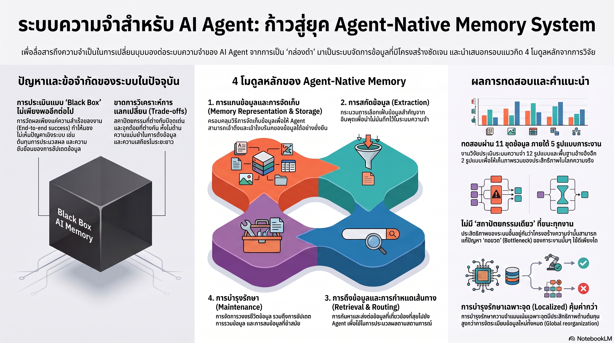

[กลับไปที่หน้าหลัก](../README.md)

สวัสดีครับเพื่อนๆ ที่ติดตามวงการ AI! ถ้าบทความที่แล้วเราคุยเรื่อง Memory Engineering ในเชิงกลยุทธ์องค์กร วันนี้มาลงลึกในระดับระบบครับ งานวิจัย "Are We Ready For An Agent-Native Memory System?" ทดสอบ Memory Architecture 12 รูปแบบ ใต้ Workload 5 ประเภท บน Dataset 11 ชุดครับ คำตอบที่ได้? ไม่มีสถาปัตยกรรมไหนชนะทุกกรณีเลยครับ และ Localized Maintenance ประหยัดกว่า Global Reorganization อย่างมหาศาลครับ

คุณเคยสังเกตไหมครับว่า เวลา AI Agent ทำงานนาน หรือต้องจัดการ Context ซับซ้อน มัน "หลงลืม" บริบทสำคัญแบบที่ไม่มีคำเตือนล่วงหน้าเลยครับ ไม่ใช่ค่อยๆ เลือน แต่พังทันที ครับ และที่น่าหนักใจกว่าคือ F1 Score หรือ BLEU Score ที่เราใช้วัดไม่บอกเลยว่า Memory กำลังจะพังตรงจุดไหนครับ?

คุณรู้ไหมครับว่า ปัญหาหลักของ Memory ระบบปัจจุบันไม่ใช่การดึงข้อมูลไม่เจอครับ แต่เป็น "กล่องดำ" (Monolithic Black Box) ครับ — เราวัดแค่ผลลัพธ์ปลายทาง แต่ไม่รู้เลยว่าคอขวดอยู่ที่โมดูลไหน ข้อมูลที่เก็บไว้ยังสะท้อนความหมายเดิมอยู่ไหม และระบบจะรับมือ Knowledge Update ต่อเนื่องได้นานแค่ไหนครับ?

และคุณเคยนึกไหมครับว่า Memory ที่ดีไม่ใช่แค่การ Retrieve ให้เร็วครับ แต่คือระบบจัดการข้อมูลครบวงจรที่ต้องบริหาร Lifecycle ตั้งแต่ Storage → Extraction → Retrieval/Routing → Maintenance ครับ และแต่ละโมดูลมี Bottleneck ที่แตกต่างกันตาม Workload — การเลือกสถาปัตยกรรมผิดโมดูลเดียวทำให้ทั้งระบบพังได้ครับ?

งานวิจัยนี้กำลังบอกว่า: "เราไม่ได้แพ้เพราะ LLM ไม่ฉลาดพอครับ แต่เพราะเราออกแบบ Memory ให้เป็น Feature ของระบบ แทนที่จะออกแบบให้มันเป็น First-class Citizen ที่มี Architecture และ Lifecycle ของตัวเองครับ"

========================================

🤔 ทบทวนความเชื่อเดิมๆ: สิ่งที่เราคิดเกี่ยวกับ Memory ใน AI Agent

▪ "RAG แก้ปัญหา Memory ของ AI ได้แล้ว — ใส่ข้อมูลใน Vector Database แล้ว Retrieve คือเพียงพอสำหรับงานส่วนใหญ่" → RAG คือ Retrieval Mechanism ครับ ไม่ใช่ Memory System ครับ มันแก้ได้แค่ "หาให้เจอ" แต่ไม่ได้แก้เรื่อง Persistence, Update, Consolidation หรือ Lifecycle Governance ครับ เหมือนมีห้องสมุดแต่ไม่มีบรรณารักษ์ที่รู้ว่าหนังสือเล่มไหนล้าสมัยและควรเอาออกครับ

▪ "F1 หรือ BLEU Score ที่สูงบอกได้ว่าระบบ Memory ดีพอสำหรับ Production" → ตัวเลขปลายทางเหล่านี้ไม่บอกอะไรเลยเกี่ยวกับ Representation Fidelity (ข้อมูลที่เก็บไว้ยังสะท้อนความหมายเดิมอยู่ไหม), Long-horizon Stability (ระบบจะรักษาความต่อเนื่องได้นานแค่ไหน) หรือ Robustness ต่อ Continuous Knowledge Update ครับ ระบบที่ได้ F1 สูงในการทดสอบอาจพังในสัปดาห์ที่สามของ Production ก็ได้ครับ

▪ "สถาปัตยกรรม Memory ที่ดีที่สุด (เช่น Graph-based หรือ Hierarchical) ควรใช้กับทุก Use Case" → งานวิจัยทดสอบ 12 สถาปัตยกรรมใน 5 Workload ประเภท ผลคือไม่มีตัวไหนชนะทุกกรณีครับ สถาปัตยกรรมที่ดีที่สุดสำหรับงานที่ต้องการ Response ที่เร็วแตกต่างจากสถาปัตยกรรมที่เหมาะกับงานที่ต้องสะสมความรู้ระยะยาวครับ การยึดติดกับสถาปัตยกรรมเดียวคือต้นทุนที่ซ่อนอยู่ครับ

▪ "เมื่อ Knowledge ล้าสมัย การ Rebuild Memory ใหม่ทั้งหมดเป็นวิธีที่ปลอดภัยและมั่นใจได้มากกว่า" → Global Reorganization มีค่าใช้จ่ายด้าน API สูงมาก และก่อให้เกิด Downtime ครับ Localized Maintenance ที่แก้เฉพาะจุดที่เปลี่ยนนั้นมีประสิทธิภาพสูงกว่า ประหยัดกว่า และรักษา Continuity ของระบบได้ครับ เหมือนการซ่อมถนนเฉพาะหลุมแทนการ Repave ทั้งสายครับ

ความจริงที่น่าคิดคือ: "เราไม่ได้ต้องการ AI ที่ฉลาดขึ้นครับ เราต้องการ AI ที่จำได้อย่างเป็นระบบมากขึ้นครับ"

========================================

🧠 พื้นฐานที่ต้องเข้าใจก่อน: Memory ในฐานะ Data Management System, 4 โมดูลหลัก, Black Box Problem, และ Localized vs. Global Maintenance

=== จาก Retrieval สู่ Data Management System ===

วิวัฒนาการของ Memory ใน AI Agent แบ่งได้ชัดสองยุคครับ

ยุคแรกคือ Memory ในฐานะ Retrieval Mechanism ครับ หน้าที่หลักคือ "หาข้อมูลที่เกี่ยวข้องให้เจอ" ครับ RAG เป็นตัวแทนของยุคนี้ครับ ถามมาค้นหาตอบไปครับ ไม่มีการจัดการ Lifecycle ของข้อมูลครับ

ยุคที่สองคือ Memory ในฐานะ Data Management System ครับ งานวิจัยนิยามว่า Memory ในยุคนี้ต้องรองรับ Persistent Information Storage (เก็บอยู่ถาวร ไม่หายเมื่อ Session จบ), Dynamic Update (อัปเดตได้เมื่อความรู้ใหม่มาแทนที่ของเก่า), Consolidation (รวมข้อมูลจากหลาย Source ให้สอดคล้องกัน) และ Dynamic Lifecycle Governance (ตัดสินใจได้ว่าข้อมูลชิ้นไหนควรเก็บ ควรอัปเดต หรือควรลบทิ้งครับ)

ความแตกต่างสำคัญที่สุดคือคำว่า Persistence ครับ ข้อมูลใน Memory ต้องไม่ใช่แค่สิ่งที่ถูกเรียกมาใช้แล้วหายไปครับ แต่ต้องสะสมและจัดการตลอด Lifecycle ของ Agent ครับ

=== Black Box Problem: ทำไมการเปิดกล่องจึงจำเป็น ===

ปัญหาที่ซ่อนอยู่ในวงการ AI Evaluation ครับ เราวัดผลของ Memory System ด้วยตัวเลข End-task ครับ AI ตอบถูกไหม? Score เท่าไหร่? แต่ตัวเลขเหล่านี้ไม่บอกอะไรเกี่ยวกับ Health ของ Memory System เลยครับ

Representation Fidelity ครับ — ข้อมูลที่ถูก Encode และเก็บไว้ยังสะท้อนความหมายเดิมได้ถูกต้องหรือไม่ครับ? ถ้า Embedding Model แปลง Nuance ทางความหมายผิดตั้งแต่แรก ทุก Query ที่ตามมาก็ได้ข้อมูลที่บิดเบือนครับ

Long-horizon Stability ครับ — ระบบรักษาความต่อเนื่องของข้อมูลได้นานแค่ไหนครับ? Memory ที่ทำงานดีใน Week 1 อาจ Degrade ใน Month 3 เมื่อข้อมูลสะสมจน Structure เริ่มขัดแย้งกันเองครับ

Operational Cost ครับ — ต้นทุนจริงของการรักษา Memory ไว้ Up-to-date คือเท่าไหร่ครับ? และระบบรับมือกับ Continuous Knowledge Update ได้ดีแค่ไหนโดยไม่ Degrade ครับ?

การ "เปิดกล่อง" เพื่อวิเคราะห์ทีละโมดูลคือหนทางเดียวที่จะรู้ว่า Bottleneck ที่แท้จริงอยู่ที่ไหนครับ

=== 4 โมดูลหลักของ Agent-Native Memory ===

งานวิจัยแบ่ง Memory Architecture ออกเป็น 4 โมดูลที่ต้องทำงานสอดประสานกัน โดยแต่ละโมดูลมี Bottleneck และ Trade-off ที่ต่างกันครับ

Representation and Storage ครับ คือการแปลงข้อมูลดิบให้อยู่ในรูปแบบที่ Agent ประมวลผลได้ครับ ทั้งการเลือก Encoding Method (Dense Vector, Sparse, Graph-based) และการออกแบบโครงสร้างจัดเก็บถาวรครับ ปัญหาที่พบบ่อยคือ Encoding ที่สูญเสีย Nuance สำคัญ หรือ Storage Structure ที่ไม่ Scale ได้เมื่อข้อมูลเพิ่มขึ้นครับ

Extraction ครับ คือการคัดกรอง Key Insights ออกจากข้อมูลดิบจำนวนมหาศาลก่อนจะเก็บเข้า Memory ครับ ถ้า Extraction ไม่ดีพอ Memory จะเต็มด้วยข้อมูลที่ไม่เกี่ยวข้อง ทำให้ Retrieval ช้าและ Noisy ครับ

Retrieval and Routing ครับ ไม่ใช่แค่การค้นหาให้เจอครับ แต่คือการส่งข้อมูลที่ถูกต้องไปยัง Reasoning Process ที่เหมาะสมของ Agent ในเวลาที่เหมาะสมครับ งานที่ต้องการ Speed กับงานที่ต้องการ Recall Depth สูงใช้ Routing Strategy ที่ต่างกันครับ

Maintenance ครับ คือโมดูลที่ถูกมองข้ามมากที่สุดแต่สำคัญที่สุดในระยะยาวครับ ครอบคลุมการอัปเดตข้อมูลที่ล้าสมัย การจัดการ Conflicting Knowledge ที่เข้ามาใหม่ และการปรับ Memory Structure ให้ยังคง Efficient เมื่อข้อมูลสะสมมากขึ้นครับ

=== ไม่มีสถาปัตยกรรมหนึ่งเดียวที่ชนะทุกกรณี ===

ผลการทดสอบ 12 สถาปัตยกรรม ใน 5 Workload ประเภท บน 11 Dataset นี้คือ Counter-intuitive finding ที่สำคัญที่สุดครับ

ไม่มีสถาปัตยกรรมใดได้คะแนนสูงสุดในทุก Workload ครับ สถาปัตยกรรมที่ดีที่สุดสำหรับงาน High-speed Response Task แพ้ใน Long-term Knowledge Accumulation Task ครับ สถาปัตยกรรมที่ดีใน Knowledge Consolidation อ่อนแอใน Adversarial Update (ข้อมูลใหม่ที่ขัดแย้งกับข้อมูลเดิมครับ)

นัยสำคัญคือ Memory Architecture ต้อง Align กับ Workload Bottleneck ที่ระบบจะเผชิญจริงๆ ครับ ไม่ใช่เลือกจากชื่อเสียงหรือจาก Benchmark ทั่วไปครับ การประเมิน Workload Profile ของตัวเองก่อนเลือก Architecture คือขั้นตอนที่ขาดไม่ได้ครับ

=== Localized Maintenance vs. Global Reorganization ===

เมื่อ Knowledge เปลี่ยน (และมันเปลี่ยนตลอดครับ) การจัดการ Memory มีสองทางเลือกครับ

Global Reorganization คือการ Rebuild Memory Structure ทั้งหมดใหม่ครับ ปลอดภัยในแง่ที่ว่าได้ Clean Slate แต่มีต้นทุนสูงมากครับ ทั้ง API Cost ของการ Re-embed ข้อมูลทั้งหมด, Downtime ระหว่าง Reorganization, และการสูญเสีย Context ที่สะสมมาครับ

Localized Maintenance คือการแก้เฉพาะจุดที่เปลี่ยนแปลงครับ Update เฉพาะ Entry ที่ล้าสมัย, เพิ่มเฉพาะ Node ใหม่ที่จำเป็น, และ Resolve Conflict เฉพาะตรงที่ขัดแย้งครับ

งานวิจัยพบว่า Localized Maintenance มีประสิทธิภาพสูงกว่า ประหยัดกว่า และรักษา Long-horizon Stability ได้ดีกว่าอย่างมีนัยสำคัญครับ เหมือนการที่แพทย์รักษาเฉพาะอาการที่เจ็บแทนที่จะทำ Full Body Reboot ทุกครั้งที่คนไข้มีไข้ครับ

สำหรับองค์กรที่ Scale Memory System ในระดับ Production Localized Maintenance ไม่ใช่แค่ประหยัดกว่าครับ มันคือ Prerequisite สำหรับระบบที่จะทำงานได้ต่อเนื่องโดยไม่มี Downtime ครับ

========================================

🎯 ประเด็นที่ควรคิดต่อ

— "No Single Winner" ใน Memory Architecture นัยว่า Memory Stack จะ Fragment ก่อน Consolidate ครับ: เหมือนที่ Database World มี PostgreSQL, Redis, Cassandra ที่ต่างเก่งคนละอย่าง Memory Architecture ของ AI Agent จะไปทางเดียวกันครับ ไม่มี One-size-fits-all ครับ องค์กรที่สร้าง Abstraction Layer ที่สลับ Memory Architecture ตาม Workload ได้โดยไม่ต้อง Rewrite Application จะได้เปรียบมากในระยะยาวครับ

— Lifecycle Governance คือ Gap ที่ยังไม่มีใครแก้ได้ดีพอครับ: วิธีที่ดีที่สุดในการตัดสินว่าข้อมูลชิ้นไหน "ล้าสมัย" ในบริบทของ AI Agent ยังไม่มี Standard ที่ชัดเจนครับ มนุษย์ใช้ Salience (ความสำคัญ) และ Recency ในการตัดสินใจลืม ครับ แต่ AI ยังขาด Mechanism ที่ "รู้" ว่าควรลืมอะไรโดยไม่ต้องให้มนุษย์มาบอกครับ — และนั่นอาจเป็น Research Gap ที่ใหญ่ที่สุดในวงการ Memory Engineering ขณะนี้ครับ

— Localized Maintenance เป็น Engineering Principle ที่ใช้ได้ไกลกว่า AI Memory ครับ: หลักการ "แก้เฉพาะจุดที่เปลี่ยน ไม่ต้อง Rebuild ทั้งหมด" คือหัวใจของ Incremental Compilation ในภาษาโปรแกรม, Git Diff, และ Delta Update ใน Database ครับ การที่งานวิจัย Memory พิสูจน์ว่า Principle นี้ได้ผลใน AI Memory ด้วย บอกว่า Software Engineering มีบทเรียนที่ AI Research ยังเรียนได้อีกมากครับ — และในทางกลับกัน สิ่งที่ AI Memory Research ค้นพบอาจ Inform วิธีที่เราออกแบบ Distributed System ในอนาคตครับ

#AgentMemory #MemoryEngineering #AgentNativeMemory #LLMMemory #RAG #AIAgent #VectorDatabase #LocalizedMaintenance #LifecycleGovernance #AIResearch #DataManagement #MemoryArchitecture #AIProduction #KnowledgeGraph #LongHorizonAI
