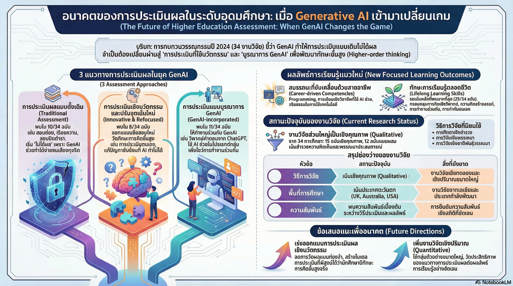

[กลับไปที่หน้าหลัก](../README.md)

สวัสดีครับเพื่อนๆ! วันนี้เรามาคุยเรื่องที่เกี่ยวข้องกับทุกคนที่เกี่ยวข้องกับการศึกษากันครับ นั่นก็คือ "AI กับการสอบในมหาวิทยาลัย"!

คุณเคยคิดไหมครับว่า เมื่อนักศึกษาสามารถใช้ ChatGPT เขียนเรียงความได้ในพริบตา หรือใช้ Sora สร้างวิดีโอโปรเจกต์สุดล้ำได้ในไม่กี่นาที แล้วการสอบแบบเดิมๆ จะยังใช้ได้อีกไหม?

นี่ไม่ใช่ฉากในหนังไซไฟ แต่คือความจริงที่กำลังเกิดขึ้นแล้วตอนนี้! และมันกำลังสร้างการสั่นสะเทือนครั้งใหญ่ (Seismic Shift) ต่อระบบการสอบที่เราใช้กันมานานหลายทศวรรษ

งานวิจัยล่าสุดปี 2024 เรื่อง "Assessment and learning outcomes for generative AI in higher education" ได้วิเคราะห์งานวิจัย 34 ฉบับทั่วโลก เพื่อหา "ทางรอด" ของการประเมินผลในยุคที่เราไม่ได้เดินอยู่บนแผ่นเปลือกโลกเดิมอีกต่อไป

วันนี้เรามาดู 4 บทเรียนสำคัญจากงานวิจัยนี้กันครับ!

========================================

🤔 ทบทวนปัญหาเดิมๆ: ทำไมการสอบแบบเดิมใช้ไม่ได้แล้ว?

ก่อนที่เราจะไปดูบทเรียนจากงานวิจัย มาทำความเข้าใจปัญหาก่อนนะครับ

=== การสอบแบบเดิมเป็นยังไง? ===

[การสอบแบบดั้งเดิม]

ลักษณะ:
▸ เน้นความจำ: ท่องจำข้อมูลในตำรา
▸ ข้อสอบปรนัย: เลือก A, B, C, D
▸ เรียงความ: เขียนตามโจทย์ที่กำหนด
▸ การบ้าน: ทำที่บ้าน ส่งในวันรุ่งขึ้น

=== ปัญหาในยุค AI ===

เมื่อมี AI เข้ามา:

[ข้อสอบที่เน้นความจำ]
▸ นักศึกษาถาม ChatGPT → ได้คำตอบทันที
▸ AI จำได้ดีกว่ามนุษย์มาก
▸ สอบแบบนี้วัดอะไร?

[เรียงความที่ทำที่บ้าน]
▸ นักศึกษาสั่ง ChatGPT เขียนให้
▸ ได้เรียงความที่ดีในไม่กี่วินาที
▸ ไม่รู้ว่าเป็นของนักศึกษาหรือของ AI

[โปรเจกต์วิดีโอ]
▸ ใช้ Sora สร้างวิดีโอได้ในไม่กี่นาที
▸ ไม่ต้องถ่าย ไม่ต้องตัดต่อ
▸ ประเมินยังไง?

=== ตัวอย่างจริง ===

สมมติมีข้อสอบ: "อธิบายสาเหตุของสงครามโลกครั้งที่ 1"

[ก่อนมี AI]
▸ นักศึกษาต้องอ่านตำรา ท่องจำ เข้าใจ
▸ เขียนคำตอบด้วยตัวเอง
▸ วัดได้ว่านักศึกษารู้จริงหรือเปล่า

[หลังมี AI]
▸ นักศึกษาถาม ChatGPT
▸ ได้คำตอบที่ดีทันที
▸ Copy-Paste ส่ง
▸ ไม่รู้ว่านักศึกษาเข้าใจจริงไหม

นี่คือปัญหาใหญ่ที่การศึกษาต้องเผชิญ!

========================================

1. 🚫 "กับดักความซื่อสัตย์" และจุดจบของการสอบแบบเดิม

บทเรียนแรกคือ การสอบแบบเดิมไม่ได้ผลแล้วจริงๆ ครับ!

=== Mismatch: ความไม่สอดคล้องกัน ===

ปัญหาคือ "Mismatch" หรือความไม่สอดคล้องกันระหว่าง:
▸ นวัตกรรมการเรียนรู้ที่ก้าวล้ำ (มี AI ช่วย)
▸ วิธีการประเมินที่ล้าหลัง (ยังสอบแบบเดิม)

=== Integrity Trap: กับดักความซื่อสัตย์ ===

เมื่อเรายังดึงดันใช้ข้อสอบที่วัดผลจากการ "ท่องจำ" หรือ "เขียนตามแพทเทิร์น" เรากำลังติดอยู่ใน "กับดักความซื่อสัตย์" (Integrity Trap)!

ทำไมเรียกว่ากับดัก?

[เราทดสอบในสิ่งที่ AI ทำได้ดีกว่ามนุษย์]
▸ ความจำ: AI จำได้เยอะกว่า แม่นกว่า
▸ การเขียนตามรูปแบบ: AI เขียนได้เร็วกว่า ดีกว่า
▸ การค้นหาข้อมูล: AI หาได้เร็วกว่ามาก

ผลลัพธ์:
▸ เราแยกแยะไม่ได้ว่างานมาจากสมองนักศึกษาหรือจาก AI
▸ การสอบแบบนี้ไม่ได้วัดความรู้จริง
▸ ขัดขวางการพัฒนาศักยภาพที่แท้จริงของนักศึกษา

"Traditional assessment methods in higher education do not operate effectively in the GenAI era."

เปรียบเทียย:

การสอบแบบเดิม = การแข่งขันกับ AI ในสิ่งที่ AI เก่งกว่า
▸ เหมือนแข่งวิ่งกับรถยนต์
▸ มนุษย์แพ้แน่นอน

ที่ถูกต้อง = การสอบในสิ่งที่มนุษย์เก่งกว่า AI
▸ แข่งในสิ่งที่มนุษย์มีข้อได้เปรียบ
▸ ความคิดสร้างสรรค์, การคิดเชิงวิพากษ์, จริยธรรม

========================================

2. 🎯 ทักษะแห่งอนาคตที่ AI แย่งไปไม่ได้

บทเรียนที่สองคือ เราต้องเปลี่ยนเป้าหมายการเรียนรู้!

=== จากความรู้ในตำราสู่สมรรถนะจริง ===

งานวิจัยระบุว่าเป้าหมายการเรียนรู้กำลังเปลี่ยนจาก:
▸ "ความรู้ในตำรา" (ท่องจำ)
▸ ไปสู่ "สมรรถนะที่ขับเคลื่อนด้วยอาชีพและทักษะตลอดชีวิต"

มี 3 เสาหลักสำคัญ:

=== เสาที่ 1: Career-driven Competencies (สมรรถนะที่ขับเคลื่อนด้วยอาชีพ) ===

[1.1 Coding & AI Collaboration]

ไม่ใช่แค่เขียนโค้ด แต่เป็น:
▸ การใช้ GenAI ช่วยตรวจสอบ Bug
▸ การทำความเข้าใจอัลกอริทึมที่ซับซ้อนด้วยความช่วยเหลือของ AI
▸ การทำงานร่วมกับ AI เป็นทีม

ตัวอย่าง:
▸ นักศึกษาเขียนโค้ด
▸ ใช้ AI ตรวจสอบว่ามี Bug ไหม
▸ ถ้ามี AI จะชี้จุดที่ผิด
▸ นักศึกษาเข้าใจและแก้ไข

[1.2 Strategic Writing]

ไม่ใช่แค่เขียนได้ แต่เป็น:
▸ การสื่อสารที่เน้นประสิทธิภาพ
▸ ใช้ AI เป็นผู้ช่วยขัดเกลาโครงสร้างและไวยากรณ์
▸ มนุษย์คิด AI ช่วยขัดเกลา

ตัวอย่าง:
▸ นักศึกษาเขียน Draft แรก
▸ ใช้ AI ตรวจไวยากรณ์ แก้โครงสร้างประโยค
▸ นักศึกษาปรับปรุงเนื้อหาให้ดีขึ้น

[1.3 Ethics & Social Responsibility] ← สำคัญมาก!

นี่คือจุดสำคัญที่ห้ามมองข้าม!

ต้องเรียนรู้:
▸ การเข้าใจมิติด้านจริยธรรม
▸ ความรับผิดชอบต่อสังคม
▸ การตระหนักถึงอคติของ AI
▸ การใช้งานเทคโนโลยีอย่างมีวิจารณญาณ

ตัวอย่างปัญหา:
▸ AI ให้คำตอบที่มีอคติเรื่องเพศ
▸ AI แนะนำสิ่งที่ผิดกฎหมาย
▸ AI สร้าง Fake News

นักศึกษาต้องรู้จัก:
▸ ตรวจสอบคำตอบของ AI
▸ ไม่เชื่อ AI ทุกอย่าง
▸ ใช้ AI อย่างมีจริยธรรม

=== เสาที่ 2: Lifelong Learning Skills (ทักษะการเรียนรู้ตลอดชีวิต) ===

[2.1 Higher-order Thinking]

การคิดขั้นสูง ประกอบด้วย:

Creativity (ความคิดสร้างสรรค์):
▸ คิดแบบใหม่ๆ ที่ AI ไม่เคยคิด
▸ สร้างสิ่งที่ไม่เหมือนใคร
▸ คิดนอกกรอบ

Critical Thinking (การคิดเชิงวิพากษ์):
▸ วิเคราะห์ข้อมูลที่ AI สร้างขึ้น
▸ ประเมินว่าถูกต้องหรือไม่
▸ หาจุดอ่อนและจุดแข็ง

=== เสาที่ 3: ความรับผิดชอบเชิงจริยธรรม ===

ในยุคที่ความรู้อยู่แค่ปลายนิ้ว:
▸ ทักษะการคัดกรอง → สำคัญมาก!
▸ ความรับผิดชอบเชิงจริยธรรม → คืออาวุธที่ทำให้มนุษย์เหนือกว่าเครื่องจักร!

สรุป: AI แย่งความรู้จากมนุษย์ไปได้ แต่แย่งทักษะเหล่านี้ไปไม่ได้!

========================================

3. 🔄 พลิกกลยุทธ์การประเมิน: เปลี่ยน AI จาก "คู่แข่ง" เป็น "คู่คิด"

บทเรียนที่สามคือ เราต้องเปลี่ยนวิธีการสอบ!

งานวิจัยแบ่งแนวทางการประเมินใหม่ออกเป็น 2 รูปแบบ ต้องใช้ควบคู่กัน:

=== รูปแบบที่ 1: Refocused Assessment (การประเมินแบบเน้นสมรรถนะใหม่) ===

คือการออกแบบโจทย์ที่เน้นทักษะมนุษย์ล้วนๆ โดยอาจไม่เกี่ยวข้องกับ AI โดยตรง

ตัวอย่าง:

[Self-assessment (การประเมินตนเอง)]
▸ ให้นักศึกษาประเมินตัวเองว่าเรียนรู้อะไรบ้าง
▸ สิ่งไหนเข้าใจ สิ่งไหนยังไม่เข้าใจ
▸ จะพัฒนาตัวเองอย่างไรต่อไป

[Personalized Tasks (โจทย์ที่เฉพาะตัว)]
▸ โจทย์ที่ต้องใช้บริบทของนักศึกษาเอง
▸ เช่น "วิเคราะห์ปัญหาในชุมชนของคุณและเสนอแนวทางแก้ไข"
▸ AI ไม่รู้บริบทชุมชนของนักศึกษา

[Generic Skills (ทักษะทั่วไป)]
▸ การแก้ปัญหาเฉพาะหน้า
▸ การทำงานเป็นทีม
▸ การนำเสนอหน้าชั้น

=== รูปแบบที่ 2: GenAI-incorporated Assessment (การประเมินแบบผนวก AI) ===

คือการให้นักศึกษาทำงาน "ร่วมกับ" AI อย่างเป็นระบบ

ตัวอย่าง:

[Critique the Bot (วิจารณ์ AI)]
▸ ให้ ChatGPT ตอบคำถาม
▸ ให้นักศึกษาวิจารณ์คำตอบ
▸ หาจุดบกพร่อง จุดที่ผิด หรือการ "Hallucinate" (หลอน)
▸ แก้ไขให้ถูกต้องด้วยการสืบค้นข้อมูลจริง

[Process-based Assessment (ประเมินจากกระบวนการ)]
▸ ให้ทำโปรเจกต์กลุ่ม
▸ ต้องรายงานกระบวนการใช้ AI ในแต่ละขั้นตอน
▸ เช่น ใช้ AI ช่วยอะไรบ้าง ตอนไหน ได้ผลอย่างไร

=== Action Plan สำหรับผู้สอน ===

แทนที่จะ:
❌ สั่งเรียงความแล้วส่ง

ลองทำแบบนี้:
✅ "Critique the Bot"

วิธีการ:
▸ ให้นักศึกษาถาม ChatGPT เขียนเรียงความ
▸ นักศึกษาต้องวิจารณ์คำตอบ หาข้อผิดพลาด
▸ แก้ไขให้ถูกต้องด้วยข้อมูลจริง

การให้คะแนน:
▸ 50% จากการหาจุดบกพร่องของ AI
▸ 50% จากการแก้ไขให้ถูกต้อง

ทำไมดีกว่า?
▸ ฝึกการคิดเชิงวิพากษ์
▸ ฝึกการตรวจสอบข้อมูล
▸ ไม่สามารถ Copy-Paste จาก AI ได้

---

แทนที่จะ:
❌ ให้คะแนนแค่ผลงานชิ้นสุดท้าย

ลองทำแบบนี้:
✅ ประเมินจาก "กระบวนการ"

วิธีการ:
▸ ให้ส่ง Version History (ประวัติการแก้ไข)
▸ ให้เขียน Reflection (การสะท้อนคิด) ว่า AI ช่วยอย่างไร

ตัวอย่าง Reflection:
"ฉันใช้ ChatGPT ช่วยเขียน Draft แรก แต่พบว่ามันไม่ได้ใช้ข้อมูลล่าสุด ฉันจึงไปค้นหาข้อมูลใหม่และเพิ่มเข้าไปเอง ในรอบที่สอง ฉันใช้ AI ช่วยตรวจไวยากรณ์..."

ประโยชน์:
▸ เห็นกระบวนการคิด
▸ รู้ว่านักศึกษาใช้ AI อย่างไร
▸ วัดความเข้าใจจริง

========================================

4. ⚠️ ความจริงที่น่าตกใจ: เราเพิ่งเริ่มต้นเท่านั้น

บทเรียนสุดท้ายคือ การเตือนให้เรา "รอบคอบ"!

=== เราอยู่ในช่วง "Infancy Phase" ===

แม้ GenAI จะดูเหมือนเข้ายึดโลกการศึกษาไปแล้ว แต่ความจริงคือ:
▸ งานวิจัยส่วนใหญ่ยังอยู่ในช่วงเริ่มต้น
▸ เป็นเชิงคุณภาพ (Qualitative) แบบสำรวจเบื้องต้น
▸ ยังไม่มีข้อมูลเชิงประจักษ์ในวงกว้าง

=== ระเบียบวิธีวิจัยใหม่ๆ ===

มีการนำระเบียบวิธีวิจัยใหม่ๆ มาใช้:

[Thing Ethnography]
▸ ศึกษาปฏิสัมพันธ์ระหว่างมนุษย์กับเครื่องจักร
▸ มองว่า AI เป็น "สิ่ง" ที่มีบทบาทในสังคม

[Post-phenomenological Approaches]
▸ ทำความเข้าใจว่า AI เข้ามา "คั่นกลาง" (Mediating) ระหว่างครูกับศิษย์อย่างไร
▸ AI เปลี่ยนแปลงความสัมพันธ์ครู-ศิษย์ยังไง

=== สิ่งที่เรายังขาด ===

ประเด็นสำคัญ:
▸ โลกยังขาดหลักฐานเชิงประจักษ์ในวงกว้าง (Quantitative Evidence)
▸ ไม่มีข้อพิสูจน์ว่าวิธีประเมินใหม่ๆ มีประสิทธิภาพสูงสุดจริงหรือไม่

ดังนั้น:
▸ นักการศึกษาต้องทดลองด้วยความระมัดระวัง
▸ พร้อมปรับตัวตามข้อมูลใหม่
▸ ไม่ควรเชื่อว่าวิธีไหนดีที่สุดแล้ว

เปรียบเทียย:
▸ เหมือนเราเพิ่งเริ่มสำรวจโลกใหม่
▸ รู้ว่ามีแผ่นดินใหม่ แต่ยังไม่รู้ว่าอะไรอยู่ตรงไหน
▸ ต้องสำรวจไปทีละก้าว ระมัดระวัง

========================================

สรุป: จากผู้ตอบคำถาม สู่ผู้ตั้งคำถามที่ทรงพลัง

หลังจากที่เราได้เห็นบทเรียนทั้ง 4 ข้อแล้ว มาสรุปกันครับ

=== สิ่งที่เราได้เรียนรู้ ===

[1] การสอบแบบเดิมล้มเหลวแล้ว
▸ ติดอยู่ใน "กับดักความซื่อสัตย์"
▸ วัดในสิ่งที่ AI ทำได้ดีกว่ามนุษย์
▸ ต้องเปลี่ยนวิธีการประเมิน

[2] ทักษะแห่งอนาคตที่ AI แย่งไม่ได้
▸ Career-driven Competencies (สมรรถนะที่ขับเคลื่อนด้วยอาชีพ)
▸ Lifelong Learning Skills (ทักษะการเรียนรู้ตลอดชีวิต)
▸ ความรับผิดชอบเชิงจริยธรรม

[3] พลิกกลยุทธ์การประเมิน
▸ Refocused Assessment (เน้นสมรรถนะใหม่)
▸ GenAI-incorporated Assessment (ทำงานร่วมกับ AI)
▸ เปลี่ยน AI จาก "คู่แข่ง" เป็น "คู่คิด"

[4] เราเพิ่งเริ่มต้น
▸ งานวิจัยยังอยู่ในช่วงเริ่มต้น
▸ ยังขาดหลักฐานเชิงประจักษ์
▸ ต้องทดลองอย่างระมัดระวัง

=== การเปลี่ยนแปลงที่แท้จริง ===

การเปลี่ยนแปลงที่เกิดขึ้นไม่ใช่แค่เรื่องของเทคโนโลยี แต่เป็นการ "จินตนาการใหม่" (Re-imagining) ต่อการศึกษาทั้งหมด!

เป้าหมายสุดท้ายไม่ใช่:
❌ เพื่อหยุดการโกง

แต่คือ:
✅ การสร้าง "Synergy" หรือการผนึกกำลังกันระหว่างความก้าวหน้าของเทคโนโลยีกับหลักการศึกษาที่ยั่งยืน

=== การเปลี่ยนบทบาทของนักศึกษา ===

เรากำลังเปลี่ยนผ่านจาก:
▸ นักศึกษาที่ "รู้วิธีตอบ"
▸ ไปสู่ นักศึกษาที่ "รู้วิธีตั้งคำถาม"

ทำไมถึงสำคัญ?

[ในโลกเดิม]
▸ ความรู้มีค่า
▸ คนที่รู้คำตอบเก่ง
▸ ครูถามคำถาม นักเรียนตอบ

[ในโลกใหม่]
▸ ความรู้อยู่ทุกที่ (แค่ Google)
▸ คนที่ตั้งคำถามดีเก่ง
▸ การตั้งคำถามที่ถูกต้องสำคัญกว่าการตอบ

ตัวอย่าง:

คำถามที่ไม่ดี:
▸ "สงครามโลกครั้งที่ 1 เกิดเมื่อไหร่?"
▸ ถาม Google ได้คำตอบทันที

คำถามที่ดี:
▸ "ถ้าสงครามโลกครั้งที่ 1 ไม่เกิดขึ้น โลกวันนี้จะเป็นยังไง?"
▸ ต้องคิด วิเคราะห์ สร้างสรรค์
▸ AI ช่วยได้ แต่ต้องใช้ทักษะมนุษย์จริงๆ

=== คำถามท้ายทาย ===

ในโลกที่ AI สามารถตอบคำถามได้เกือบทุกอย่างในพริบตา:

▸ เราในฐานะนักการศึกษา ได้สร้างพื้นที่ให้นักศึกษาได้เรียนรู้วิธีการ "ตั้งคำถามที่ถูกต้องและมีคุณค่า" แล้วหรือยัง?
▸ เรากำลังสอนนักศึกษาให้เป็น "ผู้ตอบคำถาม" หรือ "ผู้ตั้งคำถาม"?
▸ ระบบการศึกษาของเราพร้อมสำหรับการเปลี่ยนแปลงครั้งใหญ่นี้หรือยัง?

=== ข้อเสนอแนะสำหรับผู้สอน ===

ถ้าคุณเป็นครู อาจารย์ หรือผู้สอน:

[1] หยุดสอบแบบเน้นความจำ
▸ เปลี่ยนไปสอบทักษะที่ AI ทำไม่ได้

[2] ให้นักศึกษาใช้ AI
▸ แต่ต้องรู้จักใช้อย่างมีวิจารณญาณ
▸ วิจารณ์ผลลัพธ์ที่ AI ให้

[3] ประเมินจากกระบวนการ
▸ ไม่ใช่แค่ผลงานชิ้นสุดท้าย
▸ ต้องเห็นกระบวนการคิด

[4] สอนจริยธรรม
▸ การใช้ AI อย่างมีความรับผิดชอบ
▸ ตระหนักถึงอคติและข้อจำกัดของ AI

========================================

อ้างอิง:
• Assessment and learning outcomes for generative AI in higher education (2024)
• Scoping Review of 34 research papers
• GenAI in Education Research

หวังว่าบทความนี้จะช่วยให้ทุกคนเห็นว่า การศึกษากำลังเปลี่ยนแปลงอย่างมาก และเราต้องเตรียมพร้อมสำหรับการเปลี่ยนแปลงนี้!

ถ้ามีความคิดเห็นหรือประสบการณ์จากการสอนในยุค AI มาแชร์กันได้เลยนะครับ 😊
