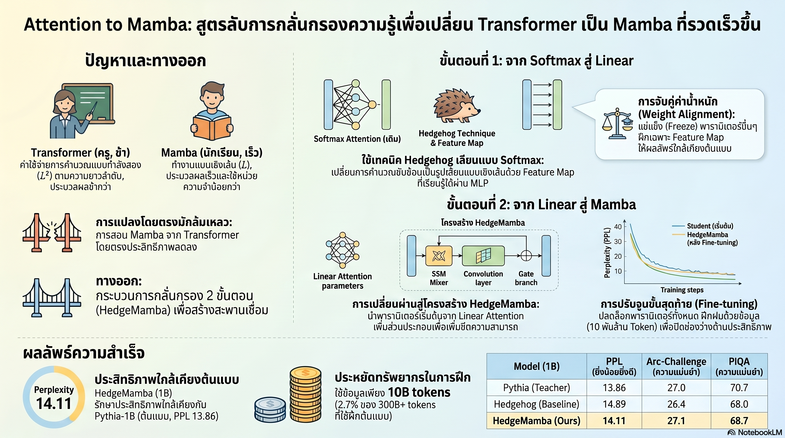

[กลับไปที่หน้าหลัก](../README.md)

สวัสดีครับเพื่อนๆ ที่ติดตามวงการ AI! วันนี้มาเรื่องที่ท้าทายคำถามพื้นฐานที่สุดในการพัฒนา LLM: "จะทำให้ AI ฉลาดขึ้นโดยไม่จ่ายค่าประมวลผลที่แพงขึ้นเป็นทวีคูณได้ไหม?" จากงานวิจัย "Attention to Mamba" ของ Apple, MILA และ Flat Iron Institute ที่สร้างสะพานถ่ายโอนความฉลาดจาก Transformer สู่ Mamba โดยใช้ทรัพยากรเพียง 2.7% ของการฝึกตั้งแต่ต้นครับ

คุณเคยสงสัยไหมครับว่า เมื่อโมเดล Mamba ที่รวดเร็วกว่าพร้อมให้ใช้งาน แต่ต้องฝึกใหม่ตั้งแต่ต้นซึ่งใช้ทรัพยากรมหาศาล จะมีทางที่จะ "เทน้ำเข้ากระบอกใหม่" โดยไม่ต้องสูบน้ำใหม่ทั้งหมดได้ไหมครับ?

คุณรู้ไหมครับว่า วิธีที่ดูตรงไปตรงมาที่สุดในการย้ายความรู้จาก Transformer ไปสู่ Mamba นั้นทำให้ค่า Perplexity พุ่งเกิน 100 จนโมเดลแทบอ่านภาษาไม่ออก และเหตุผลที่ล้มเหลวนั้นลึกกว่าที่คิดมากครับ?

และคุณเคยนึกไหมครับว่า กุญแจสู่การถ่ายโอนความฉลาดข้ามสถาปัตยกรรมที่ต่างกันสิ้นเชิงไม่ใช่แค่การ Copy น้ำหนักโมเดล แต่คือการสร้าง "ล่ามแปลภาษา" ที่เชื่อมระหว่างโลกของ Softmax และโลกของ State Space Model ก่อน แล้วค่อยย้ายข้ามครับ?

งานวิจัย "Attention to Mamba" กำลังพูดถึงหลักการที่สำคัญมาก: ว่าการถ่ายโอนความรู้ข้ามสถาปัตยกรรมต้องอาศัยความเข้าใจเชิงลึกว่าทั้งสองฝ่ายต่างกันอย่างไร ก่อนจะหาวิธีเชื่อมต่อกันอย่างถูกต้องครับ

========================================

🤔 ทบทวนความเชื่อเดิมๆ: สิ่งที่เราคิดเกี่ยวกับ Transformer, Mamba และ Knowledge Distillation

▪ "Transformer คือสถาปัตยกรรมที่ดีที่สุดและไม่มีทางแทนที่ได้ในเร็วๆ นี้ เพราะความสามารถในการเข้าใจบริบทระยะยาวของมันยอดเยี่ยมมาก" → Transformer มีปัญหา Quadratic Cost (L²) ที่ทำให้ต้นทุนพุ่งเป็นทวีคูณเมื่อ Context ยาวขึ้น Mamba ด้วยสถาปัตยกรรม SSM (State Space Model) ทำงานแบบ Linear-time และงานวิจัยนี้แสดงว่าสามารถถ่ายโอนความฉลาดจาก Transformer มาไว้ใน Mamba ได้ด้วยต้นทุน 2.7% ของการฝึกตั้งแต่ต้นครับ

▪ "Knowledge Distillation จาก Transformer ไปสู่ Mamba น่าจะทำได้ตรงไปตรงมา แค่ให้โมเดลนักเรียนเลียนแบบผลลัพธ์ของโมเดลครู" → Naïve Distillation ทำให้ Perplexity พุ่งเกิน 100 เพราะโครงสร้างภายในทั้งสองต่างกันอย่างสิ้นเชิง การบังคับให้เปลี่ยนสถาปัตยกรรมแบบกะทันหันโดยไม่มีสะพานเชื่อมคือสูตรสำเร็จแห่งความล้มเหลวครับ

▪ "วิธีที่ดีที่สุดในการฝึก Mamba ให้ดีคือฝึกตั้งแต่ต้นด้วย Data มหาศาล ไม่มีทางลัดที่ให้ผลเทียบเท่า" → HedgeMamba ด้วยสูตร 2 ขั้นตอนทำให้โมเดล 1B ได้ Perplexity 14.11 เทียบกับ Pythia-1B (ฝึกเต็มรูปแบบ) ที่ 13.86 โดยใช้แค่ 10 พันล้าน Token = 2.7% ของทรัพยากรที่โมเดลครูใช้ครับ

▪ "การแบ่งงบประมาณ Token สำหรับสองขั้นตอน ควรแบ่งครึ่งหรือให้น้ำหนักใกล้เคียงกัน เพื่อให้แต่ละขั้นตอนได้ฝึกเพียงพอ" → Sensitivity Analysis พบว่าสัดส่วนที่เหมาะสมคือ 10/90 ไม่ใช่ 50/50 เพราะขั้น Alignment ต้องการแค่ 10% เพื่อวาง "จุดเริ่มต้นที่ดี" และขั้น Fine-tuning ต้องการ 90% ที่เหลือเพื่อผลักประสิทธิภาพจริงๆ ครับ

ความจริงที่น่าคิดคือ: การถ่ายโอนความรู้ข้ามสถาปัตยกรรมไม่ต่างจากการสอนคนที่มีวิธีคิดแตกต่างกันโดยสิ้นเชิง ไม่มีทางสอนตรงๆ ต้องหา "ภาษากลาง" ก่อนครับ

========================================

🧠 พื้นฐานที่ต้องเข้าใจก่อน: Transformer vs Mamba, Quadratic Cost, SSM และ Knowledge Distillation

=== Transformer Attention คืออะไรและทำไมถึง "แพง"? ===

Transformer ทำงานโดยให้ทุก Token ใน Input "มองหากัน" เพื่อเข้าใจบริบท

ปัญหา Quadratic Cost (L²): ถ้ามี L Tokens ทุกคู่ต้องคำนวณความสัมพันธ์
▸ 100 Tokens → 10,000 การคำนวณ
▸ 1,000 Tokens → 1,000,000 การคำนวณ (เพิ่ม 100x จากแค่ยาวขึ้น 10x)
▸ 10,000 Tokens → 100,000,000 การคำนวณ

เปรียบเทียบ: เหมือนงานเลี้ยงที่กฎคือ "ทุกคนต้องจับมือทุกคน" เชิญ 10 คน = 45 การจับมือ เชิญ 100 คน = 4,950 การจับมือ ต้นทุนพุ่งเร็วกว่าจำนวนแขกมากครับ

=== Mamba / State Space Model (SSM) คืออะไร? ===

Mamba ทำงานแบบ Recurrent: แทนที่จะมองทุก Token พร้อมกัน มันอัปเดต "สถานะ" (State) ทีละก้าว และส่งต่อข้อมูลสำคัญผ่านสถานะนั้น

ข้อดี Linear-time: ต้นทุนเพิ่มแบบเส้นตรงตามความยาว Input ไม่ใช่ทวีคูณ

ข้อจำกัด: ฝึกให้ดีเท่า Transformer ต้องใช้ Data มหาศาลและเวลานาน เพราะโครงสร้างต่างกันสิ้นเชิงครับ

=== Knowledge Distillation (การกลั่นกรองความรู้) คืออะไร? ===

Knowledge Distillation = กระบวนการถ่ายทอดความรู้จากโมเดลครูที่ฝึกมาแล้วดีไปยังโมเดลนักเรียนที่เล็กกว่าหรือต่างสถาปัตยกรรม โดยไม่ต้องฝึกใหม่ตั้งแต่ต้น

ในบริบทนี้: Transformer = ครู, HedgeMamba = นักเรียน

=== Perplexity (ค่าความสับสน) คืออะไร? ===

Perplexity = ตัววัดว่าโมเดลสับสนแค่ไหนในการทำนายคำถัดไป ยิ่งต่ำยิ่งดี
▸ โมเดลดี: Perplexity ~13-15 (สับสนน้อย ทำนายได้แม่น)
▸ โมเดลเสีย: Perplexity > 100 (สับสนมาก แทบเดาสุ่ม)
▸ Naïve Distillation ในงานนี้: Perplexity > 100 = ล้มเหลวสมบูรณ์ครับ

========================================

1️⃣ Naïve Distillation Failure: ทำไมวิธีตรงไปตรงมาจึงล้มเหลวสนิท

=== ความต่างที่ลึกกว่าที่มองเห็น ===

เมื่อมองจากภายนอก Transformer และ Mamba ทำงานเหมือนกัน: รับ Input → ประมวลผล → สร้าง Output แต่ภายในแตกต่างกันอย่างสิ้นเชิงครับ

[Transformer Attention ทำงานอย่างไร?]
▸ ทุก Token สร้าง Query (Q), Key (K), Value (V) ของตัวเอง
▸ คำนวณความสัมพันธ์ทุกคู่ด้วย Softmax(QKᵀ/√d) × V
▸ ผลลัพธ์ = เวกเตอร์ที่ "มองเห็น" ทุก Token ในประโยคพร้อมกันครับ

[Mamba SSM ทำงานอย่างไร?]
▸ ดำเนินงานผ่าน State Matrix (Λ) ที่อัปเดตตามลำดับ
▸ ข้อมูลไหลผ่าน B, C Parameters ที่ควบคุมว่าอะไรเข้าและออกจาก State
▸ ผลลัพธ์ขึ้นกับ State ที่สะสมมา ไม่ใช่การมองทุกอย่างพร้อมกันครับ

[ทำไม Naïve Distillation จึงล้มเหลว?]

▸ การบังคับให้ Mamba "เลียนแบบ Output" ของ Transformer โดยตรง เหมือนบอกให้คนที่คิดแบบเป็นลำดับทีละก้าวให้ผลลัพธ์เหมือนคนที่มองภาพรวมทั้งหมดพร้อมกัน ไม่มีทางทำได้ด้วยการแค่ "ลองให้มากขึ้น"
▸ โครงสร้างการคำนวณต่างกันพื้นฐาน การส่งน้ำหนักข้ามไปโดยตรงให้ค่า Perplexity > 100 คือโมเดลแทบทำนายอะไรไม่ได้เลยครับ

"a naïve distillation procedure from Transformers to Mamba fails to preserve the original teacher performance" — Apple/MILA/Flat Iron Research Team

เปรียบเทียบ: เหมือนพยายามสอนนักเปียโนให้เล่นกีตาร์โดยแค่บอกว่า "เล่นเพลงเดียวกัน" โดยไม่ได้สอนวิธีวางนิ้วบนสายใหม่ ทั้งสองเครื่องดนตรีเล่นเพลงได้ แต่ทักษะที่ต้องการต่างกันสิ้นเชิงครับ

========================================

2️⃣ HedgeMamba และสูตร 2 ขั้นตอน: สะพานที่สร้างด้วย Linear Attention

=== ไอเดียหลัก: อย่าข้ามสองโลกในก้าวเดียว ===

แทนที่จะพยายามย้ายจาก Transformer → Mamba โดยตรง ทีมวิจัยสร้าง "สถานีกลาง" ที่ชื่อ Linear Attention ซึ่งมีโครงสร้างใกล้เคียงกับทั้งสองฝ่ายครับ

=== Stage 1: Hedgehog — สร้าง "ล่าม" ระหว่าง Softmax และ Linear Attention ===

[ทำไมต้อง Hedgehog?]
▸ วิธีดั้งเดิมในการประมาณ Softmax Attention ใช้ Taylor Expansion
▸ ปัญหา: Taylor Expansion ไม่สามารถจำลอง "Spikiness" ของ Softmax ได้
▸ Spikiness คือคุณสมบัติที่ Softmax ให้น้ำหนักสูงมากกับ Token ที่สำคัญที่สุด และต่ำมากกับที่เหลือ ทำให้ AI โฟกัสได้ชัดเจนครับ

[Hedgehog แก้ปัญหาอย่างไร?]
▸ ใช้ Feature Map (φ_MLP) ซึ่งเป็น MLP ขนาดเล็กแทน Taylor Expansion
▸ MLP เรียนรู้วิธีเลียนแบบ Softmax ได้ยืดหยุ่นกว่า รวมถึง Spikiness และ Dot-product Monotonicity (ยิ่ง Q·K สูง ยิ่ง Attention สูง)
▸ การฝึกใช้ Cosine Similarity Loss: วัดว่า "ทิศทาง" ของผลลัพธ์ตรงกันไหม ไม่ใช่แค่ค่าตัวเลข

[ความหมายของ Cosine Similarity Loss]
▸ เปรียบเทียบ: แทนที่จะวัดว่า "สองลูกศรยาวเท่ากันไหม" วัดว่า "ชี้ทิศเดียวกันไหม"
▸ เหมาะกว่าเพราะ Attention Patterns มักสำคัญที่ทิศทาง ไม่ใช่ขนาดสัมบูรณ์ครับ

=== Stage 2: Linear Attention → Mamba ด้วย Initialization ที่ฉลาด ===

[เมื่อมี Linear Mixer ที่แม่นยำแล้ว จึงย้ายไป Mamba]

▸ น้ำหนักจาก Stage 1 ถูกส่งต่อไปยัง B, C Parameters ของ Mamba
▸ State Matrix Λ เริ่มต้นเป็น Identity Matrix (ไม่เปลี่ยนแปลงอะไรในตอนแรก)
▸ เหตุผล: Identity Initialization = "เริ่มต้นด้วยการไม่ทำลายสิ่งที่ Stage 1 สร้างไว้" ก่อนที่จะค่อยๆ ปรับตัวตาม Dataครับ

[ปัญหา Normalization และวิธีแก้อันชาญฉลาด]

Softmax มี Normalization ในตัว (หาร Softmax Score ทุกตัวด้วยผลรวม) แต่ Linear Attention ไม่มี ทำให้ผลลัพธ์ Scale ต่างกัน

▸ วิธีแก้: "ทำซ้ำ State Matrix Λ" และ "ขยาย V ด้วย All-one Tensor" เพื่อคำนวณ Normalization Factor ในรอบเดียวกับ Main Computation
▸ ผลลัพธ์: ได้ Normalized Output ที่ใกล้เคียง Softmax โดยไม่เพิ่มต้นทุนการคำนวณมากนักครับ

[Stage 2 ใช้ Cross-Entropy Loss แทน Cosine Similarity Loss]
▸ ขั้นนี้ไม่ได้แค่เลียนแบบ Teacher อีกต่อไป แต่ Fine-tune ให้ทำงานกับภาษาจริงๆ
▸ Cross-Entropy Loss วัดตรงๆ ว่า "ทำนายคำถัดไปถูกไหม" ซึ่งคือเป้าหมายสุดท้ายครับ

เปรียบเทียบ: Stage 1 เหมือนการสอนให้นักเรียนใหม่ "เลียนแบบวิธีคิดของครู" ก่อน Stage 2 เหมือนการปล่อยให้เขาฝึกทดสอบกับโจทย์จริงจนฝีมือเพิ่มขึ้นด้วยตัวเองครับ

========================================

3️⃣ Gate + SiLU และ Architecture Alignment: ส่วนประกอบที่ทำให้ HedgeMamba สมบูรณ์

=== Ablation Study: หาว่าอะไรสำคัญจริงๆ ===

Ablation Study คือการทดสอบโดยการ "เอาส่วนประกอบทีละอย่างออก" เพื่อวัดว่าแต่ละส่วนมีผลแค่ไหนครับ

[สิ่งที่ค้นพบ: Gate Branch คือ MVP]

▸ เมื่อเพิ่ม Gate Branch (ที่ใช้ SiLU Nonlinearity) เข้าไปใน Architecture
▸ ประสิทธิภาพเพิ่มขึ้นมากที่สุดในบรรดา Component ทั้งหมด
▸ Gate ทำหน้าที่คัดกรอง: ตัดสินว่าข้อมูลไหนควรผ่านและไม่ควรผ่านในแต่ละก้าว ซึ่งช่วย Architecture Alignment ได้ดีกว่าแค่ Feature Matchingครับ

[SiLU คืออะไรและทำไมจึงเหมาะ?]
▸ SiLU (Sigmoid Linear Unit) = x × σ(x) ที่มีคุณสมบัติเป็นทั้ง Smooth และ Non-negative บางส่วน
▸ เหมาะสำหรับ Gate เพราะสร้าง "การตัดสินใจที่ลื่นไหล" ไม่ใช่แบบเปิด/ปิดสุดโต่งครับ

[Identity Initialization ของ Convolution และ Gate]
▸ เมื่อเพิ่ม Component ใหม่เข้ามาใน Architecture ความเสี่ยงคือ Component ใหม่อาจ "ทำลาย" ความรู้ที่ถ่ายโอนมาจาก Stage 1
▸ วิธีแก้: ตั้งให้ Convolution และ Gate เริ่มต้นเป็น Identity Operators = "ยังไม่ทำอะไรในตอนแรก" แล้วค่อยๆ เรียนรู้บทบาทของตัวเองใน Stage 2
▸ ผลลัพธ์: ความรู้จาก Stage 1 ได้รับการปกป้อง และ Component ใหม่เพิ่มประสิทธิภาพได้โดยไม่สร้างความเสียหายครับ

เปรียบเทียบ: เหมือนการเพิ่มพนักงานใหม่เข้าทีมที่ทำงานดีอยู่แล้ว วิธีที่ฉลาดคือให้พนักงานใหม่ "ดูก่อน อย่าเพิ่งทำอะไร" ในช่วงแรก แล้วค่อยๆ รับผิดชอบเพิ่มขึ้นเมื่อเรียนรู้วัฒนธรรมทีมแล้วครับ

========================================

4️⃣ สูตร 10/90: การค้นพบที่ง่ายแต่ทรงพลังที่สุดในงานวิจัย

=== เมื่อการทดสอบเชิงระบบเผยคำตอบที่ไม่มีใครคาด ===

Sensitivity Analysis ในงานวิจัยนี้ทดสอบสัดส่วน Token Budget ระหว่าง Stage 1 และ Stage 2 หลายรูปแบบ และผลลัพธ์ชัดเจนครับ

[ทำไมไม่ควรแบ่งครึ่ง (50/50)?]
▸ Stage 1 มีเป้าหมายเพียงอย่างเดียว: สร้าง "จุดเริ่มต้นที่ดีพอ" ให้ Stage 2
▸ เมื่อ Linear Mixer เลียนแบบ Softmax ได้ดีพอแล้ว การเพิ่ม Token ใน Stage 1 ให้ผลลัพธ์ที่ลดลงเรื่อยๆ (Diminishing Returns)
▸ Token ที่ "เหลือเฟือ" ใน Stage 1 ควรย้ายไป Stage 2 ที่ยังได้ประโยชน์จากข้อมูลเพิ่มมากกว่าครับ

[ผลลัพธ์ของสูตร 10/90]
▸ โมเดล HedgeMamba ขนาด 1B: Perplexity 14.11
▸ Pythia-1B (ฝึกเต็มรูปแบบ): Perplexity 13.86
▸ ช่องว่าง: เพียง 0.25 ซึ่งน้อยมากในบริบทนี้
▸ Token ที่ใช้: 10 พันล้าน Token = 2.7% ของ Token ที่ใช้ฝึก Pythia-1B ครับ

[ความหมายของ 2.7%]
▸ ประหยัดทรัพยากร ~97% เทียบกับการฝึกตั้งแต่ต้น
▸ ในระดับโมเดลขนาดใหญ่จริงๆ (70B, 100B+) ประหยัดนี้หมายถึงหลายสิบล้านดอลลาร์
▸ เปิดความเป็นไปได้ที่ใครๆ ที่มี Pre-trained Transformer อยู่แล้วจะอัปเกรดเป็น Mamba ได้โดยไม่ต้องลงทุนใหม่ตั้งแต่ต้นครับ

[ทำไม 10% ใน Stage 1 ถึง "พอดี"?]
▸ น้อยเกินไป (เช่น 1%): Linear Mixer ยังไม่ได้เลียนแบบ Softmax ดีพอ → Stage 2 เริ่มจากจุดที่ไม่ดี → ผลลัพธ์แย่
▸ มากเกินไป (เช่น 50%): เสียทรัพยากรโดยเปล่าประโยชน์ → Stage 2 ได้ Token น้อยลง → ผลลัพธ์ต่ำกว่าที่ควร
▸ 10%: สมดุลพอดีระหว่าง "พร้อมแต่ไม่เสียของ" ครับ

เปรียบเทียบ: เหมือนการซ้อมก่อนการแข่งขันจริง ถ้าซ้อมแค่ 1 วันก็ไม่พร้อม แต่ถ้าซ้อม 5 เดือนจาก 6 เดือนที่มี ก็เหนื่อยเกินไปเมื่อถึงวันจริง การหาจุดสมดุลที่ "พร้อมพอดี" คือศิลปะที่ต้องทดสอบหาครับ

========================================

🎯 สรุป: เมื่อ "สะพาน" ที่ออกแบบดีเปลี่ยนเกมทั้งหมด

"Attention to Mamba" สรุปด้วย 4 การค้นพบหลัก: Naïve Distillation ล้มเหลวสนิท (Perplexity > 100) เพราะโครงสร้างภายในต่างกันพื้นฐาน, HedgeMamba ด้วยสูตร 2 ขั้นตอนใช้ Hedgehog (MLP Feature Map + Cosine Similarity Loss) เป็น "สถานีกลาง" ก่อนส่งต่อสู่ Mamba ด้วย Identity Initialization, Gate Branch (SiLU) คือ Component ที่เพิ่มประสิทธิภาพมากที่สุดและต้อง Initialize เป็น Identity เพื่อปกป้องความรู้จาก Stage 1, และสูตร 10/90 Token Budget ทำให้ได้ Perplexity 14.11 ใกล้เคียง Pythia-1B ที่ 13.86 ด้วย Token เพียง 2.7% ครับ

สิ่งที่งานวิจัยนี้เปิดเผยไม่ใช่แค่วิธีแปลง Transformer เป็น Mamba แต่คือหลักการที่กว้างกว่า: ว่าการถ่ายโอนความรู้ข้ามสถาปัตยกรรมที่ต่างกันต้องอาศัย "ภาษากลาง" ที่เชื่อมสองโลกก่อน การพยายามข้ามโดยตรงโดยไม่มีสะพานมักล้มเหลวเสมอครับ

========================================

💬 คำถามท้ายทาย: ลองคิดดูนะครับ

▪ HedgeMamba พิสูจน์ว่าสามารถถ่ายโอนความรู้จาก Transformer ไปสู่ Mamba ด้วยต้นทุน 2.7% ถ้าหลักการนี้ Scale ได้กับโมเดลขนาด 70B, 100B, หรือใหญ่กว่า มันจะเปลี่ยนการลงทุนในการพัฒนา AI อย่างไร และบริษัทที่มี Transformer ขนาดใหญ่อยู่แล้วจะได้ประโยชน์แค่ไหนครับ?

▪ Naïve Distillation ล้มเหลวเพราะโครงสร้างภายในต่างกันพื้นฐาน ถ้าในอนาคตมีสถาปัตยกรรมใหม่ที่ดีกว่า Mamba อีกครั้ง เราจะต้องพัฒนา "สะพาน" แบบ HedgeMamba ใหม่สำหรับทุกคู่ของสถาปัตยกรรม หรือมีหลักการทั่วไปที่ใช้ได้กับทุกการถ่ายโอนครับ?

▪ สูตร 10/90 ถูกค้นพบจาก Sensitivity Analysis ในงานวิจัยนี้ ถ้าสัดส่วนนี้ไม่ได้เป็นสูตรสากลแต่ขึ้นกับขนาดโมเดลและ Domain ของข้อมูล วิธีการค้นหาสัดส่วนที่เหมาะสมในทุกกรณีควรเป็นอย่างไรครับ?

▪ ถ้า Mamba สามารถทำงานแบบ Linear-time และตอนนี้มีวิธีถ่ายโอนความฉลาดจาก Transformer ที่ฝึกมาแล้วด้วยต้นทุนต่ำ ขีดจำกัดของ Context Window ที่เป็นอุปสรรคหลักของ LLM ปัจจุบันจะหายไปจริงๆ ไหม หรือยังมีปัญหาอื่นที่รอให้แก้อยู่ครับ?

========================================

References:
- "Attention to Mamba" — Apple, MILA & Flat Iron Institute Research Team
- Problem: Transformer Quadratic Cost (L²) vs Mamba Linear-time SSM
- Naïve Distillation: Perplexity > 100 (complete failure)
- HedgeMamba Architecture: Keeps MLP + Layer Norm from Transformer, replaces Mixer only
- Stage 1: Hedgehog (MLP Feature Map φ_MLP), Cosine Similarity Loss, Feature Matching
- Stage 2: B/C Initialization from Stage 1, Λ = Identity Matrix, Normalization via Λ duplication + All-one V
- Stage 2 training: Cross-Entropy Loss
- Ablation Study: Gate branch (SiLU) = most impactful, Convolution + Gate start as Identity Operators
- Token Budget: 10% Stage 1 + 90% Stage 2 (optimal from Sensitivity Analysis)
- Results: HedgeMamba 1B Perplexity 14.11 vs Pythia-1B 13.86, using 10B tokens (2.7% of teacher training)

ถ้าหลักการของ "Attention to Mamba" คือ 'อย่าพยายามข้ามสองโลกที่ต่างกันในก้าวเดียว แต่สร้างสะพานก่อน' บางทีนั่นคือบทเรียนที่ใช้ได้กับการเปลี่ยนแปลงทุกประเภท ทั้งในวงการ AI และในชีวิตจริงครับ

#AI #Mamba #Transformer #SSM #KnowledgeDistillation #LLM #Apple #MILA #HedgeMamba #Hedgehog #MachineLearning #DeepLearning #AIArchitecture #LinearAttention #NLP #ModelTransfer
