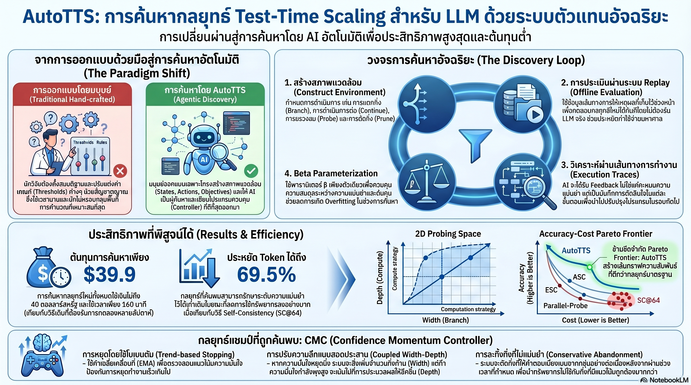

[กลับไปที่หน้าหลัก](../README.md)

สวัสดีครับเพื่อนๆ ที่ติดตามวงการ AI! วันนี้มาเรื่องที่ท้าทายสมมติฐานว่า "คนออกแบบ AI ต้องฉลาดกว่า AI" อย่างสิ้นเชิงครับ: AutoTTS งานวิจัยที่ปล่อยให้ AI ออกแบบ "วิธีคิดตอน Inference" ด้วยตัวเอง ใช้งบ $39.9 ใช้เวลา 160 นาที แล้วได้กลยุทธ์ที่เอาชนะสิ่งที่นักวิจัยมนุษย์ใช้เวลาออกแบบมาหลายปีในเกือบทุก Benchmark ครับ

คุณเคยสังเกตไหมครับว่า ปัญหาใหญ่ที่สุดของ Test-Time Scaling ไม่ใช่ว่าโมเดลคิดได้ไม่ดี แต่คือการที่เราไม่รู้ว่าควรให้มันหยุดคิดตอนไหน แตกกิ่งความคิดเพิ่มเมื่อไหร่ หรือตัดกิ่งที่ไม่ไปไหนตอนใด ครับ? กลยุทธ์เหล่านี้ถูกออกแบบด้วยสัญชาตญาณมนุษย์มาตลอด ซึ่งหมายความว่าขีดจำกัดของ TTS คือขีดจำกัดจินตนาการของนักวิจัยเอง

คุณรู้ไหมครับว่า Offline Replay Environment คือกุญแจที่ทำให้ AutoTTS ถูกมากอย่างไม่น่าเชื่อครับ แทนที่จะเรียก LLM จริงๆ ซ้ำแล้วซ้ำเล่าระหว่าง Search ระบบ Replay Reasoning Trajectories และ Probe Signals ที่เก็บไว้ล่วงหน้าทุก 500 tokens แทน ทำให้การทดสอบกลยุทธ์ใหม่แต่ละตัว Deterministic และเร็วมากโดยไม่ต้องเสีย API Call ครับ?

และคุณเคยนึกไหมครับว่า กลยุทธ์ที่น่าทึ่งที่สุดที่ AI ค้นพบอย่าง CMC (Confidence Momentum Controller) มีกลไกที่มนุษย์แทบนึกไม่ถึงครับ มันไม่ได้หยุดคิดเมื่อ "ความมั่นใจพุ่งสูง" ในรอบนั้น แต่ดู EMA ของความมั่นใจว่ามีแนวโน้มเสถียรหรือไม่ต่างหาก — เพราะความมั่นใจชั่วคราวอาจแค่เจอข้อมูลหลอกได้ครับ?

งานวิจัยนี้กำลังบอกว่า: "The right place to invest human effort is in environment design, not strategy design — เมื่อสภาพแวดล้อมถูกต้อง AI จะค้นพบวิธีคิดที่เราคาดไม่ถึงด้วยงบราคาอาหารมื้อเดียวครับ"

========================================

🤔 ทบทวนความเชื่อเดิมๆ: สิ่งที่เราคิดเกี่ยวกับ Test-Time Scaling และการออกแบบกลยุทธ์

▪ "การจะได้ Inference Strategy ที่ดีต้องใช้นักวิจัยผู้เชี่ยวชาญหลายคน ทดลองหลายเดือน — ไม่มีทางลัด" → AutoTTS ค้นหา Strategy ที่เอาชนะ Hand-crafted Heuristic ปีหลายปีในราคา $39.9 และ 160 นาทีครับ โดยใช้ Claude Code เป็น Explorer ที่เขียนโค้ดลองผิดลองถูกใน Offline Environment แทนคนครับ

▪ "Hyperparameters หลายตัวให้ความยืดหยุ่นมากกว่า — ยิ่งปรับได้ละเอียดยิ่งดี" → Beta Parameterization พิสูจน์ตรงข้ามครับ การบังคับให้ AI แมปกลยุทธ์ทั้งหมดลงบน β ตัวเดียวที่ควบคุม Compute-Accuracy Trade-off แบบ Monotonic ป้องกัน Overfitting และบังคับให้ได้กลยุทธ์ที่ Generalize ได้จริง แทนที่จะเป็น Hacked Solution ที่เล่นงานแค่ข้อมูลชุดเดียวครับ

▪ "AI ควรหยุดคิดเมื่อความมั่นใจสูง — ความมั่นใจ Real-time คือสัญญาณที่ดีที่สุด" → CMC พิสูจน์ว่าความมั่นใจชั่วขณะ (Instantaneous Confidence) หลอกได้ง่ายเมื่อเจอข้อมูลที่ Misleading ครับ กลยุทธ์ที่ AI ค้นพบเองดู EMA Trend ของความมั่นใจแทน บอกให้หยุดก็ต่อเมื่อ Momentum เสถียรและไม่มีแนวโน้มตกลงอีกต่อไปครับ

▪ "Test-Time Scaling ใช้ได้ดีแค่กับโมเดลใหญ่ — โมเดลเล็กไม่ได้ประโยชน์เท่า" → AutoTTS ถูกทดสอบและพิสูจน์แล้วทั้งใน Qwen3 ขนาด 0.6B, 1.7B, 4B, 8B และ DeepSeek-R1-Distill-Llama-8B ครับ กลยุทธ์ที่ค้นพบ Generalize ข้ามโมเดลและข้ามขนาด ไม่ได้ผูกกับ Architecture ใดครับ

ความจริงที่น่าคิดคือ: "ขีดจำกัดของ TTS ไม่ใช่โมเดล ไม่ใช่ Compute แต่คือจินตนาการของคนที่ออกแบบกลยุทธ์ — และ AutoTTS เป็นหลักฐานว่าเราสามารถก้าวข้ามขีดจำกัดนั้นได้โดยการเลิกออกแบบกลยุทธ์เองครับ"

========================================

🧠 พื้นฐานที่ต้องเข้าใจก่อน: Offline Replay Environment, Beta Parameterization, Execution Trace Feedback, และ CMC

=== ทำไม Hand-crafted TTS Heuristics ถึงมีเพดาน ===

ใน Test-Time Scaling โมเดลจะได้ประโยชน์จากการ "คิดนานขึ้น" ผ่านกลไกต่างๆ เช่น Best-of-N Sampling, Tree Search, หรือ Beam Search ครับ แต่กลไกเหล่านี้ต้องการกลยุทธ์ที่บอกว่า เมื่อไหร่ควรหยุด เมื่อไหร่ควรแตกกิ่ง และเมื่อไหร่ควรตัดกิ่งทิ้งครับ

ปัญหาคือนักวิจัยต้องนึกก่อนว่า Signal ไหนน่าจะสำคัญ แล้วค่อยออกแบบ Heuristic รอบ Signal นั้นครับ ซึ่งมีขีดจำกัดชัดเจนสองอย่างครับ หนึ่ง มนุษย์อาจนึกไม่ถึง Signal ที่สำคัญที่สุดเลยครับ สอง Interaction ระหว่าง Signal หลายตัวซับซ้อนเกินกว่าจะออกแบบด้วยมือได้อย่างประสานงานกัน AutoTTS แก้ปัญหานี้โดยเปลี่ยนสิ่งที่มนุษย์ต้องออกแบบจาก Strategy เป็น Environment ครับ

=== Offline Replay Environment: ทำให้ $39.9 เป็นไปได้อย่างไร ===

ต้นทุนที่ถูกอย่างไม่น่าเชื่อของ AutoTTS มาจาก Architecture ของ Environment ครับ แทนที่จะเรียก LLM จริงทุกครั้งที่ต้องการประเมิน Strategy ใหม่ ระบบทำงานสองเฟสครับ

เฟสเก็บข้อมูล: รันโมเดลจริงครั้งเดียวต่อโจทย์ แล้วเก็บ Reasoning Trajectory ทั้งหมดพร้อม Probe Signals ทุก 500 tokens ครับ Probe Signals ประกอบด้วยสัญญาณต่างๆ เช่น ความมั่นใจของโมเดล ณ จุดนั้น รูปแบบของ Token ที่ผลิตออกมา และสัญญาณอื่นๆ ที่บ่งบอกสถานะการคิดครับ

เฟส Replay: เมื่อ Claude Code (Explorer LLM) เสนอ Strategy ใหม่ ระบบจะ Simulate ว่า Strategy นั้นจะตัดสินใจอย่างไร ณ แต่ละ Checkpoint ใน Trajectory ที่เก็บไว้ โดยไม่ต้องเรียก LLM จริงเลยครับ ทำให้การประเมินแต่ละ Strategy เป็น Deterministic และเร็วมากครับ

เหมือนนักวิจัยที่บันทึกวิดีโอการทดลองไว้ แล้วเปิดดูซ้ำหลายรอบเพื่อทดสอบว่า "ถ้าตัดสินใจต่างออกไปตรงนี้จะเกิดอะไร" โดยไม่ต้องรื้อห้องแล็บใหม่ทุกครั้งครับ

=== Beta Parameterization: ทำไมปุ่มเดียวถึงชนะหลายปุ่ม ===

AutoTTS บังคับให้ Claude Code เขียน Controller ในรูปแบบที่จำกัดครับ กลยุทธ์ทุกอย่างต้องสามารถแสดงออกมาเป็น Function ที่รับ β เป็น Input แล้ว Output ว่าจะหยุด/แตกกิ่ง/ตัดกิ่งอย่างไร โดยที่ค่า β ที่สูงขึ้นต้องหมายถึง Compute ที่มากขึ้นเสมอ (Monotonic Constraint) ครับ

ประโยชน์หลักมีสองอย่างครับ ด้าน Generalization: เมื่อ Controller ถูกบังคับให้ทำงานบน Spectrum ของ β ทั้งหมด มันต้องเป็น Strategy ที่ยืดหยุ่นพอจะ Generalize ข้ามสถานการณ์ครับ ไม่ใช่ Overfit กับโจทย์ชุดเดียวครับ ด้านการเปรียบเทียบ: ทุก Controller ถูกประเมินบน IsoFLOP Curve เดียวกัน ทำให้เปรียบเทียบได้ยุติธรรมครับ

=== Execution Trace Feedback: เรียนรู้จากความล้มเหลวได้แม่นกว่าคะแนนรวม ===

เมื่อ Claude Code ทดสอบ Strategy ใหม่แล้วได้คะแนน ระบบไม่ได้บอกแค่ "ถูก" หรือ "ผิด" ครับ แต่ส่ง Execution Trace กลับไปบอกว่าในแต่ละ Checkpoint กลยุทธ์ตัดสินใจอย่างไร และผลลัพธ์ที่ตามมาคืออะไรครับ

เปรียบได้กับการที่โค้ชให้ Feedback ว่า "รอบที่ 3 คุณแตกกิ่งโดยไม่จำเป็น ทำให้เสีย Token ไป 400 ตัวในกิ่งที่ล้มเหลวทั้งหมด" แทนที่จะบอกแค่ "คะแนนรวมลดลง 5%" ครับ ทำให้ Claude Code ปรับปรุง Strategy ได้ตรงจุดกว่ามากครับ

=== CMC — Confidence Momentum Controller: กลยุทธ์ที่มนุษย์คิดไม่ถึง ===

นี่คือ Controller ที่ AutoTTS ค้นพบและให้ผลดีที่สุดครับ มีกลไกสี่อย่างที่ทำงานประสานกันอย่างที่มนุษย์ออกแบบได้ยากครับ

Trend-based Stopping ผ่าน EMA: แทนที่จะหยุดเมื่อ Confidence สูง CMC ติดตาม EMA ของ Confidence ข้ามหลาย Checkpoint ครับ หยุดก็ต่อเมื่อ EMA เสถียรและ Trend ไม่ลงอีกต่อไป เหมือนนักลงทุนที่ไม่ขายหุ้นเพราะราคาพุ่งวันเดียว แต่รอดู Momentum ว่ามันเสถียรจริงก่อนครับ

Coupled Width-Depth Control: ความกว้าง (การแตกกิ่ง) และความลึก (การคิดต่อ) ถูกเชื่อมโยงกันผ่านสัญญาณ EMA เดียวกันครับ เมื่อ EMA เริ่ม Plateau ระบบจะสั่งให้แตกกิ่งใหม่ทันที เพราะการคิดลึกขึ้นในกิ่งเดิมคงไม่เพิ่มข้อมูลใหม่แล้วครับ

Alignment-aware Depth: CMC ทุ่ม Compute ไปที่กิ่งที่เริ่มมี Consensus กันครับ แทนที่จะแจกจ่าย Token เท่าๆ กันทุกกิ่ง ทำให้ประหยัดมากในกิ่งที่สับสน และเน้นหนักในกิ่งที่มีแนวโน้มถูกต้องครับ

Conservative Branch Abandonment: ตัดกิ่งก็ต่อเมื่อ EMA บ่งชี้ว่ากิ่งนั้น "หลงทาง" ติดต่อกันหลายรอบแล้วครับ ไม่ใช่ตัดทันทีที่ Confidence ตกชั่วคราว เพราะ Confidence ระยะสั้นมักหลอกได้ครับ

สิ่งที่น่าทึ่งที่สุดคือ Coordination ของสี่กลไกนี้ใช้ EMA Signal เดียวกันทั้งหมด ทำให้ Decision ในแต่ละมิติสอดคล้องกันโดยธรรมชาติ ซึ่งเป็นสิ่งที่การออกแบบด้วยมือที่ใช้ Hyperparameter แยกกันแทบจะทำไม่ได้ครับ

========================================

🎯 ประเด็นที่ควรคิดต่อ

— "Environment Design" อาจเป็นทักษะที่สำคัญที่สุดของนักวิจัย AI ในทศวรรษนี้: ถ้า AutoTTS พิสูจน์ว่า Strategy หาได้เองเมื่อมีสภาพแวดล้อมที่เหมาะสม งานของมนุษย์จะย้ายไปอยู่ที่ "สร้างสนามที่ถูกต้อง" ครับ ซึ่งต้องการความเข้าใจเชิงลึกในสิ่งที่ต้องการวัด ไม่ใช่แค่วิธีวัดครับ ทักษะนี้ต่างออกไปจากการ Tune Algorithm แบบดั้งเดิมมากครับ

— CMC เป็นตัวอย่างของ Emergent Strategy ที่ Interpretable: กลยุทธ์ที่ AI ค้นพบในครั้งนี้ยังอธิบายได้ว่า "ทำไมถึงทำงาน" ครับ แต่เมื่อ Search Space ใหญ่ขึ้นและ Complexity สูงขึ้น เราจะยังอธิบายกลยุทธ์ที่ค้นพบได้อยู่ไหมครับ? และถ้าไม่ได้ เราพร้อมนำ Strategy ที่ดีแต่อธิบายไม่ได้ไปใช้กับ Critical System มากแค่ไหนครับ?

— คำถามที่สำคัญที่สุด: ถ้า $39.9 ให้ Strategy ที่เอาชนะงานหลายปีของมนุษย์ได้ และ Framework นี้ Scale ได้ข้ามโมเดลและโจทย์ — อะไรที่ยังต้องการ Human Intuition อยู่ในกระบวนการพัฒนา AI ครับ? หรือเราแค่กำลังเลื่อน Frontier ของ "สิ่งที่มนุษย์ยังทำแทน AI ได้" ออกไปเรื่อยๆ โดยที่ไม่มีวันรู้ว่าเส้นนั้นอยู่ตรงไหนครับ?

#AutoTTS #TestTimeScaling #LLM #AIResearch #ReasoningAI #ConfidenceMomentum #EMA #SearchAlgorithm #MachineLearning #AIEfficiency #ClaudeCode #AIME #HMMT #Qwen3
