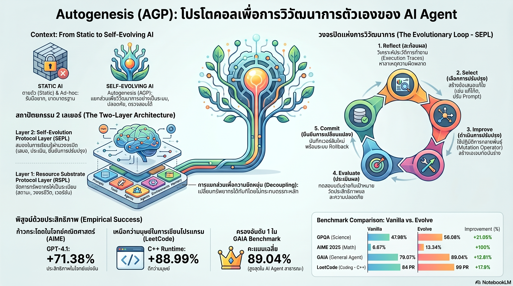

[กลับไปที่หน้าหลัก](../README.md)

สวัสดีครับเพื่อนๆ ที่ติดตามวงการ AI! วันนี้มาเรื่องที่เปลี่ยนคำถามจาก "เราจะเขียนคำสั่งให้ AI ทำงานได้ดีขึ้นอย่างไร?" เป็น "เราจะออกแบบโปรโตคอลให้ AI พัฒนาคำสั่งของตัวเองได้อย่างไร?" นั่นคือหัวใจของ Autogenesis Protocol (AGP) ที่กำลังท้าทายแนวคิดการสร้าง AI Agent ทั้งหมดครับ

คุณเคยสงสัยไหมครับว่า ถ้า AI สามารถแก้ไข Prompt, เครื่องมือ และหน่วยความจำของตัวเองได้ระหว่างทำงานจริง โดยไม่ต้องรอให้โปรแกรมเมอร์กลับมาแก้ไขทีหลัง กำแพงสมรรถนะของ AI ในปัจจุบันจะหายไปหรือเปล่า?

คุณรู้ไหมครับว่า โมเดล AI ที่เริ่มต้นด้วยประสิทธิภาพปานกลางอย่าง gpt-4.1 สามารถพัฒนาตัวเองจนทำคะแนนโจทย์คณิตศาสตร์ระดับแข่งขัน AIME24 ได้ดีขึ้นถึง 71.4% ได้เพียงแค่ให้มัน "วิวัฒนาการ" ผ่านโปรโตคอลที่ออกแบบมาอย่างถูกต้อง?

และคุณเคยนึกไหมครับว่า ความแตกต่างระหว่าง AI ที่แค่ "ใช้เครื่องมือ" กับ AI ที่ "สร้างเครื่องมือขึ้นใช้เอง" คือกำแพงสำคัญที่กั้น AI ยุคปัจจุบันกับ AI ที่แท้จริงในอนาคตอยู่?

แนวคิดนี้ชื่อ Autogenesis Protocol และมันกำลังเปลี่ยน AI จาก "ซอฟต์แวร์นิ่ง" สู่ "ระบบที่มีเมตาบอลิซึมของตัวเองได้" ครับ

========================================

🤔 ทบทวนความเชื่อเดิมๆ: สิ่งที่เราคิดเกี่ยวกับ AI Agent และขีดจำกัดของมัน

▪ "ถ้าอยากให้ AI ทำงานได้ดีขึ้น ต้องเขียน Prompt ใหม่หรือ Fine-tune โมเดลใหม่เท่านั้น ไม่มีทางลัด" → Autogenesis พิสูจน์ว่า AI สามารถ Reflect บนประสิทธิภาพของ Prompt ตัวเองแล้วเสนอเวอร์ชันที่ดีกว่าได้ผ่าน Operator Algebra ที่ทำงานในขณะ Inference โดยไม่ต้องฝึกโมเดลใหม่แม้แต่ครั้งเดียวครับ

▪ "การให้ AI แก้ไขตัวเองคืออันตราย เพราะมันอาจวิ่งออกนอกลู่นอกทาง ยิ่งแก้ยิ่งแย่" → Version Manager และ Immutable Snapshot ทำให้ทุกการ Mutation ถูกบันทึกและตรวจสอบได้ Conditional Gating ของ Commit Operator การันตีว่าระบบจะยอมรับเฉพาะเวอร์ชันที่ดีขึ้นจริงเท่านั้น ทำให้ Performance มีแต่ขึ้นหรือเสมอตัว ไม่มีถอยหลังครับ

▪ "โมเดลที่แพงและฉลาดที่สุดย่อมได้ประโยชน์จากการปรับปรุงมากที่สุดเสมอ" → Headroom Effect พลิกความเชื่อนี้ โมเดลที่ประสิทธิภาพเริ่มต้นต่ำกว่ากลับได้รับประโยชน์จากการวิวัฒนาการมากกว่า เพราะมี "ช่องว่างให้เติบโต" มากกว่า เหมือนนักกีฬามือใหม่ที่ยังพัฒนาได้เยอะกว่ามือโปรที่ชนเพดานแล้วครับ

▪ "MCP ของ Anthropic หรือ A2A ของ Google ทำหน้าที่เดียวกับ Autogenesis แค่ชื่อต่างกัน" → MCP และ A2A เน้น Invocation และ Connectivity คือการสร้าง "ท่อ" เชื่อมต่อ AI แต่ Autogenesis เน้น State Mutation คือการแก้ไข "อวัยวะภายใน" ของ Agent เองในขณะรัน ทั้งสองแนวทางไม่ขัดแย้งกัน แต่แก้ปัญหาคนละระดับครับ

ความจริงที่น่าคิดคือ: ปัญหาของ AI Agent ในปัจจุบันไม่ใช่ว่าโมเดลฉลาดไม่พอ แต่คือระบบไม่มีกลไกให้ AI ปรับปรุงตัวเองอย่างมีทิศทางและปลอดภัยในขณะทำงานจริงครับ

========================================

🧠 พื้นฐานที่ต้องเข้าใจก่อน: RSPL, State Mutation, Operator Algebra และ Headroom Effect

=== RSPL คืออะไร? ===

RSPL (Resource Substrate Protocol Layer) = เลเยอร์พื้นฐานที่ทำหน้าที่แยกทรัพยากรทั้งหมดของ Agent ออกมาให้จัดการได้แยกส่วน

ทรัพยากร 5 ประเภทใน RSPL: Prompt, Agent, Tool, Environment และ Memory ทุกตัวถูกยกระดับให้เป็น "Protocol-registered Resources" ที่มีสถานะ (State) และเวอร์ชันชัดเจน

เปรียบเทียบ: เหมือนโรงพยาบาลที่แยกแผนกออกจากกันอย่างชัดเจน (Modular) แทนที่จะเป็นห้องใหญ่ที่ทุกอย่างปะปนกัน ทำให้อัปเกรดแผนกใดแผนกหนึ่งได้โดยไม่กระทบส่วนอื่นครับ

=== State Mutation vs Connectivity ===

ความแตกต่างหลักระหว่าง Autogenesis กับโปรโตคอลอื่น

[Connectivity Focus (MCP/A2A)]
▸ สร้าง "ท่อ" เชื่อมต่อ AI กับบริการภายนอก
▸ ถามว่า "AI จะเรียกใช้อะไรได้บ้าง?"
▸ ทรัพยากรที่มีอยู่ไม่เปลี่ยนแปลงครับ

[State Mutation Focus (Autogenesis)]
▸ แก้ไข "อวัยวะภายใน" ของ Agent ในขณะรัน
▸ ถามว่า "AI จะปรับปรุงตัวเองได้อย่างไร?"
▸ ทรัพยากรวิวัฒนาการได้ตามประสิทธิภาพจริงครับ

=== Operator Algebra และ SEPL ===

SEPL (Self-Evolution Protocol Layer) = เลเยอร์ที่กำหนดวงจรการวิวัฒนาการผ่านคำสั่ง 5 ตัว

▸ Reflect = วิเคราะห์ประสิทธิภาพปัจจุบัน ระบุจุดอ่อน
▸ Select = เลือกทรัพยากรที่ควรปรับปรุง
▸ Improve = สร้างเวอร์ชันใหม่ที่ดีกว่า
▸ Evaluate = ทดสอบว่าเวอร์ชันใหม่ดีขึ้นจริงหรือไม่
▸ Commit = บันทึกเฉพาะเมื่อผ่านเกณฑ์ (Conditional Gating)

เปรียบเทียบ: เหมือน "วิธีการทางวิทยาศาสตร์" ที่ AI ประยุกต์ใช้กับตัวเองเพื่อให้ความรู้เพิ่มขึ้นเสมอ ไม่ใช่แค่ลองผิดลองถูกแบบสุ่มครับ

=== Headroom Effect คืออะไร? ===

Headroom Effect = ปรากฏการณ์ที่โมเดลซึ่งประสิทธิภาพเริ่มต้นต่ำกว่าได้รับประโยชน์จากการวิวัฒนาการมากกว่า เพราะมี "ช่องว่าง" ให้เติบโต (Headroom) มากกว่า

เปรียบเทียบ: เหมือนนักกีฬาที่เพิ่งเริ่มฝึกซ้อมสามารถพัฒนาได้เป็น 100% ใน 6 เดือน แต่นักกีฬาระดับโลกที่ใกล้ถึงขีดจำกัดร่างกายอาจพัฒนาได้แค่ 2-3% แม้ฝึกหนักเท่ากันครับ

=== Performance Monotonicity คืออะไร? ===

Performance Monotonicity = คุณสมบัติที่ระบบรักษาประสิทธิภาพให้มีแต่ขึ้นหรือเสมอตัว ไม่มีถอยหลัง

กลไกที่ทำให้เกิด: Commit Operator ทำหน้าที่เป็นประตูกั้น (Gate) ที่ยอมรับ Mutation ใหม่ก็ต่อเมื่อผ่านการประเมินแล้วว่าดีกว่าเดิม

เปรียบเทียบ: เหมือนประแจแบบ Ratchet ที่หมุนได้ทิศทางเดียว ขันให้แน่นขึ้นได้แต่ไม่หลุดคืนครับ

========================================

1️⃣ RSPL: แยก "ร่าง" ออกจาก "สมอง" คือรากฐานของระบบที่วิวัฒนาการได้

=== ปัญหาที่ RSPL แก้ ===

AI Agent แบบดั้งเดิมมักถูกสร้างด้วยสิ่งที่เรียกว่า Brittle Glue Code คือโค้ดเชื่อมต่อแบบ Ad-hoc ที่ทุกส่วนพัวพันกัน เมื่อต้องการอัปเกรดเครื่องมือหนึ่งตัว อาจต้องรื้อโครงสร้างทั้งหมดครับ

[สถานการณ์ก่อน RSPL]
▸ Prompt, Tool, Memory ปะปนกันใน Codebase เดียว
▸ อัปเกรดหนึ่งส่วน → เสี่ยงทำส่วนอื่นพัง
▸ ไม่มีประวัติว่า "ของเก่า" เป็นอย่างไร Rollback ยากครับ

[สถานการณ์หลัง RSPL]
▸ ทุกทรัพยากรเป็น Protocol-registered Resource มีเวอร์ชัน
▸ อัปเกรดได้เฉพาะจุดโดยไม่กระทบส่วนอื่น
▸ Immutable Snapshot ทำให้ Rollback ได้ทันทีครับ

=== เหตุใด Decoupling จึงสำคัญ ===

การแยก "สิ่งที่วิวัฒนาการ" ออกจาก "วิธีที่การวิวัฒนาการเกิดขึ้น" คือหัวใจที่ทำให้ระบบปรับตัวได้ยั่งยืน

เปรียบเทียบ: เหมือนร่างกายมนุษย์ที่ DNA กำหนดโครงสร้างการพัฒนา (ระบบวิวัฒนาการ) แยกออกจากอวัยวะแต่ละส่วน (ทรัพยากร) ทำให้ตับสามารถสร้างเซลล์ใหม่ได้โดยไม่กระทบการทำงานของหัวใจครับ

ผลลัพธ์จริง: ระบบสามารถ "สลับร่าง" เครื่องมือเฉพาะจุดได้ทันทีในขณะรัน Agent อยู่ โดยไม่ต้องหยุดและรีสตาร์ทระบบทั้งหมดครับ

========================================

2️⃣ Safe-by-Construction: วิวัฒนาการที่ปลอดภัยโดยโครงสร้าง ไม่ใช่แค่ความหวัง

=== Version Manager และ Auditability ===

การปล่อยให้ AI แก้ไขตัวเองโดยไม่มีกลไกควบคุมคืออันตราย Autogenesis จึงออกแบบระบบความปลอดภัยผ่าน Version Manager ที่ทำงานควบคู่กับ RSPL ทุกขั้นตอนครับ

[กลไกความปลอดภัย 3 ชั้น]
▸ ชั้นที่ 1: Immutable Snapshot ก่อนทุกการ Mutation สถานะเก่าถูกบันทึกไว้เสมอ ลบไม่ได้
▸ ชั้นที่ 2: Version Lineage ประวัติสายการวิวัฒนาการทั้งหมดตรวจสอบย้อนหลังได้ว่าแก้อะไร ทำไม
▸ ชั้นที่ 3: Conditional Commit Mutation ใหม่ถูกยอมรับก็ต่อเมื่อผ่านการประเมินว่าดีขึ้นจริงครับ

=== Auditability: ไม่แค่ปลอดภัย แต่โปร่งใส ===

สิ่งที่ทำให้ Autogenesis แตกต่างจากระบบ Self-improvement แบบ Black Box คือทุก Mutation มี "เหตุผล" บันทึกไว้

เปรียบเทียบ: เหมือน Git สำหรับ AI ที่ไม่แค่บันทึกว่า "โค้ดเปลี่ยนอะไร" แต่บันทึกด้วยว่า "เปลี่ยนเพราะอะไร" และ "ผลลัพธ์ดีขึ้นแค่ไหน" ทำให้มนุษย์ไว้วางใจระบบได้ในระยะยาวครับ

ความสำคัญของ Auditability: เป็นรากฐานของ AI Governance เพราะเมื่อระบบเกิดข้อผิดพลาด เราสามารถย้อนไปดูได้ว่า Mutation ตัวไหนทำให้เกิดปัญหาและกลับสู่สถานะที่ปลอดภัยได้ทันทีครับ

========================================

3️⃣ Headroom Effect: ยิ่งมีช่องว่าง ยิ่งวิวัฒนาการได้ไกล

=== ผลการทดสอบบน GPQA และ AIME24 ===

การทดสอบบน Benchmark ระดับโลกเปิดเผยปรากฏการณ์ที่น่าประหลาดใจและเปลี่ยนมุมมองการลงทุนใน AI

[ผลบน AIME24 (โจทย์คณิตศาสตร์ระดับแข่งขัน)]
▸ gpt-4.1: ประสิทธิภาพเพิ่มขึ้น +71.4% หลังวิวัฒนาการ (Headroom สูง)
▸ Claude-3.5-Sonnet: เพิ่มขึ้น +13.04% ถึง +22.73% อย่างมีนัยสำคัญ
▸ โมเดลที่ใกล้เพดานอยู่แล้ว: เพิ่มขึ้นน้อยกว่าครับ

=== นัยสำคัญของ Headroom Effect ===

ปรากฏการณ์นี้เปลี่ยนวิธีคิดเรื่องการลงทุนใน AI Infrastructure อย่างสิ้นเชิง

[เดิม: โลกแบบ Linear]
▸ อยากได้ผลลัพธ์ดีขึ้น → ต้องใช้โมเดลแพงขึ้น
▸ Budget จำกัด → ยอมรับประสิทธิภาพต่ำกว่า
▸ โมเดลที่ดีที่สุดคือที่เริ่มต้นดีที่สุดครับ

[ใหม่: โลกแบบ Protocol-Augmented]
▸ โมเดลระดับกลาง + โปรโตคอลวิวัฒนาการที่ดี → ประสิทธิภาพเทียบเท่าโมเดลตัวท็อป
▸ ช่องว่าง (Headroom) คือ "ทรัพย์สิน" ที่โปรโตคอลแปลงเป็นประสิทธิภาพได้
▸ ประหยัดต้นทุนได้มหาศาลสำหรับองค์กรที่ไม่มีงบไม่จำกัดครับ

เปรียบเทียบ: เหมือนนักลงทุนที่รู้ว่าหุ้นที่ Undervalue แต่มี Potential สูงให้ผลตอบแทนดีกว่าหุ้นที่ราคาแพงอยู่แล้วเสมอ Headroom คือ Upside ที่รอการปลดล็อคครับ

========================================

4️⃣ Tool Generator Agent และ Performance Monotonicity: AI ที่สร้างอวัยวะใหม่ให้ตัวเอง

=== Tool Generator Agent บน GAIA Benchmark ===

GAIA Benchmark ออกแบบมาเพื่อทดสอบงานในโลกจริงที่ซับซ้อน Autogenesis แสดงความสามารถพิเศษผ่าน Tool Generator Agent ที่ไม่แค่ "ใช้เครื่องมือ" แต่ "สร้างเครื่องมือ" เมื่อเครื่องมือที่มีไม่เพียงพอครับ

[ผลการทดสอบ GAIA Level 3 (ยากที่สุด)]
▸ AGS (Autogenesis System): Pass@1 สูงกว่า Baseline +33.3%
▸ กลไก: สร้าง Sub-agent ใหม่แบบ "Agent-as-tool" ในขณะรัน
▸ ความยืดหยุ่น: ประกอบ Sub-agent เข้ากับเครื่องมืออื่นได้ทันทีครับ

[ผลการทดสอบ LeetCode (C++)]
▸ Pass Rate: สูงถึง 99% ผ่าน Inference-time Self-evolution
▸ กระบวนการ: AI เขียนโค้ด → รัน → วิเคราะห์ข้อผิดพลาด → ปรับปรุง → Commit เฉพาะเมื่อผ่าน
▸ ไม่ต้องฝึกโมเดลใหม่ ทุกอย่างเกิดขึ้นในขณะ Inferenceครับ

=== Performance Monotonicity: คณิตศาสตร์รับประกันความก้าวหน้า ===

Commit Operator ไม่ใช่แค่ "ปุ่ม Save" แต่คือ Conditional Gate ที่ฝังหลักการทางคณิตศาสตร์ไว้

[Logic ของ Conditional Gate]
▸ IF ประสิทธิภาพ (v_new) > ประสิทธิภาพ (v_old): → Commit และ Deploy เวอร์ชันใหม่
▸ ELSE: → Rollback อัตโนมัติ รักษาเวอร์ชันที่ดีกว่าไว้
▸ ผลลัพธ์: Performance มีแต่ขึ้นหรือเสมอตัว ไม่มีถอยหลังครับ

เปรียบเทียบ: เหมือน Control Theory ในวิศวกรรมที่รับประกัน Stability ของระบบ ไม่ใช่แค่หวังว่า AI จะ "ไม่พลาด" แต่ออกแบบให้มันไม่สามารถ "แย่ลง" ได้โดยโครงสร้างครับ

นัยสำคัญ: Autogenesis ไม่ได้บอกว่า "เชื่อใจ AI" แต่บอกว่า "ระบบรับประกันทางคณิตศาสตร์ว่าทุก Mutation ทำให้ดีขึ้นหรือคงเดิมเท่านั้น" ซึ่งต่างกันโดยสิ้นเชิงครับ

========================================

🎯 สรุป: Autogenesis Protocol กับการเปลี่ยนบทบาทของมนุษย์ในยุค AI

Autogenesis Protocol (AGP) นำเสนอสถาปัตยกรรม 2 เลเยอร์ที่แยกชัดเจน: RSPL ที่จัดการทรัพยากรแบบ Modular และ SEPL ที่กำหนดวงจรวิวัฒนาการผ่าน Operator Algebra ด้วยกลไก Headroom Effect ที่พิสูจน์ว่าโมเดลระดับกลางสามารถพัฒนาได้ถึง +71.4% และ Tool Generator Agent ที่ทำ 99% Pass Rate บน LeetCode C++ โดยไม่ต้องฝึกโมเดลใหม่

สิ่งที่น่าสนใจกว่าตัวเลขคือนัยต่อบทบาทของมนุษย์ครับ ถ้า AI สามารถปรับ Prompt, สร้าง Tool และพัฒนา Memory ตัวเองได้ บทบาทของมนุษย์จะเปลี่ยนจาก "Prompt Engineer" ที่คอยบอกว่า "ทำแบบนี้นะ" มาเป็น "Protocol Designer" ที่กำหนดว่า "เกณฑ์การวิวัฒนาการที่ดีคืออะไร" และ "ขอบเขตความปลอดภัยอยู่ตรงไหน" ซึ่งต้องการทักษะที่แตกต่างออกไปโดยสิ้นเชิงครับ

ที่สำคัญที่สุด: Autogenesis ไม่ได้เสนอ AI ที่ "ควบคุมไม่ได้" แต่เสนอ AI ที่ "วิวัฒนาการได้อย่างมีทิศทางและตรวจสอบได้" ซึ่งคือความแตกต่างระหว่างระบบที่น่ากลัวกับระบบที่น่าเชื่อถือครับ

========================================

💬 คำถามท้ายทาย: ลองคิดดูนะครับ

▪ ถ้า Performance Monotonicity รับประกันว่า AI จะไม่มีวันแย่ลง แต่อาจไม่ได้ดีขึ้นเสมอไปด้วย เราควรวัด "ความสำเร็จ" ของโปรโตคอลวิวัฒนาการจากอะไรดีครับ?

▪ Headroom Effect บอกว่าโมเดลที่ "อ่อนแอกว่า" ได้ประโยชน์จากการวิวัฒนาการมากกว่า ถ้าจริง บริษัทขนาดกลางที่ไม่มีงบซื้อ GPT-5 หรือ Claude Opus ควรปรับกลยุทธ์ AI อย่างไรครับ?

▪ Tool Generator Agent ที่สร้างเครื่องมือขึ้นมาใช้เองนั้นน่าตื่นเต้น แต่ถ้า AI สร้างเครื่องมือที่มนุษย์ไม่เคยนึกถึง เราจะรู้ได้อย่างไรว่ามัน "ปลอดภัย" โดยที่ยังไม่มีใครเคยใช้มาก่อนครับ?

▪ ในโลกที่ AI พัฒนาตัวเองได้แบบ Real-time ทักษะ "Protocol Design" คืออะไร และเราควรสอนมันในระบบการศึกษาอย่างไรครับ?

========================================

References:
- Autogenesis: A Protocol for Autonomous Evolution of LLM Agents
- GAIA Benchmark: General AI Assistants Evaluation
- AIME24 (American Invitational Mathematics Examination 2024)
- GPQA (Graduate-Level Google-Proof Q&A Benchmark)
- LeetCode Competitive Programming Evaluation

ถ้า RSPL และ SEPL กลายเป็นมาตรฐานในการสร้าง AI Agent วันหนึ่งข้างหน้าเราอาจไม่ได้ถามว่า "AI ตัวนี้ทำอะไรได้บ้าง?" แต่ถามว่า "AI ตัวนี้วิวัฒนาการไปถึงไหนแล้ว?" ครับ

#AI #ArtificialIntelligence #AutogenesisProtocol #SelfEvolution #LLMAgent #PromptEngineering #ProtocolDesign #MachineLearning #GAIA #AIME #HeadroomEffect #PerformanceMonotonicity #AIGovernance #AgentFramework #VersionControl
