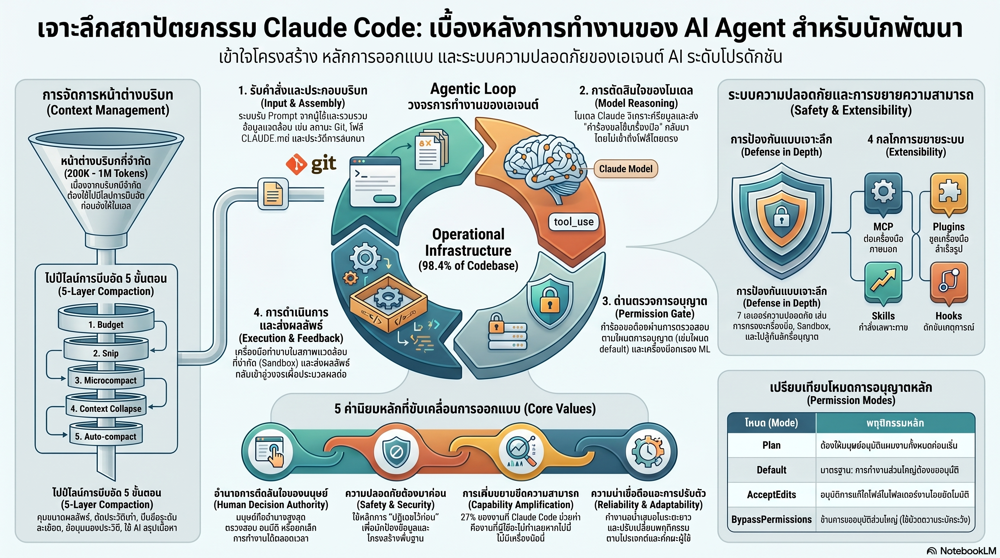

[กลับไปที่หน้าหลัก](../README.md)

สวัสดีครับเพื่อนๆ นักพัฒนาและคนในวงการ AI! วันนี้มาเรื่องที่ท้าทายความเชื่อพื้นฐานที่ว่า "AI Agent ที่เก่งขึ้นหมายความว่าโมเดลภายในต้องซับซ้อนขึ้น" จากการวิเคราะห์สถาปัตยกรรมเชิงลึกของ Claude Code ที่เผยให้เห็นความจริงที่น่าประหลาดใจ: Logic การตัดสินใจของ AI มีเพียง 1.6% ของ Codebase ทั้งหมด ส่วนอีก 98.4% คือ Operational Infrastructure — และนั่นคือหัวใจที่แท้จริงที่ทำให้มันทำงานได้ครับ

คุณเคยสังเกตไหมครับว่า เวลาที่ Claude Code ทำงานได้อย่างน่าทึ่ง เราคิดว่ามันเกิดจากความฉลาดของโมเดล แต่จริงๆ แล้วงานส่วนใหญ่ที่ทำให้มันทำงานได้จริงในโลกจริงนั้นเกิดจากโค้ดที่เราไม่เห็น ไม่ใช่โมเดลที่เราคุยด้วยครับ?

คุณรู้ไหมครับว่า จากผลสำรวจวิศวกร 132 คน (Huang et al., 2025) พบว่า 27% ของงานที่ Claude Code ทำสำเร็จนั้น คืองานที่นักพัฒนาจะไม่เริ่มทำเลยถ้าไม่มีเครื่องมือนี้ — นั่นไม่ใช่แค่ความเร็วที่เพิ่มขึ้น แต่คือขีดความสามารถใหม่ที่เปิดขึ้นมาครับ?

และคุณเคยนึกไหมครับว่า ในขณะที่ AI ช่วยให้เราทำงานยากขึ้นได้ 27% มีงานวิจัยพบว่านักพัฒนาที่ใช้ AI ช่วยงานมีคะแนนความเข้าใจในโค้ดลดลงถึง 17% — Paradox นี้คือความท้าทายที่ไม่มีคำตอบง่ายๆ และอาจกำหนดอนาคตของวิชาชีพนักพัฒนาทั้งหมดครับ?

งานวิจัยนี้กำลังบอกว่า: ความลับของ AI Agent ที่ทรงพลังไม่ได้อยู่ที่ "ทำให้โมเดลฉลาดขึ้น" แต่อยู่ที่ "สร้างโครงสร้างที่ทำให้โมเดลธรรมดาทำงานได้อย่างน่าเชื่อถือในโลกที่ไม่สมบูรณ์" ครับ

========================================

🤔 ทบทวนความเชื่อเดิมๆ: สิ่งที่เราคิดเกี่ยวกับ AI Agent และสถาปัตยกรรมของมัน

▪ "AI Agent ที่เก่งขึ้นหมายความว่าโมเดลภายในต้องซับซ้อนและใหญ่ขึ้น — ความสามารถของ Agent วัดได้จากความฉลาดของโมเดล" → 1.6% vs 98.4% Paradox พิสูจน์ตรงกันข้ามครับ ความสามารถของ Claude Code มาจาก Operational Infrastructure ที่คิดเป็น 98.4% ของ Codebase ไม่ใช่จากความซับซ้อนของ Logic การตัดสินใจที่มีแค่ 1.6%

▪ "ผู้ใช้งานที่มีประสบการณ์จะตรวจสอบ Permission Request ของ AI อย่างละเอียดทุกครั้ง ระบบความปลอดภัยจึงพึ่งพาการตรวจสอบของมนุษย์ได้" → Approval Fatigue 93% พิสูจน์ว่ามนุษย์กด Accept โดยสัญชาตญาณเกือบทุกครั้ง ซึ่งเป็นเหตุผลว่าทำไม Deny-first Architecture และ YOLO Classifier จึงสำคัญกว่าการพึ่งพาการตัดสินใจของมนุษย์ทุกครั้งครับ

▪ "Context Window ที่ยาวขึ้นคือทางออกของปัญหา Long-horizon Tasks เพราะ AI จะมีข้อมูลครบถ้วนมากขึ้น" → 5-layer Compaction Pipeline พิสูจน์ว่าการมีข้อมูลครบไม่ใช่คำตอบ แต่การมี "ข้อมูลที่ถูกต้องในเวลาที่ถูกต้องด้วยต้นทุน Token ที่คุ้มค่าที่สุด" ต่างหากที่สำคัญกว่าครับ

▪ "AI Agent ช่วยให้นักพัฒนาเก่งขึ้นในระยะยาว เพราะได้เห็น Pattern ที่ดีและเรียนรู้จาก AI ไปพร้อมกัน" → Paradox of Supervision (Shen and Tamkin, 2026) พบว่าคะแนนความเข้าใจในโค้ดลดลง 17% เพราะ AI แบกรับกระบวนการที่ทำให้เกิดการเรียนรู้ในเชิงลึกไปด้วยครับ

ความจริงที่น่าคิดคือ: Claude Code ไม่ได้เป็น "โมเดลที่ฉลาดขึ้น" แต่คือ "ระบบวิศวกรรมที่ออกแบบมาเพื่อทำให้โมเดลทำงานได้อย่างน่าเชื่อถือในสภาพแวดล้อมจริง" ซึ่งเป็นสิ่งที่ต่างกันโดยสิ้นเชิงครับ

========================================

🧠 พื้นฐานที่ต้องเข้าใจก่อน: 1.6% vs 98.4%, Operational Harness, Deny-first Architecture และ Lazy-degradation

=== Model-centric vs. System-centric Architecture ต่างกันอย่างไร? ===

[Model-centric (แนวคิดเดิม)]
▸ โมเดลคือศูนย์กลาง — ยิ่งโมเดลฉลาด ยิ่งทำงานได้ดี
▸ Infrastructure เป็นแค่ Wrapper รอบโมเดล
▸ ปัญหา: โมเดลที่ฉลาดยังทำสิ่งที่ไม่ควรทำได้ถ้าไม่มีการควบคุมครับ

[System-centric (Claude Code)]
▸ Infrastructure คือ 98.4% — โมเดลคือ "ผู้ตัดสินใจ" ภายใน "กล่องควบคุม" ที่แข็งแรง
▸ การแยก Reasoning (โมเดลคิด) กับ Enforcement (Infrastructure บังคับใช้) ออกจากกัน
▸ ผลลัพธ์: ต่อให้โมเดลถูกหลอก Prompt Injection ระบบที่ล็อกไว้ใน Infrastructure จะยังปกป้องอยู่ครับ

=== YOLO Classifier คืออะไร? ===

YOLO Classifier = ML-based classifier ที่ใช้ระบบตรวจสอบแบบ Two-stage ในการวิเคราะห์ความปลอดภัยของแต่ละ Action ก่อนที่จะส่งถึงมนุษย์:

Stage 1 (Fast-filter): กรองอย่างรวดเร็วว่า Action นี้ Clearly Safe หรือ Clearly Dangerous
Stage 2 (Chain-of-Thought Analysis): สำหรับ Action ที่ไม่ชัดเจน ใช้ CoT ในการให้เหตุผลเพิ่มเติมก่อนตัดสินใจ

เหตุผลที่ต้องมี: เพราะมนุษย์กด Accept 93% ของ Permission Request อยู่แล้ว ระบบอัตโนมัติที่ฉลาดกว่าจะดีกว่าการพึ่งพาการตรวจสอบของมนุษย์ที่เหนื่อยล้าครับ

=== Lazy-degradation คืออะไร? ===

Lazy-degradation = หลักการที่ว่า "เริ่มจากวิธีที่ประหยัดและสูญเสียข้อมูลน้อยที่สุดก่อน ค่อยขยับไปสู่วิธีที่แรงกว่าเมื่อจำเป็น" แทนที่จะใช้วิธีที่แรงที่สุดตั้งแต่ต้นครับ

========================================

1) The 1.6% vs 98.4% Paradox: เมื่อ Infrastructure คือ AI

การค้นพบที่สำคัญที่สุดจากการวิเคราะห์ซอร์สโค้ดของ Claude Code คือสัดส่วนที่ไม่คาดคิดครับ:

— AI Decision Logic: 1.6% ของ Codebase
— Operational Infrastructure: 98.4% ของ Codebase

เปรียบได้กับองค์กรแพทย์ขนาดใหญ่: แพทย์ผู้เชี่ยวชาญที่ทำการวินิจฉัยและรักษา (โมเดล) อาจเป็นแค่ 1-2% ของพนักงานทั้งหมด แต่ระบบที่ทำให้แพทย์คนนั้นทำงานได้อย่างปลอดภัยและมีประสิทธิภาพ ไม่ว่าจะเป็น Nurse, Admin, Security, Medical Records, Safety Protocol — นั้นคือ 98-99% ที่เหลือ ถ้าไม่มีโครงสร้างนั้น แพทย์ที่เก่งที่สุดก็ทำงานได้อย่างจำกัดครับ

สิ่งที่ Operational Infrastructure ทำใน Claude Code:
— จัดการ Permission และ Security Boundary
— ควบคุม Context Window และการจัดการความจำ
— Orchestrate Tool Use อย่างปลอดภัย
— บันทึกและ Audit ทุก Action
— จัดการ Error Recovery และ State Management

Logic การตัดสินใจ 1.6% ทำหน้าที่เดียวครับ: ส่งคำสั่งผ่าน Structured Tool Use — แต่ Infrastructure 98.4% ที่ล้อมรอบมันต่างหากที่ทำให้คำสั่งนั้นปลอดภัยและน่าเชื่อถือ

========================================

2) Long-horizon Dependability: จาก Acceleration สู่ Amplification

สถิติจากการสำรวจวิศวกร 132 คน (Huang et al., 2025) เผยให้เห็นสิ่งที่สำคัญกว่าแค่ความเร็วครับ: 27% ของงานที่ Claude Code ทำสำเร็จคืองานที่นักพัฒนาจะ "ไม่เริ่มทำเลย" ถ้าไม่มีเครื่องมือนี้

นั่นหมายความว่า Claude Code ไม่ได้แค่ทำสิ่งที่เราทำอยู่แล้วให้เร็วขึ้น แต่มันเปิด "ประตูที่ปิดอยู่" ออกได้ครับ

ประตูที่ปิดเหล่านั้นมักเป็น:
— การ Refactor ระบบขนาดใหญ่ที่ต้องแตะหลายสิบไฟล์พร้อมกัน
— การสร้าง Test Coverage ครอบคลุมสำหรับ Legacy Code ที่ไม่มีใครอยากแตะ
— การแก้ Bug ที่ต้องติดตามตลอด Long Chain of Cause-and-effect ครับ

เหตุผลที่ประตูเหล่านี้เคยปิดไม่ใช่เพราะนักพัฒนาไม่รู้วิธีทำ แต่เพราะ Cognitive Load ในการรักษาความต่อเนื่องของบริบทตลอดงานยาวนั้นสูงเกินไปสำหรับสมองมนุษย์ครับ Claude Code แบกรับ "ภาระในการจำ" ส่วนนั้นแทน ทำให้นักพัฒนาสามารถโฟกัสกับการตัดสินใจระดับสูงได้

========================================

3) 5-layer Compaction Pipeline: Context Window คือทรัพยากรที่ต้องจัดการอย่างมีกลยุทธ์

Context Window ไม่ใช่แค่ "พื้นที่จำ" แต่คือทรัพยากรที่จำกัดและมีราคาครับ Claude Code จัดการมันด้วย 5-layer Compaction Pipeline ที่ทำงานตามหลัก Lazy-degradation:

ชั้นที่ 1 — Budget Reduction (ต้นน้ำ):
เปรียบได้กับการกำหนดขนาดโปรชั่นอาหารก่อนที่จะเสิร์ฟ ควบคุมขนาด Output ของแต่ละ Tool ตั้งแต่ต้น แทนที่จะปล่อยให้ Output ใหญ่โตแล้วค่อยตัดทีหลังครับ

ชั้นที่ 2 — Snip (ตัดประวัติเก่า):
ตัดส่วนประวัติที่เก่าเกินไปและไม่เกี่ยวข้องกับงานปัจจุบันออก เหมือนการลบโน้ตที่เก่าเกินไปออกจากกระดานไวท์บอร์ดครับ

ชั้นที่ 3 — Microcompact (Cache-aware Compression):
บีบอัดในระดับละเอียดโดยคำนึงถึงว่า Data ส่วนไหนถูก Cache ไว้แล้วและไม่จำเป็นต้องส่งซ้ำครับ

ชั้นที่ 4 — Context Collapse (Virtual Projection):
แทนที่จะลบประวัติออก สร้าง "มุมมองสรุป" ทับซ้อนบนประวัติจริง ประวัติยังอยู่แต่โมเดลเห็นเวอร์ชันที่กระชับกว่าครับ — เหมือน Google Maps ที่ซูมออกเพื่อดูภาพรวมแทนที่จะลบถนนออกจากแผนที่

ชั้นที่ 5 — Auto-compact (Model-generated Summary):
ชั้นสุดท้ายที่ใช้ AI สรุปเนื้อหาสำคัญทั้งหมดเมื่อ 4 ชั้นแรกไม่เพียงพอ — เป็นวิธีที่ "แรง" ที่สุดแต่ก็สูญเสียข้อมูลมากที่สุดด้วย จึงเก็บไว้เป็นทางเลือกสุดท้ายครับ

การเรียงลำดับจาก "สูญเสียน้อยที่สุด" ไปสู่ "สูญเสียมากที่สุด" นี้คือกลยุทธ์ที่ทำให้โมเดลได้รับข้อมูลที่มีคุณภาพสูงสุดในทุกสถานการณ์ครับ

========================================

4) Deny-first Architecture และ YOLO Classifier: ออกแบบเพื่อมนุษย์ที่เหนื่อยล้า

ข้อมูลที่น่าตกใจครับ: ผู้ใช้กดยอมรับ Permission Request ของ AI สูงถึง 93% โดยไม่ได้ตรวจสอบจริงจัง นี่คือ Approval Fatigue — ปรากฏการณ์ที่ระบบที่ออกแบบมาให้ "มนุษย์อยู่ในวงควบคุม" กลายเป็นระบบที่มนุษย์กด OK ไปโดยสัญชาตญาณ

Claude Code แก้ปัญหานี้ด้วยสองแนวทางครับ:

Deny-first Architecture — ลำดับความสำคัญที่ชัดเจน:
Deny > Ask > Allow ครับ กฎที่ห้ามจะมีน้ำหนักเหนือกว่าการร้องขอเสมอ และการร้องขอมีน้ำหนักเหนือกว่าการอนุญาตเสมอ ต่อให้โมเดลพยายามขอ Permission ที่ขัดแย้งกับกฎ Infrastructure จะปฏิเสธทันที

YOLO Classifier — ระบบอัตโนมัติที่ฉลาดกว่ามนุษย์ที่เหนื่อยล้า:
เปรียบได้กับระบบ Security ที่สนามบิน: ไม่ใช่ทุก Bag ที่ต้องผ่านการตรวจสอบโดยเจ้าหน้าที่มนุษย์ทุกชิ้น X-ray Machine (Stage 1: Fast-filter) จัดการส่วนใหญ่ได้เอง เฉพาะ Bag ที่น่าสงสัยถึงจะถูกส่งให้เจ้าหน้าที่ตรวจซ้ำ (Stage 2: CoT Analysis) ครับ ระบบนี้ทำให้เจ้าหน้าที่โฟกัสกับสิ่งที่สำคัญจริงๆ ไม่ใช่เสียเวลากับสิ่งที่ Self-evident

ผลคือ Security ระดับสูงโดยไม่ต้องพึ่งพาสมาธิของมนุษย์ที่จะเสื่อมถอยตามเวลาครับ

========================================

5) Paradox of Supervision: เมื่อ Gain 27% มาพร้อม Loss 17%

นี่คือส่วนที่ท้าทายมากที่สุดในงานวิจัยนี้ครับ:

Gain: 27% ของงานที่ทำสำเร็จ = งานที่นักพัฒนาไม่กล้าเริ่มทำ (Capability Amplification)
Loss: คะแนนความเข้าใจในโค้ดลดลง 17% (Shen and Tamkin, 2026)

เปรียบได้กับ GPS Navigation: GPS ทำให้เราไปถึงที่หมายได้ทุกที่แม้ไม่เคยไปมาก่อน (Gain) แต่คนที่ใช้ GPS ตลอดเวลาจะค่อยๆ สูญเสียความสามารถในการอ่านแผนที่และทิศทางโดยไม่ต้องพึ่งอุปกรณ์ (Loss) ครับ

ทำไม Loss นี้ถึงน่ากังวลสำหรับนักพัฒนา:
— 17% ของ Comprehension ที่หายไปคือความสามารถในการ "ตรวจสอบ" สิ่งที่ AI สร้างขึ้น
— ถ้าเราไม่เข้าใจโค้ดที่ AI เขียน เราจะรู้ได้อย่างไรว่ามันถูกต้อง?
— ในระยะยาว ใครจะเป็นคน "Supervise" AI ถ้า Supervisor กำลังสูญเสียทักษะที่จำเป็นสำหรับการ Supervise?

นี่คือ Paradox ที่แท้จริงของยุค AI-assisted Development ครับ: ยิ่งเราพึ่ง AI มากขึ้น ยิ่งต้องการทักษะในการตรวจสอบ AI มากขึ้น แต่ทักษะนั้นกำลังเสื่อมถอยจากการใช้ AI มากขึ้น

========================================

🎯 สรุป: Claude Code ไม่ใช่โมเดลที่ฉลาดขึ้น แต่คือระบบที่ออกแบบมาอย่างชาญฉลาดขึ้น

การวิเคราะห์สถาปัตยกรรมของ Claude Code พิสูจน์สิ่งสำคัญ 5 ประการครับ:

หนึ่ง — 1.6% vs 98.4% Paradox: ความสามารถของ AI Agent มาจาก Operational Infrastructure เป็นหลัก ไม่ใช่ความซับซ้อนของโมเดล การแยก Reasoning ออกจาก Enforcement คือกุญแจสำคัญของความน่าเชื่อถือ

สอง — Capability Amplification ไม่ใช่แค่ Acceleration: 27% ของงานที่ Claude Code ทำสำเร็จคืองานที่นักพัฒนาไม่กล้าเริ่มทำ — Long-horizon Dependability เปิดประตูที่เคยปิดอยู่ครับ

สาม — 5-layer Compaction Pipeline (Budget Reduction → Snip → Microcompact → Context Collapse → Auto-compact) ตาม Lazy-degradation: Context Window ที่จัดการดีสำคัญกว่า Context Window ที่ใหญ่ขึ้น

สี่ — Deny-first Architecture + YOLO Classifier (Two-stage: Fast-filter + CoT) แก้ปัญหา Approval Fatigue 93%: ออกแบบสำหรับมนุษย์ที่เหนื่อยล้า ไม่ใช่มนุษย์ในอุดมคติที่ตรวจสอบทุกอย่างด้วยความตั้งใจเต็มร้อยครับ

ห้า — Paradox of Supervision (Gain 27% / Loss 17%): ความท้าทายระยะยาวที่ไม่มีคำตอบง่ายๆ — ยิ่งพึ่ง AI มากขึ้น ยิ่งต้องการทักษะในการ Supervise AI มากขึ้น แต่ทักษะนั้นกำลังเสื่อมถอยครับ

คำถามที่ Claude Code ทิ้งไว้ให้เราขบคิด: "ในโลกที่ AI ทำได้เกือบทุกอย่าง ทักษะอะไรที่นักพัฒนาต้องปกป้องไว้เพื่อให้ยังสามารถ Supervise สิ่งที่ AI สร้างขึ้นได้อย่างแท้จริง?" ครับ

========================================

💬 คำถามชวนคิด:

Paradox of Supervision บอกว่า Gain 27% มาพร้อม Loss 17% คุณคิดว่าในฐานะนักพัฒนาที่ใช้ AI ช่วยงานทุกวัน มีกิจกรรมอะไรบ้างที่คุณตั้งใจจะ "ทำด้วยตัวเอง" ต่อไปแม้ AI จะทำได้ดีกว่า เพื่อรักษาทักษะในการ Supervise ไว้ครับ?

และถ้า 98.4% ของสิ่งที่ทำให้ AI Agent ทำงานได้ดีคือ Infrastructure ไม่ใช่ Model คุณคิดว่าโอกาสที่ใหญ่ที่สุดในการพัฒนา AI Agent ในอนาคตอยู่ที่ "โมเดลที่ฉลาดขึ้น" หรือ "Infrastructure ที่ออกแบบดีขึ้น" ครับ?

========================================

References:
- การวิเคราะห์สถาปัตยกรรม Claude Code (2025): 1.6% AI Decision Logic vs. 98.4% Operational Infrastructure
- Huang et al., 2025: ผลสำรวจวิศวกร 132 คน — 27% ของงานที่ Claude Code ทำสำเร็จคืองานที่ Developer จะไม่เริ่มทำโดยไม่มี AI
- Shen and Tamkin, 2026: Paradox of Supervision — ความเข้าใจในโค้ดลดลง 17% จากการใช้ AI ช่วยงาน
- 5-layer Compaction Pipeline: Budget Reduction → Snip → Microcompact → Context Collapse → Auto-compact (Lazy-degradation)
- Deny-first Architecture: Deny > Ask > Allow Permission Hierarchy
- YOLO Classifier: Two-stage (Fast-filter + Chain-of-Thought) ML-based Safety Classifier
- Approval Fatigue: 93% Permission Request Acceptance Rate

========================================

ความน่าเชื่อถือของ AI ไม่ได้มาจากการทำให้โมเดลฉลาดขึ้น แต่มาจากการสร้างระบบที่ทำให้โมเดลไม่สามารถทำสิ่งที่ไม่ควรทำได้ — และนั่นคือวิศวกรรมที่แท้จริงครับ ⚙️

#ClaudeCode #AIAgent #Anthropic #OperationalInfrastructure #DenyFirst #YOLOClassifier #ContextWindow #CompactionPipeline #ApprovalFatigue #ParadoxOfSupervision #AIEngineering #SoftwareArchitecture #LongHorizonAI #ContinualLearning #AISafety #DeveloperTools #AIThailand
