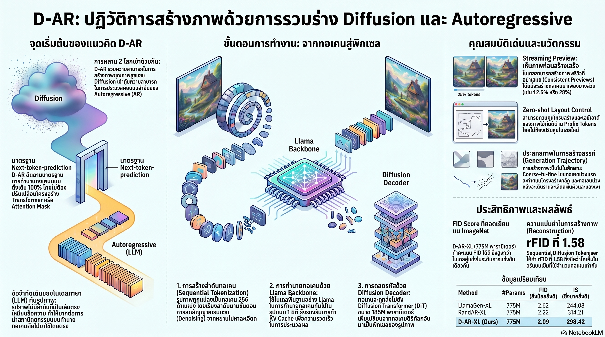

[กลับไปที่หน้าหลัก](../README.md)

สวัสดีครับเพื่อนๆ ที่ติดตามวงการ AI! วันนี้มาเรื่องที่พลิกสมมติฐานพื้นฐานของ Visual AI มาหลายปี: "การสร้างภาพและการสร้างข้อความต้องใช้สถาปัตยกรรมที่ต่างกันเสมอ" จากงานวิจัย D-AR (Diffusion via Autoregressive Models) ที่พิสูจน์ว่า AI สามารถ "วาดภาพ" ได้ด้วยหลักการเดียวกับที่มัน "พิมพ์ข้อความ" ทุกประการครับ

คุณเคยสงสัยไหมครับว่า ถ้า LLM อย่าง GPT หรือ Llama เก่งมากเพราะใช้หลักการง่ายๆ อย่าง "ทายคำถัดไป" แล้วทำไมการสร้างภาพถึงต้องใช้ Diffusion Model ที่ซับซ้อนกว่า ทำ Denoising หลายรอบ และยังต้องพึ่ง VAE อีกชั้น ทำไมถึงรวมมันเข้าด้วยกันโดยตรงไม่ได้ครับ?

คุณรู้ไหมครับว่า ที่ผ่านมาทุกครั้งที่นักวิจัยพยายามนำโครงสร้าง Autoregressive มาใช้กับภาพโดยตรง ผลลัพธ์มักจะแย่มาก เพราะภาพไม่ได้เป็นลำดับเส้นตรงแบบภาษา และการเรียงพิกเซลจากซ้ายไปขวาไม่ได้สะท้อนความหมายของภาพแต่อย่างใดครับ?

และคุณเคยนึกไหมครับว่า ถ้ามีวิธีแปลง "กระบวนการ Diffusion" ทั้งหมดให้กลายเป็น "โทเค็นลำดับเดียว" ที่โมเดล LLM มาตรฐานเข้าใจได้ทันที โดยไม่ต้องแก้ไขอะไรเลย จะเปิดประตูให้ภาพและภาษาอยู่ในสถาปัตยกรรมเดียวกันได้จริงๆ ครับ?

งานวิจัยนี้กำลังบอกว่า: กำแพงระหว่างโลกภาษาและโลกภาพไม่ได้เกิดจากธรรมชาติของข้อมูล แต่เกิดจากการที่เราออกแบบ Tokenizer ไม่ถูกต้องมาตลอดครับ

========================================

🤔 ทบทวนความเชื่อเดิมๆ: สิ่งที่เราคิดเกี่ยวกับการสร้างภาพด้วย AI

▪ "Diffusion Model และ Autoregressive Model เป็นคนละกระบวนทัศน์ที่รวมกันไม่ได้ในทางปฏิบัติ ต้องเลือกอย่างใดอย่างหนึ่ง" → D-AR พิสูจน์ว่าสองกระบวนทัศน์นี้ไม่ได้ขัดแย้งกัน แต่กลมกลืนกันได้อย่างสมบูรณ์ โดยใช้ Sequential Diffusion Tokenizer แปลงกระบวนการ Denoising ทั้งหมดให้เป็นโทเค็นลำดับที่ Autoregressive Model ประมวลผลได้ทันทีครับ

▪ "การสร้างภาพที่ดีต้องพึ่ง VAE (Variational Autoencoder) เพื่อบีบอัดภาพเข้า Latent Space ก่อน ทำโดยตรงบน Raw Pixels ไม่ได้ผลจริงๆ" → D-AR ทำงานบน Raw Pixels โดยตรงผ่าน Pixel Diffusion Transformer ที่ฝึกด้วย Flow Matching และ Velocity Prediction โดยไม่ต้องพึ่ง VAE เลยแม้แต่น้อยครับ และผล FID 2.09 บน ImageNet ก็พิสูจน์ว่าไม่ได้แย่กว่าด้วย

▪ "โมเดลภาพต้องสร้างเนื้อหาทั้งหมดก่อนจึงจะเห็นผลลัพธ์ได้ ไม่มีทางดูผลลัพธ์บางส่วนระหว่างที่ AI ยังทำงานไม่เสร็จ" → Streaming Previews ของ D-AR ทลายข้อจำกัดนี้โดยสิ้นเชิง เราสามารถเห็นภาพพรีวิวที่สะท้อนผลลัพธ์สุดท้ายได้อย่างแม่นยำตั้งแต่ AI สร้างโทเค็นได้เพียง 12.5% เท่านั้นครับ

▪ "การควบคุม Layout และองค์ประกอบของภาพที่สร้างขึ้นใหม่จำเป็นต้อง Finetune โมเดลใหม่ทุกครั้ง ไม่มีทาง Zero-shot ได้ผลดีพอ" → Zero-shot Layout Control ผ่าน Prefix tokens ช่วยให้เราโอน Pose และ Composition จากภาพอ้างอิงไปยังภาพใหม่ที่ต่างหัวข้อได้ทันทีโดยไม่ต้อง Finetune เลยสักครั้ง อย่างกรณี Giant Panda → Golden Retriever ที่ตำแหน่งทุกส่วนตรงกันแม่นยำครับ

ความจริงที่น่าคิดคือ: ความซับซ้อนของ Visual Generation ที่เราเห็นมาตลอดไม่ได้เกิดจากธรรมชาติของข้อมูลภาพ แต่เกิดจากการที่เราออกแบบ Pipeline ที่ข้ามขั้นตอนสำคัญบางอย่างไปครับ

========================================

🧠 พื้นฐานที่ต้องเข้าใจก่อน: D-AR, Sequential Diffusion Tokenizer, Flow Matching และ Autoregressive Generation

=== D-AR ต่างจาก Diffusion Model และ AR Model แบบเดิมอย่างไร? ===

[Diffusion Model แบบดั้งเดิม (เช่น Stable Diffusion)]
▸ กระบวนการ: เพิ่มสัญญาณรบกวน (Noise) ลงในภาพแล้วค่อยๆ ขจัดออกหลายรอบ
▸ ความต้องการ: พึ่ง VAE ในการบีบอัดภาพ + U-Net หรือ Transformer ขนาดใหญ่
▸ ข้อจำกัด: ไม่ Compatible กับ LLM Infrastructure และ KV-Cache ครับ

[Autoregressive Image Model แบบดั้งเดิม (เช่น LlamaGen)]
▸ กระบวนการ: Quantize ภาพเป็น Discrete Tokens แล้วทายทีละโทเค็น
▸ ปัญหา: การเรียงพิกเซลหรือ Patch จากซ้ายไปขวาไม่สะท้อนโครงสร้างความหมายของภาพครับ

[D-AR]
▸ กระบวนการ: แปลงขั้นตอน Diffusion แต่ละ Step ให้เป็น Continuous Token ใน Sequence
▸ สิ่งที่ได้: ใช้ Llama Architecture 100% รวมถึง KV-Cache และ Causal Mask มาตรฐานโดยไม่ต้องแก้อะไรเลยครับ

=== Sequential Diffusion Tokenizer คืออะไร? ===

Sequential Diffusion Tokenizer = หัวใจของ D-AR คือ Pixel Diffusion Transformer ขนาด 185 ล้านพารามิเตอร์ ที่ทำหน้าที่แปลงภาพเป็น Sequence ของ Continuous Tokens

วิธีทำงาน: รับภาพแล้วจำลองกระบวนการ Diffusion หลายขั้นตอน จากนั้นแต่ละขั้นตอนกลายเป็นโทเค็นหนึ่งตัวใน Sequence ที่เรียงตาม "ระดับความละเอียด" จากหยาบไปละเอียดครับ

ผลลัพธ์: ภาพหนึ่งภาพ = Sequence ของโทเค็นเพียง 256 ตัว ที่ AR Model ทายได้ทีละตัวเหมือนทายคำในประโยคครับ

=== Flow Matching และ Velocity Prediction คืออะไร? ===

Flow Matching = เทคนิคการฝึก Tokenizer ให้เรียนรู้ "เส้นทางที่เป็นธรรมชาติที่สุด" ในการเปลี่ยนภาพจาก Noise ไปยัง Clean Image

Velocity Prediction = แทนที่จะทำนาย Noise โดยตรง โมเดลทำนาย "ทิศทางและความเร็ว" ของการเปลี่ยนแปลง ทำให้ Sequence ที่ได้มีโครงสร้างที่สอดคล้องกันตลอดทั้งชุดครับ

========================================

1) Coarse-to-Fine: เมื่อ AI วาดภาพเหมือนจิตรกรที่ฝีมือเฉียบขาด

หนึ่งในความงดงามทางเทคนิคของ D-AR คือวิธีที่มัน "เรียงลำดับ" โทเค็น ซึ่งไม่ใช่การเรียงพิกเซลจากซ้ายไปขวาแบบไร้ความหมาย แต่เป็นการจัดลำดับตาม "ระดับความสำคัญเชิงความหมาย" ที่ AI เรียนรู้มาโดยธรรมชาติครับ

เปรียบเสมือนจิตรกรที่วาดภาพจิตรกรรมฝาผนังวิหาร: ขั้นแรกคือการร่างโครงสร้างหลัก (Layout) ว่าพระพุทธรูปอยู่ตรงไหน เทวดาอยู่ตรงไหน จักรวาลและภูเขาอยู่ตรงไหน แล้วค่อยลงรายละเอียดลวดลายและสีสันในภายหลัง ไม่ใช่เริ่มจากการลงรายละเอียดพิกเซลมุมบนซ้ายก่อนครับ

ในทางเทคนิค:
— โทเค็นชุดแรก (Low-frequency global semantics): กำหนดองค์ประกอบหลัก Composition และโทนสีรวมของภาพทั้งใบ
— โทเค็นชุดถัดมา (Localized details): เพิ่มรายละเอียดของวัตถุแต่ละชิ้น โครงสร้างเฉพาะ และพื้นผิวที่ซับซ้อน

ความสำคัญของการเรียงลำดับนี้คือ Autoregressive Model เรียนรู้ "ตรรกะของการสร้างภาพ" ตามธรรมชาติ ทำให้โทเค็นแต่ละตัวที่ทายออกมามีบริบทที่ถูกต้องครับ เหมือนกับที่การทายคำถัดไปในประโยคภาษาได้ผลดีก็เพราะภาษามีโครงสร้างที่คาดเดาได้ในระดับหนึ่ง — D-AR นำโครงสร้างแบบเดียวกันนั้นมาสร้างให้กับภาพครับ

========================================

2) Streaming Previews: เห็นผลก่อน AI คิดเสร็จ เหมือนโต๊ะทำงาน X-ray

ฟีเจอร์ที่น่าทึ่งที่สุดในแง่ประสบการณ์ใช้งานคือ Consistent Previews ซึ่งเกิดได้เพราะโครงสร้างของ D-AR นั้นโปร่งใสและคาดเดาได้ครับ

ลองนึกภาพว่าคุณกำลังสั่ง "แกะสลักพระพุทธรูปหินอ่อน" ในโลกปกติคุณต้องรอให้ช่างแกะสลักทำงานจนเสร็จ 100% ถึงจะเห็นว่าได้ตามที่ต้องการหรือไม่ แต่ถ้าช่างสลักแกะโครงสร้างหลักออกมาก่อนเพียงแค่ 12% คุณก็พอจะเห็นแล้วว่า "ใบหน้าหันผิดทาง" และบอกให้แก้ไขได้ทันทีโดยไม่ต้องรอให้ทำงานเสร็จทั้งชิ้นครับ

ใน D-AR กระบวนการนี้เป็นอย่างนั้นจริงๆ:
— ที่ 12.5% ของโทเค็น: เห็น Layout หลักและองค์ประกอบรวมของภาพ
— ที่ 25% ของโทเค็น: เห็นรายละเอียดระดับกลางและโทนสี
— Jump-estimate: สามารถ "กระโดด" จากโทเค็นที่มีอยู่ไปประเมินผลลัพธ์สุดท้ายได้ทันทีแทบไม่มีต้นทุนคำนวณเพิ่มครับ

นี่คือความต่างระหว่าง "กล่องดำที่ต้องรอผลลัพธ์" กับ "กระจกใสที่มองเห็นความคิดระหว่างทาง" ซึ่งสำคัญมากในโลกการทำงานจริงที่นักออกแบบต้องตัดสินใจว่าภาพที่กำลังสร้างนั้นตรงกับจินตนาการหรือไม่ครับ

========================================

3) Zero-shot Layout Control: โอน "โครงร่าง" ได้โดยไม่ต้องฝึกใหม่

ความสามารถที่พิสูจน์ว่า D-AR เข้าใจภาพในระดับที่ลึกกว่าคือ Zero-shot Layout Control ซึ่งเกิดจากคุณสมบัติของ Sequential Tokenization ที่ทำให้โทเค็นชุดแรกๆ แทนความหมายเชิงโครงสร้างโดยธรรมชาติครับ

เปรียบเสมือนช่างตัดเสื้อที่มีแพทเทิร์น (Pattern) ของชุดราตรีดีไซเนอร์ชิ้นหนึ่ง แล้วนำแพทเทิร์นนั้นมาใช้ตัดชุดอีกแบบหนึ่งตามคำสั่งใหม่ โครงสร้างการตัด ความกว้าง และสัดส่วนยังคงเดิมทั้งหมด เพียงแต่เปลี่ยนผ้าและลายปักครับ

กระบวนการใน D-AR:
— นำโทเค็นชุดแรกจากภาพ "Giant Panda นั่งหันหน้าซ้าย" มาเป็น Prefix tokens
— ส่ง Prefix เหล่านั้นพร้อม Label ใหม่ว่า "Golden Retriever"
— D-AR จะเติมโทเค็นที่เหลือโดยรักษา Pose, Composition และ Spatial Layout เดิมไว้ทั้งหมด
— ยิ่งให้ Prefix tokens มาก (8, 16, 32 โทเค็น) ยิ่งควบคุม Fine-grained details เช่น พื้นผิวขน ทิศทางแสงเงา ได้ละเอียดขึ้นครับ

สิ่งที่ทำให้ฟีเจอร์นี้โดดเด่นคือ "ไม่ต้อง Finetune" เลยสักครั้ง เป็น Zero-shot จริงๆ เพราะความสามารถนี้ไม่ได้มาจากการฝึกพิเศษ แต่มาจากโครงสร้างของ Tokenizer ที่ออกแบบให้โทเค็นต้นๆ แทนความหมายเชิงโครงสร้างโดยธรรมชาติครับ

========================================

4) ประสิทธิภาพที่ทลายขนาด: เล็กกว่าแต่ชนะทุกตัวที่ใหญ่กว่า

ความงดงามของ D-AR ในแง่ตัวเลขคือการพิสูจน์หลักการที่ว่า "สถาปัตยกรรมที่ถูกต้องทำงานได้ดีกว่าขนาดที่ใหญ่กว่า" บน ImageNet 256×256 Benchmark ครับ

ตัวเลขที่น่าสนใจ:
— D-AR-XL (775M พารามิเตอร์): FID 2.09
— IBQ-XL (1.1B พารามิเตอร์, ใหญ่กว่า 42%): FID 2.14 → แพ้ D-AR
— LlamaGen-XXL (1.4B พารามิเตอร์, ใหญ่กว่า 81%): FID 2.34 → แพ้ D-AR ขาดลอยครับ

(FID ยิ่งต่ำยิ่งดี = ภาพสมจริงกว่า)

ข้อได้เปรียบที่มาพร้อมกัน:
— 256 โทเค็นต่อภาพ: กระชับกว่า AR Model แบบดั้งเดิมที่ใช้ 512-1024 โทเค็น
— KV-Cache รองรับทันที: เพราะเป็น Llama Architecture 100% ทำให้ inference เร็วขึ้นมากในโลกจริง
— ไม่ต้อง VAE: ลด Pipeline Complexity และ Latency ลงอย่างมีนัยสำคัญครับ

เปรียบได้กับนักวิ่งมาราธอนที่มีน้ำหนักตัวน้อยกว่าคู่แข่งทุกคน แต่ชนะเพราะมีเทคนิคการวิ่งที่ถูกต้องกว่า ไม่ใช่เพราะขาที่ยาวกว่าหรือกล้ามเนื้อที่ใหญ่กว่าครับ

========================================

5) Llama-Compatible ทั้งหมด: ประตูสู่ Unified Multimodal System ที่เป็นจริงได้

สิ่งที่ D-AR นำเสนอในระยะยาวนั้นสำคัญกว่าแค่ตัวเลข FID คือการที่ภาพและภาษาสามารถอยู่ใน Architecture เดียวกันได้จริงครับ

เปรียบได้กับการที่ระบบไฟฟ้าในบ้านและรถยนต์ไฟฟ้าใช้มาตรฐาน Plug เดียวกันในที่สุด: แทนที่จะต้องมีอุปกรณ์ชาร์จและ Converter แยกกัน สิ่งต่างๆ เชื่อมถึงกันได้ทันทีโดยไม่ต้องแปลงมาตรฐานอีกต่อไปครับ

ใน Ecosystem ของ AI:
— โมเดลเดียวสามารถ "อ่านและเขียน" ทั้งข้อความและภาพในลักษณะเดียวกัน
— Optimization ทุกอย่างที่ทำสำหรับ LLM (Quantization, KV-Cache, Speculative Decoding) ใช้ได้กับ Visual Generation ทันที
— ต้นทุน Infrastructure ลดลง เพราะไม่ต้องดูแลระบบสองชุดแยกกันครับ

"D-AR recasts the image diffusion process as a vanilla autoregressive procedure in the standard next-token-prediction fashion."

ประโยคนี้สั้นมาก แต่หมายความว่า: กำแพงที่เราสร้างระหว่างโลกภาษาและโลกภาพมาหลายปีนั้น ไม่ได้เกิดจากธรรมชาติของข้อมูล แต่เกิดจากการที่เราหยิบเครื่องมือผิดชิ้นมาตลอดครับ

========================================

🎯 สรุป: D-AR ไม่ใช่แค่โมเดลภาพชิ้นใหม่ แต่คือ Manifesto ของ Unified Architecture

D-AR (Diffusion via Autoregressive Models) พิสูจน์สิ่งสำคัญ 5 ประการครับ:

หนึ่ง — Sequential Diffusion Tokenizer (185M params + Flow Matching) แปลงกระบวนการ Denoising ทั้งหมดให้เป็น Sequence โทเค็นที่ Llama Architecture ประมวลผลได้โดยไม่ต้องแก้ไขอะไรเลย

สอง — Coarse-to-Fine Ordering ทำให้โทเค็นแต่ละตัวมีบริบทที่สมเหตุสมผล โดยโทเค็นแรกๆ แทน Global Structure และโทเค็นหลังๆ แทน Fine-grained Details เหมือนจิตรกรที่ร่างโครงก่อนลงสีครับ

สาม — Streaming Previews ช่วยให้เห็นผลลัพธ์ที่แม่นยำได้ตั้งแต่ 12.5% ของกระบวนการ ผ่าน Jump-estimate โดยไม่มีต้นทุนคำนวณเพิ่มครับ

สี่ — Zero-shot Layout Control ผ่าน Prefix tokens ช่วยโอน Pose และ Composition จากภาพอ้างอิงไปยังหัวข้อใหม่ได้ทันทีโดยไม่ต้อง Finetune ซักครั้งครับ

ห้า — D-AR-XL (775M) ทำ FID 2.09 เหนือกว่า IBQ-XL (1.1B) ที่ FID 2.14 และ LlamaGen-XXL (1.4B) ที่ FID 2.34 พร้อมรองรับ KV-Cache และ LLM Infrastructure ทั้งหมดโดยไม่ต้องเพิ่ม Pipeline ใดๆ ครับ

เส้นทางสู่ Unified Multimodal System ไม่ใช่การสร้างโมเดลที่ "ยิ่งใหญ่กว่าเดิม" แต่คือการออกแบบ Tokenizer ที่ถูกต้องพอที่จะทำให้ภาพและภาษาพูดภาษาเดียวกันได้ครับ

========================================

💬 คำถามชวนคิด:

ถ้า D-AR พิสูจน์ว่าภาพและภาษาสามารถอยู่ใน Architecture เดียวกันได้จริง คุณคิดว่าขั้นตอนถัดไปที่น่าตื่นเต้นที่สุดในการพัฒนา Unified Multimodal System คืออะไรครับ? เช่น ภาพเคลื่อนไหว (Video), เสียง (Audio), หรือ 3D Objects ที่ใช้หลักการเดียวกันนี้ได้ด้วย?

และถ้า Streaming Previews ให้เราเห็น "ความคิดระหว่างทาง" ของ AI ขณะสร้างภาพ มันจะเปลี่ยนวิธีที่นักออกแบบและนักสร้างสรรค์ทำงานร่วมกับ AI อย่างไรบ้างครับ?

========================================

References:
- D-AR: Diffusion via Autoregressive Models (2025)
- Sequential Diffusion Tokenizer: 185M parameter Pixel Diffusion Transformer with Flow Matching and Velocity Prediction
- Benchmark: ImageNet 256×256 — D-AR-XL FID 2.09 vs IBQ-XL 2.14 (1.1B) vs LlamaGen-XXL 2.34 (1.4B)
- Zero-shot Layout Control via Prefix tokens (8/16/32 token variants)
- Streaming Previews at 12.5% and 25% token generation milestones

========================================

ยิ่งเราออกแบบ Tokenizer ที่ดีขึ้น ยิ่งพรมแดนระหว่างสิ่งที่ AI "รู้สึก" และสิ่งที่มันสร้างขึ้นเลือนลางลง และนั่นคือจุดที่น่าตื่นเต้นที่สุดในวงการนี้ครับ ✨

#DAR #DiffusionModels #AutoregressiveGeneration #VisualAI #NextTokenPrediction #MultimodalAI #FlowMatching #ImageGeneration #LlamaArchitecture #AIResearch #DeepLearning #ComputerVision #GenerativeAI #UnifiedMultimodal #KVCache #StreamingPreview #ZeroShotControl #SequentialTokenization #PixelDiffusion #AIThailand
