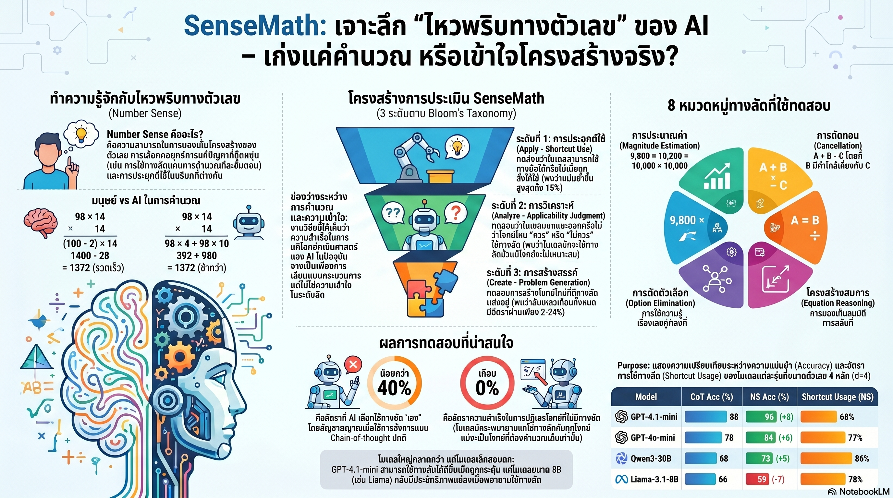

[กลับไปที่หน้าหลัก](../README.md)

สวัสดีครับเพื่อนๆ ที่สนใจ AI และคณิตศาสตร์! วันนี้มาเรื่องที่ฟังดูเหมือนขัดแย้งในตัวเอง แต่พิสูจน์ได้ด้วยงานวิจัย นั่นคือ AI ที่คำนวณได้เร็วกว่ามนุษย์หลายล้านเท่า อาจกำลัง "ไม่เข้าใจ" ตัวเลขเลยก็ได้ครับ

คุณเคยเจอเพื่อนที่คูณเลขได้เร็วมาก แต่พอถามว่า 98 x 14 ควรคิดอย่างไรให้ง่ายที่สุด เขากลับนั่งคำนวณยาวๆ แทนที่จะรู้ทันทีว่า ก็แค่ (100-2) x 14 ไม่ใช่หรอ?

คุณเคยสงสัยไหมครับว่า GPT-4 ที่แก้โจทย์คณิตศาสตร์ยากๆ ได้ มันเข้าใจ "โครงสร้าง" ของตัวเลขจริงๆ หรือแค่ "ท่องสูตร" มาอย่างแม่นยำ?

และคุณรู้ไหมครับว่า มีโมเดล AI บางรุ่นที่เมื่อถูกถามว่า "โจทย์นี้มีทางลัดไหม?" มันตอบว่า "มี" กับทุกโจทย์ที่ถาม รวมถึงโจทย์ที่ไม่มีทางลัดจริงๆ อยู่เลยด้วย?

ทีมวิจัย SenseMath จาก University of Notre Dame เพิ่งเผยแพร่งานวิจัยที่ทดสอบ AI ด้วยกรอบแนวคิด Bloom's Taxonomy ผลที่ได้พิสูจน์ว่าความสามารถในการ "คำนวณได้" กับความสามารถในการ "เข้าใจตัวเลข" เป็นคนละเรื่องกันอย่างสิ้นเชิงครับ

========================================

🤔 ทบทวนความเชื่อเดิมๆ: สิ่งที่เราคิดเกี่ยวกับ AI กับคณิตศาสตร์

▪ "AI ที่คำนวณได้ถูกต้อง แสดงว่ามันเข้าใจตัวเลข" → การได้คำตอบถูกต้องกับการเข้าใจโครงสร้างของปัญหาเป็นคนละทักษะกัน เหมือนนักเรียนที่จำสูตรได้แม่น ≠ นักเรียนที่เข้าใจว่าสูตรนั้นมาจากไหนครับ

▪ "ถ้าโมเดลใหญ่กว่า ก็ฉลาดกว่าในทุกมิติ" → โมเดลขนาด 8B บางรุ่นกลับ "แย่ลง" เมื่อพยายามใช้วิธีคิดอัจฉริยะ แสดงว่าขนาดไม่ได้การันตีความเข้าใจในทุกมิติ

▪ "ถ้า AI ตอบว่ามีทางลัด มันก็ต้องมีทางลัดจริงๆ" → GPT-4o-mini ตอบว่า "มีทางลัด" กับโจทย์ทุกข้อที่ถาม รวมถึงโจทย์ที่ไม่มีทางลัดอยู่จริงๆ เลย อัตราปฏิเสธ 0%!

▪ "AI สามารถสร้างโจทย์ที่ดีสำหรับฝึกทักษะการคิดลัดได้" → Pass rate ของการสร้างโจทย์แบบนี้อยู่แค่ 2-24% เท่านั้น ส่วนใหญ่สร้างโจทย์ที่ "ดูเหมือนง่าย" แต่จริงๆ ไม่มีทางลัดที่ใช้ได้จริงครับ

ความจริงที่น่าคิดคือ: "Number Sense" หรือ "ไหวพริบตัวเลข" ไม่ใช่แค่การคำนวณได้เร็ว แต่คือการมองเห็น "โครงสร้างที่ซ่อนอยู่" ในตัวเลข ซึ่งเป็นทักษะที่ AI ส่วนใหญ่ยังขาดอยู่มากครับ

========================================

🧠 พื้นฐานที่ต้องเข้าใจก่อน: Bloom's Taxonomy, Number Sense และ Chain-of-Thought

=== Bloom's Taxonomy คืออะไร? ===

Bloom's Taxonomy = กรอบจัดระดับทักษะการเรียนรู้ที่ครูและนักการศึกษาใช้กันทั่วโลก แบ่งออกเป็น 6 ระดับจากง่ายไปยาก:

[ระดับต่ำ]
▸ จำ (Remember): ท่อง, จดจำ
▸ เข้าใจ (Understand): อธิบายได้
▸ ประยุกต์ใช้ (Apply): นำไปใช้ในสถานการณ์ใหม่

[ระดับสูง]
▸ วิเคราะห์ (Analyze): แยกแยะ, เข้าใจโครงสร้าง
▸ ประเมิน (Evaluate): ตัดสิน, วิจารณ์
▸ สร้างสรรค์ (Create): สร้างสิ่งใหม่ขึ้นมา

งานวิจัย SenseMath ทดสอบ AI ใน 3 ระดับบนสุดครับ คือ Apply, Analyze และ Create เพื่อดูว่า AI ไปถึงระดับไหนจริงๆ

=== Number Sense คืออะไร? ===

Number Sense = ความสามารถในการ "รับรู้โครงสร้าง" ของตัวเลขและเลือกกลยุทธ์การคำนวณได้อย่างยืดหยุ่น

เปรียบเทียบ: ลองคิดถึงการเดินทางครับ คนที่มี "ทักษะขับรถ" (Procedural) = รู้กฎจราจร, เปลี่ยนเกียร์ได้, หยุดรถได้ แต่คนที่มี "ทักษะนำทาง" (Number Sense) = รู้ว่าเส้นทางไหนเร็วกว่า, หลีกเลี่ยงรถติด, ปรับแผนเมื่อเจอสิ่งกีดขวาง AI ส่วนใหญ่ขับรถได้ดีมาก แต่ยังนำทางได้ไม่เก่งเลยครับ

ตัวอย่าง Number Sense จริงๆ:
▸ 98 x 14 → รู้ทันทีว่า = (100 - 2) x 14 = 1400 - 28 = 1372 คิดในหัวได้ง่ายกว่า
▸ 25 x 36 → รู้ว่า = 25 x 4 x 9 = 100 x 9 = 900 เพราะ 25 x 4 = 100 พอดี
▸ 999 x 7 → รู้ว่า = (1000 - 1) x 7 = 7000 - 7 = 6993 ไม่ต้องคูณยาวเลย

=== Chain-of-Thought (CoT) คืออะไร? ===

Chain-of-Thought = เทคนิคการเขียน Prompt ที่บอกให้ AI "คิดทีละขั้นตอน" แทนที่จะตอบทันที

เปรียบเทียบ: เหมือนการสั่งให้ลูกน้องทำงานพร้อมกับเขียน "วิธีทำ" ไปด้วย แทนที่จะส่งงานมาเฉยๆ ช่วยให้เห็นกระบวนการคิดและจับผิดได้ง่ายขึ้น CoT ช่วยให้ AI แม่นยำขึ้นในหลายงาน แต่ในกรณีนี้ แม้จะใช้ CoT AI ก็ยังไม่ค่อยเลือก "ทางลัด" เองครับ

=== Number Sense Prompt (NS Prompt) คืออะไร? ===

NS Prompt = การเขียน Prompt แบบพิเศษที่ "บอกใบ้" ให้ AI รู้ว่าควรมองหาทางลัดและใช้ไหวพริบตัวเลข แทนที่จะคำนวณตรงๆ

ผลของ NS Prompt น่าทึ่งมากครับ เพราะมันพิสูจน์ว่า AI "มีความสามารถ" ซ่อนอยู่ แต่ไม่นำมาใช้เองโดยอัตโนมัติ ต้องถูก "เตือน" ก่อนถึงจะใช้

========================================

1️⃣ AI มีทางลัดในตัว แต่แทบไม่หยิบออกมาใช้เอง (ระดับ Apply)

=== ทดสอบ: 98 x 14 คุณจะทำอย่างไร? ===

วิธีที่ "AI ส่วนใหญ่เลือก" แม้จะมีทางลัดอยู่:
▸ 98 x 14 = 98 x 10 + 98 x 4 = 980 + 392 = 1,372 (คำนวณยาว ขั้นตอนเยอะ)

วิธีที่ "มนุษย์ที่มี Number Sense เลือก":
▸ 98 x 14 = (100 - 2) x 14 = 1,400 - 28 = 1,372 (สองขั้นตอน คิดในหัวได้)

[ผลการทดสอบที่น่าตกใจ]
▸ ภายใต้ CoT ปกติ: AI เลือกทางลัดน้อยกว่า 40% เท่านั้น
▸ แม้ว่า AI "รู้" ว่าทางลัดมีอยู่ (เพราะเคยเจอในการฝึก) แต่มันเลือกวิธียาวๆ โดยอัตโนมัติ
▸ เมื่อใช้ NS Prompt: GPT-4.1-mini แม่นยำขึ้นสูงสุด +15% ในโจทย์เลข 8 หลัก!

[สิ่งที่นี่แสดงให้เห็น]
▸ ความสามารถ Number Sense "มีอยู่" ในโมเดล แต่ถูก Default ให้ใช้วิธีตรงๆ เสมอ
▸ AI แยก "รู้ว่ามีทางลัด" ออกจาก "เลือกใช้ทางลัดเอง" ไม่ได้
▸ นี่คือช่องว่างระหว่าง Procedural Fluency (ทำตามขั้นตอนได้แม่น) กับ Strategic Flexibility (รู้ว่าควรใช้กลยุทธ์ไหน)

เปรียบเทียบ: เหมือนนักเรียนที่ท่องสูตรทางลัดได้ แต่พอเจอโจทย์จริงยังนั่งคิดยาวๆ เหมือนเดิม ความรู้อยู่ในหัว แต่ยังไม่กลายเป็น "สัญชาตญาณ" ครับ

========================================

2️⃣ ยิ่งตัวเลขมากหลัก AI รุ่นเล็กยิ่งพัง (แต่รุ่นใหญ่เริ่มฉลาดขึ้น)

=== ทดสอบด้วยตัวเลข 2 ถึง 16 หลัก ===

งานวิจัยทดสอบว่า เมื่อโจทย์ยากขึ้น AI แต่ละรุ่นจะปรับตัวอย่างไร?

[สิ่งที่คาดว่าจะเกิด]
▸ โจทย์ยากขึ้น → AI พยายามหาทางลัดมากขึ้น → แม่นยำขึ้น

[สิ่งที่เกิดขึ้นจริง: แยกตามขนาดโมเดล]

[โมเดลรุ่นใหญ่ (GPT-4.1-mini, Qwen3-32B)]
▸ เมื่อโจทย์ซับซ้อนขึ้น เริ่มหาทางลัดมากขึ้นเองโดยอัตโนมัติ
▸ ความแม่นยำดีขึ้นเมื่อใช้ NS Prompt
▸ เริ่มแสดงสัญญาณของ Strategic Awareness (ตระหนักว่าควรเปลี่ยนกลยุทธ์)

[โมเดลรุ่นเล็ก (Llama-3.1-8B, Qwen3-8B)]
▸ Negative Gain: ความแม่นยำ "ลดลง" เมื่อพยายามใช้ Number Sense!
▸ โมเดลพยายาม "คิดลัด" แต่ฐานความเข้าใจไม่แข็งแรงพอ เลยผิดพลาดมากขึ้น
▸ เหมือนคนที่รู้ว่าควรวิ่งลัดทุ่ง แต่ไม่รู้ว่าทุ่งมีหลุมอยู่ที่ไหนบ้าง

เปรียบเทียบ: เหมือนนักมวยมือใหม่ที่พยายามออกหมัดหลอก (Feint) ตามที่ดูในยูทูบ แต่เทคนิคพื้นฐานยังไม่แน่น ผลคือโดนตีซะเองแทนที่จะหลอกได้ รุ่นใหญ่เหมือนนักมวยมีประสบการณ์ที่เริ่มเล่นหลอกได้บ้างแล้วครับ

=== นัยสำคัญ ===

ถ้าคุณกำลังจะเลือก AI มาช่วยสอนคณิตศาสตร์หรือแก้ปัญหาที่ต้องการ Number Sense โมเดลรุ่นเล็กอาจไม่แค่ "ด้อยกว่า" แต่อาจ "สอนผิดทาง" ด้วยครับ

========================================

3️⃣ "หาเหตุผลเข้าข้างตัวเอง": AI ที่ไม่รู้จักปฏิเสธ (ระดับ Analyze)

=== โจทย์ที่ทดสอบ: "โจทย์นี้มีทางลัดไหม?" ===

งานวิจัยออกแบบบททดสอบ Applicability Judgment (J1) ที่ถาม AI ว่า โจทย์นี้เหมาะกับการใช้ทางลัดหรือไม่? โดยมีทั้งโจทย์ที่มีทางลัดจริงๆ และโจทย์ที่ "ไม่มีทางลัด" ปะปนกันไป

[สิ่งที่ AI ควรทำ]
▸ โจทย์ที่มีทางลัด: ตอบว่า "มี" และอธิบายทางลัดนั้น
▸ โจทย์ที่ไม่มีทางลัด (ตัวเลขสุ่ม ไม่มีโครงสร้างพิเศษ): ตอบว่า "ไม่มี" คำนวณตรงๆ ดีกว่า

[สิ่งที่ GPT-4o-mini ทำจริง]
▸ อัตราการปฏิเสธโจทย์ที่ไม่มีทางลัด = 0%
▸ แปลว่ามันตอบว่า "มีทางลัด" กับโจทย์ทุกข้อที่ถาม ไม่ว่าจะมีจริงหรือไม่ก็ตาม!
▸ มันสร้างคำอธิบายที่ฟังดูสมเหตุสมผลขึ้นมา แต่ในความเป็นจริงทางลัดนั้นไม่ได้ช่วยให้คิดง่ายขึ้นเลย

นักวิจัยเรียกอาการนี้ว่า "Over-rationalization" ครับ

=== Over-rationalization คืออะไรในทางปฏิบัติ? ===

[ตัวอย่างที่เกิดขึ้น]
โจทย์: 7,423 x 3,817 (ตัวเลขสุ่ม ไม่มีโครงสร้างพิเศษ)
AI ตอบ: "มีทางลัด! เราสามารถแบ่ง 7,423 เป็น 7,000 + 423 แล้วคูณแยก..."
ความจริง: นั่นไม่ใช่ทางลัด เป็นแค่การแตกตัวเลขออกมาซึ่งยากกว่าเดิม!

เปรียบเทียบ: เหมือนที่ปรึกษาที่ถูกถามว่า "โปรเจ็กต์นี้ควรเดินหน้าต่อไหม?" แล้วตอบ "ควร!" กับทุกโปรเจ็กต์ที่ถาม โดยไม่เคยบอกว่าบางโปรเจ็กต์ควรยกเลิก เพราะมันถูก Default มาให้ "หาเหตุผลสนับสนุน" เสมอครับ

=== ทำไมนี่ถึงเป็นปัญหาใหญ่? ===

▸ ถ้าคุณใช้ AI เป็นติวเตอร์คณิตศาสตร์ AI อาจสอนให้นักเรียนเชื่อว่า "ทุกโจทย์มีทางลัด" ซึ่งผิดมากครับ
▸ ทักษะ Number Sense ที่แท้จริงต้องรู้ว่า "เมื่อไหรควรใช้ทางลัด และเมื่อไหรควรคำนวณตรงๆ"
▸ AI ที่ตอบว่ามีทางลัดเสมอกำลังสอน "นิสัยเสีย" ให้กับผู้เรียนโดยไม่รู้ตัว

========================================

4️⃣ AI เลียนแบบรูปแบบได้ดี แต่สร้างโครงสร้างใหม่ไม่ได้ (ระดับ Create)

=== บททดสอบสุดท้าย: "ลองสร้างโจทย์ที่มีทางลัดขึ้นมาเองสิ" ===

นี่คือบทพิสูจน์ที่โหดที่สุดครับ ถ้า AI "เข้าใจ" Number Sense จริงๆ มันควรสร้างโจทย์ที่:
▸ มีทางลัดที่ใช้ได้จริง (ทำให้คำนวณง่ายขึ้น)
▸ ท้าทายพอที่จะฝึกทักษะ
▸ ใช้โครงสร้าง Power-of-10 หรือโครงสร้างพิเศษอื่นๆ ที่ถูกต้อง

[ผลที่ได้]
▸ Pass rate รวม: แค่ 2-24% เท่านั้น!
▸ จุดที่ล้มเหลวมากที่สุด: Shortcut Existence (SC.Ex) ซึ่งตรวจว่าทางลัดที่อ้างถึงนั้น "ใช้ได้จริงหรือไม่"

[ตัวอย่างความผิดพลาดที่เห็นได้ชัด]
AI สร้างโจทย์: 4,800 x 2,100
AI อ้างว่า: "โจทย์นี้มีทางลัดเพราะเป็นเลขกลมๆ!"
ความจริง: โจทย์นี้ล้มเหลวเพราะไม่ได้ใช้ Power-of-10 (10^n) ที่แท้จริง
▸ 4,800 = 48 x 100 และ 2,100 = 21 x 100 ดังนั้น 4,800 x 2,100 = 48 x 21 x 10,000
▸ แต่ 48 x 21 ยังยากอยู่ ไม่ได้ง่ายขึ้นจริง!
โจทย์ที่ดีควรเป็น: 500 x 24 = 5 x 24 x 100 = 120 x 100 = 12,000 คิดในหัวได้ทันที

[ทำไมถึงเป็นแบบนี้?]
▸ AI เห็น "หน้าตา" ของโจทย์ที่มีทางลัด (เลขกลม, มีศูนย์ท้าย) แล้วเลียนแบบรูปแบบนั้น
▸ แต่ไม่เข้าใจ "ตรรกะเชิงลึก" ว่าอะไรทำให้ทางลัดนั้น "ใช้ได้จริง"
▸ นี่คือความต่างระหว่าง Surface Form (รูปแบบภายนอก) กับ Structural Understanding (ความเข้าใจโครงสร้าง)

เปรียบเทียบ: เหมือนนักเรียนที่ดูครูวาดภาพแล้วเลียนแบบได้ แต่พอถามว่า "ทำไมถึงวาดแบบนี้" อธิบายไม่ได้ และถ้าให้วาดภาพใหม่ที่ "สวยแบบเดียวกัน" ก็วาดออกมาไม่สวยเลยครับ

========================================

5️⃣ รุ่นโปร VS รุ่นประหยัด: ช่องว่างที่ชัดเจนและมีนัยสำคัญ

=== ตารางเปรียบเทียบผลการทดสอบ ===

งานวิจัยทดสอบหลายโมเดลและพบความต่างที่ชัดมากครับ:

[GPT-4.1-mini]
▸ ความแม่นยำเพิ่มขึ้นสูงสุดเมื่อใช้ NS Prompt: +15% (ที่โจทย์เลข 8 หลัก)
▸ อัตราปฏิเสธโจทย์ที่ไม่มีทางลัด: 16% (ดีที่สุดในกลุ่มที่ทดสอบ)
▸ สรุป: ได้ประโยชน์จาก Number Sense มากที่สุด เริ่มมีวิจารณญาณ

[GPT-4o-mini]
▸ ได้ประโยชน์เฉพาะเมื่อโจทย์เหมาะสม
▸ อัตราปฏิเสธโจทย์ที่ไม่มีทางลัด: 0% (ตอบ "มีทางลัด" ทุกโจทย์!)
▸ สรุป: Over-rationalization รุนแรงที่สุด ใช้เป็นติวเตอร์อันตราย

[Llama-3.1-8B และ Qwen3-8B]
▸ Negative Gain: ยิ่งพยายามใช้ Number Sense ยิ่งแม่นยำน้อยลง
▸ อัตราปฏิเสธ: พอมีบ้าง แต่ความแม่นยำโดยรวมต่ำ
▸ สรุป: ฐานความเข้าใจไม่แข็งแรงพอ ไม่ควรใช้กับโจทย์ที่ต้องการ Number Sense สูง

=== ข้อสรุปที่สำคัญมากสำหรับผู้ใช้งาน ===

▸ "โมเดลใหญ่กว่า" ไม่ได้แปลว่า "ดีกว่าในทุกงาน" แต่ในงานที่ต้องการ Number Sense มันสำคัญมากครับ
▸ การเลือก AI มาช่วยสอนคณิตศาสตร์ต้องทดสอบเฉพาะด้านนี้ ไม่ใช่ดูแค่ Benchmark รวม
▸ NS Prompt สามารถ "ปลดล็อก" ความสามารถที่ซ่อนอยู่ได้ แต่ต้องรู้ว่าโมเดลไหนตอบสนองดีครับ

========================================

🎯 สรุป: 5 บทเรียนจาก SenseMath

▸ AI มีทางลัดในตัว แต่ไม่ꀨเลือกใช้เอง: ต้องถูก "เตือน" ด้วย NS Prompt ถึงจะหยิบออกมาใช้
▸ โมเดลรุ่นเล็กอาจแย่ลงเมื่อพยายามฉลาด: ฐานไม่แข็งแรง = คิดลัดผิดพลาดมากกว่าคิดตรงๆ
▸ Over-rationalization คือกับดักที่อันตราย: AI ที่ตอบว่า "มีทางลัด" กับทุกโจทย์กำลังสอนผิดโดยไม่รู้ตัว
▸ สร้างโครงสร้างใหม่ไม่ได้: Pass rate 2-24% พิสูจน์ว่า AI เลียนแบบผิวเผิน ไม่ใช่เข้าใจลึก
▸ ขนาดโมเดลสำคัญกับ Number Sense: รุ่นใหญ่เริ่มมีวิจารณญาณ รุ่นเล็กยังพัง

หลักการสำคัญ: "AI ที่คำนวณได้ถูกต้องและ AI ที่เข้าใจโครงสร้างของตัวเลขเป็นคนละสิ่งกันครับ งานวิจัย SenseMath ชี้ให้เห็นว่าเรายังอยู่ในช่วงที่ AI เก่งด้าน Procedural แต่ยังอ่อนด้าน Structural และความต่างนี้สำคัญมากในโลกจริง โดยเฉพาะในการศึกษาที่เราต้องการสอน 'วิธีคิด' ไม่ใช่แค่ 'คำตอบ'"

========================================

💬 คำถามท้ายทาย

1. ถ้า AI ที่เราใช้เป็นติวเตอร์คณิตศาสตร์มีอาการ Over-rationalization คือตอบว่ามีทางลัดกับทุกโจทย์ คุณคิดว่ามันจะสอนนักเรียนให้มี Number Sense ได้จริงๆ หรือกำลัง "สอนนิสัยเสีย" โดยไม่รู้ตัวครับ?

2. ช่องว่างระหว่าง "รู้ว่ามีทางลัด" กับ "เลือกใช้ทางลัดเองโดยอัตโนมัติ" ในมนุษย์เราพัฒนาได้จากอะไร? มันคือการฝึก, การเข้าใจลึก หรืออะไรอย่างอื่น? และ AI จะได้มันมาได้ยังไง?

3. Pass rate 2-24% ในการสร้างโจทย์ที่มีทางลัดจริงๆ คุณคิดว่ามันเป็นข้อจำกัดของ "ขนาดโมเดล" ที่แก้ได้ด้วยการเพิ่มพารามิเตอร์ หรือเป็นข้อจำกัดของ "วิธีการฝึก" ที่ต้องเปลี่ยนพื้นฐานการ Training?

4. ในวันที่ AI คำนวณได้เร็วและแม่นยำกว่ามนุษย์มาก เราควรสอน "Number Sense" ให้เด็กๆ อยู่ไหม? หรือมันจะกลายเป็นทักษะที่ล้าสมัยเหมือนการคูณแบบยาวที่เราไม่ต้องทำมือแล้ว?

========================================

References:
▸ SenseMath: A Comprehensive Benchmark for Evaluating Number Sense in Large Language Models — University of Notre Dame
▸ Bloom's Taxonomy — กรอบจัดระดับทักษะการเรียนรู้ (Anderson & Krathwohl, 2001)
▸ Chain-of-Thought Prompting Elicits Reasoning in Large Language Models — Wei et al., 2022
▸ Number Sense และ Procedural Fluency — National Council of Teachers of Mathematics (NCTM)
▸ GPT-4 Technical Report — OpenAI
▸ Llama 3 Model Card — Meta AI
▸ Qwen3 Technical Report — Alibaba Cloud

ในโลกที่ AI คำนวณได้เร็วกว่าเราหลายล้านเท่า สิ่งที่ยังทำให้มนุษย์มีเอกลักษณ์อาจไม่ใช่ความเร็ว แต่คือความสามารถในการ "มองเห็นความสวยงามของโครงสร้าง" ที่ซ่อนอยู่ในตัวเลข และถ้าวันไหน AI เข้าใจสิ่งนั้นได้จริงๆ โลกของคณิตศาสตร์จะเปลี่ยนไปอีกครั้งครับ 😊

#SenseMath #NumberSense #AIResearch #LLM #MathEducation #EdTech #GPT4 #BloomsTaxonomy #AILimitations #DeepLearning
