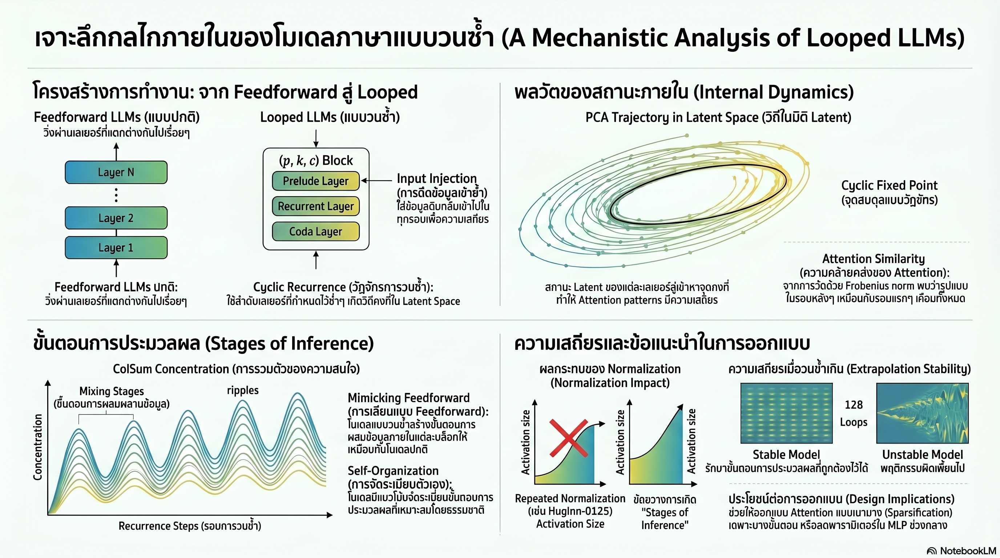

[กลับไปที่หน้าหลัก](../README.md)

สวัสดีครับเพื่อนๆ ที่ติดตามวงการ AI! วันนี้มาเรื่องที่เปลี่ยนคำถามจาก "AI ควรจะใหญ่แค่ไหน?" ให้กลายเป็น "AI ควรจะคิดซ้ำกี่รอบ?" ซึ่งเป็นโจทย์ที่อาจพลิกแนวทางการออกแบบสถาปัตยกรรมทั้งหมดครับ

คุณเคยสังเกตไหมครับว่า เวลาเราอ่านบทความซับซ้อนแล้วอ่านซ้ำอีกรอบ เราเข้าใจลึกขึ้นทั้งที่บทความเป็นบทความเดิม ทำไมไม่สร้าง AI แบบนั้นบ้าง แทนที่จะทำให้มันใหญ่ขึ้นเรื่อยๆ?

คุณเคยสงสัยไหมครับว่า เวลา AI ประมวลผลข้อมูลเดิมซ้ำๆ ในลูป มันแค่ "อ่านซ้ำโดยไม่มีจุดหมาย" หรือมีแบบแผนบางอย่างซ่อนอยู่ข้างในที่เราไม่เคยรู้มาก่อน?

และคุณรู้ไหมครับว่า ความลับว่าทำไม AI แบบลูปถึงทำงานได้ดีหรือแย่ขึ้นอยู่กับตัวเลือกสถาปัตยกรรมเพียงไม่กี่จุด และการเลือกผิดจุดเดียวอาจทำให้โมเดลที่ดูเสถียรกลับกลายเป็นโมเดลที่ "คิดแบนราบ" ตลอดชีวิต?

งานวิจัยนี้ไม่ได้แค่ทดสอบว่า Looped Reasoning ทำงานได้ไหม แต่เปิดฝากล่องดำแล้วตรวจสอบว่า "เกิดอะไรขึ้นข้างในสมองกลเมื่อมันคิดซ้ำ" ด้วย Mechanistic Analysis เชิงลึกครับ

========================================

🤔 ทบทวนความเชื่อเดิมๆ: สิ่งที่เราคิดเกี่ยวกับการสร้าง AI ที่ฉลาดขึ้น

▪ "AI ที่ฉลาดกว่าต้องมีพารามิเตอร์มากกว่า ความลึกต้องมาจากขนาด" → Looped Reasoning พิสูจน์ว่า Functional Depth สามารถแยกออกจากจำนวนพารามิเตอร์ได้ เลเยอร์ชุดเดิมที่ประมวลซ้ำ 8 รอบสามารถสร้างความลึกเทียบเท่าโมเดลที่มีเลเยอร์มากกว่า 8 เท่าได้ครับ

▪ "การวนซ้ำในลูปมั่วซั่ว AI จะสับสนหรือวนเวียนโดยไม่ลู่เข้าสู่คำตอบ" → มีหลักฐานว่าโมเดลจะลู่เข้าสู่ "Cyclic Fixed Points" ที่เสถียรโดยธรรมชาติ แต่ละเลเยอร์ในลูปจะมีจุดสมดุลเฉพาะตัว ทำให้เกิด "วงโคจรความคิด" ที่ชัดเจนขึ้นทุกรอบแทนที่จะสับสนครับ

▪ "โมเดลที่เสถียรกว่าคือโมเดลที่ดีกว่าเสมอ ยิ่ง Normalize มาก ยิ่งควบคุมได้" → Huginn-0125 พิสูจน์ว่า Normalization ที่เข้มข้นเกินไปกลับทำลาย Stages of Inference ที่จำเป็นสำหรับการคิดเชิงลึก โมเดลเสถียรแต่ "แบนราบ" ไม่มีขั้นตอนการประมวลผลที่ซับซ้อนได้ครับ

▪ "โมเดลแบบลูปกับโมเดลแบบทางเดียวทำงานต่างกันโดยสิ้นเชิง เปรียบกันไม่ได้" → เมื่อดูจาก Mechanistic Analysis พบว่าทั้งสองแบบสร้าง "ลำดับขั้นตอนการคิด" ที่คล้ายกันมาก (Mixing Stages → Compression → Mixing Stages) สถาปัตยกรรมต่างกันแต่กลยุทธ์การคิดบรรจบเข้าหากันครับ

ความจริงที่น่าคิดคือ: คำถามไม่ใช่ "ลูปหรือทางเดียว" แต่คือ "ทำอย่างไรให้ลูปสร้างขั้นตอนการคิดที่มีความหมาย ไม่ใช่แค่วนซ้ำโดยเปล่าประโยชน์" ครับ

========================================

🧠 พื้นฐานที่ต้องเข้าใจก่อน: Feedforward, Looped, Functional Depth และ Residual Stream

=== Feedforward Architecture คืออะไร? ===

Feedforward = สถาปัตยกรรม AI กระแสหลักที่ข้อมูลไหลผ่านเลเยอร์เรียงตามลำดับเพียงครั้งเดียว จากต้นถึงปลาย

ข้อจำกัดหลักคือ Depth ถูกตรึงตายตัวตั้งแต่ตอนสร้างโมเดล ถ้าต้องการความลึกมากขึ้นต้องเพิ่มเลเยอร์ใหม่ หมายถึงต้องเพิ่มพารามิเตอร์และค่าใช้จ่ายในการฝึกครับ

=== Looped Architecture คืออะไร? ===

Looped = สถาปัตยกรรมที่ใช้เลเยอร์ชุดเดิมประมวลผลข้อมูลซ้ำๆ หลายรอบ โดยผลลัพธ์จากรอบก่อนกลายเป็น Input ของรอบถัดไป

ประโยชน์หลักคือ Functional Depth เพิ่มขึ้นได้ที่ Test-time โดยไม่ต้องเพิ่มพารามิเตอร์ โมเดลเล็กสามารถ "คิดลึก" ขึ้นได้โดยแค่สั่งให้วนซ้ำมากขึ้นครับ

=== Functional Depth คืออะไร? ===

Functional Depth = ความลึกของการประมวลผลที่เกิดขึ้นจริง ซึ่งในโมเดลแบบลูปคือจำนวนเลเยอร์คูณด้วยจำนวนรอบที่วน

[โมเดลแบบทางเดียว]: Functional Depth = จำนวนเลเยอร์ (ตายตัว)
[โมเดลแบบลูป]: Functional Depth = เลเยอร์ × รอบที่วน (ปรับได้ที่ Test-time)

เปรียบเทียบ: เหมือนนักอ่านสองคน คนแรกมีหนังสือ 32 บท คนที่สองมีหนังสือ 4 บทแต่อ่านซ้ำ 8 รอบ ความลึกของความเข้าใจไม่ได้ขึ้นอยู่กับจำนวนบท แต่ขึ้นอยู่กับว่าอ่านอย่างไรครับ

=== Residual Stream คืออะไร? ===

Residual Stream = "ทางด่วนข้อมูล" ที่วิ่งผ่านทุกเลเยอร์ ทำให้แต่ละเลเยอร์เพิ่มข้อมูลเข้าไปแทนที่จะเขียนทับทั้งหมด

ใน Looped Architecture Residual Stream มีบทบาทพิเศษเพราะมันเป็นสิ่งที่ถูกส่งต่อระหว่างรอบของลูป สิ่งที่เกิดขึ้นใน Residual Stream กำหนดว่าโมเดลจะ "จำ" หรือ "ลืม" บริบทเดิมเมื่อวนซ้ำครับ

=== Mechanistic Analysis คืออะไร? ===

Mechanistic Analysis = การวิเคราะห์กลไกภายในของโมเดล ไม่ใช่แค่ดูว่าผลลัพธ์ดีแค่ไหน แต่เปิดฝากล่องดำแล้วดูว่าข้างในเกิดอะไรขึ้นจริงๆ

งานวิจัยนี้ใช้เครื่องมือ 2 ตัวหลัก คือ PCA Trajectory สำหรับดูเส้นทางการเคลื่อนที่ของข้อมูลใน Latent Space และ ColSum Concentration สำหรับวัดระดับโฟกัสของ Attention ในแต่ละรอบครับ

========================================

1️⃣ Cyclic Fixed Points: เมื่อการวนซ้ำสร้าง "วงโคจรความคิด" ที่เสถียร

=== ความลับที่ซ่อนใน Latent Space ===

คำถามแรกที่นักวิจัยถามคือ เมื่อโมเดลวนซ้ำหลายรอบ ข้อมูลใน Latent Space เคลื่อนที่ไปอย่างไร ไปยังจุดเดียวกัน หรือสะเปะสะปะ?

คำตอบที่ได้จาก PCA Trajectory คือ ไม่ใช่ทั้งสองอย่างครับ ข้อมูลไม่ได้ลู่เข้าหาจุดเดียว (Fixed Point แบบดั้งเดิม) และก็ไม่ได้วิ่งวนไร้จุดหมาย

สิ่งที่เกิดขึ้นคือ "Cyclic Fixed Points" — แต่ละเลเยอร์ในลูปจะมีจุดสมดุลเฉพาะตัวของมัน ทำให้ลำดับเลเยอร์ทั้งหมดสร้าง "วงโคจร" ที่ชัดเจนขึ้นเรื่อยๆ ในแต่ละรอบ ตามหลักฐานทางคณิตศาสตร์ (Proposition 4.1)

=== Emergent Behavior ที่ไม่มีใครสอน ===

สิ่งที่น่าทึ่งที่สุดคือพฤติกรรมนี้เป็น Emergent Behavior ที่เกิดขึ้นเองในสถาปัตยกรรม Transformer แม้ในโมเดลที่ยังไม่ผ่านการฝึกเลยก็ตาม

ไม่มีใครออกแบบให้ Attention Head มีพฤติกรรมเสถียรในรอบลูป แต่เมื่อโมเดลเข้าสู่จุดคงตัวเหล่านี้ การทำงานของ Attention Head จะเริ่มซ้ำแบบแผนเดิมในทุกรอบ ทำให้การประมวลผลมีความสม่ำเสมอแม้จะวนซ้ำหลายครั้ง

เปรียบเทียบ: เหมือนนักว่ายน้ำที่ฝึกครบจนร่างกายเข้า "จังหวะ" ของตัวเอง ไม่ว่าจะว่ายตลีลูปที่ 1 หรือรอบที่ 10 กล้ามเนื้อก็หดตัวในแบบแผนเดิมโดยอัตโนมัติ AI ก็สร้าง "จังหวะการคิด" ที่เสถียรแบบเดียวกันครับ

========================================

2️⃣ Mirroring Feedforward Stages: ลูปที่เลียนแบบโมเดลใหญ่โดยไม่ได้ตั้งใจ

=== ColSum Concentration: วัดว่า AI กำลัง "โฟกัส" หรือ "กวาดตา" ===

ColSum Concentration = มาตรวัดที่บอกว่า Attention ของโมเดลกำลังกระจุกตัวที่จุดใดจุดหนึ่ง (เช่น Attention Sinks หรือเครื่องหมายวรรคตอน) หรือกระจายออกเพื่อผสมผสานข้อมูลทั่วทั้ง Sequence

[ค่าสูง] = โมเดลโฟกัสจุดเดียว → กำลังบีบอัดข้อมูล (Compression Stage)
[ค่าต่ำ] = โมเดลกวาดตาไปทั่ว → กำลังผสมผสานข้อมูล (Mixing Stage)

เปรียบเทียบ: เหมือนดูว่าสายตานักอ่านจดจ่ออยู่ที่บรรทัดใดบรรทัดหนึ่ง หรือแล่ไปทั่วหน้ากระดาษ ทั้งสองแบบจำเป็น แต่ต้องเกิดในขั้นตอนที่ถูกต้องครับ

=== การค้นพบที่น่าประหลาดใจ: Ouro 1.4B vs Llama ===

เมื่อเปรียบเทียบรูปแบบ ColSum Concentration ระหว่าง Ouro 1.4B (โมเดลแบบลูปที่ถูกฝึกมา) กับ Llama มาตรฐาน (โมเดลแบบทางเดียวที่ใหญ่กว่ามาก) พบว่า

แม้สถาปัตยกรรมจะต่างกันโดยสิ้นเชิง แต่ทั้งสองต่างก็สร้าง "ลำดับขั้นตอนการคิด" ที่คล้ายกันมาก มีทั้ง Mixing Stage (ผสมผสานข้อมูล) สลับกับ Compression Stage (บีบอัดข้อมูล) ในจังหวะที่ใกล้เคียงกัน

Ouro 1.4B ทำสิ่งเดียวกับที่ Llama ทำ แต่ใช้เลเยอร์ชุดเดิมวนซ้ำในหลายรอบแทนที่จะใช้เลเยอร์ใหม่ในแต่ละขั้นตอน

[โมเดลแบบทางเดียว]: ขั้นตอนการคิดเกิดจากเลเยอร์ที่ต่างกัน (Layer 1, 2, 3...)
[โมเดลแบบลูป]: ขั้นตอนการคิดเกิดจากเลเยอร์เดิมที่วนซ้ำ (Loop 1, 2, 3...)
ผลลัพธ์: คล้ายกันอย่างน่าประหลาดใจครับ

========================================

3️⃣ Input Injection และกับดัก Normalization: กุญแจและดาบสองคม

=== Input Injection: เข็มทิศที่ไม่ให้ AI หลงทาง ===

เมื่อโมเดลต้องวนลูปหลายรอบ มีความเสี่ยงที่ข้อมูลใน Residual Stream จะ "เบี่ยงเบน" ออกจากโจทย์เดิมไปเรื่อยๆ เพราะแต่ละรอบมีการเปลี่ยนแปลงสะสม

Input Injection = การส่งข้อมูล Input เดิมกลับเข้าไปใน Residual Stream ทุกรอบ เพื่อให้โมเดลไม่ลืมว่ากำลังแก้โจทย์อะไรอยู่

เปรียบเทียบ: เหมือนนักนำทางที่ทุก 5 นาทีหยิบแผนที่ขึ้นมาเช็คทิศทางใหม่ แทนที่จะเดินต่อไปเรื่อยๆ โดยหวังว่าจำถนนได้ถูก ยิ่งใช้ Compute มากที่ Test-time ยิ่งต้องการ Input Injection เพื่อรักษาความแม่นยำครับ

=== กับดัก Normalization: เสถียรเกินไปจนคิดไม่ได้ ===

นี่คือการค้นพบที่ขัดกับสัญชาตญาณมากที่สุดในงานวิจัยนี้ครับ

Huginn-0125 เป็นโมเดลแบบลูปที่ถูกออกแบบให้มีความเสถียรสูงมากด้วยการทำ Normalization เข้มข้นที่ Residual Stream ผลคือโมเดลนี้ไม่ล้มเหลวแม้จะสั่งให้วนลูปเกินกว่าที่เคยฝึก

แต่ความเสถียรนั้นกลายเป็นดาบสองคม เพราะการ Normalize เข้มข้นขัดขวางการเติบโตของพลังงานใน Residual Stream ทำให้ไม่เกิด Attention Sinks หรือ Compression Valleys ที่จำเป็นสำหรับ Stages of Inference

ผลคือ Huginn-0125 ไม่มีขั้นตอนการคิดที่ชัดเจน ColSum Concentration ของมันแบนราบตลอด ไม่มีการสลับระหว่าง Mixing และ Compression

เปรียบเทียบ: เหมือนห้องประชุมที่กฎระเบียบเข้มงวดเกินไปจนไม่มีใครกล้าถกเถียง ห้องเรียบร้อยมาก ทุกอย่างดูสงบ แต่ไม่มีความคิดใหม่เกิดขึ้นเลยครับ

=== เปรียบเทียบโดยตรง: Ouro vs Huginn ===

[Ouro 1.4B]
▸ มี Stages of Inference ที่ชัดเจน (Mixing → Compression → Mixing)
▸ ทำงานได้ดีในช่วงที่เคยฝึก
▸ แต่ถ้าสั่งให้วนเกินกว่าที่ฝึก (Extrapolation) ประสิทธิภาพตกครับ

[Huginn-0125]
▸ ไม่มี Stages of Inference ที่ชัดเจน แบนราบตลอด
▸ เสถียรมาก ทำงานได้สม่ำเสมอแม้วนลูปมากกว่าที่เคยฝึก
▸ แต่ขาดความลึกที่แท้จริง ทำให้ Ceiling ของความสามารถต่ำกว่าครับ

ไม่มีตัวไหนที่ดีกว่าในทุกสถานการณ์ ขึ้นอยู่กับว่าเราต้องการ "ความลึกสูงสุด" หรือ "ความเสถียรในทุกสถานการณ์" ครับ

========================================

4️⃣ Functional Depth ที่แยกออกจากพารามิเตอร์: ประตูสู่ Green AI

=== ทำไม Decoupling นี้จึงสำคัญ? ===

การที่ Looped Architecture สามารถแยก Functional Depth ออกจากจำนวนพารามิเตอร์ได้นั้นเปิดประตูสู่แนวทางการออกแบบ AI ที่แตกต่างออกไปโดยสิ้นเชิง

แทนที่จะถามว่า "โมเดลควรมีกี่พารามิเตอร์?" เราสามารถถามว่า "โมเดลควรวนซ้ำกี่รอบสำหรับโจทย์นี้?" และปรับได้แบบ Dynamic ตามความซับซ้อนของโจทย์ในเวลาจริงครับ

=== Attention Sparsification: ประหยัดการคำนวณในจุดที่ไม่จำเป็น ===

เมื่อเราเข้าใจว่า Stages of Inference เกิดขึ้นที่รอบไหนของลูป เราสามารถออกแบบให้ Attention ทำงานแบบ Sparse (กระจุกเฉพาะจุดสำคัญ) ในช่วง Compression Stage และทำงานแบบ Dense ในช่วง Mixing Stage

[Compression Stage]: ข้อมูลถูกบีบอัดแล้ว ไม่จำเป็นต้อง Attend ทุก Token → ทำ Sparse Attention ได้
[Mixing Stage]: ต้องดึงข้อมูลจากทั่ว Sequence → ต้องการ Dense Attention ครับ

การออกแบบแบบนี้ลดภาระการคำนวณได้โดยไม่สูญเสียคุณภาพ เพราะเราประหยัดในจุดที่ Sparse จริงๆ ไม่ใช่ประหยัดแบบสุ่มครับ

=== ภาพอนาคตของ AI ที่คิดก่อนตอบ ===

งานวิจัยนี้ชี้ไปยังอนาคตที่ AI ไม่ใช่โมเดลที่ใหญ่ขึ้นเรื่อยๆ แต่เป็นโมเดลที่ "รู้จักใช้เวลาคิดอย่างมีประสิทธิภาพ"

แทนที่จะเพิ่มพารามิเตอร์เพื่อรับมือโจทย์ยาก เราอาจแค่บอกให้โมเดลวนซ้ำมากขึ้น แทนที่จะฝึกโมเดลใหม่ทั้งหมด เราอาจแค่ปรับจำนวนรอบลูปให้เหมาะกับงาน

เปรียบเทียบ: เหมือนนักเรียนที่ไม่ต้องเรียนวิชาใหม่เพื่อสอบยากขึ้น แค่ให้เวลาทบทวนมากขึ้นก็พอครับ

========================================

🎯 สรุป: 4 บทเรียนจาก Looped Reasoning

▸ การวนซ้ำไม่ใช่ความสะเปะสะปะ แต่เป็น Emergent Order: Cyclic Fixed Points พิสูจน์ว่า Transformer สร้างวงโคจรความคิดที่เสถียรโดยธรรมชาติ ไม่ต้องสอน เป็น Property ที่ซ่อนอยู่ในสถาปัตยกรรมตั้งแต่ต้น

▸ โมเดลแบบลูปและโมเดลแบบทางเดียวบรรจบหากัน: แม้สถาปัตยกรรมต่างกัน แต่ทั้งคู่สร้าง Stages of Inference คล้ายกัน ชี้ให้เห็นว่ามีกลยุทธ์การคิดที่ "ถูกต้อง" อยู่อย่างหนึ่งที่สถาปัตยกรรมต่างๆ พยายามค้นหา

▸ เสถียรไม่เท่ากับฉลาด: Huginn-0125 สอนว่า Normalization ที่มากเกินไปทำลาย Stages of Inference ที่จำเป็น ความเสถียรและความสามารถในการคิดเชิงลึกต้องสมดุลกันอย่างระมัดระวัง

▸ Functional Depth คือ Dimension ใหม่ของความฉลาด: การแยก Depth ออกจาก Parameter Count เปิดประตูสู่ AI ที่ปรับความลึกของการคิดตามโจทย์ได้แบบ Dynamic แทนที่จะถูกตรึงตายตัวตั้งแต่วันที่สร้าง

หลักการสำคัญ: "ความลับของ AI ที่ฉลาดขึ้นอาจไม่ได้อยู่ที่การมีพารามิเตอร์มากขึ้น แต่อยู่ที่การรู้จักใช้พารามิเตอร์ที่มีอยู่ซ้ำๆ อย่างมีแบบแผน เหมือนนักคิดที่ฉลาดไม่ใช่คนที่รู้มากที่สุด แต่คือคนที่รู้จักทบทวนความคิดตัวเองได้ดีที่สุด" ครับ

========================================

💬 คำถามท้ายทาย

1. Cyclic Fixed Points เกิดขึ้นเองโดยธรรมชาติใน Transformer แม้ไม่ผ่านการฝึก ถ้า Property นี้ถูกสร้างมาตั้งแต่ต้นโดยไม่มีใครออกแบบ มีแนวโน้มไหมครับว่าสถาปัตยกรรม AI ที่ดีที่สุดในอนาคตจะถูก "ค้นพบ" จาก Emergent Properties มากกว่าถูก "ออกแบบ" โดยมนุษย์?

2. Ouro 1.4B ล้มเหลวเมื่อสั่งให้วนเกิน Training Distribution (Extrapolation) แต่ Huginn เสถียรแลกกับความตื้น ถ้าเราต้องการโมเดลที่ทั้งลึกและ Extrapolate ได้ดี เราต้องประนีประนอมอะไรในสถาปัตยกรรม และมีทางออกที่ไม่ต้องเลือกระหว่างสองอย่างนี้ไหมครับ?

3. ถ้า Functional Depth สามารถปรับได้ Dynamic ที่ Test-time หมายความว่า AI สามารถ "เลือก" ว่าจะคิดลึกแค่ไหนสำหรับแต่ละโจทย์ได้ ใครเป็นคนกำหนดว่าโจทย์ไหนสมควรได้รับการคิดลึกแค่ไหน และถ้า AI กำหนดเอง เราจะรู้ได้อย่างไรว่ามันประเมินความซับซ้อนถูกต้องครับ?

4. แนวคิด Green AI ที่เน้น Functional Depth แทนการเพิ่มพารามิเตอร์ฟังดูดี แต่บริษัทใหญ่ๆ ยังคงแข่งกันสร้างโมเดลที่ใหญ่ขึ้นเรื่อยๆ ถ้างานวิจัยแบบนี้พิสูจน์ได้ว่าเราไม่จำเป็นต้องใหญ่ขึ้นเสมอ อะไรคืออุปสรรคที่แท้จริงที่ทำให้อุตสาหกรรมยังไม่เปลี่ยนทิศทางครับ?

========================================

References:
▸ Looped Transformer / Looped Reasoning Architecture — กรอบแนวคิดการประมวลผลแบบวนซ้ำสำหรับเพิ่ม Functional Depth
▸ Cyclic Fixed Points (Proposition 4.1) — หลักฐานทางคณิตศาสตร์ว่าลูปลู่เข้าสู่วงโคจรที่เสถียร ไม่ใช่จุดเดียว
▸ Ouro 1.4B — โมเดลแบบลูปที่ฝึกมาโดยเฉพาะ มี Stages of Inference ชัดเจนแต่ Extrapolation ล้มเหลว
▸ Huginn-0125 — โมเดลแบบลูปที่ Normalize เข้มข้น เสถียรสูงแต่ Stages of Inference แบนราบ
▸ ColSum Concentration — มาตรวัด Attention Focus สำหรับ Mechanistic Analysis
▸ PCA Trajectory Analysis — เครื่องมือวิเคราะห์เส้นทางการเคลื่อนที่ของข้อมูลใน Latent Space
▸ Input Injection — กลไกส่ง Input ซ้ำทุกรอบเพื่อรักษาทิศทางการประมวลผล

ในวันที่เราพิสูจน์แล้วว่า AI สามารถสร้าง "วงโคจรความคิด" ที่เสถียรและ "ขั้นตอนการคิด" ที่มีความหมายได้เองโดยไม่ต้องบอก คำถามที่ตามมาคือ ถ้าความฉลาดไม่ได้อยู่ที่ขนาด แต่อยู่ที่การรู้จักใช้สิ่งที่มีซ้ำๆ อย่างมีแบบแผน เรากำลังสร้าง AI ที่ใหญ่ขึ้น หรือกำลังสร้าง AI ที่ฉลาดขึ้นจริงๆ กันแน่ครับ ⚡

#LoopedReasoning #FunctionalDepth #MechanisticAnalysis #CyclicFixedPoints #Transformer #AIArchitecture #GreenAI #AIResearch #AIThailand #ปัญญาประดิษฐ์ #MachineLearning #TestTimeCompute #Ouro #Huginn
