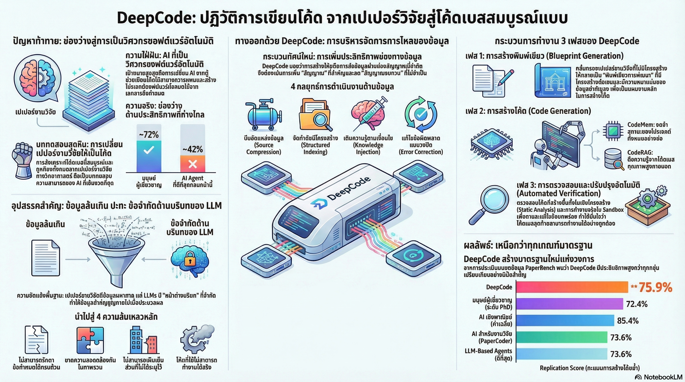

[กลับไปที่หน้าหลัก](../README.md)

สวัสดีครับเพื่อนๆ ที่ติดตามวงการ AI! วันนี้มาเรื่องที่ท้าทายสมมติฐานที่หลายคนยึดถือมาตลอดว่า "AI เขียนโค้ดได้ดีขึ้นเพราะโมเดลใหญ่ขึ้น" งานวิจัยชิ้นนี้จาก University of Hong Kong พิสูจน์ว่าแนวคิดนั้นผิดอย่างสิ้นเชิงครับ

คุณเคยสังเกตไหมครับว่า เวลาเราให้ AI อ่านงานวิจัยทั้งฉบับแล้วสั่งให้เขียนโค้ดตาม บางทีผลที่ได้กลับแย่กว่าตอนที่เราสรุปให้สั้นๆ ก่อน ทั้งที่ข้อมูลมากกว่า แต่ผลลัพธ์กลับน้อยกว่า?

คุณเคยสงสัยไหมครับว่า ทำไม AI ระดับโลกอย่าง Claude และ GPT ถึงยังทำคะแนนได้น้อยกว่า PhD จากมหาวิทยาลัยชั้นนำในการแปลงงานวิจัยเป็นโค้ด ทั้งที่มันผ่านการฝึกด้วยข้อมูลมหาศาลกว่าคนๆ เดียวหลายล้านเท่า?

และคุณรู้ไหมครับว่า มีระบบที่ใช้โมเดลตัวเดียวกันกับ Claude Code และ Cursor แต่ทำคะแนนได้ 85.4% ขณะที่คู่แข่งทำได้แค่ 58% และยังชนะ PhD จากมหาวิทยาลัย Berkeley, Cambridge, Carnegie Mellon ด้วยคะแนน 76.7% ต่อ 72.4% ด้วย?

ระบบนั้นชื่อ DeepCode และความลับของมันไม่ได้อยู่ที่โมเดล แต่อยู่ที่ "วิธีจัดการกระแสข้อมูล" ที่แตกต่างออกไปโดยสิ้นเชิงครับ

========================================

🤔 ทบทวนความเชื่อเดิมๆ: สิ่งที่เราคิดเกี่ยวกับ Agentic Coding AI

▪ "AI เขียนโค้ดได้ดีขึ้นถ้าให้ข้อมูลมากขึ้น ยิ่งยัดงานวิจัยและ Context เยอะยิ่งดี" → DeepCode พิสูจน์ว่าการยัดข้อมูลดิบทั้งหมดลงไปใน Context Window สร้าง Entropy Collapse ทำให้ Signal-to-Noise Ratio ดิ่งเหว ข้อมูลที่ซ้ำซ้อนบดบังข้อกำหนดสำคัญจนหมดสิ้นครับ

▪ "Context Window ที่ยาวกว่าคือข้อได้เปรียบ ยิ่ง Context ยาวยิ่งทำงานได้ดีขึ้น" → การเพิ่มความยาว Context อย่างเดียวไร้ความหมายถ้าไม่มีระบบคัดกรองสัญญาณสำคัญ เหมือนห้องสมุดขนาดใหญ่ขึ้นโดยไม่มีระบบสืบค้น ยิ่งใหญ่ยิ่งหาอะไรไม่เจอครับ

▪ "โมเดลที่เก่งกว่าคือกุญแจหลัก ถ้าใช้โมเดลดีกว่าผลลัพธ์ต้องดีกว่าเสมอ" → DeepCode กับ Claude Code ใช้โมเดลตัวเดียวกันทั้งคู่ (Claude 4.5 Sonnet) แต่ DeepCode ทำคะแนนได้ 85.4% เทียบกับ 58% ของคู่แข่ง สถาปัตยกรรมสำคัญกว่าโมเดลอย่างชัดเจนครับ

▪ "งานแปลงงานวิจัยเป็นโค้ดยังต้องพึ่งผู้เชี่ยวชาญมนุษย์ AI ยังไม่ถึงขีดนั้น" → DeepCode ทำ 76.7% บน Human Expert Subset เทียบกับ PhD เฉลี่ย 72.4% จากสถาบัน Berkeley, Cambridge, CMU นี่ไม่ใช่แค่ AI ที่เขียนโค้ดตามสั่ง แต่ AI ที่สังเคราะห์ความรู้ทางวิทยาศาสตร์ได้ในระดับที่เหนือกว่ามนุษย์ผู้เชี่ยวชาญครับ

ความจริงที่น่าคิดคือ: ปัญหาของ Agentic Coding AI ไม่เคยเป็นเรื่องของโมเดล แต่เป็นเรื่องของการที่ไม่มีใครถามว่า "ข้อมูลอะไรที่ AI ต้องการจริงๆ ในแต่ละขั้นตอน" ก่อนที่จะส่งให้มันครับ

========================================

🧠 พื้นฐานที่ต้องเข้าใจก่อน: Context Bottleneck, PaperBench และ Information Theory

=== Context Bottleneck คืออะไร? ===

Context Bottleneck = ปัญหาที่ Context Window ของโมเดลมีขนาดจำกัด แต่งานที่ต้องทำต้องการข้อมูลมากกว่านั้นมาก ทำให้ต้องเลือกว่าจะใส่ข้อมูลอะไรลงไป

ในงานแปลงวิจัยเป็นโค้ด Context Bottleneck รุนแรงเป็นพิเศษเพราะต้องจัดการพร้อมกันกับ

▸ เนื้อหางานวิจัยที่มีสมการและแนวคิดซับซ้อน
▸ โค้ดที่เขียนไปแล้วหลายพันบรรทัด
▸ ข้อกำหนดของ Library และ Framework
▸ Error Messages จากการรันครับ

=== PaperBench คืออะไร? ===

PaperBench = Benchmark สำหรับวัดว่า AI สามารถแปลงงานวิจัยทาง Machine Learning ให้กลายเป็นโค้ดที่รันได้และให้ผลลัพธ์เหมือนในงานวิจัยได้แค่ไหน (Scientific Reproduction)

เป็น Benchmark ที่ยากมากเพราะต้องการทั้งความเข้าใจทฤษฎี, ทักษะการเขียนโค้ด และความสามารถในการจัดการโปรเจกต์ขนาดใหญ่ครับ

=== Information-theoretic Lens คืออะไร? ===

DeepCode มองปัญหาการเขียนโค้ดผ่านแว่นทฤษฎีสารสนเทศ (Information Theory)

[High-entropy Specification] = งานวิจัยคือข้อมูลที่มีความซับซ้อนสูง มีทั้งส่วนที่สำคัญมากและส่วนที่ไม่เกี่ยวข้องปนกัน
[Bandwidth-constrained Channel] = Context Window ของโมเดลที่มีขนาดจำกัด
[Entropy Collapse] = สิ่งที่เกิดขึ้นเมื่อ Noise มากกว่า Signal จนโมเดลประมวลผลผิดทิศทาง
[SNR (Signal-to-Noise Ratio)] = อัตราส่วนระหว่างข้อมูลที่มีประโยชน์กับข้อมูลที่รบกวน

เปรียบเทียบ: เหมือนการโทรศัพท์ในที่เสียงดัง ถ้าเสียงรบกวนดังกว่าเสียงที่พูด เราจะได้ยินทั้งคู่แต่ไม่เข้าใจอะไรเลย การยัดข้อมูลมากขึ้นก็เหมือนการตะโกนดังขึ้น ถ้าไม่ลด Noise ก่อนก็ไม่ได้ช่วยอะไรครับ

=== Replication Score คืออะไร? ===

Replication Score = คะแนนวัดว่าโค้ดที่ AI เขียนสามารถทำซ้ำผลการทดลองในงานวิจัยต้นฉบับได้ครบถ้วนแค่ไหน ทั้งในแง่โครงสร้างและผลลัพธ์เชิงตัวเลขครับ

========================================

1️⃣ Blueprint Distillation: เปลี่ยนงานวิจัย 100 หน้าให้กลายเป็นแผนที่ 1 หน้า

=== ปัญหาที่ Blueprint Distillation แก้ ===

งานวิจัยทาง Machine Learning เต็มไปด้วย "Narrative Noise" — ประวัติความเป็นมา, การทบทวนวรรณกรรม, คำอธิบายซ้ำๆ ที่ไม่จำเป็นสำหรับการเขียนโค้ด

ถ้าส่งงานวิจัยดิบไปให้โมเดล มันต้องใช้ Context Window ส่วนใหญ่กับข้อมูลที่ไม่เกี่ยวข้อง แทนที่จะโฟกัสกับ "สิ่งที่ต้องทำ"

=== วิธีที่ DeepCode แก้ปัญหา ===

Blueprint Distillation = บีบอัดเอกสารวิจัยให้กลายเป็น "Machine-readable Blueprint" ที่มีเฉพาะ

▸ โครงสร้างไฟล์ที่ต้องสร้าง
▸ พารามิเตอร์หลักและสูตรคำนวณที่สำคัญ
▸ แผนการทดสอบและ Expected Outputs
▸ Dependencies และ Library ที่ต้องใช้

เปรียบเทียบ: เหมือนสถาปนิกที่ย่อแบบก่อสร้าง 300 หน้าพร้อมประวัติศาสตร์ของอาคาร ความสวยงามทางสุนทรียศาสตร์ และบทความวิชาการเกี่ยวกับวัสดุ ให้เหลือแผนผังการก่อสร้าง 1 หน้าที่ช่างทุกคนรู้ว่าต้องทำอะไร ตรงไหน และขนาดเท่าไหรครับ

ผล: โมเดลได้รับเฉพาะ Signal ที่จำเป็น ไม่ต้องเสีย Context Budget กับ Noise ครับ

========================================

2️⃣ CodeMem: ระบบความจำที่รักษา Global Consistency โดยไม่ทำให้บริบทเต็ม

=== ปัญหาของการเขียนโปรเจกต์ขนาดใหญ่ ===

เมื่อโค้ดเติบโตขึ้นเรื่อยๆ โมเดลเผชิญกับปัญหาสำคัญ

[ปัญหา 1]: โค้ดทั้งหมดใหญ่เกินกว่าจะใส่ใน Context Window
[ปัญหา 2]: ถ้าไม่รู้ว่าเขียนอะไรไปแล้ว โมเดลจะเขียนโค้ดที่ขัดแย้งกับส่วนอื่น
[ปัญหา 3]: การส่งโค้ดดิบทั้งหมดซ้ำๆ ทุกรอบสิ้นเปลืองมากครับ

=== วิธีที่ CodeMem แก้ปัญหา ===

CodeMem = ระบบ Stateful Memory ที่จดจำโค้ดที่เขียนไปแล้วในรูปแบบ Hierarchical Summaries แทนการเก็บโค้ดดิบทั้งหมด

[แทนที่จะเก็บ]:
▸ ไฟล์ model.py ทั้งหมด 500 บรรทัด

[CodeMem เก็บ]:
▸ "model.py: ResNet backbone + attention head, รับ input (batch, 3, 224, 224), output (batch, num_classes), ใช้ dropout=0.3"

เปรียบเทียบ: เหมือนผู้จัดการโปรเจกต์ที่ไม่ได้บันทึกทุกคำพูดในการประชุม แต่จดเฉพาะการตัดสินใจสำคัญ ใครรับผิดชอบอะไร และ Deadline ของแต่ละส่วน เวลาจะประชุมครั้งถัดไปก็นำบันทึกนั้นมาอ่านแทนที่จะเล่นคลิปทั้งวันซ้ำครับ

ผล: โมเดลรู้ว่าโปรเจกต์ "เป็นอย่างไร" ในภาพรวมโดยใช้ Context Budget น้อยมากครับ

========================================

3️⃣ CodeRAG และ Closed-loop Correction: เติมช่องว่างและแก้ไขจนสมบูรณ์

=== CodeRAG: เมื่องานวิจัยไม่ได้บอกทุกอย่าง ===

ปัญหาที่พบบ่อยในการแปลงงานวิจัยเป็นโค้ดคือ "Underspecified Design" งานวิจัยบอกว่า "ใช้ Adam Optimizer" แต่ไม่ได้บอก Learning Rate Schedule หรือ Warmup Steps ที่ทำให้ระบบทำงานได้จริงครับ

CodeRAG = Conditional Knowledge Injection ระบบที่ใช้ Reference Mining เพื่อดึงตัวอย่างการใช้งาน Library จริงจาก GitHub และ ArXiv มาเติมเต็มในจุดที่งานวิจัยระบุไว้ไม่ชัดเจน

[ตัวอย่างการทำงาน]
▸ งานวิจัยระบุ: "ใช้ Transformer Encoder 6 ชั้น"
▸ CodeRAG ค้นหา: ตัวอย่างการ implement Transformer ใน PyTorch จาก GitHub
▸ นำมาเติมเต็ม: รายละเอียดที่งานวิจัยไม่ได้ระบุแต่จำเป็นต้องมีครับ

เปรียบเทียบ: เหมือนนักวิศวกรที่ก่อนจะ implement ฟีเจอร์ใหม่จะค้น Stack Overflow และ GitHub ดูว่าคนอื่นแก้ปัญหาแบบเดียวกันอย่างไร แทนที่จะนั่งคิดตั้งแต่ศูนย์ครับ

=== Closed-loop Error Correction: ทดสอบจริง ไม่ใช่แค่เดา ===

Closed-loop Error Correction = ระบบที่รันโค้ดใน Sandbox แล้วนำ Execution Traces และ Error Messages มาวิเคราะห์ผ่าน LSP-based refinement เพื่อแก้ไขซ้ำๆ จนโค้ดทำงานได้สมบูรณ์

[วงจรการทำงาน]
▸ เขียนโค้ด
▸ รันใน Sandbox
▸ ถ้ามี Error → วิเคราะห์ว่าผิดตรงไหน → แก้ไขเฉพาะจุด
▸ รันซ้ำ → จนผ่าน

เปรียบเทียบ: ต่างจากโปรแกรมเมอร์ที่เขียนโค้ดแล้วหวังว่ามันจะทำงาน Closed-loop ทำงานเหมือนโปรแกรมเมอร์ที่รัน Unit Test ทันทีหลังเขียนทุกฟังก์ชัน และไม่ยอมเดินหน้าจนกว่า Test จะผ่านครับ

ผล: ระบบไม่ได้แค่เขียนโค้ดให้ดูถูก แต่ผลิตโค้ดที่รันผ่านและทำซ้ำผลการทดลองได้จริงครับ

========================================

4️⃣ Architecture ชนะ Model: บทพิสูจน์ที่ชัดเจนที่สุดในปีนี้

=== การทดสอบที่เป็นธรรมที่สุด ===

นักวิจัยใช้วิธีที่เป็นธรรมที่สุดในการเปรียบเทียบ นั่นคือให้ทุกระบบใช้โมเดลตัวเดียวกัน (Claude 4.5 Sonnet with thinking) แล้วดูว่าสถาปัตยกรรมต่างกันให้ผลต่างกันแค่ไหน

[ผลบน PaperBench]
▸ DeepCode: 85.4%
▸ Cursor: ~58%
▸ Claude Code: ~58%
▸ PhD Experts: 72.4%

โมเดลเดียวกัน สถาปัตยกรรมต่างกัน ผลต่างกัน 27 คะแนนครับ

=== ทำไม Tool-use Loop ทั่วไปถึงแพ้? ===

Cursor และ Claude Code ใช้โมเดลเดียวกันแต่ทำงานแบบ Tool-use Loop ทั่วไป คือให้โมเดลตัดสินใจเองว่าจะเรียก Tool ไหน เมื่อไหร่ และข้อมูลอะไร โดยไม่มีระบบจัดการกระแสข้อมูลอย่างมีชั้นเชิง

ผลคือ Context Window เต็มด้วย Noise และโมเดลสูญเสียทิศทางเมื่อโปรเจกต์ซับซ้อนขึ้น

เปรียบเทียบ: เหมือนนักแข่งรถสองคนที่ใช้รถเดียวกัน คนแรกมีแผนการแข่งที่วางล่วงหน้า รู้ว่าจะเข้าพิทเมื่อไหร่ จะประหยัดยางตรงไหน และจะโจมตีคู่แข่งช่วงใด คนที่สองแค่กดคันเร่งเต็มที่ตลอดและหวังให้ดีที่สุด ผลการแข่งไม่ต้องเดาครับ

=== บทเรียนที่ชัดที่สุด ===

DeepCode vs Claude Code คือหลักฐานโดยตรงว่า Agentic Architecture ที่จัดการ Information-flow อย่างมีระบบให้ผลลัพธ์ที่เหนือกว่า Tool-use Loop ทั่วไปอย่างมหาศาล แม้ใช้ Base Model ตัวเดียวกันก็ตามครับ

========================================

🎯 สรุป: 4 บทเรียนจาก DeepCode

▸ ปัญหาของ Agentic AI คือ Noise ไม่ใช่ขนาด: Entropy Collapse ที่เกิดจากการยัดข้อมูลมากเกินไปทำให้โมเดลฉลาดน้อยลง ไม่ใช่มากขึ้น การคัดกรอง Signal ที่จำเป็นออกมาเท่านั้นที่เป็นกุญแจสำคัญ

▸ ความจำที่ดีไม่ใช่การจำทุกอย่าง: CodeMem พิสูจน์ว่า Hierarchical Summaries ที่จดจำการตัดสินใจสำคัญมีประสิทธิภาพมากกว่าการส่งโค้ดดิบทั้งหมดซ้ำๆ เพราะทำให้โมเดลเข้าใจภาพรวมโดยใช้ Context Budget น้อยกว่ามาก

▸ Closed-loop ที่ทดสอบจริงเหนือกว่าการเดาที่ฉลาด: การรันโค้ดและวิเคราะห์ Error จริงๆ ให้ข้อมูลที่แม่นยำกว่าการให้โมเดล "นึกว่าจะเกิดอะไรขึ้น" มากเพราะโลกจริงเต็มไปด้วยสิ่งที่ไม่มีใครคาดเดาได้ครับ

▸ สถาปัตยกรรมคือความแตกต่างที่แท้จริง: ช่องว่าง 27 คะแนนระหว่าง DeepCode กับ Claude Code บนโมเดลตัวเดียวกันคือข้อพิสูจน์ที่ชัดเจนที่สุดว่าใน Agentic AI ยุคหน้า การออกแบบ Architecture จะสำคัญกว่าการแข่งกันสร้างโมเดลใหญ่ขึ้น

หลักการสำคัญ: "Base Model คือเครื่องยนต์ แต่ Agentic Architecture คือพวงมาลัยและแผนที่ ยิ่งงานซับซ้อนมากขึ้น ยิ่งกุญแจอยู่ที่คนขับและแผนการเดินทาง ไม่ใช่ที่ความแรงของเครื่อง" ครับ

========================================

💬 คำถามท้ายทาย

1. DeepCode ชนะ PhD ผ่านการจัดการข้อมูลอย่างมีชั้นเชิง แต่งานวิจัยในหลาย Domain เช่น ชีวการแพทย์หรือฟิสิกส์เชิงทฤษฎี ต้องการ "ความเข้าใจแนวคิด" ที่ลึกกว่าแค่การ implement ถ้า Context Bottleneck ถูกแก้แล้ว อุปสรรคถัดไปของ AI ในงาน Scientific Reproduction คืออะไรครับ?

2. Hierarchical Summaries ของ CodeMem ต้องการการตัดสินว่าข้อมูลไหน "สำคัญพอที่จะจดจำ" ถ้าโมเดลตัดสินใจผิดว่าข้อมูลส่วนไหนสำคัญ ความผิดพลาดนั้นจะสะสมไปตลอดโปรเจกต์โดยไม่มีใครรู้ตัว มีวิธีตรวจสอบ Memory Quality ของ AI ได้อย่างไรครับ?

3. DeepCode พิสูจน์ว่า Architecture สำคัญกว่า Model Size แต่ถ้า Architecture ที่ดีถูก Open-source ออกมา ทุกคนก็สามารถใช้ได้เหมือนกัน ความได้เปรียบเชิงการแข่งขันของบริษัทที่คิดค้น Architecture ใหม่ๆ จะอยู่ตรงไหน และใครจะเป็นผู้ได้ประโยชน์สูงสุดจากการแข่งขันด้าน Architecture ในอนาคตครับ?

4. เมื่อ AI สามารถแปลงงานวิจัยเป็นโค้ดได้ดีกว่า PhD ผู้เชี่ยวชาญ วงจร Scientific Discovery จะเปลี่ยนไปอย่างไร ถ้า AI สามารถ reproduce งานวิจัยได้อัตโนมัติ นักวิจัยมนุษย์จะมีเวลาและทรัพยากรมากขึ้นสำหรับการ "ตั้งคำถามใหม่" แต่พร้อมกันนั้นความเสี่ยงที่งานวิจัยที่มี Flaw จะถูกขยายขนาดอย่างรวดเร็วโดย AI ก็มีสูงขึ้นเช่นกัน เราควรออกแบบ Safeguard อะไรครับ?

========================================

References:
▸ DeepCode Framework — University of Hong Kong, Agentic Coding System สำหรับ Scientific Paper Reproduction
▸ PaperBench — Benchmark มาตรฐานสำหรับวัด Scientific Reproduction Score ของ AI
▸ DeepCode Replication Score: 75.9% (76.7% บน Human Expert Subset) vs PhD Average 72.4%
▸ Architecture Comparison (Claude 4.5 Sonnet): DeepCode 85.4% vs Cursor/Claude Code ~58%
▸ Blueprint Distillation — Source Compression เพื่อลด Narrative Noise จากงานวิจัย
▸ CodeMem — Stateful Memory ด้วย Hierarchical Summaries เพื่อรักษา Global Consistency
▸ CodeRAG — Conditional Knowledge Injection จาก GitHub และ ArXiv
▸ Closed-loop Error Correction — LSP-based Refinement ผ่าน Execution Traces ใน Sandbox
▸ Information-theoretic Lens: Entropy Collapse, SNR, Bandwidth-constrained Context Window

ในวันที่ AI พิสูจน์แล้วว่า Architecture ที่ฉลาดกว่าเอาชนะโมเดลที่ใหญ่กว่าได้ และว่าการจัดการข้อมูลที่ดีกว่าเอาชนะ PhD จาก Berkeley ได้ คำถามสำคัญสำหรับทุกคนในวงการ Software Engineering คือ ถ้าโค้ดถูกเขียนโดย AI ที่ฉลาดกว่าเราแล้ว ทักษะที่มนุษย์ต้องพัฒนาต่อไปคือทักษะอะไรกันแน่ครับ ⚡

#DeepCode #AgenticAI #AICoding #PaperBench #InformationTheory #SoftwareEngineering #AIResearch #AIThailand #ปัญญาประดิษฐ์ #MachineLearning #ContextWindow #Blueprint #CodeRAG #AutonomousEngineering
