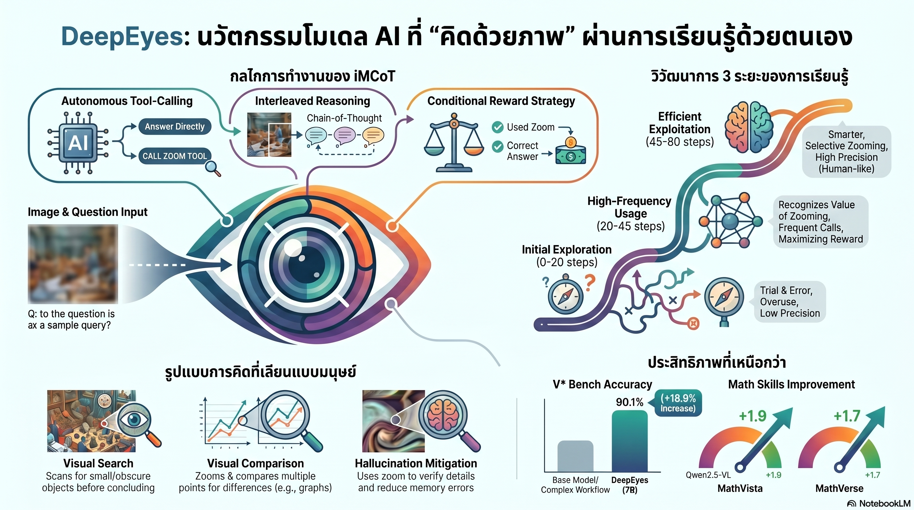

[กลับไปที่หน้าหลัก](../README.md)

สวัสดีครับเพื่อนๆ ที่ติดตามวงการ AI! วันนี้มาเรื่องที่ท้าทายสมมติฐานพื้นฐานของ Vision AI มาหลายปี: "AI ที่ดูภาพได้นั้นเพียงพอแล้ว แต่ AI ที่รู้จัก 'มองซ้ำ' ต่างกันโดยสิ้นเชิง" จากงานวิจัย DeepEyes ที่พิสูจน์ว่าการสอนให้ AI รู้จัก "ซูมอย่างมีกลยุทธ์" ผ่าน Reinforcement Learning ล้วนๆ โดยไม่ต้องสอนทีละขั้นตอน สามารถทลาย Hallucination และยกระดับ Visual Reasoning ได้ในแบบที่โมเดลขนาดใหญ่กว่าหลายเท่าทำไม่ได้ครับ

คุณเคยสังเกตไหมครับว่า เวลาเราอ่านสัญญาสำคัญ เราไม่ได้อ่านแบบ "สแกนผ่านทั้งหน้า" แต่เราจะ "ชะลอ" ตรงข้อความที่สงสัย หยิบปากกาขีดเส้น แล้วอ่านซ้ำอย่างละเอียด — กระบวนการนั้นต่างจากการ "มองผ่านๆ" อย่างสิ้นเชิงครับ

คุณรู้ไหมครับว่า VLM ส่วนใหญ่ในปัจจุบันทำงานแบบ Passive Perception คือรับภาพทั้งใบมาประมวลผลในครั้งเดียว แล้วตอบคำถามโดยพิจารณาจากภาพรวม ไม่ต่างอะไรกับการสอบโดยการ "ท่องจำสรุป" แทนที่จะ "เข้าใจเนื้อหาจริงๆ" ครับ

และคุณเคยนึกไหมครับว่า ถ้า AI ไม่ได้รับการสอนทีละขั้นตอนเลย แต่กลับค้นพบ "ยุทธวิธีการมอง" ที่ซับซ้อนอย่าง Visual Search, Visual Comparison, Visual Confirmation, และ Hallucination Mitigation ขึ้นมาเองผ่าน Reinforcement Learning ล้วนๆ มันแสดงให้เห็นอะไรเกี่ยวกับธรรมชาติของการมองเห็นและการคิดครับ?

งานวิจัยนี้กำลังบอกว่า: ช่องว่างระหว่าง "AI ที่เห็นภาพ" กับ "AI ที่มองภาพ" ไม่ได้อยู่ที่ขนาดของโมเดล แต่อยู่ที่ว่ามันรู้จักถามตัวเองว่า "ต้องซูมตรงไหน" หรือเปล่าครับ

========================================

🤔 ทบทวนความเชื่อเดิมๆ: สิ่งที่เราคิดเกี่ยวกับ Vision AI และการรับรู้ภาพ

▪ "โมเดลที่ดีกว่าต้องมีความสามารถในการประมวลผลภาพความละเอียดสูงทั้งใบในครั้งเดียว ยิ่งรับข้อมูลได้มากพร้อมกัน ยิ่งเข้าใจภาพได้ดีกว่า" → DeepEyes พิสูจน์ตรงกันข้ามครับ การซูมเฉพาะจุดสำคัญนั้นดีกว่าการพยายามประมวลผลทุกอย่างพร้อมกัน บน HR-Bench 8K DeepEyes ทำได้ 72.6% ในขณะที่โมเดลที่ใช้เพียงข้อความทำได้ 60.8% — ความต่างเกิดจากการ "เลือกมอง" ไม่ใช่การ "มองทั้งหมด"

▪ "Hallucination ในโมเดลภาพเกิดจากการฝึกข้อมูลที่ไม่ดีพอ แก้ได้ด้วยการเพิ่มข้อมูลและโมเดลที่ใหญ่ขึ้น" → iMCoT (Interleaved Multimodal Chain-of-Thought) แสดงให้เห็นว่า Hallucination หลายกรณีเกิดจากการที่โมเดล "ไม่ยอมตรวจสอบซ้ำ" ไม่ใช่ไม่มีข้อมูล กรณี Blazer สีดำที่ถูกแก้ไขเป็นสีแดงหลังซูม พิสูจน์ว่า Active Verification คือยาที่ใช่กว่าข้อมูลที่มากกว่าครับ

▪ "การสอน AI ให้ใช้เครื่องมือพิเศษต้องการ Supervised Fine-tuning (SFT) ที่มีตัวอย่างละเอียด มิเช่นนั้นโมเดลจะใช้เครื่องมือแบบผิดๆ" → DeepEyes พัฒนายุทธวิธีการซูม 4 รูปแบบขึ้นมาเองล้วนๆ จาก Reinforcement Learning โดยไม่มี SFT เลยสักขั้นตอน สิ่งที่โมเดลต้องการไม่ใช่การสอนทีละขั้น แต่คือ Reward Signal ที่ถูกต้องครับ

▪ "AI ขนาด 7B พารามิเตอร์ไม่มีทางแข่งขันกับโมเดลขนาดใหญ่กว่าในงาน Visual Reasoning ที่ซับซ้อน ขนาดยังคงเป็นปัจจัยหลัก" → DeepEyes 7B ทำคะแนน V*Bench ได้ 90.1% เหนือกว่าโมเดลขนาดใหญ่กว่าหลายเท่าตัว ความแตกต่างไม่ได้อยู่ที่พารามิเตอร์ แต่อยู่ที่กระบวนการคิดครับ

ความจริงที่น่าคิดคือ: ความสามารถในการ "ซูมกลับไปตรวจสอบ" เป็นทักษะที่เราถือว่าธรรมดามากในมนุษย์ แต่การที่ AI ค้นพบมันขึ้นมาเองผ่าน Reinforcement Learning บ่งบอกว่ามันไม่ใช่ทักษะเฉพาะมนุษย์ แต่เป็นทักษะที่ "เกิดขึ้นเองตามธรรมชาติ" เมื่อระบบมี Incentive ที่ถูกต้องครับ

========================================

🧠 พื้นฐานที่ต้องเข้าใจก่อน: DeepEyes, iMCoT, Active Perception และ Conditional Tool Reward

=== Passive Perception vs Active Perception ต่างกันอย่างไร? ===

[Passive Perception (VLM แบบดั้งเดิม)]
▸ รับภาพทั้งใบ → ประมวลผลในครั้งเดียว → ตอบคำถาม
▸ เปรียบเหมือน: อ่านหนังสือ 300 หน้าครั้งเดียวโดยไม่ขีดเส้นใต้
▸ ปัญหา: รายละเอียดเล็กๆ และภาพความละเอียดสูงหายไประหว่างการ Downscale ครับ

[Active Perception (DeepEyes)]
▸ ดูภาพรวม → ระบุพื้นที่น่าสงสัย → ซูมเข้าตรวจสอบ → ปรับคำตอบตามสิ่งที่เห็นเพิ่ม
▸ เปรียบเหมือน: อ่านหนังสือโดยหยุดตรงย่อหน้าที่สงสัย ขีดเส้นใต้ แล้วอ่านซ้ำ
▸ ผลลัพธ์: HR-Bench 8K 72.6% vs 60.8% ของ Text-only CoT ครับ

=== iMCoT (Interleaved Multimodal Chain-of-Thought) คืออะไร? ===

iMCoT = กระบวนการคิดที่สลับระหว่างการใช้ภาษาและการดูภาพอย่างผสมผสาน แทนที่จะเป็นลำดับ "ดูภาพก่อน แล้วคิดด้วยข้อความ"

ตัวอย่าง "เสียงในความคิด" ของ DeepEyes:
"The zoomed-in image now shows a bookshelf next to a TV. On the shelf, there is a round object that appears to have the shape and design of a clock, which makes it a likely candidate... Since we have identified the clock's location in the current zoom-in, this satisfies the condition."

สิ่งที่สำคัญในตัวอย่างนี้: โมเดลไม่ได้แค่ "พบนาฬิกา" แต่มันบันทึกด้วยว่าการซูมก่อนหน้า "ล้มเหลว" ที่ชั้นวางทีวี แล้วปรับกลยุทธ์ใหม่ไปที่หิ้งหนังสือ — นี่คือ Self-correction ที่เกิดจาก Visual Feedback ครับ

=== Conditional Tool Reward คืออะไร? ===

Conditional Tool Reward = ระบบให้รางวัลที่ให้ Bonus เฉพาะเมื่อโมเดล "ตอบถูก AND ใช้เครื่องมือซูมอย่างเหมาะสม" เท่านั้น

ต่างจาก Unconditional Reward ที่ให้ Bonus ทุกครั้งที่ใช้เครื่องมือ ไม่ว่าจะตอบถูกหรือผิดก็ตาม — วิธีนี้สอนให้โมเดลเห็นว่าการซูมมี "คุณค่า" ก็ต่อเมื่อนำไปสู่คำตอบที่ถูกต้องเท่านั้นครับ

========================================

1) Active Perception: จาก "เห็นภาพ" สู่ "มองภาพ" — ความต่างที่สำคัญที่สุด

ความโดดเด่นหลักของ DeepEyes คือการเปลี่ยน VLM จากผู้รับข้อมูลแบบ Passive มาเป็นผู้สำรวจแบบ Active ผ่าน Image Zoom-in Tool ที่ทำงานร่วมกับ Grounding (การระบุพิกัดตำแหน่งในภาพ) ครับ

เปรียบได้กับนักสืบที่ตรวจสอบที่เกิดเหตุ: นักสืบที่ดีไม่ได้ยืนมองห้องทั้งห้องแล้วสรุปทันที แต่จะ "ชี้" ไปที่รอยเปื้อนบนพื้น หยิบแว่นขยายออกมา แล้วตรวจสอบเฉพาะจุดนั้นอย่างละเอียด ก่อนที่จะตัดสินใจว่าเป็นหลักฐานหรือไม่ครับ

กระบวนการใน DeepEyes:
— ดูภาพรวมเพื่อสร้างความเข้าใจเบื้องต้น
— ระบุพื้นที่ที่ "น่าสงสัยหรือไม่ชัดเจน" ผ่าน Grounding
— ครอปและซูมภาพเฉพาะบริเวณนั้น
— ประมวลผลภาพที่ซูมแล้วร่วมกับ Context เดิม
— ปรับหรือยืนยันคำตอบตามสิ่งที่เห็นเพิ่ม

ผลที่ได้คือโมเดลสามารถ "ก้าวข้ามขีดจำกัดด้านความละเอียด" ได้ เพราะแทนที่จะ Downscale ภาพ 8K ทั้งใบให้เล็กลงจนรายละเอียดหาย มันเลือกซูมเฉพาะส่วนที่สำคัญแล้วประมวลผลส่วนนั้นในความละเอียดเต็มครับ

========================================

2) Training Dynamics 3 ระยะ: วิวัฒนาการที่เกิดขึ้นโดยไม่มีใครสอน

สิ่งที่น่าทึ่งที่สุดในงานวิจัยนี้ไม่ใช่ผลลัพธ์สุดท้าย แต่คือการสังเกตว่า DeepEyes "เติบโต" อย่างไรระหว่างการฝึกด้วย RL ล้วนๆ โดยผ่านพัฒนาการ 3 ระยะที่ไม่มีใครโปรแกรมไว้ล่วงหน้าครับ

เปรียบได้กับเด็กที่เรียนรู้ใช้กล้องจุลทรรศน์ครั้งแรก:

ระยะที่ 1 — Initial Exploration (ลองผิดลองถูก):
เด็กเพิ่งรู้ว่ามีเครื่องมือนี้อยู่ แต่ยังไม่รู้ว่าต้องส่องตรงไหน บางทีส่องโต๊ะ บางทีส่องอากาศ พิกัดที่ซูมมักไม่ตรงกับสิ่งที่ต้องการตรวจสอบ และยังเชื่อมโยงสิ่งที่เห็นกับคำตอบไม่ถูกครับ

ระยะที่ 2 — High-Frequency Usage (บ้าพลัง):
เมื่อเด็กรู้แล้วว่า "ส่องกล้องแล้วได้คะแนน" ก็จะส่องทุกอย่างที่เจอ ตะปูที่โต๊ะ ฝุ่นบนหนังสือ ทุกอย่างถูกส่องหมด คำตอบยาวขึ้น ใช้เวลานานขึ้น แต่ไม่ได้แม่นขึ้นเสมอไปครับ

ระยะที่ 3 — Efficient Exploitation (บรรลุ):
เด็กเริ่มรู้ว่าควรส่องตรงไหน "ก่อน" ที่จะส่อง มีการวางแผนในใจ เลือกส่องเฉพาะจุดที่ให้ข้อมูลสูงสุด ใช้เวลาน้อยลง แต่ได้คำตอบที่แม่นยำขึ้นครับ

สิ่งที่น่าสังเกตคือ ระยะที่ 3 นี้เรียกว่า Implicit Planning — DeepEyes ไม่ได้รับการสอนให้ "วางแผนก่อนซูม" แต่มันค้นพบว่ากลยุทธ์นี้ให้ Reward สูงกว่า จึงพัฒนามันขึ้นมาเองครับ

========================================

3) Thinking Patterns 4 รูปแบบ: สิ่งที่ AI ค้นพบว่าตัวเองทำได้

ผลจากการฝึกด้วย RL โดยไม่มี SFT ทำให้ DeepEyes ค้นพบรูปแบบการคิดที่ออกแบบโดยไม่มีใครเขียน Instruction ไว้ให้เลย 4 รูปแบบครับ:

Visual Search — สแกนหาเบาะแสในพื้นที่ต่างๆ:
เหมือนนักสืบที่ไม่รู้ว่าหลักฐานอยู่ที่ไหน ก็จะค่อยๆ ตรวจสอบทีละพื้นที่จนพบ ในตัวอย่างนาฬิกา DeepEyes ซูมไปที่ชั้นวางทีวีก่อน พอไม่พบก็ย้ายไปที่หิ้งหนังสือครับ

Visual Comparison — เปรียบเทียบรายละเอียดระหว่างจุด:
เหมือนนักวิจัยที่ต้องเทียบกราฟสองกราฟในงานวิจัย DeepEyes ซูมมาที่กราฟแต่ละอันทีละตัวแล้วเปรียบเทียบค่าครับ

Visual Confirmation — ซูมเพื่อยืนยันความมั่นใจ:
เหมือนแพทย์ที่อ่านผลแล็บแล้ว "คิดว่า" เห็นความผิดปกติ ก็จะขอดูซ้ำด้วยกำลังขยายที่สูงขึ้นก่อนสรุปครับ

Hallucination Mitigation — ตรวจสอบเพื่อลดการเดามั่ว:
กรณีที่ชัดเจนที่สุดคือ Blazer ที่โมเดลเข้าใจว่าเป็นสีดำเพราะ Contrast กับแสงรอบข้าง แต่เมื่อซูมเข้าไปดูรายละเอียดเปรียบเทียบกับเสื้อตัวใน จึงแก้ไขคำตอบเป็นสีแดงซึ่งถูกต้องครับ

ความน่าทึ่งคือ Thinking Patterns ทั้ง 4 นี้ล้วนเป็นสิ่งที่มนุษย์ใช้โดยธรรมชาติเมื่อต้องวิเคราะห์ภาพที่ซับซ้อน แต่ไม่มีใครสอน DeepEyes ว่าควรทำแบบนี้ครับ

========================================

4) Conditional Tool Reward: ไม่ใช่สอนให้ "ซูมบ่อย" แต่สอนให้ "ซูมอย่างมีคุณค่า"

เคล็ดลับทางวิศวกรรมที่ทำให้ DeepEyes แตกต่างจากการนำ Tool เข้ามาใน VLM แบบทั่วไปคือการออกแบบ Reward Function ที่ละเอียดอ่อนมากครับ

เปรียบได้กับการสอนนักเรียนทำโจทย์เลขที่ต้องแสดงวิธีทำ: ถ้าให้คะแนนแค่ "คำตอบถูก" เด็กที่เดาถูกได้คะแนนเท่ากับเด็กที่คิดอย่างถูกต้อง แต่ถ้าให้ Bonus เฉพาะเด็กที่ "แสดงวิธีทำที่ถูกต้องแล้วได้คำตอบที่ถูก" เด็กจะเริ่มเห็นคุณค่าของ Process ไม่ใช่แค่ผลลัพธ์ครับ

Conditional Tool Reward ทำงานแบบเดียวกัน:
— ตอบถูก แต่ไม่ซูม: ได้รางวัลปกติ
— ตอบผิด แต่ซูม: ไม่ได้ Bonus
— ตอบถูก และซูมอย่างเหมาะสม: ได้ Bonus พิเศษครับ

ผลคือโมเดลเรียนรู้ว่า "การซูมมีคุณค่าเฉพาะเมื่อมันช่วยให้ตอบถูก" ไม่ใช่มีคุณค่าในตัวเอง ทำให้ Stage 3 ของ Training Dynamics เกิดขึ้นตามธรรมชาติ — โมเดลพัฒนา Implicit Planning เพื่อเลือกว่าควรซูมตรงไหนเพื่อ Maximize Reward ครับ

ตัวเลขยืนยัน: Conditional Tool Reward ดีกว่า Unconditional Reward อย่างมีนัยสำคัญ เพราะโมเดลที่ได้ Bonus ทุกครั้งที่ซูมติดอยู่ใน Stage 2 (บ้าพลัง) นานกว่า และไม่พัฒนา Efficient Planning ในระดับเดียวกันครับ

========================================

5) 7B ชนะโมเดลขนาดใหญ่: เมื่อกระบวนการคิดสำคัญกว่าขนาด

ผลการทดสอบบน V*Bench — Benchmark ที่ออกแบบมาทดสอบ Visual Grounding ที่ต้องการการตรวจสอบรายละเอียด:

— DeepEyes 7B: 90.1%
— โมเดลขนาดใหญ่กว่าหลายเท่าที่ใช้ Passive Perception: ต่ำกว่าอย่างมีนัยสำคัญครับ

และบน HR-Bench 8K — Benchmark สำหรับภาพความละเอียดสูง:
— DeepEyes ด้วย iMCoT: 72.6%
— โมเดลเดียวกันแต่ใช้ Text-only CoT: 60.8%
— ความต่าง 11.8% เกิดจาก "กระบวนการมอง" เพียงอย่างเดียวครับ

เปรียบได้กับการแข่งแก้โจทย์คณิตศาสตร์ระหว่างนักเรียนที่ "จำสูตรได้มากกว่า" กับนักเรียนที่ "เข้าใจหลักการและรู้ว่าควรใช้สูตรไหนเมื่อไร" — ในโจทย์ทั่วไปอาจไม่ต่างกัน แต่ในโจทย์ที่ซับซ้อนและไม่คุ้นเคย ผู้ที่เข้าใจหลักการจะชนะอย่างขาดลอยครับ

========================================

🎯 สรุป: DeepEyes ไม่ใช่แค่ VLM ที่ดีขึ้น แต่คือหลักฐานว่า Active Perception เกิดขึ้นเองได้

DeepEyes พิสูจน์สิ่งสำคัญ 5 ประการครับ:

หนึ่ง — Active Perception ผ่าน Image Zoom-in Tool ทลายขีดจำกัดด้าน Resolution ได้อย่างตรงประเด็น HR-Bench 8K 72.6% vs 60.8% ของ Text-only CoT ยืนยันว่า "การเลือกมอง" สำคัญกว่า "การมองทั้งหมด"

สอง — Training Dynamics 3 ระยะ (Initial Exploration → High-Frequency Usage → Efficient Exploitation) เกิดขึ้นเองโดยไม่มีใครออกแบบ แสดงว่า Implicit Planning เป็นสิ่งที่ระบบ RL ค้นพบตามธรรมชาติเมื่อมี Incentive ที่ถูกต้องครับ

สาม — Thinking Patterns 4 รูปแบบ (Visual Search, Visual Comparison, Visual Confirmation, Hallucination Mitigation) ทั้งหมดเกิดจาก RL ล้วนๆ โดยไม่มี SFT — ยืนยันว่า AI ไม่ต้องการการสอนทีละขั้นตอนเพื่อพัฒนากลยุทธ์การมองที่ซับซ้อน

สี่ — Conditional Tool Reward สำคัญกว่า Unconditional Reward เพราะสอนให้โมเดลเห็นคุณค่าของ Process ไม่ใช่แค่ Tool Usage ส่งผลให้เกิด Efficient Exploitation ในระยะที่ 3 ได้เร็วกว่า

ห้า — DeepEyes 7B ทำ V*Bench 90.1% เหนือโมเดลขนาดใหญ่กว่าหลายเท่า ยืนยันว่ากระบวนการคิด (Active Perception + iMCoT) มีน้ำหนักมากกว่าขนาดพารามิเตอร์ในงานที่ต้องการ Visual Reasoning จริงๆ ครับ

ก้าวต่อไปที่น่าจับตามองคือการนำ Active Perception ออกจากสภาพแวดล้อมทดลองสู่งานจริงที่ต้องการความละเอียดสูง ไม่ว่าจะเป็นภาพถ่ายทางการแพทย์หรือการตรวจสอบโครงสร้างวิศวกรรมครับ

========================================

💬 คำถามชวนคิด:

ถ้า DeepEyes พัฒนา Thinking Patterns ที่ซับซ้อนขึ้นมาเองผ่าน RL โดยไม่มีใครสอน คุณคิดว่ายังมี "ยุทธวิธีการมอง" อะไรอีกที่มนุษย์ใช้โดยธรรมชาติ แต่ AI อาจยังไม่ค้นพบ และถ้ามันค้นพบมัน จะเปลี่ยนขีดจำกัดของ Visual AI ไปในทิศทางไหนครับ?

และถ้า Conditional Reward ออกแบบให้ AI เห็นคุณค่าของ "กระบวนการ" ไม่ใช่แค่ "ผลลัพธ์" หลักการนี้สามารถนำไปใช้กับ Reasoning แบบอื่นที่ไม่ใช่ Visual ได้ไหม และอะไรคือ Conditional Reward ที่เหมาะสมสำหรับการคิดเชิงตรรกะหรือการใช้เหตุผลทางวิทยาศาสตร์ครับ?

========================================

References:
- DeepEyes: Incentivized Thinking with Interleaved Multimodal Chain-of-Thought for Visual Question Answering (2025)
- iMCoT (Interleaved Multimodal Chain-of-Thought) — Reinforcement Learning without SFT
- HR-Bench 8K: DeepEyes 72.6% vs Text-only CoT 60.8%
- V*Bench: DeepEyes 7B — 90.1%
- Training Dynamics: Stage 1 (Initial Exploration) → Stage 2 (High-Frequency Usage) → Stage 3 (Efficient Exploitation)
- Thinking Patterns: Visual Search, Visual Comparison, Visual Confirmation, Hallucination Mitigation
- Conditional Tool Reward vs Unconditional Reward (Figure 4)
- Hallucination case: Blazer color correction (black → red) via Zoom-in

========================================

เมื่อ AI เรียนรู้ว่า "การมองซ้ำ" มีคุณค่า มันก็เริ่มมองโลกแบบเดียวกับที่นักวิทยาศาสตร์มองมาหลายศตวรรษ: ไม่ใช่แค่เห็น แต่ต้องตรวจสอบ และไม่ใช่แค่ตรวจสอบ แต่ต้องรู้ว่าควรตรวจสอบตรงไหนครับ 🔍

#DeepEyes #ActivePerception #iMCoT #VisualReasoning #VLM #ReinforcementLearning #MultimodalAI #Hallucination #ImageZoom #HRBench #VisionLanguageModel #AIResearch #ThinkingWithImages #ConditionalReward #DeepLearning #ComputerVision #AIThailand
