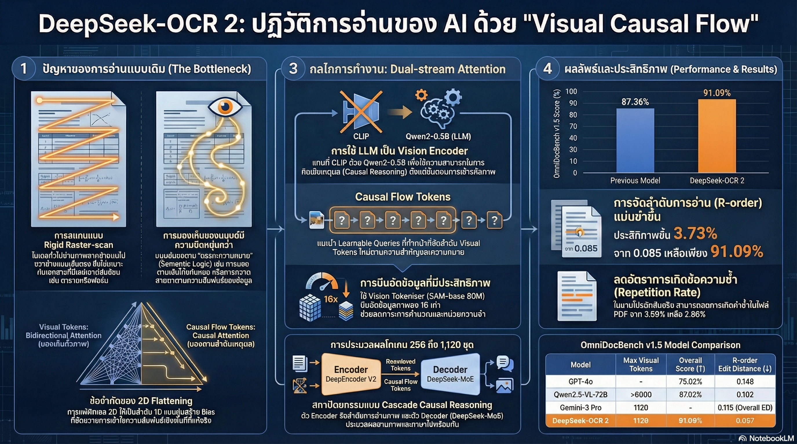

[กลับไปที่หน้าหลัก](../README.md)

สวัสดีครับเพื่อนๆ นักพัฒนา AI! วันนี้เรามาคุยเรื่องเทคโนโลยี OCR (Optical Character Recognition) หรือการอ่านข้อความจากภาพกันครับ

คุณเคยใช้แอปแปลภาษาโดยเอากล้องส่องป้ายไหมครับ? หรือเคยแสกนเอกสารให้กลายเป็น Text? นั่นแหละคือ OCR! แต่ปัญหาคือ OCR แบบเดิมมักจะอ่านผิดเวลาเจอเอกสารที่ซับซ้อน เช่น ตารางที่มีหลายคอลัมน์ หรือสูตรคณิตศาสตร์ที่ยาว

ทำไมถึงเป็นแบบนี้? เพราะ OCR แบบเดิมมัน "มอง" แบบเครื่องจักร ไม่ใช่แบบมนุษย์!

แต่ล่าสุด DeepSeek ได้เปิดตัว DeepSeek-OCR 2 ที่มาพร้อมนวัตกรรม DeepEncoder V2 ซึ่งจะเปลี่ยนวิธีที่ AI อ่านภาพจากการสแกนแบบตายตัว ไปสู่การอ่านที่เข้าใจ "ตรรกะ" ของเนื้อหาเหมือนมนุษย์!

วันนี้เรามาดู 5 จุดเด่นของ DeepSeek-OCR 2 กันครับ

========================================

🤔 ทบทวนปัญหาเดิมๆ: OCR แบบเดิมอ่านผิดทำไม?

ก่อนที่เราจะไปดูนวัตกรรมของ DeepSeek-OCR 2 มาทำความเข้าใจปัญหาเดิมก่อนนะครับ

=== OCR แบบเดิมทำงานยังไง? ===

[Raster-scan] ← วิธีแบบเดิม

วิธีการทำงาน:
▸ สแกนจากซ้ายไปขวา
▸ บนลงล่าง
▸ เหมือนหัวพิมพ์ของเครื่องพรินเตอร์
▸ ไม่สนใจความหมายของเนื้อหา

ข้อดี:
▸ เรียบง่ายในเชิงโปรแกรม
▸ ทำได้ง่าย

ข้อเสีย:
▸ ล้มเหลวกับเอกสารซับซ้อน
▸ อ่านตารางที่มีหลายคอลัมน์ผิด
▸ อ่านสูตรคณิตศาสตร์ที่ยาวผิด
▸ ไม่เข้าใจบริบท

=== ตัวอย่างปัญหาจริง ===

ลองนึกภาพเอกสารที่มีตารางแบบนี้:

┌────────────┬────────────┬────────────┐
│ ชื่อ       │ เงินเดือน  │ แผนก      │
├────────────┼────────────┼────────────┤
│ สมชาย      │ 30,000    │ IT        │
│ สมหญิง     │ 35,000    │ HR        │
└────────────┴────────────┴────────────┘

[OCR แบบเดิมจะอ่านเป็น]
"ชื่อ เงินเดือน แผนก สมชาย 30,000 IT สมหญิง 35,000 HR"

ผิดพลาด! เพราะ:
▸ ไม่รู้ว่า "สมชาย" อยู่แถวเดียวกับ "30,000" และ "IT"
▸ อ่านแบบเส้นตรงจากซ้ายไปขวา ไม่เข้าใจโครงสร้างตาราง

[มนุษย์จะอ่านเป็น]
"ตารางแสดงข้อมูลพนักงาน มี 3 คอลัมน์: ชื่อ, เงินเดือน, แผนก
แถวที่ 1: สมชาย, 30,000, IT
แถวที่ 2: สมหญิง, 35,000, HR"

ถูกต้อง! เพราะ:
▸ เข้าใจว่านี่คือตาราง
▸ รู้ว่าข้อมูลในแถวเดียวกันมีความสัมพันธ์กัน

นี่คือปัญหาที่ DeepSeek-OCR 2 มาแก้ไข!

========================================

1. 👁️ Visual Causal Flow: มองตามตรรกะ ไม่ใช่ตามพิกัด

จุดเปลี่ยนแรกและสำคัญที่สุดคือ "Visual Causal Flow" ครับ

=== Causal Flow คืออะไร? ===

Causal Flow หมายถึง "กระแสเหตุและผล" หรือการเรียงลำดับการอ่านตามตรรกะของเนื้อหา

ไม่ใช่อ่านตามพิกัด แต่อ่านตามความหมาย!

=== มนุษย์มองภาพยังไง? ===

มนุษย์ไม่ได้มองภาพเป็นเส้นตรง ลองนึกภาพเหล่านี้:

[ตัวอย่างที่ 1: เส้นเชือกที่ขดเป็นเกลียว]

OCR แบบเดิม:
▸ สแกนจากซ้ายไปขวา บนลงล่าง
▸ อ่านเส้นเชือกไม่ถูก เพราะมันขดไปขดมา

มนุษย์:
▸ สายตาเคลื่อนที่ตามตรรกะของเส้นเชือก
▸ ติดตามเส้นเชือกไปเรื่อยๆ แม้จะขดก็ตามได้

[ตัวอย่างที่ 2: แผนผังองค์กร]

OCR แบบเดิม:
▸ อ่านจากซ้ายไปขวา
▸ ไม่เข้าใจว่าใครเป็นหัวหน้าใคร

มนุษย์:
▸ เห็นชัดเจนว่านี่คือแผนผังลำดับชั้น
▸ อ่านจากบนลงล่าง ตามโครงสร้าง
▸ เข้าใจความสัมพันธ์

=== DeepSeek-OCR 2 ทำอย่างไร? ===

DeepSeek-OCR 2 ใช้ Visual Causal Flow ที่:

[Semantic-driven reordering] ← จัดลำดับตามความหมาย

วิธีการ:
▸ วิเคราะห์เนื้อหาของภาพ
▸ เข้าใจโครงสร้างของเอกสาร (ตาราง, แผนผัง, ย่อหน้า)
▸ จัดลำดับการอ่านตามตรรกะของเนื้อหา
▸ ไม่ยึดติดกับตำแหน่งพิกัดเพียงอย่างเดียว

ผลลัพธ์:
▸ อ่านตารางได้ถูกต้อง
▸ อ่านแผนผังได้ถูกต้อง
▸ อ่านเอกสารที่มี Layout ซับซ้อนได้

"การมองเห็นของมนุษย์ดำเนินไปตาม Causal Flow (กระแสเหตุและผล) ที่ขับเคลื่อนโดยความเข้าใจทางความหมาย"

นี่คือการเปลี่ยนจาก "มองตามพิกัด" ไปเป็น "มองตามตรรกะ"!

========================================

2. 🧠 DeepEncoder V2: ใช้ LLM เป็น "ดวงตา"

จุดเปลี่ยนที่สองที่น่าตื่นเต้นคือการใช้สถาปัตยกรรม LLM มาทำหน้าที่เป็น Encoder!

=== Encoder คืออะไร? ===

Encoder คือส่วนที่ทำหน้าที่ "มอง" และ "เข้าใจ" ภาพ

ปกติจะใช้โมเดลอย่าง CLIP ที่ออกแบบมาสำหรับภาพโดยเฉพาะ

=== ทำไมต้องใช้ LLM? ===

DeepSeek-OCR 2 เลือกใช้สถาปัตยกรรม LLM (Qwen2-0.5B ที่มี 500M parameters) แทน!

เหตุผล:

[LLM มี Causal Reasoning ในตัว]

Causal Reasoning คือ "การให้เหตุผลเชิงเหตุและผล"

LLM ถูกออกแบบมาให้:
▸ เข้าใจความสัมพันธ์ระหว่างคำ
▸ เข้าใจบริบทของประโยค
▸ คิดเป็นลำดับขั้น

เมื่อนำมาใช้กับภาพ:
▸ เข้าใจความสัมพันธ์ระหว่างส่วนต่างๆ ของภาพ
▸ เข้าใจบริบทของเนื้อหา
▸ คิดเป็นลำดับขั้นในการอ่าน

เปรียบเทียบ:
▸ CLIP = คนที่มองเห็นแต่คิดไม่เป็น
▸ LLM-based Encoder = คนที่มองเห็นและคิดเป็น

=== Pre-processing of Logic ===

การใช้ LLM ทำให้เกิด "Pre-processing of Logic" หรือการประมวลผลตรรกะล่วงหน้า

กระบวนการ:

ขั้นตอนที่ 1: Encoder (LLM) มองภาพ
▸ ไม่ได้แค่มอง แต่เริ่มคิดแล้ว
▸ วิเคราะห์โครงสร้าง
▸ จัดลำดับความสำคัญ

ขั้นตอนที่ 2: ส่งข้อมูลไปยัง Decoder
▸ Decoder ได้รับข้อมูลที่ผ่านการวิเคราะห์มาแล้ว
▸ ทำงานได้ง่ายและเร็วขึ้น

ผลลัพธ์:
▸ ระบบรวมเข้าใจภาพได้ดีขึ้น
▸ อ่าน OCR ได้แม่นยำขึ้น

=== Prefix-concatenation คือคำตอบ ===

ทีมวิจัยพบว่า:

[Cross-attention (mBART-style)] ← วิธีเดิม
▸ ล้มเหลว! (Fail to converge)
▸ Visual Tokens ไม่ "Active" ตลอดเวลา
▸ แลกเปลี่ยนข้อมูลไม่มีประสิทธิภาพ

[Prefix-concatenation] ← วิธีใหม่
▸ สำเร็จ!
▸ Visual Tokens คง "Active" ตลอดทุกชั้น
▸ แลกเปลี่ยนข้อมูลระหว่างภาพและเหตุผลได้ดี

วิธีการ:
▸ เอา Visual Tokens มาต่อหน้า Text Tokens
▸ ให้ทั้งสองส่วนทำงานร่วมกันตลอดเวลา

========================================

3. 🎭 Dual-Stream Attention Mask: กลยุทธ์ "หน้ากากความสนใจ"

จุดเปลี่ยนที่สามคือการใช้ Attention Mask แบบสองกระแส!

=== Attention Mask คืออะไร? ===

Attention Mask คือกลไกที่บอก AI ว่า "ควรให้ความสนใจกับอะไรบ้าง"

เหมือนการบอกว่า "มองข้างหน้า" หรือ "มองรอบๆ ได้"

=== สองกระแสคืออะไร? ===

DeepEncoder V2 ใช้ Attention Mask สองแบบพร้อมกัน:

[กระแสที่ 1: Bidirectional Mask] ← สำหรับโทเค็นภาพเดิม

ลักษณะ:
▸ มองได้ทุกทิศ (Bidirectional)
▸ เห็นภาพรวมของรูปภาพทั้งหมด
▸ Full-image receptive field

ใช้เมื่อไหร่:
▸ เมื่อ AI กำลัง "มอง" ภาพ
▸ ต้องการเห็นภาพรวมทั้งหมด

[กระแสที่ 2: Causal Mask] ← สำหรับ Flow Tokens

ลักษณะ:
▸ มองได้แค่ทางหน้าและสิ่งที่ผ่านมา (Causal)
▸ ใช้หน้ากากรูปสามเหลี่ยม (Triangular Mask)
▸ รักษากระบวนการจัดลำดับแบบเป็นลำดับขั้น

ใช้เมื่อไหร่:
▸ เมื่อ AI กำลัง "จัดลำดับ" การอ่าน
▸ ต้องการให้อ่านเป็นลำดับ ไม่ข้ามไปข้ามมา

=== Equal Cardinality: พื้นที่ความจำที่เพียงพอ ===

สิ่งที่น่าทึ่งคือ DeepEncoder V2 รักษา "จำนวน Query เท่ากับจำนวน Visual Tokens"

ทำไมถึงสำคัญ?

เพราะสร้าง "พื้นที่ความจำ" ที่เพียงพอให้ AI สามารถ:
▸ Re-fixation หรือการ "เพ่งมองซ้ำ"
▸ มองจุดเดิมผ่านมุมมองเชิงตรรกะที่เปลี่ยนไป
▸ เหมือนมนุษย์ที่มองย้อนกลับมาดูอีกครั้งเมื่อคิดใหม่

เปรียบเทียบกับมนุษย์:

เมื่อเราอ่านเอกสารซับซ้อน:
▸ อ่านไปเรื่อยๆ
▸ แล้วกลับมามองย้อนดูอีกที
▸ เข้าใจมากขึ้นในครั้งที่สอง

DeepEncoder V2 ทำแบบเดียวกัน!

========================================

4. 📊 ประสิทธิภาพระดับอุตสาหกรรมในขนาดที่เล็กลง

จุดเปลี่ยนที่สี่คือ "เล็กแต่แรง" ครับ!

=== คะแนนที่โดดเด่น ===

DeepSeek-OCR 2 ทำคะแนนได้สูงมากใน Benchmark:

[OmniDocBench v1.5]
▸ คะแนน: 91.09%
▸ สูงกว่ารุ่นเดิม 3.73%

[Reading Order (การจัดลำดับการอ่าน)]
▸ ดีกว่า Gemini-3 Pro!
▸ จัดลำดับการอ่านได้ถูกต้องกว่า

=== Multi-crop Strategy: ชาญฉลาดในการใช้ Token ===

DeepSeek-OCR 2 ใช้กลยุทธ์ที่ชาญฉลาดในการจัดการภาพความละเอียดสูง:

จำกัดจำนวนสูงสุดไว้ที่ 1,120 tokens แต่แบ่งเป็น:

[1 Global view]
▸ ใช้ 256 tokens
▸ มองภาพรวมทั้งหมด
▸ เข้าใจโครงสร้างโดยรวม

[สูงสุด 6 Local views]
▸ แต่ละส่วนใช้ 144 tokens
▸ มองรายละเอียดในแต่ละส่วน
▸ ไม่พลาดข้อมูลเล็กๆ

รวมแล้ว: 256 + (6 × 144) = 1,120 tokens

ประโยชน์:
▸ ประมวลผลภาพความละเอียดสูงได้
▸ ไม่สูญเสียรายละเอียด
▸ ใช้ทรัพยากรอย่างมีประสิทธิภาพ

เปรียบเทียบ:
▸ โมเดลเดิม = มองภาพทั้งหมดด้วยความละเอียดเท่ากัน (กิน Token เยอะ)
▸ DeepSeek-OCR 2 = มองภาพรวมก่อน แล้วซูมดูรายละเอียด (ประหยัด Token)

=== DeepSeek-MoE Decoder: เล็กแต่เร็ว ===

ตัวประมวลผลหลัก (Decoder) ใช้โครงสร้าง Mixture-of-Experts (MoE):

ขนาดรวม: 3B parameters
แต่ Active parameters (ที่ทำงานจริง): 500M เท่านั้น!

วิธีทำงาน:
▸ มี Experts หลายตัว (ผู้เชี่ยวชาญหลายคน)
▸ แต่ละครั้งเลือกใช้แค่บาง Experts
▸ ไม่ต้องใช้ทั้งหมดในคราวเดียว

ผลลัพธ์:
▸ ประมวลผลเร็ว
▸ ประหยัดพลังงาน
▸ แต่ยังคงความแม่นยำ

=== Practical Readiness: พร้อมใช้งานจริง ===

สิ่งสำคัญคือ DeepSeek-OCR 2 พร้อมใช้งานจริงแล้ว!

ปัญหา Repetition (ข้อความซ้ำ) ลดลง:

[Online user logs]
▸ รุ่นเดิม: 6.25%
▸ รุ่นใหม่: 4.17%
▸ ลดลง 2.08%!

[PDF data generation]
▸ รุ่นเดิม: 3.69%
▸ รุ่นใหม่: 2.88%
▸ ลดลง 0.81%!

นี่หมายความว่า:
▸ AI ไม่ค่อยอ่านข้อความซ้ำแล้ว
▸ ผลลัพธ์สะอาดกว่า
▸ ใช้งานจริงได้ดีกว่า

========================================

5. 🚀 ก้าวสู่ 2D Reasoning และ Native Multimodality

จุดเปลี่ยนสุดท้ายคือวิสัยทัศน์ในอนาคตครับ!

=== จาก 1D ไปสู่ 2D Reasoning ===

ปัญหาของโมเดลเดิม:

[1D Reasoning] ← คิดเป็นเส้นตรง
▸ ประมวลผลข้อมูลเป็นลำดับ (Sequence)
▸ ตัวแรก, ตัวที่สอง, ตัวที่สาม...
▸ ไม่เข้าใจความสัมพันธ์ใน 2 มิติ

ปัญหา:
▸ ไม่เข้าใจตาราง (ต้องรู้ความสัมพันธ์แนวนอนและแนวตั้ง)
▸ ไม่เข้าใจแผนผัง (ต้องรู้ความสัมพันธ์หลายทิศทาง)

DeepSeek-OCR 2 แก้ไขโดย:

[Genuine 2D Reasoning] ← คิดแบบ 2 มิติจริงๆ

วิธีการ - Cascade ของตัวให้เหตุผล 2 ชั้น:

ชั้นที่ 1: Encoder (1D Reasoning)
▸ วิเคราะห์ภาพเป็นลำดับ
▸ เข้าใจโครงสร้างเบื้องต้น

ชั้นที่ 2: Decoder (1D Reasoning)
▸ วิเคราะห์ต่อจากผลลัพธ์ของ Encoder
▸ เข้าใจความสัมพันธ์ที่ซับซ้อน

รวมกัน = 2D Reasoning!
▸ สองชั้นทำงานสอดประสานกัน
▸ แก้ปัญหาโครงสร้าง 2 มิติที่ซับซ้อนได้

เปรียบเทียย:
▸ 1D = อ่านหนังสือทีละบรรทัด
▸ 2D = เข้าใจโครงสร้างทั้งหน้า (หัวข้อ, ย่อหน้า, ตาราง)

=== Omni-modal Encoder: เข้าใจได้ทุกโหมด ===

วิสัยทัศน์ในอนาคตของ DeepEncoder V2 คือการเป็น "Omni-modal Encoder" ที่เข้าใจได้ทุกประเภทของข้อมูล!

แนวคิด:

[Shared Parameters] ← Parameter ชุดเดียวกัน

ใช้ Parameter ชุดเดียวกัน (W_k, W_v projections) สำหรับ:
▸ ภาพ (Image)
▸ เสียง (Audio)
▸ ข้อความ (Text)

แต่เปลี่ยน Query Embedding เฉพาะทางสำหรับแต่ละโหมด!

ทำไมถึงทรงพลัง?

[โมเดลเดิม]
▸ ต้องมีโมเดลแยกสำหรับแต่ละโหมด
▸ Image Model, Audio Model, Text Model
▸ ยุ่งยาก ไม่มีประสิทธิภาพ

[Omni-modal Encoder]
▸ โมเดลเดียวเข้าใจทุกโหมด
▸ แค่เปลี่ยน Query
▸ เรียบง่าย มีประสิทธิภาพ

นี่คือรากฐานสำคัญของ AI ในอนาคตที่:
▸ รับรู้โลกผ่านทุกประสาทสัมผัส
▸ ไร้รอยต่อ
▸ เหมือนมนุษย์ที่เห็น ได้ยิน อ่าน พร้อมกัน

========================================

สรุป: ก้าวสู่ AI ที่เข้าใจโลกเหมือนมนุษย์

หลังจากที่เราได้เห็นจุดเด่นทั้ง 5 ข้อของ DeepSeek-OCR 2 แล้ว มาสรุปกันครับ

=== สิ่งที่เราได้เรียนรู้ ===

[1] Visual Causal Flow: มองตามตรรกะ
▸ ไม่ยึดติดกับพิกัด
▸ จัดลำดับการอ่านตามความหมาย
▸ อ่านเอกสารซับซ้อนได้ถูกต้อง

[2] LLM-based Encoder: ดวงตาที่คิดเป็น
▸ ใช้สถาปัตยกรรม LLM เป็น Encoder
▸ มี Causal Reasoning ในตัว
▸ เข้าใจบริบทได้ดีกว่า

[3] Dual-Stream Attention: มองและคิดพร้อมกัน
▸ Bidirectional Mask สำหรับมองภาพรวม
▸ Causal Mask สำหรับจัดลำดับ
▸ Re-fixation ได้เหมือนมนุษย์

[4] เล็กแต่แรง: ประสิทธิภาพสูง
▸ คะแนน 91.09% บน OmniDocBench
▸ Multi-crop strategy ประหยัด Token
▸ MoE Decoder เร็วและประหยัด

[5] 2D Reasoning + Omni-modal: วิสัยทัศน์อนาคต
▸ คิดแบบ 2 มิติได้จริงๆ
▸ มุ่งสู่การเป็น Omni-modal Encoder
▸ เข้าใจได้ทุกโหมดข้อมูล

=== ผลกระทบต่อวงการ AI ===

DeepSeek-OCR 2 ไม่ได้เป็นเพียงเครื่องมือ OCR แต่เป็นหมุดหมายใหม่ที่ยืนยันว่า:

[ผสาน Language กับ Vision]
▸ การผสม "สถาปัตยกรรมของภาษา" เข้ากับ "กลไกการมองเห็น"
▸ สร้างระดับการรับรู้ที่ใกล้เคียงกับมนุษย์มากขึ้น

[จาก "มอง" ไป "คิด"]
▸ AI ไม่ได้แค่ "มอง" พิกเซล
▸ แต่เริ่ม "คิด" และ "อ่าน" ตามตรรกะ
▸ เหมือนมนุษย์มากขึ้น

[ก้าวสู่ AGI]
▸ AI ที่เข้าใจโลกผ่านหลายประสาทสัมผัส
▸ คิดเป็นระบบ มีเหตุผล
▸ นี่คืออีกจิ๊กซอว์ชิ้นหนึ่งสู่ AGI (Artificial General Intelligence)

=== คำถามท้ายทาย ===

เมื่อ AI เริ่มจัดลำดับความสำคัญและมี "กระแสเหตุและผล" ในการมองเห็นได้เหมือนเราแล้ว:

▸ เส้นแบ่งระหว่างการมองเห็น (Vision) และการคิด (Reasoning) จะหายไปในที่สุดหรือไม่?
▸ นี่คือจิ๊กซอว์ชิ้นสำคัญที่จะพาเราเข้าใกล้ AGI หรือเปล่า?
▸ เมื่อ AI มองโลกได้เหมือนมนุษย์ เราจะใช้มันทำอะไรได้บ้าง?

นี่คือคำถามที่ทุกคนในวงการ AI ต้องคิดกันแล้วครับ! 🤔

=== การใช้งานในอนาคต ===

ลองนึกภาพการใช้งานในอนาคต:

[การศึกษา]
▸ สแกนตำราเรียนที่มีตารางและสูตรซับซ้อน
▸ แปลงเป็น Text ได้ถูกต้อง 100%
▸ นักเรียนค้นหาข้อมูลได้ง่าย

[ธุรกิจ]
▸ สแกนเอกสารสัญญา Invoice ใบเสร็จ
▸ แปลงเป็นข้อมูลดิจิทัล
▸ ประมวลผลอัตโนมัติ

[การแพทย์]
▸ อ่านผลการตรวจเลือด X-ray
▸ สกัดข้อมูลสำคัญ
▸ ช่วยแพทย์วินิจฉัยได้เร็วขึ้น

[กฎหมาย]
▸ อ่านสัญญาที่มีหลายหน้า
▸ สรุปประเด็นสำคัญ
▸ ประหยัดเวลาทนายความ

========================================

อ้างอิง:
• DeepSeek-OCR 2 Technical Report
• DeepEncoder V2 Architecture
• Visual Causal Flow
• Mixture-of-Experts (MoE)
• Omni-modal Encoder

หวังว่าบทความนี้จะช่วยให้ทุกคนเห็นว่า DeepSeek-OCR 2 ไม่ใช่แค่ OCR ที่อ่านแม่นขึ้น แต่เป็นการปฏิวัติวิธีที่ AI มองและเข้าใจโลกรอบตัว!

ถ้ามีคำถามหรือความคิดเห็น มาคุยกันได้เลยนะครับ 😊
