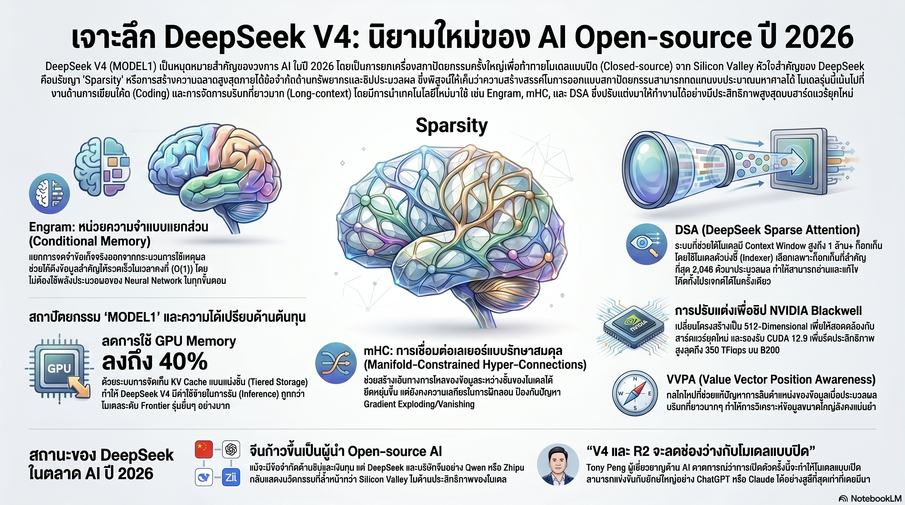

[กลับไปที่หน้าหลัก](../README.md)

สวัสดีครับเพื่อนๆ ที่ติดตามวงการ AI! วันนี้มาเรื่องที่อาจทำให้คุณมองสมรภูมิ AI โลกในมุมที่ต่างออกไปครับ เรื่องของโมเดลที่เกิดขึ้นภายใต้การคว่ำบาตรชิปที่โหดที่สุดในประวัติศาสตร์ แต่กลับทำให้ Silicon Valley ต้องรีบเหงื่อ

คุณเคยสงสัยไหมครับว่า ทำไมบริษัทที่ถูกจำกัดการเข้าถึงชิปที่ทรงพลังที่สุดในโลก ถึงสามารถสร้าง AI ที่แข่งขันกับโมเดลที่ใช้งบพัฒนาพันล้านดอลลาร์ได้?

คุณเคยนึกสงสัยไหมครับว่า ถ้า AI สามารถแยก "การจำ" ออกจาก "การคิด" เหมือนมนุษย์ที่จำว่า 2+2=4 โดยไม่ต้องคำนวณใหม่ทุกครั้ง มันจะประหยัดทรัพยากรไปได้แค่ไหน?

และคุณรู้ไหมครับว่า DeepSeek V4 สามารถ "อ่านและเข้าใจ" โค้ดทั้ง Codebase ของโปรเจกต์ขนาดใหญ่ได้พร้อมกันด้วย Context Window กว้างถึง 1 ล้าน Token ในขณะที่ใช้หน่วยความจำ GPU น้อยกว่าโมเดลรุ่นก่อนถึง 40%?

DeepSeek V4 (รหัสพัฒนา Model1) กำลังพิสูจน์ว่า "ความฉลาดเชิงโครงสร้าง" อาจเหนือกว่า "พลังของเงินทุน" ในการแข่งขัน AI ยุคนี้ครับ

========================================

🤔 ทบทวนความเชื่อเดิมๆ: สิ่งที่เราคิดเกี่ยวกับการแข่งขัน AI โลก

▪ "ยิ่งลงทุนมาก ยิ่งได้โมเดลที่เก่งกว่า เงินทุนคือกุญแจสำคัญ" → DeepSeek V4 ถูกพัฒนาภายใต้มาตรการคว่ำบาตรชิปที่เข้มงวดที่สุดในประวัติศาสตร์ แต่ประสิทธิภาพในงาน Coding และ Long-context อาจแซงหน้าทั้ง Claude และ ChatGPT แล้วในปัจจุบัน

▪ "ทุก Token ที่ AI ประมวลผลต้องผ่านกระบวนการ Neural Network เหมือนกันทั้งหมด" → Engram แยก "การจำข้อเท็จจริง" ออกจาก "การคิดวิเคราะห์" ทำให้ข้อมูลที่ไม่ต้องการการคำนวณซับซ้อนไม่ต้องเปลืองทรัพยากร Neural Network เลย

▪ "Context Window ยาวขึ้น = AI เก่งขึ้นโดยอัตโนมัติ" → ปัญหาคือ Positional Information Decay ที่ทำให้ AI ลืมตำแหน่งข้อมูลเมื่อบริบทยาวขึ้นมาก VVPA ใน DSA แก้ปัญหานี้ได้จริงๆ ไม่ใช่แค่ขยาย Window ให้ใหญ่ขึ้นเฉยๆ

▪ "จีนถูกคว่ำบาตรชิป = จีนแพ้แน่ในการแข่งขัน AI" → ข้อจำกัดด้านทรัพยากรบีบคั้นให้ต้องคิดสถาปัตยกรรมที่ฉลาดกว่า ผลคือ MoE, Engram, mHC ที่ไม่ได้เกิดขึ้นเพราะมีทรัพยากรล้นเหลือ แต่เกิดขึ้นเพราะ "ไม่มีทางเลือกอื่น" ครับ

ความจริงที่น่าคิดคือ: ประวัติศาสตร์ซ้ำรอยเสมอ ข้อจำกัดที่ดูเหมือนอุปสรรคมักเป็นที่มาของนวัตกรรมที่ยั่งยืนกว่าการทุ่มเงินซื้อทางออกครับ

========================================

🧠 พื้นฐานที่ต้องเข้าใจก่อน: MoE, Sparsity, Context Window และ Residual Connection

=== Mixture of Experts (MoE) คืออะไร? ===

MoE = สถาปัตยกรรมที่แทนที่จะให้ส่วนประมวลผลทุกชิ้นทำงานกับทุก Token ให้มี "ผู้เชี่ยวชาญ" หลายตัว แล้วเลือกใช้แค่ 2-4 ตัวที่เหมาะสมที่สุดสำหรับ Token นั้น

เปรียบเทียบ: เหมือนโรงพยาบาลที่มีแพทย์เฉพาะทางหลายสาขา แทนที่ทุกคนต้องไปพบ GP ก่อนทุกครั้ง MoE ส่งคนไข้ตรงไปหาหมอที่เชี่ยวชาญเรื่องนั้นๆ เลย ประหยัดเวลาและทรัพยากรอย่างมาก DeepSeek V4 มีผู้เชี่ยวชาญ 256+ ตัว แต่ใช้แค่ไม่กี่ตัวต่อการประมวลผลแต่ละครั้งครับ

=== Sparsity คืออะไร และทำไมถึงสำคัญ? ===

Sparsity = หลักการที่ว่า "ไม่ต้องทำงานทุกอย่าง ทำแค่ส่วนที่จำเป็น"

[Dense Model (โมเดลหนาแน่น)] ทุก Token → ผ่านพารามิเตอร์ทั้งหมด → ใช้พลังงานและหน่วยความจำสูง
[Sparse Model (โมเดลบางเบา)] ทุก Token → เลือกแค่ส่วนที่เกี่ยวข้อง → ประหยัดทรัพยากรอย่างมาก

เปรียบเทียบ: เหมือนร้านอาหาร All-you-can-eat VS ร้านอาหาร À la carte ที่คุณสั่งแค่อาหารที่ต้องการจริงๆ สำหรับ AI ที่ถูกจำกัดชิปประมวลผล Sparsity คือความแตกต่างระหว่าง "แพ้" กับ "ยังอยู่ในเกม" ครับ

=== Context Window คืออะไร? ===

Context Window = จำนวน Token สูงสุดที่ AI สามารถ "จำ" และ "ใช้" ได้ในการประมวลผลครั้งเดียว

[Context สั้น ~8K-32K Token] = อ่านได้แค่ไม่กี่หน้า ไม่พอสำหรับ Codebase ขนาดใหญ่
[Context ยาว 1 ล้าน Token] = อ่านโค้ดทั้งโปรเจกต์ขนาดกลางได้พร้อมกัน เห็นความสัมพันธ์ทุกไฟล์

ปัญหาคือ Context ยาวมากทำให้ AI ลืมตำแหน่งของข้อมูลเก่าๆ (Positional Information Decay) ซึ่ง DeepSeek V4 แก้ด้วยเทคนิค VVPA ครับ

=== Residual Connection คืออะไร? ===

Residual Connection = เส้นทางลัดที่ส่งข้อมูลข้ามชั้น (Layer) ของ Neural Network โดยตรง เพื่อป้องกันปัญหาสัญญาณอ่อนลงหรือระเบิดเมื่อโมเดลมีหลายชั้นมาก

เปรียบเทียบ: เหมือนทางด่วนที่ตัดผ่านถนนหลายสาย แทนที่รถต้องติดไฟแดงทุกแยก ปัญหาคือเมื่อโมเดลใหญ่ขึ้น ทางด่วนนี้อาจไม่เพียงพอหรือควบคุมยาก ซึ่ง mHC ของ DeepSeek แก้ไขจุดนี้ครับ

========================================

1️⃣ Sparsity: ยุทธศาสตร์เดียวที่ทำให้จีนยังอยู่ในเกม

=== วิวัฒนาการของ MoE ใน DeepSeek ===

DeepSeek ไม่ได้คิดค้น Sparsity ขึ้นมาใหม่ แต่พวกเขาผลักดันมันไปไกลกว่าใครครับ:

[DeepSeekMoE รุ่นแรก]
▸ ผู้เชี่ยวชาญ 64 ตัว
▸ พิสูจน์ว่า Sparsity ได้ผลจริงในโมเดลภาษา

[DeepSeek V3]
▸ ผู้เชี่ยวชาญเพิ่มเป็น 256 ตัว
▸ เพิ่มระบบ DeepEP สำหรับการสื่อสารระหว่างผู้เชี่ยวชาญแบบมีประสิทธิภาพ

[DeepSeek V4]
▸ การจัดการ Expert ถูกยกระดับอีกขั้น
▸ ผสานร่วมกับ Engram และ mHC เพื่อให้ Sparsity ทำงานได้ฉลาดยิ่งขึ้น

=== ทำไม Sparsity ถึงเป็น "ยุทธศาสตร์เดียว" สำหรับจีน? ===

เมื่อสหรัฐฯ คว่ำบาตรการส่งออกชิป H100/A100 ไปยังจีน DeepSeek ต้องหาวิธีทำมากกว่าเดิมด้วยทรัพยากรที่น้อยกว่า

[Dense Model กับชิปจำกัด] = ทำงานได้แต่ช้า ต้นทุนสูง ประสิทธิภาพด้อยกว่ามาก
[Sparse Model กับชิปจำกัด] = ทำงานได้เร็ว ต้นทุนต่ำ ประสิทธิภาพใกล้เคียงหรือดีกว่าในหลายงาน

เปรียบเทียบ: เหมือนนักวิ่งมาราธอนที่ถูกบังคับให้วิ่งด้วยรองเท้าหนักขึ้น แทนที่จะบ่น เขาฝึกเทคนิคการวิ่งที่ประหยัดพลังงานมากขึ้น จนในที่สุดวิ่งได้เร็วกว่าคนที่มีรองเท้าดีแต่ไม่ได้ฝึกเทคนิคครับ

========================================

2️⃣ Engram: เมื่อ AI เรียนรู้ที่จะแยก "จำ" ออกจาก "คิด"

=== ปัญหาที่ Engram แก้ไข ===

ลองนึกถึงสถานการณ์นี้ครับ: AI ถูกถามว่า "เมืองหลวงของฝรั่งเศสคือที่ไหน?" คำตอบคือ "ปารีส" ซึ่งเป็นข้อเท็จจริงที่ตายตัว แต่ในโมเดลทั่วไป AI ต้องใช้ทรัพยากร Neural Network เต็มๆ เหมือนกับที่ใช้วิเคราะห์บทกวีซับซ้อน ซึ่งไม่สมเหตุสมผลเลยครับ

[สิ่งที่ Engram เปลี่ยน]

[Neural Computation (Attention & MoE)]
▸ ยังทำหน้าที่: การใช้เหตุผลซับซ้อน, การสังเคราะห์ข้อมูลใหม่, การวิเคราะห์บริบท
▸ เหมือน: สมองส่วนคิดวิเคราะห์

[Memory Lookup (Engram — N-gram Lookup Module)]
▸ ทำหน้าที่: ดึงข้อมูลข้อเท็จจริงที่ตายตัว (วันที่, ชื่อ, ตัวเลข, สูตร)
▸ ความเร็ว: O(1) คงที่ ไม่ว่าฐานข้อมูลจะใหญ่แค่ไหน
▸ เหมือน: ระบบดัชนีในห้องสมุด ค้นหาได้ทันทีโดยไม่ต้องอ่านหนังสือทุกเล่ม

=== U-shaped Scaling Law: จุดสมดุลที่สมบูรณ์แบบ ===

DeepSeek ใช้กฎทางคณิตศาสตร์ U-shaped Scaling Law เพื่อหาว่าควรจัดสรรงานให้ Neural Network และ Engram อย่างละแค่ไหน ผลที่ได้คือ:
▸ ย้ายคลังความรู้บางส่วนจาก GPU VRAM (แพง) ไปไว้บน CPU Memory (ถูกกว่ามาก)
▸ Overhead ต่ำกว่า 3% หมายความว่าช้าลงแทบไม่รู้สึก
▸ แต่ประหยัด VRAM ได้มหาศาล ทำให้ไปลงทุนกับงานที่ต้องการการคำนวณจริงๆ ได้มากขึ้น

เปรียบเทียบ: เหมือนนักเรียนที่ฉลาดรู้ว่าอะไรควรท่องจำ (สูตรคณิตศาสตร์, วันที่สำคัญ) และอะไรควรฝึกคิดวิเคราะห์ ไม่ใช่ท่องจำทุกอย่างหรือคิดใหม่ทุกอย่าง แต่รู้จักแบ่งให้ถูกครับ

========================================

3️⃣ mHC: ทางด่วนข้อมูลที่ไม่ระเบิดและไม่หายไป

=== ปัญหาของ Residual Connection แบบเดิม ===

เมื่อโมเดล AI มีจำนวนชั้น (Layer) มากขึ้น มักเกิดปัญหาสองอย่างครับ:

[Gradient Explosion] = สัญญาณแรงขึ้นเรื่อยๆ จนระเบิด โมเดลพังระหว่างฝึก
[Gradient Vanishing] = สัญญาณอ่อนลงเรื่อยๆ จนหายไป โมเดลหยุดเรียนรู้

Hyper-Connections (HC) ที่ ByteDance เสนอในปี 2024 แก้บางส่วนได้ แต่ยังมีปัญหาความไม่เสถียรเมื่อโมเดลลึกมากครับ

=== วิธีแก้ของ mHC ===

mHC (Manifold-Constrained Hyper-Connections) นำหลักการทางคณิตศาสตร์ด้าน Manifold Geometry เข้ามาสร้าง "กรอบบังคับ" ที่ควบคุมการไหลของข้อมูลระหว่างชั้น

[Manifold Geometry คืออะไร?]
▸ Manifold = พื้นผิวทางคณิตศาสตร์ที่มีโครงสร้างและข้อจำกัดที่ชัดเจน
▸ การใช้ Manifold เป็นกรอบ = ข้อมูลไหลได้อิสระ แต่ไม่สามารถ "ระเบิด" หรือ "หายไป" เพราะมีขอบเขตทางคณิตศาสตร์บังคับ

เปรียบเทียบ: เหมือนทางหลวงหลายเลนที่มีระบบ AI จัดการจราจร รถ (ข้อมูล) วิ่งได้เร็วและมีหลายเส้นทาง แต่มีกฎจราจรอัจฉริยะที่ป้องกันไม่ให้เกิดรถติดพอกพูน (Explosion) หรือถนนว่างเปล่าทั้งหมด (Vanishing) ครับ

=== ความสำคัญสำหรับ V4 โดยรวม ===

mHC ไม่ใช่แค่การแก้ปัญหาเทคนิค แต่เป็นสิ่งที่ทำให้ DSA และ Engram ทำงานร่วมกันได้อย่างราบรื่น ถ้าไม่มี mHC การรวมระบบซับซ้อนเหล่านี้เข้าด้วยกันในโมเดลที่ลึกมากอาจทำให้โมเดลไม่เสถียรได้ครับ

========================================

4️⃣ Context Window 1 ล้าน Token: อ่านทั้ง Codebase ได้ในครั้งเดียว

=== DeepSeek Sparse Attention (DSA) และ VVPA ===

ปัญหาสำคัญของ Context Window ขนาดใหญ่คือ "Positional Information Decay" ครับ เมื่อข้อความยาวขึ้นมากๆ AI เริ่มลืมว่าข้อมูลเก่าอยู่ที่ตำแหน่งไหน ทำให้ความสัมพันธ์ระหว่างข้อมูลห่างๆ กันถูกมองข้ามไป

[DSA แก้ปัญหานี้อย่างไร?]
▸ Token-Level Sparse Attention: ไม่ต้องให้ทุก Token "สนใจ" ทุก Token อื่น แค่สนใจ Token ที่เกี่ยวข้องจริงๆ → ประหยัดการคำนวณมหาศาล
▸ VVPA (Value Vector Position Awareness): ระบบพิเศษที่ช่วยให้ AI "จำตำแหน่ง" ของข้อมูลได้แม่นยำแม้บริบทยาวมาก

[ผลที่ได้ในทางปฏิบัติ]
▸ Context Window 1 ล้าน Token = อ่านโค้ดประมาณ 50,000-100,000 บรรทัดได้พร้อมกัน
▸ Multi-file Debugging: เห็นความสัมพันธ์ระหว่างไฟล์ต่างๆ ในโปรเจกต์ได้ครบในครั้งเดียว
▸ Refactoring ทั้งระบบ: เข้าใจผลกระทบการเปลี่ยนแปลงทุกจุดก่อนแก้ไข

เปรียบเทียบ: เหมือนความต่างระหว่างอ่านนิยายที่ต้องทำข้อสอบทีละบท กับนักอ่านที่อ่านจบทั้งเล่มก่อนแล้วค่อยวิเคราะห์ความสัมพันธ์ของตัวละครทั้งหมด แบบหลังเข้าใจภาพรวมได้ดีกว่าอย่างสิ้นเชิงครับ

=== ประสิทธิภาพในงาน Coding ===

จากการทดสอบภายใน V4 อาจแซงหน้าทั้ง Claude และ ChatGPT ในงาน:
▸ Codebase-level debugging (หาบั๊กข้ามไฟล์)
▸ Long-context comprehension (เข้าใจเอกสารหรือโค้ดยาวๆ)
▸ System-wide refactoring (ปรับโครงสร้างโค้ดทั้งระบบ)

========================================

5️⃣ Model1 บน Blackwell: เรื่องราวของการต้องเลือกระหว่างอุดมการณ์กับประสิทธิภาพ

=== ดราม่าเบื้องหลัง: Huawei VS Nvidia ===

มีเรื่องราวเชิงยุทธศาสตร์ที่น่าสนใจซ่อนอยู่เบื้องหลัง V4 ครับ:

[ความพยายามที่ล้มเหลว]
▸ DeepSeek พยายามฝึกโมเดลบนชิป Huawei Ascend ตามนโยบาย "ลดการพึ่งพาสหรัฐฯ"
▸ ปัญหาที่พบ: เสถียรภาพต่ำ, Interconnect ล่าช้า, โครงการล่าช้าหลายเดือน

[การตัดสินใจที่ต้องทำ]
▸ สุดท้ายต้องกลับไปใช้ Nvidia ในการ Training
▸ เก็บชิป Huawei ไว้สำหรับ Inference เท่านั้น (รันโมเดลที่ฝึกแล้ว ไม่ใช่ฝึกใหม่)

[บทเรียนจากเรื่องนี้]
▸ แม้แต่ DeepSeek ยังพึ่งพา Nvidia ในขั้นตอนที่สำคัญที่สุดครับ
▸ แสดงให้เห็นว่าการลดการพึ่งพาชิปสหรัฐฯ ยังอยู่ระหว่างกระบวนการ ไม่ใช่สำเร็จแล้ว

=== สเปกทางเทคนิคสำหรับชิป Blackwell (SM100) ===

[Blackwell Optimization]
▸ ปรับจาก 576-dimension เป็น 512-dimension
▸ เหตุผล: สอดรับกับสถาปัตยกรรม SM100 ของ Nvidia Blackwell อย่างเต็มประสิทธิภาพ

[Extreme Performance]
▸ รองรับ CUDA 12.9
▸ ทำความเร็วได้ 350 TFlops บน B200 สำหรับ Sparse MLA

[Memory Efficiency]
▸ ใช้ FP8 ในการจัดเก็บ KV cache
▸ ลดการใช้ GPU Memory ได้ถึง 40% เทียบกับรุ่นก่อน
▸ ทำให้ Context Window 1 ล้าน Token เป็นไปได้จริงในทางปฏิบัติครับ

เปรียบเทียบ: เหมือนวิศวกรรถยนต์ที่ปรับเครื่องยนต์ให้ใช้น้ำมันได้คุ้มขึ้น 40% ซึ่งไม่ใช่แค่ประหยัดต้นทุน แต่ทำให้วิ่งได้ไกลขึ้นมากโดยไม่ต้องแบกถังน้ำมันใหญ่ขึ้นเลยครับ

========================================

🎯 สรุป: 5 บทเรียนจาก DeepSeek V4

▸ Sparsity คือยุทธศาสตร์แห่งการอยู่รอด: เมื่อทรัพยากรถูกจำกัด ความฉลาดในการเลือกว่าจะใช้ทรัพยากรตรงไหนสำคัญกว่าการมีทรัพยากรมหาศาล
▸ แยก "จำ" ออกจาก "คิด" ด้วย Engram: ข้อเท็จจริงที่ตายตัวไม่ควรใช้ทรัพยากร Neural Network เท่ากับการใช้เหตุผลซับซ้อน ประหยัด VRAM ได้มากโดยแทบไม่เสีย Overhead
▸ mHC ทำให้โมเดลลึกได้โดยไม่ระเบิด: Manifold Geometry สร้างกรอบที่ให้ข้อมูลไหลอิสระแต่ปลอดภัย เป็นรากฐานที่ทำให้นวัตกรรมอื่นๆ ทำงานร่วมกันได้
▸ Context 1 ล้าน Token ต้องการมากกว่าแค่ขนาด: VVPA แก้ปัญหา Positional Decay ที่ทำให้ Context Window ยาวๆ ใช้ได้จริง ไม่ใช่แค่ตัวเลข
▸ อุดมการณ์ปะทะความเป็นจริง: แม้ต้องการลดการพึ่งพา Nvidia แต่ V4 ยังต้อง Train บน Nvidia เพราะยังไม่มีทางเลือกอื่นที่เสถียรพอในขั้นตอนนี้

หลักการสำคัญ: "DeepSeek Effect พิสูจน์ว่า 'นวัตกรรมจากข้อจำกัด' อาจยั่งยืนกว่า 'นวัตกรรมจากทรัพยากรล้นเหลือ' เพราะเมื่อคุณถูกบีบจนไม่มีทางเลือก คุณต้องคิดสิ่งที่ไม่มีใครคิดมาก่อน และนั่นคือที่มาของสถาปัตยกรรมที่เหนือชั้นกว่าครับ"

========================================

💬 คำถามท้ายทาย

1. Engram แยก "การจำ" ออกจาก "การคิด" ได้สำเร็จ ถ้าหลักการนี้ขยายไปสู่ระบบอื่น เช่น หุ่นยนต์หรือระบบควบคุม คุณคิดว่ามันจะเปลี่ยนวิธีออกแบบ AI ในทางปฏิบัติอย่างไร?

2. การที่ DeepSeek ต้องยอมกลับมาใช้ Nvidia สำหรับ Training แม้จะมีเป้าหมายลดการพึ่งพา สะท้อนอะไรเกี่ยวกับความยากในการทดแทนโครงสร้างพื้นฐานเทคโนโลยีที่ถูกสร้างมานาน? มันต่างจากการพยายามทดแทนซอฟต์แวร์หรือแพลตฟอร์มอย่างไร?

3. ถ้า V4 ดีพอที่จะแซง Claude และ ChatGPT ในงาน Coding จริงๆ แต่ยังเป็น Open-weight Model ที่ใครก็ใช้ได้ คุณคิดว่ากลยุทธ์ธุรกิจของ Anthropic และ OpenAI ที่เน้นโมเดล Proprietary จะต้องปรับเปลี่ยนอย่างไร?

4. "ข้อจำกัดบีบคั้นให้เกิดนวัตกรรม" เป็นแนวคิดที่เห็นในหลายอุตสาหกรรม (Apollo Program, F1 Racing, Startup ที่งบน้อย) คุณคิดว่าหลักการนี้มีขีดจำกัดไหม หรือมีสภาวะที่ "มีทรัพยากรมากกว่า" จะให้ผลลัพธ์ที่ดีกว่าเสมอครับ?

========================================

References:
▸ DeepSeek V4 (Model1) Technical Report — DeepSeek AI
▸ DeepSeek V3 Technical Report — MoE Architecture และ DeepEP
▸ Hyper-Connections (HC) — ByteDance Research, 2024
▸ Native Sparse Attention (NSA) — งานวิจัยพื้นฐานของ DSA
▸ Engram: Conditional Memory for LLMs — DeepSeek AI, มกราคม 2026
▸ Nvidia Blackwell Architecture (B200/SM100) — CUDA 12.9 Optimization
▸ Huawei Ascend AI Chip — ทางเลือกในการประมวลผล AI สำหรับตลาดจีน

ในสมรภูมิ AI ที่กำลังนิยามใหม่ว่า "ชนะ" แปลว่าอะไร บางทีคำตอบอาจไม่ใช่ "ใครมีทรัพยากรมากกว่า" แต่คือ "ใครรู้จักใช้สิ่งที่มีได้ฉลาดกว่า" ครับ ⚡

#DeepSeekV4 #Model1 #MoE #Sparsity #Engram #AIChina #ContextWindow #BlackwellOptimization #AIArchitecture #DeepSeekEffect
