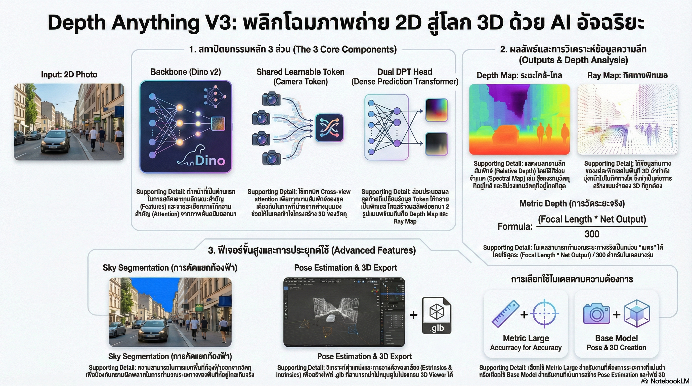

[กลับไปที่หน้าหลัก](../README.md)

สวัสดีครับเพื่อนๆ นักพัฒนาและคนรัก AI! วันนี้เรามาคุยเรื่องเทคโนโลยีที่น่าทึ่งมากๆ ครับ นั่นก็คือ Depth Anything V3 ซึ่งเป็น AI ที่สามารถเปลี่ยนภาพถ่าย 2D ธรรมดาๆ ให้กลายเป็นโลก 3D ได้!

คุณเคยสงสัยไหมครับว่า ทำไมสายตาเราถึงรู้ทันทีว่าแก้วน้ำอยู่ใกล้กว่าต้นไม้ข้างหน้า? หรือทำไมเราถึงไม่เดินชนผนังตอนเดินในความมืด? นั่นเพราะสมองเราประมวลผล "ความลึก" (Depth) ได้อย่างอัตโนมัติครับ แต่สำหรับคอมพิวเตอร์แล้ว มันมองทุกอย่างเป็นแค่ตาราง pixels แบนๆ ไม่มีมิติ ไม่มีระยะ

นี่คือโจทย์ใหญ่ที่วงการ Computer Vision พยายามแก้มาหลายสิบปี และ Depth Anything V3 กำลังพิสูจน์ว่าเราแก้ปัญหานี้ได้แล้วในระดับที่น่าทึ่งมากๆ!

========================================

🧠 ทบทวนพื้นฐาน: ทำไมการมองเห็น 3D ถึงยากสำหรับ AI?

ก่อนที่เราจะไปดูว่า Depth Anything V3 ทำงานอย่างไร มาทำความเข้าใจปัญหาพื้นฐานกันก่อนนะครับ

เมื่อเราถ่ายภาพด้วยกล้อง สิ่งที่เกิดขึ้นคือโลก 3 มิติถูก "กด" ให้แบนลงเป็น 2 มิติ ข้อมูลเรื่องความลึกหายไปทันที!

ลองนึกภาพว่าคุณบีบลูกเทนนิสให้แบน แล้วถามคนอื่นว่ามันกลมแค่ไหน... ยากมากใช่ไหมครับ? นั่นแหละคือปัญหาที่ AI เผชิญทุกครั้งที่มองภาพถ่าย

วิธีการเก่าๆ ที่ใช้กัน:
▪ ใช้กล้อง Stereo (2 ตา): วัดระยะได้ แต่ต้องพกกล้องสองตัว
▪ ใช้ Lidar/Depth Camera: แม่นมาก แต่แพงมาก (ใช้ในรถ Tesla, iPhone Pro)
▪ ใช้ AI วิเคราะห์จากภาพเดียว: ถูกและสะดวก แต่ความแม่นยำยังไม่ดีพอ

Depth Anything V3 มาแก้ปัญหาข้อสุดท้ายให้ได้ผลดีอย่างไม่น่าเชื่อ!

========================================

1. 🏗️ หัวใจของระบบ: เมื่อ Dino v2 ผสานพลังกับ Camera Tokens

สถาปัตยกรรมของ Depth Anything V3 ถูกออกแบบมาอย่างชาญฉลาดมากครับ มาดูองค์ประกอบสำคัญกัน

=== กระดูกสันหลัง: Dino v2 ===

DINOv2 คือโมเดลที่ถูกฝึกมาให้ "เข้าใจ" ภาพในระดับลึก โดยมันเรียนรู้จากภาพจำนวนมหาศาลโดยไม่ต้องมีคนมาบอกว่าแต่ละภาพคืออะไร (Self-supervised learning)

เปรียบเทียบกับโลกจริง:
▸ DINOv2 เหมือนนักสังเกตการณ์ที่ดูภาพหลายล้านภาพมาตลอดชีวิต
▸ จนเข้าใจเองว่า "ขอบ" คืออะไร "พื้นผิว" คืออะไร "เงา" บอกอะไรเราได้บ้าง
▸ โดยไม่ต้องมีครูมาสอนทีละภาพ!

=== นวัตกรรมหลัก: Camera Tokens ===

แต่สิ่งที่ทำให้ Depth Anything V3 ฉลาดกว่าเดิมมากๆ คือการเพิ่ม "Camera Tokens" หรือ Shared Learnable Tokens เข้ามาครับ

Camera Tokens คืออะไร?

ลองนึกภาพว่าคุณต้องเปรียบเทียบภาพถ่าย 2 ใบของอาคารเดียวกัน ถ่ายจากคนละมุม โดยไม่มีแผนที่บอกว่ากล้องอยู่ที่ไหน คุณจะรู้ได้ยังไงว่าเสาในภาพซ้ายตรงกับเสาไหนในภาพขวา?

วิธีที่มนุษย์ทำ:
▸ มองหาจุดสังเกตที่เหมือนกัน (เช่น หน้าต่างบานเดียวกัน, ขอบอาคาร)
▸ เปรียบเทียบตำแหน่งสัมพัทธ์
▸ สร้างภาพ 3D ในหัว

วิธีที่ Camera Tokens ทำ:
▸ ทำหน้าที่เหมือน "ดวงตาคู่ที่สอง" ของ AI
▸ วิเคราะห์ Cross-view attention ว่าพิกเซลในภาพซ้ายตรงกับพิกเซลไหนในภาพขวา
▸ สร้างความเชื่อมโยงระหว่างภาพ ทำให้ AI เข้าใจว่าวัตถุนี้อยู่ที่ไหนใน 3D space

=== เทคนิคพิเศษ: จัดการความละเอียดภาพอย่างชาญฉลาด ===

Depth Anything V3 ยังใช้เทคนิคที่เรียกว่า "upper boundary size" ในการจัดการความละเอียดภาพ

วิธีการทำงาน:
▸ ยึดด้านที่ยาวที่สุดของภาพเป็นหลัก
▸ คำนวณด้านที่เหลือตามสัดส่วนเดิม (Aspect Ratio)
▸ ได้ผลลัพธ์ที่คมชัดที่สุดโดยไม่ยืดหรือบีบภาพ

เปรียบเทียบ:
▸ วิธีเก่า = ย่อภาพให้พอดีกรอบสี่เหลี่ยม (อาจจะยืดเสียรูป)
▸ วิธีใหม่ = ขยาย/ย่อตามสัดส่วนจริง (รูปร่างถูกต้องเสมอ)

========================================

2. 📏 ก้าวข้ามขีดจำกัดเดิม: วัดระยะเป็น "เมตร" ได้จริง!

นี่คือส่วนที่ทำให้ Depth Anything V3 แตกต่างจากรุ่นก่อนๆ อย่างสิ้นเชิงครับ

=== Relative Depth vs Metric Depth ===

[Relative Depth (การวัดแบบเปรียบเทียบ)] ← รุ่นก่อนๆ ทำได้แค่นี้
▸ บอกได้แค่ว่า "A อยู่หน้ากว่า B"
▸ หรือ "C อยู่ไกลกว่า D"
▸ ไม่รู้ว่าห่างกันเท่าไหร่จริงๆ
▸ เหมือนบอกว่า "เสาต้นนั้นสูงกว่าต้นนี้" แต่ไม่รู้ว่าสูงกี่เมตร

[Metric Depth (การวัดแบบแม่นยำ)] ← Depth Anything V3 ทำได้!
▸ บอกได้ว่า "A อยู่ห่าง 2.3 เมตร"
▸ "B อยู่ห่าง 5.7 เมตร"
▸ รู้ระยะห่างจริงๆ เป็นหน่วยเมตร
▸ เหมือนมีตลับเมตรวัดในอากาศ!

=== คำนวณยังไง? ===

สำหรับโมเดลอย่าง DA3 Metric Large สามารถหาค่าความลึกที่แท้จริงได้ด้วยสูตร:

ระยะห่าง (เมตร) = [Focal Length ของกล้อง × Net Output] ÷ 300

โดยที่:
▸ Focal Length คือค่าที่บอกว่ากล้องของคุณมีมุมมองกว้างแค่ไหน
▸ Net Output คือตัวเลขที่โมเดลคำนวณออกมา
▸ 300 คือค่าคงที่ที่ใช้ปรับสเกลให้ออกมาเป็นเมตร

แต่ถ้าใช้โมเดลรุ่นท็อปสุด (Nested Giant Large) จะง่ายกว่ามาก:
▸ ผลลัพธ์ที่ได้จะเป็นหน่วยเมตรโดยตรงเลย!
▸ ไม่ต้องคำนวณอะไรเพิ่มเติม
▸ หยิบตัวเลขไปใช้ได้เลย

=== ทำไม Metric Depth ถึงสำคัญมาก? ===

นึกภาพการใช้งานจริงๆ ครับ:

[หุ่นยนต์ในคลังสินค้า]
▸ ต้องรู้ว่ากล่องอยู่ห่าง 1.5 เมตร ไม่ใช่แค่ "อยู่ใกล้ๆ"
▸ ต้องยื่นแขนไปให้ถูกระยะ ไม่งั้นหยิบพลาด
▸ Relative Depth ไม่พอ ต้องการ Metric Depth!

[รถยนต์ไร้คนขับ]
▸ ต้องรู้ว่าคนเดินข้ามถนนอยู่ห่าง 8 เมตร
▸ เพื่อคำนวณว่าต้องเบรกตอนไหน ที่ความเร็วเท่าไหร่
▸ ผิดแค่ 1 เมตร อาจหมายถึงอุบัติเหตุ!

[AR/VR และ Metaverse]
▸ ต้องวางวัตถุเสมือนให้อยู่ในตำแหน่งที่ถูกต้องในพื้นที่จริง
▸ โซฟาเสมือนต้องวางบนพื้นจริง ไม่ใช่ลอยอยู่กลางอากาศ
▸ ต้องรู้ระยะห่างจริงๆ!

========================================

3. 🌤️ แก้ปัญหาท้องฟ้า: เมื่อ AI ฉลาดพอจะรู้ว่าอะไรคือ "อนันต์"

ปัญหาคลาสสิกมากๆ ในการวัดความลึกคือ "ท้องฟ้า" ครับ

=== ปัญหาคืออะไร? ===

ลองนึกภาพว่าคุณถ่ายภาพตึกในเมือง ด้านบนเป็นท้องฟ้าสีฟ้า

เมื่อ AI พยายามวัดระยะของ "ท้องฟ้า":
▸ ท้องฟ้าอยู่ไกลจนเป็นอนันต์ (Infinity)
▸ ระบบพยายามจะใส่ตัวเลขให้ แต่ไม่มีค่าที่ถูกต้อง
▸ เกิดค่าผิดปกติ (Outliers) ในแผนที่ความลึก
▸ ทำให้ภาพ 3D ที่ได้มีจุดแปลกๆ อยู่ด้านบน

เปรียบเทียบกับโลกจริง:
▸ เหมือนคุณใช้ไม้บรรทัดวัดระยะห่างของดาวอาทิตย์
▸ ไม้บรรทัดไม่ยาวพอ ตัวเลขที่ได้ก็เชื่อไม่ได้

=== Sky Segmentation แก้ปัญหาอย่างไร? ===

Depth Anything V3 แก้ปัญหานี้ด้วยวิธีที่เรียบง่ายแต่ฉลาดมาก:

ขั้นที่ 1: ตรวจจับท้องฟ้า
▸ AI วิเคราะห์ภาพว่า Pixel ไหนบ้างที่เป็น "ท้องฟ้า"
▸ ดูจากสี, พื้นผิว, ตำแหน่ง และลักษณะอื่นๆ
▸ สร้าง "Mask" หรือหน้ากากบอกตำแหน่งท้องฟ้า

ขั้นที่ 2: กรองออก
▸ พื้นที่ที่ระบุว่าเป็นท้องฟ้าจะถูกข้ามในการคำนวณระยะ
▸ ระบบจะโฟกัสแค่วัตถุที่จับต้องได้จริง เช่น ตึก, ต้นไม้, รถ, คน

ขั้นที่ 3: แผนที่ความลึกที่สะอาด
▸ ผลลัพธ์ที่ได้คือ Depth Map ที่ไม่มี noise จากท้องฟ้า
▸ ข้อมูลทุก Pixel ที่มีอยู่ล้วนมีความหมายและเชื่อถือได้

เปรียบเทียบ:
▸ ก่อนมี Sky Segmentation = แผนที่ที่มีหลุมดำใหญ่อยู่ตรงกลาง ใช้งานลำบาก
▸ หลังมี Sky Segmentation = แผนที่ที่สะอาด ทุกส่วนที่มีข้อมูลล้วนถูกต้อง

========================================

4. 🎬 จากภาพนิ่งสู่โมเดล 3D ที่หมุนได้รอบทิศ

นี่คือส่วนที่เจ๋งที่สุดของ Depth Anything V3 ครับ นั่นคือการสร้างโมเดล 3D เต็มรูปแบบจากภาพถ่ายธรรมดา!

=== Dual DPT Head: สร้างผลลัพธ์ 2 อย่างพร้อมกัน ===

ชื่อเต็มคือ Dense Prediction Transformer (DPT) และมันสร้าง Output 2 ชนิดพร้อมกันในครั้งเดียว:

[Output ที่ 1: Depth Map]
▸ บอกว่าแต่ละ Pixel อยู่ใกล้หรือไกลกล้องแค่ไหน
▸ เหมือนแผนที่ความสูงของภูเขา แต่เป็นความลึกแทน
▸ Pixel สีขาว = ใกล้กล้อง, สีดำ = ไกลกล้อง

[Output ที่ 2: Ray Map]
▸ บอกทิศทางของแต่ละ Pixel ในพื้นที่ 3D
▸ เหมือนบอกว่า "Pixel ตัวนี้กำลังพุ่งออกไปในทิศทางไหนในอวกาศ"
▸ จำเป็นมากสำหรับการ "คืนรูป" จาก 2D กลับเป็น 3D

=== ขั้นตอนการสร้าง 3D Model ===

เมื่อได้ Depth Map และ Ray Map แล้ว ระบบจะนำมารวมกับข้อมูลกล้อง 2 ชนิด:

[1] Extrinsics (ตำแหน่งและมุมองค์กล้อง)
▸ กล้องอยู่ที่ไหนในพื้นที่ 3D?
▸ กล้องหันไปทางไหน? เงยขึ้น? ก้มลง? หันซ้าย-ขวา?

[2] Intrinsics (คุณสมบัติการฉายภาพของกล้อง)
▸ Focal Length คือเท่าไหร่?
▸ กล้องมีการบิดเบี้ยว (Lens distortion) ไหม?
▸ จุดศูนย์กลางของภาพอยู่ที่ไหน?

เมื่อนำทุกอย่างมารวมกัน จะได้ไฟล์ .glb ซึ่งเป็นโมเดล 3D สมบูรณ์!

=== ตัวอย่างจริง: Sydney Opera House ===

สมมติว่าเราเอาภาพ Sydney Opera House 2 ใบ ถ่ายจากคนละมุม ไปผ่านระบบ:

ขั้นที่ 1: ระบบวิเคราะห์ภาพทั้งสอง
▸ Camera Tokens หาจุดที่ตรงกันในภาพทั้งสองใบ
▸ คำนวณว่ากล้องแต่ละตัวอยู่ที่ไหนในพื้นที่ 3D

ขั้นที่ 2: สร้าง Depth Map และ Ray Map
▸ วิเคราะห์ระยะของแต่ละส่วนของอาคาร
▸ สร้างแผนที่ทิศทางของแต่ละ Pixel

ขั้นที่ 3: ประกอบโมเดล 3D
▸ นำทุกอย่างมาประกอบกัน
▸ ได้ไฟล์ .glb ที่เปิดได้ใน 3D Viewer

สิ่งที่คุณจะเห็นใน 3D Viewer:
▸ โมเดล Sydney Opera House ที่หมุนดูได้รอบทิศ
▸ 🟢 กล้องสีเขียว = ตำแหน่งที่ถ่ายภาพใบแรก
▸ 🟣 กล้องสีม่วง = ตำแหน่งที่ถ่ายภาพใบสอง
▸ เห็นชัดเลยว่าแต่ละภาพถ่ายจากมุมไหน

========================================

5. 🔄 เลือกโมเดลให้เหมาะกับงาน

Depth Anything V3 มีโมเดลหลายแบบ แต่ละแบบเก่งคนละด้าน มาดูว่าแบบไหนเหมาะกับงานอะไร

=== DA3 Metric Large: เชี่ยวชาญเรื่องระยะทาง ===

จุดเด่น:
▸ ✅ วัดระยะเป็นเมตรได้แม่นยำ (Metric Depth)
▸ ✅ แยกส่วนท้องฟ้าออกจากการคำนวณ (Sky Segmentation)
▸ ✅ ประมาณความลึกแบบเปรียบเทียบ (Relative Depth)
▸ ❌ ไม่มีการหาตำแหน่งกล้อง (Pose Estimation)

เหมาะกับงานไหน:
▸ หุ่นยนต์ที่ต้องรู้ระยะห่างแม่นยำ
▸ รถยนต์ไร้คนขับ
▸ ระบบตรวจสอบความปลอดภัยในโรงงาน
▸ งานที่ต้องการตัวเลขระยะทางจริงๆ

=== DA3 Base (Any-view): เชี่ยวชาญเรื่องสร้างโมเดล 3D ===

จุดเด่น:
▸ ✅ ประมาณความลึกแบบเปรียบเทียบ (Relative Depth)
▸ ✅ หาตำแหน่งกล้องได้ (Pose Estimation)
▸ ❌ ไม่วัดระยะเป็นเมตร
▸ ❌ ไม่มี Sky Segmentation

เหมาะกับงานไหน:
▸ สร้างโมเดล 3D จากภาพหลายใบ
▸ งาน AR/VR ที่ต้องวางวัตถุให้ถูกตำแหน่ง
▸ สแกนอาคารหรือสถานที่เพื่อสร้าง 3D Tour
▸ งานที่ต้องการรู้ว่ากล้องอยู่ที่ไหนในพื้นที่

=== ตัวอย่างการเลือกใช้ ===

สถานการณ์ที่ 1: คุณสร้างหุ่นยนต์หยิบของในคลังสินค้า
▸ → เลือก DA3 Metric Large
▸ เพราะต้องรู้ว่ากล่องอยู่ห่างกี่เมตร ไม่ใช่แค่ "อยู่ใกล้ๆ"

สถานการณ์ที่ 2: คุณสร้างแอปสแกนห้องเพื่อวางเฟอร์นิเจอร์ใน AR
▸ → เลือก DA3 Base (Any-view)
▸ เพราะต้องสร้าง 3D model ของห้องและรู้ตำแหน่งกล้องขณะเดิน

สถานการณ์ที่ 3: คุณสร้างระบบช่วยขับรถ
▸ → เลือก DA3 Metric Large
▸ เพราะต้องรู้ระยะห่างแม่นยำเพื่อคำนวณการเบรก

========================================

สรุป: เทคโนโลยีที่กำลังเปลี่ยนโลก

Depth Anything V3 ไม่ใช่แค่การอัปเดตโมเดล AI ธรรมดาๆ ครับ แต่มันคือการหลอมรวมพลังของ Deep Learning เข้ากับหลักเรขาคณิต 3D ได้อย่างสมบูรณ์แบบ

สรุปสิ่งที่ทำได้:
▪ วิเคราะห์ความลึกจากภาพ 2D ธรรมดา ได้โดยไม่ต้องใช้อุปกรณ์พิเศษ
▪ วัดระยะห่างเป็นเมตร ได้แม่นยำระดับที่ใช้งานได้จริง
▪ สร้างโมเดล 3D เต็มรูปแบบ จากภาพถ่ายเพียงไม่กี่ใบ
▪ จัดการกับปัญหาท้องฟ้า ที่เคยเป็นจุดอ่อนของระบบมาตลอด

ประโยชน์ที่กำลังเกิดขึ้นแล้ว:
▸ หุ่นยนต์ในโรงงานและคลังสินค้า
▸ รถยนต์ไร้คนขับ
▸ AR/VR และ Metaverse
▸ การสร้าง Digital Twin ของอาคารและเมือง

และในอนาคตที่ใกล้จะถึง...

ลองนึกภาพดูนะครับว่า ถ้าเทคโนโลยีนี้ถูกฝังไปในสมาร์ทโฟนทั่วไปในอีก 2-3 ปีข้างหน้า:

▸ คุณจะสแกนห้องนั่งเล่นในไม่กี่วินาที แล้วลองวางโซฟาตัวใหม่ผ่าน AR ก่อนซื้อจริง
▸ นักโบราณคดีจะสแกนแหล่งขุดค้นด้วยมือถือ แทนที่จะต้องใช้อุปกรณ์ราคาแพง
▸ สถาปนิกจะเดินสำรวจพื้นที่แล้วได้แบบ 3D ทันทีโดยไม่ต้องมีทีมสำรวจ

นี่คือสิ่งที่น่าติดตามอย่างยิ่งในก้าวต่อไปของ AI Vision ครับ!

========================================

อ้างอิง:
• Depth Anything V3 Technical Report
• DINOv2: Learning Robust Visual Features without Supervision
• Dense Prediction Transformer (DPT) Architecture
• SEA-HELM Benchmark

หวังว่าบทความนี้จะเปิดโลกทัศน์ให้ทุกคนเห็นว่า AI กำลังก้าวข้ามขีดจำกัดของการมองภาพแบบ 2D ไปสู่ 3D ได้แล้วอย่างน่าทึ่ง! ถ้ามีคำถามหรืออยากคุยเพิ่มเติม comment ได้เลยนะครับ 😊
