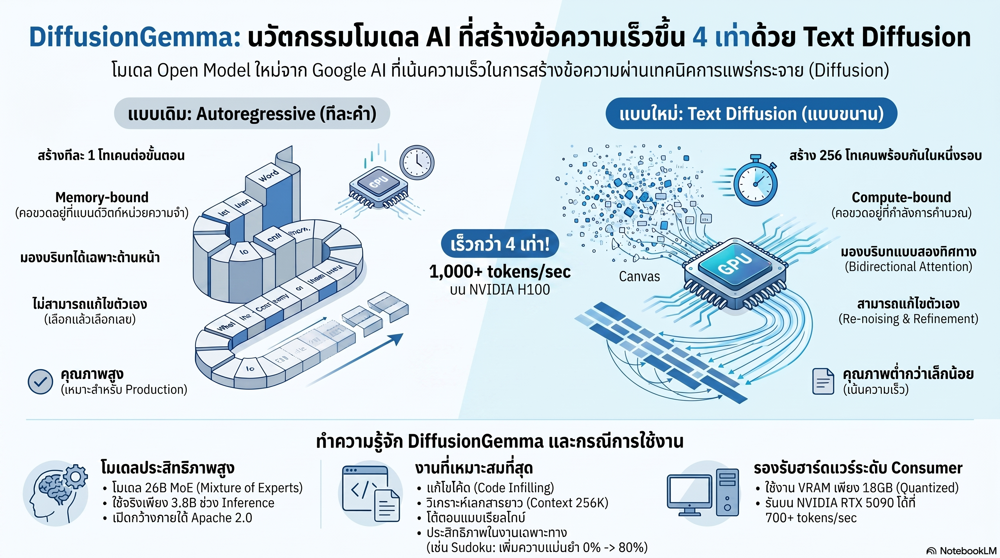

[กลับไปที่หน้าหลัก](../README.md)

สวัสดีครับเพื่อนๆ ที่ติดตามวงการ AI! LLM ทุกตัวที่เราใช้อยู่ทุกวันนี้ "พิมพ์" คำตอบออกมาทีละ Token ครับ ไม่ว่าจะฉลาดแค่ไหน ก็ยังต้องรอ GPU โหลด Weights จากหน่วยความจำซ้ำแล้วซ้ำเล่าเพื่อสร้าง Token เพียงตัวเดียวครับ Google AI เพิ่งเปิดตัว DiffusionGemma ที่ไม่ได้มาเพื่อ "พิมพ์" แต่มาเพื่อ "วาด" ข้อความทั้งบล็อก 256 Tokens พร้อมกันในคราวเดียว ทำความเร็วทะลุ 1,000+ tokens/sec บน H100 — เร็วกว่าโมเดลปกติ 4 เท่าครับ

คุณเคยสังเกตไหมครับว่า ทุกครั้งที่ LLM สร้างคำตอบ GPU อันทรงพลังนั้นกลับนั่งเฉยอยู่เป็นส่วนใหญ่ครับ เพราะมัน "Memory-bandwidth-bound" — ต้องเสียเวลารอโหลด Weights จาก Memory ซ้ำๆ เพื่อสร้างแค่คำเดียว แล้วค่อยโหลดใหม่เพื่อคำถัดไปครับ Tensor Cores ที่ออกแบบมาสำหรับการคำนวณขนานขนาดใหญ่กลับนั่งรอแทบไม่ได้ทำอะไรครับ?

คุณรู้ไหมครับว่า AI สร้างรูปภาพอย่าง Stable Diffusion และ Midjourney ทำงานแบบ Parallel ตั้งแต่ต้นครับ มันไม่ได้วาดภาพทีละ Pixel ตามลำดับ แต่ค่อยๆ ขัดเกลาทั้งภาพพร้อมกันจากสัญญาณรบกวน (Noise) จนกลายเป็นภาพที่ชัดเจนครับ ทำไมแนวคิดเดียวกันนี้ถึงไม่เคยถูกนำมาใช้กับการสร้างข้อความอย่างจริงจังครับ?

และคุณเคยนึกไหมครับว่า โมเดลแบบ Autoregressive ที่เขียนทีละคำนั้นมีข้อเสียสำคัญอยู่อย่างหนึ่งครับ: ถ้าคำที่ 50 ที่เพิ่งพิมพ์ออกมาไม่เข้ากับสิ่งที่คำที่ 100 จะเขียนถัดไปครับ มันแก้ไขไม่ได้แล้วครับ เพราะเดินหน้าไปแล้วจะหยุดถอยหลังไม่ได้ครับ แล้วถ้ามีโมเดลที่สามารถ "ย้อนกลับไปแก้" ส่วนที่ไม่มั่นใจก่อนส่งงานจริงได้ล่ะครับ จะเปลี่ยนอะไรบ้างครับ?

งานวิจัยนี้กำลังบอกว่า: "คอขวดของ AI ไม่ได้อยู่ที่ความฉลาดของโมเดลครับ แต่อยู่ที่กระบวนการสร้างที่บังคับให้ทำงานแบบ Sequential ทีละคำครับ เมื่อเปลี่ยนจากการ 'พิมพ์' เป็นการ 'วาด' ข้อความแบบ Parallel เหมือนการสร้างภาพ AI ทั้ง Bottleneck ของ Memory-bandwidth ก็หายไป และพลังของ GPU ก็ถูกใช้งานอย่างเต็มที่ครับ"

========================================

🤔 ทบทวนความเชื่อเดิมๆ: สิ่งที่เราคิดเกี่ยวกับ LLM และความเร็ว

▪ "LLM เร็วขึ้นได้ก็แค่ต้องใช้ GPU รุ่นใหม่กว่าหรือโมเดลเล็กกว่าเท่านั้นครับ — Architecture ปัจจุบันนั้น Optimize ดีพอแล้วครับ" → Memory-bandwidth-bound คือ Fundamental Constraint ของ Autoregressive Generation ครับ ไม่ใช่ปัญหาของ GPU ที่อ่อนแอเกินไปครับ แม้ใช้ H100 ที่แรงที่สุด Tensor Cores ก็ยังต้องนั่งรอการโหลด Weights ซ้ำๆ ทุก Token ครับ DiffusionGemma เปลี่ยน Bottleneck ทั้งหมดไปเป็น Compute-bound โดยประมวลผล 256 Tokens พร้อมกัน ทำให้ GPU ทำงานในสิ่งที่มันถูกออกแบบมาจริงๆ ครับ

▪ "Autoregressive Generation คือวิธีที่ดีที่สุดสำหรับข้อความครับ เพราะภาษามนุษย์ก็ Sequential อยู่แล้วครับ — คำหลังขึ้นอยู่กับคำก่อนครับ" → Sequential ในการอ่านไม่ได้หมายความว่าต้อง Sequential ในการสร้างครับ Uniform State Diffusion ของ DiffusionGemma ระบุ Token ที่มีความมั่นใจสูงก่อน แล้วใช้มันเป็น Context ช่วยขัดเกลา Token รอบข้างพร้อมกันครับ ผลลัพธ์สุดท้ายยังคงเป็นภาษาที่สมเหตุสมผลครับ แต่เส้นทางไปถึงมันไม่จำเป็นต้องเดินทีละก้าวครับ

▪ "โมเดลที่ Bidirectional อย่าง BERT ไม่สามารถ Generate ข้อความได้ดีนัก เพราะมันต้องรู้บริบทข้างหน้าก่อนครับ — Causal Attention จึงจำเป็นสำหรับ Generation ครับ" → DiffusionGemma ใช้ Bidirectional Attention บน Canvas 256 Tokens พร้อมกันทำให้เห็นบริบททั้งหน้าและหลังครับ ข้อจำกัดของ BERT คือต้องการคำตอบในคราวเดียวโดยไม่มีกระบวนการ Refinement ครับ แต่ Denoising Process ของ DiffusionGemma ให้โมเดลค่อยๆ ขัดเกลาจากหยาบไปละเอียดครับ ทำให้ Bidirectional Generation ได้ผลจริงครับ

▪ "โมเดล 26B Parameters ต้องใช้ Data Center GPU เท่านั้นครับ — ไม่มีทางรันบน Consumer Hardware ได้ครับ" → DiffusionGemma ใช้ Mixture of Experts ที่ Activate เพียง 3.8B Parameters จาก 26B ในขณะประมวลผลครับ และเมื่อผ่านการ Quantized ด้วย NVFP4 แล้ว VRAM ที่ต้องการลดเหลือเพียง 18GB ครับ RTX 5090 ระดับ Consumer จึงรัน DiffusionGemma ได้ที่ความเร็ว 700+ tokens/sec ครับ GPU ที่บ้านคือ AI ระดับ Production จริงๆ ได้แล้วครับ

ความจริงที่น่าคิดคือ: "วิธีที่เราสร้างข้อความมาตลอด 10 ปีไม่ใช่วิธีเดียวครับ มันแค่เป็นวิธีแรกที่ได้ผลครับ"

========================================

🧠 พื้นฐานที่ต้องเข้าใจก่อน: Memory-bandwidth-bound, Parallel Text Diffusion, Uniform State Diffusion, Bidirectional Attention, Non-linear Refinement, และ MoE

=== Memory-bandwidth-bound vs Compute-bound: ต้นตอของทุกปัญหา ===

เวลา LLM สร้าง Token ตัวหนึ่งครับ GPU ต้องทำสองอย่างพร้อมกันครับ หนึ่งคือโหลด Weights ของโมเดล (อาจเป็นหลัก GB) จาก VRAM มาใส่ Register ครับ สองคือคำนวณ Forward Pass เพื่อได้ Token ตัวเดียวครับ

ปัญหาคือขั้นตอนที่หนึ่งช้ากว่าขั้นตอนที่สองมากครับ Tensor Cores บน H100 สามารถคำนวณ Matrix Multiplication ได้เป็นหลัก TFLOPS ครับ แต่ Bandwidth ของ VRAM อยู่ที่แค่ ~3 TB/s ครับ ผลคือ GPU หยุดรอการโหลดข้อมูลอยู่ตลอดเวลา นั่นคือ Memory-bandwidth-bound ครับ

DiffusionGemma โหลด Weights ครั้งเดียว แล้วคำนวณ 256 Tokens พร้อมกันครับ ต้นทุนการโหลดถูกหาร 256 ครับ ทำให้ระบบ Shift ไปเป็น Compute-bound แทน คือ GPU ทำงานเต็มความสามารถตลอดเวลาครับ เหมือนเปลี่ยนจากการส่งแฟกซ์ทีละแผ่นมาเป็นส่ง PDF ไฟล์เดียวที่มี 256 หน้าพร้อมกันครับ

=== Parallel Text Diffusion: วาดข้อความเหมือนวาดภาพ ===

Image Diffusion เริ่มจาก Canvas ที่เต็มไปด้วย Random Noise ครับ แล้วโมเดลค่อยๆ เดา Pattern ที่ซ่อนอยู่ในนั้นทีละ Step จนกลายเป็นภาพที่ชัดเจนครับ

Parallel Text Diffusion ทำเช่นเดียวกันกับข้อความครับ เริ่มจาก Canvas ขนาด 256 Tokens ที่เต็มไปด้วย [MASK] ครับ ในแต่ละ Denoising Step โมเดลดูบริบทของ Prompt + Token ที่ถูก Unmask แล้วครับ แล้วทำนายว่าทุก Token บน Canvas ควรเป็นอะไรพร้อมกันครับ โดยแต่ละ Token มาพร้อม Confidence Score ครับ

Token ที่มีความมั่นใจสูงจะถูก "ตอกหมุด" (Fixed) ลงไปก่อนครับ แล้ว Token เหล่านั้นกลายเป็นบริบทเพิ่มเติมในรอบถัดไปเพื่อช่วยขัดเกลา Token ที่ยังไม่มั่นใจครับ ทำซ้ำจนกว่า Canvas จะเต็มไปด้วย Token ที่มีความมั่นใจสูงทั้งหมดครับ นั่นคือ Uniform State Diffusion ครับ

=== Bidirectional Attention และ Non-linear Refinement: พลังที่ Autoregressive ทำไม่ได้ ===

Autoregressive LLM ใช้ Causal Attention ครับ หมายความว่าเมื่อสร้าง Token ที่ 50 โมเดลเห็นแค่ Token ที่ 1-49 ครับ ไม่รู้ว่าอีก 50 Token ข้างหน้าจะพูดถึงอะไรครับ ถ้า Token ที่ 50 เขียนออกมาแล้วขัดแย้งกับ Token ที่ 80 ก็แก้ไขอะไรไม่ได้ครับ

DiffusionGemma ใช้ Bidirectional Attention บน Canvas ทั้ง 256 Tokens พร้อมกันครับ ทำให้โมเดลเห็นว่า Token ที่ 50 ควรเข้ากับ Token ที่ 80 อย่างไรก่อนที่จะ "ตอกหมุด" ใดๆ ลงไปครับ เปรียบเหมือนได้อ่านร่างสุนทรพจน์ทั้งฉบับก่อนตัดสินใจว่าจะเริ่มประโยคแรกว่าอย่างไรครับ

ที่น่าสนใจกว่านั้นคือ Re-noising หรือ Non-linear Refinement ครับ ถ้าโมเดลพบว่า Token ที่ Fix ไปแล้วมีความเข้ากันต่ำกับบริบทที่ขัดเกลาขึ้นในรอบถัดไป มันสามารถ "ใส่ Noise กลับ" และปล่อยให้ Token นั้นถูกสร้างใหม่อีกครั้งได้ครับ เป็นการ Revise ก่อนส่งงานจริงครับ — สิ่งที่ Autoregressive ทำไม่ได้เลยครับ

=== MoE + Quantization: 26B จริงๆ ใช้แค่ 3.8B ===

Mixture of Experts (MoE) คือสถาปัตยกรรมที่แบ่งส่วน Feedforward Network ออกเป็น "Expert" หลายชุดครับ แต่ละ Token จะถูกส่งให้ Expert เพียง 2-4 ชุดจาก Expert ทั้งหมดครับ ไม่ใช่ผ่านทุก Parameter ครับ

DiffusionGemma มี 26B Parameters รวมครับ แต่ในขณะประมวลผลจริง Activate เพียง 3.8B Parameters ต่อ Token ครับ ทำให้การคำนวณเบากว่าโมเดล Dense 26B มากครับ

เมื่อรวมกับ NVFP4 Quantization (เก็บค่าน้ำหนักด้วย 4-bit Floating Point แทน 16-bit หรือ 32-bit) ครับ ขนาด VRAM ที่ต้องการลดเหลือ 18GB ครับ RTX 4090 และ RTX 5090 ระดับ Consumer จึงรันได้ครับ โดย RTX 5090 ที่รองรับ NVFP4 Native ทำความเร็วได้ถึง 700+ tokens/sec ครับ

=== Block Autoregressive Diffusion: เมื่องานยาวกว่า 256 Tokens ===

ถ้าต้องการสร้างข้อความที่ยาวกว่า 256 Tokens ครับ DiffusionGemma ใช้ Block Autoregressive Diffusion ครับ วิธีคือ Diffuse Canvas แรก 256 Tokens จนเสร็จครับ แล้ว Fix Canvas นั้นลงใน KV Cache ครับ จากนั้นเริ่ม Diffuse Canvas ที่สองโดยมีบริบทจาก Canvas แรกครับ ทำซ้ำต่อเนื่องครับ

ด้วยวิธีนี้ DiffusionGemma รองรับ Context Window ได้ถึง 256K Tokens ครับ และนับ Multimodal Input ได้ด้วยครับ คือรับ Input ที่ปนทั้งข้อความ รูปภาพ และวิดีโอผสมกัน (Interleaved) แล้วสร้าง Output เป็นข้อความออกมาครับ

=== Strategic Trade-off: ตัวเลือกที่ถูกต้องขึ้นอยู่กับงาน ===

Google ยอมรับตรงๆ ว่า DiffusionGemma ยังเป็น Experimental ครับ คุณภาพของ Output ยังต่ำกว่า Gemma 4 มาตรฐานในงาน Creative Writing หรือ Open-ended Language ทั่วไปครับ

แต่ใน Constrained Tasks ครับ งานวิจัยพบผลที่น่าทึ่งครับ การทดสอบ Sudoku ซึ่งต้องการความสัมพันธ์ของตัวเลขในตารางทั้งหมดพร้อมกันครับ โมเดลพื้นฐานทำคะแนนได้ 0% ครับ หลัง Fine-tuning ง่ายๆ พุ่งสูงถึง 80% ครับ เพราะ Bidirectional Attention มองเห็นความสัมพันธ์ระหว่างทุกช่องพร้อมกันครับ ซึ่ง Autoregressive ที่อ่านทีละ Cell ทำได้ยากกว่ามากครับ

สรุปการเลือกใช้ครับ DiffusionGemma เหมาะกับ In-line Editing, Code Refactoring, Data Structuring, และงานที่ต้องการ Interactive Speed ครับ Gemma 4 มาตรฐานเหมาะกับงานที่ต้องการคุณภาพภาษาสูงหรือ Creative Writing ครับ

========================================

🎯 ประเด็นที่ควรคิดต่อ

— Memory-bandwidth-bound ที่ถูกทลายโดย Parallel Diffusion คือ Signal ว่า Inference Cost ของ LLM มีโอกาสลดลงอีกมากโดยไม่ต้องพัฒนา Hardware ใหม่ครับ: วงการ AI มักมองว่าการลดต้นทุนต้องมาจาก Smaller Models หรือ Better Chips ครับ แต่ DiffusionGemma แสดงว่าการเปลี่ยน Generation Architecture จาก Sequential เป็น Parallel สามารถเพิ่ม Throughput ได้ 4 เท่าบน Hardware เดิมครับ นั่นหมายความว่า Inference Cost ต่อ Token ที่ลดลง 75% โดยไม่ต้องรอ Chip Manufacturer ครับ

— Bidirectional Attention บน Diffusion Canvas เปิดประตูสู่ Constrained Generation ที่ Autoregressive ทำไม่ได้ครับ: งานอย่าง Sudoku, Constraint Satisfaction, หรือการแก้ Code ที่ต้องสอดคล้องกันทั้งไฟล์ ต้องการการมองเห็นบริบทแบบ Global พร้อมกันครับ Autoregressive ที่ทำทีละ Token สร้าง Context ได้แค่จาก Left-to-Right ครับ แต่ Diffusion ที่เห็น Canvas ทั้งหมดอาจเป็น Architecture ที่เหมาะสมกว่าสำหรับงานประเภทนี้โดยธรรมชาติครับ และ Sudoku 0%→80% คือ Proof of Concept ที่ทรงพลังมากครับ

— Consumer GPU ที่รัน 700+ tokens/sec คือจุดเปลี่ยนสำหรับ Real-time AI Application ที่ยังไม่มีอยู่ครับ: วันนี้ Interactive AI ส่วนใหญ่ยังต้องพึ่ง Cloud เพราะ Latency ของ Local Model สูงเกินไปสำหรับ UX ที่ดีครับ ถ้า DiffusionGemma Mature ขึ้นจนมีคุณภาพ Output เทียบเท่าโมเดลปกติ RTX 5090 ที่บ้านที่ทำ 700 tokens/sec จะเปลี่ยนนิยาม "Real-time AI" ไปโดยสิ้นเชิงครับ Application อย่าง Live Code Suggestion, Real-time Subtitle Generation, หรือ Instant Document Editing จะเป็นไปได้บน Edge Device ครับ

#DiffusionGemma #ParallelDiffusion #TextDiffusion #LLM #GenerativeAI #MixtureOfExperts #BidirectionalAttention #InferenceSpeed #LocalAI #NVFP4 #RTX5090 #H100 #MemoryBandwidth #ComputeBound #AIArchitecture #GoogleAI
