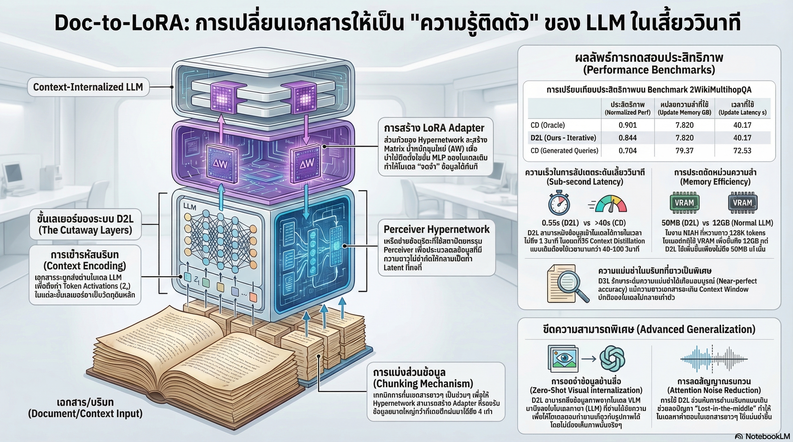

[กลับไปที่หน้าหลัก](../README.md)

บอกลาปัญหาคอขวด! Doc-to-LoRA: นวัตกรรมใหม่ที่ช่วยให้ AI "จำ" ข้อมูลยาวเหยียดได้ในเสี้ยววินาที

ในโลกของ Large Language Models (LLMs) ปัญหาคลาสสิกที่เหล่านักพัฒนาและผู้ใช้งานต้องเจอคือ "หน้าต่างบริบท" (Context Window) ที่มีขีดจำกัด เมื่อเราพยายามอัดข้อมูลมหาศาลเข้าไป ไม่เพียงแต่โมเดลจะประมวลผลช้าลงอย่างน่าหงุดหงิด แต่ยังต้องแบกรับภาระหน่วยความจำ (KV-cache) ที่พุ่งสูงจน GPU แทบค้าง แถมคุณภาพคำตอบยังถดถอยเมื่อข้อมูลยาวเกินไป

เตรียมพบกับจุดเปลี่ยนสำคัญ: Doc-to-LoRA (D2L) งานวิจัยล่าสุดจาก Sakana AI ที่จะเปลี่ยนนิยามจากการ "นั่งอ่านซ้ำทุกครั้ง" ให้กลายเป็นการ "Internalization" หรือการเรียนรู้ข้อมูลเข้าสู่พารามิเตอร์โดยตรง นี่คือเทคโนโลยีที่จะทำให้ AI ไม่ใช่แค่ระบบที่อ่านข้อมูล แต่เป็นระบบที่ "รับรู้และปรับตัว" เข้ากับบริบทใหม่ได้ในเสี้ยววินาที!

--------------------------------------------------------------------------------

การเรียนรู้ที่รวดเร็วระดับ "เสี้ยววินาที" ด้วยพลังของ Hypernetwork

ปกติแล้ว หากเราต้องการให้ AI จดจำความรู้ใหม่โดยไม่ใส่ไว้ใน Context เราต้องใช้กระบวนการ Context Distillation (CD) เพื่อถ่ายโอนความรู้เข้าไปในน้ำหนัก (Weights) ของโมเดล แต่วิธีเดิมนั้นเชื่องช้าและกินทรัพยากรสูง เพราะต้องผ่านการ Training นานหลายนาที

Doc-to-LoRA เข้ามาทลายกำแพงนี้ด้วยสถาปัตยกรรม Hypernetwork ขนาด 309 ล้านพารามิเตอร์ที่ใช้เทคนิค Perceiver เป็นหัวใจหลัก ความเจ๋งของมันคือการทำหน้าที่เป็น "เครื่องสร้างตัวปรับแต่ง" (Adapter Generator) ที่สามารถรับข้อมูลที่มีความยาวไม่จำกัด (Variable-length) แล้วบีบอัดลงสู่ LoRA adapter ที่มีขนาดคงที่ (Fixed-size) ได้จากการประมวลผลเพียงครั้งเดียว (Single forward pass)

เปรียบเทียบ Latency ในการอัปเดตโมเดล (Update Latency):

วิธีการ	ระยะเวลาที่ใช้ (Internalization Speed)
Context Distillation (CD) แบบดั้งเดิม	40 - 100+ วินาที
Doc-to-LoRA (D2L)	น้อยกว่า 1 วินาที (Sub-second)

"A single, inexpensive forward pass executes the learned CD process, enabling low-latency internalization." (การประมวลผลแบบ Forward pass เพียงครั้งเดียวที่มีราคาต่ำ สามารถรันกระบวนการ CD ที่เรียนรู้ไว้ได้สำเร็จ ช่วยให้เกิดการบรรจุข้อมูลลงในพารามิเตอร์ได้อย่างรวดเร็ว)

--------------------------------------------------------------------------------

ทลายขีดจำกัดหน้าต่างบริบท: จาก 256 สู่ 32,000+ Tokens

ความน่าทึ่งของ D2L คือ "Generalization Gap" ที่กว้างมหาศาล ทีมวิจัยฝึกฝนโมเดลนี้ด้วยข้อมูลที่มีความยาวเพียง 256 tokens เท่านั้น แต่เมื่อนำไปทดสอบจริงในภารกิจ Needle-in-a-Haystack (NIAH) หรือการงมเข็มในมหาสมุทรข้อมูล D2L กลับทำผลงานได้อย่างเหลือเชื่อ

จากการทดสอบกับโมเดล gemma-2-2b-it (ซึ่งมี Native Context 8K) พบว่า D2L สามารถประมวลผลข้อมูลได้ยาวเกินขีดจำกัดเดิมถึง 4 เท่า (ทะลุ 32K+ tokens) โดยที่ยังรักษาความแม่นยำได้เกือบ 100% เคล็ดลับอยู่ที่กลไก "Chunking" ที่จะแบ่งข้อมูลยาวๆ เป็นส่วนๆ ละ 1024 tokens แล้วนำมา "Concatenate" หรือต่อกันเพื่อสร้าง LoRA ที่มี Rank สูงขึ้น (Higher-Rank LoRA) ทำให้โมเดลสร้าง "ความจำที่หนาแน่น" กว่าการอ่านผ่าน Context ปกติ

--------------------------------------------------------------------------------

ปาฏิหาริย์แห่งการประหยัดหน่วยความจำ (The Dual Memory Win)

D2L มอบชัยชนะด้านการจัดการทรัพยากรใน 2 มิติที่สำคัญ ซึ่งจะช่วยให้การรัน AI บนอุปกรณ์ขนาดเล็ก (On-device AI) เป็นไปได้จริง:

1. Update Memory (ตอนบรรจุความรู้): ในขณะที่วิธี CD แบบเดิมอาจต้องใช้ VRAM สูงถึง 80 GB สำหรับการประมวลผลหลาย Query แต่ D2L ในโหมด Iterative ใช้หน่วยความจำเพียง 3.79 GB เท่านั้น
2. Generation Memory (ตอนตอบคำถาม): นี่คือจุดเปลี่ยนที่แท้จริง! ในขณะที่การใส่ข้อมูลยาวๆ เข้า Context (ICL) อาจทำให้ KV-cache พุ่งสูงกว่า 12 GB แต่ D2L ใช้หน่วยความจำเพิ่มเติมคงที่ น้อยกว่า 50 MB เสมอ ไม่ว่าเอกสารจะยาวแค่ไหนก็ตาม

ด้วยประสิทธิภาพระดับนี้ D2L ช่วยให้เรา "Amortize costs" หรือเฉลี่ยค่าใช้จ่ายในการประมวลผลให้ต่ำลงอย่างมหาศาลในระยะยาว

--------------------------------------------------------------------------------

เมื่อ AI "เห็น" ภาพผ่านตัวอักษร (Cross-Modality Brain Transplant)

ผลการทดลองที่ "ว้าว" ที่สุดคือการเชื่อมต่อข้ามประสาทสัมผัส (Cross-modality) ทีมวิจัยได้ทดลองใช้ D2L ทำหน้าที่เป็นสะพานเชื่อมระหว่าง gemma-3-4b-it (ซึ่งเป็น VLM ที่มองเห็นภาพได้) กับ gemma-2-2b-it (ซึ่งเป็น LLM ที่อ่านได้แต่ตัวอักษร)

ผลลัพธ์คือการทำ "Zero-Shot Visual Transfer" ที่เปรียบเสมือนการปลูกถ่ายสมองส่วนการมองเห็นให้กับโมเดลตาบอด:

* โมเดลภาษาที่อ่านแต่ตัวหนังสือ สามารถจำแนกรูปภาพในชุดข้อมูล Imagenette ได้ถูกต้องถึง 75.03%
* ทั้ง D2L และโมเดลเป้าหมาย ไม่เคยถูกฝึกด้วยข้อมูลรูปภาพมาก่อนเลย

นี่คือข้อพิสูจน์ว่าพารามิเตอร์ของโมเดลสามารถเป็นตัวกลางในการส่งผ่านความรู้ที่ซับซ้อนได้อย่างไร้พรมแดน

--------------------------------------------------------------------------------

สรุป: ก้าวข้าม RAG สู่ยุค Internalization-Augmented Generation

Doc-to-LoRA ไม่ได้เป็นเพียงแค่เครื่องมือบีบอัดข้อมูล แต่มันคือนวัตกรรมที่จะพาเราก้าวข้ามขีดจำกัดของ Retrieval-Augmented Generation (RAG) แบบเดิมๆ ไปสู่ยุคที่ AI สามารถ "Internalize" ข้อมูลมหาศาลและปรับจูนตัวเองให้เข้ากับผู้ใช้ (Personalization) ได้แบบ Real-time

ในอนาคตอันใกล้ AI จะไม่ต้องเสียเวลา "อ่าน" เอกสารซ้ำๆ แต่จะสามารถ "รับรู้และเปลี่ยนสภาพ" ตัวเองให้กลายเป็นผู้เชี่ยวชาญในข้อมูลนั้นๆ ได้ในเสี้ยววินาที ลองจินตนาการถึงผู้ช่วยอัจฉริยะที่จำสไตล์การทำงาน ข้อมูลส่วนตัว และบริบททั้งหมดของคุณได้ทันทีโดยไม่กินทรัพยากรเครื่อง... นั่นคือโลกที่ D2L กำลังพาเราไปถึง
