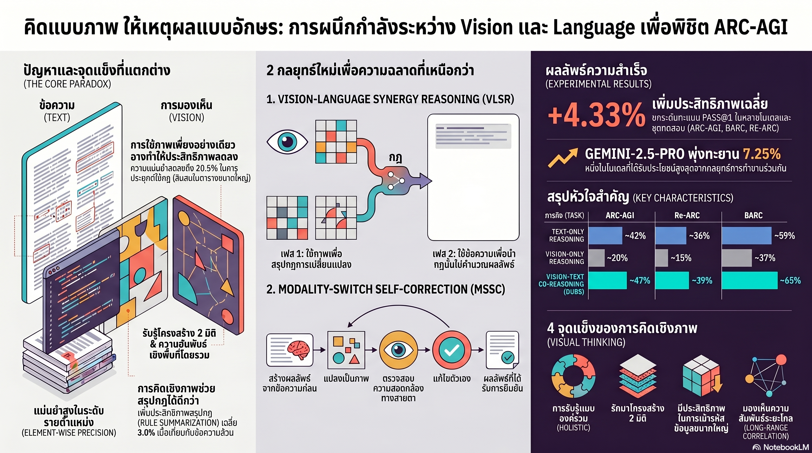

[กลับไปที่หน้าหลัก](../README.md)

ถ้าเราให้ AI "มองรูป" ตรงๆ มันจะฉลาดขึ้นไหม?

คำตอบที่งานวิจัยล่าสุดค้นพบคือ... ไม่ มันโง่ลงด้วยซ้ำ

o4-mini โมเดลที่ OpenAI ภูมิใจที่สุดในแง่การใช้เหตุผล พอเปลี่ยนจากข้อความมาเป็นภาพ ประสิทธิภาพการแก้โจทย์หล่นลง 20.5% ทันที

แต่ถ้าเราไม่ให้มันดูภาพ มันก็จะตาบอดในแง่โครงสร้าง 2 มิติ ทำให้ผิดพลาดคนละแบบอีก

ดูเหมือนจะเป็นทางตัน — จนกว่างานวิจัยชิ้นนี้จะค้นพบว่าสมองมนุษย์แก้ปัญหานี้มาตลอดโดยการ "มอง" และ "คิด" แยกกัน ด้วยระบบประสาทคนละชุด

นั่นคือจุดเริ่มต้นของ "Think Visually, Reason Textually" — สูตรที่ทำให้ Qwen3-8B โมเดลขนาดเล็กสายอีโคโนมี่เอาชนะ GPT-4o ได้บน benchmark ที่เด็กประถมยังทำได้ แต่ AI ระดับ trillion-dollar ทำไม่ได้

=== พื้นฐานที่ต้องรู้ก่อน ===

▸ ARC-AGI (Abstraction and Reasoning Corpus) คือแบบทดสอบที่ถูกขนานนามว่า "ไม้บรรทัดวัดความเป็นมนุษย์" ของ AI โจทย์คือการอนุมานกฎเกณฑ์จากตัวอย่างแค่ 3-5 ชุด แล้วนำกฎไปใช้กับกรณีใหม่ที่ไม่เคยเห็น — ทักษะที่เด็ก 7 ขวบทำได้สบายๆ แต่ GPT-4o ล้มเหลว

▸ Textual Reasoning คือวิธีที่ LLM ส่วนใหญ่ใช้ในปัจจุบัน คือประมวลผลทุกอย่างผ่านลำดับอักขระ (Token Sequence) เปรียบเหมือนการพยายามแก้จิ๊กซอว์โดยการอ่านคำบรรยายชิ้นส่วนแทนที่จะใช้ตามอง

▸ Spatial Contiguity คือความสัมพันธ์เชิงพื้นที่ เช่น เซลล์ที่อยู่ติดกันในตาราง ในโลกของข้อความ AI แบบลำดับจะเห็นว่าเซลล์ที่ "ใกล้กัน" บนหน้ากระดาษจริงๆ อาจห่างกัน 30-40 Token ในลำดับที่ประมวลผล

▸ Token Sequence Distance คือระยะห่างระหว่างสองจุดในสายอักขระที่ AI เห็น ยิ่งห่างมากเท่าไหร่ AI ยิ่งมองเห็น "ความสัมพันธ์" ระหว่างสองจุดนั้นได้ยากขึ้น

▸ Modality คือ "ช่องทางรับข้อมูล" เช่น ข้อความ (Text Modality) หรือภาพ (Vision Modality) แต่ละช่องมีจุดแข็งและจุดอ่อนคนละด้าน

▸ Confirmation Bias คือแนวโน้มที่ AI (และมนุษย์) จะหาข้อมูลมาสนับสนุนความเชื่อเดิมของตัวเอง แทนที่จะตรวจสอบว่าผิดตรงไหน ปัญหาใหญ่ของระบบ Self-Correction ที่ใช้แค่ข้อความ

=== 1. The Vision Paradox — ทำไมการให้ AI "มอง" จึงทำให้มันโง่ลง 👁️ ===

งานวิจัยพบสิ่งที่ขัดกับสามัญสำนึกทั้งหมดที่เคยเชื่อกัน

เมื่อให้ o4-mini มองตารางเป็นภาพตรงๆ แทนที่จะอ่านเป็นข้อความ Rule Application accuracy ร่วงลง 20.5% ทันที

ทำไม?

เพราะปัญหาของ ARC-AGI ต้องการสองอย่างที่ขัดแย้งกัน

▸ ด้านที่ภาพทำได้ดีกว่า: การมองเห็นโครงสร้าง 2 มิติโดยรวม เช่น "มุมซ้ายบนมีรูปแบบอะไร" หรือ "แถวกลางสัมพันธ์กับขอบยังไง" ภาพให้ Holistic Perception ที่ยอดเยี่ยม

▸ ด้านที่ข้อความทำได้ดีกว่า: การลงมือแก้ค่าทีละจุดอย่างแม่นยำ เช่น "เซลล์ที่พิกัด (5, 7) มีค่าเป็น 3 ให้เปลี่ยนเป็น 8" Vision AI มักสับสนกับพิกัดข้างเคียง ทำให้ Execution ผิดพลาด

ลองนึกภาพสถาปนิกที่ต้องออกแบบอาคาร — เขาต้องการทั้งความสามารถในการ "มองภาพรวม" จากแผนที่ผัง (ต้องการตา) และความสามารถในการ "คำนวณโครงสร้างทีละจุด" (ต้องการสมองเชิงตัวเลข) ไม่มีทักษะเดียวที่ทำได้ทั้งสองอย่างพร้อมกัน

ปัญหาของ AI ในปัจจุบันคือการถูกบังคับให้ใช้เพียงช่องทางเดียว

=== 2. VLSR — สูตรลับแห่งการแบ่งงานตามความเชี่ยวชาญ 🔀 ===

Vision-Language Synergy Reasoning (VLSR) คือการแก้ปัญหาด้วยการยอมรับข้อจำกัดของแต่ละ Modality แทนที่จะฝืนใช้อย่างใดอย่างหนึ่ง

กระบวนการมีสองขั้นตอนชัดเจน

ขั้นที่ 1 — Visual Rule Summarization ใช้ "ตา" เพื่อสรุปกฎ

AI จะมองภาพตารางตัวอย่างทั้งหมดเพื่อหาว่า "กฎในโจทย์นี้คืออะไร" ตัวอย่างเช่น "วัตถุสีน้ำเงินทุกชิ้นหมุน 90 องศาตามเข็มนาฬิกา" หรือ "สีเปลี่ยนตามจำนวนเซลล์ที่อยู่ติดกัน"

ข้อได้เปรียบสำคัญ: ตารางขนาด 30x30 ที่ต้องใช้ข้อความนับพัน Token สามารถสรุปกฎได้ด้วย Vision Tokens เพียงไม่กี่ร้อยตัว ลดภาระ Context Window ลงอย่างมาก

ขั้นที่ 2 — Textual Rule Application ใช้ "ตรรกะ" เพื่อลงมือทำ

เมื่อได้กฎที่ชัดเจนแล้ว AI จะสลับกลับมาใช้ข้อความในการลงมือเปลี่ยนค่าทีละจุด เพื่อรักษาความแม่นยำระดับพิกัด

เปรียบเหมือนทีมงาน 2 คน — คนแรกใช้กล้องส่องทางไกลดูแผนการข้าศึก (ใช้ตา) แล้วส่งต่อให้คนที่สองนำแผนนั้นไปลงมือปฏิบัติอย่างแม่นยำทีละขั้นตอน (ใช้มือ) แทนที่จะให้คนเดียวทำทั้งหมดโดยผิดพลาดในทั้งสองบทบาท

=== 3. MSSC — เมื่อ AI ตรวจสอบตัวเองผ่านมุมมองที่เปลี่ยนไป 🔍 ===

ปัญหาที่สองของ AI คือ Confirmation Bias — เมื่อมันทำผิดในรูปแบบข้อความ แล้วให้มันตรวจสอบตัวเองด้วยข้อความอีกครั้ง มันมักจะหาเหตุผลมาแก้ต่างให้กับความผิดเดิมของตัวเอง แทนที่จะค้นพบว่าผิดจริง

นักวิจัยเรียกวิธีเดิมนี้ว่า TOSC (Text-Only Self-Correction) และพิสูจน์ว่ามันไม่ได้ผล

วิธีแก้คือ MSSC (Modality-Switch Self-Correction) — การ "เปลี่ยนเลนส์" ในการมอง

▸ AI สร้างคำตอบด้วยข้อความ

▸ วาดผลลัพธ์นั้นออกมาเป็นภาพ

▸ ใช้ "ตา" ตรวจสอบความสอดคล้องกับโจทย์ต้นฉบับ

การสลับ Modality ทำให้ AI ได้ Fresh Perspective ที่หลุดออกจากกรอบเดิม เหมือนนักเขียนที่อ่านต้นฉบับซ้ำด้วยตัวเองแล้วไม่เห็นข้อผิดพลาด แต่พอพิมพ์ออกมาเป็นกระดาษแล้วอ่าน ผิดพลาดทุกอย่างกระโดดออกมาทันที

ผลลัพธ์ที่วัดได้บน ARC-AGI

▪ Gemini-2.5-pro-thinking เพิ่มขึ้น 7.25%

▪ GPT-4o เพิ่มขึ้น 4.5%

▪ ค่าเฉลี่ยทุกโมเดลที่ทดสอบ เพิ่มขึ้น 4.33%

ตัวเลขเหล่านี้อาจฟังดูไม่มากนัก แต่ต้องเข้าใจว่า ARC-AGI ออกแบบมาให้ยากจนโมเดลยักษ์ใหญ่ทำคะแนนได้เพียงหลักเดียว การขยับขึ้น 4-7% จากฐานนี้คือการก้าวกระโดดที่มีนัยสำคัญมาก

=== 4. โมเดลเล็กเอาชนะยักษ์ใหญ่ — เมื่อ Architecture ฉลาดกว่า Parameter 🏆 ===

ข้อพิสูจน์ที่น่าประทับใจที่สุดของงานวิจัยนี้คือการ Fine-tune Qwen3-8B ด้วยชุดข้อมูล ARC-Heavy-200k ตามหลักการ VLSR

Qwen3-8B คือโมเดลขนาดเล็กระดับ 8 พันล้านพารามิเตอร์ ซึ่งเล็กกว่า GPT-4o มหาศาล แต่เมื่อฝึกให้รู้จัก "มองก่อนคิด"

▸ Qwen3-8B + VLSR Training: 13.25% บน ARC-AGI

▸ GPT-4o แบบ vanilla: 8.25% บน ARC-AGI

โมเดลเล็กเอาชนะไปกว่า 5% ในเด็ดขาด

นี่คือหลักฐานที่แน่ชัดว่า "วิธีคิด" มีความสำคัญมากกว่า "ขนาดสมอง" ในงาน Reasoning เชิงโครงสร้าง การขยายพารามิเตอร์ไปเรื่อยๆ โดยไม่แก้ปัญหาเชิงสถาปัตยกรรมพื้นฐาน เปรียบเหมือนการพิมพ์หนังสือเรียนออกมาหนาขึ้นเรื่อยๆ โดยไม่เคยสอนให้นักเรียนรู้จักวิธีอ่าน

=== สรุป: สมองมนุษย์คือ Blueprint สู่ AGI ===

งานวิจัยชิ้นนี้ตอกย้ำว่าหัวใจของ AGI ไม่ใช่แค่การขยายขนาดโมเดล แต่คือการเลียนแบบโครงสร้างประสาทสัมผัสของมนุษย์ที่ใช้ทั้ง "ตา" เพื่อจับรูปแบบโดยรวม และ "ตรรกะทางภาษา" เพื่อลงมือทำอย่างแม่นยำ

สิ่งที่ VLSR พิสูจน์ให้เห็น

▸ Vision Paradox เป็นเรื่องจริง — การให้ AI มองภาพตรงๆ โดยไม่มีกลยุทธ์คือหายนะ ไม่ใช่วิธีแก้

▸ แบ่งงานตาม Modality คือกุญแจ — ให้ "ตา" ทำหน้าที่สรุปรูปแบบ ให้ "ตรรกะ" ทำหน้าที่ลงมือปฏิบัติ

▸ เปลี่ยน Modality เพื่อตรวจสอบ — การสลับจากข้อความไปเป็นภาพแล้วกลับมาตรวจสอบทำลาย Confirmation Bias ได้อย่างได้ผล

▸ Architecture เหนือกว่า Scale — Qwen3-8B เอาชนะ GPT-4o ด้วยวิธีคิดที่ถูกต้อง ไม่ใช่ขนาดที่ใหญ่กว่า

ในอนาคต เราอาจต้องหยุดเรียกสิ่งเหล่านี้ว่า "โมเดลภาษา" (Language Models) เพราะมันกำลังวิวัฒนาการไปสู่ระบบที่มองโลกผ่านทั้งภาพและภาษา ประมวลผลทั้งสองอย่างร่วมกันอย่างมีกลยุทธ์ — ใกล้เคียงกับวิธีที่สมองมนุษย์ทำงานมากกว่าที่เคยเป็น

คำถามที่น่าคิดคือ ถ้า "วิธีคิด" สำคัญกว่า "ขนาดสมอง" เส้นทางสู่ AGI อาจไม่ได้อยู่ที่การสร้าง Datacenter ใหญ่ขึ้น แต่อยู่ที่การเข้าใจให้ลึกขึ้นว่าความฉลาดของมนุษย์ทำงานอย่างไรกันแน่

=== References ===

▸ งานวิจัย "Think Visually, Reason Textually" นำเสนอระบบ VLSR (Vision-Language Synergy Reasoning)

▸ Benchmark ที่ใช้: ARC-AGI (Abstraction and Reasoning Corpus for Artificial General Intelligence)

▸ โมเดลที่ทดสอบ: o4-mini, GPT-4o, Gemini-2.5-pro-thinking-8192

▸ Fine-tuning: Qwen3-8B บนชุดข้อมูล ARC-Heavy-200k ตามหลักการ VLSR

▸ เทคนิคที่เปรียบเทียบ: TOSC (Text-Only Self-Correction) vs MSSC (Modality-Switch Self-Correction)

#VLSR #ARC_AGI #ThinkVisually #MultimodalReasoning #AGI #AIResearch #LLM #VisionLanguage #Qwen3 #GPT4o #Gemini #AIThailand #ปัญญาประดิษฐ์ #MachineLearning #ReasoningAI
