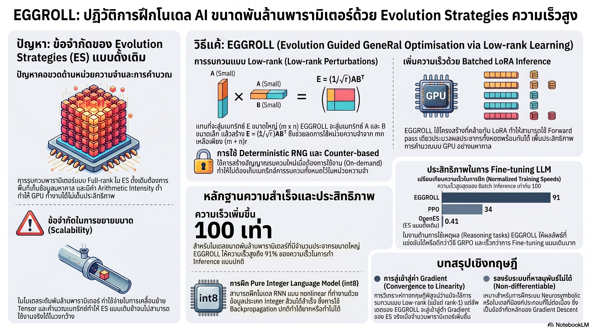

[กลับไปที่หน้าหลัก](../README.md)

สวัสดีครับเพื่อนๆ ที่ติดตามวงการ AI! วันนี้มาเรื่องที่ท้าทายรากฐานที่เราใช้ฝึก Neural Network มาตลอด 40 ปีว่า "ต้องมี Backpropagation เท่านั้น" ด้วย EGGROLL (Evolution Guided GeneRal Optimisation via Low-rank Learning) ที่พิสูจน์ว่า "วิวัฒนาการ" สามารถเร็วกว่าเดิม 100 เท่าและสร้าง AI ที่ดีกว่า Backprop ได้ครับ

คุณเคยสงสัยไหมครับว่า ทำไม Backpropagation ถึงเป็นข้อจำกัดที่กั้น AI จากการทำงานร่วมกับระบบที่ "หาอนุพันธ์ไม่ได้" เช่น การค้นหาบนเว็บ ระบบสัญลักษณ์ (Symbolic Systems) หรือฮาร์ดแวร์ที่ทำงานด้วย int8 ล้วน?

คุณรู้ไหมครับว่า Evolution Strategies ที่เคยถูกมองว่า "ช้าเกินใช้งาน" สามารถเร็วขึ้นถึง 100 เท่าด้วยเทคนิค Shared Base Activations และ Low-rank Perturbation จนทำให้โมเดลที่ฝึกด้วย int8 ล้วนทำ Test Loss ดีกว่า Transformer fp32 ที่ใช้ Backprop?

และคุณเคยนึกไหมครับว่า ถ้าเราฝึกโมเดล RWKV-7 ขนาด 14B บน AIME24 ได้จาก 13% → 30% ในเวลา 12 ชั่วโมงบน 32 GPUs โดยไม่ต้องง้อ Gradient แม้แต่น้อย "ยุคหลัง Backpropagation" อาจไม่ใช่แค่ทฤษฎีอีกต่อไปแล้วครับ?

สิ่งที่ EGGROLL กำลังพิสูจน์คือ "ยักษ์หลับ" ที่ชื่อ Evolution Strategies ตื่นขึ้นแล้วด้วย Engineering ที่ถูกต้องครับ

========================================

🤔 ทบทวนความเชื่อเดิมๆ: สิ่งที่เราคิดเกี่ยวกับ Evolution Strategies และ Backpropagation

▪ "Evolution Strategies เป็น method เก่าที่ช้าและสิ้นเปลืองเกินไปสำหรับโมเดลยุคใหม่ที่มีพันล้านพารามิเตอร์" → Shared Base Activations + Low-rank Perturbation ทำให้ EGGROLL เร็วถึง 91% ของ Batch Inference ปกติ และเร็วกว่า Naive ES ถึง 100 เท่า ปัญหาไม่ได้อยู่ที่ ES เป็น Algorithm เก่า แต่อยู่ที่ไม่มีใคร optimize Arithmetic Intensity ให้ถูกจุดมาก่อนครับ

▪ "โมเดลที่ทำงานด้วย int8 ล้วนต้องแย่กว่า fp32 เสมอ เพราะ Precision ต่ำกว่า จึงเรียนรู้ได้น้อยกว่า" → EGG model (int8 ล้วน ไม่มี explicit activation function) ทำ Test Loss 3.40 bits/byte ดีกว่า Transformer (fp32 + Backprop) ที่ 3.58 bits/byte บน Dataset ชุดเดียวกัน ข้อจำกัดของ Hardware บางครั้งสร้างแรงกดดันที่ทำให้ระบบค้นพบวิธีที่ดีกว่าครับ

▪ "ยิ่งใช้ Perturbation Rank สูง ยิ่งสำรวจ Search Space ได้กว้างกว่า ยิ่งหาค่าที่ดีกว่าได้" → Convergence to Linearity พิสูจน์ว่าในโมเดลขนาดใหญ่ Rank-1 เพียงอย่างเดียวให้ผลเทียบเท่า Full-rank เพราะพฤติกรรมของ ES เป็นเส้นตรงมากขึ้นตามจำนวนพารามิเตอร์ ความเรียบง่ายไม่ใช่ความด้อยกว่าครับ

▪ "GRPO เป็น standard ที่ดีที่สุดสำหรับ Reasoning fine-tuning เพราะทำงานได้ดีกับ gradient-based optimization" → EGGROLL เอาชนะ GRPO ในงาน GSM8K และ Countdown เพราะ optimize Pass@k ที่ Non-differentiable ได้โดยตรง และไม่มี Adam Optimizer memory overhead ที่ทำให้ใช้งาน 14B ไม่ได้ครับ

ความจริงที่น่าคิดคือ: ข้อจำกัดของ Backpropagation ไม่ใช่แค่เรื่อง Memory หรือความเร็ว แต่คือการที่มันบังคับให้ทุกส่วนของระบบต้อง Differentiable ซึ่งเป็นกำแพงที่กั้น AI จากระบบที่ซับซ้อนและเป็นธรรมชาติที่สุดในโลกครับ

========================================

🧠 พื้นฐานที่ต้องเข้าใจก่อน: Evolution Strategies, Arithmetic Intensity, Low-rank และ Pass@k

=== Evolution Strategies (ES) คืออะไร? ===

Evolution Strategies = วิธีการหาค่าที่เหมาะสมที่สุดแบบ Black-box ที่เลียนแบบธรรมชาติ ไม่ต้องการ Gradient

กระบวนการ:
▸ สร้าง "ประชากร" ที่มีการรบกวน (Perturbation) ต่างๆ ของพารามิเตอร์
▸ ทดสอบทุกตัวว่าทำงานได้ดีแค่ไหน
▸ อัปเดตพารามิเตอร์ตามทิศทางเฉลี่ยของการรบกวนที่ทำงานดีที่สุด

เปรียบเทียบ: เหมือนส่งนักสำรวจหลายพันคนออกไปในป่าพร้อมกัน แล้วดูว่าใครเดินไปถึงจุดหมายได้ไวที่สุด ก็ใช้เส้นทางนั้นเป็นแนวทางต่อไป แทนที่จะคำนวณเส้นทาง GPS ที่ต้องรู้ Gradient ของพื้นดินทุกจุดครับ

=== Arithmetic Intensity คืออะไร? ===

Arithmetic Intensity = อัตราส่วนระหว่างจำนวนการคำนวณ (FLOPs) ต่อการเคลื่อนย้ายข้อมูล (Bytes) ที่ GPU ต้องทำ

ปัญหาของ Naive ES: สร้าง Noise Matrix ขนาดเต็ม (Full-rank) → เคลื่อนย้ายข้อมูลมหาศาลแต่คำนวณได้น้อย → GPU ว่างงานรอข้อมูลตลอดเวลา

เปรียบเทียบ: เหมือนโรงงานที่ต้องขนวัตถุดิบจากโกดังไกลทุกครั้งที่ผลิตสินค้าหนึ่งชิ้น แทนที่จะสต็อกวัตถุดิบไว้ข้างๆ สายการผลิต GPU "ว่างงานรอ" แทนที่จะ "ทำงานเต็มที่" ครับ

=== Low-rank Perturbation vs Full-rank ===

Full-rank Matrix: เมทริกซ์ขนาดใหญ่ที่ใช้แทนการรบกวนทั้งหมดโดยตรง (หนักและช้า)

Low-rank Matrix: แทนเมทริกซ์ใหญ่ด้วยผลคูณของเมทริกซ์เล็ก 2 ตัว (A × B) ซึ่งมีข้อมูลน้อยกว่ามากแต่ยังจับทิศทางที่สำคัญได้

เปรียบเทียบ: เหมือนการบอกทิศทางด้วยเข็มทิศ (Light, ชี้ทิศทางได้) แทนที่จะต้องพกแผนที่ 3D ขนาดใหญ่ (Heavy, ละเอียดกว่าแต่เกินความต้องการ) ครับ

=== Shared Base Activations คืออะไร? ===

Shared Base Activations = การคำนวณ Matrix Multiplication หลักของโมเดลเพียงครั้งเดียว แล้วแชร์ผลลัพธ์ให้กับสมาชิกทุกตัวในประชากร

ปกติ: ทุกสมาชิกประชากรต้องคำนวณ Forward Pass ของตัวเองใหม่ทั้งหมด

EGGROLL: คำนวณ Base Activation ครั้งเดียว → ทุกสมาชิกใช้ร่วมกัน → เพิ่มเฉพาะ Low-rank Perturbation เล็กๆ ของตัวเอง

เปรียบเทียบ: เหมือนครูที่อธิบายหลักการหนึ่งครั้งให้นักเรียนทั้งห้องฟัง แทนที่จะอธิบายให้นักเรียนทีละคน แต่ละคนรับข้อมูลฐานเดียวกันแล้วต่อเติมเฉพาะส่วนที่ต่างกันเท่านั้นครับ

=== Pass@k คืออะไร? ===

Pass@k = ตัววัดที่ถามว่า "ถ้า AI ลองแก้ปัญหา k ครั้ง มีอย่างน้อย 1 ครั้งที่ถูกต้องไหม?"

ปัญหาของ Backprop กับ Pass@k: Pass@k เป็น Non-differentiable (ไม่สามารถหาอนุพันธ์ได้) เพราะเป็นการ Count ว่าผ่านหรือไม่ผ่าน ไม่ใช่ค่าต่อเนื่อง

EGGROLL แก้ได้: ES optimize Pass@k โดยตรงได้เพราะไม่ต้องการ Gradient เลยครับ

========================================

1️⃣ Shared Base Activations + Low-rank: เปลี่ยน "ยักษ์หลับ" เป็น "เครื่องยนต์เร็ว"

=== ปัญหาคอขวดของ Naive ES บน GPU ===

เมื่อ GPU ถูกออกแบบมาเพื่อทำงานคำนวณจำนวนมากพร้อมกัน แต่ Naive ES บังคับให้ต้องเคลื่อนย้ายข้อมูลมหาศาลแทน GPU จึงกลายเป็น "ซูเปอร์คาร์ที่วิ่งในรถติด" ครับ

[ปัญหาของ Naive ES]
▸ สร้าง Full-rank Noise Matrix ขนาดเท่ากับ Weight Matrix ทั้งหมดสำหรับทุกสมาชิกประชากร
▸ Arithmetic Intensity ต่ำมาก: เคลื่อนย้ายข้อมูลมาก คำนวณน้อย
▸ GPU "ว่างงาน" รอข้อมูลตลอดเวลาแทนที่จะคำนวณเต็มประสิทธิภาพ
▸ Population Size สูงสุดที่ใช้ได้จริง (Salimans et al. 2017): เพียง 1,440 ตัวครับ

[EGGROLL แก้อย่างไร]
▸ Low-rank Perturbation: แทน Noise Matrix ใหญ่ด้วย A × B (เมทริกซ์เล็ก 2 ตัว) ลดข้อมูลที่ต้องเคลื่อนย้ายได้มหาศาล
▸ Shared Base Activations: คำนวณ Matrix Multiplication หลักครั้งเดียว แชร์ให้ทุกสมาชิกประชากร
▸ Arithmetic Intensity พุ่งสูงขึ้นอย่างมีนัยสำคัญ GPU ทำงานได้เต็มประสิทธิภาพครับ

[ผลลัพธ์]
▸ ความเร็ว: สูงถึง 91% ของ Batch Inference ปกติ (เกือบเทียบเท่า Inference ล้วนๆ)
▸ เร็วกว่า Naive ES: ถึง 100 เท่าสำหรับโมเดลระดับ Billion Parameter

เปรียบเทียบ: เหมือนเปลี่ยนจากการให้ทุกคนในโรงงานวิ่งไปเอาวัตถุดิบเอง มาเป็นการส่ง Conveyor Belt มาถึงมือทุกคนพร้อมกัน ผลผลิตเพิ่มขึ้น 100 เท่าทั้งที่คนทำงานเท่าเดิมครับ

========================================

2️⃣ Rank-1 Sufficiency: ความเรียบง่ายที่พิสูจน์ด้วยคณิตศาสตร์

=== Convergence to Linearity: ทำไม Rank-1 จึงพอ ===

สิ่งที่น่าประหลาดใจที่สุดในงานวิจัยนี้คือ การค้นพบที่ต้านทาน Intuition ของคนส่วนใหญ่: ยิ่งโมเดลใหญ่ขึ้น ยิ่งต้องการ Perturbation Rank ต่ำลงครับ

[ทฤษฎี Convergence to Linearity]
▸ ในโมเดลขนาดใหญ่ที่มีพารามิเตอร์มหาศาล พฤติกรรมของ ES จะเป็น "เส้นตรง" มากขึ้น (Linearising effect)
▸ เมื่อพฤติกรรมเป็นเส้นตรง การชี้ทิศทางด้วย Rank-1 ก็แม่นยำเทียบเท่า Full-rank
▸ เพิ่ม Rank สูงขึ้นไม่ได้ให้ประโยชน์เพิ่มเติมแต่เพิ่มภาระการคำนวณครับ

[สิ่งที่ Rank-1 ประหยัดได้]
▸ Memory Overhead ลดลงมหาศาลต่อสมาชิกหนึ่งตัว
▸ Tensor Movement ระหว่าง Memory และ Processor ลดลงมาก
▸ สามารถรองรับ Population Size ขนาดใหญ่กว่าด้วยทรัพยากรเดิมครับ

เปรียบเทียบ: เหมือนการค้นหาทิศทางในสนามกว้าง ถ้าสนามนั้นราบเรียบพอ การใช้เข็มทิศเล็กๆ ชี้ทิศทาง (Rank-1) แม่นยำเท่ากับการสำรวจด้วยดาวเทียม (Full-rank) แต่ประหยัดกว่ามหาศาลครับ

=== นัยสำคัญ: ขนาดโมเดลและ Rank ที่เหมาะสมเคลื่อนที่สวนทางกัน ===

ยิ่งขนาดโมเดลใหญ่ขึ้น ยิ่งต้องการ Low-rank มากขึ้น ซึ่งหมายความว่า EGGROLL ได้เปรียบมากขึ้นเรื่อยๆ ตามขนาดโมเดลที่เพิ่มขึ้น ซึ่งตรงข้ามกับ Naive ES ที่ยิ่งโมเดลใหญ่ยิ่งช้าขึ้นแบบ Exponentialครับ

========================================

3️⃣ EGG Model + Hyperscale Population: int8 ล้วนที่ดีกว่า fp32 และประชากร 1 ล้านตัว

=== EGG Model: AI ที่ฝึกด้วย Integer ล้วน ===

EGG (Evolved Generative GRU) คือโมเดลภาษาที่เกิดจากการนำ EGGROLL มาใช้กับ Architecture ที่ออกแบบมาสำหรับ int8 โดยเฉพาะครับ

[ความพิเศษของ EGG]
▸ ทำงานด้วย int8 ล้วนๆ ตั้งแต่ขั้นตอน Pretraining ไม่มี Floating Point
▸ ไม่มี Explicit Activation Function (ไม่มี ReLU หรือ GELU)
▸ ใช้คุณสมบัติ Clipping ตามธรรมชาติของการคำนวณ 8-bit เป็น Nonlinearity โดยปริยาย

[ผลเปรียบเทียบ Test Loss บน Dataset เดียวกัน]
▸ EGG (int8, EGGROLL): 3.40 bits/byte ← ดีกว่า
▸ Transformer (fp32, Backpropagation): 3.58 bits/byte

เปรียบเทียบ: เหมือนนักกีฬาที่ฝึกซ้อมในชุดถ่วงน้ำหนัก (ข้อจำกัด int8) กลับแข็งแกร่งกว่าคนที่ฝึกแบบไม่มีข้อจำกัด (fp32) เพราะข้อจำกัดบังคับให้ระบบค้นพบวิธีที่มีประสิทธิภาพสูงกว่าครับ

=== Hyperscale Populations: จาก 1,440 สู่ 1,048,576 ===

ใน ES ยิ่งประชากรมากยิ่งค้นพบ "สายพันธุ์ที่ดีที่สุด" ได้ไวขึ้น EGGROLL ทำลายขีดจำกัดเดิมอย่างสิ้นเชิงครับ

[การเปรียบเทียบ Population Size]
▸ Salimans et al. (2017) มาตรฐานเดิม: สูงสุด 1,440 ตัว
▸ EGGROLL: สูงถึง 1,048,576 ตัวในการอัปเดตครั้งเดียว (เพิ่มขึ้น 728 เท่า!)

[ความสามารถตามขนาดโมเดล]
▸ โมเดลขนาดเล็ก: Population ระดับล้านตัวบน GPU เพียงตัวเดียว
▸ โมเดลขนาดใหญ่ (14B): ต้องใช้ GPU Cluster (32 GPUs) แต่ยังมีประสิทธิภาพสูงมาก

เปรียบเทียบ: เหมือน Survival of the Fittest แบบเร็วพิเศษ แทนที่จะทดสอบ 1,440 วิธี ลองทดสอบ 1 ล้านวิธีพร้อมกัน โอกาสค้นพบวิธีที่ดีที่สุดเพิ่มขึ้นมหาศาลครับ

========================================

4️⃣ RWKV-7 14B บน AIME24 และการเอาชนะ GRPO: EGGROLL กับโลกของ Reasoning

=== AIME24: 13% → 30% ใน 12 ชั่วโมง ===

บทพิสูจน์ที่ชัดเจนที่สุดของ EGGROLL คือการ Fine-tune โมเดล RWKV-7 ขนาด 14B สำหรับโจทย์คณิตศาสตร์โอลิมปิกระดับ AIME24 ครับ

[ผลการทดสอบ]
▸ ก่อน Fine-tune: 13%
▸ หลัง Fine-tune ด้วย EGGROLL: 30%
▸ เวลาที่ใช้: 12 ชั่วโมง บน 32 GPUs
▸ ไม่มี Gradient ใดๆ ถูกคำนวณเลยตลอดกระบวนการ

[ทำไมถึงสำเร็จกับโมเดลที่ไม่ Differentiable อย่าง RWKV-7]
▸ RWKV-7 มีส่วนประกอบบางส่วนที่ไม่สามารถหาอนุพันธ์ได้
▸ Backprop จึงไม่สามารถ Fine-tune ได้อย่างเต็มประสิทธิภาพ
▸ EGGROLL ไม่ต้องการ Differentiability จึงทำงานได้อย่างอิสระครับ

=== EGGROLL vs GRPO: เหตุใดจึงชนะในงาน Reasoning ===

[ข้อได้เปรียบที่ 1: Optimize Non-differentiable Rewards โดยตรง]
▸ Pass@k (ตัววัดมาตรฐานของ Reasoning) เป็น Non-differentiable
▸ GRPO ต้องใช้ Surrogate objective ที่เป็น Approximation ของ Pass@k
▸ EGGROLL optimize Pass@k จริงๆ โดยตรง ไม่ต้องประมาณครับ

[ข้อได้เปรียบที่ 2: Memory Efficiency สำหรับโมเดลขนาดใหญ่]
▸ GRPO ต้องเก็บ Adam Optimizer States (Momentum + Variance) ซึ่งใช้ Memory 2-3 เท่าของ Model Weight
▸ สำหรับโมเดล 14B: Adam + GRPO อาจทำให้ Memory เต็มจน Infeasible
▸ EGGROLL ไม่มี Optimizer State เลย จัดการได้แม้โมเดลใหญ่ครับ

[ผลการเปรียบเทียบบน GSM8K และ Countdown]
▸ EGGROLL: ชนะ GRPO อย่างเห็นได้ชัดในทั้งสองงาน
▸ โดยเฉพาะงานที่ Reward เป็น Non-differentiable อย่างชัดเจนครับ

=== อนาคต: Neurosymbolic Systems และ Post-Backpropagation Era ===

EGGROLL เปิดประตูสู่สิ่งที่ Backprop ทำไม่ได้โดยธรรมชาติ

[ระบบที่ EGGROLL ปลดล็อคได้]
▸ Neurosymbolic AI: ผสม Neural Network กับ Symbolic Logic ที่ไม่ Differentiable
▸ Hardware-specific AI: ออกแบบ Architecture สำหรับ Chip เฉพาะทางที่ทำงานเป็น Integer
▸ Non-differentiable Components: Search Engines, Database, Rule-based Systems ในวงจร Training
▸ ระบบที่มีการตัดสินใจแบบ Discrete (ใช่/ไม่ใช่) ที่ Gradient ไม่สามารถ Optimize ได้ครับ

เปรียบเทียบ: เหมือนการค้นพบว่าเราไม่ต้องใช้ถนนลาดยาง (Backprop) เสมอไป ทางลูกรัง (ES) ที่ปรับปรุงแล้วอาจไปถึงจุดหมายได้เร็วกว่าในหลายเส้นทาง และที่สำคัญคือสามารถไปในที่ที่ถนนลาดยางสร้างไม่ได้เลยครับ

========================================

🎯 สรุป: เมื่อธรรมชาติเร็วกว่า Gradient

EGGROLL สรุปได้ด้วย 4 นวัตกรรมหลัก: Shared Base Activations + Low-rank Perturbation (เร็วขึ้น 100 เท่า, 91% throughput), Rank-1 Sufficiency จาก Convergence to Linearity, EGG model int8 ล้วน (3.40 < Transformer fp32 3.58) + Hyperscale Population 1M ตัว, และ RWKV-7 14B AIME24 13%→30% ใน 12 ชั่วโมงพร้อมเอาชนะ GRPO

สิ่งที่น่าสนใจกว่าตัวเลขคือนัยต่อโลก AI ครับ ตลอด 40 ปีที่ผ่านมา Backpropagation ทำให้เราออกแบบ AI ได้เฉพาะในโลกที่ทุกอย่าง Differentiable ซึ่งเป็นเพียงส่วนเล็กๆ ของระบบทั้งหมดที่เราต้องการสร้าง เมื่อ EGGROLL พิสูจน์ว่า "วิวัฒนาการ" สามารถเร็วและดีกว่า Gradient ได้ในหลายงาน ประตูที่เคยถูกล็อคด้วย "ต้องหาอนุพันธ์ได้" กำลังถูกเปิดออกทีละบานครับ

========================================

💬 คำถามท้ายทาย: ลองคิดดูนะครับ

▪ Backpropagation บังคับให้ทุกส่วนของ AI ต้อง Differentiable มานาน 40 ปี ถ้า EGGROLL ทำให้ข้อจำกัดนี้หมดไป AI ประเภทไหนที่เราไม่สามารถสร้างได้ในวันนี้แต่จะสร้างได้ในวันพรุ่งนี้ครับ?

▪ EGG model int8 ล้วนทำ Test Loss ดีกว่า Transformer fp32 ถ้าข้อจำกัดของ Hardware บังคับให้ค้นพบวิธีที่ดีกว่า "การออกแบบที่เสรีเกินไป" อาจเป็นจุดอ่อนของ Deep Learning ยุคนี้หรือเปล่าครับ?

▪ Hyperscale Population 1M ตัวเหมือน "วิวัฒนาการในห้องแล็บ" ที่เร็วกว่าธรรมชาติล้านเท่า ถ้าเราเร่งวิวัฒนาการได้เร็วขนาดนี้ เราควรตั้งคำถามอะไรก่อนว่า "วิวัฒนาการไปในทิศทางที่เราต้องการจริงๆ" ครับ?

▪ EGGROLL เอาชนะ GRPO เพราะ optimize Pass@k โดยตรง ไม่ต้องใช้ Approximation ถ้าหลักการนี้ถูกต้อง วิธีที่เรา "วัดความฉลาด" ของ AI ในปัจจุบันผ่าน Benchmark ต่างๆ นั้นแม่นยำพอหรือยัง หรือเรากำลัง optimize Approximation ที่ผิดตลอดมาครับ?

========================================

References:
- EGGROLL: Evolution Guided GeneRal Optimisation via Low-rank Learning
- Salimans et al. (2017) — Evolution Strategies as a Scalable Alternative to Reinforcement Learning
- EGG (Evolved Generative GRU) — Integer-only Language Model
- RWKV-7 Fine-tuning on AIME24 Benchmark
- GSM8K and Countdown Reasoning Benchmarks
- GRPO (Group Relative Policy Optimization) Comparison

ถ้า Darwin พิสูจน์ว่าชีวิตพัฒนาได้โดยไม่ต้องมีใครออกแบบ EGGROLL กำลังพิสูจน์ว่า AI ก็พัฒนาได้โดยไม่ต้องมี Gradient มาชี้ทางครับ

#AI #ArtificialIntelligence #EGGROLL #EvolutionStrategies #MachineLearning #Backpropagation #NeuralNetwork #LowRank #int8 #RWKV #AIME24 #GRPO #Optimization #NeurosymbolicAI #PostBackpropagationสวัสดีครับเพื่อนๆ ที่ติดตามวงการ AI! วันนี้มาเรื่องที่ท้าทายรากฐานที่เราใช้ฝึก Neural Network มาตลอด 40 ปีว่า "ต้องมี Backpropagation เท่านั้น" ด้วย EGGROLL (Evolution Guided GeneRal Optimisation via Low-rank Learning) ที่พิสูจน์ว่า "วิวัฒนาการ" สามารถเร็วกว่าเดิม 100 เท่าและสร้าง AI ที่ดีกว่า Backprop ได้ครับ

คุณเคยสงสัยไหมครับว่า ทำไม Backpropagation ถึงเป็นข้อจำกัดที่กั้น AI จากการทำงานร่วมกับระบบที่ "หาอนุพันธ์ไม่ได้" เช่น การค้นหาบนเว็บ ระบบสัญลักษณ์ (Symbolic Systems) หรือฮาร์ดแวร์ที่ทำงานด้วย int8 ล้วน?

คุณรู้ไหมครับว่า Evolution Strategies ที่เคยถูกมองว่า "ช้าเกินใช้งาน" สามารถเร็วขึ้นถึง 100 เท่าด้วยเทคนิค Shared Base Activations และ Low-rank Perturbation จนทำให้โมเดลที่ฝึกด้วย int8 ล้วนทำ Test Loss ดีกว่า Transformer fp32 ที่ใช้ Backprop?

และคุณเคยนึกไหมครับว่า ถ้าเราฝึกโมเดล RWKV-7 ขนาด 14B บน AIME24 ได้จาก 13% → 30% ในเวลา 12 ชั่วโมงบน 32 GPUs โดยไม่ต้องง้อ Gradient แม้แต่น้อย "ยุคหลัง Backpropagation" อาจไม่ใช่แค่ทฤษฎีอีกต่อไปแล้วครับ?

สิ่งที่ EGGROLL กำลังพิสูจน์คือ "ยักษ์หลับ" ที่ชื่อ Evolution Strategies ตื่นขึ้นแล้วด้วย Engineering ที่ถูกต้องครับ

========================================

🤔 ทบทวนความเชื่อเดิมๆ: สิ่งที่เราคิดเกี่ยวกับ Evolution Strategies และ Backpropagation

▪ "Evolution Strategies เป็น method เก่าที่ช้าและสิ้นเปลืองเกินไปสำหรับโมเดลยุคใหม่ที่มีพันล้านพารามิเตอร์" → Shared Base Activations + Low-rank Perturbation ทำให้ EGGROLL เร็วถึง 91% ของ Batch Inference ปกติ และเร็วกว่า Naive ES ถึง 100 เท่า ปัญหาไม่ได้อยู่ที่ ES เป็น Algorithm เก่า แต่อยู่ที่ไม่มีใคร optimize Arithmetic Intensity ให้ถูกจุดมาก่อนครับ

▪ "โมเดลที่ทำงานด้วย int8 ล้วนต้องแย่กว่า fp32 เสมอ เพราะ Precision ต่ำกว่า จึงเรียนรู้ได้น้อยกว่า" → EGG model (int8 ล้วน ไม่มี explicit activation function) ทำ Test Loss 3.40 bits/byte ดีกว่า Transformer (fp32 + Backprop) ที่ 3.58 bits/byte บน Dataset ชุดเดียวกัน ข้อจำกัดของ Hardware บางครั้งสร้างแรงกดดันที่ทำให้ระบบค้นพบวิธีที่ดีกว่าครับ

▪ "ยิ่งใช้ Perturbation Rank สูง ยิ่งสำรวจ Search Space ได้กว้างกว่า ยิ่งหาค่าที่ดีกว่าได้" → Convergence to Linearity พิสูจน์ว่าในโมเดลขนาดใหญ่ Rank-1 เพียงอย่างเดียวให้ผลเทียบเท่า Full-rank เพราะพฤติกรรมของ ES เป็นเส้นตรงมากขึ้นตามจำนวนพารามิเตอร์ ความเรียบง่ายไม่ใช่ความด้อยกว่าครับ

▪ "GRPO เป็น standard ที่ดีที่สุดสำหรับ Reasoning fine-tuning เพราะทำงานได้ดีกับ gradient-based optimization" → EGGROLL เอาชนะ GRPO ในงาน GSM8K และ Countdown เพราะ optimize Pass@k ที่ Non-differentiable ได้โดยตรง และไม่มี Adam Optimizer memory overhead ที่ทำให้ใช้งาน 14B ไม่ได้ครับ

ความจริงที่น่าคิดคือ: ข้อจำกัดของ Backpropagation ไม่ใช่แค่เรื่อง Memory หรือความเร็ว แต่คือการที่มันบังคับให้ทุกส่วนของระบบต้อง Differentiable ซึ่งเป็นกำแพงที่กั้น AI จากระบบที่ซับซ้อนและเป็นธรรมชาติที่สุดในโลกครับ

========================================

🧠 พื้นฐานที่ต้องเข้าใจก่อน: Evolution Strategies, Arithmetic Intensity, Low-rank และ Pass@k

=== Evolution Strategies (ES) คืออะไร? ===

Evolution Strategies = วิธีการหาค่าที่เหมาะสมที่สุดแบบ Black-box ที่เลียนแบบธรรมชาติ ไม่ต้องการ Gradient

กระบวนการ:
▸ สร้าง "ประชากร" ที่มีการรบกวน (Perturbation) ต่างๆ ของพารามิเตอร์
▸ ทดสอบทุกตัวว่าทำงานได้ดีแค่ไหน
▸ อัปเดตพารามิเตอร์ตามทิศทางเฉลี่ยของการรบกวนที่ทำงานดีที่สุด

เปรียบเทียบ: เหมือนส่งนักสำรวจหลายพันคนออกไปในป่าพร้อมกัน แล้วดูว่าใครเดินไปถึงจุดหมายได้ไวที่สุด ก็ใช้เส้นทางนั้นเป็นแนวทางต่อไป แทนที่จะคำนวณเส้นทาง GPS ที่ต้องรู้ Gradient ของพื้นดินทุกจุดครับ

=== Arithmetic Intensity คืออะไร? ===

Arithmetic Intensity = อัตราส่วนระหว่างจำนวนการคำนวณ (FLOPs) ต่อการเคลื่อนย้ายข้อมูล (Bytes) ที่ GPU ต้องทำ

ปัญหาของ Naive ES: สร้าง Noise Matrix ขนาดเต็ม (Full-rank) → เคลื่อนย้ายข้อมูลมหาศาลแต่คำนวณได้น้อย → GPU ว่างงานรอข้อมูลตลอดเวลา

เปรียบเทียบ: เหมือนโรงงานที่ต้องขนวัตถุดิบจากโกดังไกลทุกครั้งที่ผลิตสินค้าหนึ่งชิ้น แทนที่จะสต็อกวัตถุดิบไว้ข้างๆ สายการผลิต GPU "ว่างงานรอ" แทนที่จะ "ทำงานเต็มที่" ครับ

=== Low-rank Perturbation vs Full-rank ===

Full-rank Matrix: เมทริกซ์ขนาดใหญ่ที่ใช้แทนการรบกวนทั้งหมดโดยตรง (หนักและช้า)

Low-rank Matrix: แทนเมทริกซ์ใหญ่ด้วยผลคูณของเมทริกซ์เล็ก 2 ตัว (A × B) ซึ่งมีข้อมูลน้อยกว่ามากแต่ยังจับทิศทางที่สำคัญได้

เปรียบเทียบ: เหมือนการบอกทิศทางด้วยเข็มทิศ (Light, ชี้ทิศทางได้) แทนที่จะต้องพกแผนที่ 3D ขนาดใหญ่ (Heavy, ละเอียดกว่าแต่เกินความต้องการ) ครับ

=== Shared Base Activations คืออะไร? ===

Shared Base Activations = การคำนวณ Matrix Multiplication หลักของโมเดลเพียงครั้งเดียว แล้วแชร์ผลลัพธ์ให้กับสมาชิกทุกตัวในประชากร

ปกติ: ทุกสมาชิกประชากรต้องคำนวณ Forward Pass ของตัวเองใหม่ทั้งหมด

EGGROLL: คำนวณ Base Activation ครั้งเดียว → ทุกสมาชิกใช้ร่วมกัน → เพิ่มเฉพาะ Low-rank Perturbation เล็กๆ ของตัวเอง

เปรียบเทียบ: เหมือนครูที่อธิบายหลักการหนึ่งครั้งให้นักเรียนทั้งห้องฟัง แทนที่จะอธิบายให้นักเรียนทีละคน แต่ละคนรับข้อมูลฐานเดียวกันแล้วต่อเติมเฉพาะส่วนที่ต่างกันเท่านั้นครับ

=== Pass@k คืออะไร? ===

Pass@k = ตัววัดที่ถามว่า "ถ้า AI ลองแก้ปัญหา k ครั้ง มีอย่างน้อย 1 ครั้งที่ถูกต้องไหม?"

ปัญหาของ Backprop กับ Pass@k: Pass@k เป็น Non-differentiable (ไม่สามารถหาอนุพันธ์ได้) เพราะเป็นการ Count ว่าผ่านหรือไม่ผ่าน ไม่ใช่ค่าต่อเนื่อง

EGGROLL แก้ได้: ES optimize Pass@k โดยตรงได้เพราะไม่ต้องการ Gradient เลยครับ

========================================

1️⃣ Shared Base Activations + Low-rank: เปลี่ยน "ยักษ์หลับ" เป็น "เครื่องยนต์เร็ว"

=== ปัญหาคอขวดของ Naive ES บน GPU ===

เมื่อ GPU ถูกออกแบบมาเพื่อทำงานคำนวณจำนวนมากพร้อมกัน แต่ Naive ES บังคับให้ต้องเคลื่อนย้ายข้อมูลมหาศาลแทน GPU จึงกลายเป็น "ซูเปอร์คาร์ที่วิ่งในรถติด" ครับ

[ปัญหาของ Naive ES]
▸ สร้าง Full-rank Noise Matrix ขนาดเท่ากับ Weight Matrix ทั้งหมดสำหรับทุกสมาชิกประชากร
▸ Arithmetic Intensity ต่ำมาก: เคลื่อนย้ายข้อมูลมาก คำนวณน้อย
▸ GPU "ว่างงาน" รอข้อมูลตลอดเวลาแทนที่จะคำนวณเต็มประสิทธิภาพ
▸ Population Size สูงสุดที่ใช้ได้จริง (Salimans et al. 2017): เพียง 1,440 ตัวครับ

[EGGROLL แก้อย่างไร]
▸ Low-rank Perturbation: แทน Noise Matrix ใหญ่ด้วย A × B (เมทริกซ์เล็ก 2 ตัว) ลดข้อมูลที่ต้องเคลื่อนย้ายได้มหาศาล
▸ Shared Base Activations: คำนวณ Matrix Multiplication หลักครั้งเดียว แชร์ให้ทุกสมาชิกประชากร
▸ Arithmetic Intensity พุ่งสูงขึ้นอย่างมีนัยสำคัญ GPU ทำงานได้เต็มประสิทธิภาพครับ

[ผลลัพธ์]
▸ ความเร็ว: สูงถึง 91% ของ Batch Inference ปกติ (เกือบเทียบเท่า Inference ล้วนๆ)
▸ เร็วกว่า Naive ES: ถึง 100 เท่าสำหรับโมเดลระดับ Billion Parameter

เปรียบเทียบ: เหมือนเปลี่ยนจากการให้ทุกคนในโรงงานวิ่งไปเอาวัตถุดิบเอง มาเป็นการส่ง Conveyor Belt มาถึงมือทุกคนพร้อมกัน ผลผลิตเพิ่มขึ้น 100 เท่าทั้งที่คนทำงานเท่าเดิมครับ

========================================

2️⃣ Rank-1 Sufficiency: ความเรียบง่ายที่พิสูจน์ด้วยคณิตศาสตร์

=== Convergence to Linearity: ทำไม Rank-1 จึงพอ ===

สิ่งที่น่าประหลาดใจที่สุดในงานวิจัยนี้คือ การค้นพบที่ต้านทาน Intuition ของคนส่วนใหญ่: ยิ่งโมเดลใหญ่ขึ้น ยิ่งต้องการ Perturbation Rank ต่ำลงครับ

[ทฤษฎี Convergence to Linearity]
▸ ในโมเดลขนาดใหญ่ที่มีพารามิเตอร์มหาศาล พฤติกรรมของ ES จะเป็น "เส้นตรง" มากขึ้น (Linearising effect)
▸ เมื่อพฤติกรรมเป็นเส้นตรง การชี้ทิศทางด้วย Rank-1 ก็แม่นยำเทียบเท่า Full-rank
▸ เพิ่ม Rank สูงขึ้นไม่ได้ให้ประโยชน์เพิ่มเติมแต่เพิ่มภาระการคำนวณครับ

[สิ่งที่ Rank-1 ประหยัดได้]
▸ Memory Overhead ลดลงมหาศาลต่อสมาชิกหนึ่งตัว
▸ Tensor Movement ระหว่าง Memory และ Processor ลดลงมาก
▸ สามารถรองรับ Population Size ขนาดใหญ่กว่าด้วยทรัพยากรเดิมครับ

เปรียบเทียบ: เหมือนการค้นหาทิศทางในสนามกว้าง ถ้าสนามนั้นราบเรียบพอ การใช้เข็มทิศเล็กๆ ชี้ทิศทาง (Rank-1) แม่นยำเท่ากับการสำรวจด้วยดาวเทียม (Full-rank) แต่ประหยัดกว่ามหาศาลครับ

=== นัยสำคัญ: ขนาดโมเดลและ Rank ที่เหมาะสมเคลื่อนที่สวนทางกัน ===

ยิ่งขนาดโมเดลใหญ่ขึ้น ยิ่งต้องการ Low-rank มากขึ้น ซึ่งหมายความว่า EGGROLL ได้เปรียบมากขึ้นเรื่อยๆ ตามขนาดโมเดลที่เพิ่มขึ้น ซึ่งตรงข้ามกับ Naive ES ที่ยิ่งโมเดลใหญ่ยิ่งช้าขึ้นแบบ Exponentialครับ

========================================

3️⃣ EGG Model + Hyperscale Population: int8 ล้วนที่ดีกว่า fp32 และประชากร 1 ล้านตัว

=== EGG Model: AI ที่ฝึกด้วย Integer ล้วน ===

EGG (Evolved Generative GRU) คือโมเดลภาษาที่เกิดจากการนำ EGGROLL มาใช้กับ Architecture ที่ออกแบบมาสำหรับ int8 โดยเฉพาะครับ

[ความพิเศษของ EGG]
▸ ทำงานด้วย int8 ล้วนๆ ตั้งแต่ขั้นตอน Pretraining ไม่มี Floating Point
▸ ไม่มี Explicit Activation Function (ไม่มี ReLU หรือ GELU)
▸ ใช้คุณสมบัติ Clipping ตามธรรมชาติของการคำนวณ 8-bit เป็น Nonlinearity โดยปริยาย

[ผลเปรียบเทียบ Test Loss บน Dataset เดียวกัน]
▸ EGG (int8, EGGROLL): 3.40 bits/byte ← ดีกว่า
▸ Transformer (fp32, Backpropagation): 3.58 bits/byte

เปรียบเทียบ: เหมือนนักกีฬาที่ฝึกซ้อมในชุดถ่วงน้ำหนัก (ข้อจำกัด int8) กลับแข็งแกร่งกว่าคนที่ฝึกแบบไม่มีข้อจำกัด (fp32) เพราะข้อจำกัดบังคับให้ระบบค้นพบวิธีที่มีประสิทธิภาพสูงกว่าครับ

=== Hyperscale Populations: จาก 1,440 สู่ 1,048,576 ===

ใน ES ยิ่งประชากรมากยิ่งค้นพบ "สายพันธุ์ที่ดีที่สุด" ได้ไวขึ้น EGGROLL ทำลายขีดจำกัดเดิมอย่างสิ้นเชิงครับ

[การเปรียบเทียบ Population Size]
▸ Salimans et al. (2017) มาตรฐานเดิม: สูงสุด 1,440 ตัว
▸ EGGROLL: สูงถึง 1,048,576 ตัวในการอัปเดตครั้งเดียว (เพิ่มขึ้น 728 เท่า!)

[ความสามารถตามขนาดโมเดล]
▸ โมเดลขนาดเล็ก: Population ระดับล้านตัวบน GPU เพียงตัวเดียว
▸ โมเดลขนาดใหญ่ (14B): ต้องใช้ GPU Cluster (32 GPUs) แต่ยังมีประสิทธิภาพสูงมาก

เปรียบเทียบ: เหมือน Survival of the Fittest แบบเร็วพิเศษ แทนที่จะทดสอบ 1,440 วิธี ลองทดสอบ 1 ล้านวิธีพร้อมกัน โอกาสค้นพบวิธีที่ดีที่สุดเพิ่มขึ้นมหาศาลครับ

========================================

4️⃣ RWKV-7 14B บน AIME24 และการเอาชนะ GRPO: EGGROLL กับโลกของ Reasoning

=== AIME24: 13% → 30% ใน 12 ชั่วโมง ===

บทพิสูจน์ที่ชัดเจนที่สุดของ EGGROLL คือการ Fine-tune โมเดล RWKV-7 ขนาด 14B สำหรับโจทย์คณิตศาสตร์โอลิมปิกระดับ AIME24 ครับ

[ผลการทดสอบ]
▸ ก่อน Fine-tune: 13%
▸ หลัง Fine-tune ด้วย EGGROLL: 30%
▸ เวลาที่ใช้: 12 ชั่วโมง บน 32 GPUs
▸ ไม่มี Gradient ใดๆ ถูกคำนวณเลยตลอดกระบวนการ

[ทำไมถึงสำเร็จกับโมเดลที่ไม่ Differentiable อย่าง RWKV-7]
▸ RWKV-7 มีส่วนประกอบบางส่วนที่ไม่สามารถหาอนุพันธ์ได้
▸ Backprop จึงไม่สามารถ Fine-tune ได้อย่างเต็มประสิทธิภาพ
▸ EGGROLL ไม่ต้องการ Differentiability จึงทำงานได้อย่างอิสระครับ

=== EGGROLL vs GRPO: เหตุใดจึงชนะในงาน Reasoning ===

[ข้อได้เปรียบที่ 1: Optimize Non-differentiable Rewards โดยตรง]
▸ Pass@k (ตัววัดมาตรฐานของ Reasoning) เป็น Non-differentiable
▸ GRPO ต้องใช้ Surrogate objective ที่เป็น Approximation ของ Pass@k
▸ EGGROLL optimize Pass@k จริงๆ โดยตรง ไม่ต้องประมาณครับ

[ข้อได้เปรียบที่ 2: Memory Efficiency สำหรับโมเดลขนาดใหญ่]
▸ GRPO ต้องเก็บ Adam Optimizer States (Momentum + Variance) ซึ่งใช้ Memory 2-3 เท่าของ Model Weight
▸ สำหรับโมเดล 14B: Adam + GRPO อาจทำให้ Memory เต็มจน Infeasible
▸ EGGROLL ไม่มี Optimizer State เลย จัดการได้แม้โมเดลใหญ่ครับ

[ผลการเปรียบเทียบบน GSM8K และ Countdown]
▸ EGGROLL: ชนะ GRPO อย่างเห็นได้ชัดในทั้งสองงาน
▸ โดยเฉพาะงานที่ Reward เป็น Non-differentiable อย่างชัดเจนครับ

=== อนาคต: Neurosymbolic Systems และ Post-Backpropagation Era ===

EGGROLL เปิดประตูสู่สิ่งที่ Backprop ทำไม่ได้โดยธรรมชาติ

[ระบบที่ EGGROLL ปลดล็อคได้]
▸ Neurosymbolic AI: ผสม Neural Network กับ Symbolic Logic ที่ไม่ Differentiable
▸ Hardware-specific AI: ออกแบบ Architecture สำหรับ Chip เฉพาะทางที่ทำงานเป็น Integer
▸ Non-differentiable Components: Search Engines, Database, Rule-based Systems ในวงจร Training
▸ ระบบที่มีการตัดสินใจแบบ Discrete (ใช่/ไม่ใช่) ที่ Gradient ไม่สามารถ Optimize ได้ครับ

เปรียบเทียบ: เหมือนการค้นพบว่าเราไม่ต้องใช้ถนนลาดยาง (Backprop) เสมอไป ทางลูกรัง (ES) ที่ปรับปรุงแล้วอาจไปถึงจุดหมายได้เร็วกว่าในหลายเส้นทาง และที่สำคัญคือสามารถไปในที่ที่ถนนลาดยางสร้างไม่ได้เลยครับ

========================================

🎯 สรุป: เมื่อธรรมชาติเร็วกว่า Gradient

EGGROLL สรุปได้ด้วย 4 นวัตกรรมหลัก: Shared Base Activations + Low-rank Perturbation (เร็วขึ้น 100 เท่า, 91% throughput), Rank-1 Sufficiency จาก Convergence to Linearity, EGG model int8 ล้วน (3.40 < Transformer fp32 3.58) + Hyperscale Population 1M ตัว, และ RWKV-7 14B AIME24 13%→30% ใน 12 ชั่วโมงพร้อมเอาชนะ GRPO

สิ่งที่น่าสนใจกว่าตัวเลขคือนัยต่อโลก AI ครับ ตลอด 40 ปีที่ผ่านมา Backpropagation ทำให้เราออกแบบ AI ได้เฉพาะในโลกที่ทุกอย่าง Differentiable ซึ่งเป็นเพียงส่วนเล็กๆ ของระบบทั้งหมดที่เราต้องการสร้าง เมื่อ EGGROLL พิสูจน์ว่า "วิวัฒนาการ" สามารถเร็วและดีกว่า Gradient ได้ในหลายงาน ประตูที่เคยถูกล็อคด้วย "ต้องหาอนุพันธ์ได้" กำลังถูกเปิดออกทีละบานครับ

========================================

💬 คำถามท้ายทาย: ลองคิดดูนะครับ

▪ Backpropagation บังคับให้ทุกส่วนของ AI ต้อง Differentiable มานาน 40 ปี ถ้า EGGROLL ทำให้ข้อจำกัดนี้หมดไป AI ประเภทไหนที่เราไม่สามารถสร้างได้ในวันนี้แต่จะสร้างได้ในวันพรุ่งนี้ครับ?

▪ EGG model int8 ล้วนทำ Test Loss ดีกว่า Transformer fp32 ถ้าข้อจำกัดของ Hardware บังคับให้ค้นพบวิธีที่ดีกว่า "การออกแบบที่เสรีเกินไป" อาจเป็นจุดอ่อนของ Deep Learning ยุคนี้หรือเปล่าครับ?

▪ Hyperscale Population 1M ตัวเหมือน "วิวัฒนาการในห้องแล็บ" ที่เร็วกว่าธรรมชาติล้านเท่า ถ้าเราเร่งวิวัฒนาการได้เร็วขนาดนี้ เราควรตั้งคำถามอะไรก่อนว่า "วิวัฒนาการไปในทิศทางที่เราต้องการจริงๆ" ครับ?

▪ EGGROLL เอาชนะ GRPO เพราะ optimize Pass@k โดยตรง ไม่ต้องใช้ Approximation ถ้าหลักการนี้ถูกต้อง วิธีที่เรา "วัดความฉลาด" ของ AI ในปัจจุบันผ่าน Benchmark ต่างๆ นั้นแม่นยำพอหรือยัง หรือเรากำลัง optimize Approximation ที่ผิดตลอดมาครับ?

========================================

References:
- EGGROLL: Evolution Guided GeneRal Optimisation via Low-rank Learning
- Salimans et al. (2017) — Evolution Strategies as a Scalable Alternative to Reinforcement Learning
- EGG (Evolved Generative GRU) — Integer-only Language Model
- RWKV-7 Fine-tuning on AIME24 Benchmark
- GSM8K and Countdown Reasoning Benchmarks
- GRPO (Group Relative Policy Optimization) Comparison

ถ้า Darwin พิสูจน์ว่าชีวิตพัฒนาได้โดยไม่ต้องมีใครออกแบบ EGGROLL กำลังพิสูจน์ว่า AI ก็พัฒนาได้โดยไม่ต้องมี Gradient มาชี้ทางครับ

#AI #ArtificialIntelligence #EGGROLL #EvolutionStrategies #MachineLearning #Backpropagation #NeuralNetwork #LowRank #int8 #RWKV #AIME24 #GRPO #Optimization #NeurosymbolicAI #PostBackpropagation
