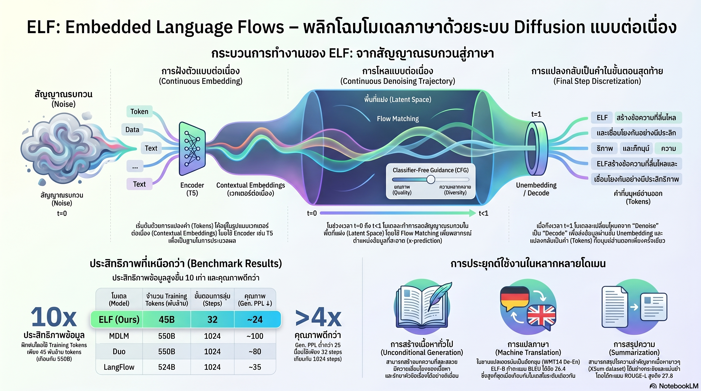

[กลับไปที่หน้าหลัก](../README.md)

สวัสดีครับเพื่อนๆ ที่ติดตามวงการ AI! วันนี้มาเรื่องที่ท้าทายรากฐานของการสร้างโมเดลภาษามาตั้งแต่ต้นครับ: ELF (Embedded Language Flows) จาก MIT — Continuous Diffusion Language Model ที่ปฏิเสธการมองภาษาเป็น Discrete Tokens ตลอดกระบวนการ ใช้ข้อมูลฝึกเพียง 45B Tokens แทน 500B+ ของคู่แข่ง และ ELF-B ขนาด 105M Parameters เอาชนะโมเดลที่ใหญ่กว่า 170M ได้อย่างราบรื่นครับ

คุณเคยสังเกตไหมครับว่า โมเดลภาษาทุกตัวในปัจจุบันมีพิธีกรรมที่ทำซ้ำอยู่ตลอดเวลาครับ แปลง Token เป็น Embedding เพื่อประมวลผล แล้วแปลงกลับเป็น Token เพื่อส่งออก แล้วแปลงกลับเป็น Embedding อีกครั้ง — วนซ้ำอยู่อย่างนั้น? ELF ตั้งคำถามว่าทำไมเราต้องเสียค่าใช้จ่ายของการสลับไปมานี้ ทั้งที่ความหมายที่แท้จริงอยู่ใน Continuous Space ตลอดเวลาครับ

คุณรู้ไหมครับว่า เทคนิค Classifier-Free Guidance (CFG) ที่ทำให้ Stable Diffusion และ Flux ควบคุมผลลัพธ์ได้อย่างแม่นยำนั้น เคยเป็นสิ่งที่โมเดลภาษาแบบ Discrete ทำได้ยากมากมาโดยตลอดครับ แต่เพราะ ELF "คิด" ในพื้นที่ต่อเนื่องตลอดเวลาเหมือนโมเดลภาพ มันจึงนำ CFG มาใช้กับภาษาได้แบบ Native โดยไม่ต้องแฮกอะไรเพิ่มเลยครับ?

และคุณเคยนึกไหมครับว่า จุดที่น่าสนใจที่สุดของ ELF ไม่ใช่ว่ามันใช้ขั้นตอนน้อยลง 32 steps แทน 1,024 steps ของรุ่นก่อนครับ แต่คือ Shared-weight Architecture ที่เครือข่ายเดียวทำหน้าที่ Denoise ตลอด t < 1 แล้วเปลี่ยนโหมดเป็น Decoder ทันทีที่ t = 1 ผ่าน Unembedding Layer — โดยไม่ต้องมี Decoder แยกต่างหากเลยครับ?

งานวิจัยนี้กำลังบอกว่า: "ความต่อเนื่องไม่ใช่แค่รายละเอียดทางสถาปัตยกรรม แต่คือการเปิดประตูที่ปิดอยู่มาตลอดสำหรับโมเดลภาษา — ทั้ง Data Efficiency, CFG, และ Minimal Architecture ล้วนเป็นผลพวงของการตัดสินใจครั้งเดียวที่จะไม่ Discretize ก่อนเวลาครับ"

========================================

🤔 ทบทวนความเชื่อเดิมๆ: สิ่งที่เราคิดเกี่ยวกับ Diffusion Language Models และการสร้างภาษา

▪ "Diffusion Model กับภาษาไม่ค่อย Match กัน เพราะภาษาเป็น Discrete อยู่แล้ว — Discrete DLM จึงเป็นทางเดินหลัก" → ELF พิสูจน์ว่าการ Discretize ระหว่างกระบวนการคือสิ่งที่ทำให้ DLM เสียประสิทธิภาพมาตลอดครับ การ "แช่ตัว" อยู่ใน Continuous Embedding Space ตั้งแต่ต้นจนเกือบจบ แล้ว Discretize เฉพาะขั้นตอนสุดท้ายให้ Data Efficiency สูงกว่า 10 เท่า และเปิดใช้ CFG ได้แบบ Native ครับ

▪ "โมเดลที่ดีต้องใช้ข้อมูล Training มาก — 500B+ Tokens คือ Entry Level สำหรับโมเดลที่แข่งขันได้" → ELF-B บรรลุประสิทธิภาพระดับที่เอาชนะโมเดล 170M Parameters ได้โดยใช้เพียง 45B Training Tokens ครับ การเปลี่ยน Paradigm ไปสู่ Continuous Space ลด Data Requirement ลงกว่า 10 เท่าโดยไม่ต้องพึ่ง Distillation หรือ Knowledge Transfer จากโมเดลยักษ์ใหญ่เลยครับ

▪ "CFG (Classifier-Free Guidance) ที่ใช้ได้ดีในโมเดลภาพนั้นใช้กับโมเดลภาษาได้ยากมาก เพราะ Space ต่างกัน" → ความยากของ CFG ใน Discrete DLM มาจากการสลับระหว่าง Continuous และ Discrete ระหว่างกระบวนการครับ เมื่อ ELF อยู่ใน Continuous Space ตลอดเวลา CFG จึงทำงานได้แบบ Native เหมือน Stable Diffusion หรือ Flux ที่ใช้ CFG ควบคุม Quality-Diversity Trade-off ได้อย่างแม่นยำครับ

▪ "Architecture ที่ซับซ้อนกว่า มี Component เฉพาะทางมากกว่า ย่อมให้ผลดีกว่า" → Shared-weight Architecture ของ ELF ที่ใช้เครือข่ายเดียวทำทั้ง Denoising และ Decoding พิสูจน์ตรงข้ามครับ การตัด Decoder แยกออกไปไม่ได้ลดความสามารถ แต่ลด Latency และเพิ่ม Speed ในการใช้งานจริงครับ ความเรียบง่ายที่ตั้งใจมักให้ผลดีกว่าความซับซ้อนที่สะสมมาครับ

ความจริงที่น่าคิดคือ: "ELF ไม่ได้แข่งขันด้วยการเพิ่มอะไร แต่ด้วยการลดการสลับโหมดโดยไม่จำเป็นออกไป — บางครั้งนวัตกรรมที่ยิ่งใหญ่ที่สุดคือการถามว่า ทำไมเราถึงทำสิ่งนี้อยู่ตั้งแต่แรกครับ?"

========================================

🧠 พื้นฐานที่ต้องเข้าใจก่อน: Continuous DLM, Flow Matching, Shared-weight Architecture, และทำไม CFG ถึง Native ใน ELF

=== ทำไม Discrete DLM ถึงมีขีดจำกัดในตัว ===

Diffusion Language Model แบบดั้งเดิมทำงานโดยการเพิ่ม Noise เข้าไปใน Token Representation แล้วเรียนรู้ที่จะ Denoise กลับครับ แต่ปัญหาคือภาษาเป็น Discrete อยู่แล้ว ดังนั้น Discrete DLM จึงมักต้องสลับระหว่าง Continuous Embedding Space (เพื่อประมวลผล) และ Discrete Token Space (เพื่อตรวจสอบความถูกต้อง) ระหว่างกระบวนการครับ

การสลับแต่ละครั้งมีต้นทุนครับ ทั้งในแง่ของ Information Loss (เมื่อ Map จาก Continuous กลับเป็น Discrete บางอย่างหายไป) และในแง่ของ CFG ที่ต้องการพื้นที่ต่อเนื่องเพื่อทำงานได้อย่างมีประสิทธิภาพครับ ELF แก้ปัญหานี้ที่ต้นทางโดยการไม่สลับเลยตลอดกระบวนการครับ

=== Continuous ในสองความหมาย: Embedding Space และ Continuous Time ===

ELF มีความ "ต่อเนื่อง" ในสองระดับที่ทำงานร่วมกันครับ

ด้าน Embedding Space: ELF ทำ Denoising โดยตรงใน Continuous Embedding Space ตลอดกระบวนการ ครับ ไม่มีการแปลงกลับเป็น Discrete Token ระหว่างทาง Discretization เกิดขึ้นเฉพาะในขั้นตอนสุดท้ายเท่านั้น ผ่าน Unembedding Layer ครับ

ด้าน Continuous Time: ELF ใช้ Flow Matching ครับ ซึ่งต่างจาก Discrete-time Diffusion ที่กำหนดจำนวน Step ตายตัว Flow Matching ใช้ Continuous Time Variable t ∈ [0,1] ที่ t=0 คือ Noise ล้วน และ t=1 คือ Output สุดท้าย ทำให้สามารถ Sample ที่จุดใดก็ได้บน Trajectory ครับ

ผลลัพธ์ของการรักษาความต่อเนื่องทั้งสองด้านคือ Maximal Flexibility ในการปรับ Flow Dynamics ครับ โมเดลไม่ถูก Constrain ให้หาเส้นทาง "ผ่านจุด Discrete" ระหว่างทาง ทำให้สามารถเรียนรู้เส้นทางที่สั้นและแม่นยำที่สุดใน Embedding Space ได้อย่างอิสระครับ

=== Flow Matching และ SDE-inspired Sampler: ทำไม 32 Steps ถึงพอ ===

Flow Matching เรียนรู้ Vector Field ที่บอกว่า "จาก Noise ณ จุดนี้ ควรเคลื่อนที่ไปทิศทางไหนเพื่อเข้าหา Data" ครับ ซึ่งต่างจาก DDPM-style Diffusion ที่เรียนรู้ Noise ที่ต้องลบออกในแต่ละ Step

ด้วย Vector Field ที่แม่นยำกว่า การ Integrate เส้นทางตาม Field จึงต้องการ Step น้อยกว่ามากครับ ELF ใช้ SDE-inspired Sampler (Stochastic Differential Equation) ที่เพิ่ม Controlled Noise เล็กน้อยระหว่าง Sampling เพื่อหลีกเลี่ยงการติดอยู่ใน Local Optima ครับ ผลลัพธ์คือ 32 Steps เพียงพอสำหรับคุณภาพสูง เทียบกับ 1,024 Steps ของรุ่นก่อนครับ

เปรียบได้กับ GPS ที่รู้ทิศทางชัดเจนตั้งแต่ต้น ต้องเช็กแผนที่แค่ 32 ครั้ง เทียบกับการเดินสุ่มแล้วแก้ทีละนิด ซึ่งต้องเช็กพันกว่าครั้งครับ

=== Shared-weight Architecture: หนึ่งเครือข่ายสองบทบาท ===

สิ่งที่ทำให้ ELF เรียบง่ายทางสถาปัตยกรรมคือการที่ Denoising Network และ Decoder ใช้ Weight เดียวกันครับ

สำหรับทุก t < 1: เครือข่ายทำหน้าที่ Denoise Embedding ไปเรื่อยๆ เพื่อ Refine ความหมายให้ชัดเจนขึ้นทีละ Step ครับ

เมื่อ t = 1: แทนที่จะส่งผลลัพธ์ไปยัง Decoder แยก เครือข่ายเดิมนั้นเองจะส่ง Embedding สุดท้ายผ่าน Unembedding Layer เพื่อ Map กลับเป็น Token Distribution และ Sample Output ออกมาครับ

ประโยชน์หลักสองอย่างครับ ด้านความเร็ว: ไม่มี Overhead ของการส่งข้อมูลข้ามเครือข่าย ลด Latency ในการใช้งานจริงครับ ด้านความสม่ำเสมอ: Representation ที่ใช้ใน Denoising และ Decoding มาจากพื้นที่เดียวกัน ลด Mismatch ระหว่างสองขั้นตอนครับ

=== CFG กับภาษา: ทำไมถึงเป็น Holy Grail ===

Classifier-Free Guidance ทำงานโดยการ Mix Output ระหว่าง Conditional และ Unconditional Generation ครับ ใน Image Diffusion เราทำได้ง่ายเพราะทุกอย่างอยู่ใน Continuous Space ตลอดเวลา แต่ใน Discrete DLM การ Mix ระหว่าง Discrete Distributions สองชุดทำได้ยากกว่าและมักให้ผลลัพธ์ที่ไม่ Smooth ครับ

เนื่องจาก ELF ทำงานใน Continuous Embedding Space ตลอดเวลา การ Mix Output ของ Conditional และ Unconditional Flow จึงทำได้แบบ Linear Interpolation ใน Continuous Space ครับ ซึ่งเป็นวิธีเดียวกับที่ Stable Diffusion และ Flux ใช้ในโลกภาพครับ ผลลัพธ์คือสามารถ Tune Trade-off ระหว่าง Quality และ Diversity ได้อย่างแม่นยำ สิ่งที่ Discrete DLM ทำได้ยากมากมาตลอดครับ

=== 10x Data Efficiency: เกิดขึ้นได้อย่างไร ===

45B Tokens ที่ ELF ใช้เทียบกับ 500B+ ของคู่แข่งนั้นเป็นตัวเลขที่น่าประหลาดใจมากครับ Hypothesis ที่นักวิจัยเสนอคือ Continuous Space ให้ Gradient Signal ที่สมบูรณ์กว่ามากในแต่ละ Training Step ครับ

เมื่อโมเดล Discrete ทำนายผิด มันรู้แค่ว่า "ไม่ใช่ Token นี้" ครับ แต่เมื่อ ELF ทำนายผิดใน Continuous Space มัน ว่า "ควรไปทิศทางใด" ใน Embedding Space แทนครับ Gradient ที่มีทิศทางชัดเจนกว่านี้เองที่ทำให้เรียนรู้ได้ดีกว่าจาก Data ปริมาณน้อยกว่าครับ

========================================

🎯 ประเด็นที่ควรคิดต่อ

— ELF เป็นหลักฐานว่า Paradigm Shift ให้ผลมากกว่าการ Scale ในกรณีนี้: 10x Data Efficiency ไม่ใช่เรื่องของ Hardware ที่ดีขึ้นหรือ Data ที่มากขึ้น แต่มาจากการเปลี่ยนสมมติฐานพื้นฐานว่า "ภาษาต้องผ่าน Discrete ระหว่างทาง" ครับ ซึ่งตั้งคำถามว่ายังมีสมมติฐานอะไรอีกใน Deep Learning ที่เราทำตามกันโดยไม่เคยตั้งคำถามครับ?

— CFG ใน Language Model เปิดประตูที่ยังไม่เคยสำรวจ: ใน Image Generation CFG ทำให้ควบคุม Style, Composition, และ Adherence to Prompt ได้อย่างละเอียดครับ ถ้าสิ่งเดียวกันนี้ทำได้กับภาษาแบบ Native ใน ELF — การควบคุม Tone, Style, Register, หรือ Factual Adherence ระหว่าง Generation อาจเป็นไปได้ในระดับที่ Autoregressive Model ทำไม่ได้เลยครับ

— คำถามที่สำคัญที่สุด: ELF พิสูจน์แนวคิดแล้วในขนาด 105M ครับ แต่ Continuous DLM ยังไม่เคยถูกทดสอบในขนาด Frontier (10B+ Parameters) อย่างจริงจังครับ ถ้า 10x Data Efficiency ยังคงอยู่เมื่อ Scale ขึ้น หมายความว่าโมเดล Frontier รุ่นถัดไปอาจต้องการข้อมูลฝึกน้อยลงอย่างมาก และ Barrier to Entry ของการแข่งขันในวงการ LLM จะเปลี่ยนไปอย่างไรครับ?

#ELF #ContinuousDLM #DiffusionLanguageModel #FlowMatching #MIT #AIResearch #MachineLearning #NLP #ClassifierFreeGuidance #DataEfficiency #SharedWeights #LLM #GenerativeAI
