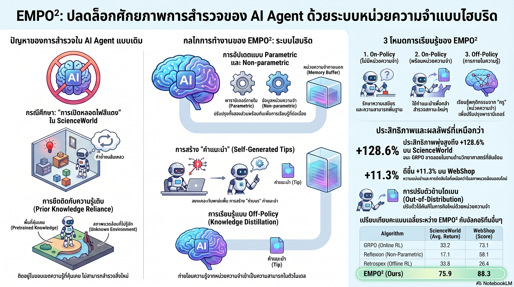

[กลับไปที่หน้าหลัก](../README.md)

สวัสดีครับเพื่อนๆ ที่สนใจ AI! วันนี้มาเรื่องที่ฟังดูเหมือน Sci-Fi แต่มันเกิดขึ้นจริงในงานวิจัยล่าสุดแล้วครับ เรื่องของ AI ที่เริ่ม "จดจำความผิดพลาดของตัวเอง" และแปลงมันให้เป็น "สัญชาตญาณ" โดยไม่ต้องรับการสอนจากมนุษย์

คุณเคยสังเกตไหมครับว่า AI ส่วนใหญ่ที่เราใช้งาน ถ้าวางให้แก้ปัญหาในสภาพแวดล้อมที่เปลี่ยนไปจากที่เคยฝึกมา มันมักจะ "วนเวียน" ทำสิ่งเดิมซ้ำๆ แม้สิ่งนั้นจะไม่ได้ผลแล้ว?

คุณเคยสงสัยไหมครับว่า ทำไม AI ที่ฉลาดมากพอที่จะแต่งบทกวีได้ ถึงยังแก้ปัญหาในสภาพแวดล้อมใหม่ๆ ได้แย่กว่าเด็กประถมที่แค่ "ลองผิดลองถูก"?

และคุณรู้ไหมครับว่า มีงานวิจัยที่ทำให้ AI Agent ทำคะแนนสูงขึ้นถึง 128.6% ในงานวางแผนซับซ้อน โดยใช้หลักการเดียวกับที่มนุษย์ "จดโน้ตแล้วซึมซับจนไม่ต้องดูโน้ตอีก"?

งานวิจัย EMPO2 (Exploratory Memory-Augmented On- and Off-Policy Optimization) กำลังพิสูจน์ว่าความฉลาดของ AI ไม่ได้วัดจากปริมาณข้อมูลที่จำมา แต่วัดจาก "ความสามารถในการเรียนรู้จากความผิดพลาดของตัวเอง" ครับ

========================================

🤔 ทบทวนความเชื่อเดิมๆ: สิ่งที่เราคิดเกี่ยวกับ AI Agent

▪ "AI ที่ฝึกมาแล้วก็ควรทำงานได้ดีในทุกสถานการณ์ที่คล้ายกัน" → AI ส่วนใหญ่ติดกับดัก "ทำตามความรู้เดิม" มากเกินไป พอสภาพแวดล้อมเปลี่ยนนิดเดียวก็ทำซ้ำสิ่งที่เคยทำแม้มันจะไม่ได้ผลแล้ว

▪ "AI ฉลาดขึ้นได้ด้วยการเพิ่มข้อมูลฝึก" → EMPO2 พิสูจน์ว่าการให้ AI "จดโน้ตจากประสบการณ์ของตัวเอง" แล้วค่อยๆ ซึมซับโน้ตเหล่านั้นให้กลายเป็นสัญชาตญาณ ได้ผลดีกว่าการใส่ข้อมูลเพิ่มในการฝึกครับ

▪ "การมีหน่วยความจำเสริม (External Memory) ก็เพียงพอแล้วสำหรับ AI ที่ฉลาด" → หน่วยความจำเสริมช่วยได้ในระยะสั้น แต่ถ้าไม่มีกระบวนการ "ซึมซับ" เข้าไปในตัวโมเดล AI จะยังต้องพึ่ง "โพย" ตลอดเวลา ไม่ได้เรียนรู้จริงๆ

▪ "AI ที่เก่งในงานหนึ่งต้องถูกฝึกใหม่ทั้งหมดก่อนจะทำงานอื่นได้ดี" → EMPO2 แสดงให้เห็นว่า AI ที่ฝึกจากงานชีววิทยาสามารถปรับตัวไปทำงานไฟฟ้าได้อย่างรวดเร็ว โดยไม่ต้องอัปเดตพารามิเตอร์ใหม่เลยแม้แต่น้อย

ความจริงที่น่าคิดคือ: "วิธีที่ AI เรียนรู้" สำคัญกว่า "จำนวนสิ่งที่ AI จำมา" เหมือนกับมนุษย์ที่เรียนรู้วิธีเรียนรู้ได้ดีกว่าคนที่แค่ท่องจำครับ

========================================

🧠 พื้นฐานที่ต้องเข้าใจก่อน: Exploration, Intrinsic Reward, Non-parametric Memory และ Knowledge Distillation

=== Exploration ใน AI คืออะไร? ===

Exploration = ความสามารถของ AI ในการ "ลองสิ่งใหม่" แม้ยังไม่รู้ว่าจะได้ผลหรือไม่

เปรียบเทียบ: เหมือนเด็กที่กำลังหาของในบ้าน ถ้าเด็กแค่ "ไปที่ที่เคยเจอของมาก่อน" ซ้ำๆ ก็จะไม่เจอของที่ซ่อนอยู่ในที่ใหม่ เด็กที่ฉลาดจะ "ลองเปิดลิ้นชักที่ยังไม่เคยเปิด" แม้ไม่รู้ว่าจะมีอะไรอยู่ข้างใน AI ส่วนใหญ่ทำแบบแรก EMPO2 พยายามทำแบบหลังครับ

=== Intrinsic Reward VS Extrinsic Reward คืออะไร? ===

[Extrinsic Reward = รางวัลจากภายนอก]
▸ AI ได้รับรางวัลเมื่อทำสำเร็จตามที่กำหนด เช่น เปิดหลอดไฟได้ = +10 คะแนน
▸ ปัญหา: ถ้า AI ไม่เคยเจอสถานการณ์ที่ทำสำเร็จได้เลย มันก็ไม่มีทางเรียนรู้

[Intrinsic Reward = รางวัลจากภายใน]
▸ AI ได้รับ "รางวัลจากตัวเอง" เมื่อไปเจอสถานการณ์ใหม่ที่ยังไม่เคยเห็น
▸ เปรียบ: เหมือนความรู้สึก "ตื่นเต้น" ที่มนุษย์ได้รับเมื่อค้นพบสิ่งใหม่ ทำให้อยากสำรวจต่อแม้ยังไม่รู้ว่าสิ่งที่ค้นพบนั้นมีประโยชน์หรือเปล่า

EMPO2 ใช้ Cosine Similarity วัดว่า "สถานการณ์ที่ AI เจออยู่นี้ใหม่แค่ไหน?" แล้วให้รางวัลตามความใหม่นั้น ยิ่งใหม่มาก ยิ่งได้รางวัลมากครับ

=== Non-parametric VS Parametric Memory คืออะไร? ===

[Non-parametric Memory = หน่วยความจำภายนอก]
▸ เหมือนโน้ตที่เขียนลงกระดาษ ดึงมาอ่านเมื่อต้องการ
▸ เพิ่มข้อมูลได้ทันทีโดยไม่ต้องฝึกโมเดลใหม่
▸ แต่ต้องพึ่งโน้ตนี้ตลอด ถ้าหายก็ลืมทันที

[Parametric Memory = ความรู้ที่อยู่ในพารามิเตอร์โมเดล]
▸ เหมือนสิ่งที่จำได้ในหัว ไม่ต้องดูโน้ตก็รู้เลย
▸ ต้องใช้เวลาฝึกถึงจะซึมซับเข้าไปได้
▸ แต่เมื่อซึมซับแล้ว ใช้ได้ทันทีและยืดหยุ่นกว่ามาก

EMPO2 ออกแบบมาให้ใช้ทั้งสองแบบร่วมกัน และค่อยๆ แปลง Non-parametric เป็น Parametric ครับ

=== Knowledge Distillation คืออะไร? ===

Knowledge Distillation = กระบวนการที่ "โมเดลครู" สอน "โมเดลนักเรียน" ให้ทำสิ่งเดียวกันได้ โดยที่นักเรียนอาจมีขนาดเล็กกว่าหรือมีข้อมูลน้อยกว่า

เปรียบเทียบ: เหมือนอาจารย์เดินสาย ที่เห็นคำตอบสำเร็จรูปและอธิบายวิธีได้ VS นักเรียนที่ต้องหาวิธีเองจากศูนย์ กระบวนการ Distillation คือการให้นักเรียน "ดูว่าอาจารย์ทำอะไรบ้าง" แล้วฝึกให้ทำแบบเดียวกันได้แม้ไม่มีอาจารย์ยืนอยู่ข้างๆ ครับ

========================================

1️⃣ ภารกิจหลอดไฟสีแดง: เมื่อ "ทำตามคำสั่ง" กลายเป็นกับดัก

=== สถานการณ์ที่ทดสอบ ===

ลองนึกภาพครับ: AI ถูกส่งไปในห้องโถงพร้อมคำสั่ง "เปิดหลอดไฟสีแดง" แต่ในห้องโถงนั้นไม่มีหลอดไฟสีแดงอยู่เลย

[สิ่งที่ AI ทั่วไป (GRPO) ทำ]
▸ พยายาม "Focus on Red Light Bulb" ซ้ำๆ ตามคำสั่ง
▸ วนเวียนอยู่กับพื้นที่เดิม ทำสิ่งเดิม
▸ ไม่ยอมออกไปสำรวจห้องอื่นเพราะ "คำสั่งบอกว่าต้องหาหลอดไฟ ไม่ใช่เดินสำรวจ"
▸ สุดท้าย: ล้มเหลวโดยไม่เรียนรู้อะไรใหม่

[ปัญหาที่ซ่อนอยู่]
▸ AI ถูกฝึกมาให้ "ทำตามความรู้เดิม" จนไม่สามารถ "สำรวจสิ่งใหม่" ได้
▸ การสำรวจ (Exploration) เป็นคอขวดสำคัญของ AI ที่ฝึกด้วย Reinforcement Learning
▸ ถ้า AI ไม่เจอสถานการณ์ใหม่ มันก็ไม่มีทางเรียนรู้ว่าควรทำอะไรในสถานการณ์ใหม่นั้น

[วิธีที่ EMPO2 แก้ปัญหา]
▸ ให้ Intrinsic Reward เมื่อ AI ไปเจอสถานการณ์ที่ยังไม่เคยเจอ (วัดด้วย Cosine Similarity)
▸ AI ได้รับ "รางวัลจากการสำรวจ" แม้ยังไม่ได้ทำภารกิจสำเร็จ
▸ ผลคือ AI เริ่ม "อยากออกไปสำรวจ" แม้คำสั่งจะบอกให้ทำสิ่งที่ยังไม่ได้ผล

เปรียบเทียบ: เหมือนการสอนเด็กให้หาคำตอบ ถ้าสอนว่า "ถ้าหาได้ได้รางวัล" เด็กก็จะลองแค่วิธีที่เคยได้ผลมาแล้ว แต่ถ้าสอนว่า "ถ้าลองวิธีใหม่ที่ยังไม่เคยลองก็ได้รางวัลด้วย" เด็กก็จะกล้าสำรวจมากขึ้นครับ

========================================

2️⃣ "โพย" จากตัวเอง: เมื่อ AI เริ่มเขียนบันทึกความผิดพลาด

=== กลไก Memory Buffer และ Tips ===

เมื่อ AI ทำงานพลาด แทนที่จะแค่ "ลองใหม่" EMPO2 ให้ AI เขียน "บันทึกช่วยจำ" (Tips) ของตัวเองก่อนครับ

[ตัวอย่าง Tips ที่ AI สร้างขึ้นเองจากประสบการณ์จริง]
▸ "คุณขยับไปมาระหว่างห้องครัวกับห้องน้ำแต่ไม่พบสายไฟสีเขียวเลย คุณควรลองหาทางอื่น"
▸ "คุณพยายามเปิดหลอดไฟสีแดงแต่ไม่สำเร็จ คุณอยู่ในห้องโถงและจำเป็นต้องหาวิธีเข้าห้อง Workshop"
▸ "การเชื่อมต่อวงจรเกือบสมบูรณ์แล้ว แต่ยังขาดการเชื่อมต่อกับแบตเตอรี่"

[Tips เหล่านี้ถูกเก็บในที่ไหน?]
▸ Memory Buffer (M) ซึ่งเป็นระบบหน่วยความจำภายนอก (Non-parametric)
▸ เมื่อเจอสถานการณ์ใหม่ AI ใช้ Similarity Search ดึง Tips ที่ใกล้เคียงที่สุดมาใช้ตัดสินใจ

[ทำไมถึงได้ผลดีกว่าการแค่ "ลองใหม่"?]
▸ Tips ที่เป็นรูปธรรมช่วยให้ AI หลีกเลี่ยงความผิดพลาดเดิมๆ
▸ AI เริ่ม "สำรวจเชิงระบบ" แทนที่จะลองสุ่ม
▸ ประสบการณ์จากความล้มเหลวกลายเป็น "เข็มทิศ" ที่ช่วยนำทาง

เปรียบเทียบ: เหมือนการทำอาหารครับ คนที่แค่ "ลองใหม่" เมื่อทำอาหารพลาดก็จะทำซ้ำแบบเดิมและพลาดซ้ำ แต่คนที่ "จดโน้ตว่าใส่เกลือมากเกินไป ครั้งหน้าลดลงครึ่งหนึ่ง" จะเรียนรู้เร็วกว่ามาก Tips ใน EMPO2 คือโน้ตที่ AI เขียนเองนั่นเองครับ

========================================

3️⃣ จาก "โพย" สู่ "สัญชาตญาณ": มนตราแห่ง Knowledge Distillation

=== Off-policy Update: ถอดโพยออกแล้วยังทำได้ไหม? ===

นี่คือจุดที่ EMPO2 เหนือกว่าแนวทางอื่นครับ การมีโพยช่วยได้ในระยะสั้น แต่ถ้า AI ต้องพึ่งโพยตลอดไปก็ไม่ใช่การ "เรียนรู้จริงๆ"

กระบวนการ Reward-guided Knowledge Distillation ทำงานแบบนี้:

[โมเดล "ครู": AI ที่มี Tips อยู่ในมือ]
▸ ใช้ Tips ช่วยนำทาง เจอทางออกที่ถูกต้อง
▸ บันทึก trajectory หรือ "เส้นทางที่ทำให้ประสบความสำเร็จ"

[โมเดล "นักเรียน": AI ตัวเดียวกัน แต่ถอด Tips ออกไปแล้ว]
▸ ดู trajectory ที่ครูทำไว้
▸ อัปเดตพารามิเตอร์เพื่อให้ตัดสินใจแบบเดียวกัน โดยไม่ต้องมี Tips
▸ ผลคือความรู้จาก Tips ค่อยๆ "ซึมซับ" เข้าไปในตัวโมเดล

[Masking Mechanism: ป้องกันโมเดลพัง]
▸ กรอง Token ที่มีความน่าจะเป็นต่ำออกระหว่างการอัปเดต
▸ ป้องกัน Gradient Divergence (NaN) ซึ่งเป็นอาการที่โมเดล "พัง" ระหว่างฝึก
▸ รักษาเสถียรภาพในการเรียนรู้แบบ Off-policy ที่มักจะไม่เสถียร

เปรียบเทียบ: เหมือนนักเรียนที่ดูอาจารย์แก้โจทย์บนกระดาน แล้วลองทำเองโดยไม่ดูกระดาน ถ้าทำได้ แสดงว่า "เข้าใจจริงๆ" ไม่ใช่แค่ "ลอก" EMPO2 ทำให้ AI ผ่านขั้นตอนนี้โดยอัตโนมัติครับ และ Masking Mechanism คือระบบที่ป้องกันไม่ให้นักเรียน "ท่องจำเกินไปจนสับสน"

========================================

4️⃣ ตัวเลขที่ไม่โกหก: +128.6% ในงานที่ซับซ้อนที่สุด

=== ผลการทดสอบใน 2 สนาม ===

[สนามที่ 1: ScienceWorld — การทดลองวิทยาศาสตร์ระดับประถม]
▸ งานที่ต้องวางแผนหลายขั้นตอน หาอุปกรณ์ ผสมสารเคมี เดินสายไฟ
▸ ต้องการการสำรวจสูงมาก เพราะสภาพแวดล้อมมีตัวแปรเยอะ
▸ GRPO (วิธีมาตรฐาน): คะแนนเฉลี่ย 33.2
▸ EMPO2: คะแนนเฉลี่ย 75.9 → เพิ่มขึ้น 128.6%!
▸ ที่สำคัญ: GRPO "นิ่ง" ก่อนถึงผลลัพธ์ที่ดี แต่ EMPO2 เรียนรู้ต่อเนื่องไม่หยุด

[สนามที่ 2: WebShop — การซื้อของออนไลน์ตามเงื่อนไข]
▸ งานที่พึ่งพาความรู้เดิมมากกว่า ต้องการ Exploration น้อยกว่า
▸ EMPO2: ยังทำได้ดีกว่า GiGPO และ GRPO อย่างมีนัยสำคัญ (+11.3%)
▸ พิสูจน์ว่า EMPO2 ไม่ได้ "เก่งเฉพาะงานยากๆ" แต่เหนือกว่าในทุกประเภทงาน

=== ทำไม 128.6% ถึงสำคัญ? ===

ใน AI Research การเพิ่มขึ้น 5-10% ถือว่าน่าสนใจมากแล้วครับ 128.6% คือการกระโดดข้ามระดับ ไม่ใช่การปรับปรุง แสดงว่า EMPO2 ไม่ได้แค่ "ดีกว่าเล็กน้อย" แต่แก้ปัญหาในระดับที่ต่างออกไปโดยสิ้นเชิง

เปรียบเทียบ: เหมือนการเปรียบรถจักรยานกับรถยนต์ในการแข่งความเร็ว ตัวเลข 128.6% ไม่ใช่รถจักรยานที่เร็วขึ้น แต่คือการเปลี่ยนไปใช้รถยนต์ที่ "กลไกต่างกันโดยพื้นฐาน" ครับ

========================================

5️⃣ ปรับตัวนอกตำรา (OOD): AI ที่ "เรียนรู้วิธีเรียนรู้"

=== Out-of-Distribution Test: ทดสอบสิ่งที่ไม่เคยฝึกมา ===

นี่คือการทดสอบที่โหดที่สุดสำหรับ AI ครับ: นำโมเดลที่ฝึกมาจากโดเมนหนึ่ง ไปใช้ในโดเมนที่ต่างออกไปโดยสิ้นเชิง

[การทดสอบที่ทำ]
▸ ฝึก AI ด้วยงานชีววิทยา (Biology tasks)
▸ นำไปใช้กับงานไฟฟ้า (Electricity tasks) โดยไม่ฝึกใหม่

[ผลที่ได้]
▸ AI สามารถเรียนรู้และปรับตัวได้อย่างรวดเร็วภายในไม่กี่ครั้งลองผิดลองถูก (Few trials)
▸ ไม่ต้องอัปเดตพารามิเตอร์ใหม่แม้แต่น้อย (Zero parameter updates)
▸ ระบบ Memory Buffer ทำให้ AI "เรียนรู้วิธีเรียนรู้" แม้ในสภาพแวดล้อมที่ไม่คุ้นเคย

=== ทำไมถึงเป็นไปได้? ===

เพราะ EMPO2 ไม่ได้แค่สอนให้ AI "ทำงานชีววิทยา" แต่สอนให้ AI มี "กระบวนการคิด" ที่ยืดหยุ่น:
▸ วิธีสำรวจเชิงระบบ (Systematic Exploration)
▸ วิธีจดจำความผิดพลาดและหลีกเลี่ยง
▸ วิธีดึง Tips จากประสบการณ์เก่ามาประยุกต์ใช้กับสถานการณ์ใหม่

กระบวนการเหล่านี้ "ข้ามโดเมน" ได้ เพราะมันเป็นทักษะการเรียนรู้ ไม่ใช่ความรู้เฉพาะเรื่องใดเรื่องหนึ่งครับ

เปรียบเทียบ: เหมือนคนที่เก่งวิชาเรียนรู้วิธีเรียน ไม่ว่าจะเป็นวิชาอะไรก็ตาม เขาจะเรียนได้เร็วกว่าคนที่ท่องจำแต่ไม่ได้ฝึกทักษะการเรียนรู้ เพราะ "วิธีเรียน" ใช้ได้กับทุกวิชา แต่ "ความจำ" จำกัดอยู่แค่สิ่งที่เคยท่อง EMPO2 ทำให้ AI มีทักษะแบบแรกครับ

========================================

🎯 สรุป: 5 บทเรียนจาก EMPO2

▸ Exploration คือคอขวดของ AI Agent: ถ้า AI ไม่กล้าสำรวจสิ่งใหม่ มันจะวนเวียนกับความล้มเหลวเดิม Intrinsic Reward คือกุญแจที่ปลดล็อกปัญหานี้
▸ โพยจากตัวเอง ดีกว่าข้อมูลจากคนอื่น: Tips ที่ AI เขียนจากประสบการณ์ตรงของตัวเองมีคุณค่ามากกว่าข้อมูลฝึกทั่วไป เพราะมันแม่นยำต่อสถานการณ์นั้นๆ
▸ Non-parametric + Parametric = ครบสูตร: หน่วยความจำภายนอกช่วยได้ในระยะสั้น แต่ต้องมีกระบวนการ "ซึมซับ" ให้กลายเป็นสัญชาตญาณในระยะยาว
▸ 128.6% ไม่ใช่การปรับปรุง แต่คือการเปลี่ยนระดับ: ตัวเลขนี้พิสูจน์ว่า EMPO2 แก้ปัญหาในระดับกลไกพื้นฐาน ไม่ใช่แค่การ Tune ค่าปรับแต่ง
▸ Learning to learn ข้ามโดเมนได้: AI ที่รู้วิธีเรียนรู้ยืดหยุ่นกว่า AI ที่จำมาเยอะ เหมือนนักเรียนที่มีทักษะการเรียนรู้ที่ดีปรับตัวเข้าวิชาใหม่ได้เร็วกว่า

หลักการสำคัญ: "ความฉลาดของ AI ในอนาคตไม่ได้วัดจากจำนวนข้อมูลที่จำมาได้ แต่วัดจากความสามารถในการเรียนรู้จากความผิดพลาด แปลงประสบการณ์ให้เป็นสัญชาตญาณ และปรับตัวได้ในสภาพแวดล้อมที่ไม่คุ้นเคย EMPO2 คือก้าวสำคัญในทิศทางนั้นครับ"

========================================

💬 คำถามท้ายทาย

1. ถ้า AI เริ่ม "จดโน้ตจากความผิดพลาดของตัวเอง" และ "ซึมซับความรู้นั้นจนไม่ต้องดูโน้ตอีก" มันต่างจากวิธีที่มนุษย์เรียนรู้อย่างไรครับ? และถ้าต่างกันน้อยลงเรื่อยๆ นั่นหมายความว่าอะไรสำหรับอนาคตของการศึกษา?

2. Intrinsic Reward ที่ให้รางวัลกับ "การสำรวจสิ่งใหม่" นั้น ฟังดูดีสำหรับงานวิจัย แต่ถ้าเอาไปใช้กับ AI Agent ที่ควบคุมระบบจริงๆ เช่น การเงิน หรือระบบสาธารณูปโภค "การสำรวจสิ่งใหม่" โดย AI อาจเป็นความเสี่ยงที่อันตรายไหมครับ?

3. ผลการทดสอบ Out-of-Distribution ที่ AI ปรับตัวข้ามโดเมนได้โดยไม่ต้องอัปเดตพารามิเตอร์เลย คุณคิดว่ามันพร้อมสำหรับการนำไปใช้ในงานจริงที่ความผิดพลาดมีต้นทุนสูงแล้วหรือยัง?

4. ถ้า AI เรียนรู้จากความผิดพลาดได้ดีกว่ามนุษย์ในหลายสถานการณ์ มนุษย์ควรเรียนรู้อะไรจาก "วิธีที่ AI เรียนรู้" กลับมาประยุกต์ใช้กับการพัฒนาตัวเองไหมครับ?

========================================

References:
▸ EMPO2: Exploratory Memory-Augmented On- and Off-Policy Optimization (arXiv)
▸ ScienceWorld Benchmark — สภาพแวดล้อมทดสอบการวางแผนหลายขั้นตอนของ AI Agent
▸ WebShop Benchmark — สภาพแวดล้อมทดสอบการซื้อของออนไลน์ตามเงื่อนไข
▸ GRPO (Group Relative Policy Optimization) — อัลกอริทึมมาตรฐานที่ EMPO2 ใช้เปรียบเทียบ
▸ GiGPO — อัลกอริทึม Baseline อีกตัวที่ใช้ในการเปรียบเทียบ
▸ Cosine Similarity — วิธีวัด State Novelty ใน Intrinsic Reward ของ EMPO2
▸ Knowledge Distillation — เทคนิคการถ่ายทอดความรู้จากโมเดล "ครู" สู่โมเดล "นักเรียน"

ในวันที่ AI เริ่มเรียนรู้จากความผิดพลาดของตัวเองได้ดีกว่ามนุษย์หลายๆ คน คำถามที่ท้าทายกว่าว่า "AI ฉลาดแค่ไหน?" อาจกลายเป็น "เราจะออกแบบ AI ให้เรียนรู้ได้ในแบบที่เราต้องการและปลอดภัยได้อย่างไร?" ครับ 🧠

#EMPO2 #AIResearch #LLMAgent #ReinforcementLearning #ExplorationRL #KnowledgeDistillation #AILearning #AgentAI #MachineLearning #DeepLearning
