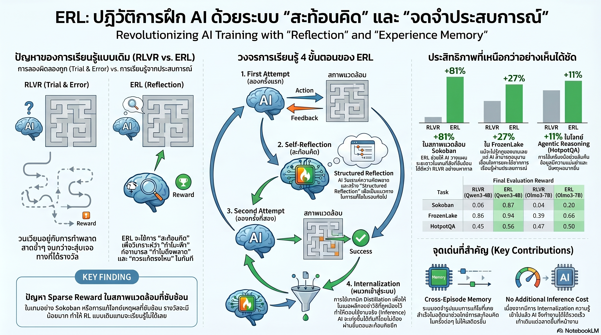

[กลับไปที่หน้าหลัก](../README.md)

สวัสดีครับเพื่อนๆ ที่ติดตามวงการ AI! วันนี้มาเรื่องที่ดูเหมือนเทคนิค แต่จริงๆ แล้วเป็นคำตอบสำหรับคำถามที่ทุกคนในวงการ AI เคยสงสัย ว่าทำไมการสอน AI ให้แก้ปัญหาซับซ้อนถึงยากนักทั้งที่มันจำข้อมูลได้มากมายมหาศาลครับ

คุณเคยสังเกตไหมครับว่า AI Agent ในปัจจุบันเมื่อทำพลาดแล้วได้รับแค่คะแนน "ต่ำ" กลับมา มันมักจะทำพลาดซ้ำในลักษณะเดิมอีกครั้ง เพราะไม่รู้ว่าพลาดตรงไหนกันแน่?

คุณเคยสงสัยไหมครับว่า ทำไมมนุษย์ถึงเรียนรู้จากความผิดพลาดได้เร็วกว่า AI ทั้งที่ AI จำข้อมูลได้มากกว่ามนุษย์นับล้านเท่า ความแตกต่างอยู่ที่ "กระบวนการสะท้อนคิด" ไม่ใช่ปริมาณข้อมูล?

และคุณรู้ไหมครับว่า มีวิธีที่ทำให้ AI เพิ่มประสิทธิภาพในการแก้ปัญหาได้ถึง 81% ในเกมวางแผนที่ซับซ้อน โดยเริ่มต้นจากไม่รู้กฎอะไรเลยสักข้อ เพียงแค่เพิ่มวงจร "สะท้อนคิด" เข้าไปในการเรียนรู้?

แนวคิดนี้ชื่อ Experiential Reinforcement Learning หรือ ERL และมันกำลังเปลี่ยน AI จากเครื่องจักรที่ "สุ่มเดา" ให้กลายเป็น "นักเรียน" ที่มีกระบวนการถอดบทเรียนจากความผิดพลาดได้จริงๆ ครับ

========================================

🤔 ทบทวนความเชื่อเดิมๆ: สิ่งที่เราคิดเกี่ยวกับ Reinforcement Learning

▪ "AI ที่ฉลาดกว่าต้องใช้ข้อมูลมากกว่า ยิ่งฝึกนานยิ่งเก่ง" → ERL พิสูจน์ว่าการเพิ่ม "คุณภาพของการเรียนรู้" ผ่านกระบวนการ Reflection สำคัญกว่าปริมาณ Trajectory Sokoban เพิ่มขึ้น 81% โดยไม่ได้เพิ่มข้อมูลเพิ่มเลย

▪ "Reward ที่บอกว่าถูกหรือผิดก็เพียงพอแล้วสำหรับการฝึก AI" → Scalar Reward เป็นคอขวดของข้อมูล มันบอกแค่ว่า "ผลลัพธ์แย่" แต่ไม่บอกว่า "พลาดตรงไหน ทำไม และควรแก้อย่างไร" ERL เปลี่ยน Feedback นั้นให้กลายเป็น Behavioral Revision ที่จับต้องได้

▪ "AI ต้องการ Reflection ในการใช้งานจริงด้วย ไม่อย่างนั้นมันจะเก่งแค่ตอนฝึก" → Internalization via Distillation ทำให้โมเดลซึม Reflection เข้าไปใน Weights ตอนฝึก แล้วตอบได้ทันทีโดยไม่ต้องทำ Reflection อีกตอน Deploy — เร็วกว่าและประหยัดกว่า

▪ "AI ต้องรู้กฎของสภาพแวดล้อมก่อนถึงจะทำงานได้" → AI ใน Sokoban เริ่มต้นโดยไม่รู้เลยว่าอะไรคือผนัง อะไรคือกล่อง แต่สามารถ "สรุปกฎของโลก" ได้เองผ่านการ Reflect ซ้ำๆ จนทำคะแนนได้ดี

ความจริงที่น่าคิดคือ: ปัญหาของ RL แบบเดิมไม่ใช่ว่า Reward Signal ผิด แต่คือ Reward Signal นั้นมีข้อมูลน้อยเกินไปที่จะบอก AI ว่าต้องเปลี่ยนพฤติกรรมอะไรครับ

========================================

🧠 พื้นฐานที่ต้องเข้าใจก่อน: RLVR, Trajectory, Reflection และ Internalization

=== RLVR คืออะไร และปัญหาของมันคืออะไร? ===

RLVR = Reinforcement Learning with Verifiable Rewards วิธีฝึก AI Agent แบบดั้งเดิมที่ให้รางวัลเมื่อทำถูกและลงโทษเมื่อทำผิด

ปัญหาหลักคือ Undirected Exploration — AI สุ่มลองทำสิ่งต่างๆ แล้วรอดูว่าอะไรให้รางวัล เหมือนเดินในเขาวงกตมืดแล้วมีคนตะโกนบอกแค่ว่า "ผิด" หลังจากที่เดินชนกำแพงไปแล้ว ไม่ได้บอกว่า "เลี้ยวซ้าย 2 ก้าว" ครับ

=== Trajectory คืออะไร? ===

Trajectory = บันทึกลำดับการกระทำทั้งหมดของ Agent ในการแก้โจทย์หนึ่งครั้ง ตั้งแต่ต้นจนจบ รวมถึง State, Action และ Reward ในแต่ละขั้นตอน

ERL เพิ่ม "Reflection" เข้าไปใน Trajectory ทำให้แต่ละ Trajectory ไม่ใช่แค่บันทึกสิ่งที่เกิดขึ้น แต่รวมบทเรียนที่สกัดออกมาด้วยครับ

=== Reflection (Δ) คืออะไร? ===

Reflection = คำแนะนำที่โมเดลสร้างขึ้นสำหรับตัวเองหลังจากทำพลาด บอกว่า "พลาดตรงไหน ทำไม และครั้งหน้าควรทำอะไรต่างออกไป"

เปรียบเทียบ: เหมือนนักกีฬาที่หลังแข่งแพ้แล้วนั่งดูคลิปตัวเองและเขียนโน้ตว่า "ขาซ้ายช้าเกินไปในนาทีที่ 23" แทนที่จะแค่รู้ว่า "แพ้" ครับ

=== Reflection Memory (m) คืออะไร? ===

Reflection Memory = คลังความรู้ที่สะสม Reflection ที่มีคุณภาพดีไว้ใช้ในรอบถัดๆ ไป

มีระบบ Quality Control: เก็บเฉพาะ Reflection ที่นำไปสู่ผลลัพธ์ที่ดีขึ้นจนเกิน Reward Threshold (τ) เท่านั้น ทำให้คลังความรู้นี้เป็น "Best Practices" ไม่ใช่แค่ประวัติการทำพลาดทั้งหมดครับ

=== Internalization via Distillation คืออะไร? ===

Internalization = การ "กลั่น" ความรู้จากการ Reflect เข้าไปใน Weights ของโมเดล โดยฝึกให้โมเดลตอบถูกโดยตรงจากโจทย์ โดยไม่ต้องผ่านขั้นตอน Reflection อีกต่อไป

[ตอนฝึก] = ใช้ Reflection (System 2 ช้าแต่ละเอียด)
[ตอน Deploy] = ตอบตรงโดยไม่มี Reflection (System 1 เร็วและประหยัด)

เปรียบเทียบ: เหมือนการฝึกขับรถ ตอนเรียนต้องคิดทุกอย่าง "กดเบรก → เปลี่ยนเกียร์ → มองกระจก" แต่พอชำนาญแล้วทำทุกอย่างได้โดยอัตโนมัติโดยไม่ต้องคิดครับ

========================================

1️⃣ เลิกสุ่มสี่สุ่มห้า: เสริมพลัง RL ด้วยการเรียนรู้ผ่านประสบการณ์

=== ERL ไม่ได้แทน RLVR แต่ "เสริม" มัน ===

สิ่งสำคัญที่ต้องเข้าใจคือ ERL ไม่ได้เป็นคู่แข่งของ RLVR แต่เป็นการ "Augment" หรือเติมเต็มในส่วนที่ RLVR ขาดครับ

[RLVR (แบบเดิม)]
▸ เน้น Undirected Exploration — ลองสุ่มและรอดูว่าอะไรได้รางวัล
▸ ข้อมูล Feedback มีน้อย: รู้แค่ว่า "ดี" หรือ "แย่"
▸ ต้องการ Trajectory จำนวนมากมายเพื่อค่อยๆ ปรับพฤติกรรม

[ERL (แบบใหม่)]
▸ เน้น Directed Exploration — ทำพลาดแล้วรู้ทันทีว่าต้องแก้อะไร
▸ ข้อมูล Feedback เข้มข้น: ได้รับ Reflection ที่ระบุจุดปรับปรุงชัดเจน
▸ แต่ละ Trajectory มีคุณค่าสูงกว่าเพราะมีบทเรียนสะสมอยู่ด้วย

เปรียบเทียบ: เหมือนความต่างระหว่างครูที่เห็นนักเรียนทำข้อสอบผิดแล้วแค่เขียน "0" กลับมา กับครูที่เห็นแล้วนั่งอธิบายทีละขั้นว่าพลาดตรงไหนและควรคิดใหม่อย่างไร นักเรียนคนไหนจะเรียนรู้ได้เร็วกว่าครับ?

========================================

2️⃣ วงจร Experience-Reflection-Consolidation: หัวใจที่เลียนแบบการเรียนรู้มนุษย์

=== สามขั้นตอนที่ทำงานร่วมกัน ===

ERL เลียนแบบวัฏจักรการเรียนรู้ของมนุษย์ผ่าน 3 ขั้นตอนที่วนซ้ำครับ

[ขั้นที่ 1: Experience — ลงมือทำครั้งแรก]
▸ โมเดลลองแก้โจทย์ด้วยความรู้ที่มีอยู่
▸ รับ Feedback จากสภาพแวดล้อม ทั้งรางวัลและ Error
▸ ยังไม่รู้ว่าพลาดตรงไหน แค่รู้ว่าผลลัพธ์ดีหรือแย่

[ขั้นที่ 2: Reflection — ถอดบทเรียน]
▸ โมเดลวิเคราะห์ความผิดพลาดและสร้าง Reflection (Δ)
▸ ระบุว่า "พลาดตรงไหน ทำไม และควรทำอะไรต่างออกไป"
▸ Reflection ที่ดีพอจะถูกเก็บใน Reflection Memory (m)

[ขั้นที่ 3: Consolidation — ลองทำอีกครั้งด้วยบทเรียน]
▸ โมเดลใช้ Reflection นั้นเพื่อลองแก้โจทย์เดิมอีกรอบ
▸ ถ้าผ่าน Reward Threshold (τ) บทเรียนนั้นถูกยืนยันว่าใช้ได้
▸ สะสมเป็น Cross-episode Memory ที่ใช้ได้กับโจทย์ลักษณะคล้ายกันในอนาคต

=== Reflection Memory: ระบบ Quality Control ที่ฉลาด ===

สิ่งที่ทำให้ Reflection Memory ของ ERL ต่างจากการ "จำทุกอย่าง" คือมันมีการกรองคุณภาพครับ

ไม่ใช่ทุก Reflection ที่จะถูกเก็บ — เฉพาะ Reflection ที่พิสูจน์แล้วว่า "นำไปสู่การปรับปรุงที่ผ่านเกณฑ์ τ" เท่านั้นที่จะถูกเก็บไว้ ทำให้คลังนี้กลายเป็น Best Practices ของการแก้ปัญหา ไม่ใช่แค่ log ของความผิดพลาดทั้งหมด

เปรียบเทียบ: เหมือนระบบประเมินความคิดเห็นที่กรองเฉพาะ Review ที่มีประโยชน์จริงๆ ออกมาให้คนอ่าน ไม่ใช่แสดงทุก Review รวมทั้งที่ไม่มีสาระครับ

========================================

3️⃣ Internalization: เมื่อบทเรียนยากๆ กลายเป็นสัญชาตญาณที่ไม่ต้องคิด

=== ปัญหาของ Reflection ที่ต้องใช้ตลอด ===

ถ้า AI ต้องทำ Reflection ทุกครั้งที่ใช้งาน มันจะช้าและแพงมาก เพราะต้องคิดหลายขั้นตอนก่อนตอบทุกคำถาม ซึ่งใช้ไม่ได้ในงานจริงที่ต้องการความเร็วครับ

=== Internalization via Distillation แก้ปัญหานี้อย่างไร? ===

ERL ใช้เทคนิค Distillation เพื่อ "กลั่น" ความรู้จากกระบวนการ Reflection เข้าไปใน Weights ของโมเดลโดยตรง

กระบวนการทำงาน

▸ ตอนฝึก: โมเดลเรียนรู้ผ่าน System 2 — คิดช้า ใช้ Reflection วิเคราะห์ปัญหาซ้ำๆ จนได้วิธีที่ถูกต้อง
▸ ช่วง Distillation: ฝึกให้โมเดลสร้างคำตอบที่ถูกต้องจากโจทย์โดยตรง "ตัด Reflection ทิ้งไป"
▸ ตอน Deploy: โมเดลตอบด้วย System 1 — เร็ว ตรง ไม่ต้องทำ Reflection อีกต่อไป

ผลลัพธ์คือ Zero-shot Deployment ที่ไม่มีค่าใช้จ่ายเพิ่มในตอนใช้งาน

เปรียบเทียบ: เหมือนนักเปียโนที่ตอนเรียนต้องอ่านโน้ตทีละตัวและคิดว่านิ้วไหนต้องกดตรงไหน (System 2) แต่หลังฝึกจนชำนาญก็เล่นได้โดยอัตโนมัติโดยไม่ต้องคิด (System 1) ความสามารถเท่าเดิม แต่เร็วกว่ามากในตอนใช้งานจริงครับ

========================================

4️⃣ ผลลัพธ์ที่พิสูจน์ว่า ERL ทำงานได้จริง: จาก 0 ถึง 81%

=== Sokoban: พิสูจน์การเรียนรู้กฎจากศูนย์ ===

Sokoban คือเกมวางแผนที่ต้องผลักกล่องไปยังตำแหน่งที่กำหนด ฟังดูง่าย แต่ต้องวางแผนล่วงหน้าหลายขั้นตอนและไม่มีการย้อนกลับครับ

สิ่งที่น่าทึ่งคือ AI เริ่มต้นด้วย Unknown Dynamics — ไม่รู้เลยว่าอะไรคือผนัง อะไรคือกล่อง กฎของเกมเป็นยังไง

แต่ผ่านวงจร Experience-Reflection-Consolidation มันค่อยๆ "อนุมานกฎของโลก" จากการสังเกตว่า "ถ้าทำ Action A แล้ว State เปลี่ยนไปแบบ B แสดงว่ากฎน่าจะเป็น C"

ผลลัพธ์: ประสิทธิภาพเพิ่มขึ้น +81% เมื่อเทียบกับ RLVR แบบเดิม

=== ผลลัพธ์ข้ามหลาย Domain ===

[Sokoban — เกมวางแผนระยะยาว]
▸ ERL vs RLVR: +81%
▸ ต้องอนุมานกฎของเกมเองทั้งหมด ไม่มีการบอกล่วงหน้า

[FrozenLake — การนำทางในพื้นที่เสี่ยง]
▸ ERL vs RLVR: +27%
▸ ต้องหลีกเลี่ยงน้ำแข็งบาง การพลาดครั้งเดียวคือจบเกม

[HotpotQA — งานตอบคำถามที่ต้องใช้เครื่องมือ]
▸ ERL vs RLVR: +11%
▸ ต้องวางแผนว่าจะใช้ Tool ไหน เพื่ออะไร ในลำดับอะไร

=== Pattern ที่เห็นได้ชัด ===

ยิ่งงานต้องการการวางแผนระยะยาวและการอนุมานกฎที่ซับซ้อน ERL ยิ่งได้เปรียบมากขึ้น เพราะ Reflection ช่วยให้ AI สะสม "ความเข้าใจในกฎของโลก" แทนที่จะแค่จำว่า "Action ไหนเคยให้รางวัลดี" ครับ

========================================

🎯 สรุป: 4 บทเรียนจาก ERL

▸ Feedback ที่ดีต้องบอกว่า "พลาดตรงไหน" ไม่ใช่แค่ "พลาด": Scalar Reward เพียงอย่างเดียวเป็นคอขวดที่แท้จริงของ RL ไม่ใช่อัลกอริทึม ERL เปลี่ยน Feedback นั้นให้เป็น Behavioral Revision ที่ใช้งานได้

▸ Reflection Memory ที่มี Quality Control ดีกว่าการจำทุกอย่าง: การกรองเฉพาะบทเรียนที่พิสูจน์แล้วว่าได้ผลทำให้ Cross-episode Memory กลายเป็น Best Practices แทนที่จะเป็นแค่ Log ของความผิดพลาด

▸ Internalization คือ Bridge ระหว่างการฝึกที่ช้าและการใช้งานที่เร็ว: System 2 ตอนฝึก → System 1 ตอน Deploy คือสูตรที่ทำให้โมเดลฉลาดขึ้นโดยไม่มีค่าใช้จ่ายเพิ่มในตอนใช้งานจริง

▸ AI ที่เรียนรู้กฎจากการสังเกตไม่ต้องการคู่มือ: Sokoban พิสูจน์ว่าการ Reflect อย่างมีทิศทางช่วยให้ AI อนุมานกฎของสภาพแวดล้อมได้เองจากศูนย์ เปิดประตูสำหรับการ Deploy ใน Domain ที่ยังไม่มีคู่มือ

หลักการสำคัญ: "ความแตกต่างระหว่าง AI ที่ฝึกได้และ AI ที่เรียนรู้ได้คือการมีกระบวนการสะท้อนคิดที่เปลี่ยนประสบการณ์ให้กลายเป็นปัญญา ไม่ใช่แค่ข้อมูลที่สะสม ERL คือก้าวแรกที่จริงจังในการสร้างความแตกต่างนี้" ครับ

========================================

💬 คำถามท้ายทาย

1. ERL พิสูจน์ว่า AI สามารถ "อนุมานกฎของโลก" ได้เองผ่านการ Reflect ซ้ำๆ ในสภาพแวดล้อมที่ซับซ้อนอย่าง Real World ที่กฎเปลี่ยนตลอดเวลา (เช่น กฎหมาย วัฒนธรรม ความสัมพันธ์ระหว่างมนุษย์) ERL จะยังทำงานได้ดีไหมครับ หรือมีข้อจำกัดอะไรที่น่าสนใจ?

2. Reward Threshold (τ) ใน Reflection Memory เป็นตัวกำหนดว่า "บทเรียนไหนดีพอที่จะจำ" ถ้า τ ถูกตั้งผิด AI อาจจำบทเรียนที่ผิดๆ หรือลืมบทเรียนที่สำคัญ เราควรออกแบบ τ อย่างไรในงานที่ "ความสำเร็จ" วัดยากเช่นงาน Creative หรืองาน Ethical Judgment ครับ?

3. Internalization ทำให้โมเดลตอบแบบ System 1 หลัง Deploy หมายความว่าเราไม่เห็น Reasoning Process ของมันอีกต่อไป จากมุม AI Safety การที่โมเดลที่ "Opaque" กว่าเดิมนี้มีความเสี่ยงอะไรที่ต้องระวังครับ?

4. ถ้า ERL ทำให้ AI เรียนรู้กฎของสภาพแวดล้อมได้เองผ่านการสังเกตและ Reflect ในอนาคตที่ AI Agents ทำงานในโลกจริงร่วมกับมนุษย์ มันจะเรียนรู้ "กฎสังคม" ที่ไม่ได้เขียนไว้ที่ไหนได้ด้วยไหมครับ และนั่นจะดีหรือน่ากังวลสำหรับเรา?

========================================

References:
▸ งานวิจัย ERL (Experiential Reinforcement Learning) — กรอบแนวคิดสำหรับการเสริม RLVR ด้วยกระบวนการ Reflection
▸ RLVR (Reinforcement Learning with Verifiable Rewards) — ระบบ Baseline ที่ ERL ถูกนำมาเปรียบเทียบ
▸ Benchmark ที่ทดสอบ: Sokoban (+81%), FrozenLake (+27%), HotpotQA (+11%)
▸ Reflection Memory (m) พร้อม Reward Threshold (τ) — กลไก Quality Control ของบทเรียนที่เก็บ
▸ Internalization via Distillation — กระบวนการเปลี่ยน System 2 Reflection ให้กลายเป็น System 1 Intuition
▸ Unknown Dynamics Experiment ใน Sokoban — พิสูจน์การอนุมานกฎจากการสังเกตล้วนๆ

ในวันที่ AI ไม่ได้แค่รับ Reward แล้วปรับพฤติกรรม แต่สามารถถอดบทเรียนจากความล้มเหลวและสร้างสัญชาตญาณที่ถูกต้องได้ด้วยตัวเอง คำถามที่ต้องถามอาจไม่ใช่ "AI เรียนรู้ได้ไหม?" แต่คือ "เราจะแน่ใจได้อย่างไรว่าสิ่งที่มันเรียนรู้มาคือสิ่งที่เราต้องการให้มันรู้?" ครับ ⚡

#ERL #ExperientialRL #ReinforcementLearning #AIResearch #SelfReflection #Internalization #AIAgent #AIThailand #ปัญญาประดิษฐ์ #MachineLearning #Sokoban #RLVR #AgenticAI #ReflectionMemory
