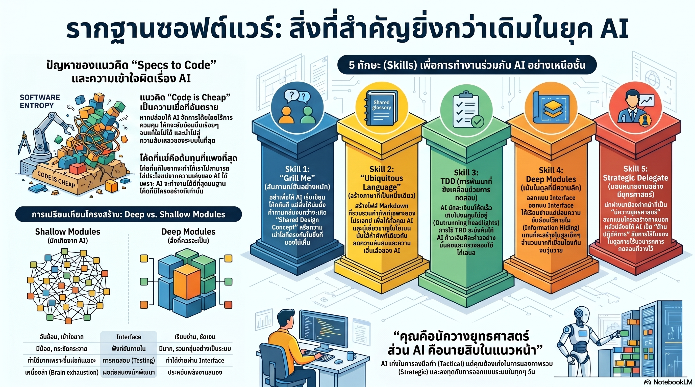

[กลับไปที่หน้าหลัก](../README.md)

ทำไม "พื้นฐาน" ถึงสำคัญกว่า "โค้ด": 5 บทเรียนที่นักพัฒนาต้องรู้ในยุค AI

ในยุคที่ AI สามารถเจนโค้ดได้รวดเร็วปานสายฟ้าแลบ นักพัฒนาหลายคนเริ่มเผชิญกับวิกฤตตัวตน (Identity Crisis) และความกังวลว่าทักษะที่สะสมมาจะกลายเป็นของล้าสมัย (Obsolescence) ความเชื่อที่ว่าเราสามารถเขียนเพียง Specification แล้วปล่อยให้ AI เสกโค้ดออกมาโดยไม่ต้องแตะต้องมันเลย หรือที่เรียกว่าแนวคิด "Specs to Code" กำลังเป็นเทรนด์ที่ดึงดูดใจ แต่นี่คือกับดักที่อันตรายที่สุด

Matt Pocock ผู้เชี่ยวชาญด้าน TypeScript และ AI Engineering ได้ออกมาเตือนสติว่า ยิ่งเราปล่อยให้ AI ทำงานโดยปราศจากความเข้าใจในพื้นฐาน โครงสร้างระบบจะเกิดการเสื่อมถอย (Degradation) จนกลายเป็นขยะในที่สุด บทความนี้จะถอดบทเรียนจากประสบการณ์ของ Matt เพื่อยืนยันว่า ในยุค AI นี้ "Software Fundamentals สำคัญกว่าที่เคยเป็นมา"

--------------------------------------------------------------------------------

บทเรียนที่ 1: "โค้ด" ไม่ได้ราคาถูก และ "โค้ดที่แย่" คือหนี้ที่แพงที่สุด

มีคำกล่าวที่ว่าในยุค AI "Code is cheap" เพราะเราจะสร้างมันเท่าไหร่ก็ได้ แต่ในความเป็นจริง "โค้ดไม่ใช่ของถูก" โดยเฉพาะอย่างยิ่งโค้ดที่ขาดการออกแบบที่ดี Matt ชี้ให้เห็นว่าการใช้ AI เจนโค้ดซ้ำไปซ้ำมาโดยไม่คุม Design จะทำให้เราเผชิญกับ Software Entropy (แนวคิดจากหนังสือ The Pragmatic Programmer) ซึ่งคือภาวะที่ระบบค่อยๆ พังทลายและซับซ้อนขึ้นจนควบคุมไม่ได้

หาก Codebase ของคุณเละ AI จะทำงานได้แย่ลงเรื่อยๆ แต่ในทางกลับกัน หากคุณลงทุนในโครงสร้างที่ดี คุณจะได้รับ "รางวัลมหาศาล" (The Bounty) เพราะ AI จะแสดงประสิทธิภาพสูงสุดเมื่อทำงานบน Codebase ที่มีคุณภาพ

"ผมไม่คิดว่าโค้ดนั้นราคาถูก อันที่จริง โค้ดที่แย่คือสิ่งที่แพงที่สุดเท่าที่เคยมีมา เพราะถ้าคุณมี Codebase ที่ยากต่อการเปลี่ยนแปลง คุณจะไม่สามารถรับผลประโยชน์มหาศาล (Bounty) ที่ AI มอบให้ได้เลย AI จะทำงานได้ดีเยี่ยมก็ต่อเมื่ออยู่ใน Codebase ที่ดีเท่านั้น" — Matt Pocock

--------------------------------------------------------------------------------

บทเรียนที่ 2: เทคนิค "Grill Me" — เข้าถึง Shared Design Concept ก่อนเริ่มงาน

ปัญหาใหญ่ที่นักพัฒนาเจอคือ AI ไม่ได้ทำในสิ่งที่ต้องการ นั่นเป็นเพราะขาด Design Concept ร่วมกัน (แนวคิดจากหนังสือ The Design of Design โดย Frederick P. Brooks) ซึ่งเป็นภาพร่างในใจที่มองไม่เห็นว่าเรากำลังจะสร้างอะไรกันแน่

เพื่อแก้ปัญหานี้ Matt ได้สร้างทักษะที่เรียกว่า "Grill Me" (ซึ่งมีคนกด Star ใน GitHub กว่า 13,000 stars) โดยแทนที่จะสั่งงานทันที ให้เราสั่ง AI ว่า: "จงสัมภาษณ์ฉันอย่างหนักหน่วงเกี่ยวกับแผนงานนี้ จนกว่าเราจะเข้าใจตรงกัน"

* เปลี่ยน AI เป็นคู่ปรับ (Adversary): AI จะยิงคำถามใส่คุณ 40, 60 หรือถึง 100 คำถามเพื่อหาจุดบอด
* สำรวจ Design Tree: บังคับให้ AI ไล่เรียงกิ่งก้านของการตัดสินใจ (Design Tree) และจัดการความสัมพันธ์ (Dependencies) ระหว่างการตัดสินใจแต่ละอย่างก่อนที่จะเริ่มเขียนโค้ดแม้แต่บรรทัดเดียว
* ดีกว่า Plan Mode: เทคนิคนี้ช่วยหยุดความใจร้อนของ AI ที่มักจะรีบสร้าง Asset หรือเขียนโค้ดทั้งที่ยังไม่เข้าใจความต้องการที่แท้จริง

--------------------------------------------------------------------------------

บทเรียนที่ 3: ใช้ Ubiquitous Language และอย่าขับรถเร็วกว่าไฟหน้า

บ่อยครั้งที่ AI พูดจาเยิ่นเย้อ (Verbose) หรือสื่อสารคนละทิศละทาง Matt จึงนำแนวคิด Ubiquitous Language จาก Domain-Driven Design (DDD) มาใช้ โดยการสร้างเครื่องมือที่ "สแกน" Codebase แล้วสรุปคำศัพท์เฉพาะ (Terminology) ออกมาเป็นไฟล์ Markdown

การมี Shared Language ช่วยให้ AI "คิด" ได้แม่นยำขึ้นและลด Cognitive Load ของทั้งคนและ AI ลง นอกจากนี้ Matt ยังเน้นย้ำถึงเรื่อง Feedback Loops เช่น การใช้ TypeScript, Static Analysis และ TDD (Test-Driven Development)

เขายกคำเตือนจากหนังสือ The Pragmatic Programmer ว่าอย่า "ขับรถเร็วกว่าไฟหน้า" (Outrunning your headlights)

* ความเร็วของ Feedback คือขีดจำกัดความเร็ว: หากคุณปล่อยให้ AI เจนโค้ดจำนวนมหาศาลโดยไม่รัน Test หรือเช็ก Type คุณกำลังขับรถในความมืดด้วยความเร็วสูง
* TDD คือเบรกที่ทำให้คุณไปได้ไกลขึ้น: การบังคับให้ AI เขียน Test ก่อน จะช่วยให้มันก้าวเดินอย่างระมัดระวังและคงคุณภาพของ Design ไว้ได้

--------------------------------------------------------------------------------

บทเรียนที่ 4: ออกแบบ Deep Modules และใช้ปรัชญา "Grey Box"

หนึ่งในเหตุผลที่ AI หลงทางใน Codebase คือโครงสร้างที่เต็มไปด้วยไฟล์เล็กๆ กระจัดกระจายที่เรียกว่า Shallow Modules (แนวคิดจากหนังสือ A Philosophy of Software Design โดย John Ousterhout) ซึ่งมีความซับซ้อนอยู่ที่ Interface ทำให้ AI สับสนในการเชื่อมต่อ

Matt แนะนำให้เราเปลี่ยนมาออกแบบเป็น Deep Modules:

* Deep Modules: ซ่อนความซับซ้อนมหาศาลไว้เบื้องหลัง Interface ที่เรียบง่าย
* กลยุทธ์ Grey Box: เราในฐานะนักพัฒนาต้องทำหน้าที่เป็น "นักยุทธศาสตร์" ออกแบบ Interface ให้แข็งแรงและชัดเจน (Strategic Design) แล้วปฏิบัติกับส่วน implementation ภายในเหมือนเป็น "กล่องสีเทา" ที่เรายอมให้ AI จัดการในระดับ Tactical ได้อย่างอิสระตราบเท่าที่มันผ่านการ Test ที่ Interface
* ผลลัพธ์: วิธีนี้ช่วยลดความล้าของสมองนักพัฒนา เพราะเราไม่ต้องคอยตรวจสอบโค้ดทุกบรรทัด แต่ตรวจสอบผ่านโครงสร้างและจุดเชื่อมต่อที่เราคุมไว้

--------------------------------------------------------------------------------

บทเรียนที่ 5: คุณคือ "นักยุทธศาสตร์" ไม่ใช่แค่ "จ่าทหารราบ"

ในโลกของ AI บทบาทของนักพัฒนาต้องยกระดับขึ้น Matt เปรียบเปรยอย่างคมคายว่า AI คือ "จ่าทหารราบ" (Tactical Sergeant) ที่เก่งกาจในการรบในสนาม (เขียน implementation) แต่สิ่งที่โปรเจกต์ต้องการเพื่อความอยู่รอดคือ "นักยุทธศาสตร์" (Strategist)

หน้าที่ของคุณคือการ "ลงทุนในการออกแบบระบบ" (Invest in Design) ทุกวันตามคำแนะนำของ Kent Beck ไม่ใช่ลดความสำคัญของมันลง

* คุณต้องมองภาพรวม (Scalability & Architecture)
* คุณต้องเป็นคนกำหนดขอบเขตของโมดูล
* คุณต้องเป็นคนที่หยุด AI ไม่ให้พาระบบวิ่งลงเหวด้วยความเร็วสูง

--------------------------------------------------------------------------------

บทสรุป: อาวุธที่ทรงพลังที่สุดในยุค AI

ความรู้พื้นฐานซอฟต์แวร์ที่เราสะสมมานาน ไม่ว่าจะเป็นเรื่อง Architecture, Design Patterns หรือ Clean Code ไม่ได้สูญเปล่า แต่มันกลับกลายเป็นอาวุธที่ทรงพลังที่สุดที่จะแยก "วิศวกรตัวจริง" ออกจาก "คนสั่ง prompt"

AI เป็นเครื่องทุ่นแรงที่ยอดเยี่ยม แต่มันต้องการ "วาทยากร" ที่เชี่ยวชาญมาควบคุมท่วงทำนองเพื่อให้ได้ซอฟต์แวร์ที่ยั่งยืนและมีคุณภาพ

ลองกลับไปสำรวจ Codebase ของคุณดูวันนี้ แล้วถามตัวเองว่า: "คุณกำลังขับรถเร็วกว่าไฟหน้าอยู่หรือเปล่า? และคุณกำลังลงทุนใน Design เพื่อรอรับรางวัล (Bounty) จาก AI หรือกำลังสร้างหนี้ที่แพงที่สุดทิ้งไว้ให้ตัวเองในอนาคต?"
