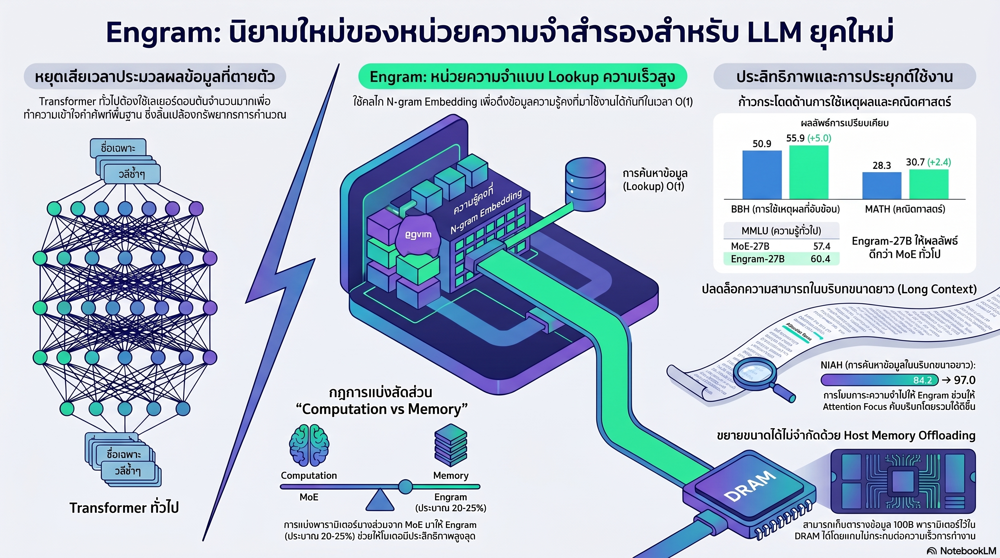

[กลับไปที่หน้าหลัก](../README.md)

สวัสดีครับเพื่อนๆ ที่ติดตามวงการ AI! วันนี้มาเรื่องที่ท้าทายสมมติฐานพื้นฐานที่สุดข้อหนึ่งของการสร้าง AI ว่า "โมเดลที่ดีต้องจำทุกอย่างไว้ใน Weights" และเสนอว่าบางทีการที่ AI ฉลาดขึ้นอาจต้องเริ่มจากการ "ปล่อยบางอย่างออกไป" แทนครับ

คุณเคยสังเกตไหมครับว่า เวลาเราต้องการรู้ว่าโตเกียวอยู่ประเทศอะไร เราไม่ได้ "คิด" แต่แค่ "เปิดหาในหัว" ทันที แต่ AI ในปัจจุบันกลับต้องใช้การคำนวณหลายชั้นเพื่อ "สร้างคำตอบ" ทุกครั้ง แม้ว่าคำตอบนั้นไม่เคยเปลี่ยนเลย?

คุณเคยสงสัยไหมครับว่า ทำไม AI ถึงต้องใช้พลังงานประมวลผลเท่ากันในการจำชื่อ "กรุงเทพมหานคร" กับการแก้โจทย์คณิตศาสตร์ขั้นสูง ทั้งที่ทั้งสองงานแตกต่างกันโดยสิ้นเชิงในเชิงธรรมชาติ?

และคุณรู้ไหมครับว่า มีสถาปัตยกรรมที่สามารถแยก "สมองส่วนจำ" ออกจาก "สมองส่วนคิด" ได้อย่างชัดเจน ทำให้ผลลัพธ์ด้านเหตุผลเพิ่มขึ้น +5 คะแนน และยังสามารถย้ายความจำ 100B พารามิเตอร์ออกจาก GPU โดยกระทบ Throughput น้อยกว่า 3% ได้ด้วย?

แนวคิดนี้ชื่อ Engram และมันกำลังท้าทายว่า "Sparsity" ในโมเดลขนาดใหญ่ไม่ได้มีแค่มิติเดียวอีกต่อไปครับ

========================================

🤔 ทบทวนความเชื่อเดิมๆ: สิ่งที่เราคิดเกี่ยวกับการสร้าง LLM ที่ดี

▪ "LLM ที่ฉลาดต้องมีพลังประมวลผลสูงในทุกขั้นตอน ทุก Token ต้องผ่านทุกเลเยอร์เท่าเทียมกัน" → Engram พิสูจน์ว่าข้อมูลสองประเภทต้องการการจัดการต่างกันโดยสิ้นเชิง ข้อมูลคงที่อย่างชื่อเฉพาะและวลีซ้ำๆ ควรถูกดึงออกด้วย O(1) Lookup ไม่ใช่การคำนวณหลายชั้นครับ

▪ "ความจำที่ดีต้องการพารามิเตอร์มากขึ้น ยิ่งใหญ่ยิ่งจำเก่ง" → Tokenizer Compression ของ Engram ลด Effective Vocabulary Size ได้ 23% โดยรวมคำที่มีความหมายเชิงแนวคิดเดียวกันเข้าด้วยกัน ทำให้ความหนาแน่นเชิงความหมายสูงขึ้นโดยใช้พื้นที่น้อยลงครับ

▪ "AI ที่จำเก่งขึ้นจะฉลาดขึ้นเฉพาะงานความรู้ ไม่ได้ช่วยเรื่องตรรกะ" → CKA Similarity Analysis พบว่า Layer 5 ของ Engram-27B มีความสามารถเทียบเท่า Layer 12 ของ MoE ปกติ หมายความว่า Engram ช่วยให้เลเยอร์ที่เหลือมีพื้นที่ "คิด" มากขึ้นถึง 7 เลเยอร์ ส่งผลให้คะแนน Reasoning พุ่งขึ้นด้วยครับ

▪ "โมเดลขนาดใหญ่ต้องการ GPU Memory มหาศาล เป็นข้อจำกัดที่หลีกเลี่ยงไม่ได้" → Engram สามารถโยกความจำ 100B พารามิเตอร์ไปไว้ที่ Host RAM ได้ โดยกระทบ Inference Throughput น้อยกว่า 3% เพราะใช้ Prefetching ที่อิงกับ Zipfian Distribution ของภาษาครับ

ความจริงที่น่าคิดคือ: ปัญหาไม่ใช่ว่า LLM จำไม่เก่ง แต่คือมันใช้กลไก "คิด" ในการ "จำ" ทั้งที่สองสิ่งนี้ไม่ควรทำงานด้วยเครื่องมือเดียวกันตั้งแต่ต้นครับ

========================================

🧠 พื้นฐานที่ต้องเข้าใจก่อน: Linguistic Duality, N-gram, MoE และ Sparsity

=== Linguistic Duality คืออะไร? ===

Linguistic Duality = คุณสมบัติของภาษาที่ประกอบด้วยข้อมูลสองประเภทที่ต้องการการจัดการต่างกัน

[ประเภทที่ 1: Compositional Reasoning]
▸ ต้องการการคำนวณลึกและยืดหยุ่น
▸ ตัวอย่าง: การแก้โจทย์คณิตศาสตร์, การวิเคราะห์บริบทซับซ้อน
▸ เหมาะกับ: Neural Network หลายชั้น

[ประเภทที่ 2: Knowledge Retrieval]
▸ ข้อมูลเป็น Local และ Static ไม่เปลี่ยนแปลง
▸ ตัวอย่าง: ชื่อเฉพาะ, วลีสำเร็จรูป, เอนทิตีคงที่
▸ เหมาะกับ: Lookup Table ที่เข้าถึงได้ทันที ไม่ต้องคำนวณครับ

=== N-gram และ O(1) Lookup คืออะไร? ===

N-gram = ลำดับของ N คำที่อยู่ติดกัน เช่น "กรุงเทพ-มหานคร-เป็น-เมืองหลวง" คือ 4-gram

O(1) Lookup = การเข้าถึงข้อมูลในเวลาคงที่ ไม่ว่าข้อมูลจะใหญ่แค่ไหน ใช้เวลาเท่าเดิมเสมอ ต่างจากการคำนวณผ่านหลายเลเยอร์ที่เวลาเพิ่มตามความลึก

เปรียบเทียบ: เหมือนพจนานุกรมที่มีสารบัญตามตัวอักษร เราไม่ต้องอ่านทุกหน้าตั้งแต่ต้น แค่เปิดไปยังหน้าที่ต้องการได้ทันที ไม่ว่าพจนานุกรมจะหนาแค่ไหนก็ใช้เวลาพอๆ กันครับ

=== MoE (Mixture of Experts) คืออะไร? ===

MoE = สถาปัตยกรรมที่ใช้เฉพาะ "ผู้เชี่ยวชาญ" บางส่วนในการประมวลผล Token แต่ละตัว แทนที่จะใช้ทุกพารามิเตอร์ ทำให้ประหยัดการคำนวณแต่ยังคงความสามารถสูง

Engram เป็น Sparsity แบบใหม่ที่ทำงานคู่ขนานกับ MoE โดย MoE จัดการ Reasoning ส่วน Engram จัดการ Memory ครับ

=== CKA Similarity คืออะไร? ===

CKA (Centered Kernel Alignment) Similarity = เครื่องมือวัดว่าเลเยอร์สองเลเยอร์ในโมเดลต่างกันมี "การทำงานแบบเดียวกัน" มากแค่ไหน

ถ้า Layer A ของโมเดล X มี CKA สูงกับ Layer B ของโมเดล Y แสดงว่าทั้งสองทำงานคล้ายกันในเชิงหน้าที่ แม้จะอยู่ในสถาปัตยกรรมต่างกันครับ

=== Zipfian Distribution ของภาษาคืออะไร? ===

Zipfian Distribution = กฎธรรมชาติของภาษาที่บอกว่าคำและวลีส่วนน้อยมากถูกใช้บ่อยมากที่สุด ในขณะที่คำส่วนใหญ่ถูกใช้น้อยมาก

เปรียบเทียบ: เหมือนร้านสะดวกซื้อที่รู้ว่าสินค้า 20% ขายได้ถึง 80% ของยอดขาย ทำให้เติมสต็อกสินค้าพวกนั้นก่อนได้อย่างแม่นยำโดยไม่ต้องรอให้ลูกค้าสั่ง ภาษาก็มีโครงสร้างแบบนี้ ทำให้ Engram รู้ล่วงหน้าว่า N-gram ไหนน่าจะถูกเรียกใช้บ่อยครับ

========================================

1️⃣ แยก "สมองส่วนจำ" ออกจาก "สมองส่วนคิด": ทำไม Linguistic Duality จึงสำคัญ

=== ปัญหาของ Transformer มาตรฐาน ===

Transformer ปกติถูกออกแบบให้ทุกอย่างผ่านกระบวนการคำนวณเหมือนกันหมด ไม่ว่าจะเป็นการจำชื่อเมือง หรือการวิเคราะห์นัยแฝงในประโยคซับซ้อน

ผลคือ AI ต้องเสียพลังประมวลผลมหาศาลไปกับงานที่ไม่ต้องการพลังเหล่านั้น เหมือนใช้เครื่องยนต์เจ็ตเพื่อขับรถออกจากบ้านไปซื้อของชำครับ

=== สิ่งที่ LogitLens เปิดเผย ===

จากการวิเคราะห์ด้วย LogitLens (เครื่องมือดูว่าแต่ละเลเยอร์ "เดา" คำต่อไปได้แม่นแค่ไหน) พบว่า

ในโมเดลที่ใช้ Engram เลเยอร์แรกๆ มีค่า KL Divergence ต่ำกว่าโมเดลปกติอย่างชัดเจน หมายความว่าการทำนายพร้อมใช้งานได้เร็วกว่า เพราะไม่ต้องเสียเวลา "สร้างข้อมูลพื้นฐานซ้ำๆ" ที่ควรจะรู้อยู่แล้วตั้งแต่ต้น

เปรียบเทียบ: เหมือนนักเรียนที่มีสรุปเนื้อหาพร้อมอยู่แล้ว ไม่ต้องเขียนโน้ตเองตั้งแต่ต้น จะมีเวลาเหลือสำหรับการวิเคราะห์เนื้อหาลึกๆ ได้มากกว่ามากครับ

========================================

2️⃣ สี่กลไกของ Engram: วิศวกรรมที่ทำงานร่วมกับฮาร์ดแวร์

=== กลไกที่ 1: Tokenizer Compression ===

Vocabulary Projection = รวมรหัสคำที่มีความหมายแนวคิดเดียวกันเข้าด้วยกัน

ผล: ลด Effective Vocabulary Size 23% จาก 128k Token เดิม ทำให้ตาราง Embedding เล็กลงและมีความหนาแน่นเชิงความหมายสูงขึ้น

เปรียบเทียบ: เหมือนห้องสมุดที่รวม "หนังสือ" กับ "หนังสือเล่ม" กับ "ตำรา" ให้อยู่ในหมวดเดียวกัน แทนที่จะมีชั้นแยกกัน 3 ชั้น ค้นหาเร็วกว่าและประหยัดพื้นที่ครับ

=== กลไกที่ 2: Multi-Head Hashing ===

Deterministic Hashing แบบ Multiplicative-XOR หลายหัว = สร้างรหัสค้นหาหลายชุดพร้อมกัน เพื่อเข้าถึงตาราง Embedding ขนาดใหญ่

ประโยชน์: ลดโอกาสข้อมูลชนกัน (Collision) ซึ่งเกิดขึ้นเมื่อคำสองคำต่างกันแต่ได้รหัสค้นหาเดียวกัน

เปรียบเทียบ: เหมือนระบบค้นหาห้องสมุดที่มีดัชนีหลายแบบพร้อมกัน ทั้งชื่อหนังสือ ผู้แต่ง และหมวดหมู่ ถ้าค้นชื่อเดียวกันไม่เจอ ยังมีดัชนีอื่นสำรองอยู่ครับ

=== กลไกที่ 3: Context-aware Gating ===

Gate = ระบบที่ใช้ Hidden State ปัจจุบันตัดสินใจว่าควรเชื่อ "ความจำคงที่จาก Engram" หรือ "บริบทใหม่จาก Context"

ทำไมต้องมี: ภาษามีคำที่ความหมายเปลี่ยนตามบริบท (Polysemy) เช่น "ธนาคาร" อาจหมายถึงสถาบันการเงินหรือขอบแม่น้ำ ถ้า Engram ยึดความหมายเดิมตายตัวโดยไม่สนบริบทจะเกิดข้อผิดพลาด

เมื่อความจำที่ดึงมาขัดแย้งกับบริบทปัจจุบัน Gate จะ Suppress ค่านั้นให้เป็นศูนย์ทันที

เปรียบเทียบ: เหมือนบรรณารักษ์ที่รู้ว่าเมื่อไหรควรเชื่อป้ายบนชั้น และเมื่อไหรควรฟังลูกค้าที่บอกว่า "หนังสือเล่มนั้นถูกย้ายไปแล้ว" ครับ

=== กลไกที่ 4: Multi-branch Parameter Sharing ===

กลยุทธ์การแชร์พารามิเตอร์อย่างชาญฉลาด

[แชร์ร่วมกัน]: ตาราง Embedding และ Value Projection ใช้ร่วมกันทุกกิ่ง ประหยัดพารามิเตอร์
[แยกกัน]: Key Projection แยกกันแต่ละกิ่ง ทำให้ Gating มีความจำเพาะเจาะจงสูง

ผล: การคำนวณบน FP8 (รูปแบบตัวเลขที่ประหยัดหน่วยความจำ) มีประสิทธิภาพสูงสุด เหมาะกับ Hardware สมัยใหม่ครับ

========================================

3️⃣ กฎรูปตัว U: วิทยาศาสตร์ของการจัดสรรระหว่าง "ความจำ" กับ "การคิด"

=== โจทย์ที่ต้องแก้ ===

เมื่อมีพารามิเตอร์จำนวนหนึ่ง (Iso-parameter) และงบ FLOPs คงที่ (Iso-FLOPs) ควรแบ่งสัดส่วนระหว่าง MoE (การคิด) กับ Engram (ความจำ) อย่างไรให้ได้ผลลัพธ์ดีที่สุด?

นี่คือคำถามที่ไม่มีคนถามมาก่อน เพราะก่อนหน้านี้ไม่มีสถาปัตยกรรมที่แยกสองส่วนนี้ออกจากกันชัดเจนครับ

=== U-shaped Scaling Law ===

ผลการทดสอบออกมาเป็นรูปตัว U ชัดเจน

[MoE-dominated: Engram น้อยเกินไป]
▸ AI ต้องสร้างความจำใหม่ผ่านการคำนวณลึกตลอดเวลา
▸ เสียพลังงานมาก ผลลัพธ์ไม่ดีเท่าที่ควร

[จุด Optimum: Engram ประมาณ 20-25% ของ Inactive Parameters]
▸ ความสมดุลระหว่างความจำและการคิด
▸ ผลลัพธ์สูงสุดในทุก Benchmark

[Engram-dominated: Engram มากเกินไป]
▸ AI จำแม่นมากแต่ขาดพลังประมวลผลสำหรับเหตุผลที่ยืดหยุ่น
▸ ผลลัพธ์ตกลงอีกครั้ง

เปรียบเทียบ: เหมือนทีมงานที่มีคนจำ (เลขานุการ) และคนคิด (นักวิเคราะห์) ถ้ามีเลขานุการมากเกินไปก็ไม่มีคนวิเคราะห์ ถ้ามีนักวิเคราะห์มากเกินไปก็ไม่มีใครจดบันทึกให้ถูกต้อง จุดสมดุลอยู่ที่ประมาณหนึ่งในสี่ของทีมเป็นเลขานุการครับ

========================================

4️⃣ ผลลัพธ์ที่พิสูจน์ว่าจำเก่งขึ้นทำให้คิดเก่งขึ้นด้วย

=== ผลบน Benchmark หลัก ===

[General Reasoning — BBH]
▸ Engram-27B เทียบ MoE ปกติขนาดเดียวกัน: +5.0 คะแนน

[Mathematics — MATH]
▸ +2.4 คะแนน

[Coding — HumanEval]
▸ +3.0 คะแนน

สิ่งสำคัญคือนี่ไม่ใช่ Benchmark ด้าน Factual Knowledge ที่ "น่าจะ" ได้ประโยชน์จากความจำที่ดีขึ้น แต่เป็น Benchmark ด้าน Reasoning ล้วนๆ ที่ Engram ไม่ได้ถูกออกแบบมาสำหรับโดยตรงครับ

=== ทำไมการจำที่ดีขึ้นจึงทำให้คิดดีขึ้น? ===

CKA Similarity Map เปิดเผยว่า Layer 5 ของ Engram-27B มีความสามารถเทียบเท่า Layer 12 ของ MoE ปกติในเชิงหน้าที่

หมายความว่า Engram "ดูดซับ" งานที่เลเยอร์แรกๆ เคยต้องทำ (Static Reconstruction) ออกไป ทำให้เลเยอร์ 6-12 ที่เหลือมีพื้นที่เต็มๆ สำหรับการ Reasoning ขั้นสูง

[โมเดลปกติ]: Layer 1-12 ทำทั้งงานจำและงานคิดสลับกัน
[Engram]: Layer 1-5 ทำงานจำ → Layer 6-27 มีอิสระเต็มที่สำหรับงานคิดครับ

=== Long Context: NIAH จาก 84.2 เป็น 97.0 ===

Multi-Query NIAH (Needle in a Haystack) คือการทดสอบว่า AI หาข้อมูลเฉพาะจุดใน Context ยาวมากได้แม่นแค่ไหน

Engram ช่วยจัดการ Local Dependencies (ความสัมพันธ์ของคำในระดับใกล้ๆ) ออกไป ทำให้ Attention Heads ทั้งหมดมีอิสระมุ่งเน้นไปที่ Global Context ได้เต็มที่

เปรียบเทียบ: เหมือนพนักงานค้นหาข้อมูลที่มีผู้ช่วยจัดการรายละเอียดเล็กๆ น้อยๆ ออกไป พนักงานหลักจะมีสมาธิกับการหาสิ่งสำคัญในเอกสารยาวหลายพันหน้าได้ดีขึ้นมากครับ

========================================

5️⃣ ทลายกำแพง HBM: เมื่อความจำยักษ์ไม่จำเป็นต้องอยู่บน GPU

=== ปัญหาของ HBM Wall ===

HBM (High Bandwidth Memory) คือหน่วยความจำบน GPU ที่เร็วมากแต่ราคาสูงและมีขนาดจำกัด เป็นอุปสรรคใหญ่ที่สุดของโมเดลขนาดยักษ์ในปัจจุบัน

โมเดลที่ใหญ่ขึ้นต้องการ GPU มากขึ้น ซึ่งแพงขึ้นแบบทวีคูณครับ

=== Engram แก้ปัญหานี้อย่างไร? ===

เนื่องจาก N-gram Lookup ของ Engram เป็น Deterministic (รู้ล่วงหน้าได้จาก Input Token โดยตรง ไม่ต้องรอผลการคำนวณ) ระบบจึงสามารถ Prefetch ข้อมูลที่จะต้องใช้มาจาก Host RAM ล่วงหน้าได้ก่อนที่ GPU จะต้องการ

[MoE Routing]: ต้องรู้ Hidden State ก่อนถึงจะรู้ว่าต้องใช้ Expert ไหน → ดึงจาก Host RAM ล่วงหน้าไม่ได้
[Engram]: รู้ตั้งแต่เห็น Input Token ว่าต้องใช้ N-gram ไหน → ดึงมาไว้รอได้เลยครับ

=== ตัวเลขที่น่าประทับใจ ===

▸ ย้ายความจำ Engram 100B พารามิเตอร์ไปไว้ที่ Host RAM: กระทบ Throughput น้อยกว่า 3%
▸ เหตุผลที่ทำได้: Zipfian Distribution ของภาษาทำให้ N-gram ที่ถูกใช้บ่อยสุดมีจำนวนน้อยมาก สามารถ Cache ส่วนนั้นไว้ใน GPU ได้ ส่วนที่เหลือค่อย Prefetch จาก Host RAM

เปรียบเทียบ: เหมือนออฟฟิศที่วางเอกสารที่ใช้ทุกวันบนโต๊ะทำงาน (GPU) ส่วนเอกสารที่ใช้นานๆ ครั้งเก็บไว้ในตู้เก็บของ (Host RAM) และมีเลขานุการวิ่งเอามาให้ก่อนที่จะต้องใช้จริง ทั้งโต๊ะกว้างขึ้น ต้นทุนลดลง และทำงานได้เร็วเกือบเท่าเดิมครับ

========================================

🎯 สรุป: 4 บทเรียนจาก Engram

▸ ภาษามีสองธรรมชาติและควรจัดการด้วยสองเครื่องมือ: Compositional Reasoning ต้องการ Compute ลึก Knowledge Retrieval ต้องการ O(1) Lookup การบังคับให้ทั้งสองใช้เครื่องมือเดียวกันคือต้นตอของความสูญเปล่าที่แท้จริง

▸ ความจำที่ดีขึ้นเป็นของขวัญให้กับการคิดด้วย: เมื่อเลเยอร์แรกๆ ไม่ต้องทำงาน Static Reconstruction อีกต่อไป เลเยอร์ที่เหลือจะมีพื้นที่สำหรับ Reasoning มากขึ้น ทำให้คะแนนด้านตรรกะและคณิตศาสตร์เพิ่มขึ้นโดยไม่ได้ตั้งใจ

▸ U-shaped Scaling Law บอกว่ามีจุดสมดุลที่วัดได้: การออกแบบ AI ในอนาคตไม่ใช่แค่ "ใหญ่ขึ้น" แต่คือ "จัดสรรสัดส่วนให้ถูก" จุด Optimum ที่ 20-25% ของ Inactive Parameters ให้กับ Engram คือค่าที่สามารถนำไปใช้เป็น Design Principle ได้จริงครับ

▸ Infrastructure-aware Design ทลายกำแพงต้นทุนได้โดยไม่ต้องเสียประสิทธิภาพ: การที่ Engram ใช้ประโยชน์จาก Deterministic Access Pattern และ Zipfian Distribution ทำให้โยก 100B พารามิเตอร์ออกจาก GPU ได้โดยแทบไม่รู้สึก นี่คือทิศทางใหม่ของ Green AI ที่ใช้ฮาร์ดแวร์อย่างชาญฉลาดมากขึ้น

หลักการสำคัญ: "AI ที่ฉลาดขึ้นในอนาคตอาจไม่ใช่ AI ที่ใหญ่ขึ้นหรือประมวลผลมากขึ้น แต่คือ AI ที่รู้ว่าเมื่อไหร่ควร 'คิด' และเมื่อไหร่ควร 'เปิดหา' และทำทั้งสองอย่างได้ด้วยเครื่องมือที่เหมาะสมกับมันจริงๆ" ครับ

========================================

💬 คำถามท้ายทาย

1. Engram แยก "สมองส่วนจำ" กับ "สมองส่วนคิด" ออกจากกันในระดับสถาปัตยกรรม แต่ในสมองมนุษย์ความจำและการคิดพัวพันกันอย่างซับซ้อน บางทีการจำบางอย่างทำให้เราคิดต่างออกไป ถ้า AI แยกสองส่วนนี้ออกอย่างเด็ดขาด มันจะพลาดรูปแบบการเรียนรู้บางอย่างที่ต้องการให้ความจำและการคิด "คุยกัน" ตลอดเวลาไหมครับ?

2. U-shaped Scaling Law บอกว่าจุด Optimum อยู่ที่ Engram ประมาณ 20-25% แต่ค่านี้วัดจาก Benchmark ปัจจุบัน ถ้า Task ที่เราต้องการเปลี่ยนไป เช่น งานสร้างสรรค์ที่ต้องการ Compositional Reasoning มากกว่า หรืองาน Factual QA ที่ต้องการ Knowledge Retrieval มากกว่า จุด Optimum จะขยับตามไหม และเราควรออกแบบ Engram ให้ปรับสัดส่วนได้แบบ Dynamic ได้ไหมครับ?

3. Prefetching ของ Engram ทำงานได้ดีเพราะ Zipfian Distribution ทำให้รู้ล่วงหน้าว่าต้องดึงข้อมูลอะไร แต่ในภาษาที่ Zipfian Distribution ไม่ชัดเจน หรือในโดเมนเฉพาะทางที่มีคำศัพท์กระจายตัวสม่ำเสมอกว่าภาษาทั่วไป (เช่น โค้ดโปรแกรม หรือสูตรทางวิทยาศาสตร์) ประสิทธิภาพของ Engram จะลดลงแค่ไหนครับ?

4. ถ้าในอนาคต Engram หรือสถาปัตยกรรมแบบนี้พัฒนาจนสามารถเชื่อมต่อกับฐานความรู้ภายนอกแบบ Real-time ได้ (เช่น Wikipedia หรือฐานข้อมูลวิทยาศาสตร์) เราจำเป็นต้อง "เทรนความรู้" เข้าไปใน Weights ของโมเดลอีกต่อไปไหมครับ หรือในอนาคตเราจะเทรนเฉพาะ "วิธีคิด" แล้วปล่อยให้ความรู้มาจากระบบ Lookup ภายนอกทั้งหมด?

========================================

References:
▸ Engram — สถาปัตยกรรม Conditional Memory Module ที่แยก Knowledge Retrieval ออกจาก Compositional Reasoning
▸ Linguistic Duality — แนวคิดที่ภาษาประกอบด้วย Compositional Reasoning + Knowledge Retrieval สองส่วนที่ต้องการการจัดการต่างกัน
▸ Tokenizer Compression — Vocabulary Projection ลด Effective Vocabulary Size 23% โดยรวมคำที่มีความหมายเชิงแนวคิดเดียวกัน
▸ Multi-Head Hashing (Multiplicative-XOR) — กลไก Deterministic Hashing เพื่อลด Collision ในการเข้าถึง Embedding Table
▸ Context-aware Gating — ระบบตัดสินใจระหว่าง Static Memory กับ Dynamic Context โดยใช้ Hidden State ปัจจุบัน
▸ U-shaped Scaling Law — กฎที่พบว่า Optimum Engram Allocation อยู่ที่ 20-25% ของ Inactive Parameters
▸ CKA Similarity Analysis — Layer 5 ของ Engram-27B มีความสามารถเทียบเท่า Layer 12 ของ MoE ปกติ
▸ Multi-Query NIAH — Long Context Benchmark จาก 84.2 → 97.0
▸ Infrastructure-aware Prefetching — ย้ายความจำ 100B พารามิเตอร์ไปไว้ที่ Host RAM โดยกระทบ Throughput น้อยกว่า 3%
▸ Zipfian Distribution — คุณสมบัติของภาษาที่ทำให้ Prefetching มีประสิทธิภาพสูง

ในวันที่เราพิสูจน์แล้วว่า AI สามารถ "เปิดหา" แทน "นึกขึ้นมา" ได้สำหรับข้อมูลที่ไม่จำเป็นต้องคำนวณ คำถามที่ตามมาคือ เส้นแบ่งระหว่าง "สิ่งที่ควรจำ" กับ "สิ่งที่ควรคิด" จะเปลี่ยนไปอย่างไรเมื่อ AI ฉลาดขึ้น และในวันที่ความจำไม่มีขีดจำกัดอีกต่อไป สิ่งที่ทำให้ AI ต่างจากฐานข้อมูลยักษ์จะเหลืออะไรครับ ⚡

#Engram #LLM #LinguisticDuality #KnowledgeRetrieval #MoE #SparsityScaling #GreenAI #AIResearch #AIThailand #ปัญญาประดิษฐ์ #MachineLearning #FunctionalDepth #HBM #InfrastructureAI
