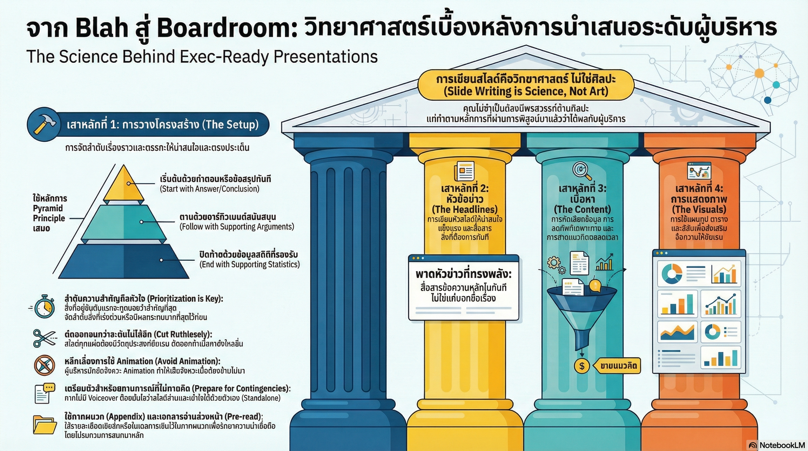

[กลับไปที่หน้าหลัก](../README.md)

สวัสดีครับเพื่อนๆ! วันนี้เรามาคุยเรื่องที่สำคัญมากสำหรับคนทำงาน นั่นก็คือ "การทำสไลด์นำเสนอให้ผู้บริหาร"!

คุณเคยเจอไหมครับว่า ทำงานหนักมาก เตรียมข้อมูลมาเต็มที่ แต่พอเสนอผู้บริหาร กลับไม่ได้รับการตอบรับที่ดี? หรือถูกตั้งคำถามว่า "แล้วมันคืออะไร?" "So what?"

ปัญหาไม่ใช่ที่ข้อมูลไม่ดี แต่เป็นที่สไลด์ของเราอยู่ในสถานะ "Unserviceable" หรือ "ใช้งานไม่ได้จริง" ในสายตาผู้บริหาร!

Herng นักยุทธศาสตร์จาก Google ผู้มีประสบการณ์กว่าทศวรรษในการนำเสนอระดับนำ บอกว่า "การทำสไลด์ให้ทรงพลังนั้นไม่ใช่ศิลปะ แต่มันคือวิทยาศาสตร์"!

มันคือ "วิศวกรรมการโน้มน้าวใจ" (Influence Engineering) ที่ฝึกฝนได้ ถ้ามี Playbook ที่ถูกต้อง!

วันนี้เรามาดู 6 หลักการสำคัญในการทำสไลด์ระดับ Boardroom กันครับ

========================================

🤔 ทบทวนปัญหาเดิมๆ: ทำไมสไลด์เราถึงไม่ได้ผล?

ก่อนที่เราจะไปดูหลักการ มาทำความเข้าใจปัญหาก่อนนะครับ

=== สไลด์ "Unserviceable" คืออะไร? ===

Unserviceable = ใช้งานไม่ได้จริง ในสายตาผู้บริหาร

ลักษณะของสไลด์ที่ Unserviceable:
▸ ข้อมูลเยอะแต่ไม่รู้ว่าจะให้ตัดสินใจอะไร
▸ เล่าเรื่องยาว แต่ไม่รู้ว่าสรุปคืออะไร
▸ มีตัวเลขเต็มไปหมด แต่ไม่รู้ว่าหมายถึงอะไร
▸ ใช้เวลานาน แต่ไม่ได้สาระ

=== ทำไมถึงเป็นแบบนี้? ===

ปัญหาหลักๆ:

[เล่าเรื่องตามลำดับความคิดของตัวเอง]
▸ เริ่มจากข้อมูล → วิเคราะห์ → สรุป
▸ ผู้บริหารต้องรอฟังจนจบถึงจะรู้ว่าคุณอยากบอกอะไร
▸ เสียเวลามาก

[ข้อมูลเยอะเกินไป]
▸ ใส่ข้อมูลทุกอย่างที่มี
▸ กลัวว่าจะขาดตกบกพร่อง
▸ แต่ผู้บริหารไม่มีเวลาอ่านทั้งหมด

[ไม่มี Call-to-action]
▸ แค่บอกข้อมูล แต่ไม่บอกว่าต้องการอะไร
▸ ผู้บริหารไม่รู้ว่าต้องทำอะไร

นี่คือปัญหาที่เราจะมาแก้กันครับ!

========================================

1. 📐 Pyramid Principle: พลิกโครงสร้างการนำเสนอ

หลักการแรกและสำคัญที่สุดคือ Pyramid Principle ของ Barbara Minto

=== ปัญหาของการนำเสนอแบบเดิม ===

[วิธีแบบเดิม: Bottom-up]

ลำดับการนำเสนอ:
1. ข้อมูล (Data)
2. การวิเคราะห์ (Analysis)
3. ข้อสรุป (Conclusion)

ปัญหา:
▸ ผู้บริหารต้องรอฟังจนจบถึงจะรู้ว่าคุณอยากบอกอะไร
▸ เสียเวลามาก
▸ ผู้บริหารอาจจะเบื่อก่อนถึงตอนสรุป

ตัวอย่าง:
"เราทำการวิจัยตลาดในไตรมาส 1... พบว่าลูกค้า 65% ต้องการ... เมื่อเปรียบเทียบกับคู่แข่ง... วิเคราะห์แล้วพบว่า... ดังนั้นเราควรจะ..."

ผู้บริหารคิด: "แล้วมันคืออะไรกันแน่?"

=== Pyramid Principle: Top-down ===

[วิธีใหม่: Top-down]

โครงสร้างแบบพีระมิด:

ยอด (Top): คำตอบหรือข้อสรุป
▸ บอกทันทีว่าคุณอยากสื่ออะไร
▸ ผู้บริหารรู้ทันทีว่าเรื่องคืออะไร

กลาง (Middle): เหตุผลหลัก
▸ เหตุผล 2-3 ข้อที่สนับสนุนข้อสรุป
▸ ทำไมถึงสรุปแบบนั้น

ฐาน (Bottom): ข้อมูลรองรับ
▸ ข้อมูลดิบ ข้อเท็จจริง
▸ ใช้รองรับความเชื่อถือ

ตัวอย่างเดียวกัน แบบ Top-down:
"เราควรเปิดตัวผลิตภัณฑ์ใหม่ในไตรมาส 3 เพราะ:
1. ลูกค้า 65% ต้องการฟีเจอร์นี้
2. คู่แข่งยังไม่มีใครทำ
3. เราคาดว่าจะได้กำไร 30%"

ผู้บริหารรู้ทันทีว่า: "อ๋อ อยากให้เปิดตัวผลิตภัณฑ์ใหม่"

=== หลักการสำคัญ ===

"คุณคิดจากล่างขึ้นบน (Bottom up) แต่คุณต้องนำเสนอจากบนลงล่าง (Top down)" — Barbara Minto

กระบวนการทำงาน:

ขั้นที่ 1: คุณคิดแบบ Bottom-up
▸ รวบรวมข้อมูล
▸ วิเคราะห์
▸ หาข้อสรุป

ขั้นที่ 2: คุณนำเสนอแบบ Top-down
▸ บอกข้อสรุปก่อน
▸ แล้วค่อยอธิบายเหตุผล
▸ แล้วค่อยแสดงข้อมูล

ประโยชน์:
▸ ผู้บริหารรู้ทันทีว่าคุณอยากบอกอะไร
▸ ประหยัดเวลา
▸ ผู้บริหารใช้เวลาที่เหลือพิจารณาว่าเห็นด้วยหรือไม่

========================================

2. 🔢 Ordering Matters: ลำดับคือการส่งสัญญาณ

หลักการที่สองคือ การจัดลำดับข้อมูลสำคัญมาก!

=== ทำไมลำดับถึงสำคัญ? ===

สมองของผู้บริหารทำงานแบบนี้:
▸ สิ่งที่อยู่อันดับที่ 1 = สำคัญที่สุด
▸ สิ่งที่อยู่อันดับที่ 2 = สำคัญรองลงมา
▸ สิ่งที่อยู่อันดับที่ 3 = สำคัญน้อยที่สุด

ดังนั้น การจัดลำดับคือการบอกว่าอะไรสำคัญที่สุด!

=== กรณีศึกษา: Project Armadillo ===

สมมติคุณต้องการขอการสนับสนุนจากผู้บริหารสำหรับโปรเจกต์ใหม่

[ลำดับที่แย่]

1. การขออนุมัติประชุมรายเดือน
2. ผลการศึกษาผู้ใช้
3. การโยกงบประมาณ 30% จาก Project Sunshine

ปัญหา:
▸ ข้อ 1 ไม่สำคัญเลย แต่อยู่อันดับแรก
▸ ข้อ 3 สำคัญที่สุด แต่อยู่อันดับสุดท้าย
▸ ผู้บริหารอาจจะไม่อ่านถึงข้อ 3

[ลำดับที่ถูกต้อง]

1. โยกงบประมาณ 30% จาก Project Sunshine
2. ผลการศึกษาผู้ใช้ในไตรมาส 2
3. การขอจัดตั้งเวทีประชุมติดตามผลรายเดือน

ทำไมดีกว่า:
▸ ข้อ 1 คือสิ่งที่สำคัญที่สุด อยู่อันดับแรก
▸ ผู้บริหารรู้ทันทีว่าคุณต้องการอะไร
▸ เหตุผลรองรับตามมา

=== กฎสำคัญ ===

อย่าบอกผู้บริหารว่า "จริงๆ แล้วข้อ 3 สำคัญกว่าข้อ 1 นะครับ"

ถ้าคุณต้องบอกแบบนี้:
▸ คุณได้แสดงความไม่เป็นมืออาชีพแล้ว
▸ ทำลายความน่าเชื่อถือของคุณ
▸ ผู้บริหารจะไม่ไว้ใจคุณ

วิธีที่ถูก: จัดลำดับให้ถูกต้องตั้งแต่แรก!

========================================

3. ✂️ Cut Until You Can't: ตัดจนไม่เหลืออะไรให้ตัด

หลักการที่สามคือ การตัดทิ้งสิ่งที่ไม่จำเป็น!

=== Lazy Slides คืออะไร? ===

Lazy Slides = สไลด์ที่ไม่มีประสิทธิภาพ ที่คุณทำแบบขี้เกียจ

ลักษณะ:
▸ ใส่ข้อมูลทุกอย่างที่มี
▸ ไม่ได้คัดกรอง
▸ คิดว่ายิ่งเยอะยิ่งดี

ปัญหา:
▸ เสียเวลาผู้บริหาร
▸ ผู้บริหารไม่รู้ว่าอะไรสำคัญ
▸ สับสน

=== Opportunity Cost ===

Lazy Slides มีราคาที่ต้องจ่ายสูงมาก นั่นคือ "Opportunity Cost" หรือค่าเสียโอกาส

หมายถึง:
▸ เวลาที่ผู้บริหารต้องเสียไปกับสไลด์ที่ไม่มีประโยชน์
▸ เวลานั้นสามารถใช้ทำอย่างอื่นที่มีคุณค่ากว่าได้

ตัวอย่าง:
▸ ผู้บริหารมีเวลา 30 นาที
▸ คุณใช้ 10 นาทีกับสไลด์ที่ไม่จำเป็น
▸ เหลือเวลาแค่ 20 นาทีสำหรับเรื่องสำคัญ
▸ คุณขโมยเวลา 10 นาทีของผู้บริหารไป!

=== แบบทดสอบความแกร่งของสไลด์ ===

สำหรับทุกสไลด์ ถามตัวเองว่า:

"ถ้าเอาสไลด์นี้ออก เนื้อหาโดยรวมจะพังไหม? หรือน้ำหนักการโน้มน้าวใจจะหายไปไหม?"

ถ้าคำตอบคือ "ไม่พัง":
▸ ลบมันทิ้งทันที!
▸ หรือย้ายไปไว้ที่ภาคผนวก (Appendix)

การรักษาความกระชับคือการแสดงความเคารพต่อเวลาของผู้บริหาร!

=== ตัวอย่างการตัดทิ้ง ===

[ก่อนตัด]
▸ สไลด์ที่ 1: ประวัติบริษัท
▸ สไลด์ที่ 2: ทีมงาน
▸ สไลด์ที่ 3: ข้อมูลตลาด
▸ สไลด์ที่ 4: การวิเคราะห์
▸ สไลด์ที่ 5: ข้อเสนอ
▸ สไลด์ที่ 6: งบประมาณ
▸ สไลด์ที่ 7: ไทม์ไลน์

รวม 7 สไลด์

[หลังตัด]
▸ สไลด์ที่ 1: ข้อเสนอ + งบประมาณ + ไทม์ไลน์
▸ สไลด์ที่ 2: เหตุผลหลัก 3 ข้อ
▸ สไลด์ที่ 3: ข้อมูลรองรับ

รวม 3 สไลด์

ภาคผนวก:
▸ ประวัติบริษัท
▸ ทีมงาน
▸ ข้อมูลตลาดโดยละเอียด

ผลลัพธ์:
▸ ประหยัดเวลา
▸ ชัดเจนขึ้น
▸ ผู้บริหารมีเวลาถามคำถามมากขึ้น

========================================

4. 🚫 กำจัด Animation: รักษาอำนาจในการควบคุม

หลักการที่สี่คือ อย่าใช้ Animation ในห้องประชุมผู้บริหาร!

=== ทำไมต้องกำจัด Animation? ===

เหตุผลหลัก: คุณไม่มีวันควบคุมกระแส (Flow) ได้ 100%

สิ่งที่เกิดขึ้นในห้องประชุม:
▸ ผู้บริหารจะขัดจังหวะด้วยคำถามได้ทุกเมื่อ
▸ คำถามอาจจะข้ามไปยังประเด็นถัดไป
▸ คุณต้องกระโดดไปสไลด์ที่เขาถาม

ถ้ามี Animation:
▸ คุณติดอยู่กับ Animation ที่ต้องคลิกหลายครั้ง
▸ คุณเริ่ม "คลิกอย่างลนลาน" (Frantic clicking) เพื่อหาหน้าที่ต้องการ
▸ ดูไม่มั่นใจ ไม่เป็นมืออาชีพ

=== ผลกระทบเชิงจิตวิทยา ===

เมื่อคุณคลิกอย่างลนลาน:
▸ ทำลายภาพลักษณ์ความมั่นใจ
▸ ทำลายอำนาจ (Authority) ของผู้นำเสนอ
▸ ผู้บริหารเริ่มสงสัยว่าคุณเตรียมตัวมาดีหรือเปล่า

ตัวอย่างสถานการณ์:

[มี Animation]
ผู้บริหาร: "ข้ามไปสไลด์งบประมาณหน่อย"
คุณ: [คลิก คลิก คลิก... อ่า ยังไม่ใช่ คลิก คลิก...]
ผู้บริหารคิด: "ไอ้นี่ไม่เตรียมตัวมาเลยหรือไง?"

[ไม่มี Animation]
ผู้บริหาร: "ข้ามไปสไลด์งบประมาณหน่อย"
คุณ: [กดปุ่มลูกศรหรือพิมพ์เลขสไลด์] → ไปถึงทันที
ผู้บริหารคิด: "โอ้ เตรียมตัวมาดีนี่"

=== ข้อยกเว้น ===

ใช้ Animation ได้เมื่อ:
▸ เป็นการนำเสนอทางเดียว (Unilateral Presentation)
▸ เช่น งาน Townhall ที่ไม่มีคนขัดจังหวะ
▸ คุณควบคุม Flow ได้ 100%

แต่ในห้องประชุมผู้บริหาร: ห้ามใช้!

========================================

5. 💼 Always Be Selling: ทุกวินาทีคือการขาย

หลักการที่ห้าคือ เป้าหมายของการนำเสนอคือการโน้มน้าว ไม่ใช่แค่อัปเดต!

=== Update vs. Selling ===

[Pure Update] ← แค่บอกข้อมูล

ตัวอย่าง:
"เราทำยอดขายเติบโต 15% ในปีนี้"

ปัญหา:
▸ แค่บอกตัวเลข
▸ ไม่มี Call-to-action
▸ ผู้บริหารคิด "แล้วไง? So what?"

[Selling] ← โน้มน้าวด้วยบริบท

ตัวอย่าง:
"เราทำยอดขายเติบโต 15% ด้วยประสิทธิภาพสูงสุด เมื่อเทียบกับค่าเฉลี่ยตลาดที่ 8%"

ข้อดี:
▸ มีบริบท (เทียบกับตลาด)
▸ เน้น "ประสิทธิภาพ" (Efficiency)
▸ สร้างภาพลักษณ์เชิงบวก

[Strategic Nuance] ← ขายเชิงกลยุทธ์

การเน้นเรื่อง "Efficiency" ไม่ได้เป็นแค่คำชมตัวเอง แต่เป็น:
▸ การสร้างภาพลักษณ์เชิงบวกของธุรกิจ
▸ ปูทางสู่การขอทรัพยากรหรือเงินลงทุนในอนาคต

ตัวอย่างประโยคต่อ:
"ดังนั้น ถ้าเราได้รับงบประมาณเพิ่มอีก 20% เราคาดว่าจะสามารถเติบโตได้ 30% ในปีหน้า"

เห็นไหมครับ? เริ่มจาก "ขาย" ประสิทธิภาพ แล้วต่อด้วย "ขอ" งบประมาณ!

=== So What? Test ===

ทุกสไลด์ต้องตอบคำถาม "So what?" ได้

คำถาม "So what?" หมายถึง:
▸ แล้วไง?
▸ ผมต้องทำอะไร?
▸ มันสำคัญยังไง?

ถ้าสไลด์คุณตอบไม่ได้:
▸ ลบมันทิ้ง
▸ หรือเพิ่ม Call-to-action

ตัวอย่าง:

[ไม่ผ่าน So What Test]
"ลูกค้า 65% ชอบสีน้ำเงิน"
→ ผู้บริหารคิด: "แล้วไง?"

[ผ่าน So What Test]
"ลูกค้า 65% ชอบสีน้ำเงิน ดังนั้นเราควรเปลี่ยนบรรจุภัณฑ์เป็นสีน้ำเงินเพื่อเพิ่มยอดขาย"
→ ผู้บริหารเข้าใจทันที: "อ๋อ อยากเปลี่ยนบรรจุภัณฑ์"

========================================

6. 📄 Stand-alone Design: เตรียมพร้อมกับสถานการณ์ไม่คาดฝัน

หลักการสุดท้ายคือ ออกแบบสไลด์ให้ "อ่านแล้วเข้าใจได้ด้วยตัวเอง"!

=== Curveballs คืออะไร? ===

Curveballs = เหตุการณ์ไม่คาดฝัน

ตัวอย่างที่เกิดขึ้นบ่อย:

[สถานการณ์ที่ 1: ผู้บริหารมาสาย]
▸ เวลานำเสนอจาก 30 นาที เหลือ 5 นาที
▸ คุณต้องข้ามสไลด์หลายแผ่น
▸ ถ้าสไลด์อ่านไม่รู้เรื่อง ผู้บริหารจะงง

[สถานการณ์ที่ 2: วาระเปลี่ยน]
▸ วาระการประชุมถูกเปลี่ยนกะทันหัน
▸ คุณได้เวลานำเสนอน้อยลง
▸ ต้องปรับสไลด์ทันที

[สถานการณ์ที่ 3: สไลด์ถูกส่งต่อ]
▸ สไลด์ของคุณถูกส่งต่อไปยังผู้บริหารคนอื่น
▸ โดยที่คุณไม่ได้เป็นคนพูด
▸ เขาต้องอ่านเองและเข้าใจเอง

=== Stand-alone Design คืออะไร? ===

Stand-alone = อ่านแล้วเข้าใจได้ด้วยตัวเอง โดยไม่ต้องมีคนพูดอธิบาย

วิธีทำ:

[ผิด: ใช้แค่คำโดดๆ (Labels)]

หัวข้อ: "ผลการดำเนินงาน"
▸ Q1: 15%
▸ Q2: 18%
▸ Q3: 12%

ปัญหา:
▸ 15% คืออะไร? ยอดขาย? กำไร? เติบโต?
▸ 12% แปลว่าดีหรือแย่?
▸ ต้องมีคนอธิบาย

[ถูก: ใช้ประโยคที่สมบูรณ์]

หัวข้อ: "ยอดขายเติบโต 15% ใน Q1-Q2 แต่ลดลงเหลือ 12% ใน Q3 เนื่องจากฤดูกาลต่ำ"

ข้อดี:
▸ อ่านแล้วเข้าใจทันที
▸ ไม่ต้องมีคนอธิบาย
▸ ผู้บริหารเปิดอ่านเองก็รู้เรื่อง

=== ประโยชน์ ===

เมื่อสไลด์เป็น Stand-alone:
▸ ผู้บริหารมาสาย → ส่งสไลด์ให้อ่านเองได้
▸ สไลด์ถูกส่งต่อ → คนอื่นอ่านเองก็เข้าใจ
▸ ผู้บริหารอ่านในแท็บเล็ตระหว่างเดินทาง → เข้าใจได้

ถึงแม้วันนั้นคุณจะไม่ได้พูดแม้แต่คำเดียว ประเด็นสำคัญและจุดประสงค์ของคุณจะยังคงถูกส่งไปถึงอย่างครบถ้วนและแม่นยำ!

========================================

สรุป: จากพนักงานรายงานสู่ที่ปรึกษาที่ไว้วางใจ

หลังจากที่เราได้เห็นหลักการทั้ง 6 ข้อแล้ว มาสรุปกันครับ

=== สิ่งที่เราได้เรียนรู้ ===

[1] Pyramid Principle
▸ นำเสนอจากบนลงล่าง (Top-down)
▸ บอกข้อสรุปก่อน แล้วค่อยอธิบาย
▸ ประหยัดเวลาผู้บริหาร

[2] Ordering Matters
▸ ลำดับคือการส่งสัญญาณ
▸ สิ่งที่อยู่อันดับแรกคือสิ่งที่สำคัญที่สุด
▸ จัดลำดับให้ถูกต้องตั้งแต่แรก

[3] Cut Until You Can't
▸ ตัดทิ้งสิ่งที่ไม่จำเป็น
▸ Lazy Slides มีราคาคือ Opportunity Cost
▸ ความกระชับคือความเคารพ

[4] กำจัด Animation
▸ อย่าใช้ Animation ในห้องประชุมผู้บริหาร
▸ คุณไม่มีวันควบคุม Flow ได้ 100%
▸ รักษาอำนาจและความมั่นใจ

[5] Always Be Selling
▸ เป้าหมายคือการโน้มน้าว ไม่ใช่แค่อัปเดต
▸ ทุกสไลด์ต้องตอบคำถาม "So what?" ได้
▸ มี Call-to-action ที่ชัดเจน

[6] Stand-alone Design
▸ ออกแบบให้อ่านแล้วเข้าใจได้เองโดยไม่ต้องมีคนอธิบาย
▸ ใช้ประโยคที่สมบูรณ์ ไม่ใช่แค่คำโดดๆ
▸ เตรียมพร้อมกับสถานการณ์ไม่คาดฝัน

=== การเปลี่ยนแปลงที่แท้จริง ===

การทำสไลด์ให้ "Exec-ready" ไม่ใช่เรื่องของพรสวรรค์ แต่เป็นทักษะที่ฝึกฝนได้!

การเปลี่ยนจาก:
▸ "การทำสไลด์" (Slide Making)
▸ ไปเป็น "วิศวกรรมการโน้มน้าวใจ" (Influence Engineering)

จะเปลี่ยนสถานะของคุณจาก:
▸ พนักงานที่รายงานข้อมูล
▸ ให้กลายเป็นที่ปรึกษาที่ผู้บริหารไว้วางใจ

=== แบบทดสอบสำหรับคุณ ===

ลองกลับไปสำรวจสไลด์ล่าสุดของคุณ:

คำถามที่ 1:
▸ ลำดับข้อมูลในรายการ Bullet points ของคุณสะท้อนถึงสิ่งสำคัญที่สุดจริงๆ แล้วหรือยัง?

คำถามที่ 2:
▸ มี "Lazy slides" แผ่นไหนที่กำลังขโมยเวลาอันมีค่าของผู้บริหารอยู่หรือไม่?

คำถามที่ 3:
▸ ทุกสไลด์ตอบคำถาม "So what?" ได้หรือเปล่า?

คำถามที่ 4:
▸ ถ้าส่งสไลด์ให้คนอื่นอ่านเอง เขาจะเข้าใจหรือเปล่า?

=== ข้อเสนอแนะ ===

สำหรับคนที่ต้องทำสไลด์นำเสนอผู้บริหาร:

[ก่อนทำสไลด์]
▸ คิดให้ออกก่อนว่าอยากสื่ออะไร (Bottom-up)
▸ หาข้อสรุปให้ชัดเจน

[ขณะทำสไลด์]
▸ นำเสนอแบบ Top-down (ข้อสรุปก่อน)
▸ จัดลำดับให้ถูกต้อง (สำคัญที่สุดอันดับแรก)
▸ ตัดทิ้งสิ่งที่ไม่จำเป็น
▸ ไม่ใช้ Animation
▸ เขียนประโยคให้สมบูรณ์

[หลังทำสไลด์]
▸ ทดสอบ "So what?" ทุกสไลด์
▸ ให้คนอื่นอ่านดูว่าเข้าใจไหม
▸ ถามตัวเองว่า "ถ้าเอาสไลด์นี้ออก จะพังไหม?"

=== ความลับสุดท้าย ===

ความลับที่เปลี่ยนข้อมูล "Unserviceable" ให้เป็นการยอมรับระดับ Executive คือ:

ไม่ใช่ศิลปะ แต่คือวิทยาศาสตร์!

มันคือ Playbook ที่ชัดเจน ที่ฝึกฝนได้ ที่ทุกคนสามารถเรียนรู้ได้!

========================================

อ้างอิง:
• Herng, Google Strategist
• Barbara Minto's Pyramid Principle
• Influence Engineering Framework
• Executive Communication Best Practices

หวังว่าบทความนี้จะช่วยให้ทุกคนทำสไลด์นำเสนอผู้บริหารได้ดีขึ้น และได้รับการยอมรับมากขึ้นครับ!

ถ้ามีประสบการณ์หรือเทคนิคในการทำสไลด์ มาแชร์กันได้เลยนะครับ 😊
