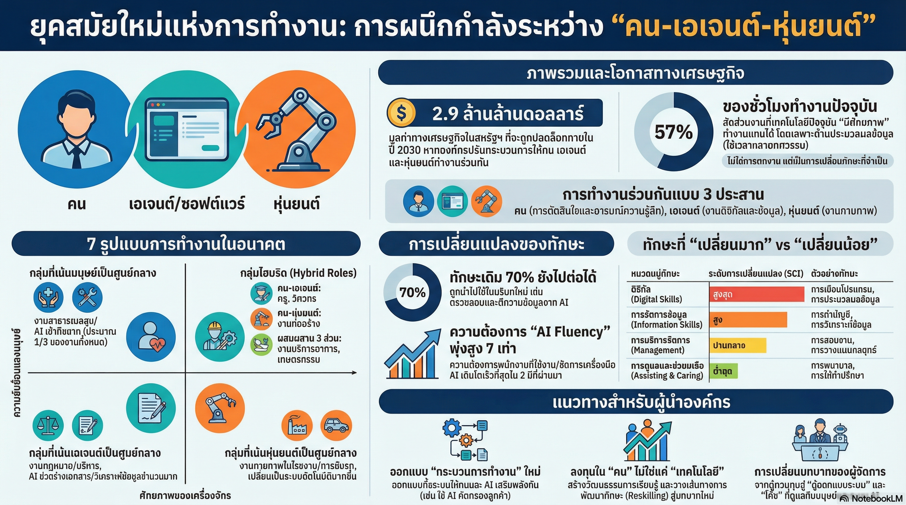

[กลับไปที่หน้าหลัก](../README.md)

สวัสดีครับเพื่อนๆ ทุกคน! วันนี้เรามาคุยเรื่องอนาคตการทำงานกันบ้างนะครับ เรื่องที่ทุกคนต้องเตรียมตัวเพราะมันกำลังเกิดขึ้นจริงๆ แล้วตอนนี้!

คุณเคยสงสัยไหมครับว่า ในอีก 5-10 ปีข้างหน้า เราจะทำงานกันอย่างไร? AI กับหุ่นยนต์จะมาแย่งงานเราจริงหรือเปล่า? หรือจริงๆ แล้วมันจะเป็น "เพื่อนร่วมงาน" ที่ช่วยให้เราทำงานได้ดีขึ้นกันแน่?

รายงานล่าสุดจาก McKinsey (บริษัทที่ปรึกษาชื่อดังระดับโลก) บอกว่า เรากำลังก้าวเข้าสู่ยุคที่ "มนุษย์ เอเจนต์ และหุ่นยนต์ ทำงานร่วมกันเป็นทีม" และคนที่จะประสบความสำเร็จในยุคนี้คือคนที่เป็น "Orchestrator" หรือ "ผู้ควบคุมวงออเคสตรา" ที่สามารถบริหารจัดการทีมผสมผสานนี้ได้!

วันนี้เรามาดูกันว่า อนาคตการทำงานจะเป็นอย่างไร และเราต้องเตรียมตัวยังไงบ้าง

========================================

🔄 ย้อนดูความเชื่อเดิมๆ: AI มาแย่งงานหรือเปล่า?

ก่อนที่เราจะไปดูรายละเอียด มาทบทวนความกลัวและความเชื่อเดิมๆ ที่หลายคนมีกันก่อนนะครับ:

▪ "AI จะมาแย่งงานเรา งานเราจะหายไป" → ไม่ใช่แย่ง แต่เป็นการ "เปลี่ยนบทบาท"
▪ "AI ทำได้หมด คนธรรมดาอย่างเราจะอยู่ได้ยังไง?" → AI ทำไม่ได้หมด ยังมีเยอะที่ต้องการมนุษย์
▪ "แค่เรียนรู้ใช้ AI เป็นก็พอแล้ว" → ไม่พอ ต้อง "บริหารจัดการ" AI อีกด้วย

ความจริงคือ AI ไม่ได้มาเพื่อ "แทนที่" มนุษย์ แต่มาเพื่อเป็น "พันธมิตรทางทักษะ" (Skill Partnership) ที่จะช่วยให้เราทำงานได้ดีขึ้น!

ลองนึกภาพว่า แทนที่คุณจะต้องทำงานซ้ำซากน่าเบื่อทั้งวัน คุณจะได้ทำงานที่ท้าทายและสร้างสรรค์มากขึ้น เพราะงานซ้ำซากถูกส่งต่อให้ AI ทำแทน นี่ไม่ใช่การสูญเสีย แต่เป็นการ "ปลดปล่อย" ครับ!

========================================

1. 💡 การเปลี่ยนแปลงครั้งใหญ่: เมื่อขอบเขตระหว่าง "งานมนุษย์" กับ "งานเครื่องจักร" เริ่มเลือนหาย

ตัวเลกที่น่าตกใจจากรายงานคือ: ปัจจุบันเทคโนโลยีมีศักยภาพทางเทคนิคที่จะช่วยทำงานแทนเราได้ถึง 57% ของชั่วโมงทำงานทั้งหมดในสหรัฐฯ!

=== แปลว่ายังไง? ===

ตัวเลข 57% ไม่ได้แปลว่างานจะหายไปครึ่งหนึ่งนะครับ! แต่มันหมายความว่า:

▸ มนุษย์จะถูก "ปลดปล่อย" จากงานที่ซ้ำซากน่าเบื่อ
▸ เราจะได้เวลาไปทำงานที่ต้องใช้ความคิดสร้างสรรค์ การตัดสินใจ การดูแลคนอื่น
▸ เราจะ "เปลี่ยนบทบาท" จากผู้ปฏิบัติไปเป็นผู้กำกับดูแล

เปรียบเทียบกับโลกจริง:

[ก่อนมี AI]
▸ พนักงานธนาคารใช้เวลา 70% ตรวจสอบเอกสารสินเชื่อ
▸ เหลือเวลาแค่ 30% คุยกับลูกค้า ให้คำปรึกษาจริงๆ
▸ งานซ้ำซากเยอะ เบื่อ ไม่มีความหมาย

[หลังมี AI]
▸ AI ตรวจสอบเอกสารให้ 70% ของเวลา
▸ พนักงานมีเวลา 70% ให้คำปรึกษาลูกค้า วางแผนการเงิน สร้างความสัมพันธ์
▸ งานมีความหมายมากขึ้น ใช้ความสามารถของมนุษย์จริงๆ

นี่คือการ "ขยับพรมแดนแห่งผลิตภาพ" (Productivity Frontier) ครับ เราไม่ได้สูญเสียงาน แต่เราได้งานที่ "ดีกว่า" และ "มีความหมายกว่า"!

"AI กำลังขยายขอบเขตของผลิตภาพ การจะบรรลุผลประโยชน์นี้ได้ จำเป็นต้องมีทักษะใหม่ๆ และการคิดทบทวนว่าผู้คนจะทำงานร่วมกับเครื่องจักรอัจฉริยะได้อย่างไร"

========================================

2. 🎯 ทักษะใหม่ที่ร้อนแรงที่สุด: AI Fluency พุ่งทะยาน 7 เท่าใน 2 ปี!

ในยุคที่เทคโนโลยีเปลี่ยนเร็วอย่างยิ่ง ทักษะที่ร้อนแรงที่สุดตอนนี้คือ "AI Fluency" หรือ "ความฉลาดรู้ด้าน AI" ครับ

=== AI Fluency คืออะไร? ===

มันไม่ใช่การเขียนโค้ด AI นะครับ! แต่เป็นความสามารถในการ:

▸ เข้าใจว่า AI ทำอะไรได้บ้าง ไม่ได้บ้าง
▸ รู้ว่าควรใช้ AI เครื่องมือไหนกับงานแบบไหน
▸ สื่อสารกับ AI ได้อย่างมีประสิทธิภาพ (Prompt Engineering)
▸ บริหารจัดการทีมที่มีทั้งคนและ AI ร่วมงานกัน
▸ ตรวจสอบและควบคุมคุณภาพผลลัพธ์จาก AI

=== ทำไมถึงสำคัญขนาดนี้? ===

ข้อมูลสถิติบอกว่า: ความต้องการทักษะ AI Fluency พุ่งสูงขึ้นถึง 7 เท่า ในช่วง 2 ปีที่ผ่านมา!

และที่น่าสนใจคือ มันเติบโตเร็วกว่าทักษะทางเทคนิค (Technical AI Skills) เช่น Machine Learning หรือ Deep Learning เสียอีก!

ทำไม? เพราะว่า:

▸ นายจ้างไม่ต้องการแค่คนที่เขียนโค้ด AI ได้
▸ แต่ต้องการคนที่ "บริหารจัดการและประยุกต์ใช้" AI ให้เกิดผลลัพธ์จริงในธุรกิจ
▸ ต้องการ "ผู้นำ" ที่รู้จักใช้ AI เป็นเครื่องมือขับเคลื่อนองค์กร

เปรียบเทียบ:

[Technical AI Skills] = เหมือนช่างที่สามารถสร้างเครื่องจักร
▸ สำคัญ แต่ไม่ใช่ทุกคนต้องเป็น
▸ มีคนกลุ่มเล็กที่เชี่ยวชาญก็พอ

[AI Fluency] = เหมือนผู้จัดการโรงงานที่รู้ว่าจะใช้เครื่องจักรยังไง
▸ ทุกคนต้องมี!
▸ ตั้งแต่ผู้บริหาร, ผู้จัดการ, ไปจนถึงพนักงานระดับปฏิบัติการ

นี่คือเหตุผลที่ AI Fluency เรียกได้ว่าเป็น "ภาษาใหม่ของความเป็นผู้นำ" ครับ!

========================================

3. 🔄 ทักษะเดิมยังใช้ได้ แต่จะ "ใช้" ไม่เหมือนเดิม

ข่าวดีสำหรับทุกคนครับ! รายงานพบว่า 70% ของทักษะที่นายจ้างต้องการในปัจจุบันยังคงใช้ได้อยู่!

แต่... จะถูกนำไปใช้ในบริบทใหม่และบทบาทใหม่

=== ทักษะแบ่งออกเป็น 3 กลุ่มใหญ่ ===

[กลุ่มที่ 1: ทักษะที่เปลี่ยนแปลงมากที่สุด]
▸ ทักษะด้านดิจิทัลและการประมวลผลข้อมูล
▸ เช่น การลงบัญชี, การเขียนโค้ดเฉพาะทาง, การวิเคราะห์ข้อมูล
▸ เพราะ AI ทำได้ดี จึงต้องปรับบทบาทมาก

[กลุ่มที่ 2: ทักษะที่เปลี่ยนแปลงปานกลาง]
▸ ทักษะทั่วไป เช่น การสื่อสาร, การแก้ปัญหา, การบริหารโครงการ

[กลุ่มที่ 3: ทักษะที่เปลี่ยนแปลงน้อยที่สุด]
▸ ทักษะด้านการดูแลและปฏิสัมพันธ์ระหว่างมนุษย์
▸ เช่น การดูแลผู้ป่วย, การสอน, การให้คำปรึกษา
▸ ทักษะการเจรจาต่อรอง, ความเห็นอกเห็นใจ
▸ เพราะ AI ทำไม่ได้ จึงเปลี่ยนแปลงน้อย

=== การเปลี่ยนบทบาท: จาก "Executor" สู่ "Orchestrator" ===

มนุษย์จะเปลี่ยนบทบาทจาก:

[ผู้ปฏิบัติ (Executor)] → [ผู้บริหารจัดการ (Orchestrator)]
▸ จากทำเอง → กำกับดูแล AI ทำ
▸ จากทำงานซ้ำซาก → ตัดสินใจในเคสซับซ้อน
▸ จากปฏิบัติตามคำสั่ง → ออกแบบกระบวนการใหม่

บทบาทใหม่ 3 อย่างที่สำคัญ:

[1] Validator (ผู้ตรวจสอบ)
▸ ตรวจสอบและคัดกรองผลลัพธ์จาก AI
▸ ตรวจสอบความถูกต้อง ความเหมาะสม

[2] Decision Maker (ผู้ตัดสินใจ)
▸ ตัดสินใจในเคสที่ซับซ้อน มีความคลุมเครือ
▸ จัดการสถานการณ์ที่ต้องใช้ดุลยพินิจ

[3] Orchestrator (ผู้วงดนตรี)
▸ บริหารจัดการทีมที่มีทั้งคน AI และหุ่นยนต์
▸ ออกแบบกระบวนการทำงานให้ราบรื่น

=== ตัวอย่างจริง: รังสีแพทย์ ===

นี่คือตัวอย่างที่ชัดเจนมากๆ ครับ:

[ความกลัวเดิม]
▸ AI วิเคราะห์ภาพแพทย์ได้แม่นยำกว่ามนุษย์
▸ เลยคิดว่างานรังสีแพทย์จะหายไป

[ความจริงที่เกิดขึ้น]
▸ การจ้างงานรังสีแพทย์กลับเติบโตขึ้น 3% ต่อปี!
▸ ทำไม?

เพราะว่า รังสีแพทย์เปลี่ยนบทบาท:

ก่อนมี AI (ใช้เวลาทั้งหมด 100%):
▸ 80% = ดูภาพเอกซเรย์ทั่วไปที่เป็นรูทีน ซ้ำซาก เบื่อ
▸ 20% = ดูเคสซับซ้อน + คุยกับคนไข้

หลังมี AI (ใช้เวลาทั้งหมด 100%):
▸ 20% = ตรวจสอบผลที่ AI วิเคราะห์แล้ว (รวดเร็ว)
▸ 80% = โฟกัสเคสซับซ้อน + คุยกับคนไข้ + ให้คำปรึกษา + วิจัย

ผลลัพธ์:
▸ รังสีแพทย์ดูภาพได้เยอะขึ้น → โรงพยาบาลต้องการคนเพิ่ม
▸ รังสีแพทย์มีเวลาดูแลคนไข้มากขึ้น → คุณภาพดีขึ้น
▸ งานมีความหมายมากขึ้น → ความพึงพอใจสูงขึ้น

นี่คือตัวอย่างที่ชัดเจนว่า AI ไม่ได้มาแย่งงาน แต่มาทำให้งานเรา "ดีขึ้น"!

========================================

4. 💰 ขุมทรัพย์ 2.9 ล้านล้านดอลลาร์ รอเราปลดล็อก!

ภายในปี 2030 AI มีศักยภาพในการปลดล็อกมูลค่าเศรษฐกิจได้ถึง 2.9 ล้านล้านดอลลาร์!

แต่... ขุมทรัพย์นี้จะเปิดออกก็ต่อเมื่อเราทำอะไร?

=== ไม่ใช่แค่ "ใช้ AI ช่วยทำงาน" ===

ปัญหาคือ หลายองค์กรคิดว่าแค่เอา AI มาช่วยทำงานเล็กๆ น้อยๆ (Individual Tasks) ก็พอแล้ว

เช่น:
▸ ใช้ ChatGPT ช่วยเขียนอีเมล
▸ ใช้ AI ช่วยสรุปเอกสาร
▸ ใช้ AI ช่วยแปลภาษา

แต่นี่คือการใช้ AI แค่ "ผิวเผิน" ครับ ไม่ได้ปลดล็อกศักยภาพที่แท้จริง!

=== ต้อง "ออกแบบกระบวนการใหม่" ===

ข้อมูลระบุว่า 60% ของผลกำไรด้านผลิตภาพจะมาจากการ "ออกแบบขั้นตอนการทำงานใหม่ทั้งหมด" (Redesign Workflows) ในงานเฉพาะด้าน

ตัวอย่างการใช้ AI แบบผิวเผิน vs แบบลึกซึ้ง:

[แบบผิวเผิน: ใช้ AI ช่วยจุดเดียว]
▸ พนักงานสินเชื่อใช้ AI ช่วยตรวจเอกสาร 1 ขั้นตอน
▸ ยังต้องทำงานอื่นๆ ด้วยตัวเองทั้งหมด
▸ ประหยัดเวลาได้แค่ 10-15%

[แบบลึกซึ้ง: ออกแบบกระบวนการใหม่]
▸ ใช้ Agentic AI จัดการทั้งระบบ:
  → AI คัดกรองใบสมัคร
  → AI ตรวจสอบเอกสาร
  → AI วิเคราะห์ความเสี่ยง
  → AI เตรียมรายงาน
  → พนักงานเข้ามาตรวจสอบและตัดสินใจเฉพาะเคสที่ซับซ้อน
▸ ประหยัดเวลาได้ 60-70%!

=== ผู้นำต้องรู้วิธีทำ 3 สิ่ง ===

[1] Redesign (ออกแบบใหม่)
▸ ออกแบบกระบวนการทำงานใหม่ทั้งหมด
▸ ไม่ใช่แค่เอา AI มาแทนที่คนในขั้นตอนเดิม
▸ แต่คิดใหม่ว่า "ถ้ามี AI ช่วย กระบวนการที่ดีที่สุดคืออะไร?"

[2] Orchestrate (บริหารจัดการ)
▸ บริหารจัดการระบบที่คน AI และหุ่นยนต์ทำงานสอดประสานกัน
▸ กำหนดบทบาทที่ชัดเจนว่าใครทำอะไร
▸ สร้างกลไกการส่งต่องานระหว่างคนกับ AI

[3] Validate (ตรวจสอบ)
▸ ตรวจสอบและควบคุมคุณภาพผลลัพธ์จาก AI
▸ ตรวจสอบความปลอดภัย ความแม่นยำ จริยธรรม
▸ แก้ไขเมื่อ AI ทำผิดพลาด

========================================

5. 🎭 7 สถาปัตยกรรมใหม่ของคนทำงาน

เพื่อให้เห็นภาพชัดเจนว่าอนาคตการทำงานจะเป็นอย่างไร เรามาดู 7 รูปแบบการทำงานใหม่กันครับ

แบ่งตามสัดส่วนการทำงานระหว่าง คน (People), เอเจนต์ (Agents - AI Software), และหุ่นยนต์ (Robots)

=== กลุ่มที่ 1: มนุษย์เป็นศูนย์กลาง (Human Strongholds) ===

[1] People-centric (งานที่เน้นมนุษย์ 100%)

ตัวอย่าง:
▸ พยาบาล, นักกายภาพบำบัด
▸ ครู, ที่ปรึกษา, นักบำบัด
▸ ศิลปิน, นักออกแบบ, นักเขียน

ทำไมเทคโนโลยีแทนที่ได้ยาก?
▸ ต้องการความเห็นอกเห็นใจ (Empathy)
▸ ต้องการการสัมผัส การดูแลจากมนุษย์จริงๆ
▸ ต้องการความคิดสร้างสรรค์ในระดับสูง

รายได้เฉลี่ย: $71,000/ปี

=== กลุ่มที่ 2: ทีมผสมผสาน (Hybrid Frontline) ===

[2] People–Agent (คน + AI Software)

ตัวอย่าง:
▸ วิศวกร: ใช้ AI ช่วยออกแบบ วิเคราะห์
▸ ครู: ใช้ AI ช่วยสอน ให้การบ้าน ตรวจข้อสอบ
▸ ที่ปรึกษาการเงิน: ใช้ AI วิเคราะห์พอร์ต แนะนำ แล้วคนให้คำปรึกษาเชิงลึก

รายได้เฉลี่ย: $74,000/ปี

[3] People–Robot (คน + หุ่นยนต์)

ตัวอย่าง:
▸ งานก่อสร้าง: หุ่นยนต์ช่วยยกของหนัก, คนควบคุมและทำงานละเอียด
▸ งานผ่าตัด: หุ่นยนต์ช่วยผ่าตัดจุดที่ต้องการความแม่นยำสูง, แพทย์วางแผนและตัดสินใจ
▸ งานเกษตร: โดรนและหุ่นยนต์เก็บเกี่ยว, คนควบคุมและตรวจสอบ

รายได้เฉลี่ย: ขึ้นอยู่กับงาน

[4] People–Agent–Robot (คน + AI + หุ่นยนต์)

ตัวอย่าง:
▸ คลังสินค้าอัจฉริยะ:
  → AI วางแผนเส้นทางและจัดการสต็อก
  → หุ่นยนต์เคลื่อนย้ายสินค้า
  → คนควบคุมดูแลระบบและจัดการปัญหาพิเศษ
▸ เกษตรอัจฉริยะ:
  → AI วิเคราะห์ข้อมูลดินและสภาพอากาศ
  → โดรนและหุ่นยนต์รดน้ำและเก็บเกี่ยว
  → คนตัดสินใจและดูแลคุณภาพ

รายได้เฉลี่ย: ขึ้นอยู่กับงาน

=== กลุ่มที่ 3: ระบบอัตโนมัติเป็นหลัก (Automated Core) ===

[5] Agent-centric (AI Software เป็นหลัก)

ตัวอย่าง:
▸ งานเอกสาร: AI จัดการเอกสาร สัญญา รายงาน
▸ งานกฎหมาย: AI วิเคราะห์คดี ค้นหาบรรทัดฐาน
▸ งานบัญชี: AI ทำบัญชี คำนวณภาษี

คนทำอะไร?
▸ ตรวจสอบผลลัพธ์จาก AI
▸ จัดการเคสที่ซับซ้อนหรือพิเศษ
▸ ให้คำปรึกษาเชิงกลยุทธ์

ขนาดของกลุ่มนี้: 40% ของงานทั้งหมด (กลุ่มใหญ่ที่สุด!)
รายได้เฉลี่ย: $70,000/ปี

[6] Robot-centric (หุ่นยนต์เป็นหลัก)

ตัวอย่าง:
▸ งานสายการผลิต: หุ่นยนต์ทำงานหลัก คนควบคุมและซ่อมบำรุง
▸ คนขับรถในอนาคต: รถขับเองได้ คนคอยดูแลและจัดการสถานการณ์พิเศษ

รายได้เฉลี่ย: $42,000/ปี

[7] Agent–Robot–centric (AI + หุ่นยนต์ทำงานเอง)

ตัวอย่าง:
▸ โรงงานอัตโนมัติขั้นสูง:
  → AI ควบคุมระบบทั้งหมด
  → หุ่นยนต์ทำงานตามคำสั่ง
  → คนดูแลระบบระดับสูงและจัดการปัญหาที่ซับซ้อน
▸ ศูนย์กระจายสินค้าอัตโนมัติ:
  → AI จัดการการจัดเรียงและส่งสินค้า
  → หุ่นยนต์เคลื่อนย้ายสินค้า
  → คนเข้ามาจัดการเฉพาะกรณีพิเศษ

รายได้เฉลี่ย: ขึ้นอยู่กับระดับความเชี่ยวชาญ

=== บทเรียนสำคัญ ===

"แม้ในโลกที่อัตโนมัติที่สุด มนุษย์ก็ยังคงเป็นศูนย์กลางและขาดไม่ได้ (Indispensable) ในฐานะผู้กำหนดจริยธรรม ตรวจสอบคุณภาพ และบริหารความไว้วางใจ"

========================================

สรุป: เตรียมตัวเป็น Orchestrator ตั้งแต่วันนี้!

หลังจากที่เราได้เห็นภาพรวมของอนาคตการทำงานแล้ว มาสรุปสิ่งสำคัญที่เราต้องจำกันนะครับ:

=== สิ่งที่เราได้เรียนรู้วันนี้ ===

▪ AI ไม่ได้มาแย่งงาน แต่มาเป็น "พันธมิตร" ที่ทำให้เราทำงานได้ดีขึ้น
▪ 57% ของเวลาทำงานสามารถถูกทำโดย AI ได้ แต่นั่นหมายถึงเราได้เวลาทำงานที่มีความหมายมากขึ้น
▪ AI Fluency คือทักษะที่ร้อนแรงที่สุด เติบโต 7 เท่าใน 2 ปี
▪ 70% ของทักษะเดิมยังใช้ได้ แต่จะใช้ในบริบทและบทบาทใหม่
▪ มูลค่า 2.9 ล้านล้านดอลลาร์รอให้ปลดล็อก แต่ต้องออกแบบกระบวนการใหม่ทั้งหมด
▪ มี 7 รูปแบบการทำงานใหม่ ตั้งแต่เน้นคน ผสมผสาน จนถึงอัตโนมัติ

=== เราต้องเตรียมตัวยังไง? ===

[1] เรียนรู้ AI Fluency ตั้งแต่วันนี้
▸ ศึกษาว่า AI ทำอะไรได้บ้าง
▸ ลองใช้เครื่องมือ AI ต่างๆ
▸ ฝึกสื่อสารกับ AI อย่างมีประสิทธิภาพ

[2] ฝึกคิดเชิง "Orchestrator"
▸ อย่าคิดแค่ว่า "AI จะช่วยฉันทำอะไรได้บ้าง"
▸ แต่คิดว่า "ฉันจะออกแบบกระบวนการทำงานใหม่ยังไงให้คนกับ AI ทำงานร่วมกันได้ดีที่สุด"

[3] เสริมสร้างทักษะที่ AI ทำไม่ได้
▸ ความเห็นอกเห็นใจ (Empathy)
▸ ความคิดสร้างสรรค์ (Creativity)
▸ การตัดสินใจในสถานการณ์ซับซ้อน (Complex Decision Making)
▸ จริยธรรมและความรับผิดชอบ (Ethics & Responsibility)

[4] เตรียมตัวเป็น Validator & Decision Maker
▸ ฝึกตรวจสอบผลลัพธ์จาก AI
▸ ฝึกตัดสินใจในเคสที่มีความคลุมเครือ
▸ ฝึกให้เหตุผลและอธิบายการตัดสินใจ

=== นี่ไม่ใช่แค่การอัปเกรดเทคโนโลยี ===

นี่คือการเปลี่ยนผ่านเชิงกลยุทธ์ของผู้นำ (Leadership Transformation) ครับ

ผู้นำที่ประสบความสำเร็จในอนาคตจะไม่ใช่คนที่:
❌ มอบหมายงาน AI ให้แผนก IT จัดการคนเดียว
❌ นั่งรอดูว่า AI จะส่งผลกระทบยังไง
❌ กลัวและต่อต้าน AI

แต่จะเป็นคนที่:
✅ ลงมาคลุกคลีกับ AI ด้วยตัวเอง
✅ ออกแบบวัฒนธรรมการทำงานและการเรียนรู้ใหม่
✅ นำทีมผสมผสานระหว่างคน AI และหุ่นยนต์

=== การลงทุนที่สำคัญที่สุด ===

การลงทุนใน "คน" และ "ทักษะ" สำคัญพอๆ กับการลงทุนในเทคโนโลยี!

องค์กรที่ประสบความสำเร็จจะต้อง:
▸ ฝึกอบรมพนักงานให้มี AI Fluency
▸ สร้างวัฒนธรรมการเรียนรู้ตลอดชีวิต
▸ ออกแบบระบบที่คนกับ AI ทำงานร่วมกันได้อย่างราบรื่น
▸ ดูแลให้ผลประโยชน์จาก AI ถูกใช้อย่างทั่วถึงและยั่งยืน

========================================

คำถามท้ายทาย

สุดท้ายนี้ ลองถามตัวเองดูนะครับ:

"ในขั้นตอนการทำงานของคุณวันนี้ มีส่วนไหนที่ 'เอเจนต์' สามารถเป็นพาร์ทเนอร์ที่ดีที่สุดของคุณ เพื่อให้คุณได้เริ่มฝึกฝนบทบาท 'Orchestrator' แล้วหรือยัง?"

ลองคิดดูว่า:
▸ งานไหนที่คุณทำซ้ำๆ ทุกวัน ที่ AI อาจช่วยได้?
▸ ถ้า AI ช่วยทำงานนั้น คุณจะได้เวลาไปทำอะไรที่มีความหมายมากกว่า?
▸ คุณพร้อมที่จะเป็น "ผู้วงดนตรี" ที่บริหารทีมผสมผสานหรือยัง?

อนาคตไม่ได้อยู่ไกล มันกำลังเกิดขึ้นตอนนี้แล้วครับ คนที่เตรียมตัวตั้งแต่วันนี้ จะเป็นคนที่ประสบความสำเร็จในอนาคต! 🚀

========================================

อ้างอิง:
• McKinsey Report: The Future of Work
• Technical Automation Potential Analysis
• AI Fluency Skills Growth Study
• Work Archetypes Framework

หวังว่าบทความนี้จะช่วยให้ทุกคนเข้าใจอนาคตการทำงานมากขึ้น และเริ่มเตรียมตัวได้ตั้งแต่วันนี้นะครับ! ถ้ามีคำถามหรือประสบการณ์จากการใช้ AI ในที่ทำงาน ก็ comment มาแชร์กันได้เลยครับ 😊
