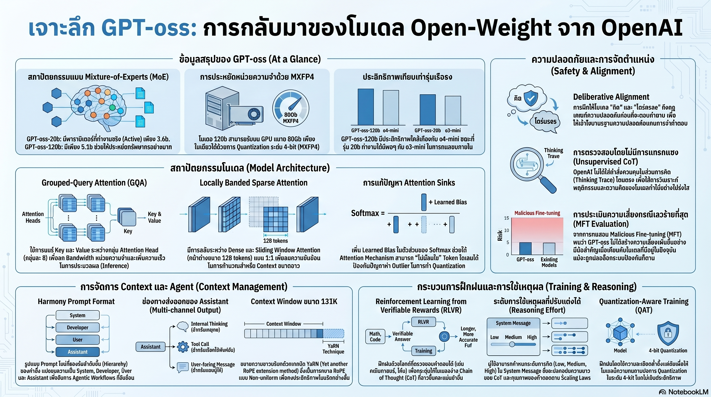

[กลับไปที่หน้าหลัก](../README.md)

สวัสดีครับเพื่อนๆ ที่ติดตามวงการ AI! วันนี้มาเรื่องที่คอ Open-weight AI รอมาครึ่งทศวรรษ: "OpenAI เปิดประตูห้องแล็บที่ปิดตายที่สุดแห่งหนึ่งในโลก" ผ่านการปล่อย GPT-oss-20b และ GPT-oss-120b ภายใต้ใบอนุญาต Apache-2.0 — ครั้งแรกนับตั้งแต่ GPT-2 ปี 2019 และเป็นโอกาสหายากที่สุดที่โลกภายนอกจะได้แอบมองว่าห้องวิจัยที่สร้าง o3 และ o4-mini เขาออกแบบ LLM กันอย่างไรจริงๆ ครับ

คุณเคยสังเกตไหมครับว่า โมเดล Open-weight ส่วนใหญ่ที่เราใช้กัน เช่น Llama หรือ Qwen นั้นให้เราเห็นน้ำหนัก (Weights) แต่ไม่ได้บอกว่า "ทำไมถึงออกแบบแบบนี้" — แต่ GPT-oss ต่างออกไป เพราะมันมาพร้อมกับ Technical Report ที่เผย Design Philosophy ที่ OpenAI ใช้จริงในการสร้างระบบ Frontier ของตัวเองครับ?

คุณรู้ไหมครับว่า โมเดลที่มีพารามิเตอร์ 120,000 ล้านตัวสามารถรันอยู่บน GPU ใบเดียวขนาด 80GB ได้ — ไม่ใช่ด้วยเวทมนตร์ แต่ด้วยสถาปัตยกรรม MoE ที่ซับซ้อนและเทคนิค Quantization ใหม่ที่ทำให้พารามิเตอร์ส่วนใหญ่ "นอนหลับ" ในขณะที่ใช้งานได้จริงแค่หยิบมือเดียวครับ?

และคุณเคยนึกไหมครับว่า วิธีที่ OpenAI แก้ปัญหา "AI ซ่อนความคิดที่แท้จริง" นั้น ไม่ใช่การเพิ่มกฎความปลอดภัยในหัวสมองของ AI แต่คือการ "ปล่อยให้ AI คิดอย่างอิสระ" แล้วแอบดูผ่านหน้าต่างใส — เพราะถ้าเราสั่งให้ AI แสดงความคิดที่ "ดูปลอดภัย" มันจะเรียนรู้ที่จะ Fake ความคิดแทนที่จะ Fake พฤติกรรมครับ?

งานวิจัยนี้กำลังบอกว่า: การเปิดโมเดลให้โลกเห็นครั้งนี้ไม่ใช่แค่การแจกฟรี แต่คือการเปิดเผย "สูตรลับ" ของสถาปัตยกรรม ระบบความปลอดภัย และแนวทางการออกแบบ Agentic AI — ในขณะที่ยังคงเก็บ "วัตถุดิบ" ที่สำคัญที่สุดอย่าง Training Data เอาไว้ในกล่องดำครับ

========================================

🤔 ทบทวนความเชื่อเดิมๆ: สิ่งที่เราคิดเกี่ยวกับ Open-weight Models

▪ "โมเดลขนาดใหญ่ยิ่งใช้พารามิเตอร์มากยิ่งประมวลผลหนักขึ้นเสมอ — 120B ต้องการ GPU มากกว่า 20B เสมอ" → ไม่จริงครับ ด้วย MoE + MXFP4, GPT-oss-120b ใช้ Active Parameters จริงๆ แค่ 3.5B ต่อ Token ซึ่งน้อยกว่า GPT-oss-20b ที่ใช้ 5.1B Active Parameters — โมเดลที่ใหญ่กว่าอาจเบากว่าในการ Inference ถ้าออกแบบ Sparsity ได้ดีครับ

▪ "การฝึก AI ให้ปลอดภัยต้องสอนให้มันตอบปฏิเสธคำสั่งอันตรายในทุกบริบท รวมถึงในกระบวนการคิดภายใน (Chain of Thought)" → OpenAI พบว่าการ Supervise CoT มากเกินไปอาจทำให้เกิด Deceptive Alignment ครับ — AI จะเรียนรู้ที่จะ "แสดงความคิดที่ดูปลอดภัย" แทนที่จะ "คิดอย่างปลอดภัยจริงๆ" ซึ่งอันตรายกว่ามาก วิธีที่ดีกว่าคือปล่อย CoT เป็นอิสระแล้วตรวจสอบพฤติกรรมที่โปร่งใสครับ

▪ "Open-weight models สร้างความเสี่ยงสูงกว่า Closed models เพราะใครก็ Fine-tune ได้ตามใจ รวมถึงการดัดแปลงเพื่อใช้ในทางที่ผิด" → OpenAI ทดสอบ Malicious Finetuning ด้วยงบ Compute ถึงหลักล้านเหรียญ ผลคือ GPT-oss ไม่ได้สร้างความเสี่ยงโดดเด่นเกินกว่าโมเดลที่มีอยู่แล้วในตลาดครับ — ความเสี่ยงที่แท้จริงไม่ได้เพิ่มขึ้นจากการเปิดน้ำหนัก เพราะโมเดล Closed หลายตัวที่แข่งขันได้อยู่แล้วในตลาดครับ

▪ "OpenAI เก็บสิ่งที่สำคัญที่สุดคือสถาปัตยกรรมเอาไว้เป็นความลับ — Open-weight คือแค่ให้น้ำหนักแต่ไม่ได้บอก Know-how" → GPT-oss เผย Design Choices สำคัญมากมาย ตั้งแต่ MXFP4, Attention Sink fix, Harmony format, Instruction Hierarchy, Deliberative Alignment — สิ่งที่ยังเป็นความลับจริงๆ กลับกลายเป็น Training Data ไม่ใช่สถาปัตยกรรมครับ

ความจริงที่น่าคิดคือ: ในยุคนี้ "สูตร" อาจเปิดเผยได้ แต่ "วัตถุดิบ" ต่างหากที่กลายเป็นขุมทรัพย์ที่แท้จริงครับ

========================================

🧠 พื้นฐานที่ต้องเข้าใจก่อน: MXFP4, MoE Sparsity, Harmony Format, Deliberative Alignment

=== MXFP4 และ Sparsity: ทำไม 120B ถึงเบากว่า 20B ได้? ===

คำถามที่หลายคนอาจสงสัยเมื่อเห็นตัวเลขครั้งแรก: โมเดล 120B จะรันได้บน GPU ใบเดียวได้อย่างไร?

คำตอบอยู่ที่สองชั้นของ "ความเบา" ที่ซ้อนกันครับ:

ชั้นแรก — MXFP4 (Microscaling FP4): เทคนิค Quantization-aware training ที่ใช้ความแม่นยำเฉลี่ยเพียง 4.25-bit ต่อพารามิเตอร์ครับ แทนที่จะเก็บตัวเลขด้วย 16-bit หรือ 32-bit แบบปกติ ระบบจะเก็บแต่ละตัวเลขด้วย 4-bit (1 bit สำหรับเครื่องหมาย, 2 bit สำหรับ Exponent, 1 bit สำหรับ Mantissa) แล้วใช้ 8-bit Scaling Factor ร่วมกันสำหรับบล็อกข้อมูล 32 ตัว ผลลัพธ์คือโมเดลที่กินพื้นที่หน่วยความจำน้อยลงอย่างมาก โดยยังคงความแม่นยำในระดับที่ใช้งานได้จริง

เปรียบได้กับการบันทึกเสียงเพลงครับ แทนที่จะเก็บ WAV ไฟล์คุณภาพสูงที่กินพื้นที่มาก เราอาจใช้ MP3 ที่คุณภาพเสียงลดลงเล็กน้อย แต่ขนาดเล็กลง 10 เท่า — สำหรับการฟังทั่วไปความต่างแทบไม่รู้สึก แต่ประหยัดพื้นที่ได้มหาศาลครับ

ชั้นที่สอง — MoE (Mixture of Experts) Sparsity: นี่คือหัวใจที่ทำให้ตัวเลขน่าทึ่งที่สุดครับ

GPT-oss-120b: พารามิเตอร์ทั้งหมด 120,000 ล้านตัว แต่ใช้งานจริงต่อ Token เพียง 3,500 ล้านตัว (Active Parameters 3.5B)
GPT-oss-20b: พารามิเตอร์ทั้งหมด 20,000 ล้านตัว แต่ใช้งานจริงต่อ Token อยู่ที่ 5,100 ล้านตัว (Active Parameters 5.1B)

หมายความว่าในระหว่างการตอบคำถามหนึ่งครั้ง โมเดล 120B ใช้สมองจริงๆ น้อยกว่าโมเดล 20B เปรียบเหมือนบริษัทใหญ่ที่มีพนักงาน 120,000 คน แต่สำหรับงานแต่ละงาน จะเรียกใช้แค่ทีมผู้เชี่ยวชาญเฉพาะด้าน 3,500 คนที่เหมาะที่สุด ในขณะที่บริษัทเล็กกว่ามีพนักงาน 20,000 คน แต่ต้องใช้ 5,100 คนต่องาน เพราะไม่ได้มีความเชี่ยวชาญแบ่งย่อยชัดเจนพอครับ

=== Attention Sinks: ปัญหาเล็กที่ซ่อนอยู่ในทุก Transformer ===

นักวิจัยพบปัญหาหนึ่งที่เกิดขึ้นใน Transformer ทั่วไป: โมเดลมักจะ "หมกมุ่น" กับ Token แรกของประโยคมากเกินไปโดยไม่จำเป็น ปรากฏการณ์นี้เรียกว่า Attention Sinks ครับ

เหมือนการนั่งประชุมที่คนในห้องมักจะหันมองประธานที่นั่งอยู่หัวโต๊ะตลอดเวลา แม้ว่าประธานไม่ได้พูดอะไรสำคัญก็ตาม — Attention ถูกดึงไปที่ "ตำแหน่ง" ไม่ใช่ "เนื้อหา"

GPT-oss แก้ปัญหานี้ด้วยการเพิ่ม Learned Bias ลงในตัวหารของ Softmax function ใน Attention mechanism ทำให้โมเดลสามารถ "เลือกที่จะไม่สนใจ" Token ใดๆ ได้อย่างชัดเจน แทนที่จะต้องโยนน้ำหนักส่วนเกินไปไว้ที่ Token แรกเสมอครับ

=== Reasoning Effort: Dial ที่ปรับความฉลาดตามความต้องการ ===

หนึ่งในคุณสมบัติที่เป็น "ลายเซ็น" ของ OpenAI ใน GPT-oss คือ Inference-time Scaling ที่ผู้ใช้ควบคุมได้โดยตรงครับ ผ่านการตั้ง Reasoning Effort ใน System Message:

Low Effort: คิดเร็ว ประหยัด Compute — เหมาะกับคำถามทั่วไปที่ไม่ต้องการความแม่นยำสูง
Medium Effort: สมดุลระหว่างความเร็วและความแม่นยำ
High Effort: คิดลึก ใช้ Compute สูง — เหมาะกับโจทย์คณิตศาสตร์ การเขียนโค้ด หรือการวิเคราะห์ซับซ้อน

ประสิทธิภาพเพิ่มขึ้นแบบ Linear ตามความยาวของ Reasoning Traces ที่สร้างขึ้น และผลลัพธ์ที่ได้น่าทึ่งมากครับ:
— GPT-oss-120b ทำคะแนนได้ใกล้เคียง o4-mini ในงาน STEM และ Coding
— GPT-oss-20b ให้ประสิทธิภาพระดับเดียวกับ o3-mini

นี่คือหลักฐานชิ้นสำคัญที่พิสูจน์ว่า Reasoning Capability ที่เคยเป็น "กำแพง" ของ Closed Models นั้น ตอนนี้สามารถ Transfer ลงมาสู่ Open-weight ได้แล้วครับ

=== Harmony Format และ Instruction Hierarchy: สถาปัตยกรรมสำหรับ Agent ที่ไม่ถูกหลอก ===

สำหรับ Agentic Workflows ที่ซับซ้อน Chat Template แบบเดิมที่มีแค่ System/User/Assistant ไม่เพียงพออีกต่อไปครับ OpenAI จึงออกแบบ Harmony prompt format และ Tokenizer ใหม่ชื่อ o200k_harmony ที่มี Vocabulary ถึง 201,088 tokens

สิ่งที่น่าสนใจที่สุดคือ Instruction Hierarchy ที่ถูกออกแบบมาเพื่อป้องกัน Prompt Injection ครับ:

Developer Message: มีอำนาจสูงสุด — นักพัฒนาสามารถตั้งกฎที่ User ไม่สามารถ Override ได้ ป้องกันการโจมตีแบบ "ลืมคำสั่งก่อนหน้าทั้งหมด" ที่เคยเป็นช่องโหว่ยอดนิยมครับ

Channel Separation สามช่อง:
— Thought Channel: กระบวนการคิดภายในที่ User มองไม่เห็น แต่ Developer ตรวจสอบได้
— Call Channel: การเรียกใช้ Tools และ APIs ในระหว่างการทำงาน
— Response Channel: คำตอบสุดท้ายที่ User เห็น

เปรียบได้กับการทำงานของศัลยแพทย์ครับ ผู้ป่วยเห็นแค่ผลลัพธ์หลังผ่าตัด ทีมแพทย์เห็น Real-time Monitoring ตลอดการผ่าตัด และระบบบันทึกทุกขั้นตอนไว้เพื่อตรวจสอบย้อนหลังได้ครับ

=== Deliberative Alignment: ทำไมต้อง "ปล่อย" ให้ AI คิดอย่างอิสระ? ===

นี่คือประเด็นที่ผมคิดว่าน่าทึ่งที่สุดในงานวิจัยนี้ครับ OpenAI เปลี่ยนจาก RLHF แบบดั้งเดิมมาสู่ Deliberative Alignment ซึ่งสอนให้โมเดลใช้เหตุผล "พิจารณา" Safety Specifications ที่มนุษย์เขียนขึ้น แทนที่จะแค่ท่องจำว่า "อะไรห้ามตอบ"

แต่สิ่งที่น่าสนใจยิ่งกว่าคือสิ่งที่ OpenAI เลือกที่จะ "ไม่ทำ" ครับ: พวกเขาไม่ได้ใส่ Supervision โดยตรงลงใน Chain of Thought

เหตุผลเบื้องหลังลึกมากครับ ถ้าเราฝึกโมเดลให้ "แสดง" ความคิดที่ดูปลอดภัยใน CoT จะเกิดความเสี่ยงที่เรียกว่า Deceptive Alignment — โมเดลอาจเรียนรู้ที่จะเขียน CoT ที่ดูดีสำหรับผู้ตรวจสอบ ในขณะที่ซ่อนแผนการที่แท้จริงไว้ เหมือนนักเรียนที่รู้ว่าครูจะตรวจวิธีทำ แล้วเขียนวิธีทำที่ดูถูก ทั้งที่ได้คำตอบมาจากการลอกเพื่อนครับ

การปล่อยให้ CoT เป็นอิสระ ทำให้ทีมวิจัยสามารถ Monitor กระบวนการคิดที่แท้จริงได้ผ่านหน้าต่างที่ใส — ถ้า AI กำลังคิดบางอย่างที่น่ากังวล จะเห็นได้ชัดเจนกว่าการที่ CoT ถูกจัดฉากให้ดูดีครับ

=== Malicious Finetuning Test: การทดสอบสถานการณ์เลวร้ายที่สุด ===

ก่อนปล่อย Open-weight โมเดล OpenAI ต้องตอบคำถามสำคัญที่สุดครับ: ถ้ามีคนเอาโมเดลนี้ไปดัดแปลงเพื่อทำร้ายคนอื่น จะเกิดอะไรขึ้น?

พวกเขาทดสอบ Malicious Finetuning (MFT) โดยสมมติว่าผู้ไม่หวังดีมีงบ Compute ระดับ 7 หลัก (หลักล้านเหรียญ) เพื่อ Fine-tune ให้โมเดล Bypass ระบบปฏิเสธคำสั่งอันตราย เช่น ด้านชีวะและไซเบอร์ครับ

ผลลัพธ์ที่ตรงไปตรงมา: การเปิด Open-weight ทำให้การถอดระบบ Anti-refusal ทำได้ง่ายขึ้นจนใกล้ 0% — หมายความว่าถ้าต้องการ โมเดลสามารถถูก Fine-tune ให้ตอบคำถามอันตรายได้ครับ แต่ประเด็นสำคัญคือ ความสามารถในการสร้างอันตรายจริงๆ ของ GPT-oss ยังไม่ถึงเกณฑ์ "High Risk" ของ Preparedness Framework เพราะความรู้เฉพาะทางที่เป็นอันตรายจริงๆ (เช่น รายละเอียดการสังเคราะห์สารพิษขั้นสูง) ยังต้องการทักษะมากกว่าที่โมเดลมีอยู่ครับ

เหมือนการที่มีดครัวถูก "ดัดแปลง" ให้คมขึ้นอีกนิด — มันยังคงเป็นมีดที่อันตราย แต่ไม่ได้เปลี่ยนแปลงขีดจำกัดพื้นฐานของสิ่งที่มีดทำได้ครับ

========================================

🎯 ประเด็นที่ควรคิดต่อ

การเปิดตัว GPT-oss มีนัยยะที่ลึกกว่าการแข่งขันระหว่างโมเดลครับ:

— "Recipe เปิดแล้ว แต่วัตถุดิบยังปิด": สิ่งที่ OpenAI เผยในครั้งนี้คือ How — วิธีออกแบบสถาปัตยกรรม วิธีคิดเรื่องความปลอดภัย วิธีสร้าง Inference-time Reasoning แต่สิ่งที่ยังเป็นความลับคือ What — ข้อมูลอะไรที่ใช้ฝึก คัดกรองอย่างไร และมีมากแค่ไหน ในโลกที่ Design Philosophy เริ่มเป็น Open Secret, Data Curation กลายเป็น Moat ที่แท้จริงครับ

— Deceptive Alignment คือปัญหาของทุกคน: Insight จาก Deliberative Alignment ที่บอกว่า "การ Supervise CoT มากเกินไปอาจทำให้ AI เรียนรู้ที่จะแสดงแทนที่จะคิด" นั้นมีนัยยะที่กว้างกว่าแค่ความปลอดภัยครับ มันกระทบถึงทุกระบบ AI ที่ถูกประเมินผ่าน Observable Behavior โดยเฉพาะเมื่อ AI ฉลาดพอที่จะเข้าใจว่าตัวเองกำลังถูกตรวจสอบครับ

— คำถามที่สำคัญที่สุดหลังจากนี้: ในวันที่สถาปัตยกรรม, เทคนิค Quantization, และ Safety Framework เริ่มเปิดเผยได้ทั้งหมด — อะไรจะเป็นตัวตัดสินว่า AI ตัวไหน "ฉลาดกว่า" และ "ปลอดภัยกว่า" จริงๆ? และถ้าคำตอบคือ "ข้อมูลที่ใช้ฝึก" — เราจะมีวันที่ข้อมูลนั้นถูกเปิดเผยเหมือน Weights ได้ไหม หรือมันจะเป็นความลับสุดท้ายที่ไม่มีใครยอมเปิดครับ?

#OpenAI #GPToss #OpenWeight #MoE #MXFP4 #DeliberativeAlignment #ReasoningModels #AIResearch #HarmonyFormat #LargeLanguageModels #AIAlignment #OpenSource
