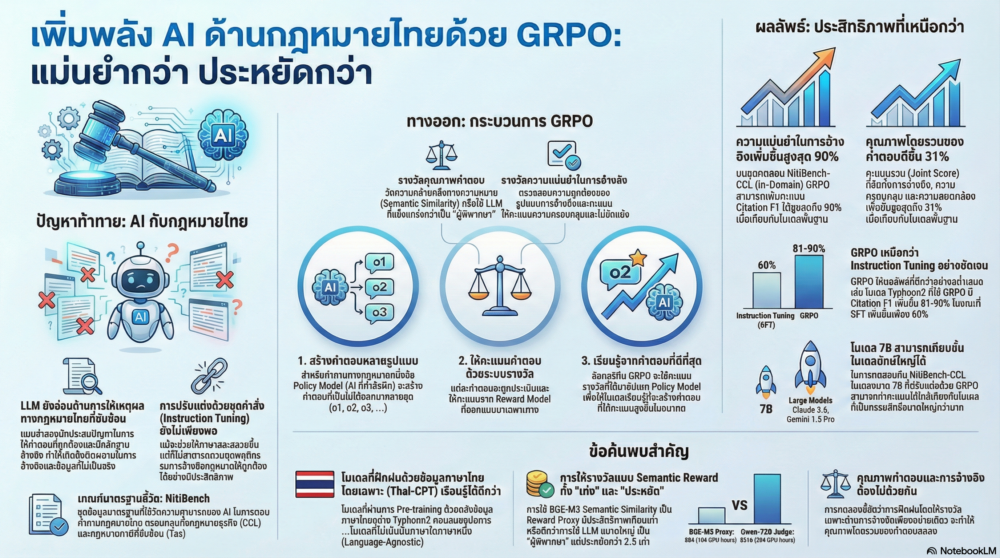

[กลับไปที่หน้าหลัก](../README.md)

สวัสดีครับเพื่อนๆ นักพัฒนา AI! วันนี้เรามาดูผลงานวิจัยด้าน AI ของไทยกันบ้างนะครับ เป็นงานวิจัยที่น่าสนใจมากๆ เกี่ยวกับการสร้าง "ทนาย AI" ที่พูดภาษาไทยได้แม่นยำ!

บ่อยครั้งที่เราเห็นแต่งานวิจัย AI จากต่างประเทศ แต่ครั้งนี้ขอชวนมาดูงานวิจัยของนักวิจัยไทยที่กำลังพยายามแก้ปัญหาสำคัญของการใช้ AI กับภาษาไทยกันบ้างครับ

คุณเคยสงสัยไหมว่า ทำไม AI อย่าง ChatGPT ถึงตอบคำถามภาษาอังกฤษได้ดี แต่พอมาเจอคำถามเกี่ยวกับกฎหมายไทยกลับตอบผิดๆ ถูกๆ? บางทีก็ "หลอน" (Hallucination) แต่งข้อมูลขึ้นมาเอง อ้างมาตราที่ไม่มีจริง หรือตีความกฎหมายผิดไปเลย?

ปัญหานี้สำคัญมากครับ โดยเฉพาะเมื่อเราต้องการใช้ AI ช่วยงานด้านกฎหมายที่ต้องการความแม่นยำสูงสุด แค่ผิดนิดเดียวอาจจะส่งผลกระทบใหญ่หลวงได้!

หลายคนอาจคิดว่าคำตอบคือ "สร้างโมเดลให้ใหญ่ขึ้น" หรือ "อัดข้อมูลเข้าไปให้เยอะขึ้น" แต่งานวิจัยล่าสุดเกี่ยวกับการฝึก AI สำหรับตอบคำถามกฎหมายไทย ได้เปิดเผยความจริงที่น่าแปลกใจมากๆ นั่นก็คือ "วิธีการฝึกสอน" นั้นสำคัญกว่า "ขนาดโมเดล" หรือ "ปริมาณข้อมูล" เสียอีก!

วันนี้เรามาดู 4 ข้อค้นพบที่น่าทึ่งและสวนกระแสจากงานวิจัยนี้กันครับ มันจะเปลี่ยนวิธีที่เราคิดเรื่องการพัฒนา AI เฉพาะทางไปเลยทีเดียว!

========================================

🎓 ทบทวนความเชื่อเดิมๆ: AI เก่งได้ต้องยังไง?

ก่อนที่เราจะไปดูข้อค้นพบ มาทบทวนความเชื่อเดิมๆ ที่หลายคนมีกันก่อนนะครับ:

▪ "โมเดลยิ่งใหญ่ยิ่งเก่ง" → ไม่จริงเสมอไป! วิธีฝึกสำคัญกว่า
▪ "ยัดข้อมูลเข้าไปให้เยอะๆ AI ก็จะเก่งขึ้น" → ผิด! บางทียิ่งเยอะยิ่งแย่
▪ "ครูที่แพงกว่าต้องสอนได้ดีกว่าเสมอ" → ไม่จริง! ครูราคาถูกอาจเก่งพอๆ กัน
▪ "เทคนิคเดียวใช้ได้กับทุกปัญหา" → ผิดอีก! ต้องเลือกให้เหมาะกับงาน

ความจริงที่งานวิจัยนี้บอกเราคือ: การสร้าง AI ที่เก่งจริงๆ คือศิลปะของการผสมผสาน "วิธีฝึกที่ใช่", "ครูที่เหมาะสม" และ "รากฐานที่แข็งแกร่ง" ครับ!

========================================

1. 🎯 วิธีฝึกที่ "ใช่" สำคัญกว่าฝึกให้ "เยอะ"

ข้อค้นพบแรกที่สะเทือนความเชื่อเดิมๆ เลยครับ นั่นคือ "การฝึกให้มากไม่ได้หมายความว่าจะดีขึ้น" และบางทีกลับทำให้แย่ลงเสียอีก!

=== วิธีฝึก AI 2 แบบ ===

งานวิจัยนี้เปรียบเทียบวิธีการฝึก AI สองแบบ:

[วิธีที่ 1: Instruction Tuning (SFT)] ← วิธีมาตรฐานที่ใช้กันทั่วไป

เปรียบเทียบกับโลกจริง:
▸ เหมือนการให้นักเรียนท่องจำโจทย์ที่เฉลยแล้วหลายพันข้อ
▸ นักเรียนจะจำได้ว่า "ถ้าเจอโจทย์แบบนี้ ตอบแบบนี้"
▸ แต่อาจจะไม่เข้าใจเหตุผลว่าทำไมต้องตอบแบบนั้น

วิธีการทำงาน:
▸ เอาตัวอย่างคำถาม-คำตอบที่ถูกต้องให้ AI ดู
▸ ฝึกให้ AI เลียนแบบการตอบ
▸ ยิ่งดูเยอะยิ่งดี (หรืออย่างน้อยเราก็คิดว่างั้น)

[วิธีที่ 2: Group-Relative Policy Optimization (GRPO)] ← วิธีใหม่ที่ดีกว่า

=== GRPO คืออะไร? ===

GRPO ย่อมาจาก Group-Relative Policy Optimization ซึ่งเป็นเทคนิคการฝึก AI แบบใหม่ที่ทำงานแตกต่างจาก SFT อย่างสิ้นเชิง

หลักการทำงานของ GRPO:

[ขั้นตอนที่ 1: สร้างคำตอบหลายๆ แบบ]
▸ AI ไม่ได้เลียนแบบคำตอบเดียว
▸ แต่ลองสร้างคำตอบหลายๆ แบบ (เช่น 10 แบบ)
▸ แต่ละแบบอาจจะต่างกัน

[ขั้นตอนที่ 2: ให้คะแนนแต่ละคำตอบ]
▸ มี "กรรมการ" หรือ "ครู" (Reward Model) มาให้คะแนน
▸ คำตอบไหนดีกว่า ได้คะแนนสูง
▸ คำตอบไหนแย่กว่า ได้คะแนนต่ำ

[ขั้นตอนที่ 3: เรียนรู้จากการเปรียบเทียบ]
▸ AI เห็นว่าคำตอบไหนได้คะแนนสูง คำตอบไหนได้คะแนนต่ำ
▸ เรียนรู้ว่า "วิธีคิดแบบนี้ดีกว่า" "วิธีคิดแบบนี้แย่กว่า"
▸ ปรับปรุงวิธีคิดให้ดีขึ้นเรื่อยๆ

เปรียบเทียบกับโลกจริง:
▸ เหมือนมีติวเตอร์ส่วนตัวที่คอยให้ฟีดแบ็กและให้ "รางวัล" กับกระบวนการแก้ปัญหา
▸ AI ได้ลองตอบหลายๆ แบบ
▸ ติวเตอร์บอกว่า "วิธีนี้ดีกว่า ได้รางวัล" "วิธีนี้แย่กว่า ไม่ได้รางวัล"
▸ AI เรียนรู้ว่าวิธีไหนดีกว่า ไม่ใช่แค่จำคำตอบ

ทำไมเรียกว่า "Group-Relative"?
▸ "Group" = กลุ่มคำตอบหลายๆ แบบที่ AI สร้างขึ้น
▸ "Relative" = เปรียบเทียบว่าคำตอบไหนดีกว่ากันภายในกลุ่ม
▸ ไม่ได้บอกว่า "คำตอบนี้ถูก 100%" แต่บอกว่า "คำตอบนี้ดีกว่าคำตอบนั้น"

ทำไม GRPO ถึงดีกว่า SFT?
▸ SFT บอกว่า "ตอบแบบนี้" → AI แค่ท่องจำ
▸ GRPO บอกว่า "คำตอบนี้ดีกว่าคำตอบนั้น เพราะ..." → AI เข้าใจเหตุผล

=== ผลลัพธ์ที่น่าตกใจ! ===

ทีนี้มาดูผลลัพธ์กันครับ ซึ่งน่าประหลาดใจมากๆ!

[ทดสอบกับคำถามกฎหมายทั่วไป (Nitibench-CCL)]
▸ คำถามที่ AI เคยเห็นรูปแบบคล้ายๆ กันมาแล้ว
▸ SFT ทำได้ดีพอใช้
▸ แต่ GRPO ทำได้ดีกว่ามาก โดยเฉพาะเมื่อใช้ "semantic reward"

[ทดสอบกับคำถามกฎหมายภาษีที่ซับซ้อน (Nitibench-Tax)]
▸ คำถามที่ยาก ซับซ้อน และอยู่นอกเหนือจากที่เคยฝึกมา
▸ SFT กลับทำให้โมเดลทำงานได้แย่ลงกว่าเดิม!
▸ โมเดล qwen2.5-7b-instruct มีความแม่นยำในการอ้างอิงมาตรากฎหมายลดลงถึง 53.82%!
▸ ในขณะที่ GRPO เพิ่มความแม่นยำได้สูงสุดถึง 89.84% สำหรับโมเดล typhoon2!

=== ทำไมถึงเป็นแบบนี้? ===

เหตุผลที่ SFT ทำให้แย่ลง:

[ปัญหาที่ 1: จำรูปแบบผิวเผิน]
▸ AI จำแค่ "คีย์เวิร์ด" และ "รูปแบบประโยค"
▸ ไม่ได้เข้าใจเหตุผลจริงๆ
▸ พอเจอโจทย์ใหม่ที่ต่างไป ก็สับสนทันที

[ปัญหาที่ 2: Overfitting]
▸ AI ติดกับตัวอย่างที่เห็นมามากเกินไป
▸ ทำลายความสามารถในการให้เหตุผลเดิมที่มีอยู่
▸ เหมือนนักเรียนที่ท่องโจทย์มามากจนลืมคิดเอง

เหตุผลที่ GRPO ทำได้ดีกว่า:

[ข้อดีที่ 1: เรียนรู้กระบวนการคิด]
▸ AI ได้ลองคิดและตอบหลายๆ แบบ
▸ เรียนรู้ว่าวิธีคิดไหนดีกว่า
▸ เข้าใจ "ทำไม" ไม่ใช่แค่ "ทำอย่างไร"

[ข้อดีที่ 2: ไม่ทำลายความสามารถเดิม]
▸ ค่อยๆ ชี้แนะแนวทางที่ดีขึ้น
▸ ไม่บังคับให้ AI จำรูปแบบตายตัว
▸ รักษาความยืดหยุ่นในการคิดเอาไว้

เปรียบเทียบสรุป:

SFT = นักเรียนท่องโจทย์ 1,000 ข้อ
▸ เจอโจทย์ที่ท่องมา → ตอบได้
▸ เจอโจทย์ใหม่ที่ไม่เคยเห็น → งง ตอบไม่ได้

GRPO = นักเรียนเรียนรู้วิธีคิดและแก้ปัญหา
▸ เจอโจทย์ที่คุ้นเคย → ตอบได้ดี
▸ เจอโจทย์ใหม่ → คิดได้ ประยุกต์ได้ ตอบได้!

========================================

2. 💰 ครูที่ "ดีพอ" อาจเก่งไม่แพ้ครูอัจฉริยะ แถมถูกกว่าถึง 2.5 เท่า!

ข้อค้นพบที่สองนี้เป็น Game-Changer เลยครับ! นั่นคือ "ครูราคาถูกอาจสอนได้ดีพอๆ กับครูราคาแพง"

=== ครู 2 ประเภท ===

ในวิธี GRPO ต้องมี "กรรมการ" หรือ "ครู" มาคอยให้คะแนน (Reward) บอกว่าคำตอบของ AI ดีหรือไม่ดี

งานวิจัยทดลองใช้ครู 2 แบบ:

[ครูที่ 1: ครูอัจฉริยะ (LLM-as-a-Judge)]

ใช้ LLM ขนาดใหญ่ (Qwen2.5-72B-Instruct) มาเป็นกรรมการ

วิธีทำงาน:
▸ AI ตัวเล็กตอบคำถาม
▸ AI ตัวใหญ่มาอ่านคำตอบ
▸ AI ตัวใหญ่วิเคราะห์ว่าคำตอบดีหรือไม่ดี พร้อมให้เหตุผล
▸ ให้คะแนน

ข้อดี:
▸ เข้าใจบริบทได้ลึก
▸ ประเมินคุณภาพได้ละเอียด

ข้อเสีย:
▸ ใช้ GPU เยอะมาก
▸ ใช้เวลานาน
▸ แพงมาก!

ค่าใช้จ่าย:
▸ 264 GPU-hours
▸ ประมาณ $216

[ครูที่ 2: ครูเรียบง่าย (Semantic Similarity)]

ใช้โมเดล BGE-M3 วัด "ความหมายที่ใกล้เคียง" ระหว่างคำตอบของ AI กับคำตอบที่ถูกต้อง

วิธีทำงาน:
▸ AI ตัวเล็กตอบคำถาม
▸ โมเดล BGE-M3 เปรียบเทียบว่าคำตอบของ AI "ใกล้เคียง" กับคำตอบที่ถูกต้องแค่ไหน
▸ ให้คะแนนตามความใกล้เคียง

ข้อดี:
▸ ใช้ทรัพยากรน้อย
▸ คำนวณเร็ว
▸ ถูกมาก!

ข้อเสีย:
▸ ไม่เข้าใจบริบทลึกซึ้งเท่าครูอัจฉริยะ

ค่าใช้จ่าย:
▸ 104 GPU-hours
▸ ประมาณ $85

=== ผลการเปรียบเทียบที่น่าทึ่ง! ===

สิ่งที่น่าตกใจมากๆ คือ:

[ในชุดข้อมูลที่คุ้นเคย (Nitibench-CCL)]
▸ ครูเรียบง่าย (Semantic Similarity) ให้ผลลัพธ์ดีเท่ากับหรือดีกว่าครูอัจฉริยะเสียอีก!
▸ ใช้เงินแค่ $85 เทียบกับ $216
▸ ถูกกว่า 2.5 เท่า แต่ได้ผลเท่ากัน!

นี่คือ Game-Changer เพราะ:
▸ คนทั่วไปสามารถฝึก AI เฉพาะทางได้ในราคาที่จ่ายได้
▸ ไม่ต้องมี GPU แพงๆ หรืองบประมาณมหาศาล
▸ ทำให้การพัฒนา AI เข้าถึงได้ง่ายขึ้นมาก!

"BGE-M3 semantic similarity, despite being a proxy, proves vastly more efficient. Its strong performance, especially in-domain, confirms its value as a cost-effective method"

เปรียบเทียบ:

ครูอัจฉริยะ = ติวเตอร์เอกชนราคา 2,000 บาท/ชั่วโมง
▸ อธิบายละเอียด วิเคราะห์ลึก
▸ แต่แพงมาก

ครูเรียบง่าย = ติวเตอร์ราคา 800 บาท/ชั่วโมง
▸ สอนได้ดีพอๆ กันในหัวข้อทั่วไป
▸ ถูกกว่าเยอะ คุ้มค่ามาก!

========================================

3. ⚠️ แต่ระวัง! ครูเรียบง่ายก็สับสนกับปัญหาที่ซับซ้อนเกินไป

ข้อค้นพบที่สามเป็นการเตือนใจว่า "ไม่มีอะไรสมบูรณ์แบบ" ครับ

=== จุดอ่อนของครูเรียบง่าย ===

แม้ว่าครูแบบ Semantic Similarity จะทำงานได้ดีและถูกมาก แต่มันก็มีข้อจำกัดครับ

[ทำงานได้ดีกับ: คำถามทั่วไป (Nitibench-CCL)]
▸ คำถามที่มีรูปแบบคล้ายๆ กับที่เคยเห็น
▸ คำตอบที่ถูกต้องมักจะมี "คีย์เวิร์ด" ที่คล้ายกัน
▸ ครูเรียบง่ายจับได้

[ทำงานแย่กับ: คำถามซับซ้อน (Nitibench-Tax)]
▸ คำถามกฎหมายภาษีที่ต้องใช้เหตุผลเชิงลึก
▸ คำตอบที่ดีอาจจะใช้คำที่ต่างกัน แต่ตรรกะถูกต้อง
▸ ครูเรียบง่ายสับสน ให้คะแนนผิด

=== ทำไมถึงเป็นแบบนี้? ===

นักวิจัยพบว่า:

ในชุดข้อมูล CCL:
▸ ความสัมพันธ์ระหว่าง "ความหมายที่ใกล้เคียง" กับ "คุณภาพคำตอบที่แท้จริง" มีอยู่จริง
▸ คำตอบที่ดีมักจะมีคำที่ใกล้เคียงกับคำตอบมาตรฐาน
▸ ครูเรียบง่ายใช้งานได้ดี

ในชุดข้อมูล Tax:
▸ ความสัมพันธ์นั้น "ไม่มีนัยสำคัญ" เลย!
▸ คำตอบที่ดีอาจจะใช้คำที่แตกต่างไปจากคำตอบมาตรฐาน
▸ แต่ตรรกะถูกต้องเหมือนกัน
▸ ครูเรียบง่ายไม่สามารถประเมินได้

=== ความแตกต่างระหว่างการจำคำกับการเข้าใจตรรกะ ===

นี่คือความแตกต่างสำคัญครับ:

[จำ "คีย์เวิร์ด"] ← ครูเรียบง่ายทำได้
▸ ดูว่าคำตอบมีคำที่คล้ายกับคำตอบมาตรฐานไหม
▸ ถ้าคล้าย → ให้คะแนนสูง
▸ ใช้ได้กับปัญหาที่ไม่ซับซ้อน

[เข้าใจ "ตรรกะ"] ← ครูเรียบง่ายทำไม่ได้
▸ ต้องเข้าใจว่าเหตุผลที่ให้มาถูกต้องหรือไม่
▸ แม้จะใช้คำต่างกัน แต่ถ้าตรรกะถูก ก็ควรได้คะแนนสูง
▸ ต้องการความเข้าใจเชิงลึก

ตัวอย่าง:

คำถาม: "การขายที่ดินต้องเสียภาษีอะไรบ้าง?"

คำตอบมาตรฐาน: "ต้องเสียภาษีเงินได้และภาษีธุรกิจเฉพาะ"

คำตอบของ AI แบบที่ 1: "ผู้ขายต้องเสียภาษีเงินได้และภาษีธุรกิจเฉพาะ"
▸ ใช้คำเกือบเหมือนกัน
▸ ครูเรียบง่าย → ให้คะแนนสูง ✅ ถูกต้อง

คำตอบของ AI แบบที่ 2: "ผู้โอนกรรมสิทธิ์อสังหาริมทรัพย์มีหน้าที่เสียอากรตามประมวลรัษฎากร มาตรา 91 และตามพระราชบัญญัติภาษีธุรกิจเฉพาะ"
▸ ใช้คำแตกต่าง แต่ตรรกะถูกต้องเหมือนกัน (ภาษีเงินได้ = อากรตามประมวลรัษฎากร มาตรา 91)
▸ ครูเรียบง่าย → อาจให้คะแนนต่ำ ❌ ประเมินผิด

คำตอบของ AI แบบที่ 3: "ต้องเสียภาษี VAT และภาษีมูลค่าเพิ่ม"
▸ ใช้คำที่ผิด (VAT ไม่ใช่ภาษีที่ใช้กับการขายที่ดิน)
▸ แต่มี "ภาษี" เป็นคีย์เวิร์ดเหมือนกัน
▸ ครูเรียบง่าย → อาจให้คะแนนปานกลาง ❌ ประเมินผิด

=== บทเรียน ===

▸ ครูเรียบง่าย (Semantic Similarity) เหมาะกับงานที่ไม่ซับซ้อนมาก
▸ ประหยัดต้นทุน คุ้มค่า และได้ผลดี
▸ แต่สำหรับงานที่ต้องการการใช้เหตุผลเชิงลึกอย่างแท้จริง เช่น กฎหมายภาษีที่ซับซ้อน
▸ ต้องใช้ครูที่สามารถประเมินตรรกะได้ (LLM-as-a-Judge)

========================================

4. 🏗️ รากฐานแข็งแรงสำคัญกว่าเทคนิคฝึกขั้นสูง

ข้อค้นพบสุดท้ายเป็นข้อเตือนใจที่สำคัญมากๆ ครับ นั่นคือ "คุณสร้างบ้านที่แข็งแรงบนรากฐานที่อ่อนแอไม่ได้"!

=== เปรียบเทียบโมเดล 2 ประเภท ===

งานวิจัยเปรียบเทียบโมเดล AI ที่มี "รากฐาน" แตกต่างกัน:

[กลุ่มที่ 1: โมเดลสากล] ← ไม่ได้เน้นภาษาไทยเป็นพิเศษ

ตัวอย่าง:
▸ Qwen (จีน)
▸ LLaMA (Meta)
▸ Mistral (ฝรั่งเศส)

รากฐาน:
▸ ฝึกด้วยข้อมูลหลายภาษา
▸ ข้อมูลภาษาไทยมีน้อย (อาจจะแค่ 1-2%)
▸ เข้าใจภาษาไทยได้แต่ไม่ลึก

[กลุ่มที่ 2: โมเดลที่เน้นภาษาไทย] ← ผ่านการฝึกกับข้อมูลไทยมหาศาล

ตัวอย่าง:
▸ Typhoon2
▸ OpenThaiGPT1.5

รากฐาน:
▸ ฝึกด้วยข้อมูลภาษาไทยจำนวนมหาศาล
▸ เข้าใจโครงสร้างภาษา วัฒนธรรม และบริบทไทยอย่างลึกซึ้ง
▸ มี "สัญชาตญาณ" ภาษาไทยที่แข็งแกร่ง

=== ผลการทดสอบที่ชัดเจน ===

เมื่อนำเทคนิค GRPO ไปใช้กับโมเดลทั้งสองกลุ่ม:

[กับโมเดลสากล]
▸ ในคำถามง่ายๆ (Nitibench-CCL): ได้ผลดีขึ้นบ้าง
▸ ในคำถามซับซ้อน (Nitibench-Tax): ไม่ค่อยได้ผล
▸ เหมือน GRPO ช่วยไม่ได้มากนัก

[กับโมเดลที่เน้นภาษาไทย (Typhoon2)]
▸ ในคำถามง่ายๆ (Nitibench-CCL): ได้ผลดีมาก
▸ ในคำถามซับซ้อน (Nitibench-Tax): ได้ผลดีมากๆ มีการพัฒนาแบบก้าวกระโดด!
▸ GRPO ช่วยปลดล็อกศักยภาพที่มีอยู่ออกมาได้

=== ทำไมถึงเป็นแบบนี้? ===

นักวิจัยสรุปว่า:

GRPO ทำหน้าที่เหมือน "ตัวปรับแต่งประสิทธิภาพ" (Optimizer) มากกว่า "ครูที่สอนทักษะใหม่" (Teacher)

กล่าวคือ:
▸ GRPO ช่วย "เพิ่มประสิทธิภาพในการค้นหา" คำตอบที่ถูกต้อง
▸ แต่คำตอบนั้นต้อง "มีอยู่" ในความสามารถของโมเดลอยู่แล้ว
▸ ถ้าโมเดลไม่มีความรู้พื้นฐาน GRPO ก็ช่วยไม่ได้

เปรียบเทียบกับโลกจริง:

[สถานการณ์ที่ 1: นักเรียนที่มีพื้นฐานดี]
▸ รู้เนื้อหาพอสมควร แต่ยังไม่เก่งมาก
▸ ครู (GRPO) มาช่วยชี้แนะเทคนิคการแก้ปัญหา
▸ นักเรียนเก่งขึ้นอย่างเห็นได้ชัด! ✅

[สถานการณ์ที่ 2: นักเรียนที่ไม่มีพื้นฐาน]
▸ แทบไม่รู้เนื้อหาเลย
▸ ครู (GRPO) มาช่วยชี้แนะเทคนิค
▸ แต่นักเรียนยังงง เพราะไม่เข้าใจเนื้อหาพื้นฐาน ❌

=== สรุปสำคัญ ===

ความรู้พื้นฐานและ "สัญชาตญาณ" ที่มีอยู่ในโมเดลดั้งเดิมคือปัจจัยสำคัญอย่างยิ่งต่อความสำเร็จ!

▸ เทคนิคการฝึกที่ดี (GRPO) สำคัญ
▸ แต่รากฐานที่แข็งแกร่งสำคัญกว่า!
▸ ถ้าไม่มีรากฐานที่ดี เทคนิคดีแค่ไหนก็ไม่ช่วย

เหมือนการสร้างบ้าน:
▸ GRPO = เทคนิคการก่อสร้างที่ทันสมัย
▸ รากฐานโมเดล = ฐานรากของบ้าน

ถ้าฐานรากไม่แข็งแรง ใช้เทคนิคก่อสร้างดีแค่ไหนก็สร้างบ้านที่แข็งแรงไม่ได้!

========================================

สรุป: ศิลปะและศาสตร์แห่งการฝึก AI เฉพาะทาง

หลังจากที่เราได้เห็นข้อค้นพบทั้ง 4 ข้อแล้ว มาสรุปบทเรียนสำคัญกันครับ:

=== สิ่งที่เราได้เรียนรู้ ===

[1] วิธีฝึกที่ "ใช่" สำคัญกว่าฝึกให้ "เยอะ"
▸ GRPO สอนให้ AI คิดเป็น
▸ SFT สอนให้ AI จำ
▸ คิดเป็นดีกว่าจำในงานซับซ้อน

[2] ครูที่ "ดีพอ" อาจเก่งไม่แพ้ครูอัจฉริยะ
▸ Semantic Similarity ถูกกว่า 2.5 เท่า
▸ ได้ผลดีในงานทั่วไป
▸ ทำให้การพัฒนา AI เข้าถึงได้ง่ายขึ้น

[3] แต่ครูเรียบง่ายก็มีข้อจำกัด
▸ ทำงานได้ดีกับงานที่ไม่ซับซ้อน
▸ งานที่ต้องการเหตุผลเชิงลึกต้องใช้ครูที่เก่งกว่า
▸ ต้องเลือกครูให้เหมาะกับงาน

[4] รากฐานแข็งแรงสำคัญที่สุด
▸ เทคนิคดีช่วยได้แค่ปลดล็อกศักยภาพที่มีอยู่
▸ ถ้าไม่มีพื้นฐาน เทคนิคดีแค่ไหนก็ไม่ช่วย
▸ โมเดลที่เน้นภาษาไทยทำงานได้ดีกว่ามาก

=== การพัฒนา AI เฉพาะทางที่ดีต้องมี 3 สิ่ง ===

[1] อัลกอริธึมการฝึกที่ชาญฉลาด
▸ เลือกวิธีฝึกที่เหมาะกับงาน
▸ GRPO สำหรับงานที่ต้องการการให้เหตุผล

[2] การออกแบบรางวัลที่มีประสิทธิภาพ
▸ เลือกครูที่เหมาะกับงาน
▸ Semantic Similarity สำหรับงานทั่วไป ราคาถูก
▸ LLM-as-a-Judge สำหรับงานซับซ้อน แม่นยำกว่า

[3] โมเดลพื้นฐานที่แข็งแกร่ง
▸ สำหรับภาษาไทย ต้องใช้โมเดลที่ฝึกกับข้อมูลไทยมาเยอะ
▸ โมเดลสากลไม่เพียงพอ
▸ รากฐานคือทุกอย่าง!

=== ผลกระทบต่ออนาคต ===

ข้อค้นพบเหล่านี้มีความหมายมากสำหรับอนาคตของ AI ครับ:

[ทำให้การพัฒนา AI เข้าถึงได้ง่ายขึ้น]
▸ ไม่ต้องใช้โมเดลขนาดยักษ์ที่แพงมาก
▸ ครูแบบเรียบง่ายก็ใช้ได้ผลดี
▸ คนทั่วไปสามารถสร้าง AI เฉพาะทางได้

[แต่ต้องระวังข้อจำกัด]
▸ ไม่มีเทคนิคเดียวที่ใช้ได้กับทุกปัญหา
▸ ต้องเลือกวิธีให้เหมาะกับงาน
▸ รากฐานที่แข็งแกร่งยังคงสำคัญที่สุด

[โอกาสสำหรับภาษาไทย]
▸ การมีโมเดลที่เน้นภาษาไทยเป็นสิ่งสำคัญมาก
▸ Typhoon2, OpenThaiGPT เป็นรากฐานที่ดี
▸ เราสามารถสร้าง AI ไทยที่เก่งจริงๆ ได้!

========================================

คำถามท้ายทาย

สุดท้ายนี้ ลองคิดดูนะครับว่า:

"เราจะต้องคิดค้นกลยุทธ์การฝึกสอนที่ชาญฉลาดรูปแบบใดอีกบ้าง เพื่อให้แน่ใจว่าเครื่องมือเหล่านี้ไม่ใช่แค่พูดจาฉะฉาน แต่ยังเชื่อถือได้และแม่นยำอย่างแท้จริง?"

คำถามสำหรับทุกคนที่สนใจพัฒนา AI:
▸ ถ้าคุณจะสร้าง AI เฉพาะทางในสายงานของคุณ คุณจะเลือกวิธีฝึกแบบไหน?
▸ คุณมีงบประมาณพอที่จะใช้ "ครูอัจฉริยะ" หรือจะเลือก "ครูเรียบง่าย"?
▸ โมเดลพื้นฐานที่คุณใช้มีรากฐานที่แข็งแกร่งพอหรือเปล่า?

นี่คือคำถามที่ทุกคนที่กำลังพัฒนา AI ต้องตอบครับ! 🤔

========================================

อ้างอิง:
• การฝึก AI สำหรับตอบคำถามกฎหมายไทย
• GRPO (Group-Relative Policy Optimization)
• Nitibench Dataset (CCL & Tax)
• Typhoon2, OpenThaiGPT, Qwen Models

หวังว่าบทความนี้จะเปิดมุมมองใหม่ให้ทุกคนเห็นว่าการพัฒนา AI ไม่ใช่แค่เรื่องของ "ใหญ่" หรือ "เยอะ" แต่เป็นเรื่องของ "ชาญฉลาด" และ "เหมาะสม" ครับ!

ถ้ามีคำถามหรือประสบการณ์จากการพัฒนา AI ก็มาแชร์กันได้เลยนะครับ 😊
