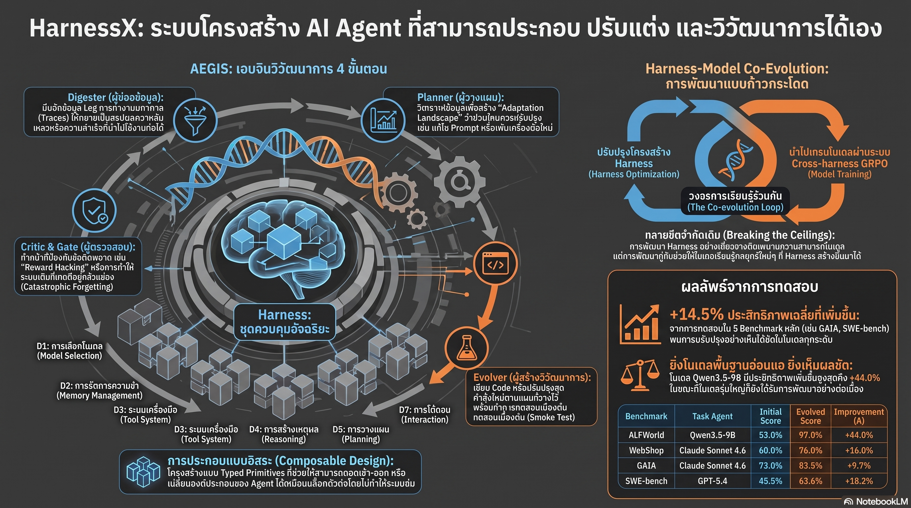

[กลับไปที่หน้าหลัก](../README.md)

สวัสดีครับเพื่อนๆ ที่ติดตามวงการ AI! ก่อนหน้านี้เราคุยเรื่อง Agentic Harness Engineering ที่มนุษย์ออกแบบ Harness ให้ดีขึ้นครับ วันนี้มาอีกขั้น: HarnessX งานวิจัยที่ให้ Harness วิวัฒนาการตัวเองผ่าน AEGIS Engine และยังพัฒนาพร้อมกับการ Train โมเดลผ่าน Replay Buffer เดียวกันครับ ผลลัพธ์? Qwen3.5-9B โมเดลเล็กที่เคยทำ ALFWorld ได้ 53% พุ่งเป็น 97.0% หลัง Harness วิวัฒน์ — ก้าวกระโดด +44.0 pp เทียบกับ Claude Sonnet ที่ได้ +11.2 pp จากจุดเริ่มต้นที่สูงกว่าครับ

คุณเคยสังเกตไหมครับว่า แม้แต่ Harness ที่ออกแบบมาอย่างดีโดยมนุษย์ก็ยังเป็น "Static" ครับ — พอโมเดลอัปเกรดหรือ Task เปลี่ยน Scaffolding เดิมก็พัง และเราต้องนั่งเขียน Harness ใหม่จากต้นครับ? HarnessX เสนอว่าทำไมไม่ให้ Harness เรียนรู้จากความล้มเหลวของตัวเองแล้ว Rewrite ตัวเองได้เลยครับ

คุณรู้ไหมครับว่า Seesaw Constraint ซึ่งเป็นหัวใจของ AEGIS นั้นแก้ปัญหา Regression ที่เป็น Achilles' heel ของ Self-modification ทุกระบบครับ มันการันตีว่า "ทำได้ดีขึ้นในเรื่องใหม่ เรื่องเก่าต้องไม่แย่ลง" ผ่าน Deterministic Gate ก่อน Deploy ทุกครั้งครับ — ซึ่งต่างจากการ Prompt Tune ทั่วไปที่ไม่มีการรับประกันแบบนี้ครับ?

และคุณเคยนึกไหมครับว่า ทำไมการ "ปรับ Harness" กับ "ปรับ Model" ถึงควรทำพร้อมกัน ครับ เพราะ Harness ที่ดีที่สุดจะ Plateau ถ้าโมเดลยังทำงานไม่ได้ และโมเดลที่ฉลาดขึ้นก็ไม่มีประโยชน์ถ้า Harness ป้อน Task ที่ซับซ้อนพอไม่ได้ครับ? HarnessX เรียกเพดานคู่นี้ว่า Scaffolding ceiling และ Training-signal ceiling ครับ

งานวิจัยนี้กำลังบอกว่า: "Harness ไม่ใช่แค่สิ่งที่มนุษย์สร้างให้ AI ใช้ แต่คือสิ่งที่ AI สามารถวิวัฒนาการร่วมกับตัวเองได้ — และเมื่อ Harness กับ Model เติบโตไปด้วยกัน ขีดจำกัดของทั้งสองก็จะถูกทลายพร้อมกันครับ"

========================================

🤔 ทบทวนความเชื่อเดิมๆ: สิ่งที่เราคิดเกี่ยวกับการพัฒนา AI Agent Systems

▪ "Harness ที่ดีคือ Harness ที่มนุษย์ออกแบบมาอย่างประณีต — ความเชี่ยวชาญของวิศวกรคือตัวกำหนดเพดาน" → HarnessX พิสูจน์ว่า Harness ที่วิวัฒนาการด้วยตัวเองผ่าน AEGIS ให้ผลดีกว่า Hand-crafted Harness ครับ Qwen3.5-9B ที่ +44.0 pp บน ALFWorld คือหลักฐานว่าการ Self-evolution ค้นพบ Configuration ที่มนุษย์อาจคิดไม่ถึงครับ

▪ "AI Agent ขนาดเล็กมีเพดานที่แน่นอน — ไม่ว่าจะ Tune Harness แค่ไหน ขนาด Model ก็ยังจำกัดความสามารถ" → Inverse Scaling Surprise ครับ โมเดลเล็กได้ประโยชน์จาก Evolved Harness มากกว่าโมเดลใหญ่ เพราะโมเดลเล็กมี Behavioral Gap สูงกว่าที่ Harness เข้าไปอุดได้ครับ Qwen3.5-9B: +44.0 pp vs. Claude Sonnet: +11.2 pp บน ALFWorld เดียวกันครับ

▪ "Harness กับ Model Training เป็นคนละ Workstream — ปรับ Harness ก็คือปรับ Harness ไม่ต้องเกี่ยวกับการ Train โมเดล" → Co-Evolution ผ่าน Replay Buffer เดียวกันทลายความเชื่อนี้ครับ ถ้าปรับเฉพาะ Harness จะเจอ Scaffolding ceiling และถ้า Train เฉพาะ Model จะเจอ Training-signal ceiling ครับ ต้องทำพร้อมกันเท่านั้นจึงจะทลายเพดานทั้งสองได้ครับ

▪ "Global Harness หนึ่งตัวที่ดีพอควรทำงานได้กับทุก Task — ความซับซ้อนที่เพิ่มขึ้นจากการแตกแขนงไม่คุ้ม" → Variant Isolation ผ่าน Ensemble Routing พิสูจน์ตรงข้ามครับ Global Strategy ทำให้การปรับปรุง Task หนึ่งทำลาย Task อื่นครับ ส่วน Ensemble Routing ที่แตกแขนง Harness ตาม Task Type ประหยัด Token 25% และดึงโมเดลที่ Stagnate กลับมาได้ +13.6% ครับ

ความจริงที่น่าคิดคือ: "Harness ที่ Static คือ Harness ที่กำลังล้าหลังโมเดลอยู่ตลอดเวลา — อนาคตของ AI Agent คือระบบที่ทุก Layer วิวัฒนาการไปพร้อมกันครับ"

========================================

🧠 พื้นฐานที่ต้องเข้าใจก่อน: 9-Dimensional Taxonomy, AEGIS Engine, Seesaw Constraint, Co-Evolution, และ Variant Isolation

=== 9-Dimensional Taxonomy: Harness ในฐานะ First-class Architecture ===

HarnessX มองว่า Harness ไม่ใช่แค่ Prompt หรือ Script แต่คือ Software Architecture ที่มี 9 มิติที่ต้องจัดการแยกกันและสามารถวิวัฒนาการแยกกันได้ครับ

D1 Model Selection: การเลือกโมเดลที่เหมาะสมในแต่ละบทบาท ทั้ง Task Agent, Judge, และ Evaluator ครับ D2 Context Assembly: การจัดลำดับและคัดกรองข้อมูลก่อนส่งให้โมเดลครับ D3 Memory Management: ความจำระยะสั้นและระยะยาวครับ D4 Tool Ecosystem: ชุดเครื่องมือที่ Agent เลือกใช้ได้ครับ D5 Execution Environment: Sandbox ที่ปลอดภัยสำหรับรัน Tool ครับ D6 Evaluation and Reward: เกณฑ์ตัดสินความสำเร็จครับ D7 Control and Safety: กฎป้องกัน Loop และพฤติกรรมไม่พึงประสงค์ครับ D8 Observability: การบันทึกและวิเคราะห์ทุก Event ครับ D9 Training Bridge: การเปลี่ยน Experience ให้กลายเป็น Training Data สำหรับสอนโมเดลครับ

การแยก 9 มิตินี้ทำให้ AEGIS สามารถระบุได้ว่าต้องวิวัฒนาการมิติไหน โดยไม่กระทบมิติอื่นครับ

=== AEGIS Engine: 4 ขั้นตอนที่ตรวจสอบได้ ===

AEGIS คือกลไกที่ขับเคลื่อนการวิวัฒนาการของ Harness ครับ ทำงานเป็น Pipeline 4 ขั้นตอนครับ

Digester: ย่อย Log การทำงานจำนวนมากให้กลายเป็น "Layered Evidence" ที่กระชับครับ ไม่ให้ Planner ต้องอ่าน Raw Log หลายล้าน Token ครับ

Planner: วิเคราะห์ Evidence แล้ววางแผนว่าควรปรับ D1-D9 ไหนครับ ระบุว่า Bottleneck อยู่ที่ Tool, Memory, หรือ Control Flow ครับ

Evolver: สร้าง Harness ใหม่ตามแผน แล้วรัน Smoke Test เบื้องต้นก่อนส่งต่อครับ

Critic: ทำหน้าที่ผู้ตรวจการครับ ประเมินความเสี่ยงทั้งหมดรวมถึง Reward Hacking ก่อนที่ Harness ใหม่จะผ่าน Deterministic Gate และถูก Deploy ครับ

ถ้า Critic ไม่ผ่าน Harness จะไม่ถูก Deploy แม้ว่าจะ Improve ใน Task ใหม่ก็ตามครับ

=== Seesaw Constraint: การันตี Zero Regression ===

นี่คือ Innovation ที่แก้ปัญหา Achilles' heel ของ Self-modification ทุกระบบครับ

ปัญหาคลาสสิกของระบบที่ปรับตัวเองคือ "เก่งขึ้นในบางเรื่อง พังในบางเรื่อง" โดยไม่รู้ตัวครับ Seesaw Constraint แก้ด้วยการกำหนด Regression Budget ครับ ก่อน Deploy ทุกครั้ง ระบบต้องพิสูจน์ว่า Performance บน Existing Task Set ไม่ลดลงเกิน Threshold ที่กำหนดครับ

ถ้าการ Improve Task ใหม่ทำให้ Task เก่าแย่ลงเกิน Budget ระบบจะ Reject การเปลี่ยนแปลงนั้นครับ ทำให้ Co-evolution เป็น Monotonic ในภาพรวมครับ — ไม่มีการถอยหลังครับ

=== Inverse Scaling Surprise: โมเดลเล็กได้ประโยชน์มากกว่า ===

ผลการทดสอบบน ALFWorld และ SWE-bench ครับ:

Qwen3.5-9B บน ALFWorld: 53.0% → 97.0% (+44.0 pp) ครับ
Claude Sonnet 4.6 บน ALFWorld: 83.6% → 94.8% (+11.2 pp) ครับ
Qwen3.5-9B บน SWE-bench: 23.6% → 41.8% (+18.2 pp) ครับ
Claude Sonnet 4.6 บน SWE-bench: 76.4% → 87.3% (+10.9 pp) ครับ

Pattern ชัดเจนครับ: โมเดลเล็กได้ Gain สูงกว่าโมเดลใหญ่ในทุก Benchmark ครับ เหตุผลคือโมเดลเล็กมี Behavioral Gap สูงกว่า — มีอะไรที่ Harness ช่วยได้มากกว่าครับ ในขณะที่โมเดลใหญ่ที่เก่งอยู่แล้วมี Ceiling สูงกว่าแต่ Gap ที่ Harness จะ Fill ได้น้อยกว่าครับ

สำหรับองค์กรที่มี Compute Budget จำกัด นี่คือ Signal สำคัญมากครับ Evolved Harness บนโมเดลเล็กอาจให้ ROI ดีกว่าการจ่ายค่า API โมเดลใหญ่ครับ

=== Co-Evolution: ทำไม Harness กับ Model ต้องเติบโตพร้อมกัน ===

HarnessX ระบุ Ceiling สองประเภทที่เกิดขึ้นเมื่อปรับเพียงด้านเดียวครับ

Scaffolding Ceiling: เมื่อ Harness ดีที่สุดแล้ว แต่โมเดลไม่มีความสามารถพอจะใช้ประโยชน์จาก Tool ที่ซับซ้อนกว่าครับ Harness จะ Plateau แม้จะออกแบบมาดีแค่ไหน

Training-signal Ceiling: เมื่อโมเดลเก่งขึ้น แต่ Harness ยังส่ง Task ง่ายๆ อยู่ ไม่มี Challenge ที่จะกระตุ้นความสามารถใหม่ออกมาได้ครับ

Co-Evolution แก้ทั้งสองพร้อมกันด้วยการใช้ Replay Buffer เดียวกันครับ Experience ที่ Agent สะสมในการทำงานถูกใช้ทั้งเพื่อ Update Harness (Non-parametric) และเป็น Training Data สำหรับ Model (Parametric) ครับ ทำให้ Harness ซับซ้อนขึ้นพร้อมกับ Model ที่ฉลาดขึ้นในวงจรเดียวกันครับ

=== Variant Isolation และ Ensemble Routing ===

ใน Task ที่ซับซ้อน (เช่น GAIA Benchmark) Harness ตัวเดียวที่ใช้กับทุก Task ทำให้เกิด Interference ครับ การปรับให้ดีใน Task ประเภท A มักทำให้แย่ใน Task ประเภท B ครับ

Ensemble Routing แก้ด้วยการให้ระบบแตกแขนง Harness ออกตาม Task Type ครับ แต่ละ Variant วิวัฒนาการแยกกันครับ Router เลือก Harness ที่เหมาะสมสำหรับแต่ละ Task ครับ

ผลครับ: ประหยัด Token ในการ Evolution ได้ 25% เพราะไม่ต้องทดสอบทุก Variant กับทุก Task ครับ และโมเดลที่ Stagnate เพราะ Global Harness เดิมถึง Saturation สามารถดึงกลับมาพัฒนาได้อีก +13.6% เมื่อใช้ Ensemble ครับ

========================================

🎯 ประเด็นที่ควรคิดต่อ

— Harness Evolution + Model Training บน Replay Buffer เดียวคือ Architecture ที่อาจกลายเป็น Standard: ถ้า Co-Evolution พิสูจน์ได้ว่าทลาย Ceiling ได้จริงในหลาย Domain การแยก "Harness Team" กับ "Model Team" ในองค์กรอาจกลายเป็น Anti-pattern ครับ สองทีมนี้ต้องทำงานบน Feedback Loop เดียวกันครับ

— Seesaw Constraint คือ Design Pattern ที่ควรยืมไปใช้กว้างกว่า HarnessX: แนวคิดที่ระบบจะ Block การเปลี่ยนแปลงใดๆ ที่ทำให้ Existing Performance แย่ลงเกิน Budget นั้นมีประโยชน์มากในทุกระบบที่ Self-modify ครับ ไม่ว่าจะเป็น Recommendation System, AutoML, หรือ Continuous Deployment Pipeline ครับ

— คำถามที่สำคัญที่สุด: Inverse Scaling Surprise บอกว่าโมเดลเล็กได้ประโยชน์จาก Evolved Harness มากกว่าครับ แต่ถ้า Harness วิวัฒนาการต่อเนื่องและโมเดลเล็กถูก Train ไปพร้อมกัน — มีจุดหนึ่งไหมที่โมเดลเล็ก + Evolved Harness จะทำงานได้เทียบเท่าโมเดลใหญ่ที่มี Static Harness ในทุก Task ไม่ใช่แค่บาง Benchmark ครับ? ถ้าใช่ นั่นคือการเปลี่ยน Economics ของ AI Industry ครับ

#HarnessX #AIAgent #AEGIS #SeesawConstraint #CoEvolution #EnsembleRouting #AgentEngineering #SelfEvolution #LLM #AIResearch #ALFWorld #SWEBench #AgentFoundry #ScaffoldingCeiling
