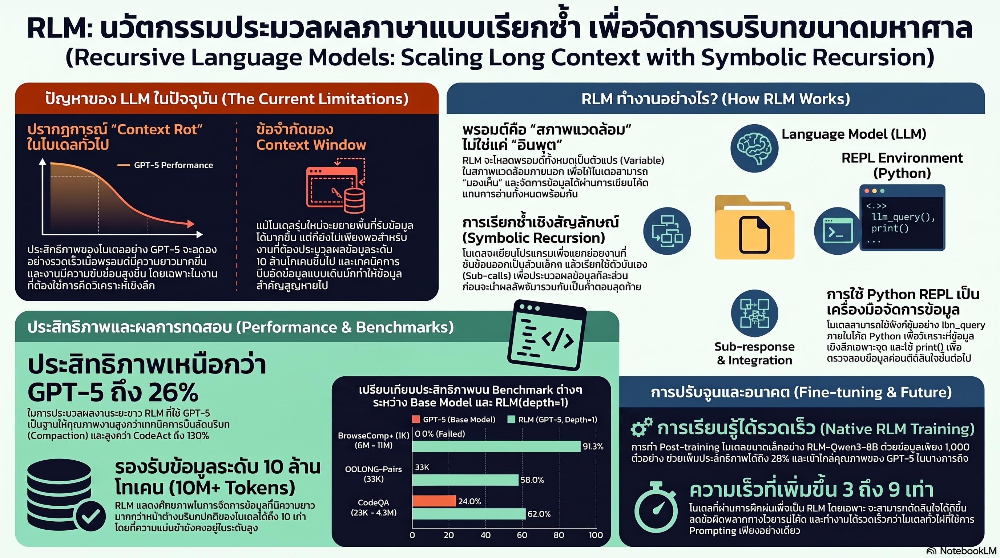

[กลับไปที่หน้าหลัก](../README.md)

สวัสดีครับเพื่อนๆ ที่ติดตามวงการ AI! ในขณะที่ทุกค่ายแข่งกันขยาย Context Window จากหลักหมื่นสู่หลักล้านโทเคน MIT CSAIL เสนอทิศทางที่ต่างออกไปครับ Recursive Language Models (RLM) ไม่ได้ทำให้ "ถัง" ใหญ่ขึ้นครับ แต่เปลี่ยนวิธีที่ AI เข้าถึงข้อมูลไปเลยครับ — RLM(GPT-5) ชนะ Compaction แบบเดิม 26%, ชนะ Claude Code 13%, และ RLM-Qwen3-8B โมเดล 8B ที่ Train ด้วยข้อมูลเพียง 1,000 ตัวอย่างจาก Domain ที่ไม่เกี่ยวข้องเลย ทำผลงานใกล้เคียง GPT-5 ได้ครับ

คุณเคยสังเกตไหมครับว่า ตัวเลข Context Window ที่พุ่งสูงขึ้นไม่ได้หมายความว่าโมเดลใช้มันได้จริงทั้งหมดครับ งานวิจัย MIT พบว่า GPT-5 มีขีดจำกัดฮาร์ดแวร์จริงๆ ที่ 272K โทเคน และบน OOLONG-Pairs Benchmark ประสิทธิภาพตกลง Exponential ตามความยาวของ Prompt สภาวะที่เรียกว่า Context Rot ครับ — ไม่ใช่แค่ลดลงเล็กน้อย แต่ดิ่งลงชันมากครับ?

คุณรู้ไหมครับว่า RLM แก้ปัญหานี้ไม่ใช่ด้วยการขยาย Context Window แต่ด้วยการเปลี่ยนวิธีปฏิสัมพันธ์กับข้อมูลทั้งหมดครับ แทนที่จะ Copy ข้อความเข้า Prompt (Algorithm 2 แบบเดิม) RLM โหลดข้อมูลทั้งหมดไว้เป็น Variable ใน Python REPL แล้วเขียนโค้ด "Peek" ไปดึงเฉพาะส่วนที่ต้องการออกมาครับ — Context Window ยังสะอาดอยู่ตลอดครับ?

และคุณเคยนึกไหมครับว่า ถ้าโมเดล 8B ที่ Train ด้วยข้อมูล 1,000 ตัวอย่างจาก Domain ที่ไม่เกี่ยวข้องเลย สามารถ Generalize ทักษะ Recursive Decomposition ไปใช้กับงานใหม่ได้ถึง +28% นั่นหมายความว่า Length Generalization ไม่ใช่สิ่งที่ต้อง Train แยกต่างหากสำหรับทุก Task แต่คือทักษะที่ Transfer ได้ข้าม Domain ครับ?

งานวิจัยนี้กำลังบอกว่า: "Context Window ไม่ใช่ตัวชี้วัดความฉลาดของ AI อีกต่อไปครับ — ความฉลาดอยู่ที่การออกแบบให้ AI รู้จักเรียกตัวเองซ้ำเพื่อย่อยงานที่ใหญ่เกินขีดจำกัดให้กลายเป็นงานย่อยที่แม่นยำ และขยาย Compute แทนที่จะขยาย Memory ครับ"

========================================

🤔 ทบทวนความเชื่อเดิมๆ: สิ่งที่เราคิดเกี่ยวกับ Context Window และข้อมูลยาว

▪ "Context Window ที่ใหญ่กว่าหมายความว่า AI สามารถวิเคราะห์ข้อมูลขนาดใหญ่ได้ดีกว่าเสมอ" → GPT-5 มีขีดจำกัดฮาร์ดแวร์จริงที่ 272K โทเคนครับ และแม้ในขอบเขตนั้น Context Rot ทำให้ประสิทธิภาพตกลง Exponential บน OOLONG-Pairs ครับ การรับข้อมูลเข้าได้ไม่ใช่สิ่งเดียวกับการประมวลผลข้อมูลนั้นได้ครับ "ถังใหญ่" ไม่ได้หมายความว่า "ใช้ได้ดีครับ"

▪ "วิธีที่ดีที่สุดเมื่อข้อมูลเกิน Context Window คือการทำ Compaction หรือสรุปย่อก่อนส่งเข้าโมเดล" → Compaction ทำให้ข้อมูลสำคัญตกหล่นโดย Design ครับ RLM ที่ใช้ Symbolic Handle และ REPL ชนะ Compaction 26% (median) ครับ เพราะมันไม่ทิ้งข้อมูลใดเลยครับ — แค่เปลี่ยนวิธีเข้าถึงจาก "อ่านทั้งหมด" เป็น "ดึงเฉพาะที่ต้องการ" ครับ

▪ "โมเดลใหญ่คือคำตอบสำหรับงานที่ซับซ้อนและข้อมูลยาวครับ — โมเดล 8B ไม่มีทางสู้ GPT-5 ได้ในงาน Long-context" → RLM-Qwen3-8B ที่ Post-train ด้วยข้อมูลเพียง 1,000 ตัวอย่างจาก Domain ที่ไม่เกี่ยวข้องเลย ทำผลงานใกล้เคียง GPT-5 ในหลาย Task และเพิ่ม Performance 28% ครับ Length Generalization เป็นทักษะที่ Transfer ได้ครับ ไม่ใช่สิ่งที่ผูกกับขนาดโมเดลครับ

▪ "การเพิ่ม Inference Compute (Context Window ใหญ่, Token มาก) คือวิธีเดียวที่จะทำให้ AI ทำงานกับข้อมูลยาวได้ดีขึ้น" → RLM เพิ่ม Semantic Work ที่ทำได้ตาม Ω(|P|) หรือ Ω(|P|^2) โดยที่ Context Window ไม่เปลี่ยนครับ ด้วยต้นทุนที่น้อยกว่าด้วยครับ BrowseComp+: $0.99 ต่อคำถาม vs. GPT-5-mini Infinite Context ที่จะเสียถึง $1.50-2.75 โดย RLM ให้ความแม่นยำสูงกว่าครับ

ความจริงที่น่าคิดคือ: "วิธีที่ฉลาดที่สุดในการจัดการข้อมูลขนาดใหญ่ไม่ใช่การอ่านทั้งหมด แต่คือการรู้ว่าจะดึงอะไร และเมื่อไหรครับ"

========================================

🧠 พื้นฐานที่ต้องเข้าใจก่อน: Context Rot, Symbolic Handle, Recursive Calling, Length Generalization, และ Reasoning Graph

=== Context Rot: ทำไม Context Window ใหญ่ถึงไม่ใช่คำตอบ ===

Context Rot คือปรากฏการณ์ที่ประสิทธิภาพของโมเดลตกลง Exponential ตามความยาวของ Prompt ครับ ไม่ใช่เส้นตรงครับ — ยาวขึ้น 2 เท่า Performance ไม่ได้แค่ลด 20% แต่อาจลด 50-70% ในงานที่ซับซ้อนครับ

เหตุผลคือ Attention Mechanism ครับ ใน Transformer แบบดั้งเดิม ทุก Token ต้อง "ใส่ใจ" กับ Token อื่นทั้งหมดในลำดับครับ เมื่อ Sequence ยาวขึ้น สัดส่วน Attention ที่แบ่งให้แต่ละ Token ลดลงครับ ข้อมูลในส่วนต้นของเอกสารยาวได้รับ Attention น้อยลงเรื่อยๆ จนแทบ "หายไป" จากการรับรู้ของโมเดลครับ

GPT-5 ที่มีขีดจำกัดฮาร์ดแวร์จริงที่ 272K โทเคนแสดงปัญหานี้ชัดเจนบน OOLONG-Pairs ครับ ซึ่งเป็น Benchmark ที่ออกแบบมาเพื่อวัดความสามารถในการจัดการข้อมูลยาวโดยเฉพาะครับ

=== Algorithm 1 vs. Algorithm 2: หัวใจของ RLM ===

ความแตกต่างระหว่าง RLM กับ AI ทั่วไปอยู่ที่วิธีจัดการ Prompt ยาวครับ

Algorithm 2 (แบบเดิม) ครับ — Copy ข้อความที่เกี่ยวข้องจาก Prompt ยาวเข้ามาใน Context Window โดยตรงครับ ปัญหาคือยิ่งดึงข้อมูลมาก Context ยิ่งเต็มและมี Noise มากขึ้นครับ ประสิทธิภาพตก และถ้า Prompt ยาวเกิน 272K โทเคน ข้อมูลส่วนที่เกินนั้นหายไปเลยครับ

Algorithm 1 (RLM) ครับ — โหลด Prompt ทั้งหมดไว้เป็น Python Variable ใน REPL Environment ครับ จากนั้น AI เขียนโค้ดเพื่อ "Peek" ดึงเฉพาะ Fragment ที่ต้องการออกมาตรวจสอบครับ Context Window จึงมีแต่ Code, Partial Results, และ Working Memory สำหรับงานปัจจุบันเท่านั้นครับ สะอาดและไม่มี Pollution ครับ

เปรียบเหมือนความแตกต่างระหว่างนักวิจัยที่พิมพ์หนังสือ 500 หน้าทั้งเล่มออกมาวางบนโต๊ะ (Algorithm 2) กับนักวิจัยที่วางหนังสือไว้บนชั้น แล้วเขียน Index ที่รู้ว่าต้องเปิดหน้าไหน ดึงออกมาอ่านเฉพาะหน้าที่ต้องการ (Algorithm 1) ครับ

=== Recursion: Ω(|P|^2) และ Unbounded Semantic Horizon ===

ความสามารถพิเศษของ RLM คือ Programmatic Self-calling ครับ — โมเดลสามารถเรียกตัวเองซ้ำผ่านโปรแกรมเพื่อย่อยงานที่ใหญ่เกินขีดจำกัดให้กลายเป็น Sub-task ย่อยๆ ครับ

ทำไม Ω(|P|^2) จึงสำคัญครับ ลองนึกภาพ Prompt ยาว P โทเคนครับ โมเดลทั่วไปทำ Semantic Work ได้ O(P) หรือประมวลผลตาม Token ครับ แต่ RLM ที่ Recurse บน Prompt สามารถทำงานในแบบ O(P²) ได้ครับ — เช่น ตรวจสอบทุก Pair ของ Passage, ค้นหา Logical Dependency ข้ามส่วนต่างๆ ของเอกสาร, หรือ Verify ความสอดคล้องระหว่างทุก Claim ในเอกสารยาวๆ ครับ งานที่ Compute เติบโตตาม P² คือสิ่งที่ Context Window ใหญ่ขึ้นช่วยไม่ได้เลยครับ ต้องการ Recursion เท่านั้นครับ

แต่ละ Recursive Call มี Clean Context ของตัวเองครับ ไม่มีการสะสม Context Rot ข้าม Call ครับ ทำให้ผลลัพธ์สุดท้ายยังคง Precision สูงแม้งานจะซับซ้อนมากครับ

=== RLM-Qwen3-8B: หลักฐานที่ชัดเจนที่สุดว่า Length Generalization ไม่ผูกกับขนาดโมเดล ===

นี่คือ Finding ที่น่าทึ่งที่สุดในงานวิจัยครับ โมเดล 8B ที่ Post-train ด้วยข้อมูลเพียง 1,000 ตัวอย่าง (ซึ่งเป็น Domain ที่ไม่เกี่ยวข้องกับ Benchmark ที่ใช้ทดสอบเลย) ทำ Performance เพิ่มขึ้น 28% และใกล้เคียง GPT-5 ในหลาย Task ครับ

สิ่งที่โมเดลเรียนรู้ไม่ใช่ความรู้ใน Domain นั้นๆ ครับ แต่คือ Meta-skill ของการ Recursively Decompose งานครับ — รู้ว่าเมื่อไหรต้องเรียกตัวเองซ้ำ, รู้ว่าจะแตก Sub-task อย่างไร, รู้ว่าจะ Integrate ผลลัพธ์ย่อยกลับมาอย่างไรครับ

ทักษะนี้ Transfer ข้าม Domain ได้โดยไม่ต้อง Retrain ครับ นั่นหมายความว่าองค์กรที่ต้องการใช้ RLM ไม่จำเป็นต้อง Fine-tune โมเดลใหม่สำหรับทุก Use Case ครับ แค่ Post-train ด้วยตัวอย่าง Recursive Decomposition เพียงไม่กี่พันตัวอย่างก็เพียงพอแล้วครับ

=== Reasoning Graph: เมื่อ RLM เปลี่ยนโจทย์ยากให้เป็น Node ===

บน LongCoT-mini RLM เพิ่ม Performance 69.5% ในการแก้ปัญหาซับซ้อนครับ และบน Logic/Chess Benchmark ทำได้ถึง 93-99% ครับ

กลไกคือ Reasoning Graph ครับ เมื่อได้รับ Decomposition Hints โมเดลจะวางแผนการทำงานเป็น Node ย่อยๆ ที่มี Dependency ชัดเจนครับ แก้ Node ที่ต้นก่อน เอาผลไปใช้ใน Node ถัดไป ครับ ในขณะที่ AI ทั่วไปพยายามแก้โจทย์ยักษ์ในคราวเดียว RLM ทำลายโจทย์นั้นให้กลายเป็นงานย่อยที่แต่ละ Node แก้ได้ภายใน Clean Context ของตัวเองครับ

สำหรับงาน Deep Research ขนาดใหญ่ที่มีหลาย Sub-question ที่ขึ้นต่อกัน Reasoning Graph คือความแตกต่างระหว่าง "AI ที่ตอบได้" กับ "AI ที่ตอบถูกครับ"

=== ต้นทุน: $0.99 vs. $1.50-2.75 ด้วยความแม่นยำสูงกว่า ===

BrowseComp+ เปรียบเทียบต้นทุนจริงครับ การใช้ GPT-5-mini แบบ Infinite Context (สมมติ) จะเสีย $1.50-2.75 ต่อคำถาม แต่ RLM(GPT-5) ที่ใช้ Symbolic Handle และ Recursion เสียเพียง $0.99 ต่อคำถาม โดยให้ความแม่นยำสูงกว่าครับ

ประหยัดกว่า 30-64% พร้อมผลลัพธ์ที่ดีกว่า ครับ เพราะ Recursive Approach ไม่ส่ง Token ที่ไม่จำเป็นเข้า API เลยครับ ส่งเฉพาะสิ่งที่ต้องประมวลผลจริงๆ ครับ

========================================

🎯 ประเด็นที่ควรคิดต่อ

— ถ้า Length Generalization Transfer ได้จาก 1,000 ตัวอย่าง นี่คือสัญญาณที่ Architecture สำคัญกว่า Scale ในงาน Long-context ครับ: ถ้าโมเดล 8B สามารถทำผลงานใกล้เคียง GPT-5 ด้วย Post-training เพียงเล็กน้อย แต่ไม่ได้ถูก Pre-train บน Long-context Data จำนวนมาก สิ่งที่ต้องตั้งคำถามคือ: เราลงทุนกับ Long-context Pre-training ไปเพื่ออะไรครับ? Recursive Architecture บน Base Model ขนาดเล็กอาจให้ ROI ที่ดีกว่าในหลาย Use Case ครับ

— REPL + Symbolic Handle คือ Pattern ที่ควรถูก Standardize ใน Agentic Framework ครับ: Python REPL ใน RLM ไม่ใช่แค่เครื่องมือเสริมครับ มันเป็น Interface ที่เปลี่ยน AI จาก "Passive Reader" เป็น "Active Programmer ที่เข้าถึงข้อมูลผ่านโค้ด" ครับ ถ้า Framework อย่าง LangChain, LlamaIndex, หรือ AutoGen นำ Pattern นี้ไป Implement เป็น First-class Feature แทน Add-on มันอาจเปลี่ยนวิธีที่นักพัฒนาออกแบบ Agentic Pipeline ทั้งวงการครับ

— Context Rot ที่แก้ได้ด้วย Recursion นัยว่า "Inference-time Compute Scaling" กำลังเข้ามาแทน "Training-time Scale" ครับ: แทนที่จะ Train โมเดลใหญ่ขึ้นเรื่อยๆ เพื่อ Handle Context ใหญ่ขึ้นครับ RLM แสดงว่าการลงทุนกับ Compute ณ เวลา Inference (การ Recurse, การจัดการ REPL, การสร้าง Reasoning Graph) สามารถชดเชย Context Window ที่จำกัดได้ครับ ทิศทางนี้สอดคล้องกับ Chain-of-Thought, Test-time Compute, และ o1-style Reasoning ครับ และ RLM อาจเป็น Next Step ที่ทำให้ Inference-time Scaling ทลายเพดานที่ Training-time Scaling ยังทำไม่ได้ครับ

#RLM #RecursiveLanguageModels #MIT #ContextWindow #ContextRot #SymbolicHandle #REPL #LongContextAI #LengthGeneralization #ReasoningGraph #InferenceScaling #Qwen3 #GPT5 #AIResearch #AgenticAI #LongCoT
