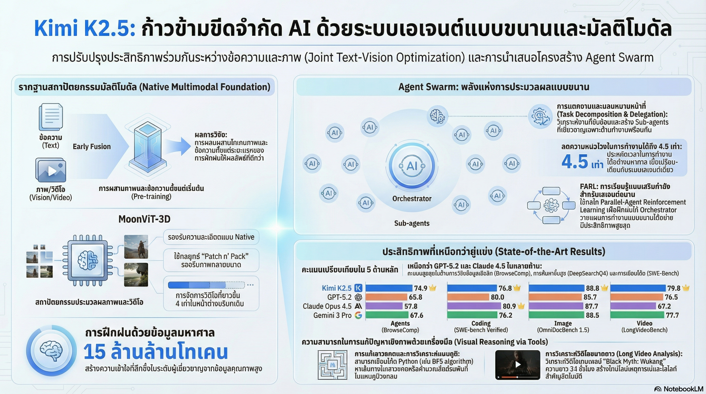

[กลับไปที่หน้าหลัก](../README.md)

สวัสดีครับเพื่อนๆ! วันนี้เรามาคุยเรื่องที่น่าตื่นเต้นมากๆ เกี่ยวกับ AI รุ่นใหม่ที่มาแรงจากจีนกันครับ นั่นก็คือ Kimi K2.5!

คุณเคยคิดไหมครับว่า AI ส่วนใหญ่ที่เราใช้กันอยู่ทำงานแบบ "ทีละอย่าง" เหมือนพนักงานคนเดียวที่ต้องทำงานหลายอย่างตามลำดับ? ช้า และเกิด "คอขวด" บ่อยๆ?

แต่ Kimi K2.5 มาพร้อมแนวคิดใหม่ นั่นคือ "กองทัพ AI" ที่ทำงานพร้อมกันได้หลายตัว! เหมือนมีทีมงานที่แต่ละคนเชี่ยวชาญต่างสาขา แล้วทำงานร่วมกันอย่างมีประสิทธิภาพ!

ผลลัพธ์? แซงหน้า GPT-5.2 และ Claude Opus 4.5 ในหลายๆ งานอย่างขาดลอย!

วันนี้เรามาดู 5 ความลับเบื้องหลัง Kimi K2.5 ที่จะเปลี่ยนโฉมหน้าโลกการทำงานกันครับ

========================================

🤔 ทบทวนปัญหาเดิม: AI แบบเดิมทำงานยังไง?

ก่อนที่เราจะไปดู Kimi K2.5 มาทำความเข้าใจปัญหาของ AI แบบเดิมก่อนนะครับ

=== AI แบบเดิม: Sequential (ทีละขั้นตอน) ===

ลักษณะการทำงาน:
▸ ทำงานทีละอย่างตามลำดับ
▸ จบงานหนึ่งแล้วค่อยทำงานถัดไป
▸ ไม่สามารถทำหลายอย่างพร้อมกันได้

เปรียบเทียบ: พนักงานคนเดียว
▸ ต้องทำทุกอย่างเอง
▸ ทำทีละอย่าง
▸ ช้า มีโอกาสผิดพลาด

=== ปัญหาที่เกิดขึ้น ===

[ปัญหาที่ 1: ช้า]
▸ ต้องรอให้แต่ละขั้นตอนเสร็จก่อน
▸ งานที่ซับซ้อนใช้เวลานาน

[ปัญหาที่ 2: คอขวด (Bottleneck)]
▸ เมื่อข้อมูลเยอะ ระบบช้าลง
▸ ประมวลผลไม่ทัน

[ปัญหาที่ 3: จำกัด Context Window]
▸ ไม่สามารถจัดการข้อมูลมหาศาลได้
▸ ต้องย่อข้อมูล สูญเสียรายละเอียด

=== ตัวอย่างงานที่ทำได้ไม่ดี ===

สมมติต้องวิเคราะห์วิดีโอ 24 ชั่วโมง (32 ไฟล์):

AI แบบเดิม:
▸ เปิดไฟล์ที่ 1 → วิเคราะห์ → บันทึก
▸ เปิดไฟล์ที่ 2 → วิเคราะห์ → บันทึก
▸ ...
▸ เปิดไฟล์ที่ 32 → วิเคราะห์ → บันทึก
▸ ใช้เวลานาน! อาจจะหลายชั่วโมง!

นี่คือปัญหาที่ Kimi K2.5 มาแก้ไข!

========================================

1. 🚀 Agent Swarm: จากอัจฉริยะเดี่ยวสู่กองทัพเอเจนต์

ความลับแรกและสำคัญที่สุดคือ Agent Swarm!

=== Agent Swarm คืออะไร? ===

Agent Swarm = กลุ่มเอเจนต์ที่ทำงานร่วมกันแบบขนาน (Parallel)

ส่วนประกอบ:
▸ Orchestrator (ตัวควบคุม) - สั่งการและจัดการงาน
▸ Sub-agents (เอเจนต์ย่อย) - ผู้เชี่ยวชาญเฉพาะด้าน

=== วิธีทำงาน ===

ขั้นตอนที่ 1: Orchestrator วิเคราะห์งาน
▸ รับงานที่ซับซ้อนเข้ามา
▸ แตกออกเป็น Sub-problems (ปัญหาย่อย)

ขั้นตอนที่ 2: มอบหมายงานให้ Sub-agents
▸ แต่ละ Sub-agent ได้งานที่เหมาะกับความเชี่ยวชาญ
▸ ทำงานพร้อมกัน (Parallel)!

ขั้นตอนที่ 3: รวมผลลัพธ์
▸ Sub-agents ส่งผลลัพธ์กลับมา
▸ Orchestrator รวมเป็นผลลัพธ์สุดท้าย

เปรียบเทียย:

[AI แบบเดิม]
▸ พนักงานคนเดียว ทำทุกอย่างเอง
▸ ช้า ใช้เวลานาน

[Kimi K2.5 Agent Swarm]
▸ ทีมงานหลายคน แต่ละคนเชี่ยวชาญต่างสาขา
▸ ทำงานพร้อมกัน
▸ เร็ว มีประสิทธิภาพ!

=== ผลลัพธ์ที่น่าทึ่ง ===

[ความเร็ว]
▸ ลด Latency (ความล่าช้า) สูงสุดถึง 4.5 เท่า!
▸ งานที่เคยใช้เวลาหลายชั่วโมง ทำเสร็จในไม่กี่นาที!

[Context Sharding]
▸ แบ่งข้อมูลให้แต่ละเอเจนต์ดูแล
▸ ก้าวข้ามขีดจำกัด Context Window
▸ รักษารายละเอียดได้แม่นยำกว่า

[คะแนนที่โดดเด่น]
▸ BrowseComp: 74.9 (Kimi K2.5)
▸ GPT-5.2: 59.2
▸ Claude Opus 4.5: 57.8
▸ ชนะขาดลอย!

"Agent Swarm เปลี่ยนความซับซ้อนของงานจากการขยายตัวแบบเส้นตรง เป็นการประมวลผลแบบขนานที่ทรงพลัง ทำให้งานวิจัยเชิงลึกที่เคยใช้เวลาหลายชั่วโมง จบลงได้ในไม่กี่นาที"

========================================

2. 🎨 Zero-vision SFT: ปลุกพลังการมองเห็นด้วยข้อความ

ความลับที่สองคือเทคนิคที่แปลกและน่าทึ่งมาก!

=== ปัญหาของ Multimodal AI แบบเดิม ===

AI ที่เห็นภาพได้ (Multimodal) แบบเดิม:
▸ ฝึกด้วยข้อความ → เก่ง
▸ เพิ่มความสามารถด้านภาพในภายหลัง → เพิ่มข้อมูลภาพในช่วง Fine-tuning

ปัญหา:
▸ ต้องสร้างข้อมูลภาพที่มนุษย์ออกแบบ (Human-designed visual trajectories)
▸ ใช้เวลาและทรัพยากรมาก
▸ อาจจะทำให้โมเดลขาดความยืดหยุ่น (Generalization)

=== วิธีของ Kimi K2.5: Zero-vision SFT ===

Zero-vision SFT = ฝึกด้วยข้อความล้วนๆ แต่กลับปลุกพลังการมองเห็น!

ฟังดูแปลกใช่ไหมครับ? มาดูว่าทำได้ยังไง

=== ความลับอยู่ที่ Native Multimodal Pre-training ===

Kimi K2.5 ทำ Native Multimodal Pre-training ตั้งแต่ต้น!

ขั้นตอน:

[ขั้นที่ 1: Pre-training]
▸ ฝึกด้วยข้อมูลมหาศาล 15 ล้านล้านโทเคน (15 Trillion Tokens)!
▸ ผสมผสานข้อความและภาพตั้งแต่วันแรก (Joint Optimization)
▸ ใช้สถาปัตยกรรม MoonViT-3D
▸ ความรู้ด้านการมองเห็นถูกฝังลึกในโมเดลแล้ว!

[ขั้นที่ 2: Post-training (SFT)]
▸ ฝึกด้วยข้อความล้วนๆ (Text-only SFT)
▸ ไม่ใส่ข้อมูลภาพที่มนุษย์ออกแบบ!

ผลลัพธ์:
▸ Text-only SFT กระตุ้น (Activate) ความรู้ด้านการมองเห็นที่ฝังไว้!
▸ โมเดลสามารถมองเห็นและใช้เครื่องมือได้!
▸ มีความยืดหยุ่นสูง ทำงานได้เป็นธรรมชาติและแม่นยำกว่า!

=== ทำไมถึงได้ผล? ===

เพราะ:
▸ พื้นฐานที่แข็งแกร่งจาก Pre-training
▸ ความรู้ด้านการมองเห็นฝังลึกอยู่แล้ว
▸ แค่ต้องการตัวกระตุ้น (Activation) ในช่วง Post-training
▸ Text-only SFT ทำหน้าที่เป็นตัวกระตุ้นได้ดีกว่าการใส่ภาพ!

ประโยชน์:
▸ ประหยัดเวลาและทรัพยากร
▸ ไม่ต้องสร้างข้อมูลภาพที่มนุษย์ออกแบบ
▸ ความยืดหยุ่นสูงกว่า

========================================

3. 🔄 Cross-modal Synergy: ยิ่งเห็นภาพเก่ง ยิ่งฉลาดเรื่องภาษา

ความลับที่สามคือ Cross-modal Transfer!

=== ปัญหาของ AI แบบเดิม: Trade-off ===

AI แบบเดิม:
▸ ฝึกให้เก่งด้านหนึ่ง → สูญเสียความสามารถอีกด้านหนึ่ง
▸ เช่น ฝึกให้เห็นภาพเก่ง → ความสามารถด้านภาษาลดลง

นี่คือ Trade-off = ต้องแลกเปลี่ยน

=== Kimi K2.5: Cross-modal Transfer ===

แต่ Kimi K2.5 ทำได้ตรงกันข้าม!

Cross-modal Transfer:
▸ ฝึก Reinforcement Learning (RL) ในโหมดการมองเห็น
▸ ไม่ได้ทำให้ฉลาดน้อยลงด้านภาษา
▸ แต่กลับช่วยเพิ่มประสิทธิภาพในงานตรรกะระดับสูง!

=== ผลการทดสอบที่น่าทึ่ง ===

หลังจากผ่านการฝึก Visual RL คะแนนในบททดสอบสุดหินเพิ่มขึ้น!

[MMLU-Pro]
▸ ก่อน Visual RL: 84.7
▸ หลัง Visual RL: 86.4
▸ เพิ่มขึ้น +1.7!

[GPQA-Diamond]
▸ ก่อน Visual RL: 84.3
▸ หลัง Visual RL: 86.4
▸ เพิ่มขึ้น +2.1!

=== ทำไมถึงเป็นแบบนี้? ===

การมองเห็นช่วยให้ AI:
▸ เข้าใจโครงสร้างข้อมูลได้ดีขึ้น
▸ นับเลขได้แม่นยำขึ้น
▸ สกัดข้อมูลเชิงโครงสร้างได้ดีขึ้น

ส่งผลกลับมาที่:
▸ ความเฉลียวฉลาดด้านภาษาเพิ่มขึ้น!
▸ ความสามารถด้านตรรกะดีขึ้น!

"การส่งเสริมซึ่งกันและกันนี้ — ข้อความช่วยกระตุ้นการมองเห็น และการมองเห็นช่วยขัดเกลาข้อความ — คือเครื่องหมายของความสำเร็จในการปรับจูนข้ามโหมดที่เหนือชั้น"

=== เปรียบเทียบกับ AI แบบเดิม ===

[AI แบบเดิม]
▸ ภาษาเก่ง ↔ ภาพเก่ง (แลกเปลี่ยนกัน)
▸ Trade-off

[Kimi K2.5]
▸ ภาษาเก่ง ↑ + ภาพเก่ง ↑ (ช่วยเสริมกัน)
▸ Synergy!

========================================

4. 🌟 Early Fusion: ปลูกฝังพื้นฐานมัลติโมเดลตั้งแต่ต้น

ความลับที่สี่คือ Early Fusion!

=== ความเชื่อเดิม: Late Fusion ===

AI แบบเดิมเชื่อว่า:
▸ ฝึกภาษาให้เก่งก่อน (Pre-training ด้วยข้อความ)
▸ แล้วค่อยเติมการมองเห็นในภายหลัง (Late Stage)

ปัญหา:
▸ โมเดล "ช็อก" เมื่อเจอข้อมูลต่างโหมด (Late-stage domain migration)
▸ ต้องใช้เวลาปรับตัว
▸ อาจจะไม่สมดุล

=== Kimi K2.5: Early Fusion ===

Kimi K2.5 ทำตรงกันข้าม!

Early Fusion:
▸ ผสมผสานภาพและข้อความตั้งแต่วันแรก!
▸ ใช้สัดส่วนที่คงที่ (Constant ratio) ตลอดการฝึก
▸ ใช้สถาปัตยกรรม MoonViT-3D

=== ประโยชน์ของ Early Fusion ===

[1] ตัวแทนความรู้ที่สมดุล
▸ โมเดลสร้าง "ตัวแทนความรู้" (Representation) ที่สมดุลตั้งแต่ต้น
▸ ภาษาและภาพเข้าใจกันดี

[2] ไม่เกิด Domain Shock
▸ โมเดลไม่ "ช็อก" เมื่อเจอข้อมูลต่างโหมด
▸ เพราะคุ้นเคยตั้งแต่วันแรก!

[3] มั่นคง
▸ ความรู้มั่นคง ไม่หว่านไหว
▸ ทำงานได้ดีในทุกโหมด

=== ผลการทดสอบ ===

[DeepSearchQA]
▸ Kimi K2.5: 77.1 (ชนะ!)
▸ GPT-5.2: 71.3
▸ Claude Opus 4.5: 76.1

ครองตำแหน่งผู้นำ!

=== เปรียบเทียบ ===

[Late Fusion] ← วิธีเดิม
▸ เริ่ม: ข้อความล้วน
▸ ภายหลัง: เพิ่มภาพ
▸ ปัญหา: ช็อก ไม่สมดุล

[Early Fusion] ← วิธีของ Kimi K2.5
▸ เริ่ม: ข้อความ + ภาพ ตั้งแต่วันแรก
▸ ภายหลัง: เพิ่มขึ้นเรื่อยๆ แต่คงสัดส่วน
▸ ผลลัพธ์: สมดุล มั่นคง!

========================================

5. 🎮 Automated Content Engineering: กรณีศึกษา Black Myth: Wukong

ความลับสุดท้ายคือการใช้งานจริงที่น่าทึ่ง!

=== โจทย์ที่ท้าทาย ===

วิเคราะห์วิดีโอเกมเพลย์ของเกม Black Myth: Wukong:
▸ ความยาว: 24 ชั่วโมง
▸ ขนาดไฟล์: 40GB
▸ จำนวนไฟล์: 32 ไฟล์แยกกัน

นี่คือโจทย์ที่ AI แบบเดิมทำได้ยากมาก!

=== วิธีของ Kimi K2.5: Agent Swarm ===

Orchestrator สั่งการ 32 Sub-agents ทำงานพร้อมกัน!

ขั้นตอน:

ขั้นที่ 1: แบ่งงาน
▸ Orchestrator แบ่งวิดีโอ 32 ไฟล์ให้ 32 Sub-agents
▸ แต่ละ Sub-agent รับผิดชอบ 1 ไฟล์

ขั้นที่ 2: วิเคราะห์พร้อมกัน
▸ ทั้ง 32 Sub-agents วิเคราะห์พร้อมกัน!
▸ ดูภาพ ฟังเสียง วิเคราะห์ UI
▸ สกัดข้อมูลสำคัญ

ขั้นที่ 3: รวมผลลัพธ์
▸ Orchestrator รวมข้อมูลจาก 32 Sub-agents
▸ สร้างผลลัพธ์สุดท้าย

=== ผลลัพธ์ที่ได้: Automated Content Engineering ===

ไม่ใช่แค่บทสรุปสั้นๆ แต่เป็นผลงานที่สมบูรณ์!

[1] Timeline เหตุการณ์]
▸ สร้างไทม์ไลน์เหตุการณ์ทั้งหมดอย่างแม่นยำ
▸ ระบุเวลาที่เกิดเหตุการณ์สำคัญ

[2] Level-up Timestamps
▸ ระบุวินาทีที่ผู้เล่นเลเวลอัป!
▸ จากการมองเห็น UI ในเกม
▸ แม่นยำมาก!

[3] Interactive HTML Artifact]
▸ ผลิตหน้าเว็บ Interactive HTML
▸ รวบรวมคลิปไฮไลท์
▸ กราฟวิเคราะห์เหตุการณ์
▸ พร้อมใช้งานทันที!

=== ความหมาย ===

นี่ไม่ใช่แค่การวิเคราะห์วิดีโอ แต่คือ:
▸ การสร้าง "ผลผลิต" (Artifact) ที่ซับซ้อน
▸ ทำงานที่เคยต้องใช้คนหลายคน หลายวัน
▸ ทำเสร็จในไม่กี่นาที!

=== การประยุกต์ใช้ในอนาคต ===

เทคนิคนี้สามารถนำไปใช้:

[1] การวิเคราะห์กล้องวงจรปิด
▸ วิเคราะห์กล้อง CCTV หลายตัวพร้อมกัน
▸ ระบุเหตุการณ์สำคัญ
▸ สร้างรายงานอัตโนมัติ

[2] การย่อยคลังเอกสารวิดีโอ
▸ องค์กรมีวิดีโอเก็บเยอะ
▸ ต้องการสรุปและจัดหมวดหมู่
▸ Kimi K2.5 ทำได้รวดเร็ว!

[3] การวิเคราะห์สื่อสังคมออนไลน์
▸ วิเคราะห์วิดีโอใน TikTok, YouTube
▸ หาเทรนด์ วิเคราะห์ความรู้สึก
▸ สร้างรายงานแบบ Real-time!

========================================

สรุป: อนาคตของ General Agentic Intelligence

หลังจากที่เราได้เห็น 5 ความลับของ Kimi K2.5 แล้ว มาสรุปกันครับ

=== สิ่งที่เราได้เรียนรู้ ===

[1] Agent Swarm: กองทัพเอเจนต์
▸ ทำงานแบบขนาน (Parallel)
▸ ลด Latency 4.5 เท่า
▸ ทำงานซับซ้อนได้เร็วกว่ามาก

[2] Zero-vision SFT: ปลุกพลังด้วยข้อความ
▸ ฝึกด้วยข้อความล้วน แต่ปลุกพลังการมองเห็น
▸ ประหยัดทรัพยากร มีความยืดหยุ่นสูง

[3] Cross-modal Synergy: ช่วยเสริมกัน
▸ ฝึกด้านหนึ่ง ช่วยเพิ่มอีกด้านหนึ่ง
▸ ไม่มี Trade-off แต่มี Synergy!

[4] Early Fusion: ผสมตั้งแต่ต้น
▸ ภาพและข้อความผสมกันตั้งแต่วันแรก
▸ สมดุล มั่นคง ไม่ช็อก

[5] Automated Content Engineering: ใช้งานจริง
▸ วิเคราะห์วิดีโอ 24 ชั่วโมง ในไม่กี่นาที
▸ สร้าง Artifact ที่พร้อมใช้งานทันที

=== ผลการทดสอบโดยรวม ===

Kimi K2.5 แซงหน้าคู่แข่งระดับโลก!

[BrowseComp]
▸ Kimi K2.5: 74.9
▸ GPT-5.2: 59.2
▸ Claude Opus 4.5: 57.8

[DeepSearchQA]
▸ Kimi K2.5: 77.1
▸ GPT-5.2: 71.3
▸ Claude Opus 4.5: 76.1

ชนะในหลายๆ งาน โดยเฉพาะงานด้านเอเจนต์!

=== การเปลี่ยนผ่านสู่ General Agentic Intelligence ===

Kimi K2.5 ไม่ใช่แค่การอัปเกรดเวอร์ชัน แต่คือ:
▸ การเปลี่ยนผ่านสู่ "General Agentic Intelligence" ที่แท้จริง
▸ AI ที่สามารถมองเห็น คิด และสร้างงานที่ซับซ้อนได้
▸ ทำงานแบบขนานด้วยประสิทธิภาพสูง

=== คำถามสำคัญสำหรับอนาคต ===

เมื่อเรามีกองทัพ AI ที่สามารถ:
▸ มองเห็น
▸ คิด
▸ สร้างงานที่ซับซ้อนแทนเรา
▸ ด้วยประสิทธิภาพที่สูงขึ้น 4.5 เท่า

บทบาทของมนุษย์ในฐานะ "Orchestrator" หรือผู้สั่งการกลยุทธ์จะต้องคมชัดเพียงใด?

=== บทบาทใหม่ของมนุษย์ ===

ในโลกที่ AI ทำงานแบบขนานได้:

[บทบาทเดิม]
▸ ทำงานด้วยตัวเอง
▸ ใช้ AI เป็นเครื่องมือช่วย

[บทบาทใหม่]
▸ เป็น "ผู้กำหนดเป้าหมาย" ที่ชาญฉลาด
▸ คุมบังเหียนกองทัพ AI
▸ สร้างมูลค่าสูงสุดให้กับโลกอนาคต

มนุษย์ต้องเปลี่ยนจาก:
▸ ผู้ปฏิบัติ → ผู้วางกลยุทธ์
▸ ผู้ทำงาน → ผู้สั่งการ
▸ ผู้แก้ปัญหา → ผู้กำหนดเป้าหมาย

=== ทักษะที่มนุษย์ต้องมี ===

ในอนาคต ทักษะที่สำคัญคือ:

[1] การกำหนดเป้าหมาย
▸ รู้ว่าต้องการอะไร
▸ วางเป้าหมายที่ชัดเจน

[2] การสั่งการ AI
▸ บอก AI ได้ชัดเจน
▸ แตกงานออกเป็นขั้นตอนที่ดี

[3] การประเมินผลลัพธ์
▸ ตรวจสอบว่า AI ทำได้ดีหรือเปล่า
▸ ปรับปรุงให้ดีขึ้น

[4] ความคิดสร้างสรรค์
▸ คิดสิ่งใหม่ๆ ที่ AI ยังคิดไม่ออก
▸ นวัตกรรม

[5] จริยธรรม
▸ ใช้ AI อย่างมีความรับผิดชอบ
▸ คำนึงถึงผลกระทบต่อสังคม

========================================

อ้างอิง:
• Kimi K2.5 Technical Report
• Agent Swarm Architecture
• Parallel-Agent Reinforcement Learning (PARL)
• MoonViT-3D
• Native Multimodal Pre-training

หวังว่าบทความนี้จะช่วยให้ทุกคนเห็นว่า Kimi K2.5 ไม่ใช่แค่ AI ตัวใหม่ แต่เป็นการเปลี่ยนแปลงครั้งใหญ่ของโลก AI ที่จะเปลี่ยนวิธีการทำงานของเราไปตลอดกาล!

ถ้ามีคำถามหรือความคิดเห็นเกี่ยวกับ Kimi K2.5 มาคุยกันได้เลยนะครับ 😊
