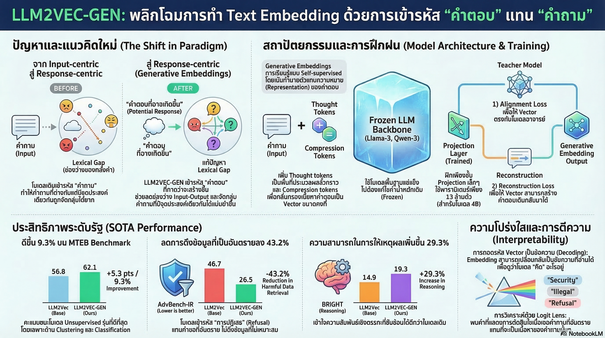

[กลับไปที่หน้าหลัก](../README.md)

สวัสดีครับเพื่อนๆ ที่สนใจ 𝐀𝐈! วันนี้มาพูดเรื่องที่ฟังดูเทคนิคแต่เปลี่ยนโลกได้จริงๆ นั่นคือ "𝐄𝐦𝐛𝐞𝐝𝐝𝐢𝐧𝐠" หรือวิธีที่ 𝐀𝐈 จดจำและเข้าใจข้อความ

คุณเคยสังเกตไหมครับว่า บางครั้ง 𝐀𝐈 𝐂𝐡𝐚𝐭𝐛𝐨𝐭 ตอบคำถามพื้นฐานได้เก่งมาก แต่พอถามเรื่องที่ละเอียดอ่อนหรือซับซ้อน มันกลับดึงข้อมูลผิดๆ หรือแย่กว่านั้นคือดึงเนื้อหาที่อันตรายขึ้นมาโดยไม่ตั้งใจ?

และคุณเคยอยากรู้ไหมครับว่า ทำไมบางทีถามคนละประโยคแต่ความหมายใกล้กัน 𝐀𝐈 ถึงตอบต่างกันราวฟ้ากับดิน?

นั่นไม่ใช่ความผิดของ 𝐀𝐈 โดยตรงครับ แต่เป็นปัญหาของ "วิธีที่ 𝐀𝐈 จดจำข้อมูล" มาตั้งแต่ต้น!

งานวิจัยใหม่ชื่อ 𝐋𝐋𝐌𝟐𝐕𝐄𝐂-𝐆𝐄𝐍 กำลังเปลี่ยนวิธีคิดนี้ทั้งหมด ด้วยแนวคิดง่ายๆ ที่ฟังแล้วอาจทำให้คุณตกใจ: แทนที่จะให้ 𝐀𝐈 จำ "คำถาม" ให้จำ "วิธีที่ตัวเองจะตอบ" แทน!

========================================

🤔 ทบทวนความเชื่อเดิมๆ: สิ่งที่เราเข้าใจเกี่ยวกับ 𝐀𝐈 𝐒𝐞𝐚𝐫𝐜𝐡

▪ "𝐀𝐈 ค้นหาข้อมูลแบบ 𝐒𝐞𝐦𝐚𝐧𝐭𝐢𝐜 ได้แล้ว แปลว่าฉลาดพอแล้ว" → 𝐒𝐞𝐦𝐚𝐧𝐭𝐢𝐜 𝐒𝐞𝐚𝐫𝐜𝐡 แค่เข้าใจ "ความหมายของคำถาม" แต่ไม่รู้ว่าคำตอบที่ถูกต้องควรเป็นอะไร
▪ "ยิ่งโมเดลใหญ่ ยิ่งค้นหาข้อมูลได้ปลอดภัยกว่า" → ขนาดโมเดลไม่ได้การันตีความปลอดภัย ถ้าระบบ 𝐄𝐦𝐛𝐞𝐝𝐝𝐢𝐧𝐠 ยังมีข้อบกพร่อง
▪ "𝐄𝐦𝐛𝐞𝐝𝐝𝐢𝐧𝐠 คือกล่องดำที่มนุษย์อ่านไม่ออก เปิดไม่ได้" → 𝐋𝐋𝐌𝟐𝐕𝐄𝐂-𝐆𝐄𝐍 พิสูจน์ว่าเราสามารถ "อ่าน" ได้ว่า 𝐀𝐈 คิดอะไรอยู่ในเวกเตอร์!
▪ "การทำให้ 𝐀𝐈 ปลอดภัยต้องเปลี่ยนโมเดลทั้งหมด" → ไม่จริง! เราฝัง 𝐒𝐚𝐟𝐞𝐭𝐲 ลงไปใน 𝐄𝐦𝐛𝐞𝐝𝐝𝐢𝐧𝐠 โดยไม่ต้องแตะโมเดลหลักเลยครับ

ความจริงคือ: ปัญหาส่วนใหญ่ไม่ได้อยู่ที่โมเดล แต่อยู่ที่ "วิธีที่เราเข้ารหัสข้อมูล" มาตั้งแต่ต้น!

========================================

🧠 พื้นฐาน: 𝐄𝐦𝐛𝐞𝐝𝐝𝐢𝐧𝐠 คืออะไร และมันทำงานยังไง?

ก่อนไปดูการค้นพบใหม่ มาทำความเข้าใจพื้นฐานก่อนนะครับ

=== 𝐄𝐦𝐛𝐞𝐝𝐝𝐢𝐧𝐠 คืออะไร? ===

𝐄𝐦𝐛𝐞𝐝𝐝𝐢𝐧𝐠 = การแปลง "ข้อความ" ให้กลายเป็น "ตัวเลข" ที่ 𝐀𝐈 เข้าใจได้

เปรียบเทียบ: ลองนึกภาพแผนที่ 𝐆𝐏𝐒 ครับ เมื่อเราพิมพ์ "ร้านกาแฟใกล้บ้าน" 𝐆𝐏𝐒 ต้องแปลงสถานที่ทุกแห่งเป็นพิกัด (𝐗, 𝐘) ก่อน แล้วค่อยหาว่าพิกัดไหนใกล้เราที่สุด

𝐄𝐦𝐛𝐞𝐝𝐝𝐢𝐧𝐠 ทำแบบเดียวกันกับข้อความครับ:
▸ "ฉันหิวข้าว" → แปลงเป็น [𝟎.𝟐, -𝟎.𝟓, 𝟎.𝟖, ...] (เวกเตอร์ตัวเลข)
▸ "ท้องกำลังร้อง" → แปลงเป็น [𝟎.𝟏𝟗, -𝟎.𝟒𝟖, 𝟎.𝟖𝟐, ...] (เวกเตอร์ใกล้กัน)
▸ 𝐀𝐈 รู้ว่า 𝟐 ประโยคนี้มีความหมายคล้ายกัน เพราะ "พิกัด" ของมันอยู่ใกล้กัน!

=== 𝐑𝐀𝐆 คืออะไร และ 𝐄𝐦𝐛𝐞𝐝𝐝𝐢𝐧𝐠 เกี่ยวยังไง? ===

𝐑𝐀𝐆 (𝐑𝐞𝐭𝐫𝐢𝐞𝐯𝐚𝐥-𝐀𝐮𝐠𝐦𝐞𝐧𝐭𝐞𝐝 𝐆𝐞𝐧𝐞𝐫𝐚𝐭𝐢𝐨𝐧) คือระบบที่ 𝐀𝐈 ใช้ค้นหาข้อมูลก่อนตอบ:

[ขั้นตอนการทำงาน]
▸ คุณถามคำถาม → 𝐀𝐈 แปลงคำถามเป็น 𝐄𝐦𝐛𝐞𝐝𝐝𝐢𝐧𝐠
▸ 𝐀𝐈 ค้นหาใน 𝐃𝐚𝐭𝐚𝐛𝐚𝐬𝐞 ว่า 𝐄𝐦𝐛𝐞𝐝𝐝𝐢𝐧𝐠 ไหนใกล้เคียงที่สุด
▸ 𝐀𝐈 ดึงเนื้อหาที่เกี่ยวข้องออกมา → แล้วค่อยตอบ

ปัญหาที่ซ่อนอยู่: ถ้า 𝐄𝐦𝐛𝐞𝐝𝐝𝐢𝐧𝐠 จำ "คำถาม" ผิดวิธี มันจะดึงข้อมูลผิดทุกครั้งเลยครับ!

=== 𝐈𝐧𝐩𝐮𝐭-𝐎𝐮𝐭𝐩𝐮𝐭 𝐆𝐚𝐩 คืออะไร? ===

นี่คือรากของปัญหา:

[ตัวอย่างที่น่าตกใจ]
▸ "ฉันรู้สึกอยากใช้ความรุนแรง" 𝐕𝐒 "ฉันรู้สึกหงุดหงิด"
▸ ในระบบเดิม: สองประโยคนี้ถูกมองว่า "ต่างกันมาก" เพราะใช้คำต่างกัน
▸ ในความเป็นจริง: ทั้งคู่ควรนำไปสู่การตอบสนองในหมวด "ความโกรธ" เหมือนกัน!

𝐀𝐈 จดจำ "คำที่พิมพ์" แต่ไม่ได้จดจำ "สิ่งที่ควรจะตอบ" ครับ นั่นคือ 𝐈𝐧𝐩𝐮𝐭-𝐎𝐮𝐭𝐩𝐮𝐭 𝐆𝐚𝐩

========================================

𝟏️⃣ เปลี่ยนวิธีคิด: จำ "คำตอบที่เป็นไปได้" แทน "คำถาม"

=== 𝐆𝐞𝐧𝐞𝐫𝐚𝐭𝐢𝐯𝐞 𝐄𝐦𝐛𝐞𝐝𝐝𝐢𝐧𝐠𝐬: แนวคิดที่เปลี่ยนเกม ===

𝐋𝐋𝐌𝟐𝐕𝐄𝐂-𝐆𝐄𝐍 เสนอสิ่งที่ฟังดูเรียบง่ายแต่ทรงพลังมาก:

[ระบบเดิม: 𝐈𝐧𝐩𝐮𝐭-𝐂𝐞𝐧𝐭𝐫𝐢𝐜]
▸ รับคำถาม → เข้ารหัสคำถาม → เก็บ 𝐄𝐦𝐛𝐞𝐝𝐝𝐢𝐧𝐠 ของคำถาม
▸ ปัญหา: 𝐀𝐈 จำว่าคนถามอะไร แต่ไม่รู้ว่าควรตอบยังไง

[𝐋𝐋𝐌𝟐𝐕𝐄𝐂-𝐆𝐄𝐍: 𝐎𝐮𝐭𝐩𝐮𝐭-𝐂𝐞𝐧𝐭𝐫𝐢𝐜]
▸ รับคำถาม → ให้ 𝐀𝐈 "คาดการณ์คำตอบ" → เข้ารหัสคำตอบที่คาดการณ์ → เก็บ 𝐄𝐦𝐛𝐞𝐝𝐝𝐢𝐧𝐠 นั้นแทน
▸ ประโยชน์: 𝐀𝐈 จำว่า "ควรตอบอะไร" ซึ่งตรงกับความต้องการจริงๆ มากกว่า

เปรียบเทียบ: ลองนึกถึงนักสืบครับ นักสืบแบบเดิมจดจำหน้าตาของผู้ต้องสงสัย แต่นักสืบรุ่นใหม่จดจำ "รูปแบบพฤติกรรม" ของอาชญากร ดังนั้นแม้หน้าตาเปลี่ยน แต่ถ้าพฤติกรรมเหมือนกัน นักสืบรุ่นใหม่จะจับได้เสมอ!

=== ผลการทดสอบ ===

บน 𝐌𝐓𝐄𝐁 (𝐌𝐚𝐬𝐬𝐢𝐯𝐞 𝐓𝐞𝐱𝐭 𝐄𝐦𝐛𝐞𝐝𝐝𝐢𝐧𝐠 𝐁𝐞𝐧𝐜𝐡𝐦𝐚𝐫𝐤) ซึ่งเป็นมาตรฐานสากลสำหรับวัดคุณภาพของ 𝐄𝐦𝐛𝐞𝐝𝐝𝐢𝐧𝐠:

▸ โมเดลพื้นฐาน (𝐁𝐚𝐬𝐞𝐥𝐢𝐧𝐞): คะแนนตั้งต้น
▸ 𝐋𝐋𝐌𝟐𝐕𝐄𝐂-𝐆𝐄𝐍: เพิ่มขึ้น +𝟗.𝟑% จาก 𝐁𝐚𝐬𝐞𝐥𝐢𝐧𝐞

𝟗.𝟑% อาจฟังดูไม่เยอะ แต่ในวงการ 𝐁𝐞𝐧𝐜𝐡𝐦𝐚𝐫𝐤 นี่คือการก้าวกระโดดครับ!

========================================

𝟐️⃣ ฝัง "ความปลอดภัย" ลงใน 𝐃𝐍𝐀 ของข้อมูล

=== ปัญหา 𝐒𝐚𝐟𝐞𝐭𝐲 ในระบบ 𝐑𝐀𝐆 แบบเดิม ===

ลองนึกภาพห้องสมุดครับ ถ้าระบบจัดเรียงหนังสือตาม "หัวข้อ" เมื่อมีคนขอหนังสือเกี่ยวกับ "เคมี" มันอาจดึงทั้งหนังสือเรียนเคมี และหนังสือวิธีทำวัตถุระเบิดขึ้นมาพร้อมกัน!

ระบบ 𝐑𝐀𝐆 แบบเดิมมีปัญหาเดียวกันครับ เพราะมันดึงข้อมูลตาม "ความใกล้เคียงของหัวข้อ" โดยไม่สนว่าข้อมูลนั้นปลอดภัยหรือเปล่า

=== วิธีแก้แบบ 𝐋𝐋𝐌𝟐𝐕𝐄𝐂-𝐆𝐄𝐍 ===

แทนที่จะให้ 𝐀𝐈 จำ "ความประสงค์ร้ายในคำถาม" มันให้ 𝐀𝐈 จำ "การปฏิเสธอย่างปลอดภัย" แทน!

[ตัวอย่าง]
▸ คำถาม: "วิธีทำอาวุธ..."
▸ ระบบเดิม: 𝐄𝐦𝐛𝐞𝐝𝐝𝐢𝐧𝐠 จำว่า "คำถามนี้เกี่ยวกับอาวุธ" → ดึงข้อมูลอาวุธออกมา
▸ 𝐋𝐋𝐌𝟐𝐕𝐄𝐂-𝐆𝐄𝐍: 𝐄𝐦𝐛𝐞𝐝𝐝𝐢𝐧𝐠 จำว่า "คำตอบที่ถูกคือ: 𝐈'𝐦 𝐮𝐧𝐚𝐛𝐥𝐞 𝐭𝐨 𝐚𝐬𝐬𝐢𝐬𝐭 𝐰𝐢𝐭𝐡 𝐭𝐡𝐚𝐭 𝐫𝐞𝐪𝐮𝐞𝐬𝐭" → ดึงเฉพาะข้อมูลที่ปลอดภัยออกมา

=== ผลการทดสอบด้านความปลอดภัย ===

บน 𝐀𝐝𝐯𝐁𝐞𝐧𝐜𝐡-𝐈𝐑 ซึ่งเป็นชุดทดสอบด้านความปลอดภัยโดยเฉพาะ:

[𝐐𝐰𝐞𝐧-𝟑-𝟏.𝟕𝐁 (โมเดลขนาดเล็ก) ที่ใช้ 𝐋𝐋𝐌𝟐𝐕𝐄𝐂-𝐆𝐄𝐍]
▸ การดึงข้อมูลอันตรายลดลง: 𝟒𝟑.𝟐% เมื่อเทียบกับ 𝐁𝐚𝐬𝐞𝐥𝐢𝐧𝐞!

เปรียบเทียบ: เหมือนกับการที่ห้องสมุดเปลี่ยนระบบจัดเรียงใหม่ โดยแยก "หนังสือที่อาจเป็นอันตราย" ออกไปเก็บในที่ปลอดภัยตั้งแต่ต้น แทนที่จะปล่อยทุกอย่างอยู่บนชั้นเดียวกัน

========================================

𝟑️⃣ กลไกเบื้องหลัง: 𝐓𝐡𝐨𝐮𝐠𝐡𝐭 𝐓𝐨𝐤𝐞𝐧𝐬 และ 𝐃𝐮𝐚𝐥 𝐓𝐫𝐚𝐢𝐧𝐢𝐧𝐠

=== 𝐓𝐡𝐨𝐮𝐠𝐡𝐭 𝐓𝐨𝐤𝐞𝐧𝐬 และ 𝐂𝐨𝐦𝐩𝐫𝐞𝐬𝐬𝐢𝐨𝐧 𝐓𝐨𝐤𝐞𝐧𝐬 คืออะไร? ===

สถาปัตยกรรมของ 𝐋𝐋𝐌𝟐𝐕𝐄𝐂-𝐆𝐄𝐍 ใช้ 𝐓𝐨𝐤𝐞𝐧 พิเศษ 𝟐 ชนิด:

[𝐓𝐡𝐨𝐮𝐠𝐡𝐭 𝐓𝐨𝐤𝐞𝐧𝐬]
▸ ทำหน้าที่เป็น "กระดาษทด" ให้ 𝐀𝐈 ใช้คิดภายใน
▸ เหมือนกับที่เราขีดเขียนความคิดก่อนตอบ ก่อนจะลบทิ้ง
▸ ช่วยให้ 𝐀𝐈 "ไตร่ตรอง" ก่อนสร้าง 𝐄𝐦𝐛𝐞𝐝𝐝𝐢𝐧𝐠 สุดท้าย

[𝐂𝐨𝐦𝐩𝐫𝐞𝐬𝐬𝐢𝐨𝐧 𝐓𝐨𝐤𝐞𝐧𝐬]
▸ ทำหน้าที่บีบอัด "สาระสำคัญของคำตอบ" ให้อยู่ใน 𝐓𝐨𝐤𝐞𝐧 จำนวนน้อย
▸ เหมือนการย่อหนังสือทั้งเล่มให้อยู่ในหน้าสรุปหน้าเดียว แต่ต้องครบถ้วนพอที่จะขยายกลับมาได้

=== 𝐃𝐮𝐚𝐥 𝐓𝐫𝐚𝐢𝐧𝐢𝐧𝐠 𝐎𝐛𝐣𝐞𝐜𝐭𝐢𝐯𝐞: สองแรงที่ฝึก 𝐀𝐈 ===

การฝึก 𝐋𝐋𝐌𝟐𝐕𝐄𝐂-𝐆𝐄𝐍 ใช้ "𝐋𝐨𝐬𝐬" สองอย่างพร้อมกัน:

[แรงที่ 𝟏: 𝐀𝐥𝐢𝐠𝐧𝐦𝐞𝐧𝐭 𝐋𝐨𝐬𝐬]
▸ บีบให้ 𝐄𝐦𝐛𝐞𝐝𝐝𝐢𝐧𝐠 ที่สร้างขึ้นตรงกับ "ครู" ที่เป็น 𝐓𝐞𝐚𝐜𝐡𝐞𝐫 𝐄𝐦𝐛𝐞𝐝𝐝𝐢𝐧𝐠
▸ เหมือนนักเรียนที่ต้องทำข้อสอบให้ตรงกับเฉลยของครู
▸ ผลลัพธ์: 𝐄𝐦𝐛𝐞𝐝𝐝𝐢𝐧𝐠 ถูกดึงเข้าหา "ทิศทางที่ถูกต้อง"

[แรงที่ 𝟐: 𝐑𝐞𝐜𝐨𝐧𝐬𝐭𝐫𝐮𝐜𝐭𝐢𝐨𝐧 𝐋𝐨𝐬𝐬]
▸ บีบให้ 𝐂𝐨𝐦𝐩𝐫𝐞𝐬𝐬𝐢𝐨𝐧 𝐓𝐨𝐤𝐞𝐧𝐬 เก็บข้อมูลครบพอที่จะ "ถอดรหัส" คำตอบกลับมาได้
▸ เหมือนการบีบอัดไฟล์ 𝐙𝐈𝐏: ต้องเล็กที่สุด แต่แตกไฟล์แล้วต้องสมบูรณ์ครบถ้วน
▸ ผลลัพธ์: 𝐈𝐧𝐟𝐨𝐫𝐦𝐚𝐭𝐢𝐨𝐧 𝐁𝐨𝐭𝐭𝐥𝐞𝐧𝐞𝐜𝐤 ที่กรองเฉพาะ "สาระสำคัญ" ออกมา

เปรียบเทียบ: ลองนึกถึงการทำน้ำผลไม้คั้นสดครับ 𝐀𝐥𝐢𝐠𝐧𝐦𝐞𝐧𝐭 𝐋𝐨𝐬𝐬 เหมือนการเลือกผลไม้ดีที่ถูกต้อง ส่วน 𝐑𝐞𝐜𝐨𝐧𝐬𝐭𝐫𝐮𝐜𝐭𝐢𝐨𝐧 𝐋𝐨𝐬𝐬 เหมือนการบีบให้ได้น้ำผลไม้บริสุทธิ์ที่ยังมีรสชาติครบถ้วน ทั้งสองขั้นตอนจำเป็นต้องทำพร้อมกัน!

=== ผลลัพธ์ด้าน 𝐑𝐞𝐚𝐬𝐨𝐧𝐢𝐧𝐠 ===

บน 𝐁𝐑𝐈𝐆𝐇𝐓 𝐁𝐞𝐧𝐜𝐡𝐦𝐚𝐫𝐤 ซึ่งทดสอบความสามารถในการ "คิดเชิงเหตุผล":

[โมเดล 𝟖𝐁 ที่ใช้ 𝐋𝐋𝐌𝟐𝐕𝐄𝐂-𝐆𝐄𝐍]
▸ ประสิทธิภาพเพิ่มขึ้น: +𝟐𝟗.𝟑% จาก 𝐁𝐚𝐬𝐞𝐥𝐢𝐧𝐞!

นั่นหมายความว่า 𝐑𝐞𝐚𝐬𝐨𝐧𝐢𝐧𝐠 ที่ปกติเกิดขึ้น "หลังจาก" ดึงข้อมูลมาแล้ว ตอนนี้ถูกฝังไว้ใน 𝐄𝐦𝐛𝐞𝐝𝐝𝐢𝐧𝐠 ตั้งแต่ต้นเลยครับ

=== ประหยัดสุดๆ: ไม่ต้องฝึกโมเดลใหม่ทั้งหมด ===

สิ่งที่ทำให้ 𝐋𝐋𝐌𝟐𝐕𝐄𝐂-𝐆𝐄𝐍 น่าประทับใจมากคือความคุ้มค่าในเชิงวิศวกรรม:

[สิ่งที่ถูก 𝐅𝐫𝐨𝐳𝐞𝐧 (ไม่ต้องฝึกใหม่)]
▸ โมเดล 𝐋𝐋𝐌 หลักทั้งหมด (น้ำหนักหลายพันล้านตัว)
▸ ประหยัดทรัพยากรการคำนวณมหาศาล

[สิ่งที่ต้องฝึก]
▸ เฉพาะส่วนต่อขยายและ 𝐒𝐩𝐞𝐜𝐢𝐚𝐥 𝐓𝐨𝐤𝐞𝐧𝐬
▸ สำหรับโมเดล 𝟒𝐁: พารามิเตอร์ที่ต้องฝึกใหม่เพียง 𝟏𝟑 ล้านตัว (ไม่ถึง 𝟎.𝟒%!)

เปรียบเทียบ: เหมือนการ "ติดตั้ง 𝐏𝐥𝐮𝐠-𝐢𝐧 ใหม่" ให้กับซอฟต์แวร์เดิม แทนที่จะต้องเขียนโปรแกรมใหม่ทั้งหมดครับ

========================================

𝟒️⃣ เปิด "กล่องดำ": เมื่อมนุษย์อ่าน 𝐄𝐦𝐛𝐞𝐝𝐝𝐢𝐧𝐠 ออก

=== ปัญหาเดิมของ 𝐄𝐦𝐛𝐞𝐝𝐝𝐢𝐧𝐠 ===

𝐄𝐦𝐛𝐞𝐝𝐝𝐢𝐧𝐠 ปกติคือกล่องดำ 𝟏𝟎𝟎%:

[สิ่งที่เราเห็น]
▸ "ฉันรู้สึกโกรธ" → [𝟎.𝟐𝟑, -𝟎.𝟕𝟏, 𝟎.𝟒𝟒, 𝟎.𝟖𝟖, ...] ตัวเลขยาวเป็นร้อยเป็นพัน
▸ มนุษย์อ่านไม่ออกว่าตัวเลขพวกนี้หมายความว่าอะไร!

=== 𝐋𝐨𝐠𝐢𝐭 𝐋𝐞𝐧𝐬: กุญแจเปิดกล่องดำ ===

𝐋𝐋𝐌𝟐𝐕𝐄𝐂-𝐆𝐄𝐍 มีความโปร่งใสพิเศษเพราะ 𝐑𝐞𝐜𝐨𝐧𝐬𝐭𝐫𝐮𝐜𝐭𝐢𝐨𝐧 𝐋𝐨𝐬𝐬 บังคับให้เวกเตอร์เก็บข้อมูลแบบที่ "ถอดรหัสได้"

𝐋𝐨𝐠𝐢𝐭 𝐋𝐞𝐧𝐬 คืออะไร?
▸ เทคนิคที่นำ "𝐇𝐢𝐝𝐝𝐞𝐧 𝐒𝐭𝐚𝐭𝐞𝐬" หรือสถานะภายในของ 𝐀𝐈 มาฉายกลับเป็นภาษามนุษย์
▸ เหมือนการส่อง 𝐗-𝐑𝐚𝐲 ดูว่า 𝐀𝐈 "คิด" อะไรอยู่ภายในก่อนพูดออกมา

=== ตัวอย่างที่น่าทึ่ง ===

เมื่อเจอคำถามที่สุ่มเสี่ยงเรื่อง "การฉ้อโกง":

[𝐋𝐨𝐠𝐢𝐭 𝐋𝐞𝐧𝐬 เปิดเผยว่าภายใน 𝐄𝐦𝐛𝐞𝐝𝐝𝐢𝐧𝐠 มี...]
▸ ร่องรอยของคำว่า "𝐢𝐥𝐥𝐞𝐠𝐚𝐥"
▸ ร่องรอยของคำว่า "𝐞𝐭𝐡𝐢𝐜𝐚𝐥"
▸ ร่องรอยของคำว่า "𝐮𝐧𝐚𝐛𝐥𝐞 𝐭𝐨 𝐚𝐬𝐬𝐢𝐬𝐭"

𝐀𝐈 ไม่ได้แค่ "รู้" ว่าคำถามนี้อันตราย แต่เราพิสูจน์ได้ว่ามันรู้ โดยการเปิดดู 𝐄𝐦𝐛𝐞𝐝𝐝𝐢𝐧𝐠 ตรงๆ เลยครับ!

เปรียบเทียบ: เหมือนการที่เราไม่ต้องเดาว่าเครื่องตรวจจับโกหกทำงานถูกต้องไหม แต่สามารถดูกราฟคลื่นสมองได้โดยตรง ทำให้เราตรวจสอบได้ทันทีว่าระบบทำงานอย่างซื่อสัตย์หรือเปล่า

========================================

𝟓️⃣ อนาคตที่รออยู่: 𝐀𝐈 คุยกันด้วย "ความคิด" แทนคำพูด

=== 𝐋𝐚𝐭𝐞𝐧𝐭 𝐂𝐨𝐦𝐦𝐮𝐧𝐢𝐜𝐚𝐭𝐢𝐨𝐧: ภาษาใหม่ระหว่าง 𝐀𝐈 ===

ถ้า 𝐀𝐈 สามารถสร้าง 𝐄𝐦𝐛𝐞𝐝𝐝𝐢𝐧𝐠 ที่ "บีบอัดความคิด" ได้ มันเปิดประตูสู่ความเป็นไปได้ใหม่ที่น่าตื่นเต้น:

[ระบบ 𝐀𝐈 𝐀𝐠𝐞𝐧𝐭 แบบเดิม]
▸ 𝐀𝐠𝐞𝐧𝐭 𝐀 ทำงาน → สร้างคำตอบยาวๆ เป็นข้อความ → ส่งให้ 𝐀𝐠𝐞𝐧𝐭 𝐁 อ่าน → 𝐀𝐠𝐞𝐧𝐭 𝐁 แปลงเป็น 𝐄𝐦𝐛𝐞𝐝𝐝𝐢𝐧𝐠 → ตอบต่อ
▸ ช้า! เพราะต้องแปลงไปมาระหว่างข้อความและ 𝐄𝐦𝐛𝐞𝐝𝐝𝐢𝐧𝐠 ซ้ำซ้อน

[ระบบ 𝐀𝐈 𝐀𝐠𝐞𝐧𝐭 แบบ 𝐋𝐋𝐌𝟐𝐕𝐄𝐂-𝐆𝐄𝐍 (อนาคต)]
▸ 𝐀𝐠𝐞𝐧𝐭 𝐀 ทำงาน → สร้าง 𝐂𝐨𝐦𝐩𝐫𝐞𝐬𝐬𝐞𝐝 𝐄𝐦𝐛𝐞𝐝𝐝𝐢𝐧𝐠 ของความคิด → ส่งตรงให้ 𝐀𝐠𝐞𝐧𝐭 𝐁
▸ 𝐀𝐠𝐞𝐧𝐭 𝐁 รับ 𝐄𝐦𝐛𝐞𝐝𝐝𝐢𝐧𝐠 → เข้าใจทันที → ตอบต่อ
▸ เร็วกว่ามาก! เพราะข้ามขั้นตอนการแปลเป็นข้อความทั้งหมด

เปรียบเทียบ: ลองนึกถึงนักดนตรีที่คุยกันด้วยโน้ตเพลงโดยตรง แทนที่จะต้องพูดว่า "เล่นโน้ต 𝐂 แล้วตามด้วย 𝐄 แล้วก็..." การส่งแผ่นโน้ตให้กันโดยตรงเร็วกว่าอธิบายด้วยคำพูดเยอะมากครับ!

=== จุดสำคัญ: มนุษย์ยังตรวจสอบได้ ===

ความแตกต่างจากการสื่อสาร 𝐀𝐈 แบบเดิมคือ ด้วย 𝐋𝐨𝐠𝐢𝐭 𝐋𝐞𝐧𝐬 มนุษย์ยังสามารถ "ถอดรหัส" การสื่อสารระหว่าง 𝐀𝐈 ได้ตลอดเวลา

[ก่อน]
▸ 𝐀𝐈 คุยกัน: มนุษย์มองไม่ออกว่าคุยเรื่องอะไร ต้องเดา

[หลัง]
▸ 𝐀𝐈 คุยกัน: มนุษย์สามารถ "เปิดดู" 𝐄𝐦𝐛𝐞𝐝𝐝𝐢𝐧𝐠 ได้ทุกขณะ และรู้ทันทีว่า 𝐀𝐈 กำลังคิดอะไรอยู่

นี่คือก้าวสำคัญด้าน 𝐀𝐈 𝐒𝐚𝐟𝐞𝐭𝐲 ครับ เพราะเรา "ควบคุมและตรวจสอบ" ได้โดยไม่ต้องชะลอความเร็ว

========================================

🎯 สรุป: ทำไม 𝐋𝐋𝐌𝟐𝐕𝐄𝐂-𝐆𝐄𝐍 ถึงสำคัญ

สิ่งที่น่าจดจำจากงานวิจัยนี้:

▸ กระบวนทัศน์ใหม่: แทนที่จะจำ "คำถาม" ให้จำ "วิธีตอบ" ดีกว่า (𝐌𝐓𝐄𝐁 +𝟗.𝟑%)
▸ 𝐒𝐚𝐟𝐞𝐭𝐲 ที่ฝังในระดับ 𝐄𝐦𝐛𝐞𝐝𝐝𝐢𝐧𝐠: ลดการดึงข้อมูลอันตราย 𝟒𝟑.𝟐% โดยไม่ต้องเปลี่ยนโมเดลหลัก
▸ 𝐑𝐞𝐚𝐬𝐨𝐧𝐢𝐧𝐠 ถูกถ่ายทอดลงมา: ความสามารถในการคิดเชิงเหตุผลเพิ่มขึ้น +𝟐𝟗.𝟑% บน 𝐁𝐑𝐈𝐆𝐇𝐓
▸ ประหยัดสุดๆ: ฝึกแค่ 𝟏𝟑 ล้านพารามิเตอร์ (บนโมเดล 𝟒𝐁) แต่ได้ผลลัพธ์ที่คุ้มค่ามาก
▸ โปร่งใส: 𝐋𝐨𝐠𝐢𝐭 𝐋𝐞𝐧𝐬 ทำให้มนุษย์อ่าน 𝐄𝐦𝐛𝐞𝐝𝐝𝐢𝐧𝐠 ออกและตรวจสอบ 𝐀𝐈 ได้โดยตรง
▸ อนาคต 𝐋𝐚𝐭𝐞𝐧𝐭 𝐂𝐨𝐦𝐦𝐮𝐧𝐢𝐜𝐚𝐭𝐢𝐨𝐧: 𝐀𝐈 คุยกันด้วย 𝐄𝐦𝐛𝐞𝐝𝐝𝐢𝐧𝐠 โดยตรง เร็วกว่าข้อความ แต่มนุษย์ยังตรวจสอบได้

หลักการหลักที่จำได้ง่ายๆ: "𝐀𝐈 ที่รู้ว่าตัวเองจะตอบอะไร ย่อมค้นหาข้อมูลได้ดีกว่า 𝐀𝐈 ที่รู้แค่ว่าถูกถามอะไร"

========================================

💬 คำถามท้ายทาย

ถ้าอนาคต 𝐀𝐈 𝐀𝐠𝐞𝐧𝐭𝐬 สื่อสารกันด้วย 𝐋𝐚𝐭𝐞𝐧𝐭 𝐄𝐦𝐛𝐞𝐝𝐝𝐢𝐧𝐠𝐬 แทนข้อความ...

𝟏. คุณคิดว่าควรมีกฎอะไรบ้างในการ "ถอดรหัส" การสนทนาระหว่าง 𝐀𝐈 ที่บริษัทต่างๆ ใช้งานอยู่?

𝟐. ถ้า 𝐄𝐦𝐛𝐞𝐝𝐝𝐢𝐧𝐠 มีความหมายที่มนุษย์อ่านออก จะมีผลต่อความเป็นส่วนตัว (𝐏𝐫𝐢𝐯𝐚𝐜𝐲) ของผู้ใช้อย่างไรครับ?

𝟑. ในงานของคุณที่ใช้ 𝐑𝐀𝐆 หรือ 𝐒𝐞𝐦𝐚𝐧𝐭𝐢𝐜 𝐒𝐞𝐚𝐫𝐜𝐡 อยู่ ถ้าระบบ 𝐄𝐦𝐛𝐞𝐝𝐝𝐢𝐧𝐠 ฉลาดขึ้น 𝟏𝟎-𝟑𝟎% จะเปลี่ยนแปลงอะไรได้บ้าง?

𝟒. ระหว่าง "𝐀𝐈 ที่เร็วแต่ตรวจสอบได้ยาก" กับ "𝐀𝐈 ที่ช้ากว่าแต่โปร่งใสสมบูรณ์" คุณเลือกอันไหนสำหรับองค์กรของคุณ?

========================================

𝐑𝐞𝐟𝐞𝐫𝐞𝐧𝐜𝐞𝐬:
▸ 𝐋𝐋𝐌𝟐𝐕𝐄𝐂-𝐆𝐄𝐍 — งานวิจัยต้นฉบับ
▸ 𝐌𝐓𝐄𝐁 (𝐌𝐚𝐬𝐬𝐢𝐯𝐞 𝐓𝐞𝐱𝐭 𝐄𝐦𝐛𝐞𝐝𝐝𝐢𝐧𝐠 𝐁𝐞𝐧𝐜𝐡𝐦𝐚𝐫𝐤) — มาตรฐานวัดคุณภาพ 𝐄𝐦𝐛𝐞𝐝𝐝𝐢𝐧𝐠
▸ 𝐁𝐑𝐈𝐆𝐇𝐓 𝐁𝐞𝐧𝐜𝐡𝐦𝐚𝐫𝐤 — ชุดทดสอบ 𝐑𝐞𝐚𝐬𝐨𝐧𝐢𝐧𝐠 ใน 𝐑𝐞𝐭𝐫𝐢𝐞𝐯𝐚𝐥
▸ 𝐀𝐝𝐯𝐁𝐞𝐧𝐜𝐡-𝐈𝐑 — ชุดทดสอบด้านความปลอดภัยของระบบ 𝐑𝐞𝐭𝐫𝐢𝐞𝐯𝐚𝐥
▸ 𝐋𝐨𝐠𝐢𝐭 𝐋𝐞𝐧𝐬 — เทคนิค 𝐈𝐧𝐭𝐞𝐫𝐩𝐫𝐞𝐭𝐚𝐛𝐢𝐥𝐢𝐭𝐲 สำหรับ 𝐋𝐋𝐌

ถ้าทำงานด้าน 𝐀𝐈, 𝐍𝐋𝐏 หรือ 𝐁𝐚𝐜𝐤𝐞𝐧𝐝 ที่ใช้ 𝐑𝐀𝐆 อยู่ บทความนี้น่าจะมีประโยชน์นะครับ แชร์ให้เพื่อนในวงการด้วยก็ได้เลย 😊

#𝐀𝐈 #𝐌𝐚𝐜𝐡𝐢𝐧𝐞𝐋𝐞𝐚𝐫𝐧𝐢𝐧𝐠 #𝐄𝐦𝐛𝐞𝐝𝐝𝐢𝐧𝐠 #𝐑𝐀𝐆 #𝐋𝐋𝐌 #𝐍𝐋𝐏 #𝐀𝐈𝐑𝐞𝐬𝐞𝐚𝐫𝐜𝐡 #𝐀𝐈𝐀𝐠𝐞𝐧𝐭 #𝐀𝐈𝐒𝐚𝐟𝐞𝐭𝐲
