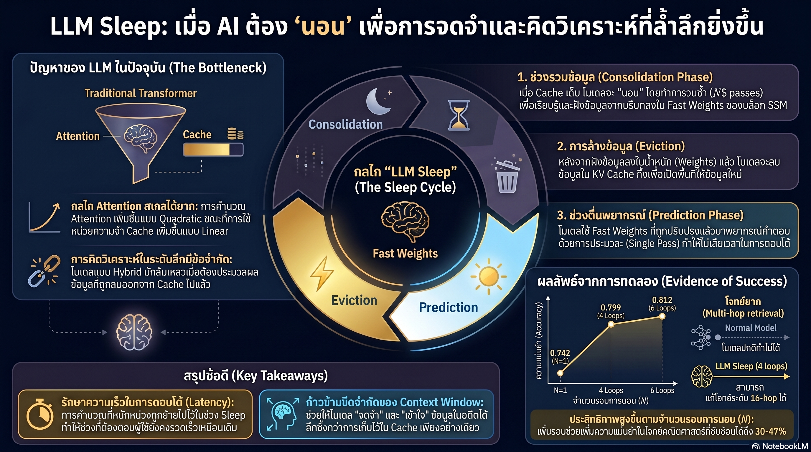

[กลับไปที่หน้าหลัก](../README.md)

สวัสดีครับเพื่อนๆ ที่ติดตามวงการ AI! วันนี้มาเรื่องที่อาจทำให้ทุกคนรู้สึกดีขึ้นมากครับ: "LLM Sleep — งานวิจัย arXiv:2605.26099 ที่พิสูจน์ว่าไม่ใช่แค่มนุษย์เท่านั้นที่ต้องการนอนหลับ AI ก็ต้องการเช่นกัน และยิ่งนอนนานยิ่งฉลาดขึ้น" ครับ

คุณเคยสังเกตไหมครับว่า ในขณะที่คนส่วนใหญ่เชื่อว่า AI ไม่มีวันต้องการ Downtime เพราะมัน "ทำงานได้ตลอด 24 ชั่วโมง" — ปัญหาจริงๆ ที่ Transformer กำลังเผชิญกลับเป็นเรื่องของ "คุณภาพความคิด" ไม่ใช่ "ปริมาณข้อมูล" ครับ? เพราะการประมวลผลแบบ Single Forward Pass มีขีดจำกัดทางคณิตศาสตร์ที่ไม่สามารถแก้ได้ด้วยการเพิ่ม Context Window เพียงอย่างเดียวครับ

คุณรู้ไหมครับว่า Hippocampus ในสมองมนุษย์ระหว่างนอนหลับจะวนเล่น (Replay) ความจำระยะสั้นซ้ำหลายรอบเพื่อส่งต่อไปฝังเป็น Synaptic Weights ในเปลือกสมอง — และนักวิจัยได้จำลองกลไกนี้ให้กับ LLM จนได้ผลลัพธ์ที่น่าตกใจมากครับ? โมเดล 1.4B ที่ "นอน" 4 รอบ ทำคณิตศาสตร์ 6 ขั้นตอนได้ดีขึ้นจาก 41.9% เป็น 61.5% โดยไม่ต้องเพิ่มพารามิเตอร์แม้แต่ตัวเดียวครับ

และคุณเคยนึกไหมครับว่า ถ้า KV Cache คือ "ความจำระยะสั้น" ที่แพงมากและหมดเร็ว แทนที่จะ Flush ทิ้งเมื่อ Context Window เต็ม เราสามารถเปลี่ยนมันให้กลายเป็น "ความรู้ถาวร" ที่ฝังอยู่ในพารามิเตอร์ได้ผ่านกระบวนการที่เรียกว่า Offline Recurrence — แล้ว Inference Speed ก็ยังคง O(1) เหมือนเดิมครับ? เหมือนคนที่อ่านหนังสือตลอดคืน ตื่นมาไม่จำอะไร กับคนที่นอนให้พอแล้วตอบข้อสอบได้ฉลุยครับ

งานวิจัยนี้กำลังบอกว่า: "ความฉลาดที่ยั่งยืนไม่ได้มาจากการไม่ยอมหยุดพัก แต่มาจากการรู้จักให้เวลาตกผลึกสิ่งที่เรียนรู้มา — ไม่ว่าจะเป็นมนุษย์หรือ AI" ครับ

========================================

🤔 ทบทวนความเชื่อเดิมๆ: สิ่งที่เราคิดเกี่ยวกับ AI และการหยุดพัก

▪ "AI ไม่เหมือนมนุษย์ ไม่ต้องการ Downtime เพราะไม่มีความเหนื่อยล้า — ยิ่ง Run ต่อเนื่องยิ่งดี" → Serial Scaling Hypothesis พิสูจน์ตรงข้ามครับ โจทย์ที่ต้องคิด N ขั้นตอนตามลำดับนั้นมีขีดจำกัดทางคณิตศาสตร์ใน Single Forward Pass — AI ที่ตอบทันทีโดยไม่มีเวลา "ตกผลึก" เหมือนนักเรียนที่ทำข้อสอบโดยไม่ได้อ่านหนังสือเลย ยิ่งโจทย์ซับซ้อนยิ่งเจ๊งครับ

▪ "เพิ่ม Context Window ให้ยาวขึ้น = โมเดลฉลาดขึ้น — ยิ่งจำได้มากยิ่งดี" → Memory ที่ยาวขึ้นเหมือนถังน้ำที่ใหญ่ขึ้น แต่ถ้ากวนไม่เป็น น้ำก็ยังขุ่นเหมือนเดิมครับ ปัญหาคือ Reasoning Depth ไม่ใช่ความจุ โมเดลที่จำได้ทุกอย่างแต่ไม่ได้ "ตกผลึก" ก็ยังล้มเหลวในโจทย์ Multi-hop ที่ซับซ้อนได้ครับ

▪ "KV Cache เต็มแล้วก็ Flush ทิ้งไป แล้วเริ่มใหม่ — วิธีที่ง่ายที่สุดคือวิธีที่ดีที่สุด" → การทิ้ง KV Cache โดยไม่ประมวลซ้ำเหมือนการลืมทุกอย่างที่อ่านมาทั้งวันก่อนนอนครับ Offline Recurrence แสดงให้เห็นว่าการ "ย่อยซ้ำ" ข้อมูลใน KV Cache ผ่าน N รอบก่อน Flush ทำให้ความรู้ถูกถ่ายโอนเป็น Fast Weights ที่ถาวรกว่ามากครับ

▪ "Train ช้าลงเป็นสิ่งที่ยอมรับไม่ได้ในทางวิศวกรรม — Parallelism สูงสุดคือเป้าหมายเสมอ" → นี่คือ Trade-off ที่คุ้มค่าครับ Offline Recurrence ทำให้ Training Parallelism ลดลงบ้าง แต่ Inference ยังคง O(1) เหมือนเดิม — โมเดลที่ "นอนหลับระหว่างเทรน" ให้ Sliding Window Retrieval ที่ดีขึ้นถึง 52% ในเวลาใช้งานจริงครับ

ความจริงที่น่าขำและน่าคิดพร้อมกันคือ: "กลยุทธ์ที่ดีที่สุดสำหรับ AI อาจเป็นสิ่งเดียวกับที่พ่อแม่บอกเราตั้งแต่เด็ก — นอนให้พอก่อนสอบ" ครับ

========================================

🧠 พื้นฐานที่ต้องเข้าใจก่อน: Serial Scaling Hypothesis, Offline Recurrence, Fast Weights, และทำไม "นอนนาน" จึงได้คะแนนสูงกว่า

=== Serial Scaling Hypothesis: ปัญหาที่ Context Window ใหญ่ขึ้นแก้ไม่ได้ ===

ทุกคนรู้ว่า Transformer มี Quadratic Attention Complexity แต่ปัญหาที่งานวิจัยนี้ชี้ไปมีความละเอียดกว่านั้นครับ

ปัญหาที่แท้จริงไม่ใช่แค่ความแพงของ Computation — แต่คือ "คอขวดเชิงตรรกะ" ครับ โจทย์ที่ต้องทำขั้นตอน A ก่อนถึงจะทำขั้นตอน B ได้ (Sequential Dependency) ไม่สามารถ "ข้ามขั้น" ได้ในการประมวลผลรอบเดียวครับ เหมือนที่มนุษย์ไม่สามารถแก้โจทย์คณิตศาสตร์ 10 ขั้นตอนได้ในเสี้ยววินาที ไม่ใช่เพราะสมองช้า แต่เพราะแต่ละขั้นตอนต้องรอผลของขั้นก่อนหน้าครับ

Hybrid Architecture อย่าง SSM-Attention ที่ออกแบบมาเพื่อเพิ่มความจุความจำ ก็ยังล้มเหลวในโจทย์ Multi-hop Reasoning ประเภทนี้ครับ บอกให้เราเข้าใจว่า "ความจำที่มากขึ้น" ไม่ใช่คำตอบ — "รอบการคิดที่ต่อเนื่องกัน" ต่างหากที่ขาดอยู่ครับ

=== Offline Recurrence: จำลอง "การนอนหลับ" ให้กับ LLM ===

นักวิจัยออกแบบกลไก LLM Sleep โดยอ้างอิงตรงจากชีววิทยาครับ:

ในสมองมนุษย์ระหว่างนอนหลับ Hippocampus จะวนเล่นความจำซ้ำ (Hippocampal Replay) แล้วส่งต่อข้อมูลเหล่านั้นไปฝังเป็น Synaptic Weights ในเปลือกสมอง ทำให้ความจำระยะสั้นกลายเป็นทักษะที่ฝังลึกครับ เหมือนที่นักเรียนที่นอนหลับหลังเรียนจำสูตรได้ดีกว่าคนที่อดนอนอ่านหนังสือต่อถึงดึกครับ

LLM Sleep เกิดขึ้นเมื่อ Context Window เต็ม แทนที่จะ Flush KV Cache ทิ้ง โมเดลจะเข้าสู่โหมด Offline และทำสิ่งเหล่านี้ครับ:

รอบ Recurrent Passes: วนประมวลผลข้อมูลเดิมใน KV Cache ซ้ำ N รอบ โดยไม่รับ Input ใหม่เลย เหมือนสมองที่หลับตาแล้วทบทวนสิ่งที่เรียนมาทั้งวันครับ

Fast Weights Update ผ่าน Learned Local Rule: ในแต่ละรอบ ข้อมูลจาก KV Cache จะถูกถ่ายโอนไปยัง SSM Blocks ผ่านกฎการเรียนรู้เฉพาะจุดที่โมเดลเรียนรู้เองระหว่าง Training ครับ ผลลัพธ์คือ "Fast Weights" ที่รวดเร็วและฝังความรู้ไว้ในพารามิเตอร์

ตื่นนอนพร้อมใช้งาน: เมื่อวน N รอบครบ KV Cache จะถูกล้างให้ว่าง แต่ความรู้ที่ตกผลึกแล้วอยู่ในพารามิเตอร์เรียบร้อยครับ พร้อมตอบคำถามด้วย Single Forward Pass ความเร็วเต็มโดยไม่ต้องรอ Chain-of-Thought ยาวๆ ตอน Inference

=== ยิ่งนอนนาน ยิ่งได้คะแนนสูง: ตัวเลขจากการทดลองจริง ===

งานวิจัยทดสอบโดยเพิ่มจำนวนรอบการ "นอน" (N) แล้ววัดผลกับโจทย์สามประเภทครับ:

Rule 110 Cellular Automaton (ทำนาย 32 ขั้นตอนล่วงหน้า): โมเดลที่ไม่นอนเลยทำได้ใกล้เคียงการสุ่ม ส่วนโมเดลที่นอน 4 รอบทำได้ดีขึ้นกว่า 30% ภายใต้ FLOPs Budget เท่ากันครับ

16-hop Graph Retrieval (ค้นหาเส้นทางใน 16 ทอด): มีเพียงโมเดลที่ผ่านการนอนเท่านั้นที่เริ่ม "เข้าใจ" โครงสร้างกราฟได้ครับ โมเดลที่ไม่นอนล้มเหลวโดยสิ้นเชิง บอกว่าโจทย์บางประเภทมีขีดจำกัดแบบ Hard Limit ที่ไม่อาจแตะได้โดยไม่มี Offline Processing ครับ

GSM-Infinite คณิตศาสตร์ (โมเดลขนาดที่ใช้งานจริง): Ouro 1.4B ในโจทย์ 6 ขั้นตอน ทำได้จาก 41.9% → 61.5% ด้วยการนอน 4 รอบ ซึ่งคิดเป็นการพัฒนา 47% โดยไม่ต้องเพิ่มพารามิเตอร์แม้แต่ตัวเดียวครับ

และข้อดีสำคัญที่สุดที่ทำให้กลไกนี้ Deploy ได้จริงครับ: O(1) Inference Latency ยังคงเดิม เพราะโมเดล "คิดล่วงหน้า" ไปแล้วระหว่างนอน ผู้ใช้ที่ถามคำถามจะไม่รู้สึกช้าขึ้นเลยครับ ทั้งยังเพิ่ม Sliding Window Retrieval ได้ 52% เทียบกับ Hybrid Model ปกติครับ

=== Trade-off ที่ต้องยอมรับ: ช้าลงตอนสอน เพื่อฉลาดขึ้นตอนตอบ ===

Offline Recurrence มีต้นทุนที่ซื่อสัตย์ครับ: Training ทำ Full Parallelism ได้ยากลงกว่าเดิม เพราะแต่ละรอบการนอนต้องรอผลของรอบก่อนหน้า ซึ่งเป็น Sequential Dependency เช่นเดียวกับโจทย์ที่มันถูกออกแบบมาเพื่อแก้ครับ

แต่นี่คือ Trade-off ที่นักวิจัยเชื่อว่าคุ้มค่าครับ เพราะ Training เกิดครั้งเดียว แต่ Inference เกิดหลายล้านครั้ง การยอมช้าลงตอนเทรนเพื่อให้ได้โมเดลที่ฉลาดขึ้น 47% ในการใช้งานจริงนั้น ในแง่เศรษฐศาสตร์แล้วน่าสนใจมากครับ

========================================

🎯 ประเด็นที่ควรคิดต่อ

— Serial Scaling Hypothesis เปลี่ยน Roadmap ของ AI ได้จริงหรือไม่: ถ้าโจทย์ Sequential จำนวนมากมีขีดจำกัดแบบ Hard Limit ใน Single-pass Architecture นั่นหมายความว่า AI ที่ฉลาดจริงๆ ในอนาคตจะต้องมี Asynchronous Thinking เป็น Default ไม่ใช่ Synchronous แบบที่เราคุ้นเคยครับ วิธีที่เราออกแบบ System รอบ AI อาจต้องเปลี่ยนไปอย่างมากครับ

— O(1) Inference หลัง Offline Pass คือ Design Pattern ที่สำคัญมาก: แนวคิดว่า "คิดให้หนักก่อนใช้งาน แล้วตอบได้เร็วตอน Deploy" ไม่ได้ใหม่สำหรับวิศวกรรมซอฟต์แวร์ แต่การนำมาใช้กับ Neural Network Level แบบ Automatic ผ่าน Learned Local Rule เป็นก้าวที่น่าสนใจมากครับ และอาจ Generalize ได้กว้างกว่าแค่ LLM

— คำถามที่ทิ้งไว้: ถ้า AI ต้องมีช่วง "Offline" เพื่อตกผลึกความรู้เป็นระยะ — Infrastructure สำหรับระบบ AI จริงๆ ควรออกแบบรอบ Sleeping Cycle นี้อย่างไรครับ? และถ้าวันหนึ่งโมเดลที่ฉลาดที่สุดต้อง "นอน 8 ชั่วโมง" ก่อนเปิดรับ Query รอบถัดไป เราพร้อมยอมรับนิยามใหม่ของ "Real-time AI" มากแค่ไหนครับ?

#LLMSleep #OfflineRecurrence #SerialScaling #AIResearch #ReasoningAI #FastWeights #Hippocampus #MachineLearning #LargeLanguageModels #NLP #AIInference #ComputeEfficiency
