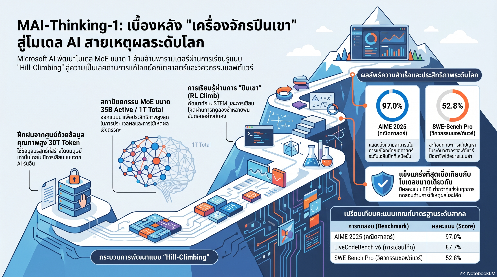

[กลับไปที่หน้าหลัก](../README.md)

สวัสดีครับเพื่อนๆ ที่ติดตามวงการ AI! วันนี้มาเรื่อง MAI-Thinking-1 จาก Microsoft ที่เรียกตัวเองว่า "Hill-climbing machine" ครับ โมเดล MoE ขนาด 1T Total / 35B Active Parameters ที่ไม่ใช้ Synthetic Data แม้แต่ Token เดียว ไม่ทำ Distillation จากโมเดลอื่น และเรียนรู้ Reasoning จาก "ศูนย์" ผ่าน RL ล้วนๆ จนทำ AIME 2025 ได้ 97.0% และ SWE-Bench Pro ได้ 52.8% ครับ

คุณเคยสังเกตไหมครับว่า โมเดลส่วนใหญ่ที่แข่งขันได้ดีในปีนี้มักผ่านการ Distill จากโมเดลที่แข็งแกร่งกว่า หรือใช้ Synthetic Data ที่ AI สร้างมาเองครับ? Microsoft เดิมพันว่าความฉลาดแบบนั้นมีเพดาน เพราะมัน "สืบทอด" ข้อจำกัดของโมเดลต้นฉบับมาด้วย และขาดทั้ง Steerability และ Robustness ที่จำเป็นสำหรับการไต่ระดับในระยะยาวครับ

คุณรู้ไหมครับว่า Rank Non-Invariance ที่ทีม Microsoft ค้นพบนั้น Counterintuitive มากครับ สูตรข้อมูลที่ทำให้โมเดลเล็กดีที่สุดไม่ใช่สูตรเดียวกับที่ทำให้โมเดลใหญ่ดีที่สุดครับ STEM-heavy Mix ที่ชนะในโมเดลเล็กถูก Code-heavy Mix แซงเมื่อขยายไป 23B/20T เพราะ Fuzzy Duplication ใน STEM ทำให้ถึงจุดอิ่มตัวก่อนครับ?

และคุณเคยนึกไหมครับว่า Dropless MoE ที่ไม่มี Token Dropping เลยนั้นสำคัญอย่างไร ครับ ใน MoE ทั่วไปเมื่อ Expert ตัวหนึ่งรับภาระเกิน Capacity Factor ระบบจะ Drop Token ทิ้งครับ MAI ไม่ทำเช่นนั้น ทำให้ทุก Token ได้รับการประมวลผลครบถ้วนแม้ใน Distribution ที่ Imbalance มาก ซึ่งสำคัญมากสำหรับ Long-tail Knowledge ครับ?

งานวิจัยนี้กำลังบอกว่า: "ทางลัดในการสร้าง AI ให้คะแนนสูงมีอยู่จริง แต่ทางลัดไม่ได้สร้างโมเดลที่ไต่เขาไปเรื่อยๆ ได้ — Hill-climbing machine ต้องการ Foundation ที่สร้างมาจาก First Principles ครับ"

========================================

🤔 ทบทวนความเชื่อเดิมๆ: สิ่งที่เราคิดเกี่ยวกับการสร้าง Reasoning Model

▪ "Distillation จากโมเดลที่แข็งแกร่งกว่าคือทางเร็วและมีประสิทธิภาพสูงสุด — ผลลัพธ์ดีกว่า Train From Scratch" → Microsoft เลือกทิศทางตรงข้ามและพิสูจน์ด้วยตัวเลขครับ ความฉลาดที่ได้จาก Distillation มาพร้อม Ceiling ของโมเดลต้นฉบับและขาด Steerability ครับ MAI-Thinking-1 ที่ Learn From Scratch มี Robustness ต่อโจทย์ที่ไม่เคยเห็นมาก่อนมากกว่าครับ

▪ "สูตร Data Mix ที่ดีสำหรับโมเดลเล็กจะดีสำหรับโมเดลใหญ่ด้วย — Rank Invariance Hypothesis" → Rank Non-Invariance ทำลายความเชื่อนี้ครับ STEM-heavy Mix ที่ชนะในโมเดลเล็กถูก Code-heavy Mix แซงเมื่อ Scale ไป 23B/20T ครับ เหตุผลคือ Fuzzy Duplication ใน STEM สร้าง Saturation ที่โมเดลใหญ่ซึ่งต้องการ Diversity สูงกว่าไม่สามารถรับมือได้ครับ

▪ "ข้อมูลคณิตศาสตร์ที่มีสัดส่วนน้อยในคลังข้อมูลจะให้ผลการเรียนรู้น้อยตามไปด้วย" → MAI ฝึก Math เพียง 5.4% ของ Training Data แต่ให้โมเดลเรียนรู้ซ้ำถึง 5.28 Epochs ครับ — สูงกว่า Web Text (0.55x) กว่า 9 เท่า ครับ Repeat Epochs ที่แตกต่างกันตาม Data Type คือกลยุทธ์ที่จงใจสร้าง Reasoning Foundation ให้แข็งแกร่งโดยไม่ต้องเพิ่มสัดส่วนข้อมูลครับ

▪ "RL ที่ดีต้องเริ่มจาก Base Model ที่มี Reasoning Trace ผ่าน SFT มาก่อน — Cold Start คือ RL ที่ไม่มีประสิทธิภาพ" → MAI-Thinking-1 เริ่ม RL Climb จาก Zero Prior Exposure to Reasoning Traces ครับ โมเดลไม่ได้รับ Chain-of-Thought ล่วงหน้า แต่เรียนรู้สร้างมันเองผ่านการลองผิดลองถูกกับ Reward Signal ครับ ผลคือ AIME 2025 97.0% ครับ

ความจริงที่น่าคิดคือ: "ในวงการที่ทุกคนแข่งกันหา Shortcut Microsoft เดิมพันว่า No Shortcut คือ Moat ที่ยั่งยืนที่สุดครับ"

========================================

🧠 พื้นฐานที่ต้องเข้าใจก่อน: Data Curriculum, LatentMoE Dropless, Rank Non-Invariance, GRPO + Adaptive Entropy Control, และ Three Climbs

=== Data Curriculum: 30T Tokens ที่ไม่มี Synthetic แม้แต่ Token เดียว ===

MAI-Thinking-1 ใช้ข้อมูล Human-curated ล้วน 30 Trillion Tokens ในการ Pre-training ครับ ไม่มี AI-generated Synthetic Data แม้แต่ Token เดียวในขั้นตอนนี้ครับ เหตุผลเชิง Philosophy คือ Synthetic Data สืบทอด Bias และ Ceiling ของโมเดลที่สร้างมันมาด้วยครับ

แต่สิ่งที่น่าสนใจกว่าปริมาณคือ Curriculum Strategy ผ่าน Avg. Epochs ที่ต่างกันตาม Data Type ครับ

Code 54.6% ของ Data เรียนรู้ 2.22 รอบครับ STEM 15.8% เรียนรู้ 2.17 รอบครับ Web Text 14.9% เรียนรู้เพียง 0.55 รอบครับ Math 5.4% เรียนรู้ 5.28 รอบครับ Web PDFs 4.7% เรียนรู้ 0.53 รอบครับ Books and Journals 3.1% เรียนรู้ 1.65 รอบครับ และ Multilingual 1.6% เรียนรู้เพียง 0.06 รอบครับ

Pattern ที่ชัดเจนครับ: ข้อมูลที่มี Reasoning Density สูง (Math และ Code) ถูกฝึกซ้ำหลายรอบ ในขณะที่ข้อมูล Web ทั่วไปที่มี Noise สูงถูกฝึกน้อยกว่าหนึ่งรอบครับ นี่คือ Quality over Quantity ที่ Operationalize ออกมาเป็นตัวเลขครับ

=== LatentMoE และ Dropless: ทุก Token มีสิทธิ์ถูกประมวลผล ===

MAI-Thinking-1 ใช้ LatentMoE Architecture ที่มี 1 Trillion Total Parameters และ 35 Billion Active Parameters ต่อ Token ครับ

สิ่งที่ทำให้ต่างจาก Standard MoE คือ Dropless Design ครับ ใน MoE ทั่วไปแต่ละ Expert มี Capacity Factor ที่กำหนดว่ารับ Token ได้กี่ตัวครับ เมื่อ Expert ตัวหนึ่งได้รับ Token มากเกิน Capacity ส่วนเกินจะถูก Drop หรือ Overflow ไปยัง Generic Layer ครับ

MAI ไม่มีกลไกนี้ครับ ทุก Token ได้รับการประมวลผลครบถ้วนไม่ว่า Expert จะ Imbalanced แค่ไหนครับ ผลลัพธ์คือ Training ที่เสถียรกว่ามาก เพราะ Gradient Signal ไม่หายไปกับ Dropped Tokens ครับ และ Long-tail Knowledge ที่มักตกค้างใน Imbalanced Expert ได้รับการเรียนรู้ครบถ้วนครับ

=== Rank Non-Invariance: บทเรียนที่แพงที่สุดของวงการ Data Curation ===

ทีมวิจัยทดสอบ STEM-heavy Mix เทียบกับ Code-heavy Mix บนโมเดลขนาดต่างกันครับ

ในโมเดลขนาดเล็ก STEM-heavy Mix ให้ผลดีกว่าครับ ซึ่งสอดคล้องกับสัญชาตญาณที่ว่า "STEM Data มีคุณภาพสูงและ Dense" ครับ

แต่เมื่อ Scale ไปที่ 23B Parameters และ 20T Training Tokens Code-heavy Mix แซงขึ้นมาและชนะอย่างชัดเจนครับ

ทีมวิเคราะห์ Root Cause แล้วพบว่า STEM-heavy Data มีปัญหา Fuzzy Duplication ครับ ซึ่งหมายถึงเนื้อหาที่ไม่ได้ซ้ำกันแบบ Exact Copy แต่ Semantic Content คล้ายกันมากครับ โมเดลใหญ่ที่ต้องการ Diversity สูงเพื่อ Generalize จะถึงจุด Saturation กับ STEM Data ก่อนครับ ส่วน Code ที่มีความหลากหลายสูงกว่า (Repository Structure, Language, Domain) ยังให้ Learning Signal ที่ Fresh อยู่ครับ

บทเรียนคือ Data Mix ที่ดีต้องถูกประเมินในขนาดที่จะ Deploy จริงครับ ไม่ใช่แค่ Proxy Run ในโมเดลเล็กครับ

=== GRPO + Adaptive Entropy Control: RL ที่ไม่ยอมให้โมเดลหยุดเรียนรู้ ===

ขั้นตอน RL Climb ใช้ GRPO (Group Relative Policy Optimization) ครับ ซึ่ง Efficient กว่า PPO ที่ต้องการ Separate Value Model ครับ

แต่ปัญหาคลาสสิกของ RL คือ Entropy Collapse ครับ เมื่อโมเดลเริ่มหา Pattern ที่ได้ Reward ดี มันจะ Converge ไปที่ Output Distribution ที่แคบลงเรื่อยๆ จนไม่ Explore วิธีการใหม่อีกต่อไปครับ ซึ่งหมายถึงโมเดลหยุดเรียนรู้ครับ

Microsoft แก้ปัญหานี้ด้วย Adaptive Entropy Control ที่ใช้ Integral Controller ครับ ระบบ Monitor Entropy ของ Output Distribution ตลอดเวลาครับ เมื่อ Entropy ลดลงต่ำกว่า Target ระบบจะเพิ่ม Entropy Regularization Coefficient อัตโนมัติ ทำให้โมเดลถูกผลักให้ Explore ต่อไปครับ เหมือน Thermostat ที่ควบคุมอุณหภูมิห้องให้คงที่ครับ

=== Three Climbs: จาก STEM สู่ Agentic สู่ Safety ===

RL Climb แบ่งออกเป็นสามขั้นตอนที่สร้างต่อกันครับ

STEM Climb: สร้าง Reasoning Foundation ผ่านโจทย์คณิตศาสตร์และวิทยาศาสตร์ครับ โมเดลเริ่มจาก Zero Prior Exposure to Reasoning Traces — ไม่มี CoT ที่ถูกป้อนล่วงหน้าครับ ทุกอย่างถูกค้นพบผ่าน Reward Signal ล้วนๆ ครับ ผลคือ AIME 2025 97.0% ครับ

Agentic Climb: ต่อยอด Reasoning ไปสู่การใช้ Tools และ Agentic Coding ครับ Context Length ถูกขยายจาก Mid-training ไปถึง 256K Tokens ครับ ผลคือ SWE-Bench Pro 52.8% ครับ และสามารถแข่งขันกับ Sonnet 4.6 และ DeepSeek-v4 Pro ในด้าน Coding ได้ครับ

Safety & Helpfulness Climb: ปรับสมดุลผ่าน Red-teaming เข้มข้นครับ โดยใช้ Self-distillation เป็น Recovery Mechanism เมื่อ Training ล่มระหว่าง Long Climb ครับ ทำให้สามารถ Resume ได้โดยไม่ต้องเริ่มใหม่ทั้งหมดครับ

MAI-Base-1 (35B/1T) ยังทำ BPB (Bits-per-byte) ได้ดีกว่า DeepSeek-v3.2 ที่มีขนาดใหญ่กว่าเกือบเท่าตัวครับ ซึ่งเป็น Efficiency Signal ที่ชัดเจนว่า Data Quality และ Training Rigor ให้ผลมากกว่าการเพิ่มพารามิเตอร์ครับ

========================================

🎯 ประเด็นที่ควรคิดต่อ

— No Distillation / No Synthetic คือ Design Choice ที่มี Cost สูงมาก แต่ Microsoft เลือกจ่าย: ทีมอื่นๆ ที่ใช้ Distillation + Synthetic Data สร้างโมเดลได้เร็วกว่ามากครับ Microsoft ยอมรับ Cost นั้นเพื่อได้ Steerability และ Robustness ที่ไม่สามารถ Distill ได้ครับ ถ้า Hypothesis นี้ถูกต้อง มันหมายความว่า Foundation ของโมเดลที่แตกต่างกันจะให้ Ceiling ที่แตกต่างกันในระยะยาวครับ

— Rank Non-Invariance เปลี่ยนวิธีที่ควรทำ Data Ablation: การทดสอบ Data Mix ในโมเดล Proxy เล็กๆ อาจให้ข้อสรุปที่ผิดสำหรับโมเดลใหญ่ครับ ทีมที่มี Compute น้อยจะทำ Scale-aware Data Ablation ยากมากครับ ซึ่งอาจเป็น Hidden Advantage ที่ Lab ใหญ่มีเหนือ Lab เล็กมากกว่าที่เราคิดครับ

— คำถามที่สำคัญที่สุด: MAI-Thinking-1 พิสูจน์ว่า RL From Scratch ได้ผลดีครับ แต่ทุกคนยังใช้ Human-generated Reward Signal อยู่ครับ เมื่อ AI เก่งขึ้นในระดับที่มนุษย์ไม่สามารถ Verify Reasoning ได้อีกต่อไป Reward Signal ที่ถูกต้องสำหรับ Hill-climbing ต่อไปจะมาจากที่ไหนครับ?

#MAIThinking1 #Microsoft #ReasoningModel #MoE #DroplessMoE #GRPO #AdaptiveEntropy #RankNonInvariance #AIME #SWEBench #LLM #AIResearch #HillClimbing #NoDistillation
