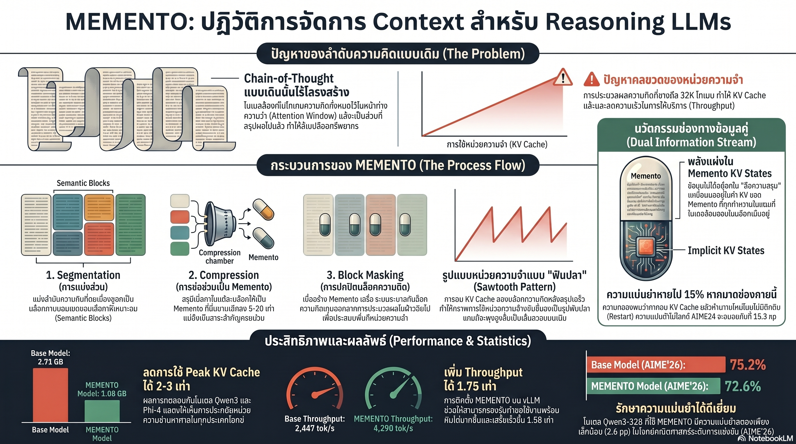

[กลับไปที่หน้าหลัก](../README.md)

สวัสดีครับเพื่อนๆ ที่ติดตามวงการ AI! วันนี้มาเรื่องที่ Microsoft Research ค้นพบวิธีแก้ปัญหาที่ทุกคนที่ใช้ AI ในงานซับซ้อนเคยเจอ ว่าทำไม AI ยิ่งคิดนานยิ่งช้า และยิ่งคิดยาวยิ่งกินหน่วยความจำมากขึ้นเรื่อยๆ โดยไม่มีทีท่าจะหยุดครับ

คุณเคยสังเกตไหมครับว่า เวลาเราทำงานที่ซับซ้อนนานๆ โต๊ะทำงานมักจะเต็มไปด้วยกระดาษโน้ต แผ่นงาน และเอกสารจนไม่มีพื้นที่เหลือ แต่ถ้าเราสรุปย่อเป็นโน้ตแผ่นเล็กๆ และเก็บกระดาษที่ไม่จำเป็นออกไป เราก็ทำงานได้เร็วขึ้นโดยไม่สูญเสียความเข้าใจเลย?

คุณเคยสงสัยไหมครับว่า ถ้า AI สร้างบทสรุปของความคิดตัวเองแล้วลบรายละเอียดทิ้ง ทำไมมันถึงฉลาดน้อยลง ทั้งที่ดูเหมือนบทสรุปควรจะจับใจความสำคัญได้ครบ?

และคุณรู้ไหมครับว่า Microsoft Research ค้นพบว่าบทสรุปที่ดีของ AI ไม่ใช่แค่ "ข้อความ" แต่คือ "Compressed Pointer" ที่ฝัง Context ทั้งหมดไว้ใน KV Cache และเมื่อลบ KV Cache นั้นทิ้งแม้จะเหลือข้อความสรุปไว้ AI ยังสูญเสียความแม่นยำถึง 15.3 percentage points เลยครับ?

ระบบที่ค้นพบทั้งหมดนี้ชื่อ MEMENTO และมันกำลังเปลี่ยนวิธีที่ AI จัดระเบียบความคิดของตัวเองครับ

========================================

🤔 ทบทวนความเชื่อเดิมๆ: สิ่งที่เราคิดเกี่ยวกับ AI Reasoning และ Memory

▪ "AI ที่คิดยาวกว่าย่อมฉลาดกว่า Chain-of-Thought ยิ่งยาวยิ่งดี" → Chain-of-Thought ที่ยาวสร้าง Context Bloat ที่ทำให้ KV Cache พุ่งสูงแบบเส้นตรง ยิ่งคิดนานยิ่งช้าและกินหน่วยความจำมากขึ้น MEMENTO พิสูจน์ว่าการคิดอย่างมีโครงสร้างสำคัญกว่าความยาวครับ

▪ "ถ้าบีบอัดความคิดเป็นบทสรุป AI จะฉลาดน้อยลงเพราะข้อมูลหายไป" → Qwen3-32B ใช้ MEMENTO แล้วเสียความแม่นยำเพียง 2.6 pp บน AIME'26 แม้จะลบรายละเอียดระหว่างทางทิ้งไปมหาศาล เพราะ KV Cache ของ Memento เก็บ Context เชิงลึกไว้อยู่ครับ

▪ "การสรุปของ AI คือการเขียนข้อความสั้นๆ แทนข้อความยาวๆ ไม่ต่างกัน" → Memento ไม่ใช่แค่ข้อความ แต่คือ "Compressed Pointer" ที่ KV Cache ของมันถูกคำนวณขณะที่ AI ยังเห็นรายละเอียดทั้งหมดอยู่ ลบ KV Cache แล้วเหลือแค่ข้อความ ความแม่นยำหายไป 15.3 pp ทันทีครับ

▪ "โมเดลขนาดใหญ่และขนาดเล็กได้ประโยชน์จากการบีบอัด Context เท่าเทียมกัน" → Accuracy Gap ลดลงตามขนาดโมเดล จาก 6.3 pp ใน Qwen3-8B เหลือ 3.5 pp ใน Qwen3-32B โมเดลใหญ่ฉลาดพอที่จะ "อ่าน" Compressed Pointer ได้แม่นยำกว่า ทำให้การลงทุนใน 32B+ คุ้มค่ากว่าเดิมครับ

ความจริงที่น่าคิดคือ: ปัญหาของ Reasoning AI ไม่ใช่ว่ามันคิดไม่ฉลาด แต่คือมันจำทุกอย่างโดยไม่เลือก เหมือนนักเรียนที่จดทุกคำพูดของอาจารย์ลงไปโดยไม่สรุปเป็นแนวคิดหลัก จนสุดท้ายโน้ตเต็มสมุดแต่หาอะไรไม่เจอครับ

========================================

🧠 พื้นฐานที่ต้องเข้าใจก่อน: KV Cache, Context Bloat และ Chain-of-Thought

=== KV Cache คืออะไร? ===

KV Cache (Key-Value Cache) = หน่วยความจำชั่วคราวที่ Transformer ใช้เก็บ "สถานะการประมวลผล" ของ Token ทุกตัวที่ผ่านมาแล้ว เพื่อไม่ต้องคำนวณซ้ำในทุก Attention Step

เปรียบได้กับ Working Memory ของโมเดล ยิ่งมี Token ในประวัติมาก KV Cache ยิ่งใหญ่ ใช้ GPU Memory มากขึ้น และทำให้โมเดลทำงานช้าลงครับ

=== Context Bloat คืออะไร? ===

Context Bloat = ภาวะที่ KV Cache พุ่งสูงขึ้นเรื่อยๆ ตามความยาวของ Chain-of-Thought โดยไม่มีกลไกลดขนาด

[Chain-of-Thought ปกติ]
▸ ความคิด 1 (Token เพิ่ม) → ความคิด 2 (Token เพิ่ม) → ความคิด 3 (Token เพิ่ม)...
▸ KV Cache ใหญ่ขึ้นเป็นเส้นตรงตลอดเวลา
▸ ถึงจุดหนึ่งจะช้าลงหรือ Out-of-Memory ครับ

=== Dual Information Stream คืออะไร? ===

Dual Information Stream = คุณสมบัติพิเศษของ MEMENTO ที่เมื่อ AI กำลังเขียนบทสรุป (Memento) มันยังเห็นรายละเอียดทั้งหมดของความคิดชุดนั้นอยู่ ทำให้ KV Cache ของ Memento ถูก "อัด" ด้วยบริบทครบถ้วน

[การสรุปทั่วไป]
▸ อ่านความคิดเดิม → เขียนสรุป → บริบทเดิมหาย

[Dual Information Stream]
▸ เห็นความคิดเดิมทั้งหมด → เขียนสรุป (KV Cache ของสรุปถูกคำนวณพร้อมบริบทครบถ้วน) → บริบทเดิม Mask ออกไป → KV Cache ของสรุปยังเก็บ "ร่องรอย" ของบริบททั้งหมดไว้ครับ

=== Sawtooth Pattern คืออะไร? ===

Sawtooth Pattern (ลายฟันปลา) = รูปแบบการใช้หน่วยความจำที่ MEMENTO สร้างขึ้น โดยแตกต่างจากการพุ่งสูงแบบเส้นตรงของ CoT ปกติ

[คิด]: KV Cache เพิ่มขึ้น
[สรุป (Memento)]: KV Cache ลดลงฮวบ
[คิดต่อ]: KV Cache เพิ่มขึ้นใหม่จากฐานที่ต่ำกว่า
[สรุปอีกครั้ง]: ลดลงอีก ซ้ำวนเป็นลายฟันปลาครับ

========================================

1️⃣ Dual Information Stream: ทำไม Memento จึงไม่ใช่แค่บทสรุปธรรมดา

=== การทดลองที่เปิดเผยความจริง ===

ทีมวิจัย Microsoft ตั้งคำถามว่า "ถ้า Memento คือแค่ข้อความสรุป เราลบ KV Cache เก่าออกแล้วให้ AI อ่านเฉพาะข้อความสรุปนั้นเพื่อคิดต่อได้ไหม?"

คำตอบที่ได้ทำให้ทุกอย่างชัดเจนขึ้นมากครับ

[ทดสอบบน Qwen3-8B, Benchmark AIME'24]
▸ ใช้ MEMENTO ปกติ (มี KV Cache ของ Memento ครบ): คะแนน X
▸ ลบ KV Cache ทิ้ง เหลือแค่ข้อความ Memento: คะแนน X - 15.3 pp

ความแม่นยำหาย 15.3 percentage points จากการที่มีแค่ข้อความสรุปแต่ไม่มี KV Cache ที่ถูกคำนวณพร้อมบริบทเต็มรูปแบบ

นี่พิสูจน์ว่า Memento ไม่ใช่ข้อความ แต่คือ "Compressed Pointer" ที่ตัวข้อความและ KV Cache ต้องอยู่ด้วยกันครับ

=== In-place Compression คืออะไร? ===

In-place Compression = วิธีบีบอัดแบบ MEMENTO ที่ต่างจากการสรุปทั่วไป

[การสรุปทั่วไป]
▸ อ่านความคิดเก่าทีละส่วน → เขียนสรุป
▸ ข้อมูลที่สรุปได้รับบริบทเพียงส่วนที่อ่านล่าสุด

[In-place Compression]
▸ ความคิดเก่าทั้งหมดยังอยู่ใน KV Cache
▸ AI เขียน Memento โดย "มองเห็น" บริบทครบถ้วนพร้อมกัน
▸ KV Cache ของ Memento ถูกอัดด้วยข้อมูลเชิงลึกทั้งหมดในก้าวเดียว

เปรียบเทียบ: เหมือนความต่างระหว่างนักศึกษาที่สรุปโน้ตโดยดูทีละหน้า กับนักศึกษาที่กางโน้ตทั้งหมดพร้อมกันก่อนจะสรุป คนที่สองจะเห็นความเชื่อมโยงระหว่างทุกส่วนได้ดีกว่ามาก แม้สรุปออกมาได้ขนาดเท่ากันครับ

========================================

2️⃣ Sawtooth Pattern: เมื่อ AI เรียนรู้จักจัดโต๊ะทำงานตัวเอง

=== จาก Linear ถึง Sawtooth ===

ก่อน MEMENTO การใช้ KV Cache ของ Reasoning AI มีรูปแบบเดียวคือพุ่งสูงขึ้นตลอด

[ปัญหาของ Linear Growth]
▸ งานที่ต้องคิดยาวนานเป็นชั่วโมงหรือวัน → KV Cache ใหญ่เกิน GPU
▸ ยิ่งโมเดลใหญ่ยิ่งแย่ เพราะ KV Cache ต่อ Layer มากขึ้น
▸ Long-horizon Tasks จึงเป็นไปได้แค่ในทฤษฎีครับ

หลัง MEMENTO Sawtooth Pattern แก้ปัญหานี้โดยตรง

[วงจรของ Sawtooth]
▸ คิด → คิด → คิด: KV Cache ค่อยๆ เพิ่ม
▸ เขียน Memento: KV Cache ลดลงฮวบเหลือเพียง Memento
▸ คิดต่อ: เพิ่มขึ้นจาก Baseline ต่ำใหม่
▸ วนซ้ำโดยไม่มี Hard Ceiling ครับ

=== ตัวเลขที่พิสูจน์ว่า Sawtooth ทำงาน ===

[Peak KV Cache Reduction]
▸ ลดการใช้หน่วยความจำสูงสุด 2–2.5 เท่า
▸ หมายความว่าโมเดลที่เคยใช้ RAM เต็มจะเหลือพื้นที่ว่างครึ่งนึงครับ

[AUC KV Reduction]
▸ ลดภาระหน่วยความจำรวมตลอดระยะเวลา 2–3.5 เท่า
▸ วัดเป็นพื้นที่ใต้กราฟ แสดงว่าประหยัดพลังงานในระยะยาวได้มากครับ

[Throughput Increase]
▸ เพิ่ม Token ต่อวินาที 1.75 เท่า
▸ เร็วขึ้น 75% บนโมเดลเดิมและ Hardware เดิมครับ

[Accuracy Preservation]
▸ Qwen3-32B เสียความแม่นยำเพียง 2.6 pp บน AIME'26
▸ แลก Memory 2.5 เท่ากับ Accuracy เพียง 2.6% คือดีลที่คุ้มค่ามากครับ

========================================

3️⃣ Scaling Law ของ MEMENTO: ยิ่งใหญ่ยิ่งทนต่อการบีบอัดได้ดีกว่า

=== การค้นพบที่ขัดกับสัญชาตญาณ ===

ถ้าโมเดลเล็กกว่าย่อม "เสีย" น้อยกว่าเมื่อบีบอัด Context เพราะมันต้องการน้อยกว่า...แต่ผลจริงเป็นตรงข้ามครับ

[Accuracy Gap ใน Qwen3 Family]
▸ Qwen3-8B: ช่องว่างระหว่าง CoT ปกติ vs MEMENTO = 6.3 pp
▸ Qwen3-32B: ช่องว่างลดเหลือ = 3.5 pp

ยิ่งโมเดลใหญ่ ยิ่ง "อ่าน" Compressed Pointer ได้แม่นยำกว่า เพราะมี Capacity มากพอที่จะสกัดข้อมูลเชิงลึกออกจาก KV Cache ที่บีบอัดแล้วครับ

=== ผลต่ออุตสาหกรรม: ทลาย Hard Ceiling ===

ก่อน MEMENTO โมเดล 32B หรือ 70B+ ที่ต้องทำ Long-horizon Tasks เป็นไปได้ยากในทางปฏิบัติเพราะ

▸ KV Cache พุ่งเกิน GPU Memory ในงานที่คิดยาวนาน
▸ ต้นทุน Hardware สูงมากเพราะต้องใช้ GPU หลายตัว
▸ งานระยะยาวเป็นสัปดาห์หรือเดือนเป็นไปไม่ได้ครับ

หลัง MEMENTO

▸ KV Cache คงที่แบบ Sawtooth ไม่เพิ่มไม่หยุด
▸ โมเดล 70B+ สามารถทำงานยาวนานบน Hardware เดิม
▸ Long-horizon Tasks กลายเป็นจริงในเชิงพาณิชย์ครับ

เปรียบเทียบ: เหมือนการที่รถวิ่งทางไกลต้องหยุดเติมน้ำมันเป็นระยะ แทนที่จะต้องมีถังน้ำมันใหญ่ขึ้นเรื่อยๆ MEMENTO เป็นการหยุดพักสรุปความคิดเป็นระยะ แทนที่จะต้องการ GPU Memory ใหญ่ขึ้นเรื่อยๆ ครับ

========================================

4️⃣ OPENMEMENTOS: เปิดกว้างสู่ทุกคนด้วย 228,000 ตัวอย่างที่ผ่านการควบคุมคุณภาพ

=== Iterative Refinement: จาก 28% ถึง 92% ===

การสร้าง Dataset สำหรับฝึก AI ให้เขียน Memento ที่ดีไม่ใช่เรื่องง่าย เพราะ Memento ที่สั้นเกินไปจะทำให้ข้อมูลสำคัญตกหล่น ส่งผลต่อ Reasoning ในขั้นตอนถัดไปครับ

OPENMEMENTOS ใช้ระบบ Iterative Refinement

[รอบแรก]
▸ AI เขียน Memento
▸ LLM Judge ตรวจสอบว่า "สรุปครบถ้วนหรือเปล่า?"
▸ ถ้าไม่ผ่าน: ส่ง Feedback กลับไปให้สรุปใหม่

[วนซ้ำจนผ่านเกณฑ์]
▸ Pass Rate เริ่มต้น: 28%
▸ หลัง Iterative Refinement: 92%

เปรียบเทียบ: เหมือนกระบวนการตรวจบทความวิชาการที่มี Peer Review ส่งกลับแก้ไขซ้ำๆ จนมั่นใจว่าสรุปได้ครบถ้วนจริงๆ แทนที่จะยอมรับ Draft แรกที่ผ่านมาครับ

=== ความยืดหยุ่นของ Architecture ===

OPENMEMENTOS รองรับ Architecture หลายประเภท

[Standard Full Attention: Qwen3, Phi-4]
▸ ทุก Token เห็นทุก Token ก่อนหน้า → MEMENTO ทำงานตามหลักการเต็มรูปแบบ

[Hybrid Sliding Window Attention: Olmo-3]
▸ บาง Layer เห็นแค่ Window ใกล้ๆ ไม่ได้เห็นทั้งหมด
▸ MEMENTO ยังทำงานได้อย่างมีประสิทธิภาพแม้จะมีข้อจำกัดด้าน Attention ครับ

=== ชื่อที่มาจากภาพยนตร์ Christopher Nolan ===

ชื่อ MEMENTO มาจากหนัง Memento ปี 2000 ของ Christopher Nolan ที่ตัวเอกสูญเสียความจำระยะสั้นและต้องสร้าง "Memory Artifacts" อย่างโพสอิต รูปถ่าย และรอยสักเพื่อจำว่ากำลังทำภารกิจอะไรอยู่

[ตัวเอกใน Memento] → สร้าง Note และ Tattoo เพื่อชดเชยความจำที่หายไป
[AI ใน MEMENTO] → สร้าง Memento ของตัวเองเพื่อจำว่าคิดอะไรไปแล้วและต้องไปทิศทางไหน โดยไม่ต้องย้อนอ่านรายละเอียดทั้งหมดครับ

========================================

🎯 สรุป: 4 บทเรียนจาก MEMENTO

▸ Memento ไม่ใช่แค่ข้อความ แต่คือ Compressed Pointer ที่อาศัย KV Cache: Dual Information Stream คือหัวใจที่ทำให้ MEMENTO ต่างจากการสรุปทั่วไป หากไม่มี KV Cache ที่ถูกคำนวณพร้อมบริบทเต็มรูปแบบ ประสิทธิภาพจะหายไป 15.3 pp ทันที

▸ Sawtooth Pattern เปลี่ยน Long-horizon Tasks จากทฤษฎีเป็นความจริง: การที่ KV Cache วนเป็นลายฟันปลาแทนการพุ่งสูงแบบเส้นตรง ทลาย Hard Ceiling ที่กั้นโมเดล 32B/70B+ ออกจากงานที่ต้องการการคิดยาวนานต่อเนื่องได้จริงครับ

▸ Scaling Law บอกว่าโมเดลใหญ่ได้ประโยชน์จาก MEMENTO มากกว่า: Accuracy Gap ที่ลดลงตามขนาดโมเดลหมายความว่าการลงทุนใน 32B+ ร่วมกับ MEMENTO ให้ผลดีกว่าการใช้ 8B โดยไม่มีระบบจัดการ Memory อย่างชาญฉลาดครับ

▸ คุณภาพของ Memento ต้องถูกควบคุมอย่างเข้มข้น: Pass Rate ที่พุ่งจาก 28% เป็น 92% ด้วย Iterative Refinement พิสูจน์ว่าการสรุปที่ดีต้องการกระบวนการตรวจสอบที่เข้มงวด ไม่ใช่แค่ปล่อยให้โมเดลสรุปอย่างอิสระครับ

หลักการสำคัญ: "ความฉลาดของมนุษย์ไม่ได้อยู่ที่การจำทุกอย่าง แต่อยู่ที่การรู้ว่าอะไรควรจำ อะไรควรลืม และอะไรควรบันทึกไว้เป็นโน้ตย่อสำหรับใช้ทีหลัง MEMENTO กำลังสอนให้ AI เรียนรู้ทักษะเดียวกันนี้ครับ"

========================================

💬 คำถามท้ายทาย

1. Dual Information Stream พิสูจน์ว่า KV Cache ของ Memento เก็บ "ร่องรอย" ของบริบทที่หายไปแล้ว แต่ถ้า Reasoning ยาวนานมากจนต้องสร้าง Memento ซ้อน Memento หลายชั้น (Meta-compression) ร่องรอยเหล่านั้นจะยังส่งผ่านได้ครบถ้วนหรือจะค่อยๆ เลือนหายไปตามจำนวนชั้นการบีบอัดครับ?

2. MEMENTO ทำงานได้ดีเพราะ AI ถูกฝึกให้รู้จักสรุปความคิดตัวเองอย่างมีคุณภาพ แต่ถ้า Task ที่กำลังทำคือการสรุปข้อความของคนอื่น AI จะมีความขัดแย้งในการตัดสินใจว่าต้องใช้ Memento สำหรับ "ความคิดตัวเอง" หรือ "สาระสำคัญของ Input" หรือไม่ครับ?

3. OPENMEMENTOS ใช้ LLM Judge ตรวจสอบคุณภาพบทสรุป แต่ถ้า LLM Judge ที่ใช้มี Bias หรือความเข้าใจผิดในโดเมนเฉพาะ (เช่น คณิตศาสตร์ขั้นสูงหรือฟิสิกส์เชิงทฤษฎี) ความผิดพลาดนั้นจะซ่อนอยู่ใน Dataset และส่งต่อไปยังโมเดลที่ฝึกบนมันได้ไหม และควรออกแบบระบบ Quality Control อย่างไรครับ?

4. MEMENTO ช่วยให้ Long-horizon Tasks เป็นไปได้จริง แต่งานที่ต้องคิดยาวนานเป็นสัปดาห์หรือเดือนนั้น Memento แต่ละชิ้นที่สะสมไปจะกลายเป็น "ประวัติความคิด" ของ AI อย่างหนึ่ง ถ้าต้องย้อนกลับไปตรวจสอบว่า AI "ตัดสินใจ" อะไรในสัปดาห์ที่ 3 เราจะออกแบบระบบ Audit Trail ของ Memento อย่างไรให้มนุษย์ตรวจสอบได้ครับ?

========================================

References:
▸ MEMENTO — Microsoft Research, ระบบ In-place KV Cache Compression สำหรับ Reasoning LLMs
▸ Dual Information Stream — กลไกที่ Memento ถูกคำนวณขณะที่บริบทเต็มรูปแบบยังอยู่ใน KV Cache
▸ Compressed Pointers — Memento คือ Pointer เข้าสู่ Reasoning State ไม่ใช่แค่ Text Summary
▸ KV Cache Ablation: -15.3 pp บน AIME'24 (Qwen3-8B) เมื่อลบ KV Cache เหลือแค่ Text
▸ Sawtooth Pattern — รูปแบบ Memory Usage วนเป็นลายฟันปลาแทนการพุ่งสูงเป็นเส้นตรง
▸ Peak KV Reduction: 2–2.5x | AUC KV Reduction: 2–3.5x | Throughput: 1.75x
▸ Accuracy Loss: Qwen3-32B เสียเพียง 2.6 pp บน AIME'26
▸ Scaling Law: Accuracy Gap ลดจาก 6.3 pp (8B) → 3.5 pp (32B)
▸ OPENMEMENTOS — 228,000 ตัวอย่าง (Math, Code, Science) รองรับ Qwen3, Phi-4, Olmo-3
▸ Iterative Refinement + LLM Judge — Pass Rate จาก 28% → 92%
▸ แรงบันดาลใจ: Memento (2000) ของ Christopher Nolan — Memory Artifacts สำหรับ AI

ในวันที่ AI เรียนรู้วิธีจัดระเบียบความคิดตัวเองได้เหมือนมนุษย์ที่รู้ว่าอะไรควรจำและอะไรควรจดโน้ตทิ้งไว้ คำถามที่น่าสนใจที่สุดคือ เมื่อ AI สามารถทำ Long-horizon Tasks ได้จริงๆ งานที่มีความซับซ้อนระดับไหนที่เราจะกล้ามอบหมายให้มัน และเราจะออกแบบระบบตรวจสอบ "ความคิด" ที่สะสมมาเป็นเดือนนั้นอย่างไรครับ ⚡

#MEMENTO #KVCache #ReasoningAI #ChainOfThought #ContextBloat #LongHorizonAI #MicrosoftResearch #AIResearch #AIThailand #ปัญญาประดิษฐ์ #MachineLearning #OpenMementos #SawtoothPattern #GreenAI
