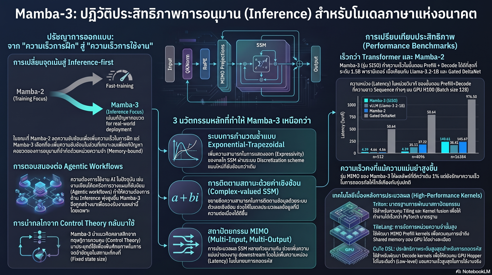

[กลับไปที่หน้าหลัก](../README.md)

สวัสดีครับเพื่อนๆ ที่ติดตามวงการ AI! วันนี้มาเรื่องที่ดูเหมือนเรื่องวิศวกรรม แต่จริงๆ แล้วเกี่ยวข้องกับทุกคนที่ใช้ AI ในชีวิตประจำวัน เรื่องของโมเดลที่ถูกออกแบบมาเพื่อ "ตอบเร็ว" ไม่ใช่ "ฝึกเร็ว" ครับ

คุณเคยรู้สึกไหมครับว่า ทำไม AI บางรุ่นถึงตอบช้ามากเมื่อต้องจัดการข้อความยาวๆ ทั้งที่ "เทรนมาแล้ว" และ "ฉลาด" แล้ว ปัญหาอยู่ที่ไหน?

คุณเคยสงสัยไหมครับว่า ทำไม GPU ที่แพงมากๆ ถึงมักจะ "นั่งว่าง" รอข้อมูลอยู่นานกว่าที่จะ "คิด" จริงๆ ในช่วงที่ AI กำลังตอบคำถาม?

และคุณรู้ไหมครับว่า มีวิธีดึงพลังจาก GPU ที่กำลังว่างนั้นมาทำงานเพิ่มได้ "ฟรีๆ" โดยแทบไม่เพิ่ม Latency เลย และนั่นคือหนึ่งในนวัตกรรมหลักของ Mamba-3?

Mamba-3 ประกาศยุคใหม่ที่ "Inference-First" ไม่ใช่ "Training-First" และมันพิสูจน์ว่าสถาปัตยกรรม AI ที่ฉลาดขึ้นไม่จำเป็นต้องช้าลงครับ

========================================

🤔 ทบทวนความเชื่อเดิมๆ: สิ่งที่เราคิดเกี่ยวกับประสิทธิภาพ AI

▪ "ถ้าโมเดลเทรนเร็ว มันก็น่าจะ Infer ได้เร็วด้วย" → Mamba-2 เทรนเร็วขึ้น 2-8 เท่าโดยลดทอนความซับซ้อน แต่ทำให้ Inference ง่ายเกินไปจน GPU ต้องนั่งรอหน่วยความจำ มากกว่าที่จะคำนวณจริงๆ

▪ "ถ้าจะให้ AI เร็วขึ้น ต้องใช้ GPU ที่แพงขึ้น หรือลดความซับซ้อนของโมเดลลง" → MIMO ของ Mamba-3 ใช้ GPU ที่กำลัง "ว่างอยู่แล้ว" มาทำงานเพิ่ม ได้ความแม่นยำเพิ่มขึ้น 1%+ โดยที่ Latency แทบไม่เปลี่ยน

▪ "Short Convolution คือส่วนสำคัญที่ขาดไม่ได้ในสถาปัตยกรรม Mamba" → Mamba-3 เอา Short Convolution ออกทั้งหมด แต่แทนที่ด้วยกลไกภายใน SSM ที่ทรงพลังกว่า ทำให้สถาปัตยกรรมสะอาดขึ้นและทำงานได้ดีกว่า

▪ "Transformer กับระบบนิเวศ vLLM ที่โตมานานย่อมเร็วกว่าโมเดลใหม่ๆ เสมอ" → Mamba-3 SISO เร็วกว่า vLLM ของ Transformer ในแง่ความเร็วต่อความยาว Sequence โดยเฉพาะเมื่อ Context ยาวขึ้น

ความจริงที่น่าคิดคือ: ยุคถัดไปของ AI ไม่ได้แข่งกันที่ "ใครเทรนเร็วกว่า" แต่แข่งกันที่ "ใครตอบเร็วและถูกต้องกว่าในราคาที่ถูกกว่า" ครับ

========================================

🧠 พื้นฐานที่ต้องเข้าใจก่อน: SSM, Training vs Inference, Memory-bound และ MIMO

=== State Space Model (SSM) คืออะไร? ===

SSM = สถาปัตยกรรม AI ที่ใช้ "สถานะ" (State) เป็นตัวเก็บข้อมูลจากอดีต แทนที่จะเก็บทุก Token ไว้เหมือน Transformer

เปรียบเทียบ: เหมือนการจดโน้ตสรุประหว่างฟังบรรยาย แทนที่จะบันทึกทุกคำพูดคำต่อคำ (KV Cache ของ Transformer) SSM บีบอัด "สาระสำคัญ" ลงในพื้นที่จำกัด ข้อดีคือประหยัดหน่วยความจำมาก ข้อเสียคือถ้าโน้ตพื้นที่น้อยเกินไป อาจลืมรายละเอียดสำคัญได้ครับ

=== Training VS Inference ต่างกันอย่างไร? ===

[Training = การฝึกสอนโมเดล]
▸ ประมวลผลข้อมูลเป็น Batch ขนาดใหญ่ทั้งหมดพร้อมกัน
▸ เน้น "Throughput" คือปริมาณข้อมูลที่ประมวลผลได้ต่อวินาที
▸ GPU ทำงานหนักตลอด เป็น Compute-bound
▸ ทำครั้งเดียว ใช้เวลานานเป็นสัปดาห์หรือเดือน

[Inference = การใช้โมเดลตอบคำถาม]
▸ ประมวลผลทีละ Token ต่อเนื่องกัน (Autoregressive Decoding)
▸ เน้น "Latency" คือความเร็วในการตอบ
▸ GPU มักรอหน่วยความจำ เป็น Memory-bound
▸ ทำพันล้านครั้งต่อวัน ต้นทุนสะสมมหาศาล

=== Memory-bound VS Compute-bound คืออะไร? ===

[Compute-bound] = GPU คำนวณเต็มกำลัง หน่วยความจำส่งข้อมูลทัน → ทุกอย่างทำงานเต็มประสิทธิภาพ
[Memory-bound] = GPU คำนวณเร็วเกินไป หน่วยความจำส่งข้อมูลไม่ทัน → GPU ต้องนั่ง "ว่าง" รอ

เปรียบเทียบ: เหมือนโรงงานที่มีเครื่องจักรที่เร็วมาก แต่ระบบลำเลียงวัตถุดิบเข้ามาช้า เครื่องจักรก็ต้องหยุดรออยู่เฉยๆ ทรัพยากรสูงสุดถูกใช้ไม่คุ้มครับ และนั่นคือสิ่งที่เกิดขึ้นกับ Mamba-2 ในช่วง Inference

=== MIMO VS SISO คืออะไร? ===

[SISO = Single-Input, Single-Output]
▸ SSM หนึ่งตัวรับข้อมูลหนึ่งกระแส ผลิตผลลัพธ์หนึ่งกระแส
▸ โมเดล Mamba แบบเดิม

[MIMO = Multi-Input, Multi-Output]
▸ SSM หลายตัวทำงานขนานกันในรอบการทำงานเดิม
▸ ใช้ "Idle cores" ที่กำลังรอหน่วยความจำมาทำงานเพิ่ม
▸ ได้ประสิทธิภาพเพิ่มขึ้นโดยแทบไม่เพิ่ม Latency

เปรียบเทียบ: เหมือนระหว่างที่รถกำลังรอไฟเขียว แทนที่คนขับจะนั่งเฉยๆ เขาใช้เวลานั้นเช็กอีเมล ตรวจแผนที่ หรือดื่มกาแฟ งานเสร็จเพิ่มขึ้นในเวลาเดิมครับ

========================================

1️⃣ จุดเปลี่ยนสำคัญ: จาก "Training-First" สู่ "Inference-First"

=== ทำไม Mamba-2 ถึงสร้างปัญหาในช่วง Inference? ===

Mamba-2 ทำผลงานที่ยอดเยี่ยมในการเทรน เพราะเลือก "ลดทอนความซับซ้อน" ของ SSM อย่างเข้มข้น

[สิ่งที่ Mamba-2 ทำเพื่อเร่งการเทรน]
▸ ลดรูปเมทริกซ์การเปลี่ยนสถานะให้เหลือแค่ Scalar (ตัวเลขเดียว แทนที่จะเป็นเมทริกซ์)
▸ ทำให้การคำนวณ SSM ง่ายและเร็วขึ้นมากในช่วงเทรน

[ผลข้างเคียงที่ตามมา]
▸ Inference กลายเป็น "ง่ายเกินไป" หมายความว่าต้องการการคำนวณน้อยมากต่อหนึ่งรอบ
▸ GPU ที่ออกแบบมาเพื่อคำนวณซับซ้อนต้องนั่ง "รอ" หน่วยความจำส่งข้อมูลมาเรื่อยๆ
▸ ผลคือ GPU Utilization ต่ำมากในช่วง Inference ทั้งที่จ่ายเงินเช่าหรือซื้อ GPU แพงมาก

=== มุมมองใหม่ของ Mamba-3 ===

Mamba-3 เลือกทิศทางตรงกันข้ามครับ แทนที่จะลดทอนความซับซ้อน กลับเพิ่มความซับซ้อนที่ "คุ้มค่า" กลับเข้าไปในกลไก SSM เพื่อให้:
▸ ทุกครั้งที่ต้องดึงข้อมูลจากหน่วยความจำ มีการคำนวณที่ซับซ้อนและมีคุณค่ามากขึ้น
▸ GPU ได้ "ทำงานจริงๆ" มากขึ้นในเวลาที่รอข้อมูล
▸ ประสิทธิภาพโดยรวมสูงขึ้นแม้ต้นทุน Memory Movement เท่าเดิม

เปรียบเทียบ: เหมือนการเปลี่ยนจากพนักงานที่ทำงานเสร็จเร็วมากแต่ต้องรอเอกสารตลอด เป็นพนักงานที่ใช้เวลารอเอกสารไปทำงานอื่นที่มีคุณค่าพร้อมกัน ผลลัพธ์รวมดีกว่าแม้งานแต่ละชิ้นใช้เวลานานขึ้นนิดหน่อยครับ

========================================

2️⃣ อัปเกรดหัวใจ SSM: เอา Short Convolution ออก เพิ่ม 3 กลไกแทน

=== การตัดสินใจที่ดูขัดแย้ง ===

Short Causal Convolution เคยเป็น "ลายเซ็น" ของสถาปัตยกรรม Mamba มาตั้งแต่รุ่นที่ 1 การเอามันออกในรุ่น 3 ฟังดูเหมือนถอดหัวใจออกจากร่างกายครับ แต่นั่นคือสิ่งที่ Mamba-3 ทำ และผลลัพธ์ดีกว่าเดิม

[กลไกทดแทน 3 อย่างที่ทรงพลังกว่า]

[กลไกที่ 1: Implicit Convolution ผ่าน Exponential-trapezoidal Discretization + BCNorm]
▸ แทนที่จะทำ Convolution ด้วยชั้นแยกต่างหาก Mamba-3 สร้างเอฟเฟกต์เดียวกันจากภายใน SSM เอง
▸ ใช้ BC bias (BCNorm) ที่เพิ่มความสามารถในการดึงข้อมูล (Retrieval) กลับมา
▸ สถาปัตยกรรมภายนอกสะอาดขึ้น แต่ความสามารถภายในมากขึ้น

[กลไกที่ 2: Complex-Valued State Tracking]
▸ แทนที่จะใช้ตัวเลขปกติ (Real numbers) ใช้ "จำนวนเชิงซ้อน" (Complex numbers) ในการเก็บสถานะ
▸ จำนวนเชิงซ้อนสามารถแทนทั้ง "ขนาด" และ "ทิศทาง" ได้พร้อมกัน ทำให้เก็บข้อมูลซับซ้อนได้มากขึ้นในพื้นที่เดิม
▸ เหมือนการใช้พิกัด GPS (ละติจูด + ลองจิจูด) แทนที่จะระบุตำแหน่งด้วยตัวเลขเดียว

[กลไกที่ 3: Data-dependent RoPE]
▸ นำ Rotary Positional Embeddings (RoPE) ที่ใช้ใน Transformer มาประยุกต์กับ SSM
▸ ตีความการเปลี่ยนสถานะเชิงซ้อนในฐานะ "การหมุน" (Rotation) ทางคณิตศาสตร์
▸ ช่วยให้โมเดลจัดการกับลำดับข้อมูลที่ยาวขึ้นได้อย่างมีประสิทธิภาพ โดยไม่ต้องเขียน Kernel ใหม่ที่ซับซ้อน

[ผลที่พิสูจน์ได้]
▸ Needle In A Haystack (NIAH) ยังคงทำงานได้ยอดเยี่ยม
▸ แปลว่าความสามารถในการค้นหาข้อมูลเฉพาะในบริบทยาวๆ ยังเต็มประสิทธิภาพ แม้ไม่มี Short Convolution อีกต่อไป

เปรียบเทียบ: เหมือนนักดนตรีที่เคยใช้ "โน้ตพิเศษ" ช่วยจำทำนอง แต่เมื่อฝึกจนเชี่ยวชาญพอ ก็เล่นจากความเข้าใจดนตรีในหัวได้โดยตรง และเล่นได้ดีกว่าเดิมด้วยครับ

========================================

3️⃣ MIMO: ดึงพลังจากทรัพยากรที่กำลัง "ว่าง" ออกมาใช้ฟรีๆ

=== กลไกที่ชาญฉลาดของ MIMO ===

ในช่วง Inference ของโมเดล AI มีทรัพยากรที่ถูกทิ้งเปล่าอยู่เสมอครับ:

[สิ่งที่เกิดขึ้นในช่วง Decoding]
▸ GPU ต้องดึงน้ำหนักโมเดล (Model Weights) จากหน่วยความจำ → ช้า เป็น Memory-bound
▸ ระหว่างรอ: มี "Idle cores" จำนวนมากที่ว่างอยู่และไม่ได้ทำงาน
▸ ทรัพยากรคำนวณมูลค่าสูงถูกทิ้งเปล่า

[MIMO แก้ไขอย่างไร?]
▸ แทนที่จะรัน SSM หนึ่งตัวต่อรอบการทำงาน รัน SSM หลายตัวขนานกัน (r=4 หมายถึง 4 ตัว)
▸ SSM พิเศษเหล่านี้ใช้ "Idle cores" ที่กำลังรออยู่แล้ว ไม่ได้แย่งทรัพยากรจากงานหลัก
▸ ผลลัพธ์รวมจากหลาย SSM ทำให้โมเดลเข้าใจบริบทได้ดีขึ้น

[ตัวเลขที่พิสูจน์ได้]
▸ ความแม่นยำเพิ่มขึ้น 1%+ ที่ระดับ 1B Scale
▸ Latency เพิ่มขึ้นเพียงเล็กน้อยมากที่ Context ยาวๆ (เพราะ Idle cores มีน้อยลงเมื่อ Sequence สั้น)

เปรียบเทียบ: เหมือนคนที่ส่งข้อความหลายฉบับในการ "กด Send" ครั้งเดียว แทนที่จะส่งทีละฉบับ ต้นทุนการส่ง (Latency ของ Memory Movement) เท่าเดิม แต่ได้งานเสร็จมากกว่าครับ

=== ตัวเลขเปรียบเทียบ Latency (วินาที) บน H100-SXM 80GB ===

ทดสอบที่ Batch size 128 โมเดลขนาด 1.5B:

[ที่ Sequence length 512 Token]
▸ vLLM (Llama): 4.45 วินาที
▸ Mamba-2: 4.66 วินาที
▸ Mamba-3 SISO: 4.39 วินาที (เร็วที่สุด!)
▸ Mamba-3 MIMO r=4: 4.74 วินาที (ช้ากว่าเล็กน้อย แต่แม่นยำกว่า)

[ที่ Sequence length 16,384 Token (Context ยาว)]
▸ vLLM (Llama): 976.50 วินาที
▸ Mamba-2: 149.02 วินาที
▸ Mamba-3 SISO: 140.61 วินาที (เร็วที่สุด!)
▸ Mamba-3 MIMO r=4: 151.81 วินาที

▸ Mamba-3 SISO เร็วกว่า Transformer ถึง 6.9 เท่า ที่ Context ยาว 16K Token!

========================================

4️⃣ ชัยชนะระดับ Hardware: เมื่อซอฟต์แวร์ออกแบบมาเพื่อฮาร์ดแวร์โดยเฉพาะ

=== เครื่องมือสามชั้นที่ถูกเลือกอย่างแม่นยำ ===

ความเร็วของ Mamba-3 ไม่ได้มาจากสมการคณิตศาสตร์เพียงอย่างเดียว แต่มาจากการเลือกเครื่องมือเขียน Kernel ให้ตรงกับหน้าที่ในแต่ละช่วงครับ:

[ช่วง Prefill: ใช้ Triton]
▸ Triton = ภาษาเขียน GPU Kernel ระดับสูงที่เป็นมาตรฐาน
▸ เหมาะกับการทำ Tiling และ Kernel Fusion ในช่วงที่ประมวลผลข้อมูลเป็น Batch
▸ เหมือนใช้เครื่องมืออัตโนมัติที่รวดเร็วสำหรับงานที่ทำซ้ำๆ

[ช่วง MIMO: ใช้ TileLang]
▸ TileLang = เครื่องมือที่ควบคุม Shared-memory tiles ได้ละเอียดกว่า
▸ จัดการ Memory Hierarchy (ลำดับชั้นความเร็วหน่วยความจำ) ได้อย่างเหมาะสม
▸ ลดคอขวดการเคลื่อนย้ายข้อมูลระหว่าง SSM หลายตัวที่ทำงานขนานกัน

[ช่วง Decoding: ใช้ CuTe DSL]
▸ CuTe DSL = เครื่องมือระดับต่ำที่สุด ควบคุม GPU ได้ละเอียดที่สุด
▸ จัดการ Warp Specialization และ Tensor Layout โดยตรง
▸ เหมือนการขับรถ Manual ในวันที่การจราจรสับสน ควบคุมได้แม่นยำกว่า Automatic มาก

[ผลลัพธ์รวม]
▸ Mamba-3 SISO คือหมุดหมายความเร็วใหม่สำหรับโมเดลระดับเดียวกัน
▸ แม้แต่ vLLM ระบบนิเวศ Transformer ที่พัฒนามาหลายปีก็ยังตามไม่ทันในแง่ Speed/Length ครับ

เปรียบเทียบ: เหมือนวิศวกรรถแข่งที่เลือกใช้ยางคนละเส้นสำหรับโค้งแต่ละประเภท แทนที่จะใช้ยางชุดเดียวตลอดทริป ความเร็วที่ได้มาจากการตัดสินใจที่แม่นยำในทุกจุดครับ

========================================

5️⃣ โมเดลลูกผสม: อนาคตที่ SSM และ Transformer อยู่ร่วมกัน

=== จุดอ่อนที่ยังเหลืออยู่ ===

Mamba-3 เก่งมากในหลายด้าน แต่ผลการทดสอบยังพบข้อจำกัดครับ:

[จุดแข็งของ SSM (Mamba-3)]
▸ ความเร็วสูงมาก โดยเฉพาะเมื่อ Context ยาว
▸ ประหยัดหน่วยความจำ ไม่ต้องเก็บ KV Cache ขนาดใหญ่
▸ เหมาะกับ "ความจำทั่วไป" ที่ประมวลผลข้อมูลต่อเนื่องยาวๆ

[จุดแข็งของ Transformer (Self-attention + KV Cache)]
▸ Retrieval แม่นยำมาก ค้นหาข้อมูลเฉพาะเจาะจงได้เหมือน Database
▸ ไม่มีการ "บีบอัด" ข้อมูลอดีต ทุกอย่างยังอยู่ครบใน KV Cache

[ทิศทางที่งานวิจัยมุ่งหน้า: Hybrid Models]
▸ SSM ทำหน้าที่ "ความจำทั่วไป" ประมวลผลบริบทยาวๆ อย่างเร็ว
▸ Self-attention ทำหน้าที่ "ฐานข้อมูลแม่นยำ" ดึงข้อมูลเฉพาะเจาะจงได้สมบูรณ์
▸ รวมกัน = เร็ว + แม่นยำ ในราคาที่สมดุลกว่าทั้งสองแบบเดี่ยวๆ

=== ประเด็นที่ยังวิจัยอยู่ ===

▸ Pre-gate vs Post-gate Norm: ตำแหน่งของ Normalization Layer ส่งผลต่อเสถียรภาพและความสามารถอย่างไร?
▸ Pre-output Projections: วิธีแก้ปัญหา Length Generalization เมื่อต้องทำงานกับ Sequence ที่ยาวกว่าที่เคยเทรน
▸ จุดตัดสินที่ดีที่สุดระหว่าง SSM กับ Attention ในโมเดลลูกผสม

เปรียบเทียบ Hybrid: เหมือนทีมงานที่มีทั้ง "นักวิเคราะห์ที่อ่านเอกสารยาวๆ ได้เร็ว" (SSM) และ "ผู้เชี่ยวชาญที่จำรายละเอียดเฉพาะได้แม่นยำ" (Attention) ทำงานร่วมกัน ได้ผลดีกว่าให้คนเดียวทำทุกอย่างครับ

========================================

🎯 สรุป: 5 บทเรียนจาก Mamba-3

▸ Inference-First คือทิศทางใหม่ของ AI: ยุค Agentic AI และ RLVR ต้องการ Inference ที่เร็วและถูกกว่า ไม่ใช่การเทรนที่เร็วขึ้น
▸ ลดความซับซ้อนไม่ได้แปลว่าดีกว่าเสมอ: Mamba-2 ลดทอนจนง่ายเกินไป Mamba-3 เพิ่มความซับซ้อนที่ "ใช้ประโยชน์ได้" กลับเข้าไป
▸ MIMO คือวิธีได้ประสิทธิภาพเพิ่มโดย "ไม่จ่ายเพิ่ม": ดึง Idle cores มาใช้ระหว่างรอหน่วยความจำ แม่นยำขึ้น 1%+ แทบไม่เพิ่ม Latency
▸ เลือกเครื่องมือให้ตรงงานสำคัญกว่าใช้เครื่องมือเดียวทุกงาน: Triton/TileLang/CuTe DSL แต่ละตัวถูกใช้ในบริบทที่มันเก่งที่สุด
▸ SSM และ Transformer ไม่ใช่ศัตรูกัน แต่คือหุ้นส่วน: Hybrid Models คืออนาคตที่ดึงจุดแข็งของทั้งสองมาใช้พร้อมกัน

หลักการสำคัญ: "การออกแบบ AI ที่ดีไม่ได้หยุดแค่ว่า 'สมการทางคณิตศาสตร์ถูกต้องไหม' แต่ต้องถามต่อว่า 'ฮาร์ดแวร์ที่รันสมการนี้ใช้ทรัพยากรทุกส่วนได้คุ้มค่าที่สุดหรือเปล่า?' Mamba-3 ตอบทั้งสองคำถามนี้ไปพร้อมกันครับ"

========================================

💬 คำถามท้ายทาย

1. ถ้าต้นทุน Inference ลดลงมหาศาลจาก Mamba-3 และโมเดลลูกผสม AI Agents ในปี 2026 จะสามารถ "คิดซ้ำๆ" ได้หลายพันรอบก่อนตอบ ผลกระทบในทางปฏิบัติต่อการทำงานในอาชีพต่างๆ จะเป็นอย่างไรครับ?

2. การที่ Short Convolution ซึ่งเคยเป็นส่วนสำคัญของ Mamba-1 และ Mamba-2 ถูกเอาออกใน Mamba-3 แต่ผลลัพธ์ดีกว่า มันสะท้อนอะไรเกี่ยวกับวิธีที่นักวิจัย AI ควรมองส่วนประกอบที่ "ดูจำเป็น" ในสถาปัตยกรรมเดิมๆ?

3. MIMO ที่ดึง "Idle resources" มาใช้เพิ่มประสิทธิภาพโดยไม่เพิ่มต้นทุน มีหลักการคล้ายกับแนวคิดในการบริหารจัดการองค์กรไหมครับ? และถ้าใช่ เราจะนำแนวคิดนี้ไปประยุกต์กับทีมมนุษย์ได้อย่างไร?

4. Hybrid Model ที่รวม SSM (ความจำทั่วไป เร็ว) กับ Attention (ฐานข้อมูลแม่นยำ) เป็นแนวทางที่คล้ายกับวิธีที่สมองมนุษย์แยกระหว่าง "ความจำระยะยาวทั่วไป" กับ "ความจำเหตุการณ์เฉพาะ" ไหม? และถ้าคล้ายกัน มันบอกอะไรเราเกี่ยวกับทิศทางของ AI ในอนาคต?

========================================

References:
▸ Mamba-3 Technical Report — งานวิจัยหลักที่บทความนี้อ้างอิง
▸ Mamba-2 Paper — "Transformers are SSMs: Generalized Models and Efficient Algorithms Through Structured State Space Duality"
▸ Triton — OpenAI's GPU Kernel Language สำหรับ ML workloads
▸ TileLang — เครื่องมือจัดการ Memory Hierarchy สำหรับ GPU Programming
▸ CuTe DSL — NVIDIA's Low-level GPU programming language สำหรับ Tensor Operations
▸ RLVR (Reinforcement Learning with Verifiable Rewards) — เทคนิค RL ที่ใช้ใน DeepSeek-R1 และโมเดล Reasoning
▸ Needle In A Haystack (NIAH) Benchmark — การทดสอบความสามารถค้นหาข้อมูลในบริบทยาว

ในวันที่ AI ต้องตอบเร็ว คิดซ้ำหลายพัน รอบ และทำงานตลอด 24 ชั่วโมงในราคาที่ทุกคนรับได้ สถาปัตยกรรมที่ออกแบบมาเพื่อ "ใช้งานจริง" ไม่ใช่แค่ "ทดสอบในแล็บ" จะกลายเป็นปัจจัยตัดสินอนาคตของ AI ครับ ⚡

#Mamba3 #SSM #InferenceFirst #LLM #AIArchitecture #MIMO #Transformer #HybridModel #GPUOptimization #AIResearch
